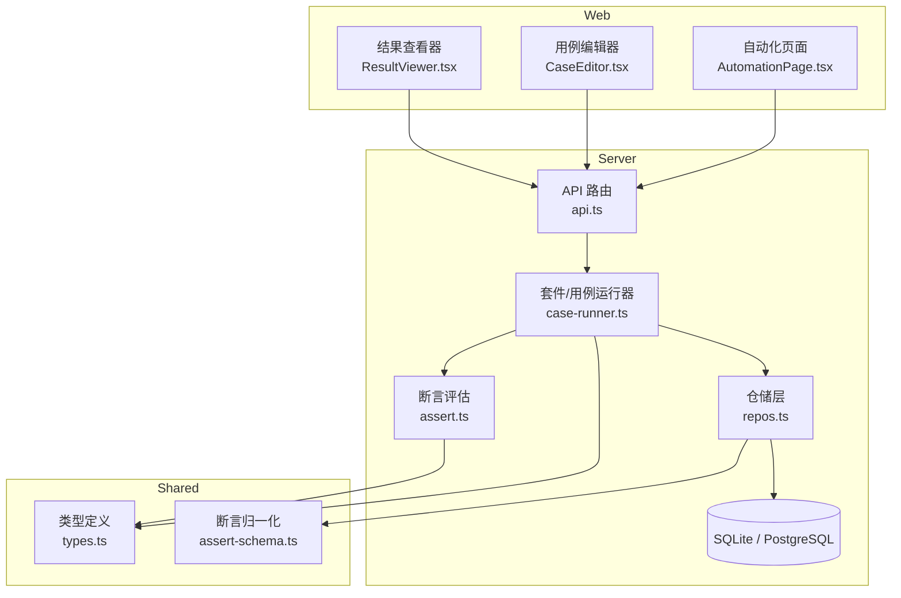
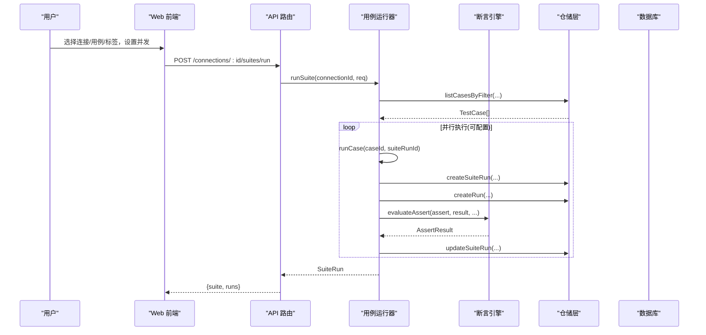
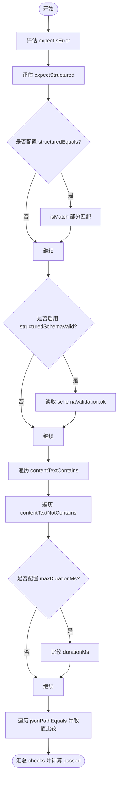
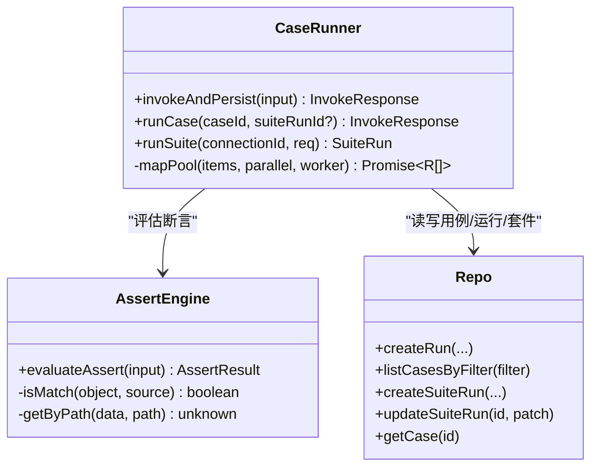
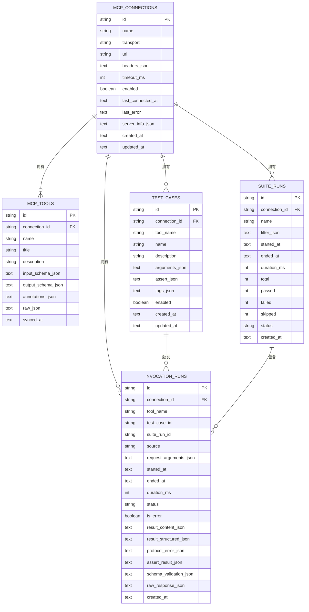
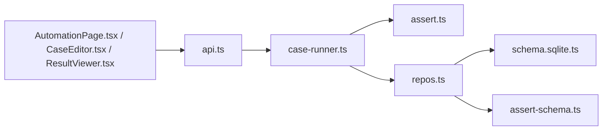

# 测试自动化

<cite>
**本文引用的文件**
- [README.md](file://README.md)
- [assert.ts](file://apps/server/src/services/assert.ts)
- [case-runner.ts](file://apps/server/src/services/case-runner.ts)
- [types.ts](file://packages/shared/src/types.ts)
- [assert-schema.ts](file://packages/shared/src/assert-schema.ts)
- [repos.ts](file://apps/server/src/db/repos.ts)
- [api.ts](file://apps/server/src/routes/api.ts)
- [CaseEditor.tsx](file://apps/web/src/components/CaseEditor.tsx)
- [AutomationPage.tsx](file://apps/web/src/pages/AutomationPage.tsx)
- [ResultViewer.tsx](file://apps/web/src/components/ResultViewer.tsx)
- [schema.sqlite.ts](file://apps/server/src/db/schema.sqlite.ts)
- [session-recovery.test.ts](file://scripts/session-recovery.test.ts)
</cite>

## 目录
1. [简介](#简介)
2. [项目结构](#项目结构)
3. [核心组件](#核心组件)
4. [架构总览](#架构总览)
5. [详细组件分析](#详细组件分析)
6. [依赖关系分析](#依赖关系分析)
7. [性能与并发](#性能与并发)
8. [故障排查指南](#故障排查指南)
9. [结论](#结论)
10. [附录：断言类型与使用示例](#附录断言类型与使用示例)

## 简介
本文件面向“MCP Tool Debug”的测试自动化能力，系统性说明如何创建、编辑和管理测试用例，配置断言，批量执行套件，以及分析测试结果。文档覆盖支持的断言类型（expectIsError、structuredEquals、contentTextContains、jsonPathEquals 等）、并行执行机制、执行状态监控、失败重试策略、回归测试最佳实践、测试数据管理与团队协作建议，并提供完整的用例示例路径与性能优化指南。

## 项目结构
本项目采用前后端分离与多包组织：
- 后端服务：Hono API + MCP 客户端 + 数据库访问层 + 断言引擎 + 套件运行器
- 前端界面：React + Ant Design，提供连接管理、工作台、自动化页面、结果查看与用例编辑器
- 共享类型与工具：断言归一化、类型定义
- 脚本与集成测试：会话恢复与安全性验证

图表来源
- [api.ts:1-277](file://apps/server/src/routes/api.ts#L1-L277)
- [case-runner.ts:1-161](file://apps/server/src/services/case-runner.ts#L1-L161)
- [assert.ts:1-166](file://apps/server/src/services/assert.ts#L1-L166)
- [repos.ts:1-660](file://apps/server/src/db/repos.ts#L1-L660)
- [types.ts:1-229](file://packages/shared/src/types.ts#L1-L229)
- [assert-schema.ts:1-32](file://packages/shared/src/assert-schema.ts#L1-L32)
- [AutomationPage.tsx:1-207](file://apps/web/src/pages/AutomationPage.tsx#L1-L207)
- [CaseEditor.tsx:1-168](file://apps/web/src/components/CaseEditor.tsx#L1-L168)
- [ResultViewer.tsx:1-390](file://apps/web/src/components/ResultViewer.tsx#L1-L390)

章节来源
- [README.md:1-193](file://README.md#L1-L193)

## 核心组件
- 断言引擎：负责解析并评估 AssertConfig，输出 AssertResult，包含逐项检查明细
- 用例运行器：封装一次调用、断言评估、持久化记录；支持单用例与套件批量执行
- 仓储层：统一读写连接、工具、用例、运行记录、套件运行元信息，并进行 JSON 序列化/反序列化与断言归一化
- API 路由：暴露连接、工具、用例、运行、套件等 REST 接口，并对敏感字段进行脱敏处理
- Web 界面：提供用例编辑、套件筛选与并发参数设置、历史套件列表与明细查看、结果多维展示

章节来源
- [assert.ts:1-166](file://apps/server/src/services/assert.ts#L1-L166)
- [case-runner.ts:1-161](file://apps/server/src/services/case-runner.ts#L1-L161)
- [repos.ts:1-660](file://apps/server/src/db/repos.ts#L1-L660)
- [api.ts:1-277](file://apps/server/src/routes/api.ts#L1-L277)
- [CaseEditor.tsx:1-168](file://apps/web/src/components/CaseEditor.tsx#L1-L168)
- [AutomationPage.tsx:1-207](file://apps/web/src/pages/AutomationPage.tsx#L1-L207)
- [ResultViewer.tsx:1-390](file://apps/web/src/components/ResultViewer.tsx#L1-L390)

## 架构总览
从请求到结果的端到端流程如下：

图表来源
- [api.ts:183-191](file://apps/server/src/routes/api.ts#L183-L191)
- [case-runner.ts:111-161](file://apps/server/src/services/case-runner.ts#L111-L161)
- [repos.ts:640-660](file://apps/server/src/db/repos.ts#L640-L660)
- [assert.ts:58-166](file://apps/server/src/services/assert.ts#L58-L166)

## 详细组件分析

### 断言引擎（evaluateAssert）
- 输入：断言配置、调用返回的状态与内容、耗时、Schema 校验结果
- 输出：是否通过及每个检查项的期望与实际值、消息
- 关键特性：
  - 结构化部分匹配：对 structuredContent 进行 isMatch 深度子集比较
  - 文本包含/排除：聚合 content 中 text 片段进行包含判断
  - JSONPath 相等：基于简单点号路径与数组索引提取值后 JSON.stringify 对比
  - 时长上限：durationMs 与 maxDurationMs 比较
  - Schema 有效性：根据 schemaValidation.ok 判定

图表来源
- [assert.ts:13-24](file://apps/server/src/services/assert.ts#L13-L24)
- [assert.ts:26-31](file://apps/server/src/services/assert.ts#L26-L31)
- [assert.ts:33-56](file://apps/server/src/services/assert.ts#L33-L56)
- [assert.ts:58-166](file://apps/server/src/services/assert.ts#L58-L166)

章节来源
- [assert.ts:1-166](file://apps/server/src/services/assert.ts#L1-L166)
- [types.ts:19-41](file://packages/shared/src/types.ts#L19-L41)

### 用例与套件运行器（runCase / runSuite）
- invokeAndPersist：调用 MCP Tool，可选保存运行记录；若配置断言则评估并写入 assertResult
- runCase：按用例持久化执行，标记 source 为 case 或 suite
- runSuite：按过滤条件加载用例，创建套件运行记录，按 parallel 并发执行，统计通过/失败/跳过，更新套件状态与耗时

图表来源
- [case-runner.ts:11-77](file://apps/server/src/services/case-runner.ts#L11-L77)
- [case-runner.ts:79-92](file://apps/server/src/services/case-runner.ts#L79-L92)
- [case-runner.ts:94-109](file://apps/server/src/services/case-runner.ts#L94-L109)
- [case-runner.ts:111-161](file://apps/server/src/services/case-runner.ts#L111-L161)
- [repos.ts:476-528](file://apps/server/src/db/repos.ts#L476-L528)
- [repos.ts:572-617](file://apps/server/src/db/repos.ts#L572-L617)
- [repos.ts:640-660](file://apps/server/src/db/repos.ts#L640-L660)

章节来源
- [case-runner.ts:1-161](file://apps/server/src/services/case-runner.ts#L1-L161)
- [repos.ts:476-660](file://apps/server/src/db/repos.ts#L476-L660)

### 仓储层与数据模型（repos + schema）
- 数据表：mcp_connections、mcp_tools、test_cases、suite_runs、invocation_runs
- 字段映射：JSON 字段统一以 safeJsonParse/jsonStringify 转换
- 断言归一化：normalizeAssert 确保断言结构完整且类型安全
- 查询与过滤：按 connectionId、toolNames、caseIds、tags 组合过滤用例

图表来源
- [schema.sqlite.ts:1-120](file://apps/server/src/db/schema.sqlite.ts#L1-L120)
- [repos.ts:1-209](file://apps/server/src/db/repos.ts#L1-L209)

章节来源
- [repos.ts:1-660](file://apps/server/src/db/repos.ts#L1-L660)
- [schema.sqlite.ts:1-120](file://apps/server/src/db/schema.sqlite.ts#L1-L120)
- [assert-schema.ts:1-32](file://packages/shared/src/assert-schema.ts#L1-L32)

### API 路由与安全
- 健康检查：返回当前方言与在线连接数
- 连接管理：增删改查、连接/断开、同步 Tools
- 工具调用：支持 save、testCaseId 等参数，自动持久化
- 用例管理：CRUD、按连接/工具列出
- 套件运行：POST /connections/:id/suites/run，返回套件统计
- 历史记录：按连接/工具/套件/状态分页查询
- 导入导出：ExportBundle 包含连接与用例，便于团队共享
- 安全：对外返回连接时仅暴露 headerNames，不泄露凭据值

章节来源
- [api.ts:1-277](file://apps/server/src/routes/api.ts#L1-L277)

### Web 界面：用例编辑与套件执行
- 用例编辑器：支持名称、描述、Tags、启用开关、arguments JSON 编辑、断言可视化配置（expectIsError、expectStructured、structuredSchemaValid、maxDurationMs、contentTextContains、structuredEquals）
- 自动化页面：选择连接、套件名、用例多选、Tags 过滤、并发度设置，提交后显示最近套件运行列表与明细弹窗

章节来源
- [CaseEditor.tsx:1-168](file://apps/web/src/components/CaseEditor.tsx#L1-L168)
- [AutomationPage.tsx:1-207](file://apps/web/src/pages/AutomationPage.tsx#L1-L207)

### 结果查看器
- 时间轴与状态标签：区分协议错误、工具错误、Schema 校验失败
- 结构化与非结构化内容分 Tab 展示
- 断言面板：逐条展示 check 名称、期望与实际、通过/失败
- Schema 校验详情：列出错误路径与消息
- 原始摘要：快速定位关键响应字段

章节来源
- [ResultViewer.tsx:1-390](file://apps/web/src/components/ResultViewer.tsx#L1-L390)

## 依赖关系分析
- 模块耦合
  - API 路由依赖运行器与仓储层，运行器依赖断言引擎与仓储层
  - 仓储层依赖共享断言归一化工具与数据库驱动
  - Web 前端通过 API 与后端交互，不直接依赖内部实现
- 外部依赖
  - Hono 作为轻量 HTTP 框架
  - Drizzle ORM 抽象 SQLite/PostgreSQL
  - MCP TypeScript SDK 用于连接与调用
- 潜在循环依赖
  - 当前分层清晰，未见循环引用

图表来源
- [api.ts:1-277](file://apps/server/src/routes/api.ts#L1-L277)
- [case-runner.ts:1-161](file://apps/server/src/services/case-runner.ts#L1-L161)
- [assert.ts:1-166](file://apps/server/src/services/assert.ts#L1-L166)
- [repos.ts:1-660](file://apps/server/src/db/repos.ts#L1-L660)
- [schema.sqlite.ts:1-120](file://apps/server/src/db/schema.sqlite.ts#L1-L120)
- [assert-schema.ts:1-32](file://packages/shared/src/assert-schema.ts#L1-L32)
- [AutomationPage.tsx:1-207](file://apps/web/src/pages/AutomationPage.tsx#L1-L207)
- [CaseEditor.tsx:1-168](file://apps/web/src/components/CaseEditor.tsx#L1-L168)
- [ResultViewer.tsx:1-390](file://apps/web/src/components/ResultViewer.tsx#L1-L390)

## 性能与并发
- 并发执行
  - runSuite 使用 mapPool 控制并行度，默认 1，最大建议不超过 8（UI 限制），避免对远端 MCP Server 造成压力
- 耗时断言
  - 通过 maxDurationMs 约束单次调用耗时，有助于发现性能退化
- 结果持久化
  - 每次调用均持久化 invocationRuns，便于后续分析与回溯
- 建议
  - 在 CI 环境中合理设置 parallel，结合超时与重试策略
  - 对大体积 structuredContent 谨慎使用 deep equals，优先使用 jsonPathEquals 精确断言

章节来源
- [case-runner.ts:94-109](file://apps/server/src/services/case-runner.ts#L94-L109)
- [case-runner.ts:111-161](file://apps/server/src/services/case-runner.ts#L111-L161)
- [assert.ts:136-147](file://apps/server/src/services/assert.ts#L136-L147)

## 故障排查指南
- 常见错误分类
  - 协议/连接错误：如 404、认证失败、网络异常
  - 工具错误：服务端业务逻辑报错
  - 超时：超过连接或调用超时阈值
  - Schema 校验失败：structuredContent 不符合 outputSchema
- 断言失败定位
  - 查看断言面板中的具体 check 名称与 message，定位是哪一项未通过
  - 使用“原始摘要”与“Schema 校验”Tab 辅助诊断
- 会话恢复与重试策略
  - 当遇到 404 表示会话失效时，系统会尝试重新初始化并安全重试一次；其他错误码（如 401、500）不进行重试
  - 工具错误与超时不会触发重试
- 凭据安全
  - 连接 API 只返回 headerNames，不泄露实际值；导入导出文件包含完整凭据，请妥善保管

章节来源
- [ResultViewer.tsx:22-37](file://apps/web/src/components/ResultViewer.tsx#L22-L37)
- [session-recovery.test.ts:197-228](file://scripts/session-recovery.test.ts#L197-L228)
- [session-recovery.test.ts:247-291](file://scripts/session-recovery.test.ts#L247-L291)
- [api.ts:24-30](file://apps/server/src/routes/api.ts#L24-L30)

## 结论
该测试自动化体系围绕“用例—断言—执行—记录—可视化”形成闭环，既满足日常调试与回归需求，也具备团队协作与持续集成扩展能力。通过灵活的断言类型、可控的并发执行与完善的错误分类，能够快速定位问题并保障 MCP Tools 的稳定性与兼容性。

## 附录：断言类型与使用示例
- expectIsError：期望 isError 布尔值
- expectStructured：期望存在 structuredContent
- structuredEquals：对 structuredContent 进行部分匹配（深度 isMatch）
- structuredSchemaValid：校验 structuredContent 是否符合 outputSchema
- contentTextContains：非结构化文本中包含指定字符串
- contentTextNotContains：非结构化文本中不包含指定字符串
- maxDurationMs：单次调用耗时上限
- jsonPathEquals：基于路径表达式提取值并与期望值 JSON.stringify 比较

使用示例路径
- 断言配置示例（参考 README 中的 JSON 片段）
  - [README.md:121-134](file://README.md#L121-L134)
- 断言归一化与默认值
  - [assert-schema.ts:1-32](file://packages/shared/src/assert-schema.ts#L1-L32)
- 断言评估实现
  - [assert.ts:58-166](file://apps/server/src/services/assert.ts#L58-L166)
- 用例编辑器断言字段
  - [CaseEditor.tsx:79-164](file://apps/web/src/components/CaseEditor.tsx#L79-L164)
- 套件运行与断言结果展示
  - [AutomationPage.tsx:175-206](file://apps/web/src/pages/AutomationPage.tsx#L175-L206)
  - [ResultViewer.tsx:196-213](file://apps/web/src/components/ResultViewer.tsx#L196-L213)

章节来源
- [README.md:121-134](file://README.md#L121-L134)
- [assert-schema.ts:1-32](file://packages/shared/src/assert-schema.ts#L1-L32)
- [assert.ts:58-166](file://apps/server/src/services/assert.ts#L58-L166)
- [CaseEditor.tsx:79-164](file://apps/web/src/components/CaseEditor.tsx#L79-L164)
- [AutomationPage.tsx:175-206](file://apps/web/src/pages/AutomationPage.tsx#L175-L206)
- [ResultViewer.tsx:196-213](file://apps/web/src/components/ResultViewer.tsx#L196-L213)