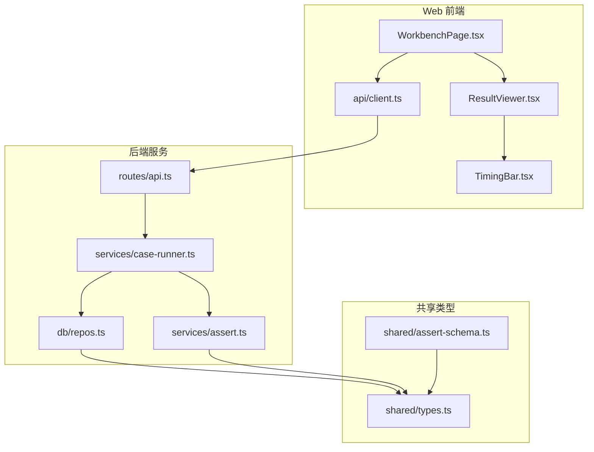
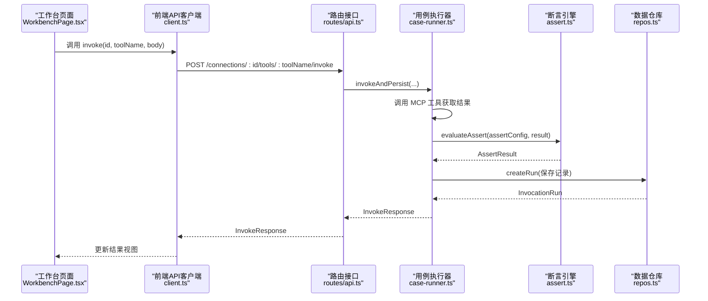
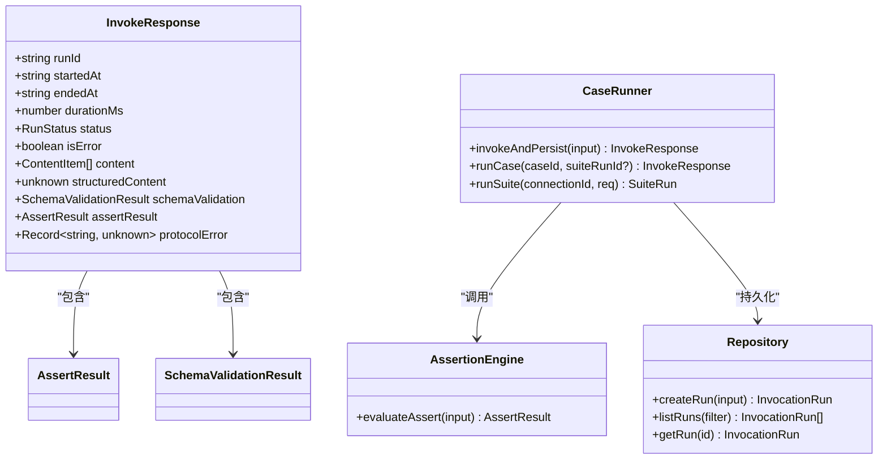

# 结果分析

<cite>
**本文引用的文件**   
- [ResultViewer.tsx](file://apps/web/src/components/ResultViewer.tsx)
- [TimingBar.tsx](file://apps/web/src/components/TimingBar.tsx)
- [types.ts](file://packages/shared/src/types.ts)
- [assert-schema.ts](file://packages/shared/src/assert-schema.ts)
- [assert.ts](file://apps/server/src/services/assert.ts)
- [case-runner.ts](file://apps/server/src/services/case-runner.ts)
- [api.ts](file://apps/server/src/routes/api.ts)
- [repos.ts](file://apps/server/src/db/repos.ts)
- [client.ts](file://apps/web/src/api/client.ts)
- [WorkbenchPage.tsx](file://apps/web/src/pages/WorkbenchPage.tsx)
</cite>

## 目录
1. [简介](#简介)
2. [项目结构](#项目结构)
3. [核心组件](#核心组件)
4. [架构总览](#架构总览)
5. [详细组件分析](#详细组件分析)
6. [依赖关系分析](#依赖关系分析)
7. [性能与可扩展性](#性能与可扩展性)
8. [故障诊断指南](#故障诊断指南)
9. [结论](#结论)
10. [附录：API 与数据模型](#附录api-与数据模型)

## 简介
本文件聚焦“测试结果分析”能力，覆盖以下主题：
- 测试结果的数据结构与状态标识
- 成功/失败判断逻辑与断言可视化
- 错误信息提取与诊断要点
- 历史记录查询、过滤、对比与趋势统计
- 结果导出、报告生成与 CI/CD 集成实践
- 结果分析示例与常见问题排查方法

## 项目结构
围绕“结果分析”，关键代码分布在 Web 展示层、服务端执行与持久化层、以及共享类型定义中。下图给出与结果分析相关的模块关系概览。

图表来源
- [WorkbenchPage.tsx:1-120](file://apps/web/src/pages/WorkbenchPage.tsx#L1-L120)
- [ResultViewer.tsx:1-120](file://apps/web/src/components/ResultViewer.tsx#L1-L120)
- [TimingBar.tsx:1-52](file://apps/web/src/components/TimingBar.tsx#L1-L52)
- [client.ts:1-122](file://apps/web/src/api/client.ts#L1-L122)
- [api.ts:117-138](file://apps/server/src/routes/api.ts#L117-L138)
- [case-runner.ts:11-77](file://apps/server/src/services/case-runner.ts#L11-L77)
- [assert.ts:58-166](file://apps/server/src/services/assert.ts#L58-L166)
- [repos.ts:476-570](file://apps/server/src/db/repos.ts#L476-L570)
- [types.ts:150-229](file://packages/shared/src/types.ts#L150-L229)
- [assert-schema.ts:1-32](file://packages/shared/src/assert-schema.ts#L1-L32)

章节来源
- [WorkbenchPage.tsx:1-120](file://apps/web/src/pages/WorkbenchPage.tsx#L1-L120)
- [ResultViewer.tsx:1-120](file://apps/web/src/components/ResultViewer.tsx#L1-L120)
- [TimingBar.tsx:1-52](file://apps/web/src/components/TimingBar.tsx#L1-L52)
- [client.ts:1-122](file://apps/web/src/api/client.ts#L1-L122)
- [api.ts:117-138](file://apps/server/src/routes/api.ts#L117-L138)
- [case-runner.ts:11-77](file://apps/server/src/services/case-runner.ts#L11-L77)
- [assert.ts:58-166](file://apps/server/src/services/assert.ts#L58-L166)
- [repos.ts:476-570](file://apps/server/src/db/repos.ts#L476-L570)
- [types.ts:150-229](file://packages/shared/src/types.ts#L150-L229)
- [assert-schema.ts:1-32](file://packages/shared/src/assert-schema.ts#L1-L32)

## 核心组件
- 结果展示组件 ResultViewer：负责渲染调用时间线、状态标签、结构化与非结构化内容、Schema 校验结果、断言明细与原始摘要。
- 耗时条 TimingBar：统一展示发起/结束时间与耗时，并以颜色区分运行状态。
- 断言引擎 assert.evaluateAssert：根据用例配置的 AssertConfig 对一次调用的结果进行逐项检查，输出 AssertResult。
- 用例执行 case-runner.invokeAndPersist：封装一次工具调用、断言计算与记录持久化，返回 InvokeResponse。
- 历史查询 repos.listRuns：支持按连接、工具、套件、状态等维度过滤并分页返回 InvocationRun 列表。
- 共享类型 types.ts：统一定义了 InvokeResponse、InvocationRun、AssertConfig、AssertResult、SchemaValidationResult 等核心数据结构。

章节来源
- [ResultViewer.tsx:228-390](file://apps/web/src/components/ResultViewer.tsx#L228-L390)
- [TimingBar.tsx:18-52](file://apps/web/src/components/TimingBar.tsx#L18-L52)
- [assert.ts:58-166](file://apps/server/src/services/assert.ts#L58-L166)
- [case-runner.ts:11-77](file://apps/server/src/services/case-runner.ts#L11-L77)
- [repos.ts:530-570](file://apps/server/src/db/repos.ts#L530-L570)
- [types.ts:150-229](file://packages/shared/src/types.ts#L150-L229)

## 架构总览
一次工具调用从 Web 到后端的完整链路如下：

图表来源
- [WorkbenchPage.tsx:101-122](file://apps/web/src/pages/WorkbenchPage.tsx#L101-L122)
- [client.ts:60-68](file://apps/web/src/api/client.ts#L60-L68)
- [api.ts:117-138](file://apps/server/src/routes/api.ts#L117-L138)
- [case-runner.ts:11-77](file://apps/server/src/services/case-runner.ts#L11-L77)
- [assert.ts:58-166](file://apps/server/src/services/assert.ts#L58-L166)
- [repos.ts:476-528](file://apps/server/src/db/repos.ts#L476-L528)

## 详细组件分析

### 数据结构与状态标识
- InvokeResponse（单次调用响应）包含：
  - runId、startedAt、endedAt、durationMs、status、isError
  - content（非结构化）、structuredContent（结构化）、schemaValidation（输出 Schema 校验）、assertResult（断言结果）、protocolError（协议错误）
- InvocationRun（持久化记录）与 InvokeResponse 字段基本一致，用于历史查询与回放。
- RunStatus 枚举值包括 success、tool_error、protocol_error、timeout、cancelled；isError 为布尔位，表示工具侧 isError 标志。
- AssertConfig 描述断言规则，如 expectIsError、expectStructured、structuredEquals、structuredSchemaValid、contentTextContains/NotContains、maxDurationMs、jsonPathEquals。
- AssertResult 由若干 AssertCheck 组成，每个 Check 包含 name、passed、message、expected、actual。
- SchemaValidationResult 包含 ok 与 errors 列表，errors 每项含 path 与 message。

章节来源
- [types.ts:150-229](file://packages/shared/src/types.ts#L150-L229)
- [types.ts:14-46](file://packages/shared/src/types.ts#L14-L46)
- [types.ts:194-206](file://packages/shared/src/types.ts#L194-L206)

### 成功/失败判断逻辑
- 基础状态：
  - status 为 success 且 isError 为 false 时，视为成功。
  - status 为 tool_error 或 isError 为 true 时，视为工具执行错误。
  - status 为 protocol_error 或 timeout 时，视为协议/连接错误。
- 断言判定：
  - 若配置了断言，则以 AssertResult.passed 为准；否则回退到 status 与 isError 的组合。
  - 断言引擎会逐项评估各项规则，最终 passed 为所有 checks 的 AND。
- 输出 Schema 校验：
  - schemaValidation.ok 为 true 表示 structuredContent 符合 outputSchema；否则在 UI 中以告警形式展示具体错误路径与消息。

章节来源
- [case-runner.ts:134-146](file://apps/server/src/services/case-runner.ts#L134-L146)
- [assert.ts:58-166](file://apps/server/src/services/assert.ts#L58-L166)
- [ResultViewer.tsx:240-326](file://apps/web/src/components/ResultViewer.tsx#L240-L326)

### 断言结果的可视化呈现
- 断言面板：
  - 顶部以 Tag 显示整体通过/失败。
  - 下方列出每条检查项的名称、是否通过及简要消息。
- 结构化输出：
  - 使用 JSON 编辑器只读展示 structuredContent。
- 非结构化内容：
  - text 内容以 Markdown 渲染，支持表格、链接、代码块等。
  - image/audio/resource_link/resource 等多媒体资源分别渲染。
- Schema 校验：
  - 未通过时，以告警框展示前若干条错误项（path + message）。
- 原始摘要：
  - 提供 status、isError、durationMs、protocolError、content、structuredContent、schemaValidation 的快照。

章节来源
- [ResultViewer.tsx:196-213](file://apps/web/src/components/ResultViewer.tsx#L196-L213)
- [ResultViewer.tsx:328-386](file://apps/web/src/components/ResultViewer.tsx#L328-L386)
- [ResultViewer.tsx:83-185](file://apps/web/src/components/ResultViewer.tsx#L83-L185)
- [ResultViewer.tsx:187-194](file://apps/web/src/components/ResultViewer.tsx#L187-L194)

### 错误信息的诊断分析
- 协议/连接错误：
  - 当 status 为 protocol_error 或 timeout，或存在 protocolError 时，优先展示 protocolError 详情。
- 工具错误：
  - 当 isError 为 true 或 status 为 tool_error 时，尝试从 structuredContent.error/message/raw_response.msg/msg 或文本内容中提取错误信息。
- 输出 Schema 不匹配：
  - 展示 structuredContent 与 outputSchema 不一致的具体路径与错误消息，便于定位字段缺失或类型不符。

章节来源
- [ResultViewer.tsx:22-37](file://apps/web/src/components/ResultViewer.tsx#L22-L37)
- [ResultViewer.tsx:262-303](file://apps/web/src/components/ResultViewer.tsx#L262-L303)
- [ResultViewer.tsx:305-326](file://apps/web/src/components/ResultViewer.tsx#L305-L326)

### 历史记录查询、过滤、对比与趋势统计
- 查询与过滤：
  - 支持按 connectionId、toolName、suiteRunId、status 过滤，并可限制返回数量。
- 对比分析：
  - 在工作台“历史”页可点击“查看”将某次记录的请求参数与结果载入右侧视图，便于前后对比。
  - 也可点击“重用参数”快速回填表单再次调用。
- 趋势统计：
  - 套件运行结果包含 total/passed/failed/skipped/status/durationMs，可用于统计通过率与回归趋势。
  - 结合 runs 列表可按时间顺序观察状态分布与耗时变化。

章节来源
- [repos.ts:530-570](file://apps/server/src/db/repos.ts#L530-L570)
- [WorkbenchPage.tsx:329-406](file://apps/web/src/pages/WorkbenchPage.tsx#L329-L406)
- [types.ts:172-186](file://packages/shared/src/types.ts#L172-L186)

### 结果导出、报告生成与 CI/CD 集成最佳实践
- 导出：
  - 提供 /export 接口，导出连接与用例（不含敏感 Header 值），便于备份与迁移。
- 导入：
  - 提供 /import 接口，批量恢复连接与用例。
- 报告生成建议：
  - 基于套件运行结果（SuiteRun）与对应 runs 列表，汇总通过率、失败原因分类、平均耗时与 P95/P99 耗时，生成 HTML/Markdown 报告。
  - 可将报告作为构建产物上传至制品库或发布到内部站点。
- CI/CD 集成：
  - 在流水线中调用 /connections/:id/suites/run 执行套件，解析返回的 SuiteRun 状态与计数，决定步骤成败。
  - 可选：拉取最近 N 次 runs 做趋势分析，并在 PR 评论中展示差异。

章节来源
- [api.ts:227-271](file://apps/server/src/routes/api.ts#L227-L271)
- [api.ts:183-191](file://apps/server/src/routes/api.ts#L183-L191)
- [types.ts:216-229](file://packages/shared/src/types.ts#L216-L229)

### 结果分析示例
- 示例一：结构化输出校验失败
  - 现象：Schema 校验未通过，断言 structuredSchemaValid 失败。
  - 处理：查看 Schema 校验错误列表中的 path 与 message，修正服务端输出或调整 outputSchema。
- 示例二：内容包含断言失败
  - 现象：contentTextContains 未命中目标字符串。
  - 处理：确认 text 内容是否被正确拼接，必要时增加 contentTextNotContains 排除干扰片段。
- 示例三：JSONPath 断言失败
  - 现象：jsonPathEquals 指定路径的值与实际不符。
  - 处理：核对路径语法与数组索引，确保结构化输出结构稳定。
- 示例四：超时与协议错误
  - 现象：status 为 timeout 或 protocol_error。
  - 处理：检查网络连通性、MCP Server 健康、超时配置与重试策略。

章节来源
- [ResultViewer.tsx:305-326](file://apps/web/src/components/ResultViewer.tsx#L305-L326)
- [assert.ts:114-159](file://apps/server/src/services/assert.ts#L114-L159)
- [ResultViewer.tsx:262-303](file://apps/web/src/components/ResultViewer.tsx#L262-L303)

## 依赖关系分析
- 前端依赖：
  - WorkbenchPage 依赖 api/client 发起调用与查询，依赖 ResultViewer 与 TimingBar 展示结果。
- 后端依赖：
  - routes/api 依赖 services/case-runner 执行调用与断言，依赖 db/repos 持久化与查询。
  - services/assert 依赖 shared/types 提供的断言配置与结果类型。
- 共享类型：
  - packages/shared/types 被前后端共同引用，保证契约一致性。

图表来源
- [types.ts:194-206](file://packages/shared/src/types.ts#L194-L206)
- [assert.ts:58-166](file://apps/server/src/services/assert.ts#L58-L166)
- [case-runner.ts:11-77](file://apps/server/src/services/case-runner.ts#L11-L77)
- [repos.ts:476-570](file://apps/server/src/db/repos.ts#L476-L570)

章节来源
- [client.ts:1-122](file://apps/web/src/api/client.ts#L1-L122)
- [api.ts:117-138](file://apps/server/src/routes/api.ts#L117-L138)
- [case-runner.ts:11-77](file://apps/server/src/services/case-runner.ts#L11-L77)
- [assert.ts:58-166](file://apps/server/src/services/assert.ts#L58-L166)
- [repos.ts:476-570](file://apps/server/src/db/repos.ts#L476-L570)
- [types.ts:194-206](file://packages/shared/src/types.ts#L194-L206)

## 性能与可扩展性
- 并发套件执行：
  - 套件运行采用固定线程池并行执行用例，提升吞吐。
- 结果持久化：
  - 每次调用均持久化，便于回溯与审计；建议在高频场景下合理设置 limit 与清理策略。
- 前端渲染优化：
  - 大对象 JSON 使用只读编辑器，避免频繁重绘；Markdown 渲染按需启用。
- 扩展点：
  - 断言引擎可扩展新的检查项（如正则匹配、数值范围、自定义函数）。
  - 报告生成可接入第三方模板引擎，输出 PDF/HTML。

章节来源
- [case-runner.ts:94-109](file://apps/server/src/services/case-runner.ts#L94-L109)
- [repos.ts:530-570](file://apps/server/src/db/repos.ts#L530-L570)
- [ResultViewer.tsx:215-226](file://apps/web/src/components/ResultViewer.tsx#L215-L226)

## 故障诊断指南
- 协议/连接错误
  - 检查 status 是否为 protocol_error 或 timeout，查看 protocolError 详情。
  - 确认 MCP Server 地址、Headers、超时配置与网络可达性。
- 工具执行错误
  - 关注 isError 与 status=tool_error，查看 structuredContent 中的 error/message 或文本内容。
- Schema 校验失败
  - 查看 schemaValidation.errors 中的 path 与 message，修正服务端输出或调整 outputSchema。
- 断言失败
  - 在断言面板逐条检查 failed 的 check，对照 expected/actual 定位差异。
- 历史回放
  - 在“历史”页选择某条记录，点击“查看”加载结果，点击“重用参数”复现问题。

章节来源
- [ResultViewer.tsx:262-326](file://apps/web/src/components/ResultViewer.tsx#L262-L326)
- [ResultViewer.tsx:196-213](file://apps/web/src/components/ResultViewer.tsx#L196-L213)
- [WorkbenchPage.tsx:355-406](file://apps/web/src/pages/WorkbenchPage.tsx#L355-L406)

## 结论
本项目提供了完整的测试结果分析与诊断能力：清晰的状态标识、强大的断言体系、丰富的可视化展示、完善的查询与导出机制，能够满足从单点调试到回归测试的全流程需求。通过合理的断言设计与历史回放，团队可以快速定位问题、验证修复效果，并将结果纳入持续集成流程，保障 MCP Tools 的质量与稳定性。

## 附录：API 与数据模型

### 关键 API
- 健康检查
  - GET /api/health
- 连接管理
  - GET/POST/PATCH/DELETE /api/connections
  - POST /api/connections/:id/connect|disconnect
  - POST /api/connections/:id/sync-tools
  - GET /api/connections/:id/tools[?q]
  - GET /api/connections/:id/tools/:toolName
- 工具调用
  - POST /api/connections/:id/tools/:toolName/invoke
- 用例管理
  - GET/POST /api/connections/:id/tools/:toolName/cases
  - PATCH/DELETE /api/cases/:id
  - POST /api/cases/:id/run
- 套件运行
  - POST /api/connections/:id/suites/run
  - GET /api/suite-runs[?connectionId]
  - GET /api/suite-runs/:id
- 历史记录
  - GET /api/runs[?connectionId&toolName&suiteRunId&status&limit]
  - GET /api/runs/:id
  - DELETE /api/runs/:id
- 导入导出
  - GET /api/export
  - POST /api/import

章节来源
- [api.ts:32-38](file://apps/server/src/routes/api.ts#L32-L38)
- [api.ts:41-115](file://apps/server/src/routes/api.ts#L41-L115)
- [api.ts:117-138](file://apps/server/src/routes/api.ts#L117-L138)
- [api.ts:140-191](file://apps/server/src/routes/api.ts#L140-L191)
- [api.ts:193-225](file://apps/server/src/routes/api.ts#L193-L225)
- [api.ts:227-271](file://apps/server/src/routes/api.ts#L227-L271)

### 核心数据模型
- InvokeResponse：单次调用响应，包含时间、状态、内容与断言/Schema 校验结果。
- InvocationRun：持久化的调用记录，用于历史查询与回放。
- AssertConfig/AssertResult/AssertCheck：断言配置与结果。
- SchemaValidationResult：输出 Schema 校验结果。
- SuiteRun：套件运行聚合结果（总数、通过/失败/跳过、状态、耗时）。

章节来源
- [types.ts:150-229](file://packages/shared/src/types.ts#L150-L229)
- [types.ts:14-46](file://packages/shared/src/types.ts#L14-L46)
- [types.ts:172-186](file://packages/shared/src/types.ts#L172-L186)