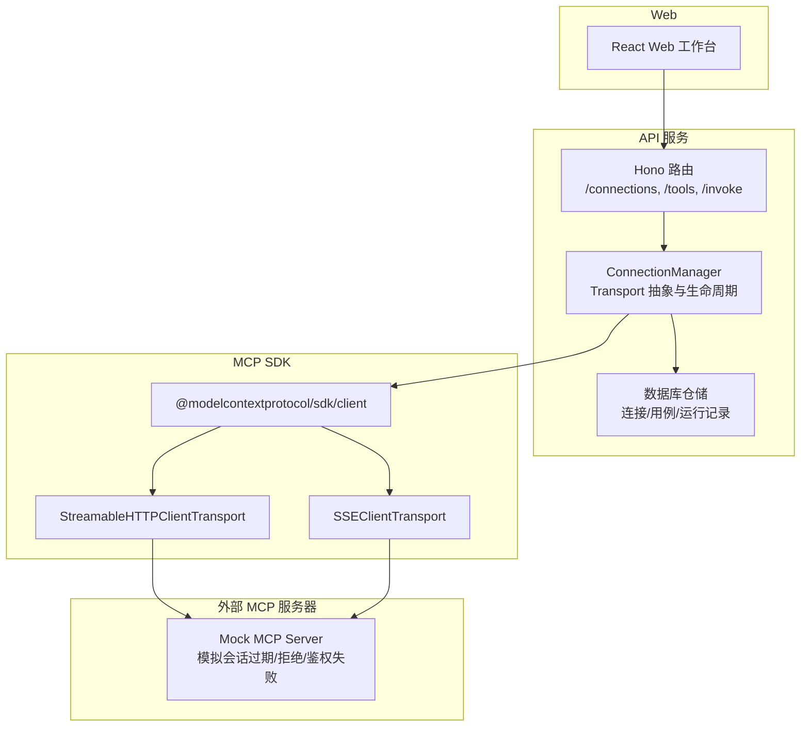
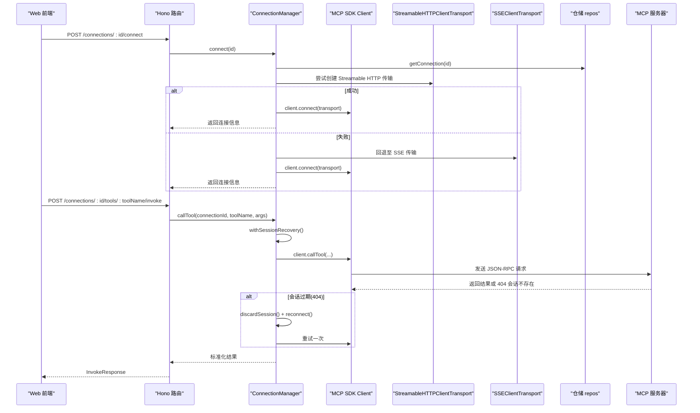
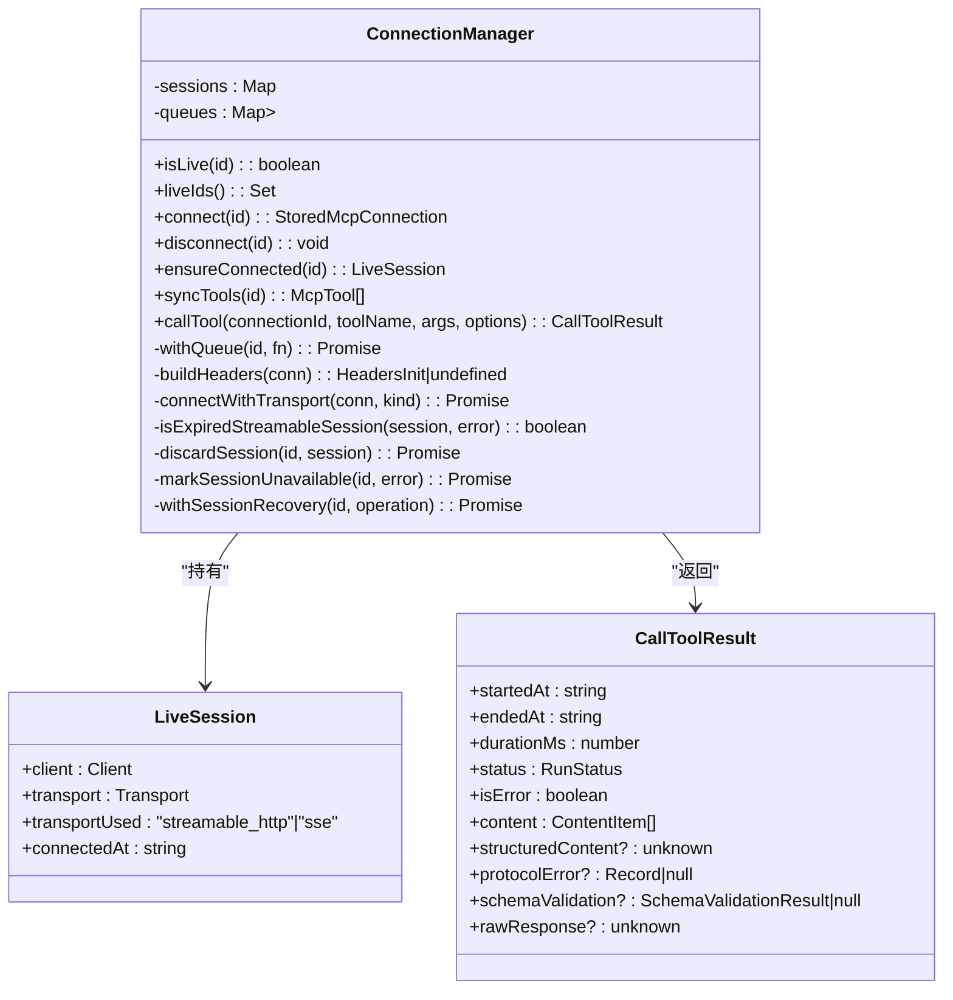
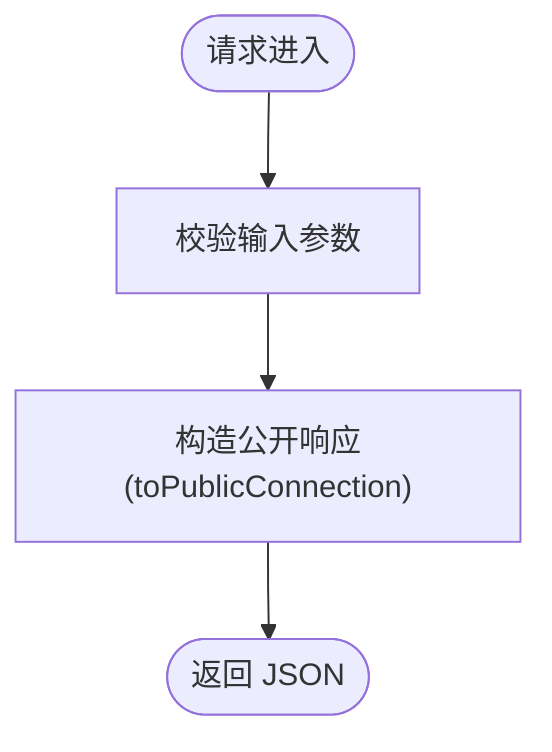
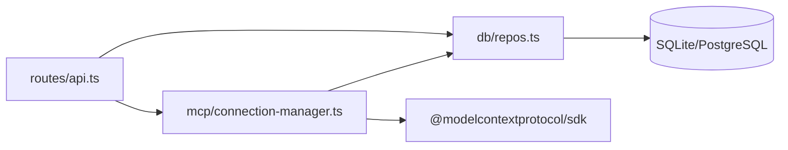

# MCP 协议抽象层

<cite>
**本文引用的文件**   
- [README.md](file://README.md)
- [package.json](file://package.json)
- [connection-manager.ts](file://apps/server/src/mcp/connection-manager.ts)
- [api.ts](file://apps/server/src/routes/api.ts)
- [repos.ts](file://apps/server/src/db/repos.ts)
- [types.ts](file://packages/shared/src/types.ts)
- [case-runner.ts](file://apps/server/src/services/case-runner.ts)
- [session-recovery.test.ts](file://scripts/session-recovery.test.ts)
- [mock-mcp-server.ts](file://scripts/mock-mcp-server.ts)
</cite>

## 目录
1. [简介](#简介)
2. [项目结构](#项目结构)
3. [核心组件](#核心组件)
4. [架构总览](#架构总览)
5. [详细组件分析](#详细组件分析)
6. [依赖关系分析](#依赖关系分析)
7. [性能考量](#性能考量)
8. [故障排查指南](#故障排查指南)
9. [结论](#结论)
10. [附录：扩展新传输协议的实践](#附录扩展新传输协议的实践)

## 简介
本文件聚焦于 MCP（Model Context Protocol）协议抽象层的设计与实现，围绕 Streamable HTTP 与 SSE 两种传输方式的统一抽象、自动检测与回退机制展开。文档覆盖以下主题：
- Transport 接口的统一抽象与具体实现
- 协议自动检测与回退策略
- 请求初始化配置、自定义 Headers 处理与认证集成
- 协议特定的错误处理、连接超时管理与资源清理
- 协议兼容性测试与回归验证
- 性能对比分析与最佳实践建议
- 如何扩展新的传输协议支持（含代码示例路径）

## 项目结构
本项目采用多包工作区组织，MCP 协议抽象层位于后端服务中，通过 Hono API 暴露连接管理、工具同步与调用等能力；共享类型定义在 packages/shared 中；测试脚本提供会话恢复与兼容性的端到端验证。

图表来源
- [api.ts:1-120](file://apps/server/src/routes/api.ts#L1-L120)
- [connection-manager.ts:1-120](file://apps/server/src/mcp/connection-manager.ts#L1-L120)
- [repos.ts:235-312](file://apps/server/src/db/repos.ts#L235-L312)
- [mock-mcp-server.ts:1-120](file://scripts/mock-mcp-server.ts#L1-L120)

章节来源
- [README.md:145-156](file://README.md#L145-L156)
- [package.json:1-48](file://package.json#L1-L48)

## 核心组件
- ConnectionManager：封装 MCP 客户端连接、传输选择、会话恢复、超时控制与结果归一化。
- API 路由：对外暴露连接管理、工具同步、工具调用、用例执行与套件运行接口。
- 仓储层 repos：持久化连接、工具、用例、运行记录，并维护连接状态与头部信息。
- 共享类型 types：定义传输类型、运行状态、断言配置、内容项等跨模块契约。
- 用例执行 case-runner：编排调用、断言评估与持久化。
- 测试与 Mock：端到端验证会话恢复、鉴权失败、超时与安全性。

章节来源
- [connection-manager.ts:1-383](file://apps/server/src/mcp/connection-manager.ts#L1-L383)
- [api.ts:1-277](file://apps/server/src/routes/api.ts#L1-L277)
- [repos.ts:1-659](file://apps/server/src/db/repos.ts#L1-L659)
- [types.ts:1-229](file://packages/shared/src/types.ts#L1-L229)
- [case-runner.ts:1-161](file://apps/server/src/services/case-runner.ts#L1-L161)

## 架构总览
下图展示从 Web 到 MCP 服务器的完整调用链路，以及连接管理器对传输的抽象与回退逻辑。

图表来源
- [api.ts:77-138](file://apps/server/src/routes/api.ts#L77-L138)
- [connection-manager.ts:75-147](file://apps/server/src/mcp/connection-manager.ts#L75-L147)
- [connection-manager.ts:209-268](file://apps/server/src/mcp/connection-manager.ts#L209-L268)
- [repos.ts:235-312](file://apps/server/src/db/repos.ts#L235-L312)

## 详细组件分析

### 组件 A：ConnectionManager（Transport 抽象与会话管理）
- 职责
  - 根据连接配置选择传输（streamable_http、sse、auto）。
  - 构建请求初始化参数（Headers），注入认证凭据。
  - 管理 LiveSession 生命周期（connect/disconnect/ensureConnected）。
  - 会话恢复：当检测到 Streamable HTTP 会话 404 时，丢弃旧会话并重连，最多重试一次。
  - 超时控制：为每次 Tool 调用设置 AbortController 与 Promise.race 超时。
  - 结果归一化：区分 success/tool_error/timeout/protocol_error，并附加 schema 校验结果。
- 关键数据结构
  - LiveSession：包含 client、transport、transportUsed、connectedAt。
  - CallToolResult：标准化后的调用结果。
- 错误处理
  - 将底层 StreamableHTTPError 的 code 映射为协议错误详情。
  - 非 404 的 HTTP 错误（如 401/500）不触发重连，直接标记不可用。
- 资源清理
  - disconnect 中优先调用 transport.terminateSession（若存在），再关闭 client。
  - discardSession 仅关闭本地 transport，避免使用失效 session ID 再次 DELETE。

图表来源
- [connection-manager.ts:19-38](file://apps/server/src/mcp/connection-manager.ts#L19-L38)
- [connection-manager.ts:39-173](file://apps/server/src/mcp/connection-manager.ts#L39-L173)
- [connection-manager.ts:175-268](file://apps/server/src/mcp/connection-manager.ts#L175-L268)
- [connection-manager.ts:300-379](file://apps/server/src/mcp/connection-manager.ts#L300-L379)

章节来源
- [connection-manager.ts:1-383](file://apps/server/src/mcp/connection-manager.ts#L1-L383)

### 组件 B：API 路由（连接与调用入口）
- 职责
  - 暴露连接 CRUD、连接/断开、工具同步、工具调用、用例与套件运行等 REST 接口。
  - 将内部存储的连接对象转换为公开对象，隐藏敏感 Header 值，仅返回名称列表。
- 安全设计
  - toPublicConnection 剥离 headers，仅保留 headerNames，防止凭据泄露。
  - 导入导出功能仅在服务端侧写入，导出文件包含完整凭据，需用户妥善保管。

图表来源
- [api.ts:24-30](file://apps/server/src/routes/api.ts#L24-L30)
- [api.ts:77-138](file://apps/server/src/routes/api.ts#L77-L138)

章节来源
- [api.ts:1-277](file://apps/server/src/routes/api.ts#L1-L277)

### 组件 C：仓储层 repos（连接与状态持久化）
- 职责
  - 连接：创建、更新、删除、查询，维护 transport/url/headers/timeout 等字段。
  - 工具：替换与查询工具元数据（inputSchema/outputSchema/raw）。
  - 用例与运行：保存用例、批量筛选、记录每次调用的详细结果与断言。
  - 连接状态：记录 lastConnectedAt、lastError、serverInfo。
- 数据类型
  - StoredMcpConnection：内部存储结构，包含 headers 明文（仅服务端可见）。
  - McpConnection：对外公开结构，headerNames 仅列名，不含值。

章节来源
- [repos.ts:25-69](file://apps/server/src/db/repos.ts#L25-L69)
- [repos.ts:235-312](file://apps/server/src/db/repos.ts#L235-L312)
- [repos.ts:314-382](file://apps/server/src/db/repos.ts#L314-L382)
- [repos.ts:476-570](file://apps/server/src/db/repos.ts#L476-L570)

### 组件 D：共享类型 types（契约与枚举）
- 传输类型：TransportType = "streamable_http" | "sse" | "auto"
- 运行状态：RunStatus = "success" | "tool_error" | "protocol_error" | "timeout" | "cancelled"
- 套件状态：SuiteStatus = "running" | "passed" | "failed" | "cancelled"
- 断言配置：AssertConfig（结构化输出校验、文本包含、耗时上限、JSONPath 等）
- 内容项：ContentItem（text/data/mimeType/uri/resource 等）

章节来源
- [types.ts:1-229](file://packages/shared/src/types.ts#L1-L229)

### 组件 E：用例执行 case-runner（编排与持久化）
- 职责
  - invokeAndPersist：调用 ConnectionManager.callTool，可选断言评估，持久化为运行记录。
  - runCase/runSuite：按用例/套件过滤并行执行，统计通过/失败数量，更新套件状态。

章节来源
- [case-runner.ts:1-161](file://apps/server/src/services/case-runner.ts#L1-L161)

## 依赖关系分析
- 模块耦合
  - API 路由依赖 ConnectionManager 与 repos。
  - ConnectionManager 依赖 MCP SDK 的 Client 与具体 Transport 实现，同时读写 repos。
  - repos 依赖 Drizzle ORM 与数据库方言（SQLite/PostgreSQL）。
- 外部依赖
  - @modelcontextprotocol/sdk：提供 Client、StreamableHTTP/SSE 传输与错误类型。
  - Hono：轻量 HTTP 框架。
  - Drizzle ORM：跨数据库访问。
- 潜在循环依赖
  - 当前无循环依赖迹象，模块边界清晰。

图表来源
- [api.ts:1-120](file://apps/server/src/routes/api.ts#L1-L120)
- [connection-manager.ts:1-120](file://apps/server/src/mcp/connection-manager.ts#L1-L120)
- [repos.ts:1-60](file://apps/server/src/db/repos.ts#L1-L60)

章节来源
- [api.ts:1-277](file://apps/server/src/routes/api.ts#L1-L277)
- [connection-manager.ts:1-383](file://apps/server/src/mcp/connection-manager.ts#L1-L383)
- [repos.ts:1-659](file://apps/server/src/db/repos.ts#L1-L659)

## 性能考量
- 并发与队列
  - ConnectionManager 使用 withQueue 保证同一连接的串行操作，避免竞态与重复重连风暴。
- 超时控制
  - 每次调用使用 AbortController 与 Promise.race 进行超时，避免长尾请求阻塞。
- 会话恢复
  - 仅在 Streamable HTTP 且 404 场景下触发一次重连，减少不必要的开销。
- 数据传输
  - 工具元数据与运行记录以 JSON 字符串形式持久化，读取时按需解析，降低 I/O 压力。
- 建议
  - 合理设置 timeoutMs，避免过短导致误判超时，过长影响吞吐。
  - 在高并发场景下，结合反向代理与连接池优化网络延迟。
  - 对大体积 structuredContent 谨慎断言与序列化，避免内存峰值。

## 故障排查指南
- 常见问题定位
  - 连接失败：检查 transport 配置、URL 可达性与 CORS。
  - 会话过期：观察是否出现 404 会话不存在，确认是否触发一次重连。
  - 鉴权失败：401 不会触发重连，需检查 Authorization/Header 是否正确。
  - 超时：确认 timeoutMs 与远端处理耗时，必要时调整。
- 日志与事件
  - 会话恢复开始/成功/失败会输出结构化日志，便于追踪。
- 安全注意事项
  - 公开 API 不返回 headers 值，仅返回名称列表；导出文件包含完整凭据，请妥善保存。

章节来源
- [connection-manager.ts:175-268](file://apps/server/src/mcp/connection-manager.ts#L175-L268)
- [api.ts:24-30](file://apps/server/src/routes/api.ts#L24-L30)

## 结论
本抽象层通过 ConnectionManager 统一了 Streamable HTTP 与 SSE 两种传输方式，实现了自动检测与回退、会话恢复、超时控制与安全隔离。仓储层与共享类型确保了数据一致性与跨模块契约稳定。端到端测试覆盖了会话恢复、鉴权失败、超时与安全性等关键场景，具备良好的可维护性与可扩展性。

## 附录：扩展新传输协议的实践

### 目标
在不改动上层 API 的前提下，新增一种新的传输协议（例如 WebSocket 或 gRPC-Web），并保持与现有 auto 回退机制兼容。

### 步骤概览
- 定义新的传输类型
  - 在共享类型中添加新枚举值（例如 "websocket"）。
- 实现传输适配
  - 在 ConnectionManager 中新增对应分支，构造新的 Transport 实例并传入 requestInit（包含自定义 Headers）。
- 更新自动检测顺序
  - 在 tryOrder 中插入新传输类型，确保优先级符合业务预期。
- 错误处理与恢复
  - 若新传输具备会话语义，参考 isExpiredStreamableSession 模式判断是否需要重连。
- 测试与回归
  - 编写端到端测试，覆盖正常流程、错误码、超时与资源清理。

### 代码示例路径（示意）
- 新增传输类型定义位置
  - [types.ts:1-10](file://packages/shared/src/types.ts#L1-L10)
- 连接建立与传输选择
  - [connection-manager.ts:75-113](file://apps/server/src/mcp/connection-manager.ts#L75-L113)
- 会话恢复与错误分类
  - [connection-manager.ts:175-268](file://apps/server/src/mcp/connection-manager.ts#L175-L268)
- 超时控制与结果归一化
  - [connection-manager.ts:300-379](file://apps/server/src/mcp/connection-manager.ts#L300-L379)
- 端到端测试参考
  - [session-recovery.test.ts:104-293](file://scripts/session-recovery.test.ts#L104-L293)
- Mock 服务器参考（会话行为模拟）
  - [mock-mcp-server.ts:1-120](file://scripts/mock-mcp-server.ts#L1-L120)

### 最佳实践建议
- 明确传输优先级与回退策略，避免频繁切换造成抖动。
- 所有自定义 Headers 在服务端集中构建，避免泄露到响应体。
- 对会话型传输，严格区分“可恢复”与“不可恢复”错误，避免无限重试。
- 为每个传输实现最小化的单元测试与端到端测试，覆盖异常路径。
- 保持对外 API 的稳定性，新增传输不应改变现有响应结构与错误语义。