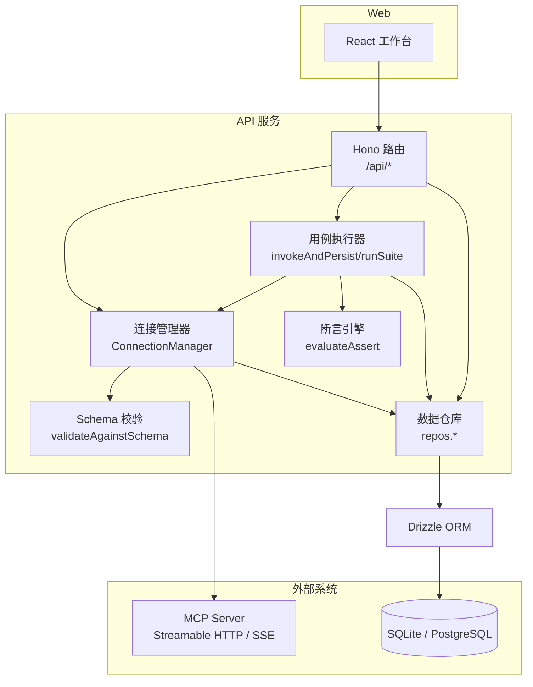
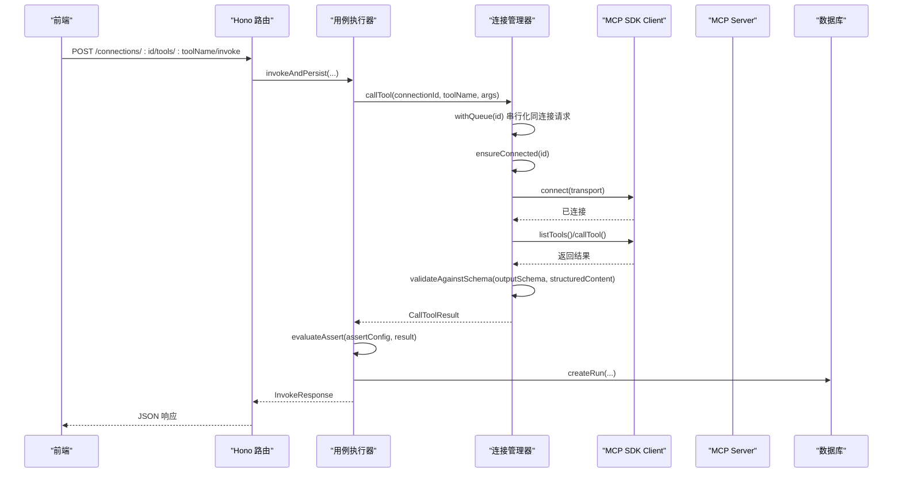
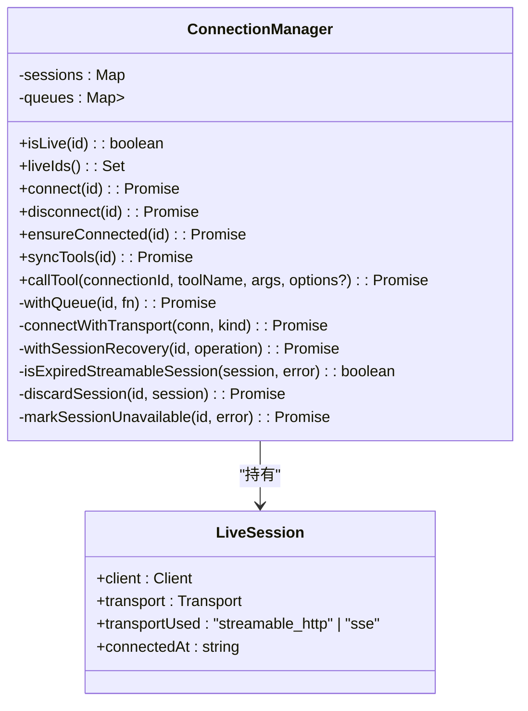
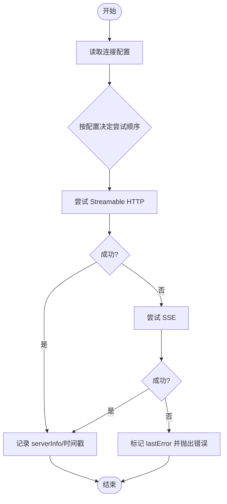
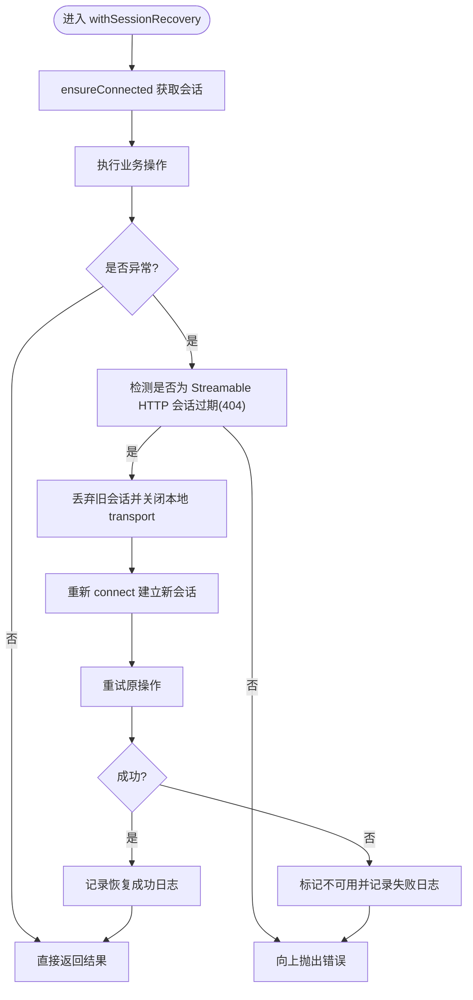
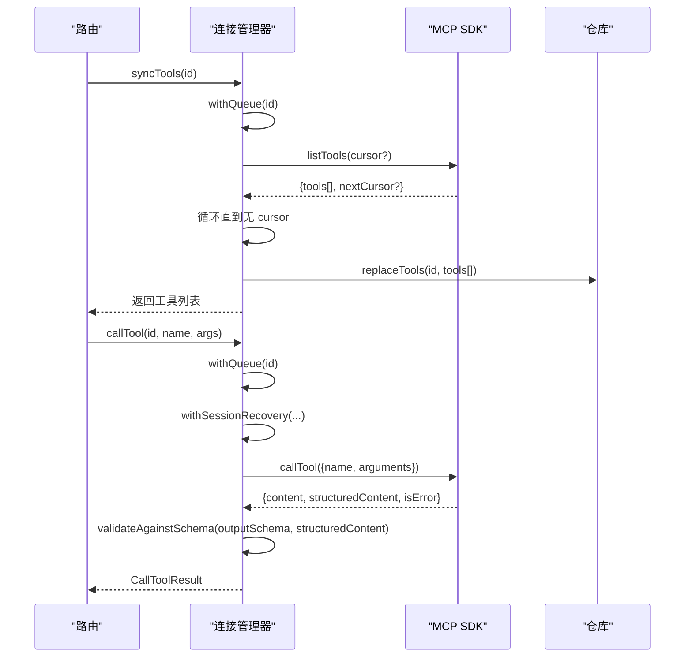
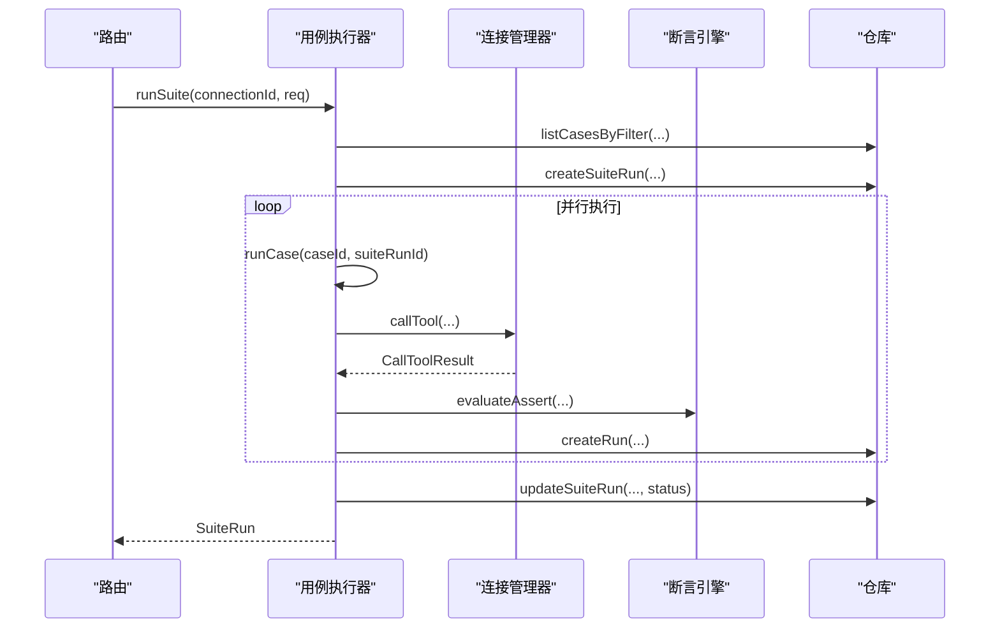
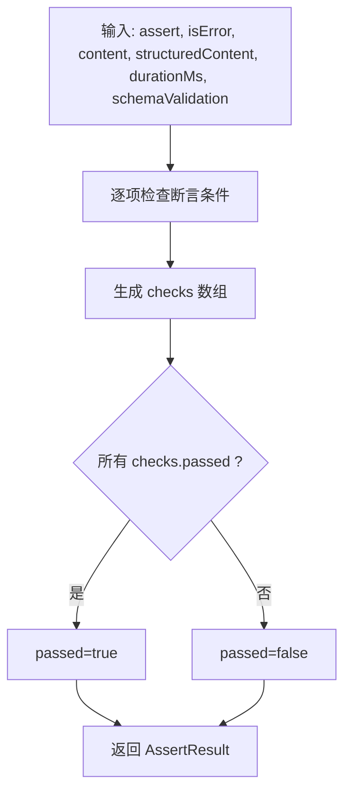
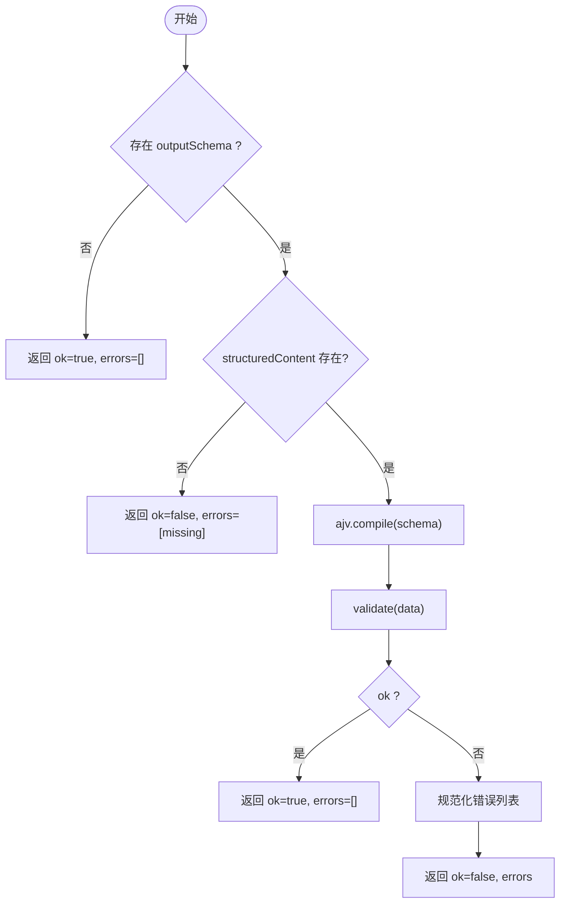
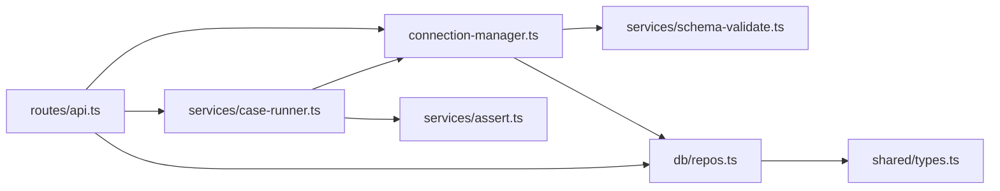

# MCP 集成架构

<cite>
**本文引用的文件**   
- [apps/server/src/mcp/connection-manager.ts](file://apps/server/src/mcp/connection-manager.ts)
- [apps/server/src/routes/api.ts](file://apps/server/src/routes/api.ts)
- [apps/server/src/services/assert.ts](file://apps/server/src/services/assert.ts)
- [apps/server/src/services/schema-validate.ts](file://apps/server/src/services/schema-validate.ts)
- [apps/server/src/services/case-runner.ts](file://apps/server/src/services/case-runner.ts)
- [apps/server/src/db/repos.ts](file://apps/server/src/db/repos.ts)
- [packages/shared/src/types.ts](file://packages/shared/src/types.ts)
- [packages/shared/src/assert-schema.ts](file://packages/shared/src/assert-schema.ts)
- [scripts/mock-mcp-server.ts](file://scripts/mock-mcp-server.ts)
- [apps/server/src/index.ts](file://apps/server/src/index.ts)
</cite>

## 目录
1. [简介](#简介)
2. [项目结构](#项目结构)
3. [核心组件](#核心组件)
4. [架构总览](#架构总览)
5. [详细组件分析](#详细组件分析)
6. [依赖关系分析](#依赖关系分析)
7. [性能与并发特性](#性能与并发特性)
8. [故障诊断与调试支持](#故障诊断与调试支持)
9. [结论](#结论)
10. [附录：API 与数据模型速查](#附录api-与数据模型速查)

## 简介
本文件面向“MCP 协议集成”的技术文档，围绕 Model Context Protocol SDK 的集成架构展开，重点覆盖以下方面：
- 传输协议抽象层（Streamable HTTP vs SSE）
- 会话管理与自动重连策略
- Tool 发现与同步机制、动态 Schema 解析与参数验证
- 断言系统的可扩展设计与结果评估引擎
- 协议兼容性处理、错误诊断与调试支持

该实现基于 MCP TypeScript SDK，提供连接管理、工具调用、用例执行与回归套件能力，并通过持久化存储记录运行历史。

## 项目结构
后端服务采用 Hono 作为 HTTP 框架，MCP 客户端通过 SDK 与远端 MCP Server 通信；共享类型定义位于 packages/shared；数据库访问由 Drizzle ORM 封装在 repos 层；断言与 Schema 校验为独立服务模块。

图表来源
- [apps/server/src/routes/api.ts:1-277](file://apps/server/src/routes/api.ts#L1-L277)
- [apps/server/src/mcp/connection-manager.ts:1-383](file://apps/server/src/mcp/connection-manager.ts#L1-L383)
- [apps/server/src/services/case-runner.ts:1-161](file://apps/server/src/services/case-runner.ts#L1-L161)
- [apps/server/src/services/assert.ts:1-166](file://apps/server/src/services/assert.ts#L1-L166)
- [apps/server/src/services/schema-validate.ts:1-61](file://apps/server/src/services/schema-validate.ts#L1-L61)
- [apps/server/src/db/repos.ts:1-660](file://apps/server/src/db/repos.ts#L1-L660)

章节来源
- [apps/server/src/index.ts:1-39](file://apps/server/src/index.ts#L1-L39)
- [apps/server/src/routes/api.ts:1-277](file://apps/server/src/routes/api.ts#L1-L277)

## 核心组件
- 连接管理器（单例）：负责 MCP 客户端生命周期、传输选择、会话恢复与重试、Tool 同步与调用编排。
- 用例执行器：封装一次调用的完整流程（调用、断言、持久化），并支持批量套件执行。
- 断言引擎：对结构化输出、文本内容、耗时、JSONPath 等进行规则化检查。
- Schema 校验：基于 Ajv 2020 对 structuredContent 进行 JSON Schema 2020-12 校验。
- 数据仓库：统一封装连接、工具、用例、运行记录的增删改查与映射。

章节来源
- [apps/server/src/mcp/connection-manager.ts:1-383](file://apps/server/src/mcp/connection-manager.ts#L1-L383)
- [apps/server/src/services/case-runner.ts:1-161](file://apps/server/src/services/case-runner.ts#L1-L161)
- [apps/server/src/services/assert.ts:1-166](file://apps/server/src/services/assert.ts#L1-L166)
- [apps/server/src/services/schema-validate.ts:1-61](file://apps/server/src/services/schema-validate.ts#L1-L61)
- [apps/server/src/db/repos.ts:1-660](file://apps/server/src/db/repos.ts#L1-L660)

## 架构总览
下图展示了从 Web 到 MCP Server 的端到端请求路径，以及连接管理器在其中的关键职责。

图表来源
- [apps/server/src/routes/api.ts:117-138](file://apps/server/src/routes/api.ts#L117-L138)
- [apps/server/src/services/case-runner.ts:11-77](file://apps/server/src/services/case-runner.ts#L11-L77)
- [apps/server/src/mcp/connection-manager.ts:300-379](file://apps/server/src/mcp/connection-manager.ts#L300-L379)
- [apps/server/src/services/schema-validate.ts:27-61](file://apps/server/src/services/schema-validate.ts#L27-L61)
- [apps/server/src/services/assert.ts:58-166](file://apps/server/src/services/assert.ts#L58-L166)
- [apps/server/src/db/repos.ts:476-528](file://apps/server/src/db/repos.ts#L476-L528)

## 详细组件分析

### 连接管理器（ConnectionManager）
- 单例模式：模块导出一个全局实例 connectionManager，供路由与服务层复用。
- 传输抽象：根据配置或 auto 回退策略，优先使用 StreamableHTTPClientTransport，失败时回退至 SSEClientTransport。
- 会话管理：维护内存中的 LiveSession 集合，包含 client、transport、transportUsed、connectedAt。
- 并发控制：每个连接 id 对应一个队列 Promise，确保同一连接的请求串行执行，避免竞态。
- 自动重连：当检测到 Streamable HTTP 会话过期（服务端 404）时，丢弃旧会话并重新初始化，最多重试一次。
- Tool 同步：分页拉取 listTools，持久化 input/output schema 与原始信息。
- 调用编排：封装超时控制、状态统计、Schema 校验与错误分类。

图表来源
- [apps/server/src/mcp/connection-manager.ts:39-383](file://apps/server/src/mcp/connection-manager.ts#L39-L383)

章节来源
- [apps/server/src/mcp/connection-manager.ts:1-383](file://apps/server/src/mcp/connection-manager.ts#L1-L383)

#### 连接建立与传输选择流程

图表来源
- [apps/server/src/mcp/connection-manager.ts:101-147](file://apps/server/src/mcp/connection-manager.ts#L101-L147)

章节来源
- [apps/server/src/mcp/connection-manager.ts:101-147](file://apps/server/src/mcp/connection-manager.ts#L101-L147)

#### 会话恢复与自动重连

图表来源
- [apps/server/src/mcp/connection-manager.ts:209-268](file://apps/server/src/mcp/connection-manager.ts#L209-L268)
- [apps/server/src/mcp/connection-manager.ts:175-207](file://apps/server/src/mcp/connection-manager.ts#L175-L207)

章节来源
- [apps/server/src/mcp/connection-manager.ts:175-268](file://apps/server/src/mcp/connection-manager.ts#L175-L268)

#### Tool 同步与调用时序

图表来源
- [apps/server/src/mcp/connection-manager.ts:270-298](file://apps/server/src/mcp/connection-manager.ts#L270-L298)
- [apps/server/src/mcp/connection-manager.ts:300-379](file://apps/server/src/mcp/connection-manager.ts#L300-L379)
- [apps/server/src/db/repos.ts:314-349](file://apps/server/src/db/repos.ts#L314-L349)

章节来源
- [apps/server/src/mcp/connection-manager.ts:270-379](file://apps/server/src/mcp/connection-manager.ts#L270-L379)
- [apps/server/src/db/repos.ts:314-349](file://apps/server/src/db/repos.ts#L314-L349)

### 用例执行器（Case Runner）
- 单次调用：invokeAndPersist 串联调用、断言、持久化，返回统一 InvokeResponse。
- 用例执行：runCase 加载用例配置并执行。
- 套件执行：runSuite 支持并行度控制，聚合通过/失败计数，更新套件状态。

图表来源
- [apps/server/src/services/case-runner.ts:111-161](file://apps/server/src/services/case-runner.ts#L111-L161)
- [apps/server/src/services/case-runner.ts:79-92](file://apps/server/src/services/case-runner.ts#L79-L92)
- [apps/server/src/services/case-runner.ts:11-77](file://apps/server/src/services/case-runner.ts#L11-L77)

章节来源
- [apps/server/src/services/case-runner.ts:1-161](file://apps/server/src/services/case-runner.ts#L1-161)

### 断言引擎（Assert Engine）
- 支持的断言项：
  - expectIsError：期望 isError 布尔值
  - expectStructured：期望是否存在 structuredContent
  - structuredEquals：部分深匹配（类似 isMatch）
  - structuredSchemaValid：结合 Schema 校验结果
  - contentTextContains / contentTextNotContains：文本包含/不包含
  - maxDurationMs：最大耗时阈值
  - jsonPathEquals：基于简单路径表达式匹配结构化字段
- 扩展性：新增断言只需在 evaluateAssert 中增加分支，并在 AssertConfig 中声明字段。

图表来源
- [apps/server/src/services/assert.ts:58-166](file://apps/server/src/services/assert.ts#L58-L166)

章节来源
- [apps/server/src/services/assert.ts:1-166](file://apps/server/src/services/assert.ts#L1-L166)
- [packages/shared/src/types.ts:19-46](file://packages/shared/src/types.ts#L19-L46)

### Schema 校验（Ajv 2020）
- 使用 Ajv 2020 编译 JSON Schema，启用 allErrors 以收集全部错误。
- 若未提供 outputSchema 或 structuredContent 缺失，分别返回不同语义的错误。
- 将 Ajv 错误对象规范化为统一的 errors 列表，便于前端展示。

图表来源
- [apps/server/src/services/schema-validate.ts:27-61](file://apps/server/src/services/schema-validate.ts#L27-L61)

章节来源
- [apps/server/src/services/schema-validate.ts:1-61](file://apps/server/src/services/schema-validate.ts#L1-L61)
- [packages/shared/src/types.ts:43-52](file://packages/shared/src/types.ts#L43-L52)

### 数据仓库（Repos）
- 连接：创建、更新、删除、状态标记（lastConnectedAt、lastError、serverInfo）。
- 工具：replaceTools 全量替换，listTools/getTool 查询，支持名称/标题/描述模糊搜索。
- 用例：CRUD，normalizeAssert 标准化断言配置。
- 运行记录：createRun/listRuns/getRun/deleteRun，支持按连接、工具、套件、状态过滤。
- 套件运行：createSuiteRun/updateSuiteRun/listSuiteRuns。

章节来源
- [apps/server/src/db/repos.ts:1-660](file://apps/server/src/db/repos.ts#L1-L660)

### 路由与对外 API
- 健康检查：/api/health 返回当前方言与在线连接数。
- 连接管理：/connections 列表、创建、详情、更新、删除、连接/断开、同步 Tools。
- 工具调用：/connections/:id/tools/:toolName/invoke 支持 save、testCaseId 等参数。
- 用例与套件：/cases 与 /suites/run 相关接口。
- 历史记录：/runs 与 /suite-runs 查询。
- 导入导出：/export 与 /import 用于迁移与备份。

章节来源
- [apps/server/src/routes/api.ts:1-277](file://apps/server/src/routes/api.ts#L1-L277)

## 依赖关系分析
- 模块耦合
  - routes/api.ts 依赖 connectionManager、case-runner、repos。
  - case-runner 依赖 connectionManager、assert、repos。
  - connection-manager 依赖 SDK 客户端、schema-validate、repos。
  - repos 依赖 Drizzle ORM 与 shared types。
- 外部依赖
  - @modelcontextprotocol/sdk：提供 Streamable HTTP 与 SSE 传输、客户端/服务端能力。
  - ajv 与 ajv-formats：JSON Schema 2020-12 校验与格式支持。
  - drizzle-orm：跨 SQLite/PostgreSQL 的数据访问。
- 潜在循环依赖
  - 当前未发现循环引用；各层职责清晰，单向依赖。

图表来源
- [apps/server/src/routes/api.ts:1-277](file://apps/server/src/routes/api.ts#L1-L277)
- [apps/server/src/services/case-runner.ts:1-161](file://apps/server/src/services/case-runner.ts#L1-L161)
- [apps/server/src/mcp/connection-manager.ts:1-383](file://apps/server/src/mcp/connection-manager.ts#L1-L383)
- [apps/server/src/services/assert.ts:1-166](file://apps/server/src/services/assert.ts#L1-L166)
- [apps/server/src/services/schema-validate.ts:1-61](file://apps/server/src/services/schema-validate.ts#L1-L61)
- [apps/server/src/db/repos.ts:1-660](file://apps/server/src/db/repos.ts#L1-L660)
- [packages/shared/src/types.ts:1-229](file://packages/shared/src/types.ts#L1-L229)

章节来源
- [apps/server/src/routes/api.ts:1-277](file://apps/server/src/routes/api.ts#L1-L277)
- [apps/server/src/services/case-runner.ts:1-161](file://apps/server/src/services/case-runner.ts#L1-L161)
- [apps/server/src/mcp/connection-manager.ts:1-383](file://apps/server/src/mcp/connection-manager.ts#L1-L383)
- [apps/server/src/services/assert.ts:1-166](file://apps/server/src/services/assert.ts#L1-L166)
- [apps/server/src/services/schema-validate.ts:1-61](file://apps/server/src/services/schema-validate.ts#L1-L61)
- [apps/server/src/db/repos.ts:1-660](file://apps/server/src/db/repos.ts#L1-L660)
- [packages/shared/src/types.ts:1-229](file://packages/shared/src/types.ts#L1-L229)

## 性能与并发特性
- 连接级串行化：withQueue 保证同一连接上的请求串行执行，避免并发导致的会话冲突与资源竞争。
- 套件并行：mapPool 实现固定并行度的任务池，提升批量用例执行吞吐。
- 超时控制：callTool 使用 AbortController 与 Promise.race 实现可中断的超时保护。
- Schema 校验缓存：Ajv 实例全局复用，但每次调用 compile 仍会产生开销；可在高频场景考虑按 schema 指纹缓存编译结果。
- 网络 I/O：MCP 调用为长连接或流式传输，建议合理设置 timeoutMs 以避免资源占用过久。

章节来源
- [apps/server/src/mcp/connection-manager.ts:51-67](file://apps/server/src/mcp/connection-manager.ts#L51-L67)
- [apps/server/src/mcp/connection-manager.ts:300-379](file://apps/server/src/mcp/connection-manager.ts#L300-L379)
- [apps/server/src/services/case-runner.ts:94-109](file://apps/server/src/services/case-runner.ts#L94-L109)
- [apps/server/src/services/schema-validate.ts:18-19](file://apps/server/src/services/schema-validate.ts#L18-L19)

## 故障诊断与调试支持
- 会话恢复日志：mcp_session_recovery_started/succeeded/failed 事件，便于定位重连阶段问题。
- 错误分类：
  - protocol_error：协议/连接层异常（含超时、AbortError、非 2xx 等）。
  - tool_error：MCP Tool 返回 isError=true。
  - timeout：超过配置的 timeoutMs。
- Mock 服务器：mock-mcp-server 支持多种异常模式（session 404、HTTP 401/500、一次性过期、拒绝请求），可用于自动化测试与回归验证。
- 健康检查：/api/health 暴露 liveConnections 数量与数据库方言，便于监控。

章节来源
- [apps/server/src/mcp/connection-manager.ts:219-266](file://apps/server/src/mcp/connection-manager.ts#L219-L266)
- [apps/server/src/mcp/connection-manager.ts:355-377](file://apps/server/src/mcp/connection-manager.ts#L355-L377)
- [scripts/mock-mcp-server.ts:1-283](file://scripts/mock-mcp-server.ts#L1-L283)
- [apps/server/src/routes/api.ts:32-38](file://apps/server/src/routes/api.ts#L32-L38)

## 结论
本实现以连接管理器为核心，抽象了 MCP 传输协议差异，提供了健壮的会话恢复与自动重连机制；通过用例执行器与断言引擎形成完整的调试与回归闭环；Schema 校验与错误分类提升了可观测性与排障效率。整体架构层次清晰、扩展点明确，适合在生产环境中稳定运行与持续演进。

## 附录：API 与数据模型速查

### 关键 API 概览
- 健康检查：GET /api/health
- 连接管理：
  - GET /api/connections
  - POST /api/connections
  - GET /api/connections/:id
  - PATCH /api/connections/:id
  - DELETE /api/connections/:id
  - POST /api/connections/:id/connect
  - POST /api/connections/:id/disconnect
  - POST /api/connections/:id/sync-tools
- 工具调用：POST /api/connections/:id/tools/:toolName/invoke
- 用例管理：
  - GET /api/connections/:id/tools/:toolName/cases
  - POST /api/connections/:id/tools/:toolName/cases
  - GET /api/connections/:id/cases
  - PATCH /api/cases/:id
  - DELETE /api/cases/:id
  - POST /api/cases/:id/run
- 套件执行：POST /api/connections/:id/suites/run
- 历史记录：
  - GET /api/suite-runs
  - GET /api/suite-runs/:id
  - GET /api/runs
  - GET /api/runs/:id
  - DELETE /api/runs/:id
- 导入导出：
  - GET /api/export
  - POST /api/import

章节来源
- [apps/server/src/routes/api.ts:32-277](file://apps/server/src/routes/api.ts#L32-L277)

### 核心数据类型（节选）
- 传输类型：TransportType = "streamable_http" | "sse" | "auto"
- 运行状态：RunStatus = "success" | "tool_error" | "protocol_error" | "timeout" | "cancelled"
- 断言配置：AssertConfig（包含 expectIsError、expectStructured、structuredEquals、structuredSchemaValid、contentTextContains/NotContains、maxDurationMs、jsonPathEquals）
- 断言结果：AssertResult（包含 passed 与 checks 列表）
- Schema 校验结果：SchemaValidationResult（ok 与 errors）
- 连接：McpConnection（含 headerNames、timeoutMs、serverInfo、live 等）
- 工具：McpTool（含 inputSchema、outputSchema、annotations、raw）
- 用例：TestCase（含 arguments、assert、tags）
- 运行记录：InvocationRun（含 requestArguments、resultContent、resultStructured、protocolError、assertResult、schemaValidation、rawResponse）
- 套件运行：SuiteRun（含 total/passed/failed/skipped/status）

章节来源
- [packages/shared/src/types.ts:1-229](file://packages/shared/src/types.ts#L1-L229)