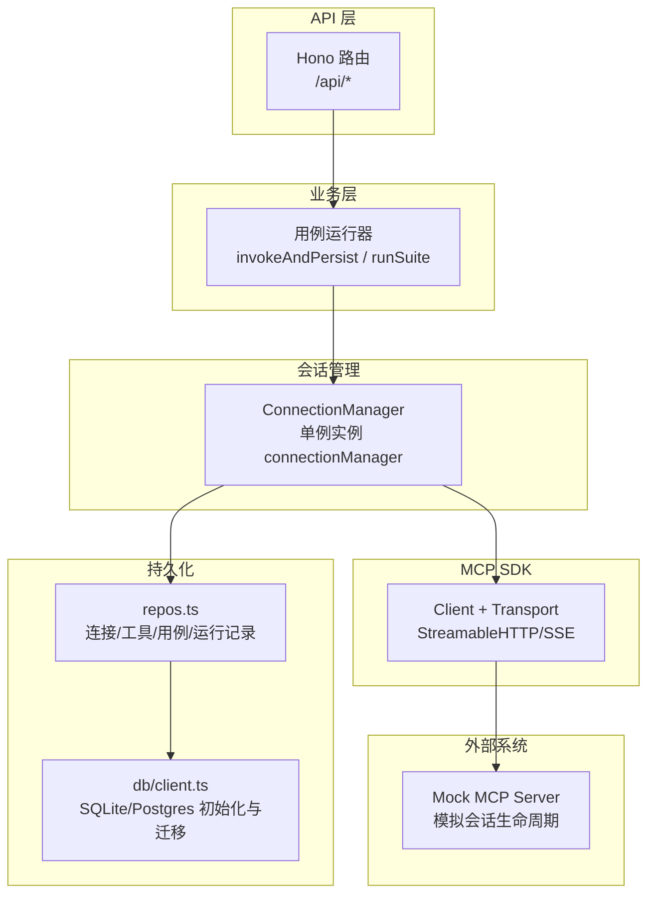
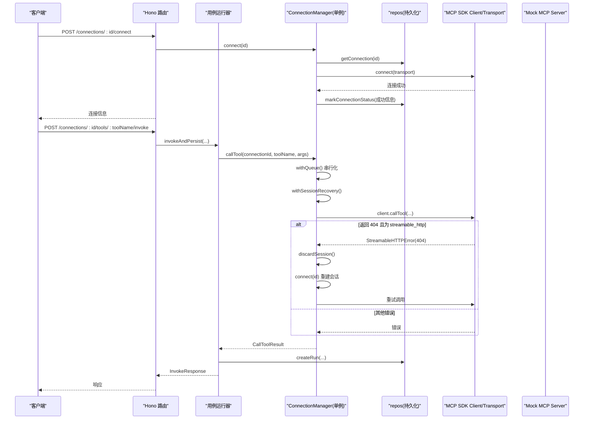
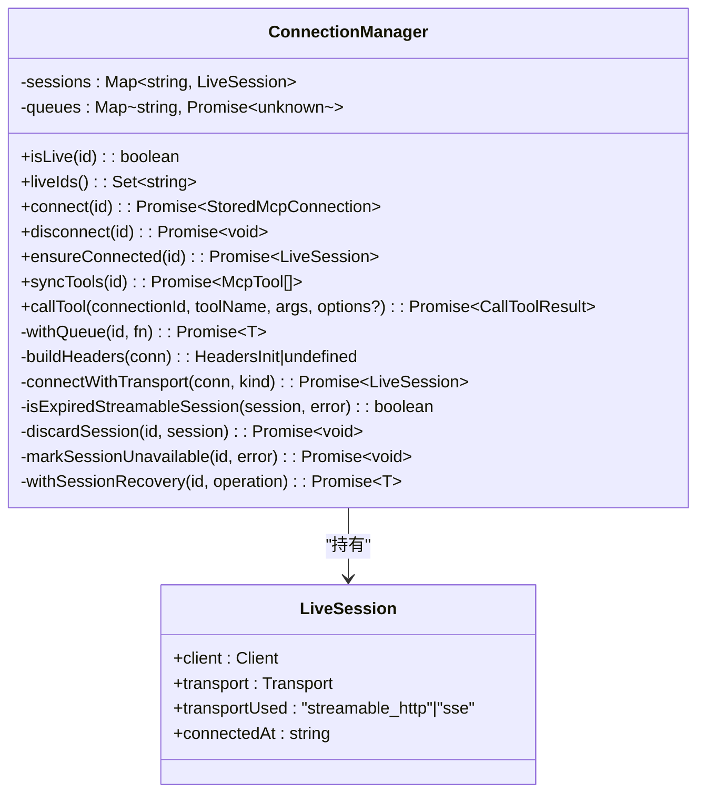
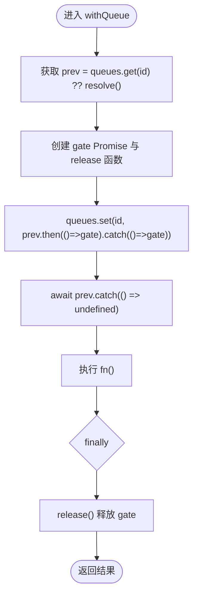
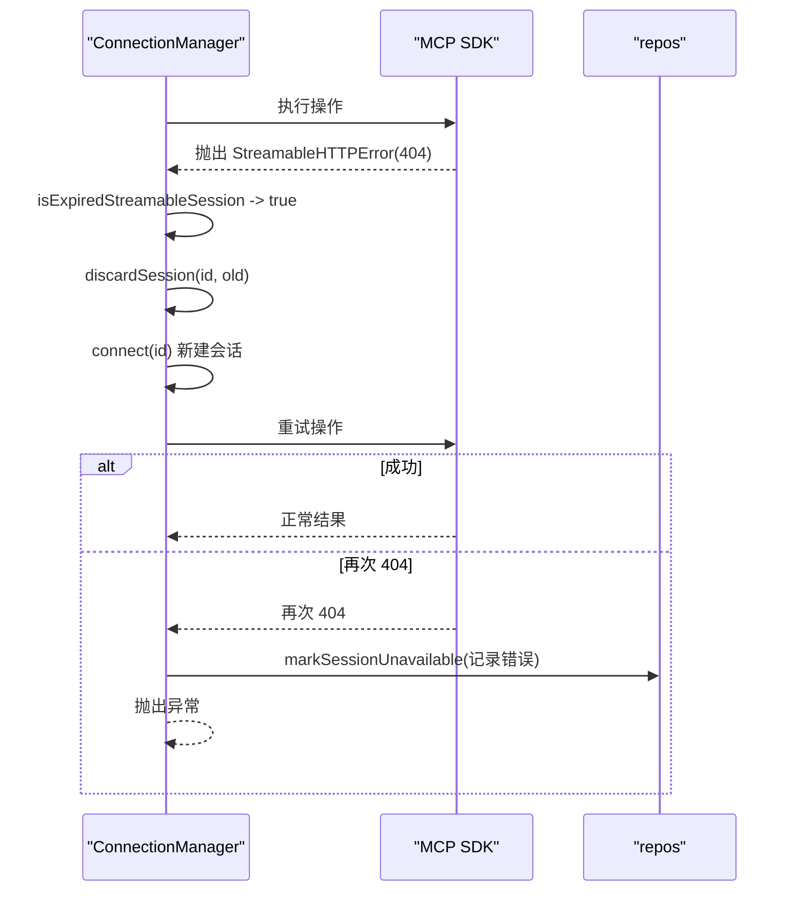
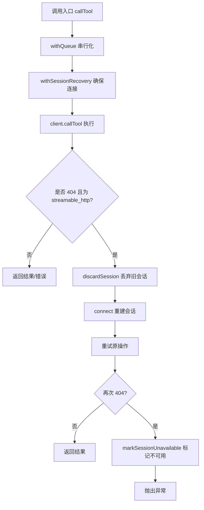
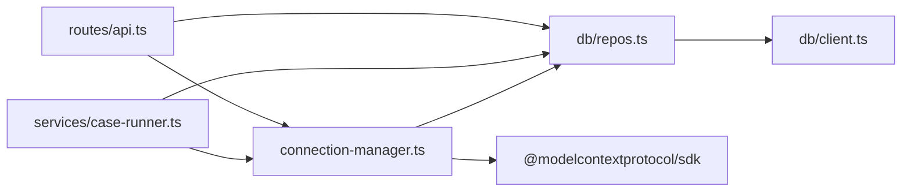

# 会话管理机制

<cite>
**本文引用的文件**   
- [apps/server/src/mcp/connection-manager.ts](file://apps/server/src/mcp/connection-manager.ts)
- [apps/server/src/routes/api.ts](file://apps/server/src/routes/api.ts)
- [apps/server/src/services/case-runner.ts](file://apps/server/src/services/case-runner.ts)
- [packages/shared/src/types.ts](file://packages/shared/src/types.ts)
- [apps/server/src/db/repos.ts](file://apps/server/src/db/repos.ts)
- [apps/server/src/db/client.ts](file://apps/server/src/db/client.ts)
- [scripts/mock-mcp-server.ts](file://scripts/mock-mcp-server.ts)
- [scripts/session-recovery.test.ts](file://scripts/session-recovery.test.ts)
</cite>

## 目录
1. [简介](#简介)
2. [项目结构](#项目结构)
3. [核心组件](#核心组件)
4. [架构总览](#架构总览)
5. [详细组件分析](#详细组件分析)
6. [依赖关系分析](#依赖关系分析)
7. [性能与资源优化](#性能与资源优化)
8. [故障排查指南](#故障排查指南)
9. [结论](#结论)
10. [附录：状态与指标](#附录状态与指标)

## 简介
本文件聚焦于 MCP（Model Context Protocol）调试工具的“会话管理”机制，围绕 LiveSession 数据结构、生命周期管理、单例连接管理器、并发控制与队列、会话恢复（特别是 Streamable HTTP 的 404 错误处理与自动重连）、过期检测、内存泄漏防护、资源优化、持久化、故障转移以及监控指标收集等主题进行系统化说明。文档以源码为依据，提供可视化图示与可追溯的来源标注，帮助读者快速理解并正确扩展该子系统。

## 项目结构
与“会话管理”直接相关的代码主要位于服务端模块中：
- 连接与会话管理：apps/server/src/mcp/connection-manager.ts
- API 路由层：apps/server/src/routes/api.ts
- 用例执行与服务编排：apps/server/src/services/case-runner.ts
- 共享类型定义：packages/shared/src/types.ts
- 数据访问层（持久化）：apps/server/src/db/repos.ts、apps/server/src/db/client.ts
- 测试与模拟服务：scripts/mock-mcp-server.ts、scripts/session-recovery.test.ts

图表来源
- [apps/server/src/routes/api.ts:1-277](file://apps/server/src/routes/api.ts#L1-L277)
- [apps/server/src/services/case-runner.ts:1-161](file://apps/server/src/services/case-runner.ts#L1-L161)
- [apps/server/src/mcp/connection-manager.ts:1-383](file://apps/server/src/mcp/connection-manager.ts#L1-L383)
- [apps/server/src/db/repos.ts:1-660](file://apps/server/src/db/repos.ts#L1-L660)
- [apps/server/src/db/client.ts:1-267](file://apps/server/src/db/client.ts#L1-L267)
- [scripts/mock-mcp-server.ts:1-283](file://scripts/mock-mcp-server.ts#L1-L283)

章节来源
- [apps/server/src/routes/api.ts:1-277](file://apps/server/src/routes/api.ts#L1-L277)
- [apps/server/src/services/case-runner.ts:1-161](file://apps/server/src/services/case-runner.ts#L1-L161)
- [apps/server/src/mcp/connection-manager.ts:1-383](file://apps/server/src/mcp/connection-manager.ts#L1-L383)
- [packages/shared/src/types.ts:1-229](file://packages/shared/src/types.ts#L1-L229)
- [apps/server/src/db/repos.ts:1-660](file://apps/server/src/db/repos.ts#L1-L660)
- [apps/server/src/db/client.ts:1-267](file://apps/server/src/db/client.ts#L1-L267)
- [scripts/mock-mcp-server.ts:1-283](file://scripts/mock-mcp-server.ts#L1-L283)

## 核心组件
- ConnectionManager：进程内单例，负责 MCP 连接的建立、销毁、会话保活、并发队列、会话恢复与状态持久化。
- LiveSession：表示一个活跃的 MCP 会话，包含底层 Client、Transport、使用的传输类型及连接时间。
- repos：数据库访问封装，负责连接、工具、用例、运行记录的增删改查与状态标记。
- case-runner：用例与套件执行编排，调用 ConnectionManager 发起工具调用并持久化结果。
- API 路由：对外暴露连接管理、工具同步、工具调用、用例与套件运行等接口。

章节来源
- [apps/server/src/mcp/connection-manager.ts:1-383](file://apps/server/src/mcp/connection-manager.ts#L1-L383)
- [apps/server/src/db/repos.ts:1-660](file://apps/server/src/db/repos.ts#L1-L660)
- [apps/server/src/services/case-runner.ts:1-161](file://apps/server/src/services/case-runner.ts#L1-L161)
- [apps/server/src/routes/api.ts:1-277](file://apps/server/src/routes/api.ts#L1-L277)
- [packages/shared/src/types.ts:1-229](file://packages/shared/src/types.ts#L1-L229)

## 架构总览
下图展示了从 API 到 MCP 服务器的完整请求链路，包括会话创建、工具调用、会话恢复与持久化流程。

图表来源
- [apps/server/src/routes/api.ts:77-138](file://apps/server/src/routes/api.ts#L77-L138)
- [apps/server/src/services/case-runner.ts:11-77](file://apps/server/src/services/case-runner.ts#L11-L77)
- [apps/server/src/mcp/connection-manager.ts:101-379](file://apps/server/src/mcp/connection-manager.ts#L101-L379)
- [apps/server/src/db/repos.ts:288-312](file://apps/server/src/db/repos.ts#L288-L312)
- [scripts/mock-mcp-server.ts:213-277](file://scripts/mock-mcp-server.ts#L213-L277)

## 详细组件分析

### LiveSession 数据结构与生命周期
- 数据结构
  - 字段包含：底层 Client、Transport、使用的传输类型（排除 auto）、连接时间戳。
  - 通过 Map<string, LiveSession> 在进程内维护活跃会话集合。
- 生命周期
  - 创建：connect(id) 根据配置选择传输类型（优先 streamable_http，其次 sse），构造 Client 与 Transport，完成握手后写入 lastConnectedAt、serverInfo 等状态。
  - 保活：ensureConnected(id) 保证后续操作有可用会话；withSessionRecovery(id, fn) 在执行前确保连接，并在遇到特定错误时触发恢复。
  - 销毁：disconnect(id) 清理本地会话，尝试终止远端会话并关闭 Client。
  - 过期检测：isExpiredStreamableSession(session, error) 仅对 streamable_http 且携带 sessionId 的会话，当收到 404 错误时判定为会话已失效。
  - 回收：discardSession(id, session) 删除本地映射并关闭本地 Client，避免僵尸连接。

图表来源
- [apps/server/src/mcp/connection-manager.ts:19-383](file://apps/server/src/mcp/connection-manager.ts#L19-L383)

章节来源
- [apps/server/src/mcp/connection-manager.ts:19-383](file://apps/server/src/mcp/connection-manager.ts#L19-L383)

### 单例模式与多连接并发控制
- 单例实现
  - 模块导出 new ConnectionManager() 的单例实例 connectionManager，供 API 与用例运行器全局复用。
- 并发控制与队列
  - 每个连接 id 对应一个 Promise 队列 gate，使用 withQueue(id, fn) 将同一连接的所有操作串行化，避免同一连接上的竞态条件。
  - 不同连接之间互不影响，支持多连接并行。
- 超时控制
  - callTool 内部基于 AbortController 与 setTimeout 组合，超过配置的 timeoutMs 则中断调用并返回超时状态。

图表来源
- [apps/server/src/mcp/connection-manager.ts:51-67](file://apps/server/src/mcp/connection-manager.ts#L51-L67)

章节来源
- [apps/server/src/mcp/connection-manager.ts:39-67](file://apps/server/src/mcp/connection-manager.ts#L39-L67)

### 会话恢复机制（Streamable HTTP 404 与自动重连）
- 触发条件
  - 仅当当前会话使用 streamable_http 且错误类型为 StreamableHTTPError 且 code 为 404 时，判定为远端会话已过期或丢失。
- 恢复流程
  - 丢弃旧会话：discardSession(id, session) 删除本地映射并关闭本地 Client。
  - 重新连接：connect(id) 按配置顺序尝试建立新会话。
  - 重试原操作：在 replacement 会话上再次执行原操作。
  - 二次失败处理：若替换会话再次出现 404，则标记不可用并抛出异常。
- 日志与事件
  - 开始恢复、恢复成功、恢复失败均输出结构化日志，便于观测与告警。

图表来源
- [apps/server/src/mcp/connection-manager.ts:175-268](file://apps/server/src/mcp/connection-manager.ts#L175-L268)
- [apps/server/src/db/repos.ts:288-312](file://apps/server/src/db/repos.ts#L288-L312)

章节来源
- [apps/server/src/mcp/connection-manager.ts:175-268](file://apps/server/src/mcp/connection-manager.ts#L175-L268)

### 会话过期检测与资源优化
- 过期检测
  - 仅针对 streamable_http 且存在 sessionId 的会话，结合 404 错误码判断。
- 资源清理
  - disconnect 会尝试调用 transport.terminateSession（若存在）并关闭 Client，防止资源泄露。
  - discardSession 在检测到 404 后立即关闭本地 Client，避免悬挂连接。
- 内存占用
  - sessions Map 仅在会话活跃期间保留，断开或删除后及时移除引用，降低内存压力。

章节来源
- [apps/server/src/mcp/connection-manager.ts:149-195](file://apps/server/src/mcp/connection-manager.ts#L149-L195)

### 会话状态持久化、故障转移与监控指标
- 状态持久化
  - 连接成功/失败：markConnectionStatus 更新 lastConnectedAt、lastError、serverInfo。
  - 工具清单：syncTools 拉取并 replaceTools 覆盖存储，便于离线查询与 UI 展示。
  - 调用记录：invokeAndPersist 将每次调用的结果、断言、校验、原始响应等持久化为 invocation_runs。
- 故障转移
  - 自动重连：on 404 自动重建会话并重试一次；若仍失败，标记不可用并向上抛出错误。
  - 非 404 错误不触发重连（如 401、500、工具错误、超时）。
- 监控指标
  - 健康检查：/api/health 返回 liveConnections 数量。
  - 恢复事件：mcp_session_recovery_started/succeeded/failed 结构化日志。
  - 统计接口：mock 服务器暴露 stats（initializedSessions、sessionNotFoundResponses、listToolsCalls、toolCalls）用于验证恢复逻辑。

章节来源
- [apps/server/src/routes/api.ts:32-38](file://apps/server/src/routes/api.ts#L32-L38)
- [apps/server/src/mcp/connection-manager.ts:209-268](file://apps/server/src/mcp/connection-manager.ts#L209-L268)
- [apps/server/src/services/case-runner.ts:11-77](file://apps/server/src/services/case-runner.ts#L11-L77)
- [scripts/mock-mcp-server.ts:12-17](file://scripts/mock-mcp-server.ts#L12-L17)

### 关键流程图：工具调用与恢复

图表来源
- [apps/server/src/mcp/connection-manager.ts:300-379](file://apps/server/src/mcp/connection-manager.ts#L300-L379)

## 依赖关系分析
- 组件耦合
  - API 层依赖 ConnectionManager 与 repos。
  - 用例运行器依赖 ConnectionManager 与 repos。
  - ConnectionManager 依赖 repos 与 MCP SDK。
- 外部依赖
  - MCP SDK：提供 Client 与多种 Transport（StreamableHTTP、SSE）。
  - 数据库：SQLite/Postgres，统一由 db/client.ts 初始化与迁移。
- 潜在循环依赖
  - 当前无循环依赖迹象，职责边界清晰。

图表来源
- [apps/server/src/routes/api.ts:1-277](file://apps/server/src/routes/api.ts#L1-L277)
- [apps/server/src/services/case-runner.ts:1-161](file://apps/server/src/services/case-runner.ts#L1-L161)
- [apps/server/src/mcp/connection-manager.ts:1-383](file://apps/server/src/mcp/connection-manager.ts#L1-L383)
- [apps/server/src/db/repos.ts:1-660](file://apps/server/src/db/repos.ts#L1-L660)
- [apps/server/src/db/client.ts:1-267](file://apps/server/src/db/client.ts#L1-L267)

章节来源
- [apps/server/src/routes/api.ts:1-277](file://apps/server/src/routes/api.ts#L1-L277)
- [apps/server/src/services/case-runner.ts:1-161](file://apps/server/src/services/case-runner.ts#L1-L161)
- [apps/server/src/mcp/connection-manager.ts:1-383](file://apps/server/src/mcp/connection-manager.ts#L1-L383)
- [apps/server/src/db/repos.ts:1-660](file://apps/server/src/db/repos.ts#L1-L660)
- [apps/server/src/db/client.ts:1-267](file://apps/server/src/db/client.ts#L1-L267)

## 性能与资源优化
- 串行化与隔离
  - 每连接独立队列，避免同一连接上的竞态，同时允许跨连接并行，提升吞吐。
- 超时保护
  - 默认 60s 超时，可按连接配置调整，避免长尾阻塞。
- 最小化网络往返
  - syncTools 采用分页游标拉取，减少多次往返。
- 资源回收
  - 404 立即关闭本地 Client；disconnect 主动终止远端会话，降低资源泄露风险。
- 建议
  - 在高并发场景下，可根据连接数与负载评估队列长度与超时策略。
  - 对频繁 404 的连接，建议在上层增加退避与熔断策略，避免雪崩。

[本节为通用指导，无需源码引用]

## 故障排查指南
- 常见问题定位
  - 连接失败：查看 lastError 与 serverInfo，确认 URL、headers、传输类型是否正确。
  - 工具调用失败：检查 protocolError 与 schemaValidation，必要时查看 rawResponse。
  - 会话 404：观察 mcp_session_recovery_* 日志，确认是否自动重连成功。
- 诊断步骤
  - 使用 /api/health 检查 liveConnections 数量。
  - 使用 /api/runs 与 /api/suite-runs 查看历史运行与套件结果。
  - 使用 mock 服务的 /stats 接口验证恢复行为（测试环境）。
- 安全注意
  - 连接头值不会随公开接口返回，仅返回 headerNames 列表，避免密钥泄露。

章节来源
- [apps/server/src/routes/api.ts:24-30](file://apps/server/src/routes/api.ts#L24-L30)
- [apps/server/src/routes/api.ts:32-38](file://apps/server/src/routes/api.ts#L32-L38)
- [apps/server/src/mcp/connection-manager.ts:209-268](file://apps/server/src/mcp/connection-manager.ts#L209-L268)
- [scripts/mock-mcp-server.ts:213-277](file://scripts/mock-mcp-server.ts#L213-L277)

## 结论
本会话管理机制通过单例 ConnectionManager 统一管理 MCP 会话，结合 per-connection 队列保障并发安全，利用 404 检测与自动重连提升可用性，并通过完善的持久化与监控指标支撑运维与排障。整体设计简洁、职责清晰，具备良好的可扩展性与健壮性。

[本节为总结，无需源码引用]

## 附录：状态与指标
- 连接状态字段
  - lastConnectedAt：最近成功连接时间
  - lastError：最近错误消息
  - serverInfo：服务端能力与版本信息
- 运行记录字段
  - status：success/tool_error/protocol_error/timeout/cancelled
  - durationMs：耗时毫秒
  - resultContent/resultStructured：内容体与结构化数据
  - assertResult/schemaValidation：断言与 Schema 校验结果
- 监控指标
  - liveConnections：健康检查返回的活跃连接数
  - mcp_session_recovery_*：会话恢复事件
  - mock stats：initializedSessions、sessionNotFoundResponses、listToolsCalls、toolCalls

章节来源
- [packages/shared/src/types.ts:54-70](file://packages/shared/src/types.ts#L54-L70)
- [packages/shared/src/types.ts:150-170](file://packages/shared/src/types.ts#L150-L170)
- [apps/server/src/routes/api.ts:32-38](file://apps/server/src/routes/api.ts#L32-L38)
- [scripts/mock-mcp-server.ts:12-17](file://scripts/mock-mcp-server.ts#L12-L17)