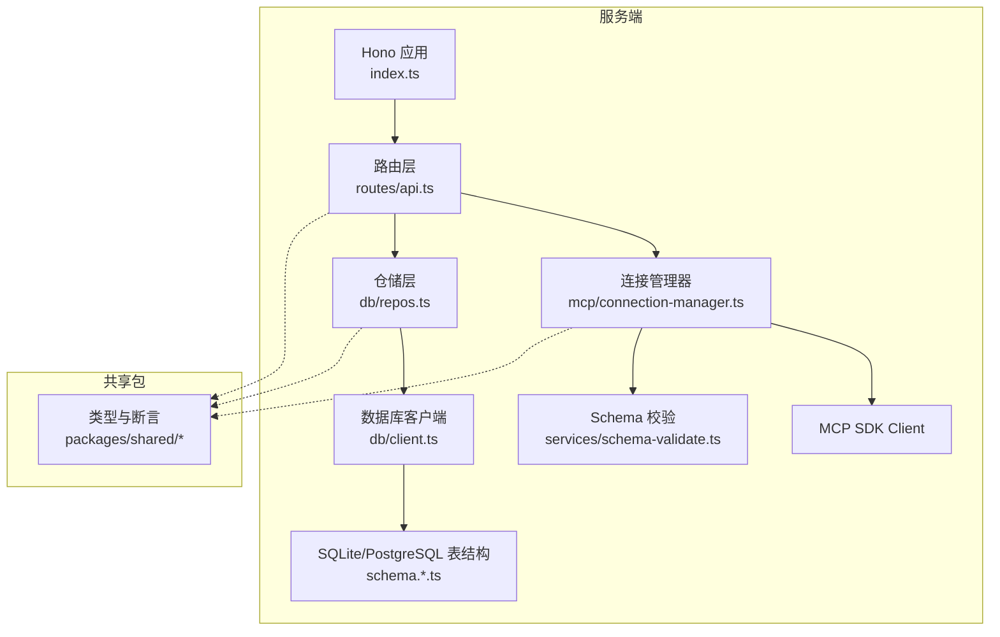
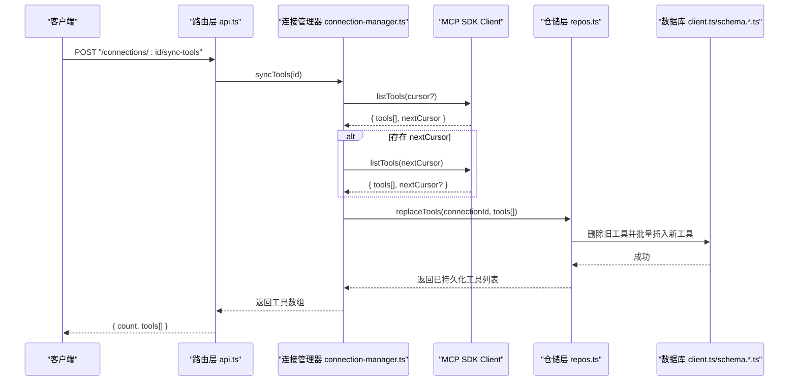
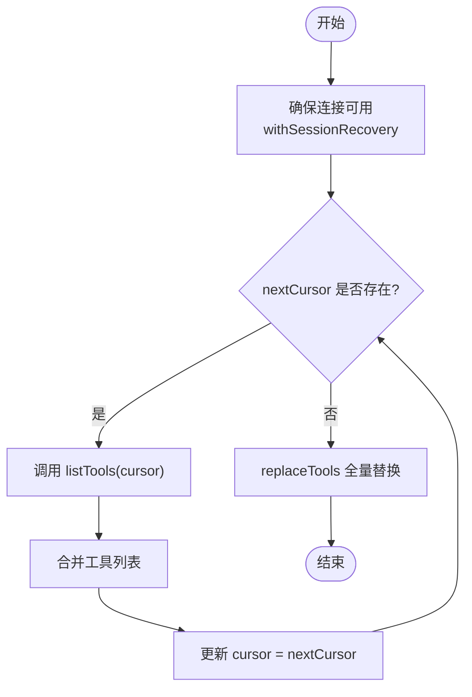
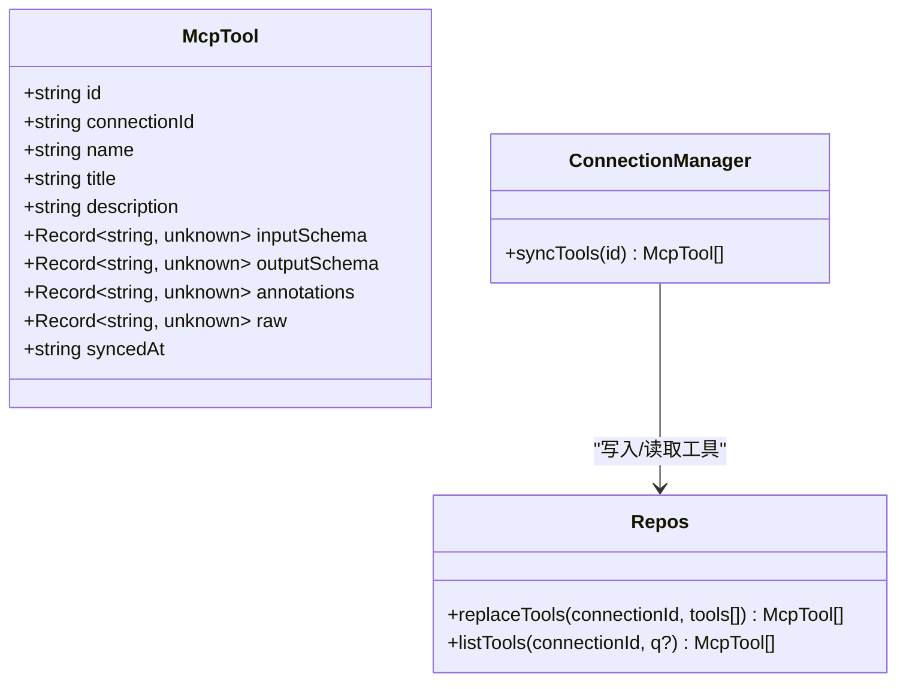
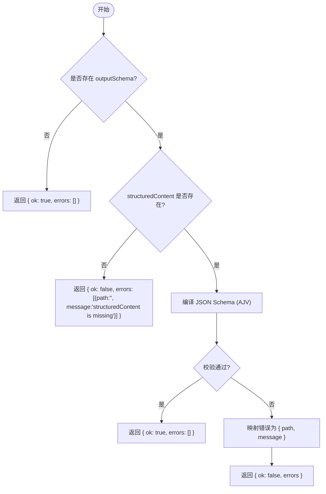
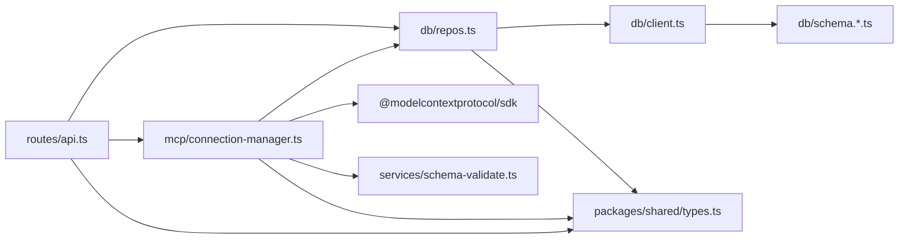

# 工具发现与同步

<cite>
**本文引用的文件**   
- [apps/server/src/index.ts](file://apps/server/src/index.ts)
- [apps/server/src/routes/api.ts](file://apps/server/src/routes/api.ts)
- [apps/server/src/mcp/connection-manager.ts](file://apps/server/src/mcp/connection-manager.ts)
- [apps/server/src/db/repos.ts](file://apps/server/src/db/repos.ts)
- [apps/server/src/db/client.ts](file://apps/server/src/db/client.ts)
- [apps/server/src/db/schema.sqlite.ts](file://apps/server/src/db/schema.sqlite.ts)
- [apps/server/src/services/schema-validate.ts](file://apps/server/src/services/schema-validate.ts)
- [packages/shared/src/types.ts](file://packages/shared/src/types.ts)
- [packages/shared/src/assert-schema.ts](file://packages/shared/src/assert-schema.ts)
</cite>

## 目录
1. [简介](#简介)
2. [项目结构](#项目结构)
3. [核心组件](#核心组件)
4. [架构总览](#架构总览)
5. [详细组件分析](#详细组件分析)
6. [依赖关系分析](#依赖关系分析)
7. [性能考量](#性能考量)
8. [故障排查指南](#故障排查指南)
9. [结论](#结论)

## 简介
本文件聚焦于 MCP（Model Context Protocol）工具的“发现与同步”能力，围绕以下目标展开：
- 描述 listTools API 的调用流程与分页处理机制，包括 nextCursor 游标的使用与增量同步策略。
- 说明工具元数据的提取与转换过程，从 MCP Tool 定义到本地数据模型的映射。
- 记录 Schema 解析与验证流程，包括 inputSchema 与 outputSchema 的处理。
- 解释工具缓存策略、版本管理与冲突解决机制。
- 提供错误处理、重试逻辑与性能优化方案。
- 给出工具发现失败的诊断方法与调试技巧。

## 项目结构
本项目采用前后端分离与多包组织方式：
- 后端服务基于 Hono 框架暴露 REST API，负责连接管理、工具发现/同步、用例执行与运行记录持久化。
- 共享类型与断言工具通过 packages/shared 提供。
- 数据库层使用 Drizzle ORM，支持 SQLite 与 PostgreSQL 两种方言，并在启动时完成迁移。

图表来源
- [apps/server/src/index.ts:10-33](file://apps/server/src/index.ts#L10-L33)
- [apps/server/src/routes/api.ts:18-115](file://apps/server/src/routes/api.ts#L18-L115)
- [apps/server/src/mcp/connection-manager.ts:39-173](file://apps/server/src/mcp/connection-manager.ts#L39-L173)
- [apps/server/src/services/schema-validate.ts:27-60](file://apps/server/src/services/schema-validate.ts#L27-L60)
- [apps/server/src/db/repos.ts:314-382](file://apps/server/src/db/repos.ts#L314-L382)
- [apps/server/src/db/client.ts:247-266](file://apps/server/src/db/client.ts#L247-L266)
- [apps/server/src/db/schema.sqlite.ts:19-39](file://apps/server/src/db/schema.sqlite.ts#L19-L39)
- [packages/shared/src/types.ts:92-103](file://packages/shared/src/types.ts#L92-L103)

章节来源
- [apps/server/src/index.ts:10-33](file://apps/server/src/index.ts#L10-L33)
- [apps/server/src/db/client.ts:247-266](file://apps/server/src/db/client.ts#L247-L266)

## 核心组件
- 路由层（API）：提供连接管理、工具发现与同步、用例与套件执行等接口。
- 连接管理器：封装 MCP SDK 客户端生命周期、传输选择、会话恢复、工具同步与调用。
- 仓储层：统一对数据库的读写操作，包含连接、工具、用例、运行记录的增删改查。
- Schema 校验：基于 AJV 对结构化输出进行 JSON Schema 校验。
- 共享类型：定义连接、工具、用例、运行记录等数据结构。

章节来源
- [apps/server/src/routes/api.ts:94-115](file://apps/server/src/routes/api.ts#L94-L115)
- [apps/server/src/mcp/connection-manager.ts:270-298](file://apps/server/src/mcp/connection-manager.ts#L270-L298)
- [apps/server/src/db/repos.ts:314-382](file://apps/server/src/db/repos.ts#L314-L382)
- [apps/server/src/services/schema-validate.ts:27-60](file://apps/server/src/services/schema-validate.ts#L27-L60)
- [packages/shared/src/types.ts:92-103](file://packages/shared/src/types.ts#L92-L103)

## 架构总览
下图展示了“工具发现与同步”的整体流程：前端或外部系统调用 /connections/:id/sync-tools，路由层委托连接管理器执行 MCP listTools 的分页拉取，并将结果写入本地 mcp_tools 表；随后可通过 /connections/:id/tools 查询已同步的工具列表。

图表来源
- [apps/server/src/routes/api.ts:94-102](file://apps/server/src/routes/api.ts#L94-L102)
- [apps/server/src/mcp/connection-manager.ts:270-298](file://apps/server/src/mcp/connection-manager.ts#L270-L298)
- [apps/server/src/db/repos.ts:314-349](file://apps/server/src/db/repos.ts#L314-L349)
- [apps/server/src/db/client.ts:247-266](file://apps/server/src/db/client.ts#L247-L266)
- [apps/server/src/db/schema.sqlite.ts:19-39](file://apps/server/src/db/schema.sqlite.ts#L19-L39)

## 详细组件分析

### 工具发现与同步流程（listTools 与分页）
- 触发入口：POST /connections/:id/sync-tools
- 连接与会话：
  - 若连接未建立，自动尝试按配置或回退顺序建立 Streamable HTTP 或 SSE 传输。
  - 使用 withQueue 保证同一连接的操作串行化，避免并发导致的状态不一致。
- 分页拉取：
  - 循环调用 session.client.listTools，直到返回的 nextCursor 为空。
  - 将每批 tools 合并为完整列表。
- 元数据提取与转换：
  - 仅保留必要字段：name、title、description、inputSchema、outputSchema、annotations，并附带原始 raw 对象用于回溯。
  - 所有 JSON 字段在入库前序列化为字符串，读取时反序列化。
- 持久化策略：
  - replaceTools 先删除该连接下的全部旧工具，再批量插入新工具，确保最终一致性。
  - 每个工具记录 syncedAt 时间戳，便于后续审计与对比。
- 返回结果：
  - 路由层返回 { count, tools[] }，tools 为本地模型映射后的数组。

图表来源
- [apps/server/src/mcp/connection-manager.ts:270-298](file://apps/server/src/mcp/connection-manager.ts#L270-L298)
- [apps/server/src/db/repos.ts:314-349](file://apps/server/src/db/repos.ts#L314-L349)

章节来源
- [apps/server/src/routes/api.ts:94-102](file://apps/server/src/routes/api.ts#L94-L102)
- [apps/server/src/mcp/connection-manager.ts:101-147](file://apps/server/src/mcp/connection-manager.ts#L101-L147)
- [apps/server/src/mcp/connection-manager.ts:270-298](file://apps/server/src/mcp/connection-manager.ts#L270-L298)
- [apps/server/src/db/repos.ts:314-349](file://apps/server/src/db/repos.ts#L314-L349)

### 工具元数据提取与本地模型映射
- MCP Tool 到本地 McpTool 的映射：
  - name、title、description 直接映射。
  - inputSchema 默认回退为 { type: "object", additionalProperties: false }，保证后续输入校验可用。
  - outputSchema 可选，不存在则置空。
  - annotations 与 raw 可选，便于扩展与排障。
  - syncedAt 由仓储层生成当前 ISO 时间。
- 存储格式：
  - 所有 JSON 字段以文本形式存储，读取时使用安全解析函数，失败时提供合理默认值。

图表来源
- [packages/shared/src/types.ts:92-103](file://packages/shared/src/types.ts#L92-L103)
- [apps/server/src/mcp/connection-manager.ts:270-298](file://apps/server/src/mcp/connection-manager.ts#L270-L298)
- [apps/server/src/db/repos.ts:314-382](file://apps/server/src/db/repos.ts#L314-L382)

章节来源
- [apps/server/src/db/repos.ts:71-97](file://apps/server/src/db/repos.ts#L71-L97)
- [apps/server/src/db/repos.ts:314-349](file://apps/server/src/db/repos.ts#L314-L349)
- [packages/shared/src/types.ts:92-103](file://packages/shared/src/types.ts#L92-L103)

### Schema 解析与验证流程（inputSchema 与 outputSchema）
- inputSchema：
  - 在同步阶段保存至本地，供 UI 渲染表单或参数校验使用。
  - 缺失时回退为最小对象 schema，避免下游校验失败。
- outputSchema：
  - 在工具调用后，对 structuredContent 进行 JSON Schema 校验。
  - 校验器基于 AJV 2020，启用 allErrors 收集全部错误，并附加格式化支持。
  - 校验结果包含 ok 与 errors 列表，errors 中每条包含 path 与 message。
- 校验时机：
  - 仅在 callTool 成功后对结构化内容执行校验，协议错误或超时不执行。

图表来源
- [apps/server/src/services/schema-validate.ts:27-60](file://apps/server/src/services/schema-validate.ts#L27-L60)
- [apps/server/src/mcp/connection-manager.ts:339-342](file://apps/server/src/mcp/connection-manager.ts#L339-L342)

章节来源
- [apps/server/src/services/schema-validate.ts:27-60](file://apps/server/src/services/schema-validate.ts#L27-L60)
- [apps/server/src/mcp/connection-manager.ts:339-342](file://apps/server/src/mcp/connection-manager.ts#L339-L342)

### 工具缓存策略、版本管理与冲突解决
- 缓存策略：
  - 工具列表持久化在本地 mcp_tools 表中，作为“缓存视图”，查询接口直接从本地读取，降低网络开销。
  - 每次同步会全量替换该连接下的工具集合，保证本地与远端一致。
- 版本管理：
  - 每个工具记录 syncedAt 时间戳，可用于判断是否过期或需要重新同步。
  - 当前实现未引入版本号字段，如需更细粒度控制可在此基础上扩展。
- 冲突解决：
  - replaceTools 先删除旧记录再批量插入，利用唯一索引（connection_id, name）避免重复。
  - 若远端新增同名工具，将被覆盖；若远端删除工具，本地也会随之删除，保持最终一致。

章节来源
- [apps/server/src/db/repos.ts:314-349](file://apps/server/src/db/repos.ts#L314-L349)
- [apps/server/src/db/schema.sqlite.ts:19-39](file://apps/server/src/db/schema.sqlite.ts#L19-L39)

### 工具同步的错误处理、重试逻辑与性能优化
- 错误处理：
  - 连接失败：记录 lastError 并抛出错误，路由层返回 502。
  - 会话过期（Streamable HTTP 404）：自动丢弃旧会话并重连，记录事件日志。
  - 工具调用超时：标记状态为 timeout，并返回协议错误信息。
- 重试逻辑：
  - 会话恢复：当检测到会话失效时，内部重连一次并重试操作；若再次失效，记录不可用状态并抛出异常。
  - 队列串行：同一连接的同步与调用串行执行，避免竞态条件。
- 性能优化：
  - 分页拉取减少单次响应体积。
  - 批量插入减少数据库往返。
  - 查询工具列表支持名称/标题/描述模糊过滤，但为内存过滤，适合中小规模工具集。

章节来源
- [apps/server/src/mcp/connection-manager.ts:175-268](file://apps/server/src/mcp/connection-manager.ts#L175-L268)
- [apps/server/src/mcp/connection-manager.ts:300-379](file://apps/server/src/mcp/connection-manager.ts#L300-L379)
- [apps/server/src/routes/api.ts:94-102](file://apps/server/src/routes/api.ts#L94-L102)

### 工具发现失败的诊断方法与调试技巧
- 检查连接状态：
  - GET /health 查看 liveConnections 数量与 dialect。
  - GET /connections/:id 查看 lastConnectedAt、lastError、serverInfo。
- 观察会话恢复日志：
  - 控制台输出 mcp_session_recovery_started/failed/succeeded 事件，定位重连阶段。
- 验证 MCP 服务器可达性：
  - 确认 URL、Headers、Transport 类型是否正确。
  - 手动测试 listTools 是否返回 nextCursor，确认分页行为。
- 检查本地工具快照：
  - GET /connections/:id/tools 查看已同步工具数量与元数据。
  - 关注 syncedAt 是否随同步更新。
- 校验 Schema：
  - 若 structuredContent 校验失败，查看 schemaValidation.errors 中的 path 与 message，定位具体字段问题。

章节来源
- [apps/server/src/routes/api.ts:32-38](file://apps/server/src/routes/api.ts#L32-38)
- [apps/server/src/routes/api.ts:53-58](file://apps/server/src/routes/api.ts#L53-58)
- [apps/server/src/mcp/connection-manager.ts:219-266](file://apps/server/src/mcp/connection-manager.ts#L219-L266)
- [apps/server/src/routes/api.ts:104-109](file://apps/server/src/routes/api.ts#L104-L109)

## 依赖关系分析
- 路由层依赖连接管理器与仓储层。
- 连接管理器依赖 MCP SDK、仓储层与 Schema 校验服务。
- 仓储层依赖数据库客户端与共享类型。
- 数据库客户端根据环境变量或 URL 推断方言，初始化对应驱动与表结构。

图表来源
- [apps/server/src/routes/api.ts:1-20](file://apps/server/src/routes/api.ts#L1-20)
- [apps/server/src/mcp/connection-manager.ts:1-18](file://apps/server/src/mcp/connection-manager.ts#L1-L18)
- [apps/server/src/db/repos.ts:1-24](file://apps/server/src/db/repos.ts#L1-L24)
- [apps/server/src/db/client.ts:1-11](file://apps/server/src/db/client.ts#L1-L11)
- [packages/shared/src/types.ts:1-20](file://packages/shared/src/types.ts#L1-L20)

章节来源
- [apps/server/src/routes/api.ts:1-20](file://apps/server/src/routes/api.ts#L1-20)
- [apps/server/src/mcp/connection-manager.ts:1-18](file://apps/server/src/mcp/connection-manager.ts#L1-L18)
- [apps/server/src/db/repos.ts:1-24](file://apps/server/src/db/repos.ts#L1-L24)
- [apps/server/src/db/client.ts:1-11](file://apps/server/src/db/client.ts#L1-L11)
- [packages/shared/src/types.ts:1-20](file://packages/shared/src/types.ts#L1-L20)

## 性能考量
- 分页拉取：通过 nextCursor 分批获取工具，避免大响应导致的内存与网络压力。
- 批量写入：replaceTools 一次性插入所有工具，减少数据库事务次数。
- 查询优化：
  - 工具列表查询支持名称/标题/描述模糊匹配，但为内存过滤，建议在工具数量较大时考虑在服务端增加 SQL 级搜索或引入搜索引擎。
  - 已为常用查询路径创建索引（如 connectionId、toolName、startedAt），提升检索性能。
- 超时控制：callTool 支持超时，防止长尾请求阻塞队列。

[本节为通用指导，无需特定文件引用]

## 故障排查指南
- 连接建立失败：
  - 检查 transport 类型与 URL 是否正确，Headers 是否携带必要认证信息。
  - 查看 lastError 与 serverInfo，确认远端返回的能力与版本。
- 会话恢复：
  - 关注控制台输出的 mcp_session_recovery_* 事件，定位是在 initialize 还是 retry 阶段失败。
- 工具同步失败：
  - 确认 MCP 服务器是否支持 listTools 分页；若不支持 nextCursor，需调整客户端逻辑。
  - 检查 replaceTools 是否因唯一约束冲突而失败（通常不会，因为先删除后插入）。
- Schema 校验失败：
  - 查看 schemaValidation.errors 中的 path 与 message，修正 structuredContent 或 outputSchema。
- 性能问题：
  - 若工具数量巨大，建议在前端分页展示或在服务端增加搜索索引。
  - 适当调大 callTool 超时时间，避免误判为超时。

章节来源
- [apps/server/src/mcp/connection-manager.ts:175-268](file://apps/server/src/mcp/connection-manager.ts#L175-L268)
- [apps/server/src/services/schema-validate.ts:27-60](file://apps/server/src/services/schema-validate.ts#L27-L60)
- [apps/server/src/db/repos.ts:351-382](file://apps/server/src/db/repos.ts#L351-L382)

## 结论
本实现提供了完整的 MCP 工具发现与同步能力：通过 listTools 分页拉取、本地全量替换缓存、JSON Schema 校验与健壮的连接与会话恢复机制，确保了工具元数据的一致性与可用性。配合完善的错误处理与日志输出，便于快速定位与修复问题。未来可在工具搜索、增量同步与版本比较方面进一步增强，以满足更大规模与更高吞吐的场景需求。