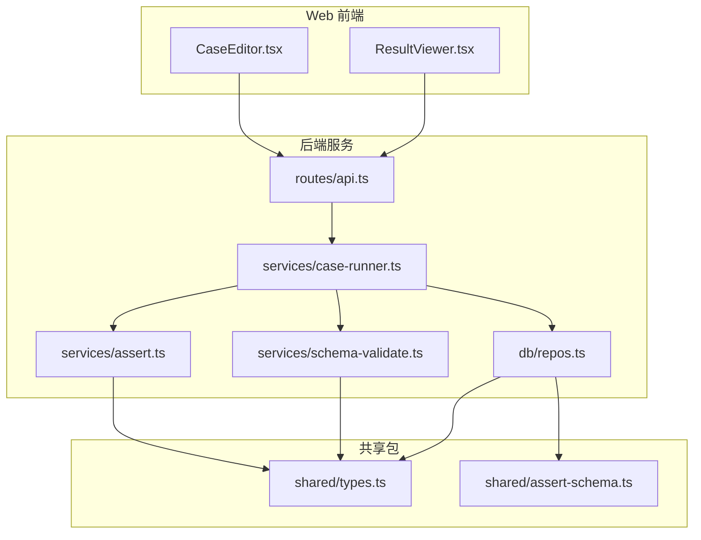
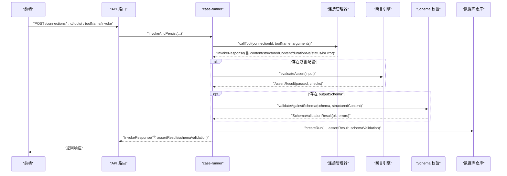
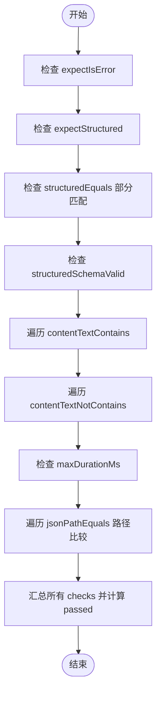
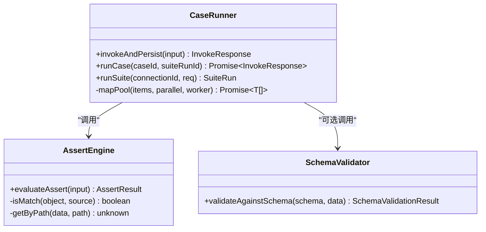
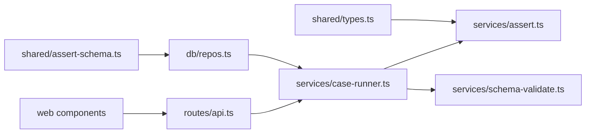
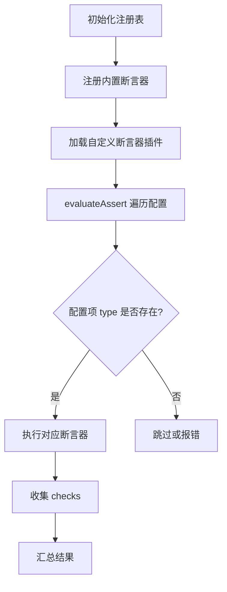

# 断言系统架构

<cite>
**本文引用的文件**   
- [apps/server/src/services/assert.ts](file://apps/server/src/services/assert.ts)
- [packages/shared/src/types.ts](file://packages/shared/src/types.ts)
- [packages/shared/src/assert-schema.ts](file://packages/shared/src/assert-schema.ts)
- [apps/server/src/services/schema-validate.ts](file://apps/server/src/services/schema-validate.ts)
- [apps/server/src/services/case-runner.ts](file://apps/server/src/services/case-runner.ts)
- [apps/server/src/db/repos.ts](file://apps/server/src/db/repos.ts)
- [apps/server/src/routes/api.ts](file://apps/server/src/routes/api.ts)
- [apps/web/src/components/CaseEditor.tsx](file://apps/web/src/components/CaseEditor.tsx)
- [apps/web/src/components/ResultViewer.tsx](file://apps/web/src/components/ResultViewer.tsx)
</cite>

## 目录
1. [简介](#简介)
2. [项目结构](#项目结构)
3. [核心组件](#核心组件)
4. [架构总览](#架构总览)
5. [详细组件分析](#详细组件分析)
6. [依赖关系分析](#依赖关系分析)
7. [性能与并发](#性能与并发)
8. [故障排查指南](#故障排查指南)
9. [结论](#结论)
10. [附录：自定义断言器开发指南](#附录自定义断言器开发指南)

## 简介
本文件系统化梳理 MCP 调试工具的“断言系统”实现，覆盖断言引擎的核心架构、可扩展设计、内置断言器的实现方式、结果评估与错误聚合、报告生成、上下文管理（变量注入、中间结果引用、条件判断）、性能优化（并行执行与超时控制），以及自定义断言器的开发与最佳实践。文档面向不同技术背景的读者，提供从高层到代码级的渐进式说明与可视化图示。

## 项目结构
断言系统贯穿前后端与服务层：
- 共享类型与断言配置归一化位于 packages/shared
- 服务端断言引擎与 Schema 校验位于 apps/server/src/services
- 用例运行套件与持久化位于 apps/server/src/services 与 apps/server/src/db
- Web 前端提供断言配置编辑与结果展示

图表来源
- [apps/server/src/routes/api.ts:117-138](file://apps/server/src/routes/api.ts#L117-L138)
- [apps/server/src/services/case-runner.ts:11-77](file://apps/server/src/services/case-runner.ts#L11-L77)
- [apps/server/src/services/assert.ts:58-165](file://apps/server/src/services/assert.ts#L58-L165)
- [apps/server/src/services/schema-validate.ts:27-60](file://apps/server/src/services/schema-validate.ts#L27-L60)
- [apps/server/src/db/repos.ts:117-125](file://apps/server/src/db/repos.ts#L117-L125)
- [packages/shared/src/types.ts:19-46](file://packages/shared/src/types.ts#L19-L46)
- [packages/shared/src/assert-schema.ts:11-31](file://packages/shared/src/assert-schema.ts#L11-L31)

章节来源
- [apps/server/src/routes/api.ts:117-138](file://apps/server/src/routes/api.ts#L117-L138)
- [apps/server/src/services/case-runner.ts:11-77](file://apps/server/src/services/case-runner.ts#L11-L77)
- [apps/server/src/services/assert.ts:58-165](file://apps/server/src/services/assert.ts#L58-L165)
- [apps/server/src/services/schema-validate.ts:27-60](file://apps/server/src/services/schema-validate.ts#L27-L60)
- [apps/server/src/db/repos.ts:117-125](file://apps/server/src/db/repos.ts#L117-L125)
- [packages/shared/src/types.ts:19-46](file://packages/shared/src/types.ts#L19-L46)
- [packages/shared/src/assert-schema.ts:11-31](file://packages/shared/src/assert-schema.ts#L11-L31)

## 核心组件
- 断言配置与结果模型：定义在 shared/types.ts，包括 AssertConfig、AssertResult、SchemaValidationResult 等
- 断言配置归一化：shared/assert-schema.ts 提供 emptyAssert 与 normalizeAssert，确保断言配置的默认值与类型安全
- 断言引擎：server/services/assert.ts 的 evaluateAssert 函数，负责逐项检查并汇总为 AssertResult
- Schema 校验：server/services/schema-validate.ts 基于 AJV 对 structuredContent 进行 JSON Schema 验证
- 用例运行与持久化：server/services/case-runner.ts 调用连接管理器执行工具，按需执行断言并持久化
- 数据访问层：server/db/repos.ts 负责用例、运行记录、套件运行的读写，并在映射时应用 normalizeAssert

章节来源
- [packages/shared/src/types.ts:19-46](file://packages/shared/src/types.ts#L19-L46)
- [packages/shared/src/assert-schema.ts:11-31](file://packages/shared/src/assert-schema.ts#L11-L31)
- [apps/server/src/services/assert.ts:58-165](file://apps/server/src/services/assert.ts#L58-L165)
- [apps/server/src/services/schema-validate.ts:27-60](file://apps/server/src/services/schema-validate.ts#L27-L60)
- [apps/server/src/services/case-runner.ts:11-77](file://apps/server/src/services/case-runner.ts#L11-L77)
- [apps/server/src/db/repos.ts:117-125](file://apps/server/src/db/repos.ts#L117-L125)

## 架构总览
断言系统在“调用-断言-持久化-展示”链路中扮演关键角色：
- 前端通过 API 触发工具调用或运行用例/套件
- 服务端调用 MCP 连接执行工具，得到结构化与非结构化输出
- 若存在断言配置，则进入断言引擎；同时可选进行 outputSchema 校验
- 将断言结果与运行记录持久化
- 前端以标签页形式展示结构化内容、非结构化内容、断言结果、Schema 校验详情与原始摘要

图表来源
- [apps/server/src/routes/api.ts:117-138](file://apps/server/src/routes/api.ts#L117-L138)
- [apps/server/src/services/case-runner.ts:11-77](file://apps/server/src/services/case-runner.ts#L11-L77)
- [apps/server/src/services/assert.ts:58-165](file://apps/server/src/services/assert.ts#L58-L165)
- [apps/server/src/services/schema-validate.ts:27-60](file://apps/server/src/services/schema-validate.ts#L27-L60)
- [apps/server/src/db/repos.ts:476-528](file://apps/server/src/db/repos.ts#L476-L528)

## 详细组件分析

### 断言引擎 evaluateAssert
- 输入：断言配置、是否错误、content 列表、structuredContent、耗时、schema 校验结果
- 处理逻辑：
  - 错误期望：expectIsError
  - 结构化存在性：expectStructured
  - 结构化部分匹配：structuredEquals（使用 isMatch 深度部分匹配）
  - 结构化 Schema 校验：structuredSchemaValid（依赖外部 schema 校验结果）
  - 文本包含/不包含：contentTextContains/contentTextNotContains
  - 最大耗时：maxDurationMs
  - JSONPath 相等：jsonPathEquals（支持 $.a.b[0] 路径解析）
- 输出：AssertResult，包含总体 passed 与每个 check 的 name/pass/message/expected/actual

图表来源
- [apps/server/src/services/assert.ts:58-165](file://apps/server/src/services/assert.ts#L58-L165)

章节来源
- [apps/server/src/services/assert.ts:58-165](file://apps/server/src/services/assert.ts#L58-L165)

### 断言配置与类型
- AssertConfig 字段涵盖错误期望、结构化存在性、部分匹配、Schema 校验开关、文本包含/不包含、最大耗时、JSONPath 相等数组
- AssertResult 由多个 AssertCheck 组成，每个 check 包含名称、是否通过、消息、期望与实际值
- SchemaValidationResult 表示 JSON Schema 校验结果，包含 ok 与错误列表

章节来源
- [packages/shared/src/types.ts:19-46](file://packages/shared/src/types.ts#L19-L46)

### 断言配置归一化
- emptyAssert 提供默认空配置
- normalizeAssert 将传入的配置规范化，缺失字段填充默认值，确保后续断言引擎稳定运行
- 数据访问层在读取用例时将断言字段进行 normalizeAssert 处理，保证存储与读取一致性

章节来源
- [packages/shared/src/assert-schema.ts:11-31](file://packages/shared/src/assert-schema.ts#L11-L31)
- [apps/server/src/db/repos.ts:117-125](file://apps/server/src/db/repos.ts#L117-L125)

### JSON Schema 校验
- 使用 AJV 2020 编译工具声明的 outputSchema，对 structuredContent 进行严格校验
- 当 schema 为空时直接返回通过；当 structuredContent 缺失且需要校验时返回失败
- 捕获编译期异常，统一转换为错误信息

章节来源
- [apps/server/src/services/schema-validate.ts:27-60](file://apps/server/src/services/schema-validate.ts#L27-L60)

### 用例运行与套件执行
- invokeAndPersist：调用连接管理器执行工具，若有断言配置则执行 evaluateAssert，并将结果持久化
- runCase：根据用例配置执行一次调用与断言
- runSuite：按过滤条件加载用例，支持并行度 parallel，统计通过/失败数量，更新套件状态

图表来源
- [apps/server/src/services/case-runner.ts:11-161](file://apps/server/src/services/case-runner.ts#L11-L161)
- [apps/server/src/services/assert.ts:58-165](file://apps/server/src/services/assert.ts#L58-L165)
- [apps/server/src/services/schema-validate.ts:27-60](file://apps/server/src/services/schema-validate.ts#L27-L60)

章节来源
- [apps/server/src/services/case-runner.ts:11-161](file://apps/server/src/services/case-runner.ts#L11-L161)

### 前端断言配置与结果展示
- CaseEditor：提供断言字段的表单编辑，包括 expectIsError、expectStructured、structuredSchemaValid、maxDurationMs、contentTextContains、structuredEquals 等
- ResultViewer：以标签页展示结构化输出、非结构化内容、断言结果、Schema 校验详情与原始摘要；断言面板显示每个 check 的名称与状态

章节来源
- [apps/web/src/components/CaseEditor.tsx:79-164](file://apps/web/src/components/CaseEditor.tsx#L79-L164)
- [apps/web/src/components/ResultViewer.tsx:196-213](file://apps/web/src/components/ResultViewer.tsx#L196-L213)

## 依赖关系分析
- 断言引擎依赖共享类型与 isMatch/getByPath 辅助方法
- 用例运行依赖断言引擎与 Schema 校验，并通过仓库持久化
- 数据访问层在映射用例与运行记录时应用 normalizeAssert 与 JSON 序列化/反序列化
- 前端通过 API 与后端交互，渲染断言结果与校验信息

图表来源
- [packages/shared/src/types.ts:19-46](file://packages/shared/src/types.ts#L19-L46)
- [packages/shared/src/assert-schema.ts:11-31](file://packages/shared/src/assert-schema.ts#L11-L31)
- [apps/server/src/services/assert.ts:58-165](file://apps/server/src/services/assert.ts#L58-L165)
- [apps/server/src/services/schema-validate.ts:27-60](file://apps/server/src/services/schema-validate.ts#L27-L60)
- [apps/server/src/services/case-runner.ts:11-77](file://apps/server/src/services/case-runner.ts#L11-L77)
- [apps/server/src/db/repos.ts:117-125](file://apps/server/src/db/repos.ts#L117-L125)
- [apps/server/src/routes/api.ts:117-138](file://apps/server/src/routes/api.ts#L117-L138)
- [apps/web/src/components/CaseEditor.tsx:79-164](file://apps/web/src/components/CaseEditor.tsx#L79-L164)
- [apps/web/src/components/ResultViewer.tsx:196-213](file://apps/web/src/components/ResultViewer.tsx#L196-L213)

章节来源
- [packages/shared/src/types.ts:19-46](file://packages/shared/src/types.ts#L19-L46)
- [packages/shared/src/assert-schema.ts:11-31](file://packages/shared/src/assert-schema.ts#L11-L31)
- [apps/server/src/services/assert.ts:58-165](file://apps/server/src/services/assert.ts#L58-L165)
- [apps/server/src/services/schema-validate.ts:27-60](file://apps/server/src/services/schema-validate.ts#L27-L60)
- [apps/server/src/services/case-runner.ts:11-77](file://apps/server/src/services/case-runner.ts#L11-L77)
- [apps/server/src/db/repos.ts:117-125](file://apps/server/src/db/repos.ts#L117-L125)
- [apps/server/src/routes/api.ts:117-138](file://apps/server/src/routes/api.ts#L117-L138)
- [apps/web/src/components/CaseEditor.tsx:79-164](file://apps/web/src/components/CaseEditor.tsx#L79-L164)
- [apps/web/src/components/ResultViewer.tsx:196-213](file://apps/web/src/components/ResultViewer.tsx#L196-L213)

## 性能与并发
- 并行执行：runSuite 使用 mapPool 控制并发度，避免过多并发导致资源争用
- 超时控制：断言侧通过 maxDurationMs 限制单次断言可接受的耗时；MCP 连接层的超时由连接配置决定（未在断言引擎内直接实现）
- 性能建议：
  - 合理设置 parallel，结合网络与数据库负载调优
  - 减少不必要的结构化内容大小，避免 JSON.stringify 开销过大
  - 对于复杂断言，优先使用结构化字段与 JSONPath 精确匹配，降低文本匹配成本

章节来源
- [apps/server/src/services/case-runner.ts:94-109](file://apps/server/src/services/case-runner.ts#L94-L109)
- [apps/server/src/services/assert.ts:136-147](file://apps/server/src/services/assert.ts#L136-L147)

## 故障排查指南
- 断言失败定位：查看 AssertResult.checks 中的 message 与 expected/actual，快速定位具体失败的检查项
- Schema 校验失败：查看 schemaValidation.errors 中的 path 与 message，定位不符合 outputSchema 的路径与原因
- 协议/连接错误：前端 ResultViewer 会提取 protocolError 或结构化错误字段，便于快速诊断
- 常见错误场景：
  - structuredContent 缺失但启用了 structuredSchemaValid
  - JSONPath 路径不存在或类型不匹配
  - 文本包含/不包含规则过于严格导致误判

章节来源
- [apps/web/src/components/ResultViewer.tsx:196-213](file://apps/web/src/components/ResultViewer.tsx#L196-L213)
- [apps/web/src/components/ResultViewer.tsx:305-326](file://apps/web/src/components/ResultViewer.tsx#L305-L326)
- [apps/server/src/services/assert.ts:114-159](file://apps/server/src/services/assert.ts#L114-L159)
- [apps/server/src/services/schema-validate.ts:34-59](file://apps/server/src/services/schema-validate.ts#L34-L59)

## 结论
当前断言系统以简洁清晰的配置模型为核心，围绕 evaluateAssert 实现多项内置断言能力，并与 JSON Schema 校验协同工作。通过 normalizeAssert 保障配置健壮性，借助 mapPool 实现套件并行执行，整体架构具备良好的扩展性与可维护性。未来可在断言引擎中引入更丰富的内置断言器与动态加载机制，进一步提升灵活性与性能。

## 附录：自定义断言器开发指南

### 目标与范围
- 在不破坏现有断言流程的前提下，新增自定义断言器
- 保持断言结果结构与错误聚合一致
- 支持在断言上下文中访问变量与中间结果（如 structuredContent、content 文本、durationMs、schema 校验结果）

### 设计原则
- 单一职责：每个断言器只负责一种检查逻辑
- 幂等与无副作用：断言器不应修改输入数据
- 明确错误信息：每个断言器应提供可读的 message 与 expected/actual

### 扩展点与注册机制（建议方案）
- 在断言引擎入口维护一个断言器注册表（Map<string, AssertFn>）
- 断言器以键名注册，断言配置中通过 type/name 指定要执行的断言器
- 运行时根据配置查找并执行对应断言器，收集检查结果

### 断言器接口约定（建议）
- 输入参数：断言上下文（包含 structuredContent、content、durationMs、schemaValidation 等）
- 返回值：单个 AssertCheck 或一组 AssertCheck
- 错误处理：抛出异常或返回失败检查项，统一被上层捕获并聚合

### 示例步骤（概念性）
- 定义断言器函数，接收上下文并返回检查项
- 在启动阶段将断言器注册到注册表
- 在断言配置中使用新断言器的 type/name
- 前端增加对应的配置 UI 控件
- 运行后在断言面板查看结果

### 最佳实践
- 优先复用已有能力（如 JSONPath、文本包含、Schema 校验）组合实现复杂断言
- 对大对象比较采用部分匹配策略，避免全量深比较带来的性能问题
- 为断言器编写单元测试，覆盖边界条件与异常路径
- 在断言器中保留足够的上下文信息，便于问题回溯

[本节为概念性指导，不直接分析具体源码文件]