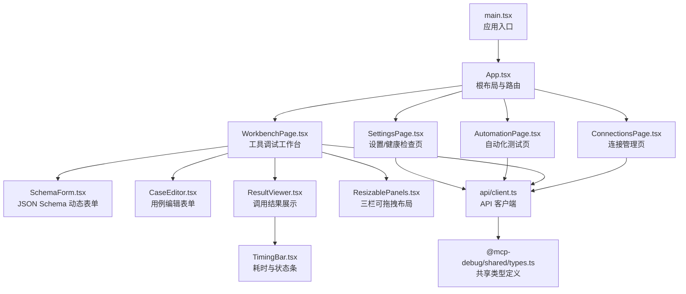
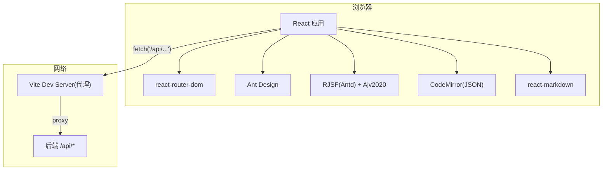
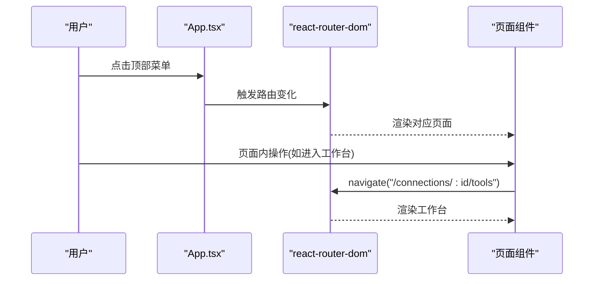
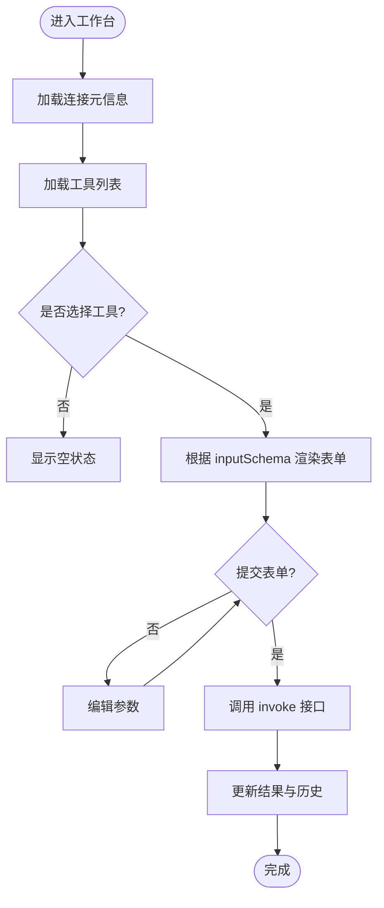
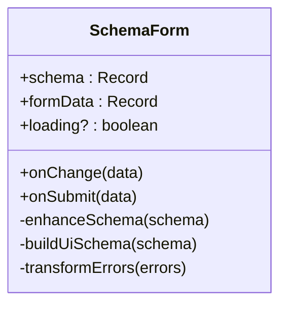
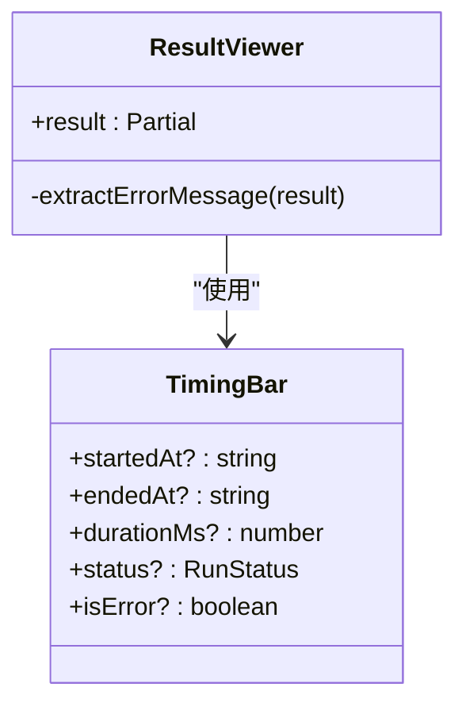
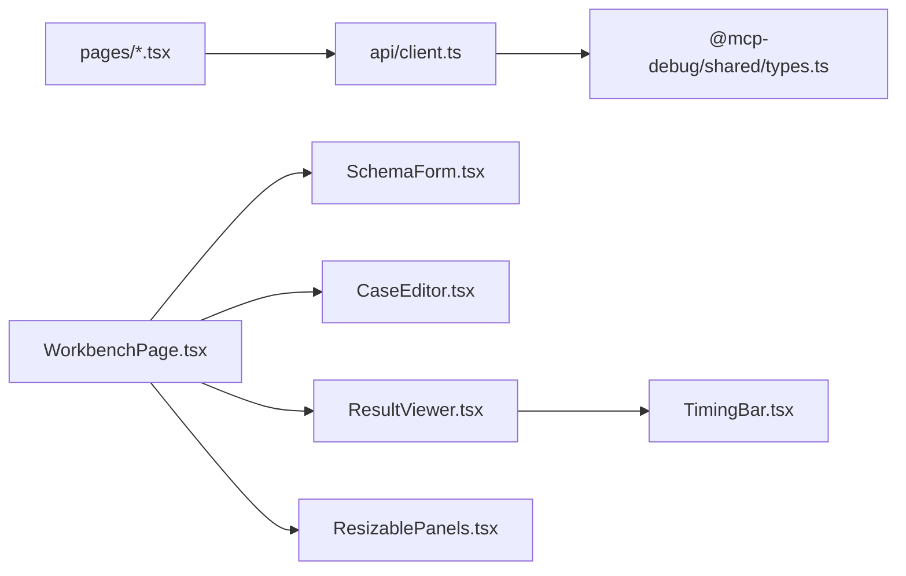

# 前端架构

<cite>
**本文引用的文件**   
- [apps/web/src/main.tsx](file://apps/web/src/main.tsx)
- [apps/web/src/App.tsx](file://apps/web/src/App.tsx)
- [apps/web/vite.config.ts](file://apps/web/vite.config.ts)
- [apps/web/package.json](file://apps/web/package.json)
- [apps/web/src/pages/ConnectionsPage.tsx](file://apps/web/src/pages/ConnectionsPage.tsx)
- [apps/web/src/pages/WorkbenchPage.tsx](file://apps/web/src/pages/WorkbenchPage.tsx)
- [apps/web/src/pages/AutomationPage.tsx](file://apps/web/src/pages/AutomationPage.tsx)
- [apps/web/src/pages/SettingsPage.tsx](file://apps/web/src/pages/SettingsPage.tsx)
- [apps/web/src/api/client.ts](file://apps/web/src/api/client.ts)
- [apps/web/src/components/SchemaForm.tsx](file://apps/web/src/components/SchemaForm.tsx)
- [apps/web/src/components/CaseEditor.tsx](file://apps/web/src/components/CaseEditor.tsx)
- [apps/web/src/components/ResultViewer.tsx](file://apps/web/src/components/ResultViewer.tsx)
- [apps/web/src/components/ResizablePanels.tsx](file://apps/web/src/components/ResizablePanels.tsx)
- [apps/web/src/components/TimingBar.tsx](file://apps/web/src/components/TimingBar.tsx)
- [packages/shared/src/types.ts](file://packages/shared/src/types.ts)
- [apps/web/src/styles.css](file://apps/web/src/styles.css)
</cite>

## 目录
1. [简介](#简介)
2. [项目结构](#项目结构)
3. [核心组件](#核心组件)
4. [架构总览](#架构总览)
5. [详细组件分析](#详细组件分析)
6. [依赖关系分析](#依赖关系分析)
7. [性能与构建优化](#性能与构建优化)
8. [故障排查指南](#故障排查指南)
9. [结论](#结论)

## 简介
本文件面向基于 React + Vite 的前端应用，系统化梳理其架构设计、页面职责、UI 组件库集成、自定义组件模式、前后端通信机制、错误处理策略以及开发与构建流程。重点覆盖以下方面：
- 组件层次结构与路由配置
- 状态管理模式（轻量级本地状态为主）
- 页面组件职责划分与交互关系
- Ant Design 集成与主题配置
- 自定义组件 SchemaForm、CaseEditor、ResultViewer 的设计模式
- API 客户端封装与错误处理
- 性能优化、代码分割策略与开发工作流

## 项目结构
前端位于 apps/web 子包，采用按功能域组织的方式：
- src/pages：页面级组件（连接管理、工作台、自动化、设置）
- src/components：可复用 UI 组件（表单生成器、用例编辑器、结果查看器、面板布局、计时条）
- src/api：统一的 HTTP 请求封装
- src/styles.css：全局样式与布局
- vite.config.ts：Vite 开发服务器与插件配置
- package.json：脚本与依赖声明

图表来源
- [apps/web/src/main.tsx:1-26](file://apps/web/src/main.tsx#L1-L26)
- [apps/web/src/App.tsx:1-66](file://apps/web/src/App.tsx#L1-L66)
- [apps/web/src/pages/ConnectionsPage.tsx:1-291](file://apps/web/src/pages/ConnectionsPage.tsx#L1-L291)
- [apps/web/src/pages/WorkbenchPage.tsx:1-541](file://apps/web/src/pages/WorkbenchPage.tsx#L1-L541)
- [apps/web/src/pages/AutomationPage.tsx:1-207](file://apps/web/src/pages/AutomationPage.tsx#L1-L207)
- [apps/web/src/pages/SettingsPage.tsx:1-39](file://apps/web/src/pages/SettingsPage.tsx#L1-L39)
- [apps/web/src/components/SchemaForm.tsx:1-421](file://apps/web/src/components/SchemaForm.tsx#L1-L421)
- [apps/web/src/components/CaseEditor.tsx:1-168](file://apps/web/src/components/CaseEditor.tsx#L1-L168)
- [apps/web/src/components/ResultViewer.tsx:1-390](file://apps/web/src/components/ResultViewer.tsx#L1-L390)
- [apps/web/src/components/ResizablePanels.tsx:1-153](file://apps/web/src/components/ResizablePanels.tsx#L1-L153)
- [apps/web/src/components/TimingBar.tsx:1-52](file://apps/web/src/components/TimingBar.tsx#L1-L52)
- [apps/web/src/api/client.ts:1-122](file://apps/web/src/api/client.ts#L1-L122)
- [packages/shared/src/types.ts:1-229](file://packages/shared/src/types.ts#L1-L229)

章节来源
- [apps/web/src/main.tsx:1-26](file://apps/web/src/main.tsx#L1-L26)
- [apps/web/src/App.tsx:1-66](file://apps/web/src/App.tsx#L1-L66)
- [apps/web/vite.config.ts:1-16](file://apps/web/vite.config.ts#L1-L16)
- [apps/web/package.json:1-38](file://apps/web/package.json#L1-L38)

## 核心组件
- 应用壳与路由
  - main.tsx 负责初始化 React 根节点、注入 Ant Design 主题与中文语言包、提供 BrowserRouter 路由上下文。
  - App.tsx 使用 Ant Design Layout 作为外壳，顶部导航菜单驱动页面切换；通过 react-router-dom 的 Routes/Route 进行页面路由映射，并实现默认重定向与通配符兜底。
- 页面组件
  - ConnectionsPage：连接列表、创建/删除、连接/断开、同步 Tools、导入导出。
  - WorkbenchPage：工具选择、参数表单、调用执行、用例管理、历史查看、Schema 预览、结果展示。
  - AutomationPage：批量套件运行、并发控制、最近套件运行明细。
  - SettingsPage：后端健康检查与系统信息展示。
- 通用组件
  - SchemaForm：基于 RJSF + Ajv2020 的动态表单，支持 oneOf/anyOf 增强与 JSON 模式直编。
  - CaseEditor：用例编辑表单，包含断言配置与结构化匹配。
  - ResultViewer：统一的结果视图，含时间轴、结构化输出、非结构化内容、断言与校验详情。
  - ResizablePanels：三栏可拖拽布局，支持宽度持久化。
  - TimingBar：渲染发起/结束时间与耗时、状态标签。

章节来源
- [apps/web/src/main.tsx:1-26](file://apps/web/src/main.tsx#L1-L26)
- [apps/web/src/App.tsx:1-66](file://apps/web/src/App.tsx#L1-L66)
- [apps/web/src/pages/ConnectionsPage.tsx:1-291](file://apps/web/src/pages/ConnectionsPage.tsx#L1-L291)
- [apps/web/src/pages/WorkbenchPage.tsx:1-541](file://apps/web/src/pages/WorkbenchPage.tsx#L1-L541)
- [apps/web/src/pages/AutomationPage.tsx:1-207](file://apps/web/src/pages/AutomationPage.tsx#L1-L207)
- [apps/web/src/pages/SettingsPage.tsx:1-39](file://apps/web/src/pages/SettingsPage.tsx#L1-L39)
- [apps/web/src/components/SchemaForm.tsx:1-421](file://apps/web/src/components/SchemaForm.tsx#L1-L421)
- [apps/web/src/components/CaseEditor.tsx:1-168](file://apps/web/src/components/CaseEditor.tsx#L1-L168)
- [apps/web/src/components/ResultViewer.tsx:1-390](file://apps/web/src/components/ResultViewer.tsx#L1-L390)
- [apps/web/src/components/ResizablePanels.tsx:1-153](file://apps/web/src/components/ResizablePanels.tsx#L1-L153)
- [apps/web/src/components/TimingBar.tsx:1-52](file://apps/web/src/components/TimingBar.tsx#L1-L52)

## 架构总览
整体采用“页面组件 + 通用组件 + 统一 API 客户端”的分层模式：
- 表现层：页面组件组合通用组件完成业务界面
- 数据层：通过 api/client.ts 访问后端 /api/* 接口
- 类型契约：@mcp-debug/shared 提供前后端共享的类型定义
- 构建与开发：Vite 提供热更新与代理转发，Ant Design 提供 UI 基础能力

图表来源
- [apps/web/src/main.tsx:1-26](file://apps/web/src/main.tsx#L1-L26)
- [apps/web/src/App.tsx:1-66](file://apps/web/src/App.tsx#L1-L66)
- [apps/web/src/api/client.ts:1-122](file://apps/web/src/api/client.ts#L1-L122)
- [apps/web/vite.config.ts:1-16](file://apps/web/vite.config.ts#L1-L16)
- [apps/web/src/components/SchemaForm.tsx:1-421](file://apps/web/src/components/SchemaForm.tsx#L1-L421)
- [apps/web/src/components/ResultViewer.tsx:1-390](file://apps/web/src/components/ResultViewer.tsx#L1-L390)

## 详细组件分析

### 路由与页面导航
- 路由定义
  - 根路径重定向到连接页
  - /connections 连接管理
  - /connections/:id/tools 工具调试工作台
  - /automation 自动化测试
  - /settings 设置与健康检查
- 导航行为
  - 顶部菜单根据当前路径高亮选中项
  - 页面内按钮通过 Link 或 useNavigate 跳转

图表来源
- [apps/web/src/App.tsx:1-66](file://apps/web/src/App.tsx#L1-L66)
- [apps/web/src/pages/WorkbenchPage.tsx:1-541](file://apps/web/src/pages/WorkbenchPage.tsx#L1-L541)
- [apps/web/src/pages/ConnectionsPage.tsx:1-291](file://apps/web/src/pages/ConnectionsPage.tsx#L1-L291)

章节来源
- [apps/web/src/App.tsx:1-66](file://apps/web/src/App.tsx#L1-L66)

### 连接管理页面（ConnectionsPage）
- 职责
  - 列出所有 MCP 连接，显示在线状态、传输方式、最近连接时间、错误信息
  - 新建连接（名称、URL、传输、超时、描述、Headers JSON）
  - 连接/断开、同步 Tools、删除连接
  - 导入/导出配置（导出包含凭据，需安全提示）
- 交互要点
  - 使用 antd Form 校验与提交
  - 通过 api.client 调用后端连接相关接口
  - 成功后刷新列表并反馈消息

章节来源
- [apps/web/src/pages/ConnectionsPage.tsx:1-291](file://apps/web/src/pages/ConnectionsPage.tsx#L1-L291)
- [apps/web/src/api/client.ts:1-122](file://apps/web/src/api/client.ts#L1-L122)

### 工作台页面（WorkbenchPage）
- 职责
  - 左侧：工具搜索与列表
  - 中间：根据 inputSchema 动态生成表单，支持“表单/JSON”双模式，提交调用 Tool
  - 右侧：统一结果展示（结构化输出、非结构化 content、断言、Schema 校验、原始摘要）
  - 用例管理：新建/编辑/运行/删除用例，支持将当前参数保存为用例
  - 历史记录：分页展示最近调用记录，支持重用参数与查看结果
  - 顶部操作：返回连接列表、同步 Tools、运行当前 Tool 全部用例
- 关键流程（调用 Tool）
  - 从 URL 参数获取 connectionId
  - 加载连接元信息与工具列表
  - 选择工具后，根据 inputSchema 渲染表单
  - 提交时调用 invoke 接口，更新结果与历史

图表来源
- [apps/web/src/pages/WorkbenchPage.tsx:1-541](file://apps/web/src/pages/WorkbenchPage.tsx#L1-L541)
- [apps/web/src/components/SchemaForm.tsx:1-421](file://apps/web/src/components/SchemaForm.tsx#L1-L421)
- [apps/web/src/components/ResultViewer.tsx:1-390](file://apps/web/src/components/ResultViewer.tsx#L1-L390)
- [apps/web/src/api/client.ts:1-122](file://apps/web/src/api/client.ts#L1-L122)

章节来源
- [apps/web/src/pages/WorkbenchPage.tsx:1-541](file://apps/web/src/pages/WorkbenchPage.tsx#L1-L541)

### 自动化测试页面（AutomationPage）
- 职责
  - 选择连接，筛选用例（支持 tags），设置并发度与套件名
  - 执行套件，展示最近套件运行统计与明细
- 交互要点
  - 使用 antd Form 收集参数
  - 调用 runSuite 接口，刷新套件运行列表
  - 打开 Modal 展示套件明细（各用例运行状态、耗时、断言）

章节来源
- [apps/web/src/pages/AutomationPage.tsx:1-207](file://apps/web/src/pages/AutomationPage.tsx#L1-L207)
- [apps/web/src/api/client.ts:1-122](file://apps/web/src/api/client.ts#L1-L122)

### 设置页面（SettingsPage）
- 职责
  - 拉取后端健康检查信息，展示数据库方言、默认超时、传输方式、JSON Schema 版本与环境变量说明
- 交互要点
  - 首次加载调用 health 接口，失败则提示错误

章节来源
- [apps/web/src/pages/SettingsPage.tsx:1-39](file://apps/web/src/pages/SettingsPage.tsx#L1-L39)
- [apps/web/src/api/client.ts:1-122](file://apps/web/src/api/client.ts#L1-L122)

### 自定义组件：SchemaForm
- 设计模式
  - 受控组件：通过 props.schema/formData/onChange/onSubmit 与父组件双向绑定
  - 动态表单：基于 RJSF + Ajv2020，自动根据 JSON Schema 生成字段与校验
  - oneOf/anyOf 增强：提升分支所需字段至选项内部，避免父级公共字段干扰
  - 双模式输入：表单模式与 JSON 模式切换，JSON 模式实时解析与错误提示
  - 错误翻译：将 Ajv 错误转换为简洁中文提示
- 复杂度与性能
  - 使用 useMemo 缓存增强后的 schema 与 uiSchema，减少重复计算
  - 大对象 JSON 编辑使用 CodeMirror，避免频繁全量渲染

图表来源
- [apps/web/src/components/SchemaForm.tsx:1-421](file://apps/web/src/components/SchemaForm.tsx#L1-L421)

章节来源
- [apps/web/src/components/SchemaForm.tsx:1-421](file://apps/web/src/components/SchemaForm.tsx#L1-L421)

### 自定义组件：CaseEditor
- 设计模式
  - 受控组件：value/onChange 模式维护用例表单值
  - 断言配置：支持 expectIsError、expectStructured、structuredEquals、contentTextContains、maxDurationMs 等
  - JSON 编辑：arguments 与 structuredEquals 使用 CodeMirror 编辑，即时解析
- 数据结构
  - 与 @mcp-debug/shared 中的 TestCase/AssertConfig 对齐

章节来源
- [apps/web/src/components/CaseEditor.tsx:1-168](file://apps/web/src/components/CaseEditor.tsx#L1-L168)
- [packages/shared/src/types.ts:1-229](file://packages/shared/src/types.ts#L1-L229)

### 自定义组件：ResultViewer
- 设计模式
  - 只读展示：接收 Partial<InvokeResponse>，根据字段决定默认 Tab
  - 多视图：结构化输出、非结构化 content、断言、Schema 校验、原始摘要
  - 错误提取：优先从 protocolError/structuredContent/content 中提取错误信息
  - Markdown 渲染：text 内容使用 react-markdown + remark-gfm 渲染
- 辅助组件
  - TimingBar：渲染时间线与状态标签
  - JsonPane：只读 JSON 展示

图表来源
- [apps/web/src/components/ResultViewer.tsx:1-390](file://apps/web/src/components/ResultViewer.tsx#L1-L390)
- [apps/web/src/components/TimingBar.tsx:1-52](file://apps/web/src/components/TimingBar.tsx#L1-L52)

章节来源
- [apps/web/src/components/ResultViewer.tsx:1-390](file://apps/web/src/components/ResultViewer.tsx#L1-L390)
- [apps/web/src/components/TimingBar.tsx:1-52](file://apps/web/src/components/TimingBar.tsx#L1-L52)

### 布局组件：ResizablePanels
- 设计模式
  - 三栏布局：固定宽度与 flex 自适应混合
  - 拖拽调整：PointerEvent 驱动，限制最小/最大宽度
  - 持久化：localStorage 存储宽度配置，key 由 storageKey 指定
- 适用场景
  - 工作台三栏（工具列表/表单/结果）

章节来源
- [apps/web/src/components/ResizablePanels.tsx:1-153](file://apps/web/src/components/ResizablePanels.tsx#L1-L153)
- [apps/web/src/styles.css:72-153](file://apps/web/src/styles.css#L72-L153)

## 依赖关系分析
- 外部依赖
  - React 18、react-router-dom 7、antd 5、@rjsf/antd、ajv、@uiw/react-codemirror、react-markdown、dayjs
- 内部依赖
  - 页面组件依赖 api/client.ts
  - 通用组件依赖 shared types
  - 样式集中在 styles.css

图表来源
- [apps/web/src/pages/WorkbenchPage.tsx:1-541](file://apps/web/src/pages/WorkbenchPage.tsx#L1-L541)
- [apps/web/src/api/client.ts:1-122](file://apps/web/src/api/client.ts#L1-L122)
- [packages/shared/src/types.ts:1-229](file://packages/shared/src/types.ts#L1-L229)
- [apps/web/src/components/SchemaForm.tsx:1-421](file://apps/web/src/components/SchemaForm.tsx#L1-L421)
- [apps/web/src/components/CaseEditor.tsx:1-168](file://apps/web/src/components/CaseEditor.tsx#L1-L168)
- [apps/web/src/components/ResultViewer.tsx:1-390](file://apps/web/src/components/ResultViewer.tsx#L1-L390)
- [apps/web/src/components/TimingBar.tsx:1-52](file://apps/web/src/components/TimingBar.tsx#L1-L52)
- [apps/web/src/components/ResizablePanels.tsx:1-153](file://apps/web/src/components/ResizablePanels.tsx#L1-L153)

章节来源
- [apps/web/package.json:1-38](file://apps/web/package.json#L1-L38)
- [apps/web/src/api/client.ts:1-122](file://apps/web/src/api/client.ts#L1-L122)
- [packages/shared/src/types.ts:1-229](file://packages/shared/src/types.ts#L1-L229)

## 性能与构建优化
- 构建与开发
  - Vite 插件：@vitejs/plugin-react 启用 React 支持
  - 开发服务器：端口 5173，/api 代理到 http://localhost:8787，changeOrigin 开启
  - 构建脚本：tsc -b && vite build，先类型检查再打包
- 运行时优化
  - 表单与结果展示大量使用 useMemo 缓存计算结果，降低重渲染开销
  - JSON 编辑使用 CodeMirror，避免全量 DOM 重建
  - 长文本与错误信息使用 CSS 换行与滚动容器，防止布局抖动
- 代码分割策略
  - 当前未显式使用动态 import() 进行路由级懒加载；可按需对页面组件进行懒加载以减小首屏体积
  - 建议：对 WorkbenchPage、AutomationPage、SettingsPage 使用 React.lazy + Suspense 包裹，结合路由按需加载
- 样式与主题
  - Ant Design ConfigProvider 集中配置主题 token（主色、圆角）与中文语言包，保证一致性

章节来源
- [apps/web/vite.config.ts:1-16](file://apps/web/vite.config.ts#L1-L16)
- [apps/web/package.json:1-38](file://apps/web/package.json#L1-L38)
- [apps/web/src/main.tsx:1-26](file://apps/web/src/main.tsx#L1-L26)
- [apps/web/src/styles.css:1-562](file://apps/web/src/styles.css#L1-L562)

## 故障排查指南
- 网络与代理
  - 确认 Vite 开发服务器已启动且 /api 代理目标可达
  - 若跨域问题出现，检查 changeOrigin 与后端 CORS 配置
- API 客户端错误
  - request 函数在 res.ok 为 false 时抛出错误，错误消息取自响应体 error 字段或 statusText
  - 建议在页面层捕获异常并通过 message.error 提示用户
- 表单校验
  - SchemaForm 使用 Ajv2020 校验，错误信息经 transformErrors 转为中文
  - JSON 模式下解析失败会提示错误，需修正后再切回表单
- 结果展示
  - ResultViewer 会优先提取协议错误或工具错误信息，必要时查看“原始摘要”定位问题
- 布局与交互
  - ResizablePanels 拖拽无效时检查 PointerEvent 兼容性或事件冒泡阻止逻辑

章节来源
- [apps/web/src/api/client.ts:1-122](file://apps/web/src/api/client.ts#L1-L122)
- [apps/web/src/components/SchemaForm.tsx:1-421](file://apps/web/src/components/SchemaForm.tsx#L1-L421)
- [apps/web/src/components/ResultViewer.tsx:1-390](file://apps/web/src/components/ResultViewer.tsx#L1-L390)
- [apps/web/src/components/ResizablePanels.tsx:1-153](file://apps/web/src/components/ResizablePanels.tsx#L1-L153)

## 结论
该前端架构以清晰的页面分层与通用组件复用为核心，借助 RJSF 与 Ajv2020 实现强大的动态表单能力，配合统一的 API 客户端与共享类型定义，形成前后端一致的契约。Vite 提供高效的开发体验与构建流程，Ant Design 提供一致的主题与交互规范。后续可在路由级懒加载、错误边界、国际化扩展等方面进一步优化，以提升性能与可维护性。