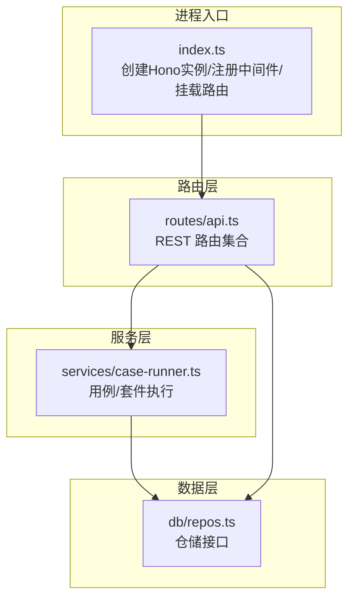
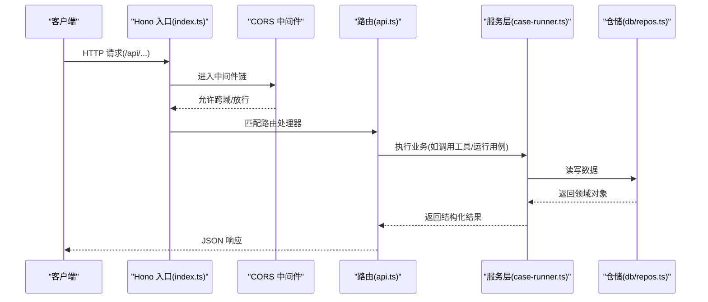
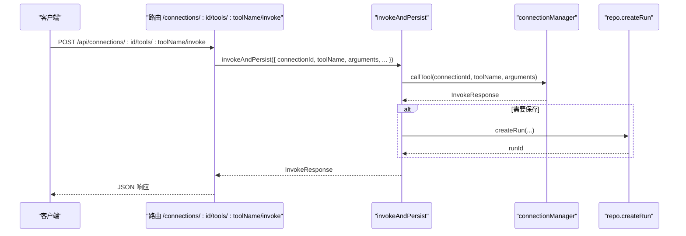
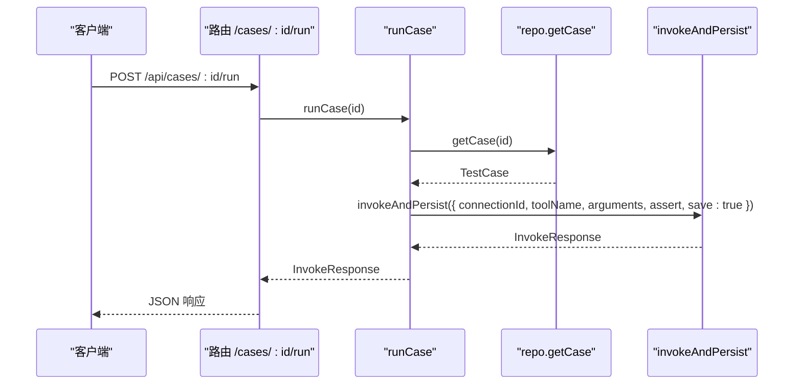
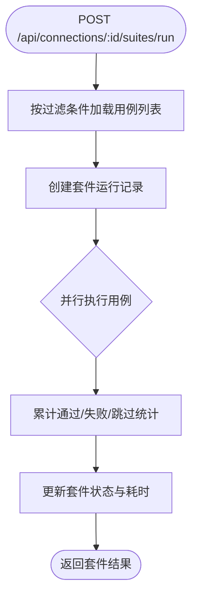
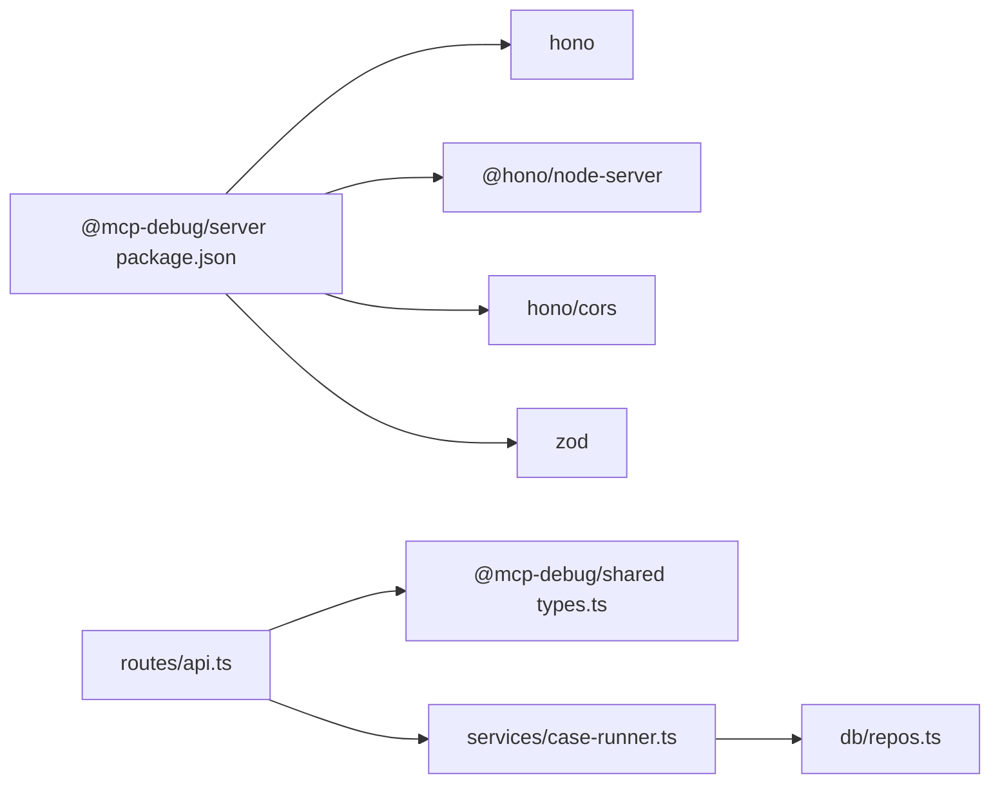

# API 路由层

<cite>
**本文引用的文件**
- [apps/server/src/index.ts](file://apps/server/src/index.ts)
- [apps/server/src/routes/api.ts](file://apps/server/src/routes/api.ts)
- [apps/server/package.json](file://apps/server/package.json)
- [packages/shared/src/types.ts](file://packages/shared/src/types.ts)
- [apps/server/src/db/ repos.ts](file://apps/server/src/db/repos.ts)
- [apps/server/src/services/case-runner.ts](file://apps/server/src/services/case-runner.ts)
</cite>

## 目录
1. [简介](#简介)
2. [项目结构](#项目结构)
3. [核心组件](#核心组件)
4. [架构总览](#架构总览)
5. [详细组件分析](#详细组件分析)
6. [依赖分析](#依赖分析)
7. [性能考虑](#性能考虑)
8. [故障排查指南](#故障排查指南)
9. [结论](#结论)
10. [附录：API 端点清单与请求响应模式](#附录api-端点清单与请求响应模式)

## 简介
本文件聚焦于基于 Hono 框架的 RESTful API 路由层设计与实现，覆盖以下主题：
- 路由组织原则与模块化设计
- 中间件机制（CORS、统一错误处理）
- 请求处理流程与数据流
- 参数校验策略与权限控制现状与建议
- 统一响应格式与错误码约定
- 具体 API 端点示例、请求/响应模式与最佳实践

## 项目结构
服务器应用采用“入口挂载 + 路由模块”的分层方式：
- 入口 index.ts 负责启动服务、注册全局中间件、挂载 /api 前缀的路由模块。
- routes/api.ts 集中定义所有业务路由，使用 Hono 实例进行声明式路由。
- db/repos.ts 提供数据库访问封装，供路由与服务层调用。
- services/case-runner.ts 封装用例执行、套件执行等复杂业务逻辑。
- packages/shared/src/types.ts 定义跨模块共享的数据类型，保证前后端契约一致。

图表来源
- [apps/server/src/index.ts:10-28](file://apps/server/src/index.ts#L10-L28)
- [apps/server/src/routes/api.ts:18-38](file://apps/server/src/routes/api.ts#L18-L38)
- [apps/server/src/services/case-runner.ts:11-77](file://apps/server/src/services/case-runner.ts#L11-L77)
- [apps/server/src/db/repos.ts:211-233](file://apps/server/src/db/repos.ts#L211-L233)

章节来源
- [apps/server/src/index.ts:1-39](file://apps/server/src/index.ts#L1-L39)
- [apps/server/src/routes/api.ts:1-277](file://apps/server/src/routes/api.ts#L1-L277)

## 核心组件
- 应用入口与中间件
  - 在入口中创建 Hono 实例，注册 CORS 中间件，并将 api 模块挂载到 /api 路径下。
  - 端口与 CORS 源通过环境变量配置，便于多环境部署。
- 路由模块
  - 使用 Hono 实例集中定义资源型路由，遵循 REST 风格命名与动词语义。
  - 对连接、工具、用例、运行记录、导入导出等能力进行分组。
- 服务层
  - 将“调用 MCP 工具并持久化结果”、“按条件筛选并并行执行用例套件”等复杂逻辑下沉至服务层，保持路由简洁。
- 数据层
  - 仓储层封装 Drizzle ORM 查询与映射，屏蔽 SQL 细节，向上暴露领域对象。

章节来源
- [apps/server/src/index.ts:10-28](file://apps/server/src/index.ts#L10-L28)
- [apps/server/src/routes/api.ts:18-38](file://apps/server/src/routes/api.ts#L18-L38)
- [apps/server/src/services/case-runner.ts:111-160](file://apps/server/src/services/case-runner.ts#L111-L160)
- [apps/server/src/db/repos.ts:211-233](file://apps/server/src/db/repos.ts#L211-L233)

## 架构总览
整体请求处理链路如下：客户端 -> Hono 入口 -> CORS 中间件 -> 路由处理器 -> 服务层 -> 仓储层 -> 数据库。

图表来源
- [apps/server/src/index.ts:10-28](file://apps/server/src/index.ts#L10-L28)
- [apps/server/src/routes/api.ts:117-138](file://apps/server/src/routes/api.ts#L117-L138)
- [apps/server/src/services/case-runner.ts:11-77](file://apps/server/src/services/case-runner.ts#L11-L77)
- [apps/server/src/db/repos.ts:476-528](file://apps/server/src/db/repos.ts#L476-L528)

## 详细组件分析

### 路由组织与模块化设计
- 路由前缀
  - 所有业务路由以 /api 为前缀，入口通过 app.route("/api", api) 挂载，便于后续扩展其他子模块。
- 资源划分
  - 连接管理：/connections/*
  - 工具管理：/connections/:id/tools/*
  - 用例管理：/cases/* 与 /connections/:id/tools/:toolName/cases
  - 运行记录：/runs/*、/suite-runs/*
  - 导入导出：/export、/import
- 路由职责
  - 解析参数与请求体、调用服务层、格式化响应、统一错误包装。
  - 避免在路由中直接写复杂逻辑或直连数据库。

章节来源
- [apps/server/src/index.ts:22-28](file://apps/server/src/index.ts#L22-L28)
- [apps/server/src/routes/api.ts:40-115](file://apps/server/src/routes/api.ts#L40-L115)
- [apps/server/src/routes/api.ts:140-225](file://apps/server/src/routes/api.ts#L140-L225)
- [apps/server/src/routes/api.ts:227-271](file://apps/server/src/routes/api.ts#L227-L271)

### 中间件机制与 CORS 配置
- 全局 CORS
  - 使用 hono/cors 中间件，允许指定 origin、方法与头字段。
  - 默认允许 GET/POST/PATCH/DELETE/OPTIONS 以及 Content-Type、Authorization。
- 可扩展点
  - 可在入口中继续添加日志、鉴权、限流等中间件，形成统一的横切关注点。

章节来源
- [apps/server/src/index.ts:14-21](file://apps/server/src/index.ts#L14-L21)

### 请求处理流程与统一响应格式
- 成功响应
  - 大多数接口返回纯数据对象或数组，由 c.json() 序列化输出。
  - 健康检查返回包含状态与运行时信息的对象。
- 错误响应
  - 路由内部使用统一的 bad(c, message, status) 辅助函数返回 { error } 结构的错误响应，并附带合适的 HTTP 状态码（如 400、404、500、502）。
- 建议
  - 可进一步抽象为全局错误处理中间件，确保所有异常均落入统一格式。

章节来源
- [apps/server/src/routes/api.ts:20-22](file://apps/server/src/routes/api.ts#L20-L22)
- [apps/server/src/routes/api.ts:32-38](file://apps/server/src/routes/api.ts#L32-L38)
- [apps/server/src/routes/api.ts:46-51](file://apps/server/src/routes/api.ts#L46-L51)
- [apps/server/src/routes/api.ts:53-58](file://apps/server/src/routes/api.ts#L53-L58)
- [apps/server/src/routes/api.ts:77-85](file://apps/server/src/routes/api.ts#L77-L85)
- [apps/server/src/routes/api.ts:117-138](file://apps/server/src/routes/api.ts#L117-L138)

### 参数验证策略
- 当前实现
  - 路由中对必要字段进行简单判空（如 name、url），未引入强类型校验中间件。
  - 部分接口对请求体使用 .json().catch(() => ({})) 容错处理，避免非法 JSON 导致崩溃。
- 建议
  - 引入基于 Zod 的请求体/查询/路径参数校验中间件，结合 shared 类型生成校验器，提升健壮性与可维护性。
  - 对可选字段设置合理默认值，减少分支判断。

章节来源
- [apps/server/src/routes/api.ts:46-51](file://apps/server/src/routes/api.ts#L46-L51)
- [apps/server/src/routes/api.ts:117-138](file://apps/server/src/routes/api.ts#L117-L138)
- [packages/shared/src/types.ts:72-90](file://packages/shared/src/types.ts#L72-L90)

### 权限控制与安全
- 现状
  - 当前路由层未实现鉴权中间件；CORS 仅控制跨域白名单。
- 建议
  - 增加认证中间件（如 JWT 校验），并在路由层根据角色/资源进行授权。
  - 对敏感操作（删除、修改）增加二次确认或审计日志。
  - 对导入接口做输入白名单与大小限制，防止恶意载荷。

章节来源
- [apps/server/src/index.ts:14-21](file://apps/server/src/index.ts#L14-L21)
- [apps/server/src/routes/api.ts:242-271](file://apps/server/src/routes/api.ts#L242-L271)

### 关键业务流程时序图

#### 工具调用与持久化

图表来源
- [apps/server/src/routes/api.ts:117-138](file://apps/server/src/routes/api.ts#L117-L138)
- [apps/server/src/services/case-runner.ts:11-77](file://apps/server/src/services/case-runner.ts#L11-L77)

#### 用例执行

图表来源
- [apps/server/src/routes/api.ts:174-181](file://apps/server/src/routes/api.ts#L174-L181)
- [apps/server/src/services/case-runner.ts:79-92](file://apps/server/src/services/case-runner.ts#L79-L92)

#### 套件执行

图表来源
- [apps/server/src/routes/api.ts:183-191](file://apps/server/src/routes/api.ts#L183-L191)
- [apps/server/src/services/case-runner.ts:111-160](file://apps/server/src/services/case-runner.ts#L111-L160)

## 依赖分析
- 外部依赖
  - Hono 与 @hono/node-server 提供轻量 Web 框架与 Node 适配器。
  - hono/cors 提供跨域中间件。
  - zod 已引入但未在当前路由中使用，可作为未来参数校验的基础。
- 内部依赖
  - 路由层依赖服务层与仓储层，服务层再依赖仓储层，层次清晰。
  - 共享类型集中在 packages/shared，保证前后端契约一致性。

图表来源
- [apps/server/package.json:12-23](file://apps/server/package.json#L12-L23)
- [apps/server/src/routes/api.ts:1-16](file://apps/server/src/routes/api.ts#L1-L16)
- [packages/shared/src/types.ts:1-229](file://packages/shared/src/types.ts#L1-L229)

章节来源
- [apps/server/package.json:1-32](file://apps/server/package.json#L1-L32)
- [apps/server/src/routes/api.ts:1-16](file://apps/server/src/routes/api.ts#L1-L16)
- [packages/shared/src/types.ts:1-229](file://packages/shared/src/types.ts#L1-L229)

## 性能考虑
- 并发执行
  - 套件执行使用简易线程池模型并行运行用例，可通过 parallel 参数控制并发度。
- 分页与限制
  - 运行记录查询支持 limit 参数，避免一次性拉取过多数据。
- 建议
  - 对长耗时操作（如工具调用）考虑超时与重试策略。
  - 对高频读取接口增加缓存层（如内存缓存或 Redis）。
  - 对导入导出接口增加流式处理与大体积限制。

章节来源
- [apps/server/src/services/case-runner.ts:94-109](file://apps/server/src/services/case-runner.ts#L94-L109)
- [apps/server/src/routes/api.ts:205-214](file://apps/server/src/routes/api.ts#L205-L214)

## 故障排查指南
- 常见错误码
  - 400：请求参数缺失或无效（如必填字段为空）。
  - 404：资源不存在（连接、用例、运行记录等）。
  - 500：服务端异常（工具调用失败、断言失败等）。
  - 502：下游服务不可用（MCP 连接建立或同步失败）。
- 定位步骤
  - 查看路由中的 bad() 调用位置与状态码。
  - 检查服务层抛出的异常信息。
  - 核对仓储层查询条件与映射函数是否返回预期数据。
- 建议
  - 增加结构化日志（请求 ID、耗时、关键参数脱敏）。
  - 引入全局错误处理中间件，统一捕获未处理异常。

章节来源
- [apps/server/src/routes/api.ts:46-51](file://apps/server/src/routes/api.ts#L46-L51)
- [apps/server/src/routes/api.ts:53-58](file://apps/server/src/routes/api.ts#L53-L58)
- [apps/server/src/routes/api.ts:77-85](file://apps/server/src/routes/api.ts#L77-L85)
- [apps/server/src/routes/api.ts:117-138](file://apps/server/src/routes/api.ts#L117-L138)

## 结论
该 API 路由层基于 Hono 实现了清晰的 RESTful 分层与模块化组织，配合 CORS 中间件与统一错误包装，具备较好的可读性与可维护性。建议在后续迭代中引入强类型参数校验、全局错误处理与鉴权中间件，进一步提升安全性与健壮性。

## 附录：API 端点清单与请求响应模式

- 健康检查
  - GET /api/health
  - 响应：包含 ok、dialect、liveConnections 的对象

- 连接管理
  - GET /api/connections
  - POST /api/connections
  - GET /api/connections/:id
  - PATCH /api/connections/:id
  - DELETE /api/connections/:id
  - POST /api/connections/:id/connect
  - POST /api/connections/:id/disconnect
  - POST /api/connections/:id/sync-tools
  - GET /api/connections/:id/tools?q=...
  - GET /api/connections/:id/tools/:toolName
  - POST /api/connections/:id/tools/:toolName/invoke
    - 请求体：{ arguments?: Record<string, unknown>, save?: boolean, testCaseId?: string }
    - 响应：InvokeResponse（包含 runId、status、content、assertResult 等）

- 用例管理
  - GET /api/connections/:id/tools/:toolName/cases
  - POST /api/connections/:id/tools/:toolName/cases
  - GET /api/connections/:id/cases
  - PATCH /api/cases/:id
  - DELETE /api/cases/:id
  - POST /api/cases/:id/run

- 运行记录
  - GET /api/suite-runs?connectionId=...
  - GET /api/suite-runs/:id
  - GET /api/runs?connectionId=&toolName=&suiteRunId=&status=&limit=...
  - GET /api/runs/:id
  - DELETE /api/runs/:id

- 导入导出
  - GET /api/export
  - POST /api/import
    - 请求体：ExportBundle（包含 connections 数组）
    - 响应：{ connections, cases }

章节来源
- [apps/server/src/routes/api.ts:32-38](file://apps/server/src/routes/api.ts#L32-L38)
- [apps/server/src/routes/api.ts:40-115](file://apps/server/src/routes/api.ts#L40-L115)
- [apps/server/src/routes/api.ts:140-225](file://apps/server/src/routes/api.ts#L140-L225)
- [apps/server/src/routes/api.ts:227-271](file://apps/server/src/routes/api.ts#L227-L271)
- [packages/shared/src/types.ts:188-229](file://packages/shared/src/types.ts#L188-L229)