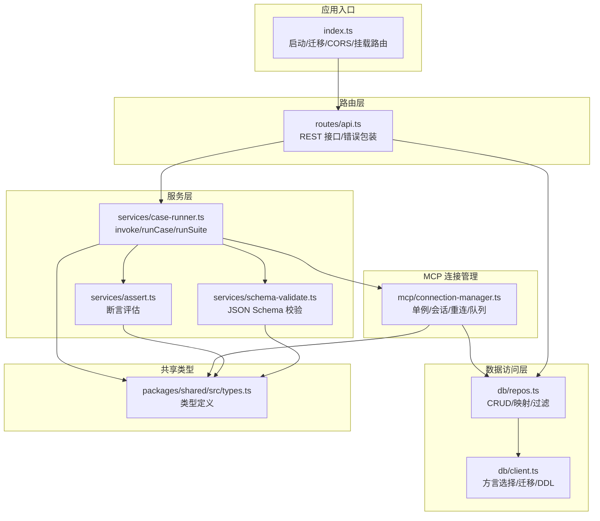
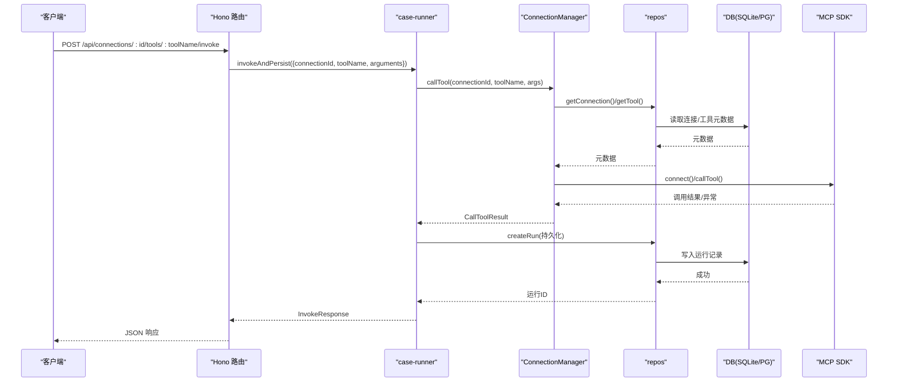
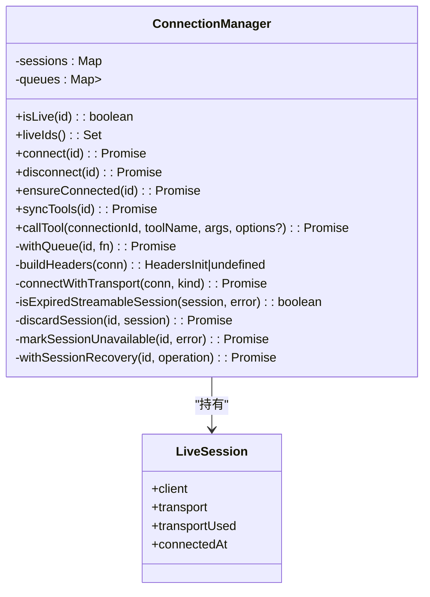
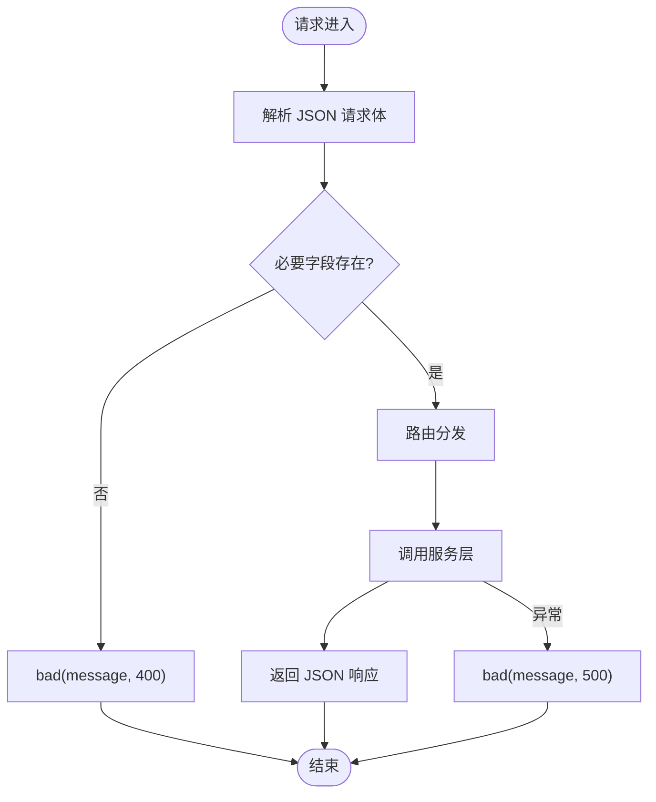
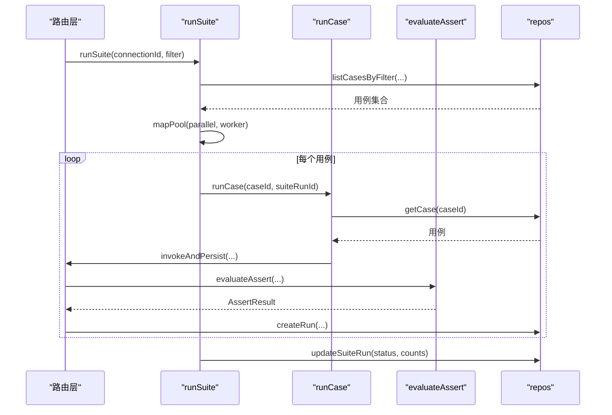
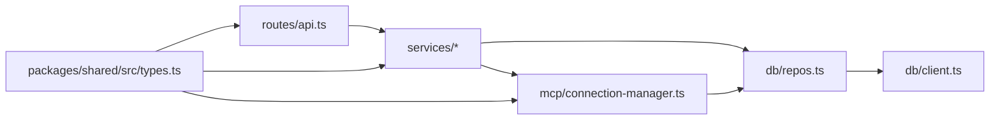

# 后端架构

<cite>
**本文引用的文件**   
- [apps/server/src/index.ts](file://apps/server/src/index.ts)
- [apps/server/src/routes/api.ts](file://apps/server/src/routes/api.ts)
- [apps/server/src/mcp/connection-manager.ts](file://apps/server/src/mcp/connection-manager.ts)
- [apps/server/src/services/case-runner.ts](file://apps/server/src/services/case-runner.ts)
- [apps/server/src/services/assert.ts](file://apps/server/src/services/assert.ts)
- [apps/server/src/services/schema-validate.ts](file://apps/server/src/services/schema-validate.ts)
- [apps/server/src/db/repos.ts](file://apps/server/src/db/repos.ts)
- [apps/server/src/db/client.ts](file://apps/server/src/db/client.ts)
- [apps/server/src/util/id.ts](file://apps/server/src/util/id.ts)
- [packages/shared/src/types.ts](file://packages/shared/src/types.ts)
- [packages/shared/src/index.ts](file://packages/shared/src/index.ts)
</cite>

## 目录
1. [简介](#简介)
2. [项目结构](#项目结构)
3. [核心组件](#核心组件)
4. [架构总览](#架构总览)
5. [详细组件分析](#详细组件分析)
6. [依赖关系分析](#依赖关系分析)
7. [性能与并发](#性能与并发)
8. [故障排查指南](#故障排查指南)
9. [结论](#结论)

## 简介
本文件面向后端架构，系统性阐述基于 Hono 框架的服务设计：中间件机制、路由组织与服务层分离；连接管理器（ConnectionManager）的单例模式、会话生命周期管理与自动重连；API 层的 RESTful 设计、请求校验与错误处理策略；服务层对业务逻辑的封装、工具调用编排与测试执行引擎；以及并发控制、超时管理、资源清理等横切关注点的实现方案。

## 项目结构
后端采用分层与按功能域组织的混合方式：
- 应用入口与中间件：Hono 应用初始化、CORS 中间件、健康检查根路径
- 路由层：RESTful API，统一错误响应格式，参数解析与基础校验
- 服务层：用例执行、断言评估、Schema 校验、套件运行编排
- MCP 连接管理：单例连接池、传输协议选择、会话恢复与队列化
- 数据访问层：Drizzle ORM + SQLite/PostgreSQL 双方言适配，迁移与表结构定义
- 共享类型包：前后端共享的类型与断言 Schema 归一化

图表来源
- [apps/server/src/index.ts:10-33](file://apps/server/src/index.ts#L10-L33)
- [apps/server/src/routes/api.ts:18-38](file://apps/server/src/routes/api.ts#L18-L38)
- [apps/server/src/services/case-runner.ts:11-92](file://apps/server/src/services/case-runner.ts#L11-L92)
- [apps/server/src/services/assert.ts:58-165](file://apps/server/src/services/assert.ts#L58-L165)
- [apps/server/src/services/schema-validate.ts:27-60](file://apps/server/src/services/schema-validate.ts#L27-L60)
- [apps/server/src/mcp/connection-manager.ts:39-173](file://apps/server/src/mcp/connection-manager.ts#L39-L173)
- [apps/server/src/db/repos.ts:211-312](file://apps/server/src/db/repos.ts#L211-L312)
- [apps/server/src/db/client.ts:247-266](file://apps/server/src/db/client.ts#L247-L266)
- [packages/shared/src/types.ts:1-229](file://packages/shared/src/types.ts#L1-L229)

章节来源
- [apps/server/src/index.ts:10-33](file://apps/server/src/index.ts#L10-L33)
- [apps/server/src/routes/api.ts:18-38](file://apps/server/src/routes/api.ts#L18-L38)
- [apps/server/src/db/client.ts:247-266](file://apps/server/src/db/client.ts#L247-L266)

## 核心组件
- 应用入口与中间件
  - 使用 Hono 创建应用实例，注册全局 CORS 中间件，挂载 /api 路由组，提供健康检查与根信息。
- 路由层
  - 以 Hono 路由组织 REST 接口，统一 bad() 错误包装函数返回 JSON 错误体，区分 4xx/5xx 状态码。
- 服务层
  - invokeAndPersist：调用 MCP 工具并持久化运行记录，支持可选断言与 Schema 校验结果落库。
  - runCase：根据用例配置发起调用并保存结果。
  - runSuite：按过滤条件选取用例，支持并行度控制，统计通过/失败数并更新套件运行状态。
  - assert：断言评估器，支持结构化内容匹配、文本包含、最大耗时、JSONPath 值比较等。
  - schema-validate：基于 AJV 的 JSON Schema 校验，输出标准化错误列表。
- MCP 连接管理
  - ConnectionManager 单例：维护 LiveSession Map、同连接串行队列、自动重连与过期会话回收。
  - 支持 streamable_http 与 SSE 两种传输，按配置或自动回退尝试。
  - callTool 内置超时控制（AbortController），异常分类为超时/协议错误/工具错误。
- 数据访问层
  - repos：统一的数据库操作封装，负责行到领域对象的映射、复杂查询与过滤。
  - client：SQLite/PostgreSQL 双方言选择、WAL 模式、外键约束、DDL 迁移。
- 共享类型
  - types：前后端共享的连接、工具、用例、运行记录、套件运行、断言配置等类型。

章节来源
- [apps/server/src/routes/api.ts:20-38](file://apps/server/src/routes/api.ts#L20-L38)
- [apps/server/src/services/case-runner.ts:11-161](file://apps/server/src/services/case-runner.ts#L11-L161)
- [apps/server/src/services/assert.ts:58-165](file://apps/server/src/services/assert.ts#L58-L165)
- [apps/server/src/services/schema-validate.ts:27-60](file://apps/server/src/services/schema-validate.ts#L27-L60)
- [apps/server/src/mcp/connection-manager.ts:39-383](file://apps/server/src/mcp/connection-manager.ts#L39-L383)
- [apps/server/src/db/repos.ts:211-660](file://apps/server/src/db/repos.ts#L211-L660)
- [apps/server/src/db/client.ts:17-65](file://apps/server/src/db/client.ts#L17-L65)
- [packages/shared/src/types.ts:1-229](file://packages/shared/src/types.ts#L1-L229)

## 架构总览
整体遵循“路由层 -> 服务层 -> 连接管理 -> 数据访问”的分层模型，并通过共享类型保证前后端契约一致。

图表来源
- [apps/server/src/routes/api.ts:117-138](file://apps/server/src/routes/api.ts#L117-L138)
- [apps/server/src/services/case-runner.ts:11-77](file://apps/server/src/services/case-runner.ts#L11-L77)
- [apps/server/src/mcp/connection-manager.ts:300-379](file://apps/server/src/mcp/connection-manager.ts#L300-L379)
- [apps/server/src/db/repos.ts:476-528](file://apps/server/src/db/repos.ts#L476-L528)

## 详细组件分析

### 连接管理器（ConnectionManager）
- 单例模式
  - 模块导出单一实例 connectionManager，进程内全局共享，避免重复建立底层连接。
- 会话生命周期
  - sessions Map 存储 LiveSession（client、transport、transportUsed、connectedAt）。
  - connect：按配置的传输顺序尝试连接，成功后记录 lastConnectedAt、serverInfo 与 lastError 清空。
  - disconnect：关闭 transport 与 client，忽略关闭异常。
  - ensureConnected：若不存在则触发 connect。
- 自动重连与过期会话回收
  - withSessionRecovery：在调用前确保连接，捕获 StreamableHTTPError 且 code=404 时判定会话过期，丢弃旧会话并重试一次；失败则标记不可用并抛出异常。
- 并发控制
  - withQueue：每个连接 ID 维护一个 Promise 链，保证同一连接的调用串行执行，避免竞态与资源争用。
- 超时管理
  - callTool：基于 AbortController 与 setTimeout 组合，超过 timeoutMs 将拒绝 Promise 并返回超时状态。
- 错误分类
  - 超时：code=TIMEOUT 或 AbortError 或消息含 timed out。
  - 协议错误：SDK 抛出的非超时异常。
  - 工具错误：结构化 isError=true 的业务错误。

图表来源
- [apps/server/src/mcp/connection-manager.ts:39-173](file://apps/server/src/mcp/connection-manager.ts#L39-L173)
- [apps/server/src/mcp/connection-manager.ts:175-268](file://apps/server/src/mcp/connection-manager.ts#L175-L268)
- [apps/server/src/mcp/connection-manager.ts:270-383](file://apps/server/src/mcp/connection-manager.ts#L270-L383)

章节来源
- [apps/server/src/mcp/connection-manager.ts:39-383](file://apps/server/src/mcp/connection-manager.ts#L39-L383)

### API 路由层（RESTful 设计、验证与错误处理）
- 路由组织
  - 以 /api 为前缀，按资源划分：/connections、/cases、/runs、/suite-runs 等。
  - 子资源嵌套：/connections/:id/tools/:toolName/cases、/invoke 等。
- 请求验证
  - 基础字段校验：如 name/url 必填、name 必填等，不满足直接返回 400。
  - 输入解析：c.req.json() 配合 try/catch 容错，缺失 body 时使用默认空对象。
- 错误处理策略
  - 统一 bad(c, message, status) 返回 { error } 结构。
  - 连接相关失败返回 502，其他服务异常返回 500，未找到资源返回 404。
- 健康检查
  - GET /api/health 返回 ok、dialect、当前活跃连接数。

图表来源
- [apps/server/src/routes/api.ts:20-38](file://apps/server/src/routes/api.ts#L20-L38)
- [apps/server/src/routes/api.ts:46-51](file://apps/server/src/routes/api.ts#L46-L51)
- [apps/server/src/routes/api.ts:117-138](file://apps/server/src/routes/api.ts#L117-L138)

章节来源
- [apps/server/src/routes/api.ts:18-277](file://apps/server/src/routes/api.ts#L18-L277)

### 服务层（业务逻辑、工具编排与测试执行）
- invokeAndPersist
  - 调用 ConnectionManager.callTool，计算断言与 Schema 校验结果，按需持久化运行记录。
- runCase
  - 从仓库加载用例，组装参数与断言，复用 invokeAndPersist。
- runSuite
  - 按过滤条件（工具名、用例 ID、标签）筛选用例，创建套件运行记录，按 parallel 并发执行，统计通过/失败并更新状态。
- assert 评估
  - 支持 expectIsError、expectStructured、structuredEquals、structuredSchemaValid、contentTextContains/NotContains、maxDurationMs、jsonPathEquals 等断言项。
- Schema 校验
  - 使用 AJV 编译 schema，返回标准化 errors 列表，便于前端展示。

图表来源
- [apps/server/src/services/case-runner.ts:111-161](file://apps/server/src/services/case-runner.ts#L111-L161)
- [apps/server/src/services/case-runner.ts:79-92](file://apps/server/src/services/case-runner.ts#L79-L92)
- [apps/server/src/services/assert.ts:58-165](file://apps/server/src/services/assert.ts#L58-L165)
- [apps/server/src/db/repos.ts:640-659](file://apps/server/src/db/repos.ts#L640-L659)

章节来源
- [apps/server/src/services/case-runner.ts:11-161](file://apps/server/src/services/case-runner.ts#L11-L161)
- [apps/server/src/services/assert.ts:58-165](file://apps/server/src/services/assert.ts#L58-L165)
- [apps/server/src/services/schema-validate.ts:27-60](file://apps/server/src/services/schema-validate.ts#L27-L60)

### 数据访问层（多方言适配与迁移）
- 方言选择
  - 根据 DATABASE_URL 或环境变量推断 sqlite/postgres，分别初始化 Drizzle 实例。
- 迁移与 DDL
  - migrate 在启动时执行建表语句，SQLite 启用 WAL 与外键约束，PostgreSQL 使用 Pool。
- 表结构与索引
  - mcp_connections、mcp_tools、test_cases、suite_runs、invocation_runs，关键索引覆盖常用查询路径。

章节来源
- [apps/server/src/db/client.ts:17-65](file://apps/server/src/db/client.ts#L17-L65)
- [apps/server/src/db/client.ts:247-266](file://apps/server/src/db/client.ts#L247-L266)
- [apps/server/src/db/repos.ts:211-312](file://apps/server/src/db/repos.ts#L211-L312)

## 依赖关系分析
- 低耦合分层
  - 路由层仅依赖服务层与仓库层，不直接访问数据库。
  - 服务层依赖连接管理器与仓库层，屏蔽底层协议细节。
  - 连接管理器依赖仓库层获取连接与工具元数据，但不感知 HTTP 路由。
- 外部依赖
  - Hono 作为 HTTP 框架，@modelcontextprotocol/sdk 作为 MCP 客户端，Drizzle ORM 作为数据访问抽象，AJV 用于 Schema 校验。
- 潜在循环依赖
  - 当前无循环导入；连接管理器与仓库层单向依赖。

图表来源
- [apps/server/src/routes/api.ts:1-17](file://apps/server/src/routes/api.ts#L1-L17)
- [apps/server/src/services/case-runner.ts:1-10](file://apps/server/src/services/case-runner.ts#L1-L10)
- [apps/server/src/mcp/connection-manager.ts:1-18](file://apps/server/src/mcp/connection-manager.ts#L1-L18)
- [apps/server/src/db/repos.ts:1-24](file://apps/server/src/db/repos.ts#L1-L24)
- [apps/server/src/db/client.ts:1-11](file://apps/server/src/db/client.ts#L1-L11)
- [packages/shared/src/types.ts:1-20](file://packages/shared/src/types.ts#L1-L20)

章节来源
- [apps/server/src/routes/api.ts:1-17](file://apps/server/src/routes/api.ts#L1-L17)
- [apps/server/src/services/case-runner.ts:1-10](file://apps/server/src/services/case-runner.ts#L1-L10)
- [apps/server/src/mcp/connection-manager.ts:1-18](file://apps/server/src/mcp/connection-manager.ts#L1-L18)
- [apps/server/src/db/repos.ts:1-24](file://apps/server/src/db/repos.ts#L1-L24)
- [apps/server/src/db/client.ts:1-11](file://apps/server/src/db/client.ts#L1-L11)
- [packages/shared/src/types.ts:1-20](file://packages/shared/src/types.ts#L1-L20)

## 性能与并发
- 连接级串行化
  - withQueue 保证同一连接的操作串行执行，避免并发导致的会话冲突与资源竞争。
- 套件并行执行
  - mapPool 基于固定数量 runner 并发执行用例，parallel 可配置，默认 1。
- 超时控制
  - callTool 使用 AbortController 与 setTimeout 组合，防止长尾请求阻塞。
- 数据库优化
  - SQLite 启用 WAL 提升并发读性能，合理索引减少全表扫描。
- 建议
  - 针对高并发场景，考虑增加连接池大小、调整队列粒度（例如按工具名分片）、引入限流与熔断策略。

[本节为通用指导，无需源码引用]

## 故障排查指南
- 连接失败
  - 现象：POST /connections/:id/connect 返回 502。
  - 排查：查看 lastError 与 serverInfo；确认 URL、headers、transport 配置；观察是否因 404 触发会话过期导致重连失败。
- 工具调用超时
  - 现象：status=timeout，durationMs 接近 timeoutMs。
  - 排查：增大 timeoutMs；检查远端服务负载；确认网络延迟。
- 断言失败
  - 现象：assertResult.passed=false，查看 checks 明细定位具体断言项。
  - 排查：核对 structuredContent、text 片段、JSONPath 表达式与阈值。
- Schema 校验错误
  - 现象：schemaValidation.errors 非空。
  - 排查：修正输出结构或上游 schema 定义。
- 套件运行结果不一致
  - 现象：passed/failed 计数异常。
  - 排查：检查用例 enabled 状态、过滤条件、并行度设置。

章节来源
- [apps/server/src/routes/api.ts:77-102](file://apps/server/src/routes/api.ts#L77-L102)
- [apps/server/src/mcp/connection-manager.ts:175-268](file://apps/server/src/mcp/connection-manager.ts#L175-L268)
- [apps/server/src/services/assert.ts:58-165](file://apps/server/src/services/assert.ts#L58-L165)
- [apps/server/src/services/schema-validate.ts:27-60](file://apps/server/src/services/schema-validate.ts#L27-L60)

## 结论
该后端架构以 Hono 为核心，结合清晰的分层与职责分离，实现了稳定的 MCP 连接管理、健壮的会话恢复与超时控制、灵活的断言与 Schema 校验、以及可扩展的套件执行引擎。通过仓库层的多方言适配与完善的索引设计，系统在易用性与性能之间取得良好平衡。后续可在并发控制、限流与监控方面进一步增强，以满足更高吞吐与更严格的 SLA 要求。