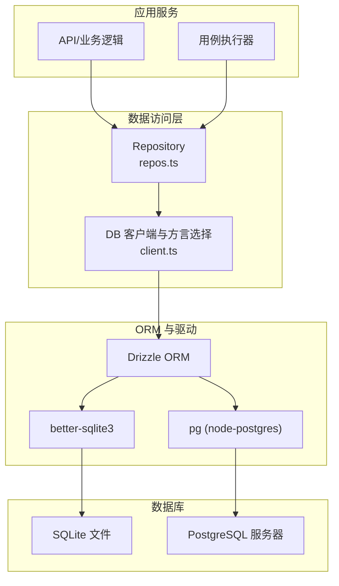
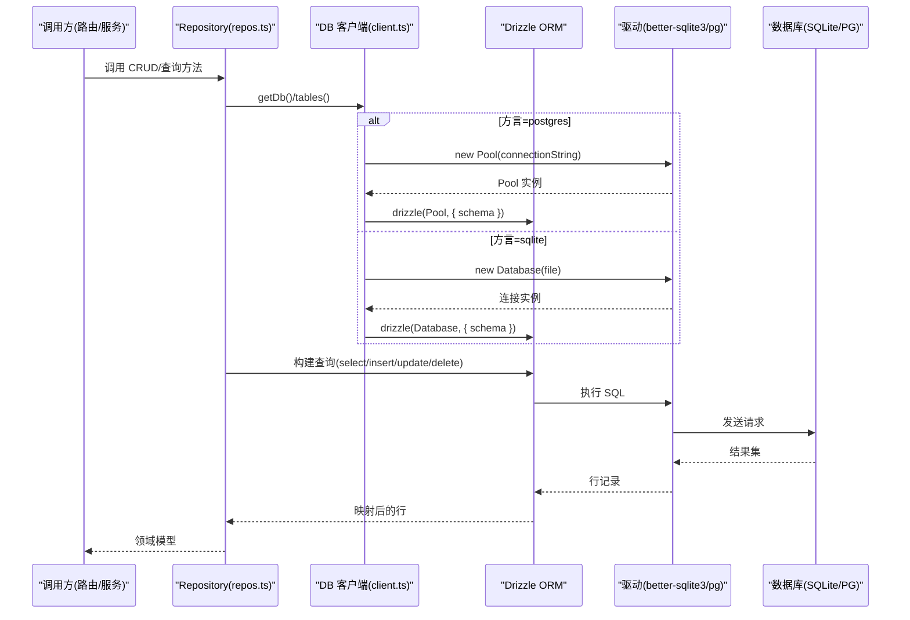
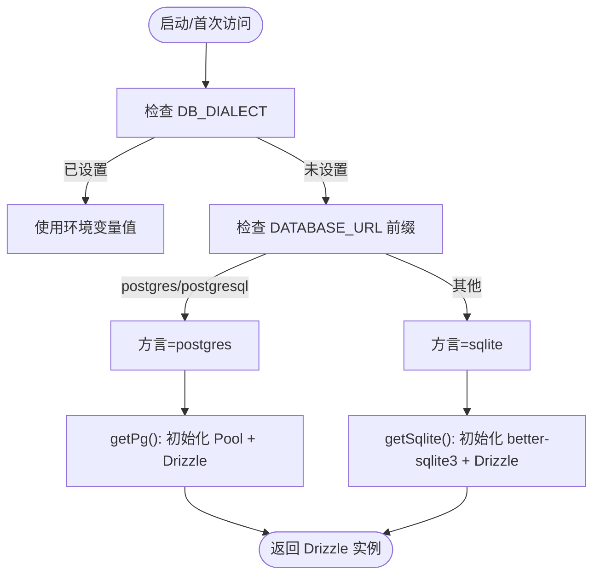
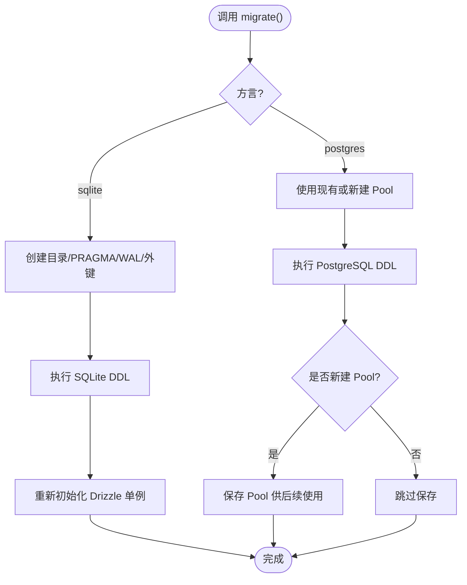
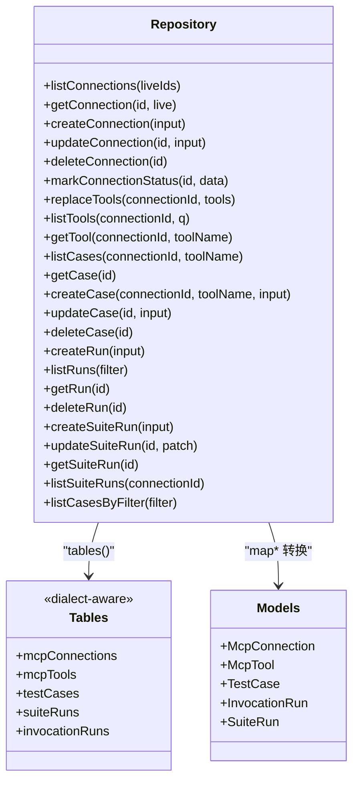
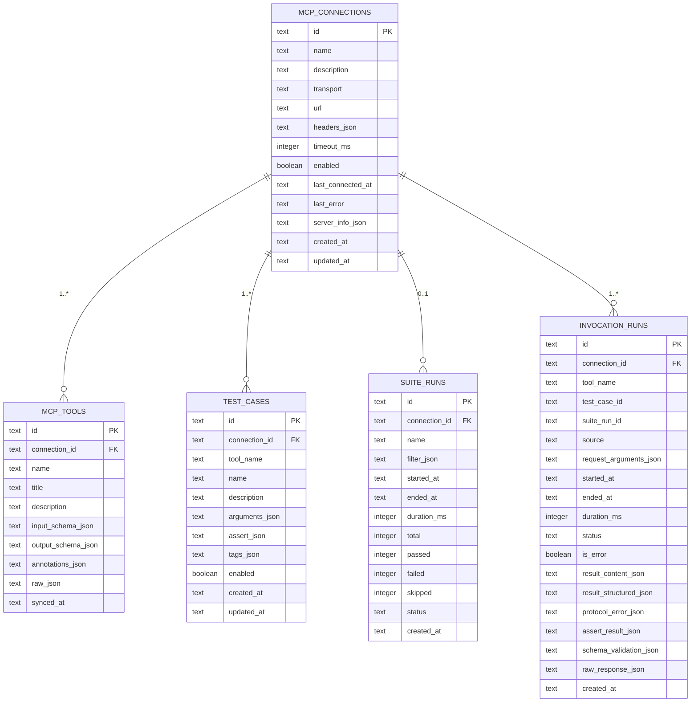
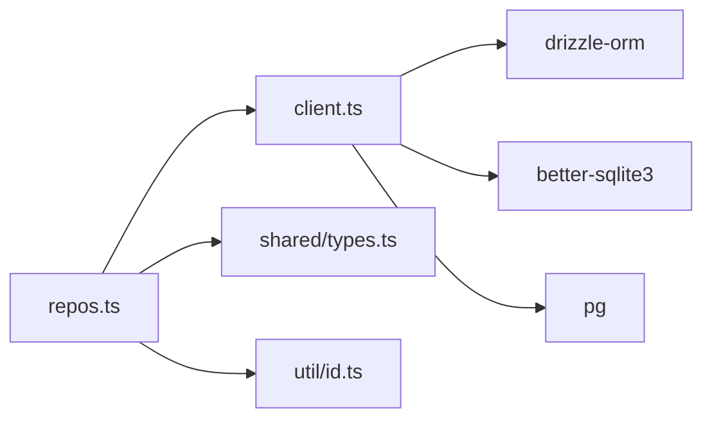

# 数据库抽象层

<cite>
**本文引用的文件**   
- [apps/server/src/db/client.ts](file://apps/server/src/db/client.ts)
- [apps/server/src/db/schema.sqlite.ts](file://apps/server/src/db/schema.sqlite.ts)
- [apps/server/src/db/schema.pg.ts](file://apps/server/src/db/schema.pg.ts)
- [apps/server/src/db/repos.ts](file://apps/server/src/db/repos.ts)
- [apps/server/src/util/id.ts](file://apps/server/src/util/id.ts)
- [packages/shared/src/types.ts](file://packages/shared/src/types.ts)
- [apps/server/package.json](file://apps/server/package.json)
</cite>

## 目录
1. [简介](#简介)
2. [项目结构](#项目结构)
3. [核心组件](#核心组件)
4. [架构总览](#架构总览)
5. [详细组件分析](#详细组件分析)
6. [依赖关系分析](#依赖关系分析)
7. [性能与调优](#性能与调优)
8. [故障转移与高可用](#故障转移与高可用)
9. [排障指南](#排障指南)
10. [结论](#结论)

## 简介
本文件面向数据库抽象层的实现，系统性说明基于 Drizzle ORM 的双数据库支持（SQLite 与 PostgreSQL）、连接池管理、自动迁移机制、数据访问对象（Repository）设计模式、查询构建与事务处理策略、模式定义与索引优化、数据完整性约束，以及数据库切换配置、性能调优与故障转移策略。文档旨在帮助开发者快速理解并正确使用该抽象层，同时为运维与性能调优提供指导。

## 项目结构
数据库相关代码集中在 apps/server/src/db 目录下，包含：
- 客户端与方言选择：client.ts
- SQLite 模式定义：schema.sqlite.ts
- PostgreSQL 模式定义：schema.pg.ts
- 数据访问对象（Repository）：repos.ts
- 通用工具：util/id.ts
- 共享类型：packages/shared/src/types.ts

图表来源
- [apps/server/src/db/client.ts:1-67](file://apps/server/src/db/client.ts#L1-L67)
- [apps/server/src/db/repos.ts:1-34](file://apps/server/src/db/repos.ts#L1-L34)

章节来源
- [apps/server/src/db/client.ts:1-67](file://apps/server/src/db/client.ts#L1-L67)
- [apps/server/src/db/repos.ts:1-34](file://apps/server/src/db/repos.ts#L1-L34)

## 核心组件
- 方言选择与连接工厂
  - 根据环境变量或 DATABASE_URL 推断方言（sqlite/postgres），并提供 getDb() 统一入口。
  - SQLite：使用 better-sqlite3 单例连接，启用 WAL 与外键约束。
  - PostgreSQL：使用 pg.Pool 连接池，通过 drizzle-orm/node-postgres 创建实例。
- 自动迁移
  - migrate() 函数按方言执行 DDL，确保表结构与索引存在；SQLite 会先创建目录并设置 PRAGMA，再执行 SQL；PostgreSQL 直接对 Pool 执行 DDL。
- Repository 层
  - repos.ts 封装所有数据访问方法，屏蔽方言差异，统一返回领域模型。
  - 使用 tables() 动态选择 sqliteSchema 或 pgSchema，配合 Drizzle 的 select/update/insert/delete 构建查询。
- 工具与类型
  - util/id.ts 提供 ID 生成、时间戳、安全 JSON 解析与序列化。
  - packages/shared/src/types.ts 定义领域模型与输入输出类型，Repository 与其保持严格一致。

章节来源
- [apps/server/src/db/client.ts:17-67](file://apps/server/src/db/client.ts#L17-L67)
- [apps/server/src/db/client.ts:247-267](file://apps/server/src/db/client.ts#L247-L267)
- [apps/server/src/db/repos.ts:25-33](file://apps/server/src/db/repos.ts#L25-L33)
- [apps/server/src/util/id.ts:1-23](file://apps/server/src/util/id.ts#L1-L23)
- [packages/shared/src/types.ts:54-229](file://packages/shared/src/types.ts#L54-L229)

## 架构总览
下图展示了从调用方到数据库的完整路径，包括方言选择、连接池、ORM 与迁移流程。

图表来源
- [apps/server/src/db/client.ts:43-67](file://apps/server/src/db/client.ts#L43-L67)
- [apps/server/src/db/repos.ts:25-33](file://apps/server/src/db/repos.ts#L25-L33)

## 详细组件分析

### 方言选择与连接工厂
- 方言推断
  - 优先读取环境变量 DB_DIALECT，否则根据 DATABASE_URL 前缀判断是否为 postgres/postgresql，默认回退到 sqlite。
- SQLite 连接
  - 首次访问时创建 better-sqlite3 连接，设置 journal_mode=WAL 与 foreign_keys=ON，随后用 drizzle-orm/better-sqlite3 包装。
- PostgreSQL 连接
  - 首次访问时创建 pg.Pool，使用 drizzle-orm/node-postgres 包装。
- 统一入口
  - getDb() 根据 dialect 返回对应 Drizzle 实例，对外隐藏方言细节。

图表来源
- [apps/server/src/db/client.ts:17-37](file://apps/server/src/db/client.ts#L17-37)
- [apps/server/src/db/client.ts:43-67](file://apps/server/src/db/client.ts#L43-L67)

章节来源
- [apps/server/src/db/client.ts:17-67](file://apps/server/src/db/client.ts#L17-L67)

### 自动迁移机制
- 触发时机
  - 在应用启动或需要时调用 migrate()。
- SQLite 迁移
  - 确保数据目录存在，打开临时连接设置 PRAGMA，执行内置 DDL，关闭连接后再次初始化 Drizzle 单例以确保后续使用正常。
- PostgreSQL 迁移
  - 复用已有 Pool 或新建 Pool，执行内置 DDL；若为新建 Pool，则保存以便后续 getPg() 复用。
- 幂等性
  - DDL 使用 CREATE TABLE IF NOT EXISTS 与 CREATE INDEX IF NOT EXISTS，保证多次运行不报错。

图表来源
- [apps/server/src/db/client.ts:247-267](file://apps/server/src/db/client.ts#L247-L267)

章节来源
- [apps/server/src/db/client.ts:247-267](file://apps/server/src/db/client.ts#L247-L267)

### 数据访问对象（Repository）设计模式
- 目标
  - 将业务语义与底层 SQL 解耦，统一返回领域模型，屏蔽方言差异。
- 关键设计
  - tables() 根据 dialect 返回对应的 schema 集合，使 select/update/insert/delete 在不同方言下行为一致。
  - map* 系列函数负责将数据库行转换为领域模型，并进行 JSON 字段的安全解析与规范化。
  - 查询构建使用 Drizzle 的条件构造器 and/eq/desc，避免手写 SQL。
- 典型操作
  - 连接管理：listConnections/getConnection/createConnection/updateConnection/deleteConnection/markConnectionStatus
  - 工具元数据：replaceTools/listTools/getTool
  - 测试用例：listCases/getCase/createCase/updateCase/deleteCase
  - 运行记录：createRun/listRuns/getRun/deleteRun
  - 套件运行：createSuiteRun/updateSuiteRun/getSuiteRun/listSuiteRuns
  - 过滤筛选：listCasesByFilter

图表来源
- [apps/server/src/db/repos.ts:25-33](file://apps/server/src/db/repos.ts#L25-L33)
- [apps/server/src/db/repos.ts:35-209](file://apps/server/src/db/repos.ts#L35-L209)
- [packages/shared/src/types.ts:54-229](file://packages/shared/src/types.ts#L54-L229)

章节来源
- [apps/server/src/db/repos.ts:25-33](file://apps/server/src/db/repos.ts#L25-L33)
- [apps/server/src/db/repos.ts:211-660](file://apps/server/src/db/repos.ts#L211-L660)
- [packages/shared/src/types.ts:54-229](file://packages/shared/src/types.ts#L54-L229)

### 查询构建与事务处理
- 查询构建
  - 使用 Drizzle 的 select().from(...).where(and(...)).orderBy(...).limit(...) 组合条件与排序，避免拼接 SQL。
  - 复杂过滤如 listRuns 通过数组累积条件，按需追加 eq 条件。
- 事务处理
  - 当前仓库未显式使用 Drizzle 的事务 API。批量更新场景（如 replaceTools）采用“先删后插”的两步操作，未包裹在事务中。
  - 建议：对于跨表一致性要求高的写入，应引入事务以保障原子性与一致性。

章节来源
- [apps/server/src/db/repos.ts:314-349](file://apps/server/src/db/repos.ts#L314-L349)
- [apps/server/src/db/repos.ts:530-552](file://apps/server/src/db/repos.ts#L530-L552)

### 数据库模式定义、索引优化与完整性约束
- 表结构
  - mcp_connections：连接配置主表，含名称、URL、超时、状态、时间戳等。
  - mcp_tools：工具元数据，关联连接，存储输入/输出 Schema、注解与原始信息。
  - test_cases：测试用例，关联连接与工具名，存储参数、断言与标签。
  - suite_runs：套件运行记录，聚合统计与状态。
  - invocation_runs：单次调用记录，包含请求、响应、断言与校验结果。
- 索引优化
  - mcp_tools：唯一索引 (connection_id, name)，普通索引 connection_id。
  - test_cases：复合索引 (connection_id, tool_name)。
  - invocation_runs：复合索引 (connection_id, tool_name)、started_at、suite_run_id。
- 完整性约束
  - 外键：mcp_tools、test_cases、invocation_runs 均引用 mcp_connections.id，删除策略为 CASCADE；suite_runs.connection_id 为 SET NULL。
  - SQLite 开启外键约束（foreign_keys=ON）。
  - 布尔字段：PostgreSQL 使用 boolean 类型；SQLite 使用 integer(mode="boolean") 进行兼容。

图表来源
- [apps/server/src/db/schema.sqlite.ts:3-120](file://apps/server/src/db/schema.sqlite.ts#L3-L120)
- [apps/server/src/db/schema.pg.ts:10-127](file://apps/server/src/db/schema.pg.ts#L10-L127)

章节来源
- [apps/server/src/db/schema.sqlite.ts:3-120](file://apps/server/src/db/schema.sqlite.ts#L3-L120)
- [apps/server/src/db/schema.pg.ts:10-127](file://apps/server/src/db/schema.pg.ts#L10-L127)

### 数据库切换配置
- 环境变量
  - DB_DIALECT：强制指定方言（sqlite 或 postgres）。
  - DATABASE_URL：
    - SQLite：可为绝对路径或 file:相对路径（相对于服务器根目录）。
    - PostgreSQL：postgres:// 或 postgresql:// 连接字符串。
- 默认行为
  - 未设置 DB_DIALECT 且 URL 非 postgres 前缀时，默认使用 SQLite，默认文件路径为 ./data/mcp-debug.db。
- 运行时切换
  - 方言在模块加载时确定，全局常量 dialect 不可变；如需切换需重启进程。

章节来源
- [apps/server/src/db/client.ts:17-37](file://apps/server/src/db/client.ts#L17-L37)
- [apps/server/src/db/client.ts:35-37](file://apps/server/src/db/client.ts#L35-L37)

## 依赖关系分析
- 外部依赖
  - drizzle-orm：ORM 抽象层。
  - better-sqlite3：SQLite 驱动。
  - pg：PostgreSQL 驱动与连接池。
- 内部依赖
  - client.ts 导出 dialect、getDb、migrate、sqliteSchema、pgSchema。
  - repos.ts 依赖 client.ts 的 dialect 与 schemas，并使用 util/id.ts 的工具函数。
  - shared/types.ts 被 repos.ts 用于类型约束与返回值建模。

图表来源
- [apps/server/src/db/client.ts:1-11](file://apps/server/src/db/client.ts#L1-L11)
- [apps/server/src/db/repos.ts:1-24](file://apps/server/src/db/repos.ts#L1-L24)
- [apps/server/package.json:12-22](file://apps/server/package.json#L12-L22)

章节来源
- [apps/server/src/db/client.ts:1-11](file://apps/server/src/db/client.ts#L1-L11)
- [apps/server/src/db/repos.ts:1-24](file://apps/server/src/db/repos.ts#L1-L24)
- [apps/server/package.json:12-22](file://apps/server/package.json#L12-L22)

## 性能与调优
- SQLite 调优
  - 已启用 WAL 模式提升并发读性能，适合多读少写场景。
  - 建议：
    - 合理设置 PRAGMA cache_size 与 temp_store。
    - 对高频查询字段建立合适索引（当前已覆盖常用组合）。
    - 控制单条记录大小，避免大 JSON 导致页分裂。
- PostgreSQL 调优
  - 使用连接池，建议根据并发量调整 pool 的 max/min 连接数。
  - 建议：
    - 针对频繁过滤字段添加索引（当前已覆盖主要查询路径）。
    - 定期 VACUUM/ANALYZE 维护统计信息与碎片回收。
    - 对大 JSON 字段考虑使用 JSONB 以提升查询能力（需评估迁移成本）。
- 查询层面
  - 使用 limit 限制返回行数，避免全表扫描。
  - 利用复合索引减少回表开销。
  - 避免在应用层进行大量过滤（如 listTools 的模糊匹配），必要时可引入全文索引或搜索引擎。

[本节为通用性能建议，无需特定文件来源]

## 故障转移与高可用
- 当前实现
  - 无显式的故障转移与重试逻辑。
  - PostgreSQL 使用 pg.Pool，具备基础连接管理能力。
- 建议方案
  - 连接失败重试：对关键写入增加指数退避重试。
  - 读写分离：PostgreSQL 可配置只读副本，读多写少场景分流。
  - 健康检查：周期性探测数据库连通性，异常时降级或告警。
  - 优雅降级：当数据库不可用时，返回友好错误并提示恢复。

[本节为概念性建议，无需特定文件来源]

## 排障指南
- 常见问题
  - 方言识别错误：检查 DB_DIALECT 与 DATABASE_URL 前缀。
  - SQLite 文件权限：确保 data 目录存在且可写。
  - PostgreSQL 连接失败：核对连接字符串、网络可达性与认证信息。
  - 迁移重复执行：由于 DDL 使用 IF NOT EXISTS，通常不会报错；但需确认索引与列变更需求。
- 定位步骤
  - 打印 dialect 与 databaseUrl 确认配置生效。
  - 手动执行 migrate() 观察日志与错误堆栈。
  - 使用 psql/sqlite3 验证表结构与索引是否存在。
  - 检查连接池状态与慢查询日志（PostgreSQL）。

章节来源
- [apps/server/src/db/client.ts:17-37](file://apps/server/src/db/client.ts#L17-L37)
- [apps/server/src/db/client.ts:247-267](file://apps/server/src/db/client.ts#L247-L267)

## 结论
该数据库抽象层通过 Drizzle ORM 实现了 SQLite 与 PostgreSQL 的双方言支持，提供了统一的连接工厂、自动迁移与 Repository 数据访问层。模式定义清晰、索引覆盖合理、外键约束完善，满足当前业务的数据持久化需求。未来可在事务处理、连接池调优、故障转移与监控方面进一步增强，以提升系统的健壮性与可扩展性。