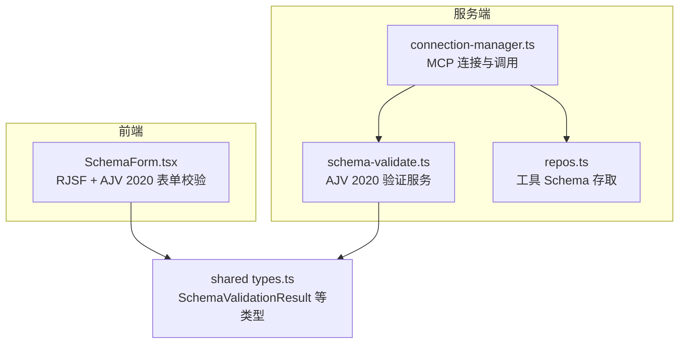
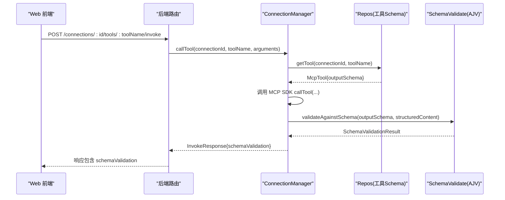
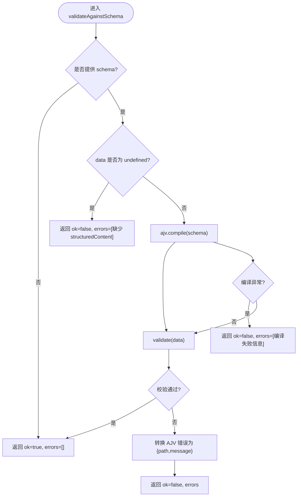
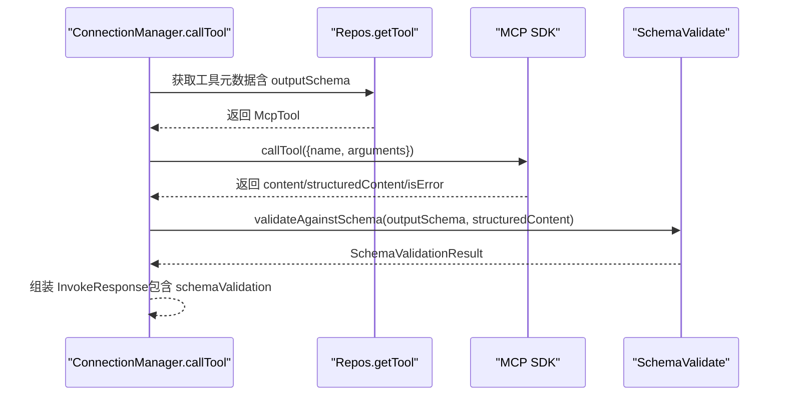
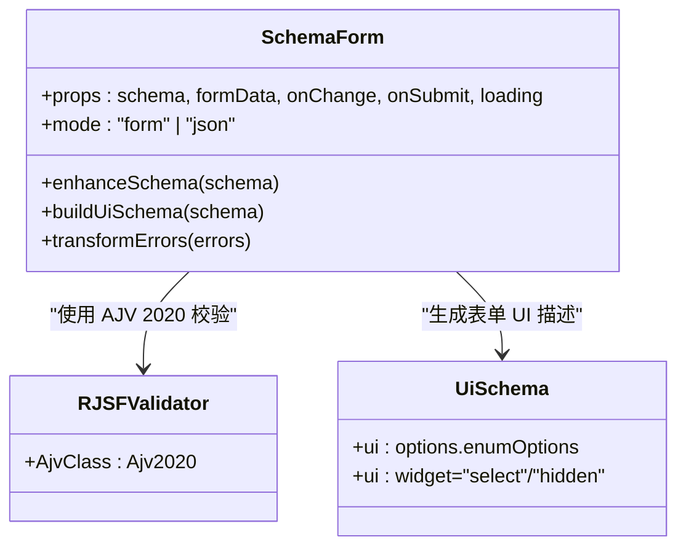
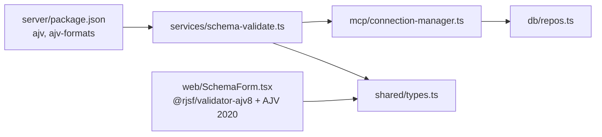

# Schema 验证器

<cite>
**本文引用的文件**   
- [apps/server/src/services/schema-validate.ts](file://apps/server/src/services/schema-validate.ts)
- [packages/shared/src/types.ts](file://packages/shared/src/types.ts)
- [apps/server/src/mcp/connection-manager.ts](file://apps/server/src/mcp/connection-manager.ts)
- [apps/web/src/components/SchemaForm.tsx](file://apps/web/src/components/SchemaForm.tsx)
- [apps/server/src/db/repos.ts](file://apps/server/src/db/repos.ts)
- [apps/server/package.json](file://apps/server/package.json)
</cite>

## 目录
1. [简介](#简介)
2. [项目结构](#项目结构)
3. [核心组件](#核心组件)
4. [架构总览](#架构总览)
5. [详细组件分析](#详细组件分析)
6. [依赖关系分析](#依赖关系分析)
7. [性能考虑](#性能考虑)
8. [故障排查指南](#故障排查指南)
9. [结论](#结论)
10. [附录](#附录)

## 简介
本文件围绕 JSON Schema 2020-12 验证器的实现与使用，系统性说明：
- 验证器实现原理与验证流程
- 支持的模式类型、验证规则与错误信息格式
- 自定义验证器扩展机制（前端表单校验）
- 验证配置选项与性能优化策略
- Schema 编写规范、验证示例与调试技巧
- 与 MCP Tool Schema 的集成方式

该验证器基于 AJV 2020-12 实现，用于对 MCP 工具输出结构化内容（structuredContent）进行模式校验，并在前后端分别提供一致的校验能力。

## 项目结构
与 Schema 验证相关的代码主要分布在以下位置：
- 服务端验证服务：封装 AJV 2020-12 实例、编译与执行校验、错误归一化
- 连接管理器：在调用 MCP Tool 后，自动根据工具的 outputSchema 对 structuredContent 执行校验
- 共享类型：定义验证结果结构与相关接口
- Web 前端：基于 RJSF + AJV 2020 构建表单，增强 oneOf/anyOf 分支渲染与错误提示本地化
- 数据持久层：存储与读取工具 Schema，供运行时校验使用

图表来源
- [apps/server/src/services/schema-validate.ts:1-61](file://apps/server/src/services/schema-validate.ts#L1-L61)
- [apps/server/src/mcp/connection-manager.ts:300-379](file://apps/server/src/mcp/connection-manager.ts#L300-L379)
- [apps/server/src/db/repos.ts:314-349](file://apps/server/src/db/repos.ts#L314-L349)
- [apps/web/src/components/SchemaForm.tsx:1-421](file://apps/web/src/components/SchemaForm.tsx#L1-L421)
- [packages/shared/src/types.ts:43-52](file://packages/shared/src/types.ts#L43-L52)

章节来源
- [apps/server/src/services/schema-validate.ts:1-61](file://apps/server/src/services/schema-validate.ts#L1-L61)
- [apps/server/src/mcp/connection-manager.ts:300-379](file://apps/server/src/mcp/connection-manager.ts#L300-L379)
- [apps/server/src/db/repos.ts:314-349](file://apps/server/src/db/repos.ts#L314-L349)
- [apps/web/src/components/SchemaForm.tsx:1-421](file://apps/web/src/components/SchemaForm.tsx#L1-L421)
- [packages/shared/src/types.ts:43-52](file://packages/shared/src/types.ts#L43-L52)

## 核心组件
- 服务端验证服务
  - 初始化 AJV 2020 实例并启用 allErrors 与 ajv-formats
  - 提供 validateAgainstSchema(schema, data) 统一入口
  - 将 AJV 原始错误转换为统一的 { path, message } 列表
- 连接管理器
  - 在调用 MCP Tool 后，依据工具的 outputSchema 对 structuredContent 执行校验
  - 将校验结果写入返回体，便于上层记录与展示
- 共享类型
  - 定义 SchemaValidationResult 及 ErrorObject 等关键类型
- 前端表单组件
  - 基于 RJSF + AJV 2020 构建动态表单
  - 增强 oneOf/anyOf 分支选择体验，并将常见 Ajv 错误消息翻译为中文友好提示

章节来源
- [apps/server/src/services/schema-validate.ts:1-61](file://apps/server/src/services/schema-validate.ts#L1-L61)
- [apps/server/src/mcp/connection-manager.ts:300-379](file://apps/server/src/mcp/connection-manager.ts#L300-L379)
- [packages/shared/src/types.ts:43-52](file://packages/shared/src/types.ts#L43-L52)
- [apps/web/src/components/SchemaForm.tsx:1-421](file://apps/web/src/components/SchemaForm.tsx#L1-L421)

## 架构总览
下图展示了从“调用 MCP Tool”到“结构化输出校验”的完整链路，以及前端表单侧的独立校验路径。

图表来源
- [apps/server/src/routes/api.ts:117-138](file://apps/server/src/routes/api.ts#L117-L138)
- [apps/server/src/mcp/connection-manager.ts:300-379](file://apps/server/src/mcp/connection-manager.ts#L300-L379)
- [apps/server/src/db/repos.ts:384-398](file://apps/server/src/db/repos.ts#L384-L398)
- [apps/server/src/services/schema-validate.ts:27-61](file://apps/server/src/services/schema-validate.ts#L27-L61)

## 详细组件分析

### 服务端验证服务（AJV 2020）
- 初始化与配置
  - 使用 AJV 2020 版本，开启 allErrors 以收集全部错误，strict 关闭以避免严格模式带来的额外限制
  - 通过 ajv-formats 启用常见字符串格式（如 email、uri、date-time 等）
- 验证流程
  - 若未提供 schema，直接返回通过
  - 若 data 为 undefined，返回缺少 structuredContent 的错误
  - 编译 schema 并执行校验；成功则返回通过
  - 失败时，将 AJV 错误映射为 { path, message } 列表
  - 捕获编译期异常，返回编译失败的错误信息
- 错误信息格式
  - 统一为数组项：{ path: string; message: string }
  - path 优先取 instancePath，其次 schemaPath，最后为空串
  - message 取自 AJV 错误 message，或默认提示

图表来源
- [apps/server/src/services/schema-validate.ts:27-61](file://apps/server/src/services/schema-validate.ts#L27-L61)

章节来源
- [apps/server/src/services/schema-validate.ts:1-61](file://apps/server/src/services/schema-validate.ts#L1-L61)

### 连接管理器中的 Schema 校验集成
- 在调用 MCP Tool 成功后，取出工具的 outputSchema 并对 structuredContent 执行校验
- 将校验结果放入返回体的 schemaValidation 字段，供上层保存与展示
- 当调用出现超时或协议错误时，schemaValidation 置空

图表来源
- [apps/server/src/mcp/connection-manager.ts:300-379](file://apps/server/src/mcp/connection-manager.ts#L300-L379)
- [apps/server/src/db/repos.ts:384-398](file://apps/server/src/db/repos.ts#L384-L398)
- [apps/server/src/services/schema-validate.ts:27-61](file://apps/server/src/services/schema-validate.ts#L27-L61)

章节来源
- [apps/server/src/mcp/connection-manager.ts:300-379](file://apps/server/src/mcp/connection-manager.ts#L300-L379)
- [apps/server/src/db/repos.ts:384-398](file://apps/server/src/db/repos.ts#L384-L398)

### 前端表单组件（RJSF + AJV 2020）
- 使用 @rjsf/validator-ajv8 并注入 AJV 2020 类，确保与后端一致的 2020-12 语义
- 针对 MCP 常见的“父级定义字段、分支只写 required”模式，增强 oneOf/anyOf 分支：
  - 提升部分分支要求且父级已定义的字段到分支中，使分支选择器真正控制显示字段
  - 自动生成分支标题（title/description/required/const 推导）
  - 隐藏由 const 控制的判别字段，避免用户重复填写
- 错误消息本地化：将常见 Ajv 错误名（required、type、enum、oneOf、anyOf 等）翻译为简洁中文提示，并过滤冗余的分支内部 required 错误

图表来源
- [apps/web/src/components/SchemaForm.tsx:1-421](file://apps/web/src/components/SchemaForm.tsx#L1-L421)

章节来源
- [apps/web/src/components/SchemaForm.tsx:1-421](file://apps/web/src/components/SchemaForm.tsx#L1-L421)

### 共享类型与数据结构
- SchemaValidationResult
  - ok: boolean
  - errors: Array<{ path: string; message: string }>
- ErrorObject（AJV 原始错误）
  - instancePath?: string
  - schemaPath?: string
  - message?: string
- 其他相关类型（如 McpTool.inputSchema/outputSchema、InvokeResponse.schemaValidation 等）贯穿调用链路与持久化

章节来源
- [packages/shared/src/types.ts:43-52](file://packages/shared/src/types.ts#L43-L52)
- [packages/shared/src/types.ts:92-103](file://packages/shared/src/types.ts#L92-L103)
- [packages/shared/src/types.ts:194-206](file://packages/shared/src/types.ts#L194-L206)

## 依赖关系分析
- 服务端依赖
  - ajv@8.17.1（JSON Schema 2020-12 验证引擎）
  - ajv-formats@3.0.1（内置格式校验扩展）
- 前端依赖
  - @rjsf/validator-ajv8（RJSF 校验适配器）
  - ajv/dist/2020（AJV 2020 入口）
- 运行时集成
  - 连接管理器在每次调用 MCP Tool 后触发服务端验证
  - 工具 Schema 来自数据库，随工具同步更新

图表来源
- [apps/server/package.json:12-22](file://apps/server/package.json#L12-L22)
- [apps/server/src/services/schema-validate.ts:1-19](file://apps/server/src/services/schema-validate.ts#L1-L19)
- [apps/server/src/mcp/connection-manager.ts:300-379](file://apps/server/src/mcp/connection-manager.ts#L300-L379)
- [apps/server/src/db/repos.ts:314-349](file://apps/server/src/db/repos.ts#L314-L349)
- [apps/web/src/components/SchemaForm.tsx:1-12](file://apps/web/src/components/SchemaForm.tsx#L1-L12)
- [packages/shared/src/types.ts:43-52](file://packages/shared/src/types.ts#L43-L52)

章节来源
- [apps/server/package.json:12-22](file://apps/server/package.json#L12-L22)
- [apps/server/src/services/schema-validate.ts:1-19](file://apps/server/src/services/schema-validate.ts#L1-L19)
- [apps/server/src/mcp/connection-manager.ts:300-379](file://apps/server/src/mcp/connection-manager.ts#L300-L379)
- [apps/server/src/db/repos.ts:314-349](file://apps/server/src/db/repos.ts#L314-L349)
- [apps/web/src/components/SchemaForm.tsx:1-12](file://apps/web/src/components/SchemaForm.tsx#L1-L12)
- [packages/shared/src/types.ts:43-52](file://packages/shared/src/types.ts#L43-L52)

## 性能考虑
- 服务端
  - 当前实现每次调用都会 compile(schema)，适合低并发场景。在高并发下建议缓存已编译的 validator 实例（按 schema 指纹或引用键），减少重复编译开销
  - 保持 allErrors 开启有助于一次性收集所有问题，但会增加错误遍历成本；可按需切换
  - 使用 ajv-formats 会引入额外的格式解析逻辑，必要时可仅启用所需格式以减少开销
- 前端
  - RJSF 在复杂 oneOf/anyOf 场景下会生成较多节点，建议结合 enhanceSchema 的优化策略减少不必要的嵌套
  - transformErrors 过滤了冗余的分支 required 错误，降低 UI 渲染压力

[本节为通用指导，不直接分析具体文件]

## 故障排查指南
- 常见问题
  - 编译失败：当 schema 不符合 JSON Schema 语法或使用了不支持的关键字时，服务端会返回编译失败错误
  - 缺少 structuredContent：当 data 为 undefined 时，会返回明确提示
  - 多余字段：additionalProperties 校验失败会提示不允许的字段名
  - 必填缺失：required 校验失败会提示缺少的字段名
  - 类型不符：type 校验失败会提示期望的类型
  - 枚举/常量：enum/const 校验失败会给出相应提示
  - 数值范围：minimum/maximum/minLength/maxLength/pattern 等均有对应提示
- 定位方法
  - 查看 InvokeResponse.schemaValidation.errors 中的 path 与 message，快速定位问题字段
  - 在前端切换到 JSON 模式编辑，结合 CodeMirror 的 JSON 校验反馈辅助修正
  - 检查工具 outputSchema 是否正确同步，必要时重新执行工具同步

章节来源
- [apps/server/src/services/schema-validate.ts:27-61](file://apps/server/src/services/schema-validate.ts#L27-L61)
- [apps/web/src/components/SchemaForm.tsx:232-281](file://apps/web/src/components/SchemaForm.tsx#L232-L281)

## 结论
本项目在服务端与前端均实现了基于 JSON Schema 2020-12 的验证能力：
- 服务端通过 AJV 2020 与 ajv-formats 对 MCP Tool 的 structuredContent 进行严格校验，并以统一错误格式返回
- 前端通过 RJSF + AJV 2020 提供友好的表单交互与本地化错误提示，同时增强 oneOf/anyOf 分支体验
- 与 MCP Tool Schema 的集成自然嵌入到调用链路中，无需额外侵入
- 后续可在高并发场景引入编译缓存与按需格式启用，进一步提升性能

[本节为总结性内容，不直接分析具体文件]

## 附录

### 支持的 JSON Schema 关键字与规则（概览）
- 基础类型与约束：type、enum、const、minimum、maximum、minLength、maxLength、pattern、multipleOf
- 对象约束：properties、required、additionalProperties、$defs
- 组合与条件：allOf、oneOf、anyOf、if/then/else（取决于 AJV 2020 支持）
- 格式校验：email、uri、date-time、uuid 等（由 ajv-formats 提供）

[本节为概念性说明，不直接分析具体文件]

### 验证配置选项
- 服务端 AJV 配置
  - allErrors: true（收集全部错误）
  - strict: false（关闭严格模式）
  - formats: 启用 ajv-formats 提供的内置格式
- 前端 RJSF 行为
  - experimental_defaultFormStateBehavior 控制默认值填充策略
  - transformErrors 将错误消息本地化为中文

章节来源
- [apps/server/src/services/schema-validate.ts:18-19](file://apps/server/src/services/schema-validate.ts#L18-L19)
- [apps/web/src/components/SchemaForm.tsx:376-381](file://apps/web/src/components/SchemaForm.tsx#L376-L381)
- [apps/web/src/components/SchemaForm.tsx:232-281](file://apps/web/src/components/SchemaForm.tsx#L232-L281)

### 错误信息格式
- 统一结构：Array<{ path: string; message: string }>
- path 来源：instancePath > schemaPath > ""
- message 来源：AJV 错误 message 或默认提示

章节来源
- [apps/server/src/services/schema-validate.ts:44-48](file://apps/server/src/services/schema-validate.ts#L44-L48)
- [packages/shared/src/types.ts:43-52](file://packages/shared/src/types.ts#L43-L52)

### Schema 编写规范（面向 MCP Tool）
- 为每个工具定义清晰的 inputSchema 与 outputSchema
- 使用 $defs 复用公共子结构，减少重复
- 合理使用 required 标注必填字段，配合 title/description 提升可读性
- 对于多态输出，优先使用 oneOf/anyOf，并在分支内显式声明 required 与 properties
- 如需强约束，设置 additionalProperties: false 防止多余字段

[本节为概念性说明，不直接分析具体文件]

### 验证示例（路径参考）
- 服务端调用后返回 schemaValidation 字段，包含 ok 与 errors
- 前端表单提交前会进行本地校验，错误消息经 transformErrors 本地化

章节来源
- [apps/server/src/mcp/connection-manager.ts:339-354](file://apps/server/src/mcp/connection-manager.ts#L339-L354)
- [apps/web/src/components/SchemaForm.tsx:365-392](file://apps/web/src/components/SchemaForm.tsx#L365-L392)

### 调试技巧
- 在后端日志中关注 schemaValidation 字段，快速判断校验是否通过
- 在前端切换到 JSON 模式，借助编辑器实时校验 JSON 语法
- 若遇到 oneOf/anyOf 分支问题，先确认分支标题与 required 字段是否正确提升
- 检查工具 outputSchema 是否与 MCP 服务器实际返回一致，必要时重新同步工具

章节来源
- [apps/server/src/mcp/connection-manager.ts:339-354](file://apps/server/src/mcp/connection-manager.ts#L339-L354)
- [apps/web/src/components/SchemaForm.tsx:283-340](file://apps/web/src/components/SchemaForm.tsx#L283-L340)

### 与 MCP Tool Schema 的集成方式
- 工具 Schema 来源于 MCP 服务器的工具清单，经连接管理器同步至数据库
- 调用 Tool 时，连接管理器读取 outputSchema 并对 structuredContent 执行校验
- 校验结果随调用记录持久化，便于回溯与分析

章节来源
- [apps/server/src/mcp/connection-manager.ts:270-298](file://apps/server/src/mcp/connection-manager.ts#L270-L298)
- [apps/server/src/db/repos.ts:314-349](file://apps/server/src/db/repos.ts#L314-L349)
- [apps/server/src/mcp/connection-manager.ts:339-354](file://apps/server/src/mcp/connection-manager.ts#L339-L354)