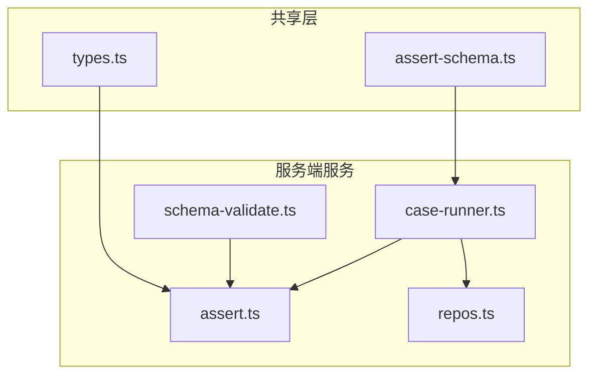
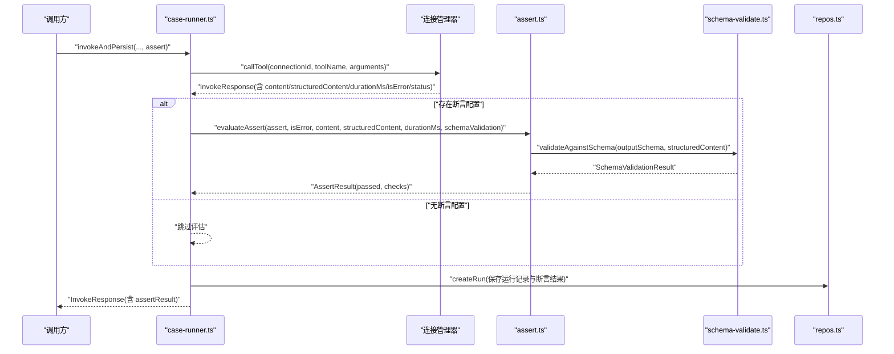
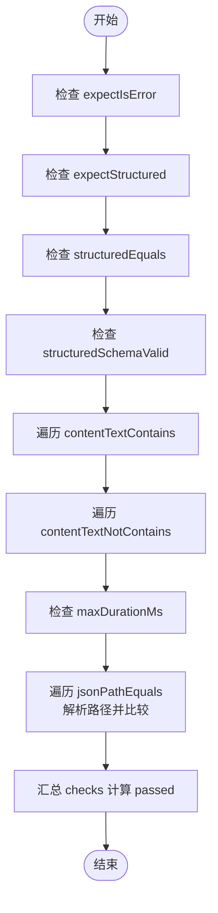
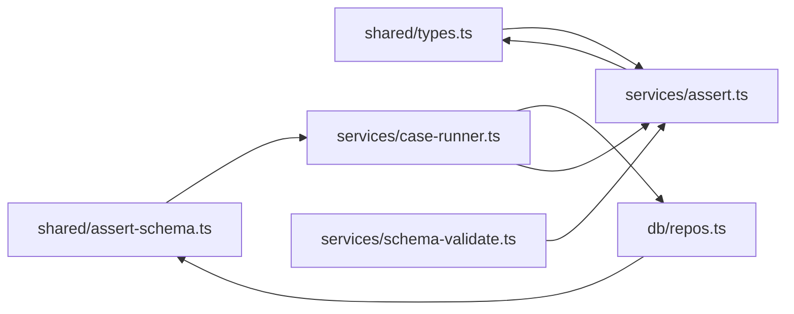

# 断言评估器

<cite>
**本文引用的文件**   
- [apps/server/src/services/assert.ts](file://apps/server/src/services/assert.ts)
- [packages/shared/src/types.ts](file://packages/shared/src/types.ts)
- [packages/shared/src/assert-schema.ts](file://packages/shared/src/assert-schema.ts)
- [apps/server/src/services/case-runner.ts](file://apps/server/src/services/case-runner.ts)
- [apps/server/src/services/schema-validate.ts](file://apps/server/src/services/schema-validate.ts)
- [apps/server/src/db/repos.ts](file://apps/server/src/db/repos.ts)
</cite>

## 目录
1. [简介](#简介)
2. [项目结构](#项目结构)
3. [核心组件](#核心组件)
4. [架构总览](#架构总览)
5. [详细组件分析](#详细组件分析)
6. [依赖关系分析](#依赖关系分析)
7. [性能考量](#性能考量)
8. [故障排查指南](#故障排查指南)
9. [结论](#结论)
10. [附录：断言编写指南与最佳实践](#附录断言编写指南与最佳实践)

## 简介
本文件面向“断言评估器”子系统，系统性说明其架构设计、评估引擎实现、支持的断言类型、表达式语法与评估规则、配置格式与参数校验、错误处理机制，以及结果数据结构与状态管理。文档同时提供断言编写指南、最佳实践和常见用例示例，帮助读者快速上手并稳定使用。

## 项目结构
断言评估器由共享类型定义、断言配置归一化、断言评估引擎、结构化输出校验、以及调用执行流程组成。关键位置如下：
- 共享类型与工具：packages/shared/src/types.ts、packages/shared/src/assert-schema.ts
- 断言评估引擎：apps/server/src/services/assert.ts
- 调用执行与持久化：apps/server/src/services/case-runner.ts、apps/server/src/db/repos.ts
- 结构化输出校验：apps/server/src/services/schema-validate.ts

图表来源
- [packages/shared/src/types.ts:1-229](file://packages/shared/src/types.ts#L1-L229)
- [packages/shared/src/assert-schema.ts:1-32](file://packages/shared/src/assert-schema.ts#L1-L32)
- [apps/server/src/services/schema-validate.ts:1-61](file://apps/server/src/services/schema-validate.ts#L1-L61)
- [apps/server/src/services/assert.ts:1-166](file://apps/server/src/services/assert.ts#L1-L166)
- [apps/server/src/services/case-runner.ts:1-161](file://apps/server/src/services/case-runner.ts#L1-L161)
- [apps/server/src/db/repos.ts:424-467](file://apps/server/src/db/repos.ts#L424-L467)

章节来源
- [packages/shared/src/types.ts:1-229](file://packages/shared/src/types.ts#L1-L229)
- [packages/shared/src/assert-schema.ts:1-32](file://packages/shared/src/assert-schema.ts#L1-L32)
- [apps/server/src/services/assert.ts:1-166](file://apps/server/src/services/assert.ts#L1-L166)
- [apps/server/src/services/case-runner.ts:1-161](file://apps/server/src/services/case-runner.ts#L1-L161)
- [apps/server/src/services/schema-validate.ts:1-61](file://apps/server/src/services/schema-validate.ts#L1-L61)
- [apps/server/src/db/repos.ts:424-467](file://apps/server/src/db/repos.ts#L424-L467)

## 核心组件
- 断言配置类型 AssertConfig：定义所有可配置的断言项，包括期望错误、结构化内容存在性、结构化部分匹配、JSON Schema 校验、文本包含/不包含、最大耗时、JSONPath 相等比较等。
- 断言配置归一化 normalizeAssert：对输入断言进行默认值填充与类型规范化，确保后续评估逻辑的健壮性。
- 断言评估引擎 evaluateAssert：根据配置逐项检查，生成断言检查结果列表及总体通过状态。
- JSONPath 解析 getByPath：支持点号路径与数组索引访问，用于结构化内容的字段定位。
- 结构化输出校验 validateAgainstSchema：基于 AJV 2020 对 structuredContent 进行 JSON Schema 校验，供断言使用。
- 调用执行流程 invokeAndPersist：在工具调用后，若存在断言配置则触发评估，并将结果持久化。

章节来源
- [packages/shared/src/types.ts:14-46](file://packages/shared/src/types.ts#L14-L46)
- [packages/shared/src/assert-schema.ts:11-31](file://packages/shared/src/assert-schema.ts#L11-L31)
- [apps/server/src/services/assert.ts:33-166](file://apps/server/src/services/assert.ts#L33-L166)
- [apps/server/src/services/schema-validate.ts:27-61](file://apps/server/src/services/schema-validate.ts#L27-L61)
- [apps/server/src/services/case-runner.ts:11-77](file://apps/server/src/services/case-runner.ts#L11-L77)

## 架构总览
断言评估器嵌入在工具调用执行链路中，位于“调用返回结果”之后、“结果持久化”之前。整体流程如下：

图表来源
- [apps/server/src/services/case-runner.ts:11-77](file://apps/server/src/services/case-runner.ts#L11-L77)
- [apps/server/src/services/assert.ts:58-166](file://apps/server/src/services/assert.ts#L58-L166)
- [apps/server/src/services/schema-validate.ts:27-61](file://apps/server/src/services/schema-validate.ts#L27-L61)
- [apps/server/src/db/repos.ts:476-528](file://apps/server/src/db/repos.ts#L476-L528)

## 详细组件分析

### 断言配置与类型（AssertConfig）
- 字段概览
  - expectIsError：是否期望本次调用为错误状态
  - expectStructured：是否期望存在结构化输出
  - structuredEquals：期望的结构化内容（支持部分匹配）
  - structuredSchemaValid：是否要求结构化输出通过 JSON Schema 校验
  - contentTextContains / contentTextNotContains：文本内容包含/不包含子串
  - maxDurationMs：最大允许耗时（毫秒）
  - jsonPathEquals：JSONPath 路径与期望值的相等比较列表
- 相关类型
  - JsonPathEquals：path 字符串 + value 任意值
  - AssertCheck：单项检查的名称、通过与否、可选消息、期望与实际值
  - AssertResult：总体通过标志与检查项集合
  - SchemaValidationResult：JSON Schema 校验结果（ok 与 errors）

章节来源
- [packages/shared/src/types.ts:14-46](file://packages/shared/src/types.ts#L14-L46)

### 断言配置归一化（normalizeAssert）
- 作用
  - 将用户传入的断言配置转换为标准结构，缺失字段以默认值补齐
  - 对数组类字段做类型保护（非数组时回退为空数组）
  - 对数值型字段做类型保护（非 number 时忽略）
- 默认值策略
  - expectIsError 默认 false
  - structuredSchemaValid 默认 false
  - 各数组字段默认空数组
  - maxDurationMs 仅在为 number 时保留
- 使用位置
  - 用例创建/更新时，持久化前统一归一化，保证存储一致性

章节来源
- [packages/shared/src/assert-schema.ts:11-31](file://packages/shared/src/assert-schema.ts#L11-L31)
- [apps/server/src/db/repos.ts:424-467](file://apps/server/src/db/repos.ts#L424-L467)

### 断言评估引擎（evaluateAssert）
- 输入
  - assert：已归一化的断言配置
  - isError：本次调用是否为错误
  - content：文本内容项数组
  - structuredContent：结构化输出（可为 undefined/null）
  - durationMs：耗时毫秒数
  - schemaValidation：结构化输出的 JSON Schema 校验结果（可选）
- 评估项与规则
  - expectIsError：isError 是否与期望一致
  - expectStructured：structuredContent 是否存在（非 undefined 且非 null）
  - structuredEquals：对 structuredContent 进行“部分深匹配”，仅要求 source 中的键值存在于 object 中
  - structuredSchemaValid：当为 true 时，要求 schemaValidation.ok 为 true
  - contentTextContains：拼接所有 text 类型的 ContentItem 文本，判断是否包含指定子串
  - contentTextNotContains：同上，但要求不包含
  - maxDurationMs：durationMs 不超过阈值
  - jsonPathEquals：按 path 从 structuredContent 取值，并与 value 进行 JSON.stringify 后的严格相等比较
- 输出
  - passed：所有检查项均通过时为 true
  - checks：每项检查的名称、通过情况、期望与实际值、失败时的提示信息
- 辅助函数
  - isMatch：实现“部分深匹配”（类似 lodash.isMatch），支持对象与数组递归匹配
  - contentText：过滤出 type=text 的项并拼接文本
  - getByPath：解析形如 $.a.b[0].c 的路径，支持点号与数组索引

图表来源
- [apps/server/src/services/assert.ts:58-166](file://apps/server/src/services/assert.ts#L58-L166)

章节来源
- [apps/server/src/services/assert.ts:8-24](file://apps/server/src/services/assert.ts#L8-L24)
- [apps/server/src/services/assert.ts:26-56](file://apps/server/src/services/assert.ts#L26-L56)
- [apps/server/src/services/assert.ts:58-166](file://apps/server/src/services/assert.ts#L58-L166)

### JSONPath 解析（getByPath）
- 支持语法
  - $ 或 $. 表示根节点
  - a.b.c 逐层取键
  - a[0] 数组索引访问
  - 混合使用，如 $.items[1].name
- 行为约定
  - 遇到非法路径片段或越界访问返回 undefined
  - 非对象/数组继续访问返回 undefined
- 复杂度
  - 时间 O(n)，n 为路径段数量
  - 空间 O(1)

章节来源
- [apps/server/src/services/assert.ts:33-56](file://apps/server/src/services/assert.ts#L33-L56)

### 结构化输出校验（validateAgainstSchema）
- 功能
  - 使用 AJV 2020 对 structuredContent 进行 JSON Schema 校验
  - 返回 ok 与 errors 列表，errors 包含 path 与 message
- 异常处理
  - schema 为空时直接通过
  - structuredContent 缺失时标记失败并给出提示
  - 编译或运行时错误捕获并返回失败信息
- 集成点
  - 断言项 structuredSchemaValid 依赖此结果

章节来源
- [apps/server/src/services/schema-validate.ts:27-61](file://apps/server/src/services/schema-validate.ts#L27-L61)

### 调用执行与断言集成（invokeAndPersist）
- 流程
  - 调用工具获取 InvokeResponse
  - 若存在断言配置，则调用 evaluateAssert 生成 AssertResult
  - 将运行结果与断言结果持久化到数据库
  - 返回包含 assertResult 的响应
- 批处理
  - runSuite 并行执行多个用例，统计通过/失败数量并更新套件运行状态

章节来源
- [apps/server/src/services/case-runner.ts:11-77](file://apps/server/src/services/case-runner.ts#L11-L77)
- [apps/server/src/services/case-runner.ts:111-160](file://apps/server/src/services/case-runner.ts#L111-L160)
- [apps/server/src/db/repos.ts:476-528](file://apps/server/src/db/repos.ts#L476-L528)

## 依赖关系分析
- 模块耦合
  - case-runner 依赖 assert 与 repos
  - assert 依赖 shared 类型与 schema-validate
  - repos 依赖 shared 的 normalizeAssert 进行配置归一化
- 外部依赖
  - AJV 2020 用于 JSON Schema 校验
- 潜在循环
  - 当前无循环依赖；assert 不反向依赖 case-runner

图表来源
- [packages/shared/src/types.ts:1-229](file://packages/shared/src/types.ts#L1-L229)
- [packages/shared/src/assert-schema.ts:1-32](file://packages/shared/src/assert-schema.ts#L1-L32)
- [apps/server/src/services/assert.ts:1-166](file://apps/server/src/services/assert.ts#L1-L166)
- [apps/server/src/services/schema-validate.ts:1-61](file://apps/server/src/services/schema-validate.ts#L1-L61)
- [apps/server/src/services/case-runner.ts:1-161](file://apps/server/src/services/case-runner.ts#L1-L161)
- [apps/server/src/db/repos.ts:1-659](file://apps/server/src/db/repos.ts#L1-L659)

章节来源
- [apps/server/src/services/assert.ts:1-166](file://apps/server/src/services/assert.ts#L1-L166)
- [apps/server/src/services/case-runner.ts:1-161](file://apps/server/src/services/case-runner.ts#L1-L161)
- [apps/server/src/db/repos.ts:1-659](file://apps/server/src/db/repos.ts#L1-L659)

## 性能考量
- 文本包含检查
  - 每次断言会拼接全部 text 内容，建议避免超大文本导致重复拼接开销
  - 实际断言结果中仅展示前 500 字符，便于调试
- JSONPath 比较
  - 使用 JSON.stringify 进行严格相等比较，适合小型结构化数据；对于大型对象可能带来序列化成本
- 结构化深匹配
  - isMatch 为递归比较，对象/数组层级较深时注意性能
- 并发套件
  - runSuite 使用固定线程池并行执行用例，合理设置 parallel 可提升吞吐，但需考虑下游 MCP 服务的限流与稳定性

[本节为通用指导，无需代码引用]

## 故障排查指南
- 断言未生效
  - 确认用例的 assert 字段已正确配置并通过 normalizeAssert 归一化
  - 检查断言项名称与配置是否匹配
- 文本断言失败
  - 确认 content 中存在 type=text 的项
  - 检查子串大小写与空格差异
- JSONPath 断言失败
  - 验证路径语法是否正确（$.a.b[0].c）
  - 确认 structuredContent 在该路径下存在且类型匹配
- 结构化匹配失败
  - structuredEquals 为“部分匹配”，只需期望字段存在即可
  - 如需强匹配，请结合 structuredSchemaValid 与 JSON Schema 约束
- 耗时断言失败
  - 检查 maxDurationMs 阈值是否过小，或下游服务是否变慢
- Schema 校验失败
  - 查看 schemaValidation.errors 中的 path 与 message，修正输出结构或 schema

章节来源
- [apps/server/src/services/assert.ts:114-159](file://apps/server/src/services/assert.ts#L114-L159)
- [apps/server/src/services/schema-validate.ts:27-61](file://apps/server/src/services/schema-validate.ts#L27-L61)

## 结论
断言评估器以简洁的配置驱动灵活的断言能力，覆盖错误态、文本、结构化内容与性能等多维度验证。通过配置归一化与严格的评估规则，保证了断言的一致性与可维护性。配合 JSON Schema 校验与 JSONPath 选择器，可满足大多数 API/MCP 工具调用的验收需求。

[本节为总结，无需代码引用]

## 附录：断言编写指南与最佳实践

### 支持的断言类型与表达式语法
- 错误态断言
  - expectIsError：布尔值，指示是否期望调用失败
- 结构化内容断言
  - expectStructured：布尔值，指示是否期望存在结构化输出
  - structuredEquals：对象或任意值，采用“部分深匹配”
  - structuredSchemaValid：布尔值，启用 JSON Schema 校验
- 文本断言
  - contentTextContains：字符串数组，断言文本包含子串
  - contentTextNotContains：字符串数组，断言文本不包含子串
- 性能断言
  - maxDurationMs：数字，断言耗时上限
- JSONPath 断言
  - jsonPathEquals：数组项 { path, value }，path 支持 $.a.b[0].c 语法

章节来源
- [packages/shared/src/types.ts:14-46](file://packages/shared/src/types.ts#L14-L46)
- [apps/server/src/services/assert.ts:33-56](file://apps/server/src/services/assert.ts#L33-L56)

### 断言配置格式与参数验证
- 配置入口
  - 用例的 assert 字段类型为 AssertConfig
- 归一化与默认值
  - 使用 normalizeAssert 进行默认值填充与类型保护
  - 数组字段非数组时回退为空数组；maxDurationMs 非 number 时忽略
- 持久化
  - 用例创建/更新时对 assert 进行归一化后再落库

章节来源
- [packages/shared/src/assert-schema.ts:11-31](file://packages/shared/src/assert-schema.ts#L11-L31)
- [apps/server/src/db/repos.ts:424-467](file://apps/server/src/db/repos.ts#L424-L467)

### 断言结果的数据结构与状态管理
- AssertResult
  - passed：布尔值，所有检查项均通过时为真
  - checks：检查项数组，每项包含 name、passed、message、expected、actual
- 状态流转
  - 调用完成后，若存在断言配置则生成 AssertResult
  - 套件运行统计依据 assertResult.passed 判定通过/失败
  - 若无断言配置，则以 status 与 isError 作为通过条件

章节来源
- [packages/shared/src/types.ts:30-41](file://packages/shared/src/types.ts#L30-L41)
- [apps/server/src/services/case-runner.ts:134-146](file://apps/server/src/services/case-runner.ts#L134-L146)

### 常见用例示例（描述性）
- 期望成功且包含特定文本
  - 设置 expectIsError=false，contentTextContains=["预期关键字"]
- 期望失败
  - 设置 expectIsError=true
- 校验结构化输出字段
  - 设置 structuredEquals={"status":"ok"}，或使用 structuredSchemaValid=true 配合 outputSchema
- 限制响应时间
  - 设置 maxDurationMs=500
- 精确校验某路径值
  - 设置 jsonPathEquals=[{ path:"$.data.id", value:123 }]

[本节为概念性示例，无需代码引用]