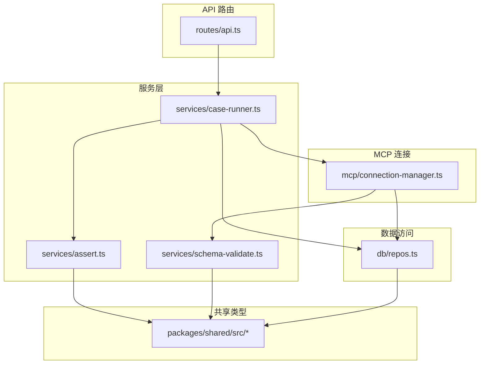
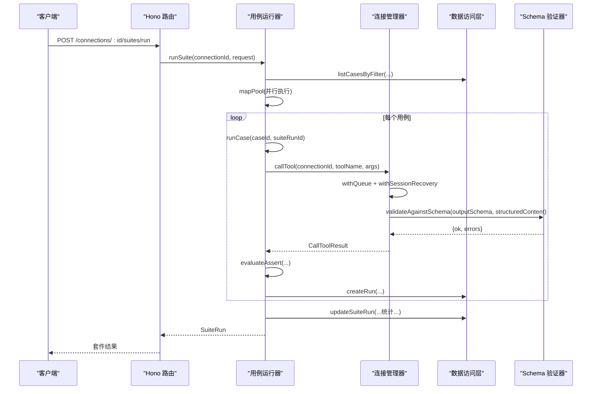
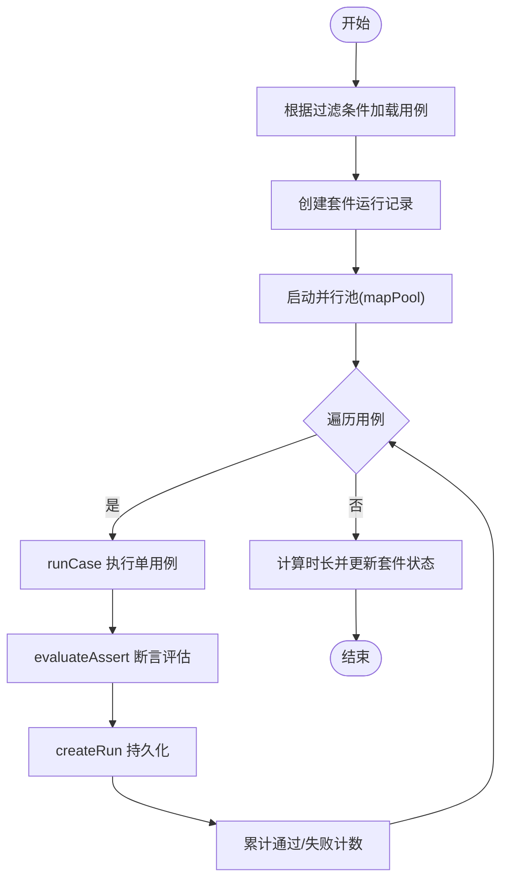
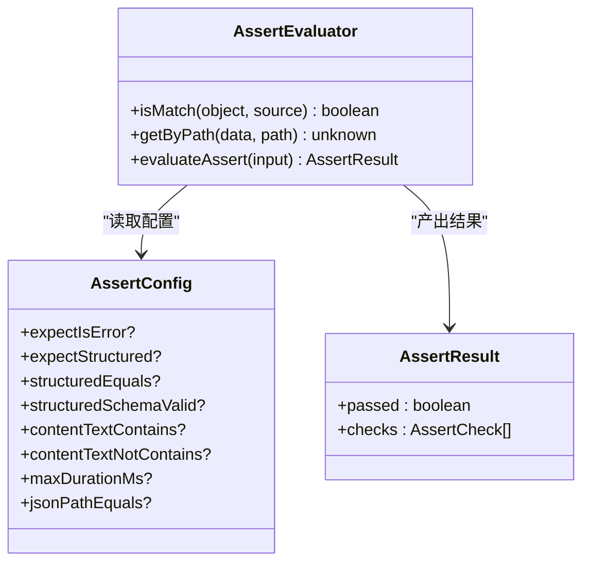
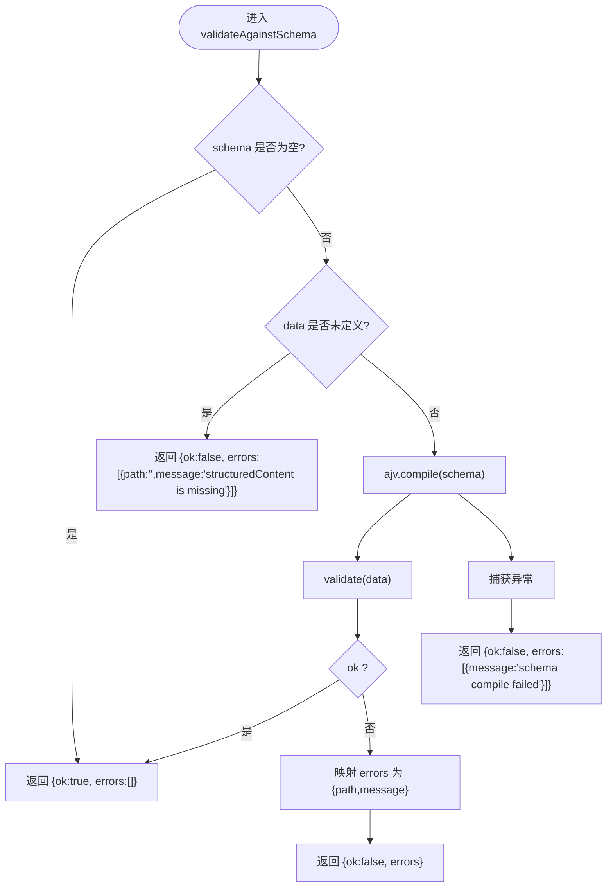
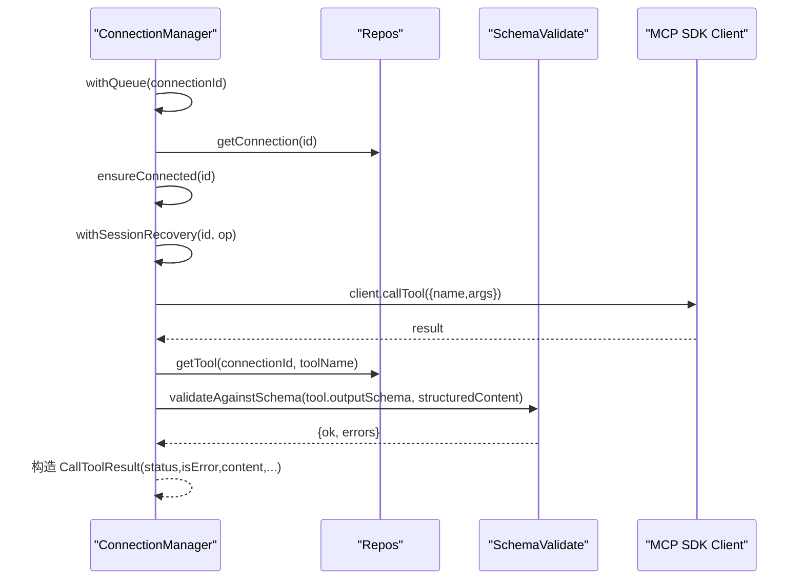
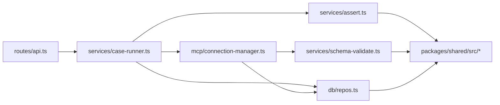

# 服务层

<cite>
**本文引用的文件**   
- [apps/server/src/services/case-runner.ts](file://apps/server/src/services/case-runner.ts)
- [apps/server/src/services/assert.ts](file://apps/server/src/services/assert.ts)
- [apps/server/src/services/schema-validate.ts](file://apps/server/src/services/schema-validate.ts)
- [apps/server/src/mcp/connection-manager.ts](file://apps/server/src/mcp/connection-manager.ts)
- [apps/server/src/db/repos.ts](file://apps/server/src/db/repos.ts)
- [packages/shared/src/types.ts](file://packages/shared/src/types.ts)
- [packages/shared/src/index.ts](file://packages/shared/src/index.ts)
- [packages/shared/src/assert-schema.ts](file://packages/shared/src/assert-schema.ts)
- [apps/server/src/routes/api.ts](file://apps/server/src/routes/api.ts)
- [apps/server/src/util/id.ts](file://apps/server/src/util/id.ts)
</cite>

## 目录
1. [简介](#简介)
2. [项目结构](#项目结构)
3. [核心组件](#核心组件)
4. [架构总览](#架构总览)
5. [详细组件分析](#详细组件分析)
6. [依赖关系分析](#依赖关系分析)
7. [性能与并发](#性能与并发)
8. [错误处理与传播](#错误处理与传播)
9. [接口定义与配置](#接口定义与配置)
10. [使用示例](#使用示例)
11. [故障排查指南](#故障排查指南)
12. [结论](#结论)

## 简介
本文件聚焦于服务层的业务逻辑封装，围绕用例运行器（CaseRunner）、断言评估器与 Schema 验证器展开，说明其设计模式、数据流转、错误传播机制，以及异步任务调度、并行执行控制与结果聚合策略。同时提供面向调用方的服务接口定义、配置选项与使用示例，帮助读者快速理解并正确使用该服务层。

## 项目结构
服务层位于后端应用内，采用分层组织：
- 路由层：HTTP API 暴露能力，负责参数校验与响应包装
- 服务层：封装业务逻辑，包括用例执行、断言评估、Schema 校验
- 连接管理：封装 MCP 客户端连接、会话恢复、超时控制
- 数据访问层：统一数据库读写与映射
- 共享类型：前后端共享的类型与工具函数

图表来源
- [apps/server/src/routes/api.ts:1-277](file://apps/server/src/routes/api.ts#L1-L277)
- [apps/server/src/services/case-runner.ts:1-161](file://apps/server/src/services/case-runner.ts#L1-L161)
- [apps/server/src/services/assert.ts:1-166](file://apps/server/src/services/assert.ts#L1-L166)
- [apps/server/src/services/schema-validate.ts:1-61](file://apps/server/src/services/schema-validate.ts#L1-L61)
- [apps/server/src/mcp/connection-manager.ts:1-383](file://apps/server/src/mcp/connection-manager.ts#L1-L383)
- [apps/server/src/db/repos.ts:1-660](file://apps/server/src/db/repos.ts#L1-L660)
- [packages/shared/src/types.ts:1-229](file://packages/shared/src/types.ts#L1-L229)

章节来源
- [apps/server/src/routes/api.ts:1-277](file://apps/server/src/routes/api.ts#L1-L277)
- [apps/server/src/services/case-runner.ts:1-161](file://apps/server/src/services/case-runner.ts#L1-L161)
- [apps/server/src/services/assert.ts:1-166](file://apps/server/src/services/assert.ts#L1-L166)
- [apps/server/src/services/schema-validate.ts:1-61](file://apps/server/src/services/schema-validate.ts#L1-L61)
- [apps/server/src/mcp/connection-manager.ts:1-383](file://apps/server/src/mcp/connection-manager.ts#L1-L383)
- [apps/server/src/db/repos.ts:1-660](file://apps/server/src/db/repos.ts#L1-L660)
- [packages/shared/src/types.ts:1-229](file://packages/shared/src/types.ts#L1-L229)

## 核心组件
- 用例运行器（CaseRunner）
  - 单用例执行：runCase
  - 批量套件执行：runSuite
  - 单次调用并持久化：invokeAndPersist
  - 内部并行池：mapPool
- 断言评估器（Assert）
  - evaluateAssert：基于 AssertConfig 对返回内容、结构化内容、耗时、Schema 校验等进行断言
- Schema 验证器（Schema Validate）
  - validateAgainstSchema：基于 JSON Schema 2020-12 的 Ajv 校验 structuredContent
- MCP 连接管理器（Connection Manager）
  - callTool：带超时、会话恢复、输出 Schema 校验的工具调用
  - syncTools/connect/disconnect/ensureConnected 等
- 数据访问层（Repos）
  - 用例、套件、运行记录、连接、工具的增删改查与映射

章节来源
- [apps/server/src/services/case-runner.ts:1-161](file://apps/server/src/services/case-runner.ts#L1-L161)
- [apps/server/src/services/assert.ts:1-166](file://apps/server/src/services/assert.ts#L1-L166)
- [apps/server/src/services/schema-validate.ts:1-61](file://apps/server/src/services/schema-validate.ts#L1-L61)
- [apps/server/src/mcp/connection-manager.ts:1-383](file://apps/server/src/mcp/connection-manager.ts#L1-L383)
- [apps/server/src/db/repos.ts:1-660](file://apps/server/src/db/repos.ts#L1-L660)

## 架构总览
服务层通过 Hono 路由暴露 HTTP API，调用服务层完成用例执行、断言与校验，底层通过 MCP SDK 与远程 MCP Server 通信，并使用 Drizzle ORM 持久化到 SQLite/PostgreSQL。

图表来源
- [apps/server/src/routes/api.ts:183-191](file://apps/server/src/routes/api.ts#L183-L191)
- [apps/server/src/services/case-runner.ts:111-160](file://apps/server/src/services/case-runner.ts#L111-L160)
- [apps/server/src/services/case-runner.ts:79-92](file://apps/server/src/services/case-runner.ts#L79-L92)
- [apps/server/src/mcp/connection-manager.ts:300-379](file://apps/server/src/mcp/connection-manager.ts#L300-L379)
- [apps/server/src/services/schema-validate.ts:27-60](file://apps/server/src/services/schema-validate.ts#L27-L60)
- [apps/server/src/db/repos.ts:640-659](file://apps/server/src/db/repos.ts#L640-L659)
- [apps/server/src/db/repos.ts:476-528](file://apps/server/src/db/repos.ts#L476-L528)
- [apps/server/src/db/repos.ts:601-617](file://apps/server/src/db/repos.ts#L601-L617)

## 详细组件分析

### 用例运行器（CaseRunner）
- 职责
  - 编排一次或多次 Tool 调用
  - 将调用结果与断言、Schema 校验结果持久化
  - 支持按连接、工具名、标签、用例 ID 筛选用例进行套件执行
  - 提供可控的并行度以平衡吞吐与资源占用
- 关键流程
  - invokeAndPersist：调用 MCP 工具 -> 可选断言 -> 持久化运行记录 -> 返回标准化响应
  - runCase：根据用例配置组装参数并执行
  - runSuite：筛选用例 -> 创建套件运行记录 -> 并行执行 -> 汇总统计 -> 更新套件状态
  - mapPool：固定线程数的 Promise 池，保证并发上限
- 数据流
  - 输入：connectionId、toolName、arguments、assert、source、suiteRunId 等
  - 中间：CallToolResult（含 content、structuredContent、schemaValidation、durationMs 等）
  - 输出：InvokeResponse（包含 runId、断言结果、校验结果等）
- 错误处理
  - 用例不存在时抛出错误
  - 套件执行中单个用例异常计入失败，不中断其他用例
  - 最终根据失败数设置套件状态为 passed/failed

图表来源
- [apps/server/src/services/case-runner.ts:111-160](file://apps/server/src/services/case-runner.ts#L111-L160)
- [apps/server/src/services/case-runner.ts:79-92](file://apps/server/src/services/case-runner.ts#L79-L92)
- [apps/server/src/services/case-runner.ts:94-109](file://apps/server/src/services/case-runner.ts#L94-L109)
- [apps/server/src/db/repos.ts:640-659](file://apps/server/src/db/repos.ts#L640-L659)
- [apps/server/src/db/repos.ts:572-599](file://apps/server/src/db/repos.ts#L572-L599)
- [apps/server/src/db/repos.ts:601-617](file://apps/server/src/db/repos.ts#L601-L617)

章节来源
- [apps/server/src/services/case-runner.ts:1-161](file://apps/server/src/services/case-runner.ts#L1-L161)
- [apps/server/src/db/repos.ts:476-528](file://apps/server/src/db/repos.ts#L476-L528)
- [apps/server/src/db/repos.ts:572-617](file://apps/server/src/db/repos.ts#L572-L617)
- [apps/server/src/db/repos.ts:640-659](file://apps/server/src/db/repos.ts#L640-L659)

### 断言评估器（Assert）
- 职责
  - 根据 AssertConfig 对调用结果进行多维度断言
  - 支持错误语义、结构化内容存在性、部分匹配、文本包含/排除、最大耗时、JSONPath 精确匹配、输出 Schema 有效性等
- 关键能力
  - isMatch：浅深混合的部分匹配（对象键递归、数组逐项匹配）
  - getByPath：支持 $ 前缀与索引路径的结构化取值
  - evaluateAssert：生成检查项列表与总体通过状态
- 复杂度
  - isMatch：O(k) 其中 k 为目标结构的键数量；数组场景为 O(n*k)
  - getByPath：O(p) 其中 p 为路径段数量
- 典型断言项
  - expectIsError、expectStructured、structuredEquals、structuredSchemaValid
  - contentTextContains、contentTextNotContains
  - maxDurationMs
  - jsonPathEquals

图表来源
- [apps/server/src/services/assert.ts:13-24](file://apps/server/src/services/assert.ts#L13-L24)
- [apps/server/src/services/assert.ts:33-56](file://apps/server/src/services/assert.ts#L33-L56)
- [apps/server/src/services/assert.ts:58-165](file://apps/server/src/services/assert.ts#L58-L165)
- [packages/shared/src/types.ts:19-41](file://packages/shared/src/types.ts#L19-L41)

章节来源
- [apps/server/src/services/assert.ts:1-166](file://apps/server/src/services/assert.ts#L1-L166)
- [packages/shared/src/types.ts:19-41](file://packages/shared/src/types.ts#L19-L41)

### Schema 验证器（Schema Validate）
- 职责
  - 基于 JSON Schema 2020-12 对 structuredContent 进行校验
  - 统一错误格式，便于上层断言与展示
- 关键点
  - 使用 Ajv 2020 并启用 formats
  - allErrors=true 收集全部错误
  - 对 schema 为空或 data 缺失做快速返回
  - 捕获编译期异常并转换为标准错误结构
- 输出
  - ok: boolean
  - errors: Array<{path, message}>

图表来源
- [apps/server/src/services/schema-validate.ts:27-60](file://apps/server/src/services/schema-validate.ts#L27-L60)

章节来源
- [apps/server/src/services/schema-validate.ts:1-61](file://apps/server/src/services/schema-validate.ts#L1-L61)
- [packages/shared/src/types.ts:43-46](file://packages/shared/src/types.ts#L43-L46)

### MCP 连接管理器（Connection Manager）
- 职责
  - 维护连接与会话生命周期
  - 自动选择传输（streamable_http/sse/auto），支持回退
  - 会话过期恢复（Streamable HTTP 404 时重连并重试一次）
  - 工具调用超时控制与协议错误归一化
  - 在调用后对 structuredContent 执行 Schema 校验
- 关键特性
  - withQueue：按连接串行化请求，避免同一连接并发冲突
  - withSessionRecovery：检测会话失效并安全重试
  - callTool：封装超时、错误分类（timeout/protocol_error/tool_error/success）
- 与 Schema 验证器的集成
  - 在成功分支中对 structuredContent 执行 validateAgainstSchema，并将结果写入返回体

图表来源
- [apps/server/src/mcp/connection-manager.ts:300-379](file://apps/server/src/mcp/connection-manager.ts#L300-L379)
- [apps/server/src/mcp/connection-manager.ts:209-268](file://apps/server/src/mcp/connection-manager.ts#L209-L268)
- [apps/server/src/mcp/connection-manager.ts:101-147](file://apps/server/src/mcp/connection-manager.ts#L101-L147)
- [apps/server/src/services/schema-validate.ts:27-60](file://apps/server/src/services/schema-validate.ts#L27-L60)
- [apps/server/src/db/repos.ts:384-398](file://apps/server/src/db/repos.ts#L384-L398)

章节来源
- [apps/server/src/mcp/connection-manager.ts:1-383](file://apps/server/src/mcp/connection-manager.ts#L1-L383)
- [apps/server/src/services/schema-validate.ts:1-61](file://apps/server/src/services/schema-validate.ts#L1-L61)
- [apps/server/src/db/repos.ts:384-398](file://apps/server/src/db/repos.ts#L384-L398)

### 数据访问层（Repos）
- 职责
  - 统一数据库操作，屏蔽 SQL 细节
  - 提供连接、工具、用例、运行记录、套件运行的 CRUD
  - 将 JSON 字段安全解析/序列化
  - 提供用例筛选（按 connectionId、toolNames、caseIds、tags）
- 与服务的协作
  - CaseRunner 通过 repos 获取用例、创建运行记录、更新套件统计
  - ConnectionManager 通过 repos 获取连接与工具信息，并标记连接状态

章节来源
- [apps/server/src/db/repos.ts:1-660](file://apps/server/src/db/repos.ts#L1-L660)

## 依赖关系分析
- 模块耦合
  - routes/api.ts 依赖 services/case-runner.ts 暴露用例执行能力
  - case-runner.ts 依赖 mcp/connection-manager.ts 执行工具调用，依赖 services/assert.ts 进行断言，依赖 db/repos.ts 持久化
  - connection-manager.ts 依赖 services/schema-validate.ts 进行输出 Schema 校验，依赖 db/repos.ts 获取连接与工具信息
  - assert.ts 与 schema-validate.ts 依赖 packages/shared 中的类型定义
- 外部依赖
  - MCP TypeScript SDK（@modelcontextprotocol/sdk）
  - Ajv 2020（JSON Schema 2020-12 校验）
  - Drizzle ORM（SQLite/PostgreSQL）
  - Hono（HTTP 框架）

图表来源
- [apps/server/src/routes/api.ts:1-277](file://apps/server/src/routes/api.ts#L1-L277)
- [apps/server/src/services/case-runner.ts:1-161](file://apps/server/src/services/case-runner.ts#L1-L161)
- [apps/server/src/mcp/connection-manager.ts:1-383](file://apps/server/src/mcp/connection-manager.ts#L1-L383)
- [apps/server/src/services/assert.ts:1-166](file://apps/server/src/services/assert.ts#L1-L166)
- [apps/server/src/services/schema-validate.ts:1-61](file://apps/server/src/services/schema-validate.ts#L1-L61)
- [apps/server/src/db/repos.ts:1-660](file://apps/server/src/db/repos.ts#L1-L660)
- [packages/shared/src/index.ts:1-3](file://packages/shared/src/index.ts#L1-L3)

章节来源
- [apps/server/src/routes/api.ts:1-277](file://apps/server/src/routes/api.ts#L1-L277)
- [apps/server/src/services/case-runner.ts:1-161](file://apps/server/src/services/case-runner.ts#L1-L161)
- [apps/server/src/mcp/connection-manager.ts:1-383](file://apps/server/src/mcp/connection-manager.ts#L1-L383)
- [apps/server/src/services/assert.ts:1-166](file://apps/server/src/services/assert.ts#L1-L166)
- [apps/server/src/services/schema-validate.ts:1-61](file://apps/server/src/services/schema-validate.ts#L1-L61)
- [apps/server/src/db/repos.ts:1-660](file://apps/server/src/db/repos.ts#L1-L660)
- [packages/shared/src/index.ts:1-3](file://packages/shared/src/index.ts#L1-L3)

## 性能与并发
- 并行执行控制
  - mapPool 使用固定数量的 runner 并发执行用例，默认 parallel=1，可通过 SuiteRunRequest.parallel 调整
  - 队列机制：withQueue 确保同一连接的请求串行化，避免 MCP 会话竞争
- 超时控制
  - callTool 使用 AbortController 与 setTimeout 组合实现超时，区分 timeout 与其他协议错误
- 结果聚合
  - runSuite 在并行执行过程中累计 passed/failed，结束后计算 durationMs 并更新套件状态
- 建议
  - 合理设置 parallel，结合系统 CPU 与网络 I/O 能力调优
  - 对高延迟 MCP Server，适当增大超时时间
  - 对大量用例，考虑分批执行或增加监控指标

[本节为通用指导，无需特定文件引用]

## 错误处理与传播
- 连接与调用错误
  - 连接不存在、工具不存在、协议错误、超时等由 connection-manager 统一归类
  - Streamable HTTP 会话 404 触发自动重连与一次重试
- 断言与校验错误
  - evaluateAssert 生成 checks 列表，任一检查失败即整体失败
  - validateAgainstSchema 返回结构化错误，便于前端展示
- 持久化错误
  - 数据库异常会向上抛出，路由层捕获并返回 5xx
- 错误传播路径
  - 路由层 -> 服务层 -> 连接管理 -> 数据访问层
  - 服务层内部错误（如用例不存在）直接抛出，路由层统一包装为 JSON 错误响应

章节来源
- [apps/server/src/mcp/connection-manager.ts:209-268](file://apps/server/src/mcp/connection-manager.ts#L209-L268)
- [apps/server/src/mcp/connection-manager.ts:300-379](file://apps/server/src/mcp/connection-manager.ts#L300-L379)
- [apps/server/src/services/assert.ts:58-165](file://apps/server/src/services/assert.ts#L58-L165)
- [apps/server/src/services/schema-validate.ts:27-60](file://apps/server/src/services/schema-validate.ts#L27-L60)
- [apps/server/src/routes/api.ts:117-138](file://apps/server/src/routes/api.ts#L117-L138)
- [apps/server/src/routes/api.ts:174-191](file://apps/server/src/routes/api.ts#L174-L191)

## 接口定义与配置
- 服务接口（HTTP API）
  - 健康检查：GET /api/health
  - 连接管理：
    - GET /api/connections
    - POST /api/connections
    - GET /api/connections/:id
    - PATCH /api/connections/:id
    - DELETE /api/connections/:id
    - POST /api/connections/:id/connect
    - POST /api/connections/:id/disconnect
    - POST /api/connections/:id/sync-tools
    - GET /api/connections/:id/tools
    - GET /api/connections/:id/tools/:toolName
    - POST /api/connections/:id/tools/:toolName/invoke
  - 用例管理：
    - GET /api/connections/:id/tools/:toolName/cases
    - POST /api/connections/:id/tools/:toolName/cases
    - GET /api/connections/:id/cases
    - PATCH /api/cases/:id
    - DELETE /api/cases/:id
    - POST /api/cases/:id/run
  - 套件与运行：
    - POST /api/connections/:id/suites/run
    - GET /api/suite-runs
    - GET /api/suite-runs/:id
    - GET /api/runs
    - GET /api/runs/:id
    - DELETE /api/runs/:id
  - 导入导出：
    - GET /api/export
    - POST /api/import
- 配置选项
  - 环境变量：PORT、DATABASE_URL、DB_DIALECT、CORS_ORIGIN
  - 套件执行：SuiteRunRequest 支持 toolNames、caseIds、tags、parallel、name
  - 连接超时：CreateConnectionInput.timeoutMs
- 断言配置（AssertConfig）
  - expectIsError、expectStructured、structuredEquals、structuredSchemaValid
  - contentTextContains、contentTextNotContains
  - maxDurationMs
  - jsonPathEquals

章节来源
- [apps/server/src/routes/api.ts:32-277](file://apps/server/src/routes/api.ts#L32-L277)
- [packages/shared/src/types.ts:188-214](file://packages/shared/src/types.ts#L188-L214)
- [packages/shared/src/types.ts:19-28](file://packages/shared/src/types.ts#L19-L28)
- [README.md:136-144](file://README.md#L136-L144)

## 使用示例
- 手动调用 Tool 并保存运行记录
  - 请求：POST /api/connections/{id}/tools/{toolName}/invoke
  - 请求体：{ arguments: {...}, save: true, testCaseId?: string }
  - 响应：InvokeResponse（包含 runId、status、content、structuredContent、schemaValidation、assertResult 等）
- 运行单个用例
  - 请求：POST /api/cases/{id}/run
  - 响应：InvokeResponse（断言与校验结果已包含）
- 批量运行套件
  - 请求：POST /api/connections/{id}/suites/run
  - 请求体：{ toolNames?: string[], caseIds?: string[], tags?: string[], parallel?: number, name?: string }
  - 响应：SuiteRun（包含 total/passed/failed/status/durationMs 等）
- 查询运行历史
  - 请求：GET /api/runs?connectionId=&toolName=&suiteRunId=&status=&limit=
  - 响应：InvocationRun[]

章节来源
- [apps/server/src/routes/api.ts:117-138](file://apps/server/src/routes/api.ts#L117-L138)
- [apps/server/src/routes/api.ts:174-191](file://apps/server/src/routes/api.ts#L174-L191)
- [apps/server/src/routes/api.ts:205-214](file://apps/server/src/routes/api.ts#L205-L214)

## 故障排查指南
- 连接问题
  - 现象：连接失败或最后错误信息
  - 排查：查看连接状态 lastError、serverInfo；确认 URL、Headers、超时；尝试 connect 与 sync-tools
- 会话过期（Streamable HTTP 404）
  - 现象：调用报 404 或 session 丢失
  - 机制：自动丢弃旧会话并重连，若仍失败则标记不可用
- 超时
  - 现象：status=timeout
  - 排查：增大 timeoutMs 或优化 MCP Server 性能
- 断言失败
  - 现象：assertResult.passed=false，查看 checks 明细定位具体断言项
- Schema 校验失败
  - 现象：schemaValidation.ok=false，errors 包含 path/message
  - 排查：核对 outputSchema 与实际返回结构一致性

章节来源
- [apps/server/src/mcp/connection-manager.ts:101-147](file://apps/server/src/mcp/connection-manager.ts#L101-L147)
- [apps/server/src/mcp/connection-manager.ts:209-268](file://apps/server/src/mcp/connection-manager.ts#L209-L268)
- [apps/server/src/mcp/connection-manager.ts:300-379](file://apps/server/src/mcp/connection-manager.ts#L300-L379)
- [apps/server/src/services/assert.ts:58-165](file://apps/server/src/services/assert.ts#L58-L165)
- [apps/server/src/services/schema-validate.ts:27-60](file://apps/server/src/services/schema-validate.ts#L27-L60)

## 结论
服务层通过清晰的分层与职责划分，将 MCP 工具调用、断言评估与 Schema 校验有机整合，提供了稳定可靠的用例执行与套件批量执行能力。借助连接管理器与会话恢复机制，系统在复杂网络环境下具备较强的鲁棒性。配合可配置的并行度与完善的错误分类，既满足调试阶段的灵活性，也支撑回归测试的稳定性与可观测性。