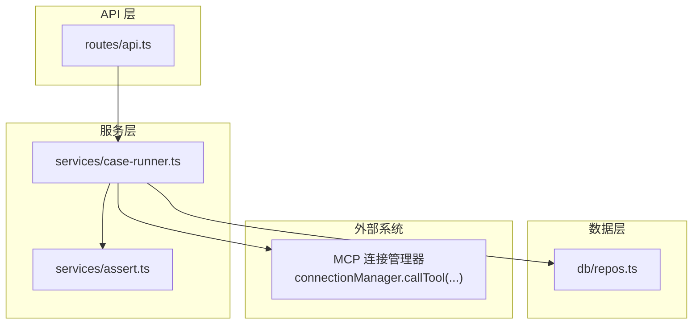
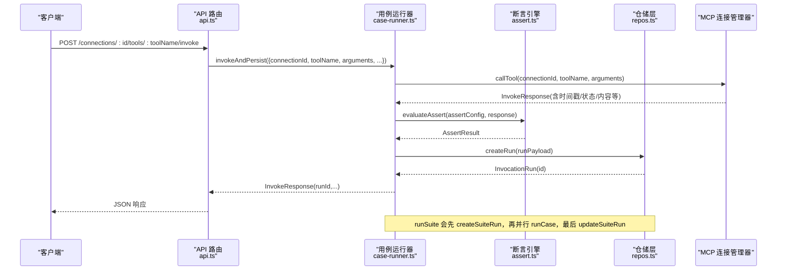
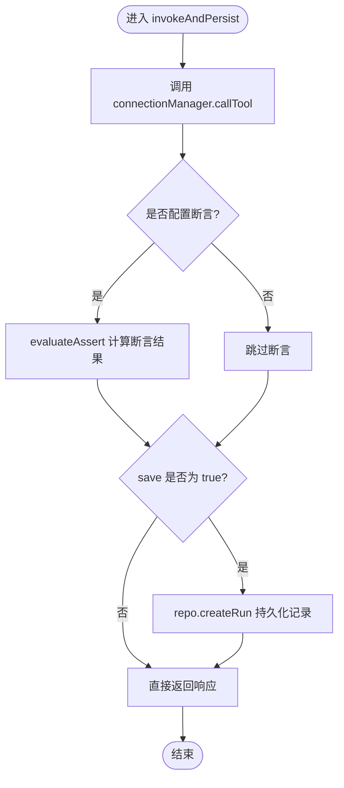
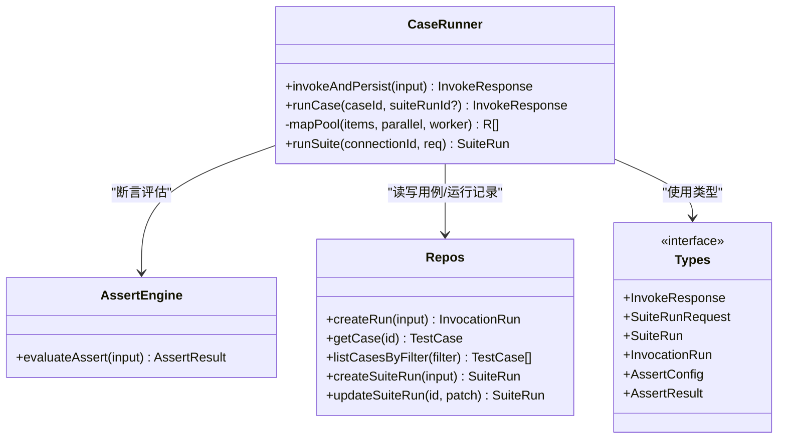
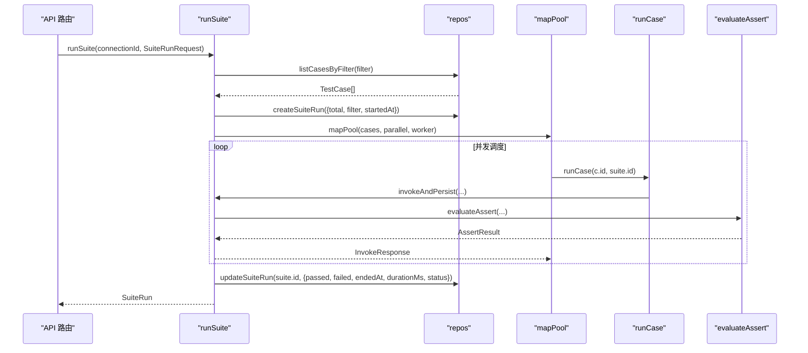
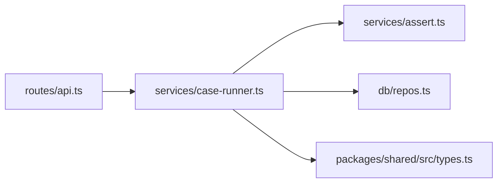

# 用例运行器

<cite>
**本文引用的文件**   
- [apps/server/src/services/case-runner.ts](file://apps/server/src/services/case-runner.ts)
- [apps/server/src/services/assert.ts](file://apps/server/src/services/assert.ts)
- [apps/server/src/db/repos.ts](file://apps/server/src/db/repos.ts)
- [packages/shared/src/types.ts](file://packages/shared/src/types.ts)
- [apps/server/src/routes/api.ts](file://apps/server/src/routes/api.ts)
</cite>

## 目录
1. [简介](#简介)
2. [项目结构](#项目结构)
3. [核心组件](#核心组件)
4. [架构总览](#架构总览)
5. [详细组件分析](#详细组件分析)
6. [依赖关系分析](#依赖关系分析)
7. [性能考量](#性能考量)
8. [故障排查指南](#故障排查指南)
9. [结论](#结论)
10. [附录：使用模式与示例路径](#附录使用模式与示例路径)

## 简介
本文件聚焦“用例运行器”的批量执行引擎，围绕以下关键点展开：
- invokeAndPersist 调用持久化流程：从工具调用、断言评估到结果落库。
- runCase 单个用例执行逻辑：加载用例、参数组装、调用并持久化。
- runSuite 套件批量执行机制：筛选用例、创建套件记录、并行调度与结果聚合。
- 并行控制策略 mapPool：基于固定并发度的任务分配算法。
- 错误处理、状态管理与性能优化策略。
- 结合 API 层的使用模式与调用路径。

## 项目结构
用例运行器位于服务端服务层，通过路由暴露对外接口，底层依赖数据库仓储与 MCP 连接管理器。

图表来源
- [apps/server/src/routes/api.ts:117-191](file://apps/server/src/routes/api.ts#L117-L191)
- [apps/server/src/services/case-runner.ts:11-160](file://apps/server/src/services/case-runner.ts#L11-L160)
- [apps/server/src/services/assert.ts:58-165](file://apps/server/src/services/assert.ts#L58-L165)
- [apps/server/src/db/repos.ts:476-624](file://apps/server/src/db/repos.ts#L476-L624)

章节来源
- [apps/server/src/routes/api.ts:117-191](file://apps/server/src/routes/api.ts#L117-L191)
- [apps/server/src/services/case-runner.ts:11-160](file://apps/server/src/services/case-runner.ts#L11-L160)
- [apps/server/src/services/assert.ts:58-165](file://apps/server/src/services/assert.ts#L58-L165)
- [apps/server/src/db/repos.ts:476-624](file://apps/server/src/db/repos.ts#L476-L624)

## 核心组件
- invokeAndPersist：统一封装一次工具调用的完整生命周期（调用、断言、持久化），返回标准化响应。
- runCase：按用例定义发起一次调用，自动标记 source 为 case/suite，并强制保存。
- runSuite：根据过滤条件选择用例，创建套件运行记录，按并发度调度执行，统计并通过/失败计数更新套件状态。
- mapPool：固定并发度的并行调度器，保证结果顺序与稳定分配。
- evaluateAssert：对结构化与非结构化输出进行多维度断言校验。

章节来源
- [apps/server/src/services/case-runner.ts:11-160](file://apps/server/src/services/case-runner.ts#L11-L160)
- [apps/server/src/services/assert.ts:58-165](file://apps/server/src/services/assert.ts#L58-L165)

## 架构总览
下图展示了从 HTTP 请求到工具调用、断言、持久化以及套件批处理的端到端流程。

图表来源
- [apps/server/src/routes/api.ts:117-191](file://apps/server/src/routes/api.ts#L117-L191)
- [apps/server/src/services/case-runner.ts:11-160](file://apps/server/src/services/case-runner.ts#L11-L160)
- [apps/server/src/services/assert.ts:58-165](file://apps/server/src/services/assert.ts#L58-L165)
- [apps/server/src/db/repos.ts:476-624](file://apps/server/src/db/repos.ts#L476-L624)

## 详细组件分析

### invokeAndPersist：调用与持久化
职责
- 调用 MCP 工具，获取运行时指标与结果。
- 可选执行断言评估，生成断言结果。
- 将调用记录持久化（默认开启），返回包含 runId 的标准化响应。

关键流程
- 调用 connectionManager.callTool 获取 InvokeResponse。
- 若配置了断言，则调用 evaluateAssert 计算断言结果。
- 根据 save 标志决定是否写入 invocationRuns 表，得到 runId。
- 返回包含 runId、耗时、状态、内容、断言结果等的响应对象。

复杂度与注意点
- 主要 I/O 在远程工具调用与数据库写入；CPU 开销集中在断言评估。
- 断言评估可能涉及 JSONPath 解析与深度匹配，需关注输入大小。

错误处理
- 上层路由捕获异常并返回 5xx。
- 断言失败不会抛错，仅影响断言结果字段。

章节来源
- [apps/server/src/services/case-runner.ts:11-77](file://apps/server/src/services/case-runner.ts#L11-L77)
- [apps/server/src/services/assert.ts:58-165](file://apps/server/src/services/assert.ts#L58-L165)
- [apps/server/src/db/repos.ts:476-528](file://apps/server/src/db/repos.ts#L476-L528)
- [apps/server/src/routes/api.ts:117-138](file://apps/server/src/routes/api.ts#L117-L138)

#### 流程图：invokeAndPersist

图表来源
- [apps/server/src/services/case-runner.ts:11-77](file://apps/server/src/services/case-runner.ts#L11-L77)
- [apps/server/src/services/assert.ts:58-165](file://apps/server/src/services/assert.ts#L58-L165)
- [apps/server/src/db/repos.ts:476-528](file://apps/server/src/db/repos.ts#L476-L528)

### runCase：单用例执行
职责
- 根据用例 ID 读取用例定义。
- 以 source="case"/"suite" 区分来源，并强制保存。
- 委托 invokeAndPersist 完成调用与持久化。

要点
- 若用例不存在，抛出错误由上层路由统一处理。
- 当作为套件的一部分时，传入 suiteRunId 以便关联。

章节来源
- [apps/server/src/services/case-runner.ts:79-92](file://apps/server/src/services/case-runner.ts#L79-L92)
- [apps/server/src/db/repos.ts:417-422](file://apps/server/src/db/repos.ts#L417-L422)
- [apps/server/src/routes/api.ts:174-181](file://apps/server/src/routes/api.ts#L174-L181)

### runSuite：套件批量执行
职责
- 根据过滤条件（工具名、用例 ID、标签）筛选用例。
- 创建套件运行记录，记录初始 total 与状态 running。
- 使用 mapPool 按 parallel 并发度调度 runCase。
- 统计 passed/failed/skipped，计算 durationMs，更新套件状态。

并行调度算法 mapPool
- 维护一个共享索引 idx 与固定数量的 runner 协程。
- 每个 runner 循环取出下一个未分配的任务，等待 worker 完成后回填 results 对应位置。
- 所有 runner 完成后 Promise.all 汇聚，返回与输入同序的结果数组。

结果聚合
- 成功判定：存在断言时以断言 passed 为准；否则以 status=success 且 isError=false 为准。
- 异常计入 failed。
- 最终根据 failed>0 决定套件状态为 failed 或 passed。

章节来源
- [apps/server/src/services/case-runner.ts:94-160](file://apps/server/src/services/case-runner.ts#L94-L160)
- [apps/server/src/db/repos.ts:572-624](file://apps/server/src/db/repos.ts#L572-L624)
- [apps/server/src/db/repos.ts:640-659](file://apps/server/src/db/repos.ts#L640-L659)
- [apps/server/src/routes/api.ts:183-191](file://apps/server/src/routes/api.ts#L183-L191)

#### 类图：用例运行器相关类型与函数

图表来源
- [apps/server/src/services/case-runner.ts:11-160](file://apps/server/src/services/case-runner.ts#L11-L160)
- [apps/server/src/services/assert.ts:58-165](file://apps/server/src/services/assert.ts#L58-L165)
- [apps/server/src/db/repos.ts:417-422](file://apps/server/src/db/repos.ts#L417-L422)
- [apps/server/src/db/repos.ts:476-528](file://apps/server/src/db/repos.ts#L476-L528)
- [apps/server/src/db/repos.ts:572-624](file://apps/server/src/db/repos.ts#L572-L624)
- [packages/shared/src/types.ts:150-214](file://packages/shared/src/types.ts#L150-L214)

#### 序列图：runSuite 执行流

图表来源
- [apps/server/src/services/case-runner.ts:111-160](file://apps/server/src/services/case-runner.ts#L111-L160)
- [apps/server/src/services/case-runner.ts:79-92](file://apps/server/src/services/case-runner.ts#L79-L92)
- [apps/server/src/services/assert.ts:58-165](file://apps/server/src/services/assert.ts#L58-L165)
- [apps/server/src/db/repos.ts:572-624](file://apps/server/src/db/repos.ts#L572-L624)
- [apps/server/src/db/repos.ts:640-659](file://apps/server/src/db/repos.ts#L640-L659)

### 断言引擎 evaluateAssert
能力
- 支持期望错误、期望结构化输出、结构化等于（部分深匹配）、结构化 Schema 校验、文本包含/不包含、最大耗时、JSONPath 精确匹配等多维度断言。
- 返回断言总体通过与否及每条检查明细。

注意
- 断言失败不影响主流程，仅体现在 assertResult 中。
- JSONPath 解析与深度匹配对大数据量有一定 CPU 消耗。

章节来源
- [apps/server/src/services/assert.ts:58-165](file://apps/server/src/services/assert.ts#L58-L165)
- [packages/shared/src/types.ts:19-46](file://packages/shared/src/types.ts#L19-L46)

## 依赖关系分析
- API 路由依赖 services/case-runner 暴露用例与套件执行入口。
- case-runner 依赖 repos 进行用例与运行记录的 CRUD，依赖 assert 进行断言评估，依赖 connectionManager 进行工具调用。
- types 提供跨模块的类型契约，确保前后端与服务端内部一致。

图表来源
- [apps/server/src/routes/api.ts:117-191](file://apps/server/src/routes/api.ts#L117-L191)
- [apps/server/src/services/case-runner.ts:11-160](file://apps/server/src/services/case-runner.ts#L11-L160)
- [packages/shared/src/types.ts:150-214](file://packages/shared/src/types.ts#L150-L214)

章节来源
- [apps/server/src/routes/api.ts:117-191](file://apps/server/src/routes/api.ts#L117-L191)
- [apps/server/src/services/case-runner.ts:11-160](file://apps/server/src/services/case-runner.ts#L11-L160)
- [packages/shared/src/types.ts:150-214](file://packages/shared/src/types.ts#L150-L214)

## 性能考量
- 并发度控制：mapPool 通过固定并发度限制同时运行的 worker 数量，避免资源争用与下游压力过大。parallel 越大，吞吐越高，但需权衡下游 MCP 服务与数据库负载。
- 结果顺序：results 预分配并按索引回填，保证与输入用例顺序一致，便于前端展示与定位。
- 断言成本：复杂断言（尤其是 JSONPath 与深度匹配）会增加 CPU 开销，建议在大批量套件中合理裁剪断言项。
- 持久化开销：每次调用都会写入 invocation_runs，建议在高并发场景下关注数据库写入瓶颈，必要时可考虑异步落库或批量写入（当前实现为同步）。
- 套件时长计算：durationMs 基于 endedAt 与 startedAt 差值，受网络与并发影响较大，适合用于趋势对比而非绝对阈值。

[本节为通用指导，不直接分析具体文件]

## 故障排查指南
- 用例不存在：runCase 会抛出错误，API 层捕获后返回 500。请确认用例 ID 有效且已启用。
- 断言失败：查看返回的 assertResult.checks 明细，逐项核对期望与实际值。
- 套件状态为 failed：检查失败的用例记录，优先关注断言失败与工具调用错误。
- 并发过高导致超时或失败：降低 SuiteRunRequest.parallel，观察成功率与延迟变化。
- 结果缺失或为空：确认 save 标志未被置为 false，并检查 invocation_runs 是否存在对应记录。

章节来源
- [apps/server/src/services/case-runner.ts:79-92](file://apps/server/src/services/case-runner.ts#L79-L92)
- [apps/server/src/routes/api.ts:174-191](file://apps/server/src/routes/api.ts#L174-L191)
- [apps/server/src/services/assert.ts:58-165](file://apps/server/src/services/assert.ts#L58-L165)

## 结论
用例运行器以 invokeAndPersist 为核心，串联工具调用、断言评估与持久化；runCase 提供单用例执行入口；runSuite 借助 mapPool 实现可控并发与结果聚合，形成完整的批量执行闭环。通过清晰的类型契约与分层设计，系统在可扩展性与可观测性方面具备良好基础。实际部署中应结合下游 MCP 服务能力与数据库容量，合理设置并发度与断言范围，以获得稳定的吞吐与成功率。

[本节为总结性内容，不直接分析具体文件]

## 附录：使用模式与示例路径
- 手动调用工具并持久化
  - 接口：POST /connections/:id/tools/:toolName/invoke
  - 行为：调用 invokeAndPersist，source 取决于是否携带 testCaseId
  - 参考路径：[apps/server/src/routes/api.ts:117-138](file://apps/server/src/routes/api.ts#L117-L138)

- 运行单个用例
  - 接口：POST /cases/:id/run
  - 行为：调用 runCase，source 标记为 case，强制保存
  - 参考路径：[apps/server/src/routes/api.ts:174-181](file://apps/server/src/routes/api.ts#L174-L181)

- 运行套件
  - 接口：POST /connections/:id/suites/run
  - 行为：调用 runSuite，按 parallel 并发执行，统计并更新套件状态
  - 参考路径：[apps/server/src/routes/api.ts:183-191](file://apps/server/src/routes/api.ts#L183-L191)

- 查询套件与运行记录
  - 接口：GET /suite-runs/:id、GET /runs、GET /runs/:id
  - 行为：聚合套件信息与子用例运行记录
  - 参考路径：[apps/server/src/routes/api.ts:193-225](file://apps/server/src/routes/api.ts#L193-L225)

- 核心实现参考路径
  - invokeAndPersist：[apps/server/src/services/case-runner.ts:11-77](file://apps/server/src/services/case-runner.ts#L11-L77)
  - runCase：[apps/server/src/services/case-runner.ts:79-92](file://apps/server/src/services/case-runner.ts#L79-L92)
  - mapPool：[apps/server/src/services/case-runner.ts:94-109](file://apps/server/src/services/case-runner.ts#L94-L109)
  - runSuite：[apps/server/src/services/case-runner.ts:111-160](file://apps/server/src/services/case-runner.ts#L111-L160)
  - 断言评估：[apps/server/src/services/assert.ts:58-165](file://apps/server/src/services/assert.ts#L58-L165)
  - 仓储操作（用例/套件/运行记录）：[apps/server/src/db/repos.ts:417-422](file://apps/server/src/db/repos.ts#L417-L422)、[apps/server/src/db/repos.ts:476-528](file://apps/server/src/db/repos.ts#L476-L528)、[apps/server/src/db/repos.ts:572-624](file://apps/server/src/db/repos.ts#L572-L624)、[apps/server/src/db/repos.ts:640-659](file://apps/server/src/db/repos.ts#L640-L659)
  - 类型契约：[packages/shared/src/types.ts:150-214](file://packages/shared/src/types.ts#L150-L214)