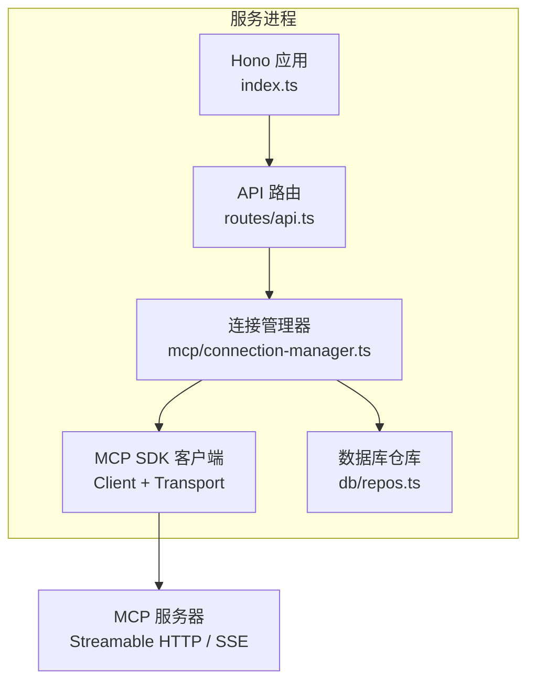
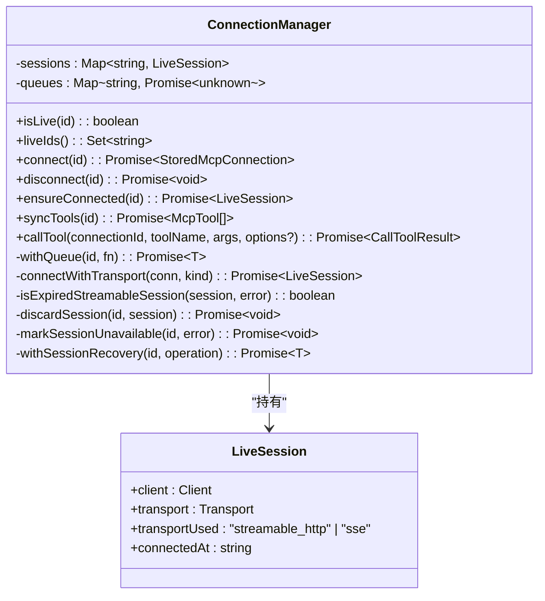
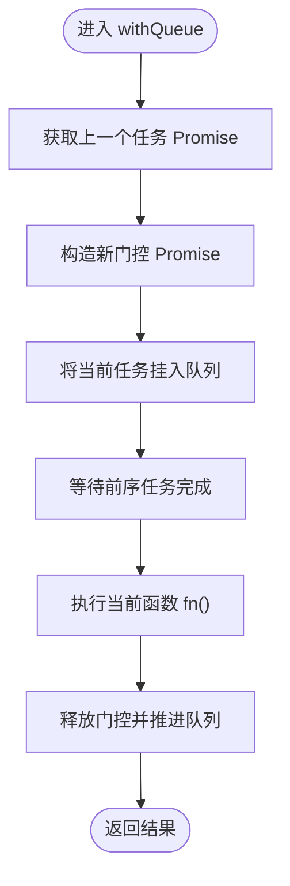
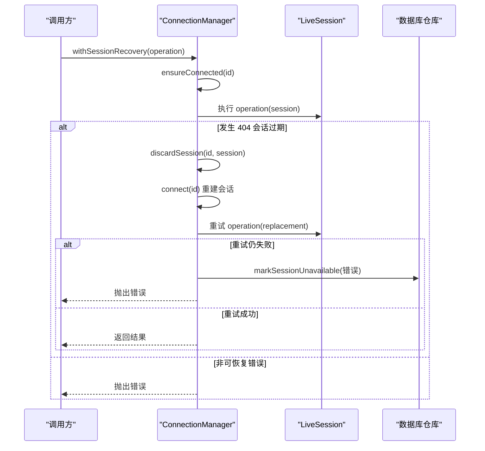
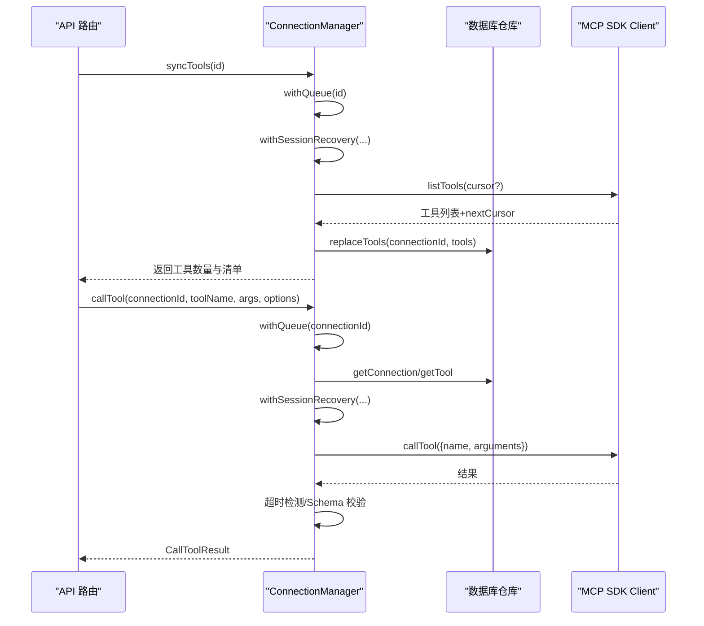
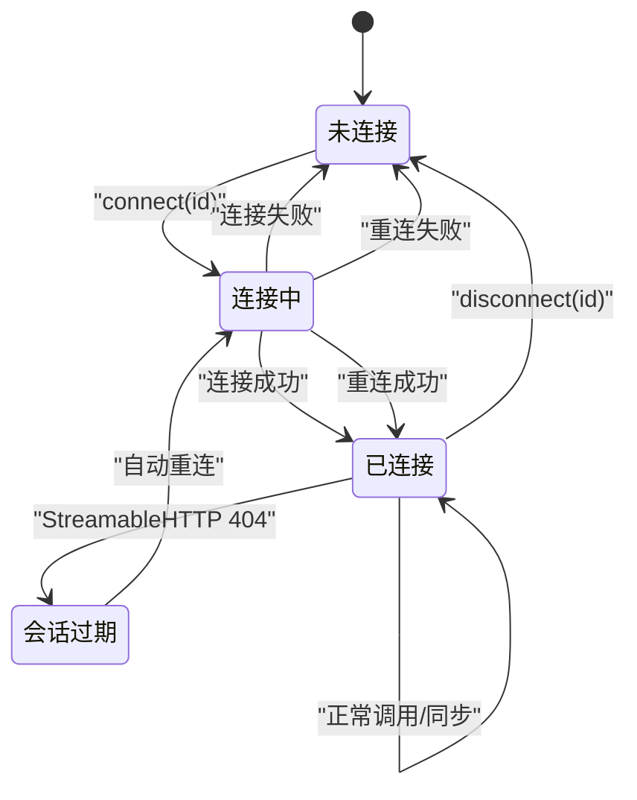
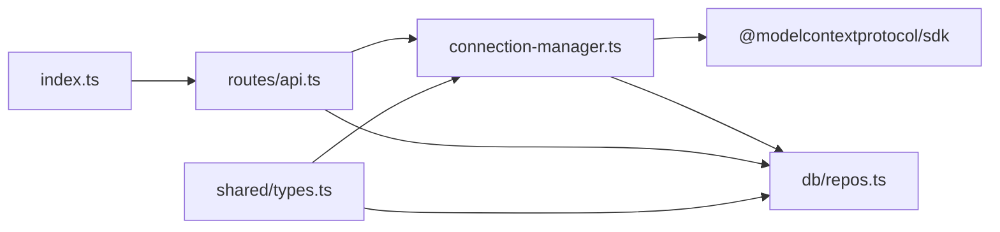

# 连接管理器

<cite>
**本文引用的文件**
- [apps/server/src/mcp/connection-manager.ts](file://apps/server/src/mcp/connection-manager.ts)
- [apps/server/src/routes/api.ts](file://apps/server/src/routes/api.ts)
- [apps/server/src/index.ts](file://apps/server/src/index.ts)
- [apps/server/src/db/repos.ts](file://apps/server/src/db/repos.ts)
- [packages/shared/src/types.ts](file://packages/shared/src/types.ts)
</cite>

## 目录
1. [简介](#简介)
2. [项目结构](#项目结构)
3. [核心组件](#核心组件)
4. [架构总览](#架构总览)
5. [详细组件分析](#详细组件分析)
6. [依赖关系分析](#依赖关系分析)
7. [性能考量](#性能考量)
8. [故障排查指南](#故障排查指南)
9. [结论](#结论)
10. [附录](#附录)

## 简介
本文件聚焦于 MCP（Model Context Protocol）连接管理器的设计与实现，围绕以下目标展开：
- 深入解析 ConnectionManager 单例模式的实现细节
- 梳理 MCP 会话生命周期、自动重连机制与并发控制策略
- 详细说明 Streamable HTTP 与 SSE 两种传输协议的连接建立过程、状态监控与异常处理
- 记录连接池管理、超时配置与资源清理机制
- 提供连接状态转换图、错误恢复策略与性能优化建议

该模块位于服务端应用内，通过 REST API 暴露连接管理与工具调用能力，底层基于 MCP SDK 的客户端封装。

## 项目结构
与连接管理器直接相关的代码组织如下：
- 连接管理器核心逻辑：apps/server/src/mcp/connection-manager.ts
- HTTP 路由层对外暴露接口：apps/server/src/routes/api.ts
- 应用启动入口：apps/server/src/index.ts
- 数据持久化仓库：apps/server/src/db/repos.ts
- 共享类型定义：packages/shared/src/types.ts



图表来源
- [apps/server/src/index.ts:10-33](file://apps/server/src/index.ts#L10-L33)
- [apps/server/src/routes/api.ts:18-38](file://apps/server/src/routes/api.ts#L18-L38)
- [apps/server/src/mcp/connection-manager.ts:39-147](file://apps/server/src/mcp/connection-manager.ts#L39-L147)
- [apps/server/src/db/repos.ts:288-312](file://apps/server/src/db/repos.ts#L288-L312)

章节来源
- [apps/server/src/index.ts:10-33](file://apps/server/src/index.ts#L10-L33)
- [apps/server/src/routes/api.ts:18-38](file://apps/server/src/routes/api.ts#L18-L38)

## 核心组件
- ConnectionManager：单例类，负责 MCP 连接的创建、复用、断开、会话恢复、并发控制、超时控制、结果校验与持久化状态更新。
- API 路由：将连接管理操作映射为 HTTP 接口，如连接/断开、同步工具、调用工具等。
- 仓库 repos：对数据库进行读写，维护连接元信息、工具清单、用例与运行记录。
- 共享类型：统一定义传输类型、运行状态、断言与验证结果等数据结构。

章节来源
- [apps/server/src/mcp/connection-manager.ts:39-383](file://apps/server/src/mcp/connection-manager.ts#L39-L383)
- [apps/server/src/routes/api.ts:40-138](file://apps/server/src/routes/api.ts#L40-L138)
- [apps/server/src/db/repos.ts:288-312](file://apps/server/src/db/repos.ts#L288-L312)
- [packages/shared/src/types.ts:1-229](file://packages/shared/src/types.ts#L1-L229)

## 架构总览
连接管理器作为进程内单例，持有每个连接 ID 对应的“活跃会话”和“串行队列”，在请求到达时按连接维度串行执行，避免同一连接上的并发冲突；同时针对 Streamable HTTP 会话过期场景提供自动重建能力。



图表来源
- [apps/server/src/mcp/connection-manager.ts:19-24](file://apps/server/src/mcp/connection-manager.ts#L19-L24)
- [apps/server/src/mcp/connection-manager.ts:39-383](file://apps/server/src/mcp/connection-manager.ts#L39-L383)

## 详细组件分析

### 单例模式与会话池
- 单例导出：模块末尾以 new ConnectionManager() 形式导出全局实例 connectionManager，供路由与服务层共享。
- 会话池：使用 Map<string, LiveSession> 保存每个连接 ID 对应的活跃会话，包含 Client、Transport、使用的传输类型与连接时间戳。
- 在线查询：提供 isLive 与 liveIds 方法，便于健康检查与列表展示。

章节来源
- [apps/server/src/mcp/connection-manager.ts:39-49](file://apps/server/src/mcp/connection-manager.ts#L39-L49)
- [apps/server/src/mcp/connection-manager.ts:382-383](file://apps/server/src/mcp/connection-manager.ts#L382-L383)

### 并发控制策略（按连接维度的串行队列）
- 设计要点：每个连接 ID 维护一个 Promise 链式队列，确保同一连接的所有操作串行执行，避免并发导致的协议或会话状态不一致。
- 实现方式：withQueue 方法通过 prev.then(() => gate).catch(() => gate) 串联任务，保证前一个任务完成后再进入下一个任务。
- 适用范围：所有对外暴露的连接相关操作（连接、断开、同步工具、调用工具）均包裹在 withQueue 中。



图表来源
- [apps/server/src/mcp/connection-manager.ts:51-67](file://apps/server/src/mcp/connection-manager.ts#L51-L67)

章节来源
- [apps/server/src/mcp/connection-manager.ts:51-67](file://apps/server/src/mcp/connection-manager.ts#L51-L67)

### 传输协议选择与连接建立
- 支持协议：Streamable HTTP 与 SSE。
- 选择策略：根据配置的 transport 字段决定尝试顺序；若为 auto，则优先尝试 Streamable HTTP，失败后回退到 SSE。
- 构建流程：
  - 读取连接配置（URL、Headers、超时等）
  - 根据 kind 创建对应 Transport 实例
  - 调用 client.connect(transport) 建立会话
  - 记录连接时间与服务器信息（版本、能力），并持久化状态

```mermaid
sequenceDiagram
participant API as "API 路由"
participant CM as "ConnectionManager"
participant Repo as "数据库仓库"
participant SDK as "MCP SDK Client"
participant Trans as "Transport(StreamableHTTP/SSE)"
participant Server as "MCP 服务器"
API->>CM : connect(id)
CM->>Repo : getConnection(id)
Repo-->>CM : 连接配置
alt 已存在活跃会话
CM->>CM : disconnect(id)
end
loop 按优先级尝试传输
CM->>CM : connectWithTransport(kind)
CM->>Trans : 初始化 Transport
CM->>SDK : connect(transport)
SDK->>Server : 握手/协商
Server-->>SDK : 成功
CM->>Repo : markConnectionStatus(成功)
CM-->>API : 返回连接详情
else 全部失败
CM->>Repo : markConnectionStatus(失败)
CM-->>API : 抛出错误
end
```

图表来源
- [apps/server/src/mcp/connection-manager.ts:75-147](file://apps/server/src/mcp/connection-manager.ts#L75-L147)
- [apps/server/src/db/repos.ts:288-312](file://apps/server/src/db/repos.ts#L288-L312)

章节来源
- [apps/server/src/mcp/connection-manager.ts:75-147](file://apps/server/src/mcp/connection-manager.ts#L75-L147)
- [apps/server/src/routes/api.ts:77-85](file://apps/server/src/routes/api.ts#L77-L85)

### 自动重连与会话恢复（Streamable HTTP 404 场景）
- 触发条件：当使用 Streamable HTTP 且出现特定错误（携带 sessionId 且错误码为 404）时，判定为远端会话已失效。
- 恢复流程：
  - 丢弃旧会话并关闭本地客户端
  - 重新发起连接（遵循相同传输优先级）
  - 重试原操作，若再次失败则标记不可用并向上抛出错误
- 日志事件：记录恢复开始、成功与失败的 JSON 事件，便于观测与排障。



图表来源
- [apps/server/src/mcp/connection-manager.ts:175-268](file://apps/server/src/mcp/connection-manager.ts#L175-L268)

章节来源
- [apps/server/src/mcp/connection-manager.ts:175-268](file://apps/server/src/mcp/connection-manager.ts#L175-L268)

### 工具同步与调用
- 工具同步：
  - 通过 listTools 分页拉取工具清单，去重替换存储
  - 受 withQueue 保护，保证同一连接的工具同步串行
- 工具调用：
  - 从仓库加载工具输出 Schema，结合运行时结构化内容做 Schema 校验
  - 使用 AbortController 与 Promise.race 实现超时控制
  - 统一包装为 CallToolResult，包含耗时、状态、内容、校验结果与原始响应



图表来源
- [apps/server/src/mcp/connection-manager.ts:270-379](file://apps/server/src/mcp/connection-manager.ts#L270-L379)
- [apps/server/src/routes/api.ts:94-138](file://apps/server/src/routes/api.ts#L94-L138)

章节来源
- [apps/server/src/mcp/connection-manager.ts:270-379](file://apps/server/src/mcp/connection-manager.ts#L270-L379)
- [apps/server/src/routes/api.ts:94-138](file://apps/server/src/routes/api.ts#L94-L138)

### 连接断开与资源清理
- 断开流程：
  - 若 Transport 支持 terminateSession，先终止远端会话
  - 关闭本地客户端
  - 忽略关闭过程中的异常，确保幂等性
- 适用场景：显式断开、连接切换、进程退出前的资源回收

章节来源
- [apps/server/src/mcp/connection-manager.ts:149-164](file://apps/server/src/mcp/connection-manager.ts#L149-L164)

### 连接状态监控与持久化
- 状态字段：lastConnectedAt、lastError、serverInfo（版本、能力等）
- 更新时机：
  - 连接成功：写入 lastConnectedAt、清空 lastError、记录 serverInfo
  - 连接失败：清空 lastConnectedAt、记录 lastError
  - 会话不可用：标记 lastConnectedAt 为空、记录错误详情
- 对外可见：API 列表与健康检查会返回 live 标志与最近连接时间/错误

章节来源
- [apps/server/src/mcp/connection-manager.ts:130-146](file://apps/server/src/mcp/connection-manager.ts#L130-L146)
- [apps/server/src/mcp/connection-manager.ts:197-207](file://apps/server/src/mcp/connection-manager.ts#L197-L207)
- [apps/server/src/routes/api.ts:32-38](file://apps/server/src/routes/api.ts#L32-L38)
- [apps/server/src/db/repos.ts:288-312](file://apps/server/src/db/repos.ts#L288-L312)

### 连接状态转换图


图表来源
- [apps/server/src/mcp/connection-manager.ts:101-147](file://apps/server/src/mcp/connection-manager.ts#L101-L147)
- [apps/server/src/mcp/connection-manager.ts:175-268](file://apps/server/src/mcp/connection-manager.ts#L175-L268)
- [apps/server/src/mcp/connection-manager.ts:149-164](file://apps/server/src/mcp/connection-manager.ts#L149-L164)

## 依赖关系分析
- 外部依赖：
  - @modelcontextprotocol/sdk：提供 Client、StreamableHTTPClientTransport、SSEClientTransport 等
  - Hono：HTTP 框架
  - Drizzle ORM：数据库访问
- 内部依赖：
  - 仓库 repos：连接元数据、工具、用例、运行记录的 CRUD
  - 共享 types：传输类型、运行状态、断言与校验结果等



图表来源
- [apps/server/src/mcp/connection-manager.ts:1-17](file://apps/server/src/mcp/connection-manager.ts#L1-L17)
- [apps/server/src/routes/api.ts:1-16](file://apps/server/src/routes/api.ts#L1-L16)
- [apps/server/src/index.ts:1-6](file://apps/server/src/index.ts#L1-L6)
- [packages/shared/src/types.ts:1-20](file://packages/shared/src/types.ts#L1-L20)

章节来源
- [apps/server/src/mcp/connection-manager.ts:1-17](file://apps/server/src/mcp/connection-manager.ts#L1-L17)
- [apps/server/src/routes/api.ts:1-16](file://apps/server/src/routes/api.ts#L1-L16)
- [apps/server/src/index.ts:1-6](file://apps/server/src/index.ts#L1-L6)
- [packages/shared/src/types.ts:1-20](file://packages/shared/src/types.ts#L1-L20)

## 性能考量
- 并发控制：
  - 按连接维度串行化，避免协议级竞争与状态不一致
  - 代价是吞吐受限，适合多连接并行、单连接串行的工作负载
- 超时控制：
  - 默认 60 秒，可通过连接配置或调用参数覆盖
  - 使用 AbortController 与 Promise.race 快速释放资源
- 会话恢复：
  - 仅针对 Streamable HTTP 的 404 场景自动重建，减少人工干预
  - 恢复失败会立即标记不可用，避免无效重试
- 工具同步：
  - 全量替换策略，简单可靠但可能带来额外 IO
  - 建议在低频场景使用，或在 UI 侧增加缓存与增量对比
- 资源清理：
  - 断开时尽量调用 terminateSession 再关闭客户端，降低远端资源占用
  - 关闭过程异常被吞掉，确保幂等性与健壮性

[本节为通用指导，不直接分析具体文件]

## 故障排查指南
- 连接失败
  - 检查 URL、Headers、传输类型配置是否正确
  - 查看 lastError 与 lastConnectedAt 字段定位最近一次失败原因
  - 确认网络可达性与认证头是否生效
- 会话过期（Streamable HTTP 404）
  - 观察恢复日志事件：mcp_session_recovery_started/succeeded/failed
  - 若反复失败，检查远端服务是否重启或会话保持策略变更
- 超时问题
  - 调整 timeoutMs 或调用时的 options.timeoutMs
  - 关注 protocolError.code 是否为 TIMEOUT
- 工具调用异常
  - 检查 outputSchema 是否存在以及结构化内容是否符合
  - 查看 schemaValidation 与 assertResult 定位断言失败原因
- 资源泄漏
  - 确认 disconnect 是否被正确调用
  - 在进程退出前主动断开所有活跃连接

章节来源
- [apps/server/src/mcp/connection-manager.ts:130-146](file://apps/server/src/mcp/connection-manager.ts#L130-L146)
- [apps/server/src/mcp/connection-manager.ts:197-207](file://apps/server/src/mcp/connection-manager.ts#L197-L207)
- [apps/server/src/mcp/connection-manager.ts:219-266](file://apps/server/src/mcp/connection-manager.ts#L219-L266)
- [apps/server/src/mcp/connection-manager.ts:355-377](file://apps/server/src/mcp/connection-manager.ts#L355-L377)

## 结论
连接管理器以单例形态集中管理 MCP 会话，采用按连接维度的串行队列保障一致性，并通过自动重连与超时控制提升鲁棒性。配合 API 层与仓库层，形成完整的连接生命周期管理能力。对于高并发场景，建议通过多连接并行与合理的超时/重试策略平衡稳定性与吞吐。

[本节为总结性内容，不直接分析具体文件]

## 附录

### API 概览（与连接管理相关）
- GET /api/health：返回服务健康信息与活跃连接数
- POST /api/connections/:id/connect：建立连接
- POST /api/connections/:id/disconnect：断开连接
- POST /api/connections/:id/sync-tools：同步工具清单
- POST /api/connections/:id/tools/:toolName/invoke：调用工具

章节来源
- [apps/server/src/routes/api.ts:32-38](file://apps/server/src/routes/api.ts#L32-L38)
- [apps/server/src/routes/api.ts:77-138](file://apps/server/src/routes/api.ts#L77-L138)

### 关键类型速览
- TransportType：streamable_http | sse | auto
- RunStatus：success | tool_error | protocol_error | timeout | cancelled
- McpConnection：连接元信息（含 headerNames、timeoutMs、serverInfo、live 等）
- InvokeResponse：工具调用响应（含 runId、status、content、schemaValidation 等）

章节来源
- [packages/shared/src/types.ts:1-229](file://packages/shared/src/types.ts#L1-L229)