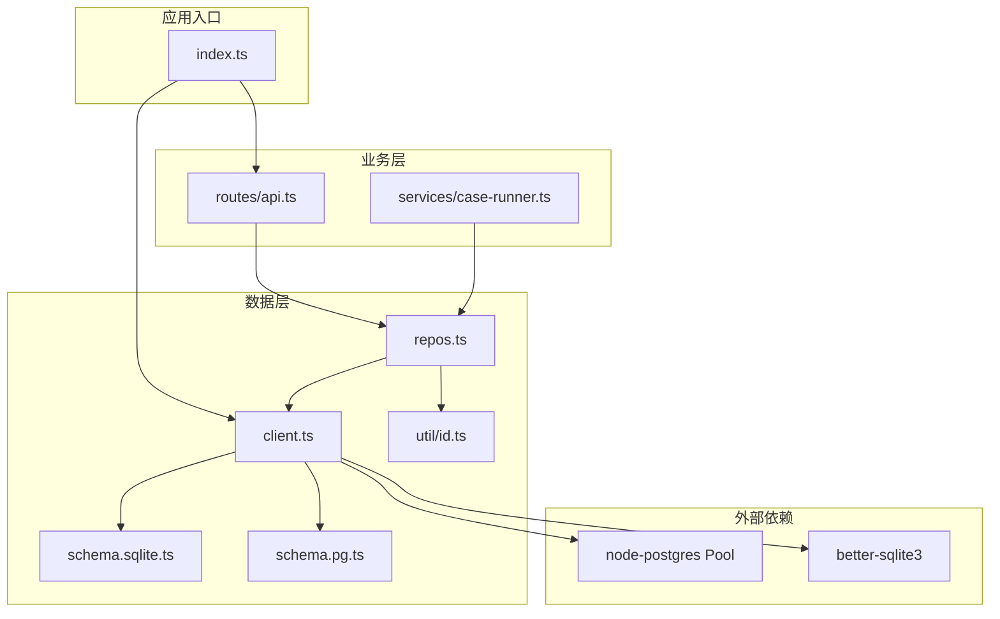
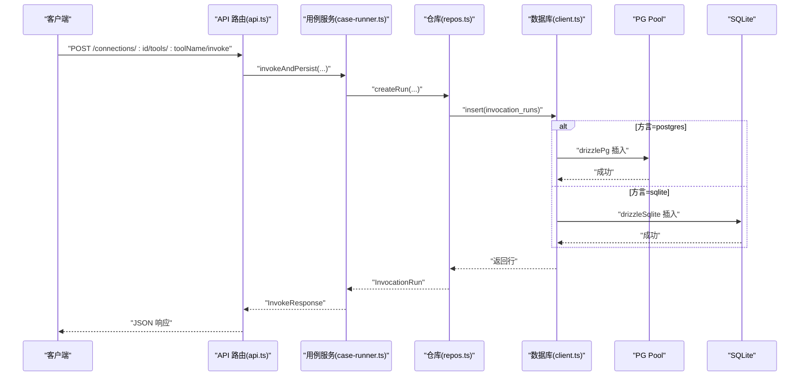
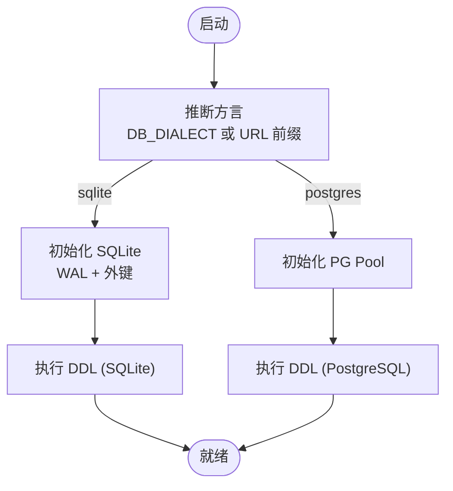
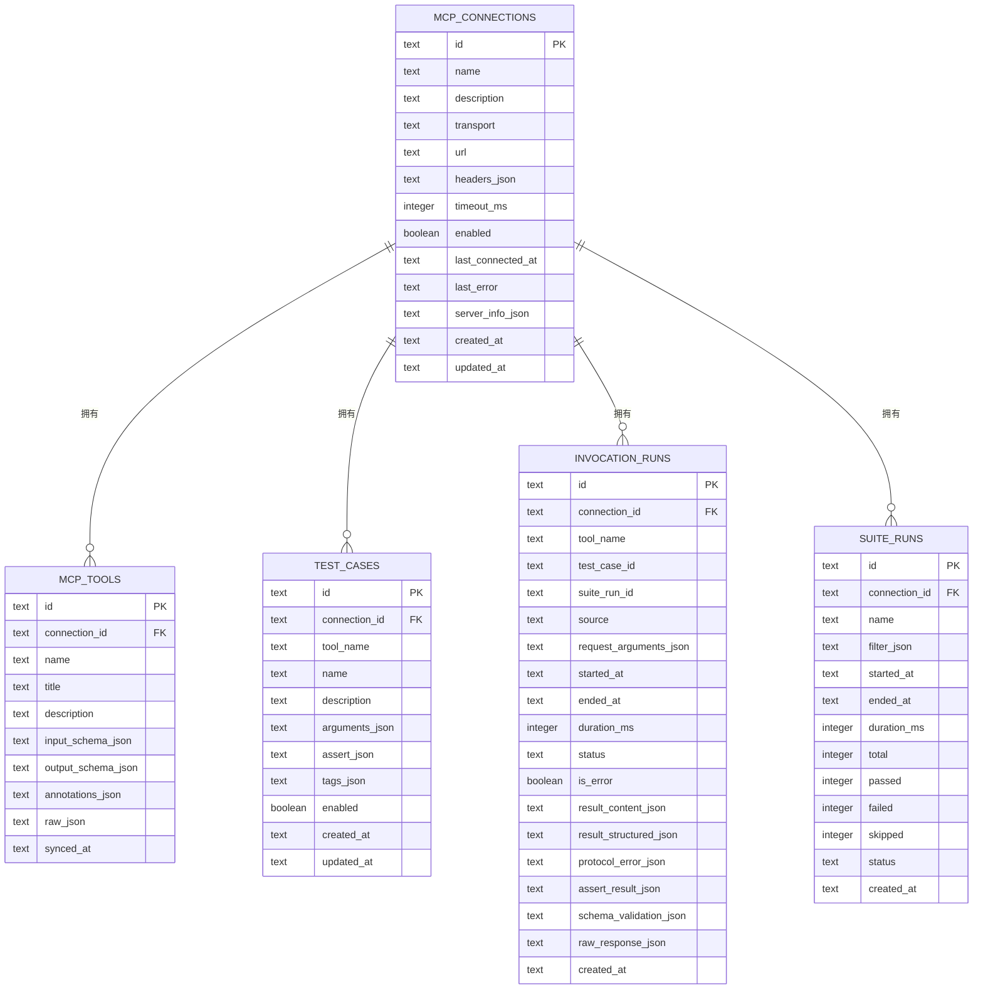
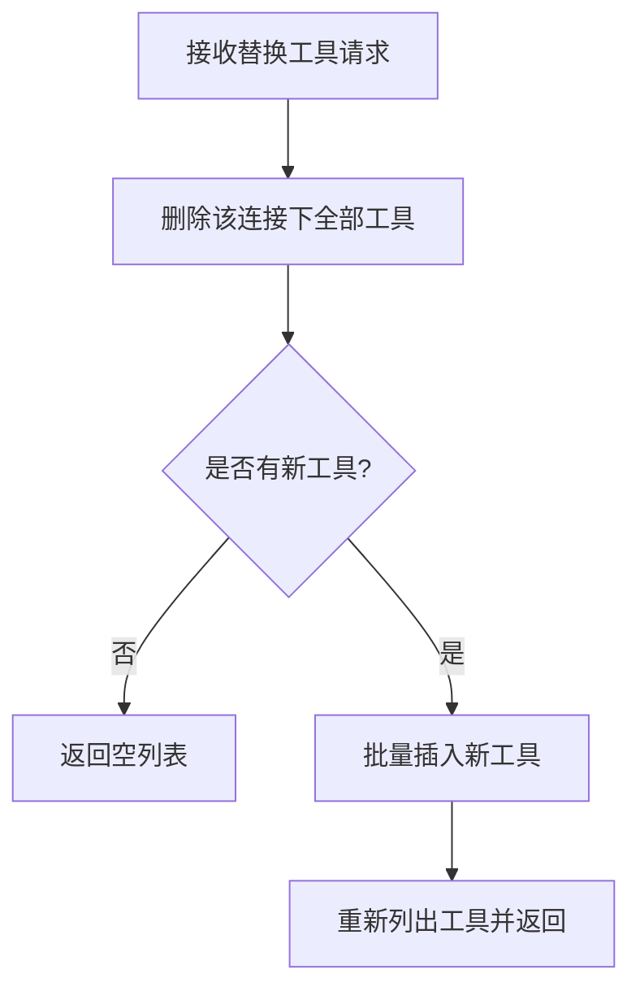
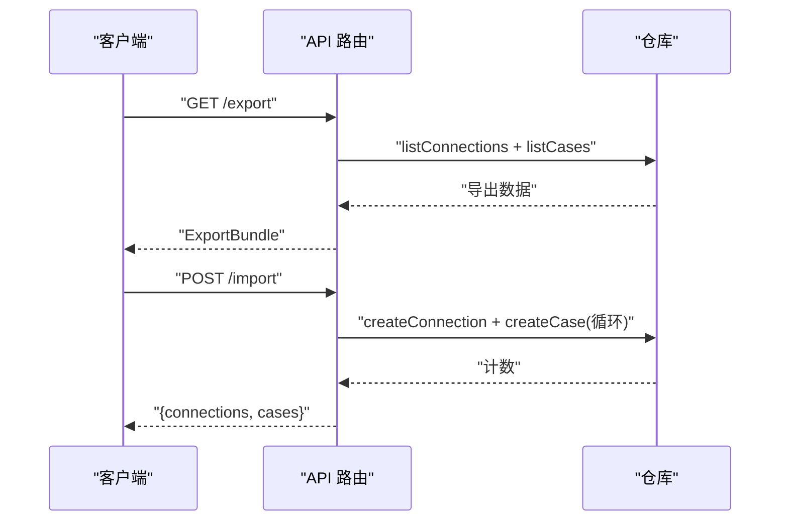
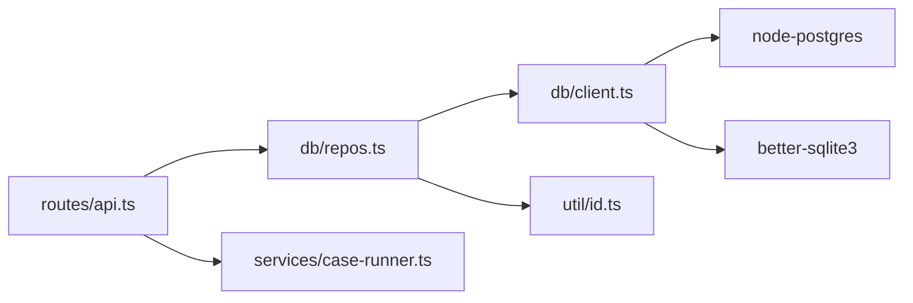

# 数据层架构

<cite>
**本文引用的文件**   
- [apps/server/src/db/client.ts](file://apps/server/src/db/client.ts)
- [apps/server/src/db/schema.sqlite.ts](file://apps/server/src/db/schema.sqlite.ts)
- [apps/server/src/db/schema.pg.ts](file://apps/server/src/db/schema.pg.ts)
- [apps/server/src/db/repos.ts](file://apps/server/src/db/repos.ts)
- [apps/server/src/util/id.ts](file://apps/server/src/util/id.ts)
- [packages/shared/src/types.ts](file://packages/shared/src/types.ts)
- [apps/server/src/routes/api.ts](file://apps/server/src/routes/api.ts)
- [apps/server/src/services/case-runner.ts](file://apps/server/src/services/case-runner.ts)
- [apps/server/src/index.ts](file://apps/server/src/index.ts)
</cite>

## 目录
1. [简介](#简介)
2. [项目结构](#项目结构)
3. [核心组件](#核心组件)
4. [架构总览](#架构总览)
5. [详细组件分析](#详细组件分析)
6. [依赖关系分析](#依赖关系分析)
7. [性能考量](#性能考量)
8. [故障排查指南](#故障排查指南)
9. [结论](#结论)
10. [附录](#附录)

## 简介
本文件系统化梳理基于 Drizzle ORM 的数据访问层设计，覆盖 SQLite 与 PostgreSQL 双数据库适配、连接池管理、自动迁移、事务策略、仓库模式（Repository Pattern）、CRUD 封装、查询构建器使用、批量操作优化、Schema 双环境适配与字段映射、数据类型转换、一致性保证、索引优化策略以及备份恢复机制。文档面向不同技术背景的读者，提供从高层到代码级的渐进式说明与可视化图示。

## 项目结构
数据层相关代码集中在 apps/server/src/db 目录，配合共享类型定义 packages/shared/src/types.ts 与服务/路由层进行交互。整体组织方式采用“按领域分层 + 按方言拆分 Schema”的混合模式：
- client.ts：驱动选择、连接池/单例、方言推断、DDL 迁移入口
- schema.sqlite.ts / schema.pg.ts：SQLite 与 PostgreSQL 两套 Drizzle Schema 定义
- repos.ts：仓库层实现，统一 CRUD、查询构建、JSON 序列化/反序列化、映射函数
- util/id.ts：ID 生成、时间戳、安全 JSON 解析等工具
- routes/api.ts：HTTP 接口，调用仓库层
- services/case-runner.ts：用例执行与套件编排，持久化运行记录
- index.ts：应用启动，触发迁移并挂载路由

图表来源
- [apps/server/src/index.ts:1-39](file://apps/server/src/index.ts#L1-L39)
- [apps/server/src/db/client.ts:1-267](file://apps/server/src/db/client.ts#L1-L267)
- [apps/server/src/db/schema.sqlite.ts:1-120](file://apps/server/src/db/schema.sqlite.ts#L1-L120)
- [apps/server/src/db/schema.pg.ts:1-127](file://apps/server/src/db/schema.pg.ts#L1-L127)
- [apps/server/src/db/repos.ts:1-660](file://apps/server/src/db/repos.ts#L1-L660)
- [apps/server/src/util/id.ts:1-23](file://apps/server/src/util/id.ts#L1-L23)
- [apps/server/src/routes/api.ts:1-277](file://apps/server/src/routes/api.ts#L1-L277)
- [apps/server/src/services/case-runner.ts:1-161](file://apps/server/src/services/case-runner.ts#L1-L161)

章节来源
- [apps/server/src/index.ts:1-39](file://apps/server/src/index.ts#L1-L39)
- [apps/server/src/db/client.ts:1-267](file://apps/server/src/db/client.ts#L1-L267)
- [apps/server/src/db/repos.ts:1-660](file://apps/server/src/db/repos.ts#L1-L660)
- [apps/server/src/routes/api.ts:1-277](file://apps/server/src/routes/api.ts#L1-L277)
- [apps/server/src/services/case-runner.ts:1-161](file://apps/server/src/services/case-runner.ts#L1-L161)
- [packages/shared/src/types.ts:1-229](file://packages/shared/src/types.ts#L1-L229)

## 核心组件
- 驱动与连接管理
  - 通过环境变量或 URL 前缀推断方言（sqlite/postgres）
  - SQLite：使用 better-sqlite3 单例客户端，启用 WAL 与外键约束
  - PostgreSQL：使用 node-postgres 连接池，Drizzle 包装为 drizzlePg
  - getDb() 根据方言返回对应实例
- 自动迁移
  - migrate() 在进程启动时执行，分别对 SQLite 与 PostgreSQL 执行 DDL
  - SQLite 直接 exec 建表语句；PostgreSQL 通过 pool.query 执行
- 仓库层（Repository）
  - 暴露连接、工具、用例、运行记录、套件运行的完整 CRUD
  - 内部维护 mapConnection/mapTool/mapCase/mapRun/mapSuite 等映射函数
  - 统一 JSON 字段序列化/反序列化，屏蔽底层存储格式差异
- 工具函数
  - newId()/nowIso()/safeJsonParse()/jsonStringify() 保障 ID 与时序一致性与健壮性

章节来源
- [apps/server/src/db/client.ts:1-267](file://apps/server/src/db/client.ts#L1-L267)
- [apps/server/src/db/repos.ts:1-660](file://apps/server/src/db/repos.ts#L1-L660)
- [apps/server/src/util/id.ts:1-23](file://apps/server/src/util/id.ts#L1-L23)

## 架构总览
下图展示从 HTTP 请求到数据库写入的端到端流程，体现仓库模式与双方言适配。

图表来源
- [apps/server/src/routes/api.ts:117-138](file://apps/server/src/routes/api.ts#L117-L138)
- [apps/server/src/services/case-runner.ts:11-77](file://apps/server/src/services/case-runner.ts#L11-L77)
- [apps/server/src/db/repos.ts:476-528](file://apps/server/src/db/repos.ts#L476-L528)
- [apps/server/src/db/client.ts:55-65](file://apps/server/src/db/client.ts#L55-L65)

## 详细组件分析

### 驱动与连接管理（client.ts）
- 方言推断
  - 优先读取环境变量 DB_DIALECT，否则根据 DATABASE_URL 前缀判断
- SQLite 初始化
  - 解析 file: 或相对路径，确保目录存在
  - 设置 journal_mode=WAL 与 foreign_keys=ON
  - 以单例形式缓存 drizzleSqlite 实例
- PostgreSQL 初始化
  - 使用 node-postgres Pool 创建连接池
  - 以单例形式缓存 drizzlePg 实例
- 迁移
  - 启动阶段调用 migrate()，分别执行内置 DDL
  - SQLite 使用原生 Database.exec；PostgreSQL 使用 pool.query
- 导出
  - 暴露 sqliteSchema/pgSchema 供仓库层选择

图表来源
- [apps/server/src/db/client.ts:17-37](file://apps/server/src/db/client.ts#L17-L37)
- [apps/server/src/db/client.ts:43-65](file://apps/server/src/db/client.ts#L43-L65)
- [apps/server/src/db/client.ts:247-266](file://apps/server/src/db/client.ts#L247-L266)

章节来源
- [apps/server/src/db/client.ts:1-267](file://apps/server/src/db/client.ts#L1-L267)

### Schema 定义与双环境适配（schema.sqlite.ts / schema.pg.ts）
- 表结构
  - mcp_connections：连接配置
  - mcp_tools：工具元数据（含唯一索引 connection_id+name）
  - test_cases：测试用例
  - suite_runs：套件运行统计
  - invocation_runs：单次调用运行记录
- 字段映射与类型
  - 布尔字段：SQLite 使用 integer(mode="boolean")，PostgreSQL 使用 boolean
  - JSON 字段：统一使用 text 列存储 JSON 字符串，由仓库层负责序列化/反序列化
- 索引策略
  - 常用查询组合键索引：connection_id+tool_name
  - 时间维度索引：started_at
  - 套件关联索引：suite_run_id
- 外键与级联
  - 删除连接时级联删除工具与运行记录；套件记录置空

图表来源
- [apps/server/src/db/schema.sqlite.ts:1-120](file://apps/server/src/db/schema.sqlite.ts#L1-L120)
- [apps/server/src/db/schema.pg.ts:1-127](file://apps/server/src/db/schema.pg.ts#L1-L127)

章节来源
- [apps/server/src/db/schema.sqlite.ts:1-120](file://apps/server/src/db/schema.sqlite.ts#L1-L120)
- [apps/server/src/db/schema.pg.ts:1-127](file://apps/server/src/db/schema.pg.ts#L1-L127)

### 仓库模式（repos.ts）
- 抽象与职责
  - 对外暴露统一的仓储接口，屏蔽方言差异
  - 内部通过 tables() 动态选择 sqliteSchema 或 pgSchema
  - 所有 JSON 字段通过 jsonStringify/safeJsonParse 进行读写转换
- 连接管理仓储
  - listConnections/getConnection/createConnection/updateConnection/deleteConnection/markConnectionStatus
  - 支持将运行时 live 状态注入结果集
- 工具仓储
  - replaceTools：先删后插，批量同步工具元数据
  - listTools/getTool：支持名称/标题/描述模糊过滤（内存过滤）
- 用例仓储
  - createCase/updateCase/deleteCase/listCases/getCase
  - listCasesByFilter：支持按工具名、用例 ID、标签筛选，仅返回启用的用例
- 运行记录仓储
  - createRun/listRuns/getRun/deleteRun：支持多条件过滤与分页限制
- 套件运行仓储
  - createSuiteRun/updateSuiteRun/getSuiteRun/listSuiteRuns

```mermaid
classDiagram
class Repos {
+listConnections(liveIds)
+getConnection(id, live)
+createConnection(input)
+updateConnection(id, input)
+deleteConnection(id)
+markConnectionStatus(id, data)
+replaceTools(connectionId, tools)
+listTools(connectionId, q)
+getTool(connectionId, toolName)
+listCases(connectionId, toolName)
+getCase(id)
+createCase(connectionId, toolName, input)
+updateCase(id, input)
+deleteCase(id)
+createRun(input)
+listRuns(filter)
+getRun(id)
+deleteRun(id)
+createSuiteRun(input)
+updateSuiteRun(id, patch)
+getSuiteRun(id)
+listSuiteRuns(connectionId)
+listCasesByFilter(filter)
}
class Tables {
<<select dialect>>
}
class Utils {
+newId()
+nowIso()
+safeJsonParse(raw, fallback)
+jsonStringify(value)
}
Repos --> Tables : "tables()"
Repos --> Utils : "序列化/ID/时间"
```

图表来源
- [apps/server/src/db/repos.ts:1-660](file://apps/server/src/db/repos.ts#L1-L660)
- [apps/server/src/util/id.ts:1-23](file://apps/server/src/util/id.ts#L1-L23)

章节来源
- [apps/server/src/db/repos.ts:1-660](file://apps/server/src/db/repos.ts#L1-L660)

### 查询构建器与批量操作
- 查询构建
  - 使用 eq/and/desc 等构建条件与排序
  - 列表查询默认按更新时间或开始时间倒序，带 limit 保护
- 批量操作
  - replaceTools：先 delete 再 insert.values 批量写入，避免逐条更新开销
  - 套件运行：并行执行用例，但每次写入仍为单条 insert，适合高并发写场景

图表来源
- [apps/server/src/db/repos.ts:314-349](file://apps/server/src/db/repos.ts#L314-L349)

章节来源
- [apps/server/src/db/repos.ts:314-349](file://apps/server/src/db/repos.ts#L314-L349)

### 事务处理策略
- 当前实现未显式使用事务包裹跨表写入
- 关键路径
  - invokeAndPersist：调用远端工具后，仅写入 invocation_runs 一条记录
  - runSuite：先创建套件记录，随后并行执行用例写入，最后更新套件汇总
- 建议
  - 若未来需要“创建套件 + 批量写入用例 + 更新汇总”原子性，可在仓库层引入事务封装（如 drizzle 的事务 API），确保失败回滚

章节来源
- [apps/server/src/services/case-runner.ts:111-161](file://apps/server/src/services/case-runner.ts#L111-L161)
- [apps/server/src/db/repos.ts:572-638](file://apps/server/src/db/repos.ts#L572-L638)

### 数据一致性保证
- 主键与唯一约束
  - 各表均定义主键；mcp_tools 在 connection_id+name 上建立唯一索引，防止重复
- 外键与级联
  - 删除连接时级联删除工具与运行记录；套件记录置空，保持引用完整性
- 时间戳与顺序
  - 使用 ISO 时间字符串，便于排序与审计
- JSON 字段容错
  - safeJsonParse 提供默认值，避免脏数据导致崩溃

章节来源
- [apps/server/src/db/schema.sqlite.ts:1-120](file://apps/server/src/db/schema.sqlite.ts#L1-L120)
- [apps/server/src/db/schema.pg.ts:1-127](file://apps/server/src/db/schema.pg.ts#L1-L127)
- [apps/server/src/util/id.ts:11-18](file://apps/server/src/util/id.ts#L11-L18)

### 索引优化策略
- 高频查询组合键
  - mcp_tools：connection_id+name（唯一）
  - test_cases：connection_id+tool_name
  - invocation_runs：connection_id+tool_name、started_at、suite_run_id
- 效果
  - 加速按连接维度的工具/用例/运行记录检索
  - 加速按时间范围与套件维度的运行记录查询

章节来源
- [apps/server/src/db/schema.sqlite.ts:35-111](file://apps/server/src/db/schema.sqlite.ts#L35-L111)
- [apps/server/src/db/schema.pg.ts:42-118](file://apps/server/src/db/schema.pg.ts#L42-L118)

### 备份与恢复机制
- 导出（Export）
  - GET /export：拉取连接与用例，组装为 ExportBundle 返回
- 导入（Import）
  - POST /import：遍历 connections 与 cases，逐个创建
- 注意
  - 当前导入未使用事务，建议在后续版本中引入事务以提升一致性

图表来源
- [apps/server/src/routes/api.ts:227-271](file://apps/server/src/routes/api.ts#L227-L271)
- [apps/server/src/db/repos.ts:211-286](file://apps/server/src/db/repos.ts#L211-L286)
- [apps/server/src/db/repos.ts:424-474](file://apps/server/src/db/repos.ts#L424-L474)

章节来源
- [apps/server/src/routes/api.ts:227-271](file://apps/server/src/routes/api.ts#L227-L271)

## 依赖关系分析
- 模块耦合
  - routes/api.ts 依赖 repos.ts 与 case-runner.ts
  - repos.ts 依赖 client.ts（获取 db 实例与 schema）、util/id.ts（工具）
  - client.ts 依赖 better-sqlite3 与 node-postgres
- 潜在环依赖
  - 当前无循环依赖迹象
- 外部依赖
  - Drizzle ORM（sqlite-core/pg-core）
  - better-sqlite3（SQLite 驱动）
  - node-postgres（PostgreSQL 驱动）

图表来源
- [apps/server/src/routes/api.ts:1-277](file://apps/server/src/routes/api.ts#L1-L277)
- [apps/server/src/db/repos.ts:1-660](file://apps/server/src/db/repos.ts#L1-L660)
- [apps/server/src/db/client.ts:1-267](file://apps/server/src/db/client.ts#L1-L267)

章节来源
- [apps/server/src/routes/api.ts:1-277](file://apps/server/src/routes/api.ts#L1-L277)
- [apps/server/src/db/repos.ts:1-660](file://apps/server/src/db/repos.ts#L1-L660)
- [apps/server/src/db/client.ts:1-267](file://apps/server/src/db/client.ts#L1-L267)

## 性能考量
- 连接池
  - PostgreSQL 使用连接池，提升并发能力；SQLite 使用单例连接，适合单机轻量场景
- 索引
  - 针对高频查询路径建立复合索引与时间索引，减少全表扫描
- 批量写入
  - replaceTools 采用先删后批量插入，降低 N 次更新的开销
- 并行执行
  - 套件运行通过 mapPool 控制并发度，避免过多并发造成数据库压力
- JSON 序列化
  - 大量 JSON 字段读写带来一定 CPU 开销，建议对热点字段考虑结构化存储或物化视图（视业务而定）

[本节为通用指导，不直接分析具体文件]

## 故障排查指南
- 启动失败
  - 检查 DATABASE_URL 与 DB_DIALECT 配置是否正确
  - 确认 SQLite 文件路径可写、PostgreSQL 连接信息有效
- 迁移问题
  - 查看 migrate() 是否抛出异常；PostgreSQL 需确保用户具备建表权限
- 查询缓慢
  - 检查是否存在缺失索引；关注 connection_id、tool_name、started_at 等字段
- JSON 解析错误
  - 确认 safeJsonParse 的默认值逻辑；必要时增加日志定位脏数据
- 导入不一致
  - 导入接口尚未使用事务，若中途失败可能导致部分数据写入；建议后续引入事务包裹

章节来源
- [apps/server/src/db/client.ts:247-266](file://apps/server/src/db/client.ts#L247-L266)
- [apps/server/src/util/id.ts:11-18](file://apps/server/src/util/id.ts#L11-L18)
- [apps/server/src/routes/api.ts:242-271](file://apps/server/src/routes/api.ts#L242-L271)

## 结论
本项目数据层以 Drizzle ORM 为核心，结合 SQLite 与 PostgreSQL 的双方言适配，实现了清晰的仓库模式与稳定的迁移机制。通过合理的索引设计与批量操作优化，兼顾了开发效率与运行性能。后续可在事务封装、导入导出一致性、监控与审计方面进一步增强，以满足更严格的可靠性要求。

## 附录

### 公共类型与数据模型
- 共享类型定义位于 packages/shared/src/types.ts，涵盖连接、工具、用例、运行记录、套件等数据结构
- 仓库层输出对象与共享类型保持一致，确保 API 契约稳定

章节来源
- [packages/shared/src/types.ts:1-229](file://packages/shared/src/types.ts#L1-L229)