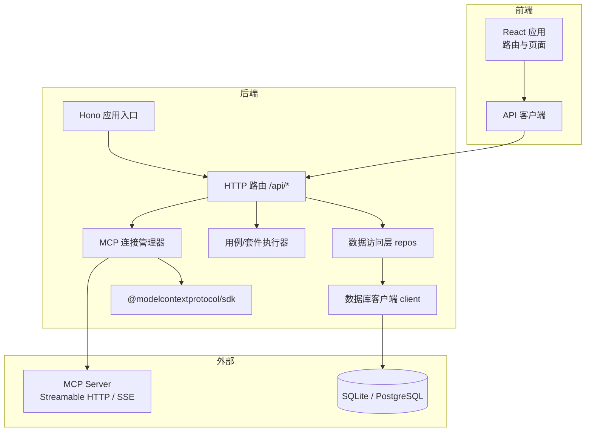
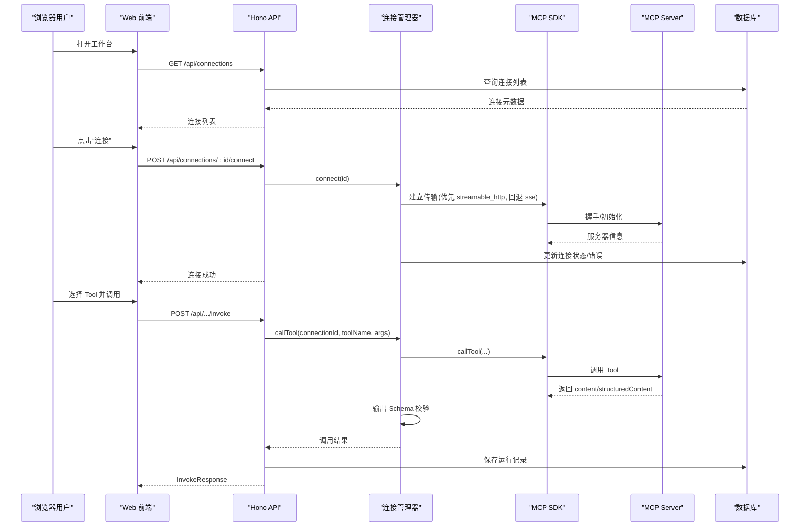
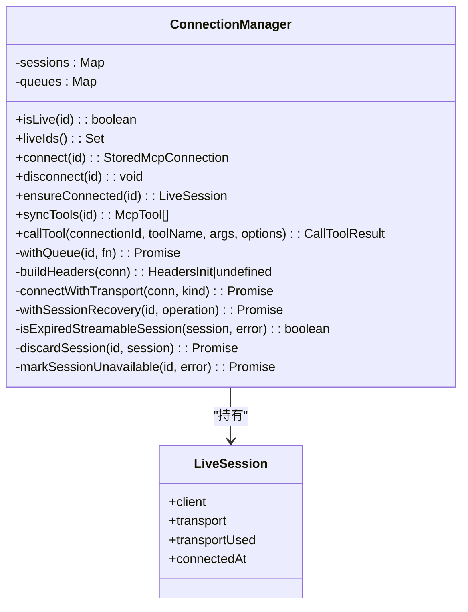
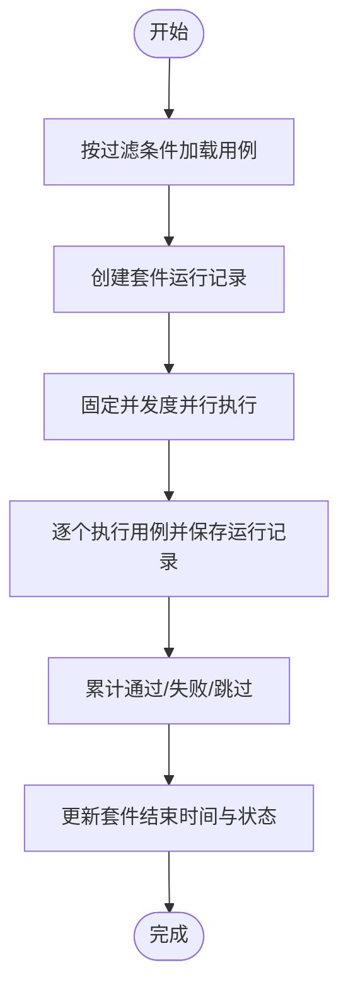
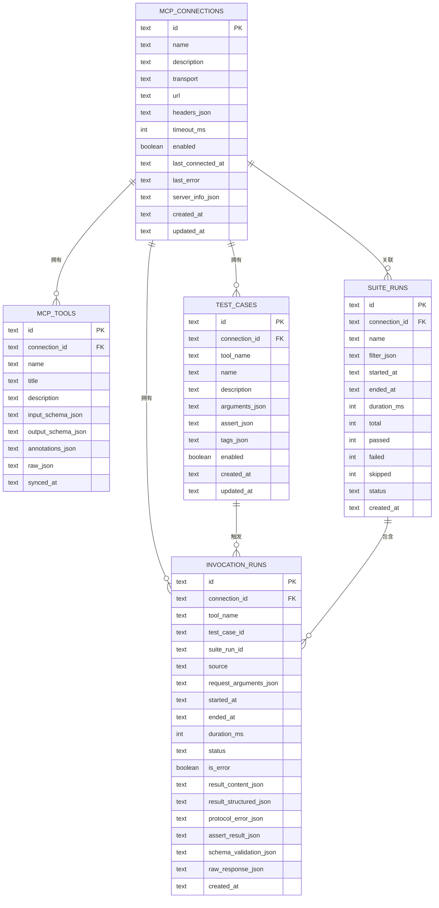
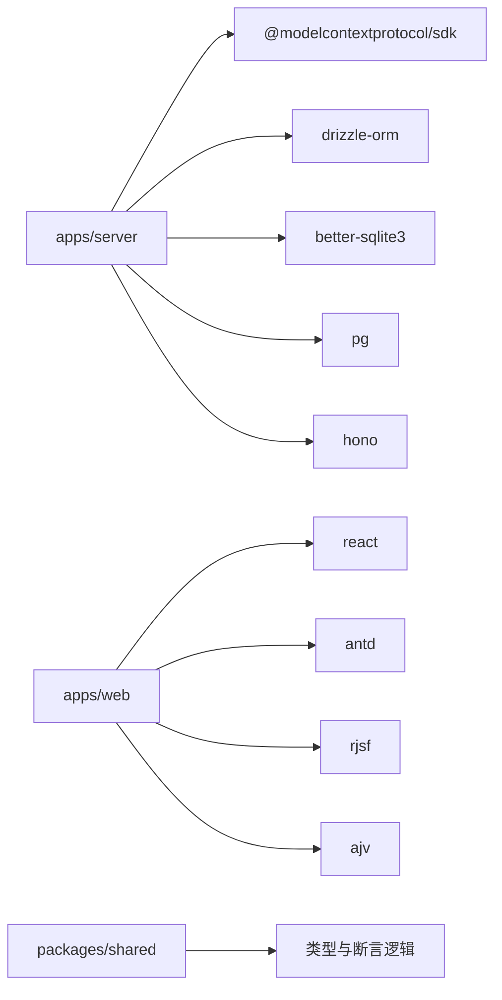
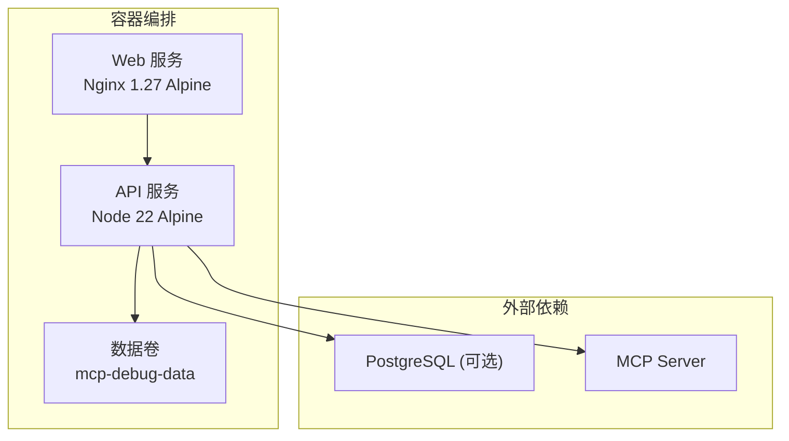

# 系统架构

<cite>
**本文引用的文件**   
- [README.md](file://README.md)
- [package.json](file://package.json)
- [apps/server/src/index.ts](file://apps/server/src/index.ts)
- [apps/server/src/routes/api.ts](file://apps/server/src/routes/api.ts)
- [apps/server/src/mcp/connection-manager.ts](file://apps/server/src/mcp/connection-manager.ts)
- [apps/server/src/services/case-runner.ts](file://apps/server/src/services/case-runner.ts)
- [apps/server/src/db/client.ts](file://apps/server/src/db/client.ts)
- [apps/server/src/db/repos.ts](file://apps/server/src/db/repos.ts)
- [packages/shared/src/types.ts](file://packages/shared/src/types.ts)
- [apps/web/src/App.tsx](file://apps/web/src/App.tsx)
- [apps/web/src/api/client.ts](file://apps/web/src/api/client.ts)
- [deployment/docker-compose.yaml](file://deployment/docker-compose.yaml)
- [deployment/Dockerfile](file://deployment/Dockerfile)
- [SECURITY.md](file://SECURITY.md)
</cite>

## 目录
1. [简介](#简介)
2. [项目结构](#项目结构)
3. [核心组件](#核心组件)
4. [架构总览](#架构总览)
5. [详细组件分析](#详细组件分析)
6. [依赖关系分析](#依赖关系分析)
7. [性能与可扩展性](#性能与可扩展性)
8. [安全、监控与灾难恢复](#安全监控与灾难恢复)
9. [部署拓扑与基础设施](#部署拓扑与基础设施)
10. [故障排查指南](#故障排查指南)
11. [结论](#结论)

## 简介
MCP Tool Debug 是一个可自托管的 Web 调试台，用于连接、检查、调用和自动化测试 Model Context Protocol（MCP）Tools。它把 MCP Inspector、JSON Schema 动态表单、结果诊断、测试用例和回归执行集中到同一个界面中，支持 Streamable HTTP 与 SSE 两种传输模式，并提供 SQLite/PostgreSQL 双数据库持久化能力。

## 项目结构
仓库采用 monorepo 组织方式，包含共享类型包、后端服务、前端应用以及部署脚本：
- apps/server：基于 Hono 的后端 API，负责 MCP 连接管理、工具同步、调用编排、断言评估与运行记录持久化
- apps/web：基于 React + Ant Design 的前端工作台，提供连接管理、工具调用、用例编辑与批量执行
- packages/shared：前后端共享的类型定义与校验逻辑
- deployment：Docker 构建与 Compose 编排，Nginx 静态资源服务

图表来源
- [apps/server/src/index.ts:1-39](file://apps/server/src/index.ts#L1-L39)
- [apps/server/src/routes/api.ts:1-277](file://apps/server/src/routes/api.ts#L1-L277)
- [apps/server/src/mcp/connection-manager.ts:1-383](file://apps/server/src/mcp/connection-manager.ts#L1-L383)
- [apps/server/src/services/case-runner.ts:1-161](file://apps/server/src/services/case-runner.ts#L1-L161)
- [apps/server/src/db/client.ts:1-267](file://apps/server/src/db/client.ts#L1-L267)
- [apps/server/src/db/repos.ts:1-660](file://apps/server/src/db/repos.ts#L1-L660)
- [apps/web/src/App.tsx:1-66](file://apps/web/src/App.tsx#L1-L66)
- [apps/web/src/api/client.ts:1-122](file://apps/web/src/api/client.ts#L1-L122)

章节来源
- [README.md:145-155](file://README.md#L145-L155)
- [package.json:27-47](file://package.json#L27-L47)

## 核心组件
- 后端入口与中间件：初始化迁移、注册 CORS、挂载路由与健康检查
- HTTP 路由层：暴露连接、工具、用例、运行记录、导入导出等 REST API
- MCP 连接管理器：维护会话、自动回退传输、超时控制、会话恢复与工具同步
- 用例与套件执行器：封装调用、断言评估、并发执行与统计汇总
- 数据访问层：统一抽象 SQLite/PostgreSQL，提供 CRUD 与映射转换
- 数据库客户端：根据环境变量选择方言并创建连接池/文件句柄
- 前端应用：路由与页面组织，通过 API 客户端与后端交互

章节来源
- [apps/server/src/index.ts:10-33](file://apps/server/src/index.ts#L10-L33)
- [apps/server/src/routes/api.ts:18-38](file://apps/server/src/routes/api.ts#L18-L38)
- [apps/server/src/mcp/connection-manager.ts:39-173](file://apps/server/src/mcp/connection-manager.ts#L39-L173)
- [apps/server/src/services/case-runner.ts:11-92](file://apps/server/src/services/case-runner.ts#L11-L92)
- [apps/server/src/db/client.ts:35-67](file://apps/server/src/db/client.ts#L35-L67)
- [apps/server/src/db/repos.ts:211-312](file://apps/server/src/db/repos.ts#L211-L312)
- [apps/web/src/App.tsx:15-65](file://apps/web/src/App.tsx#L15-L65)
- [apps/web/src/api/client.ts:16-29](file://apps/web/src/api/client.ts#L16-L29)

## 架构总览
系统采用分层与模块化设计：
- 表现层：React 单页应用，Ant Design 组件库，React Router 路由
- 接口层：Hono 轻量 HTTP 框架，RESTful API，CORS 跨域
- 业务层：连接管理、工具同步、调用编排、断言评估、套件执行
- 数据层：Drizzle ORM + better-sqlite3/node-postgres，多方言适配
- 外部集成：MCP TypeScript SDK 对接 MCP Server（Streamable HTTP/SSE）

图表来源
- [apps/server/src/routes/api.ts:117-138](file://apps/server/src/routes/api.ts#L117-L138)
- [apps/server/src/mcp/connection-manager.ts:300-379](file://apps/server/src/mcp/connection-manager.ts#L300-L379)
- [apps/server/src/services/case-runner.ts:11-77](file://apps/server/src/services/case-runner.ts#L11-L77)
- [apps/server/src/db/repos.ts:476-528](file://apps/server/src/db/repos.ts#L476-L528)

## 详细组件分析

### 后端入口与路由
- 启动流程：读取端口与 CORS 配置，执行数据库迁移，创建 Hono 实例，注册全局 CORS 中间件，挂载 /api 路由，提供根路径健康文档
- 健康检查：返回当前数据库方言与在线连接数，便于编排探针
- 路由职责：连接生命周期、工具同步与查询、Tool 调用、用例与套件执行、运行记录查询、导入导出

章节来源
- [apps/server/src/index.ts:10-33](file://apps/server/src/index.ts#L10-L33)
- [apps/server/src/routes/api.ts:32-38](file://apps/server/src/routes/api.ts#L32-L38)
- [apps/server/src/routes/api.ts:40-138](file://apps/server/src/routes/api.ts#L40-L138)

### MCP 连接管理器
- 会话管理：内存 Map 维护 LiveSession，按连接 ID 串行队列避免并发冲突
- 传输策略：优先使用 Streamable HTTP，失败时回退至 SSE；auto 模式自动尝试两者
- 会话恢复：当 Streamable HTTP 返回 404 时，丢弃旧会话并重连一次，提升稳定性
- 超时控制：为每次 Tool 调用设置超时，结合 AbortController 与 Promise.race 实现
- 工具同步：分页拉取 Tools 并全量替换本地缓存，记录同步时间
- 调用封装：标准化返回结构，包含耗时、状态、结构化内容、Schema 校验与协议错误

图表来源
- [apps/server/src/mcp/connection-manager.ts:19-38](file://apps/server/src/mcp/connection-manager.ts#L19-L38)
- [apps/server/src/mcp/connection-manager.ts:39-173](file://apps/server/src/mcp/connection-manager.ts#L39-L173)
- [apps/server/src/mcp/connection-manager.ts:270-379](file://apps/server/src/mcp/connection-manager.ts#L270-L379)

章节来源
- [apps/server/src/mcp/connection-manager.ts:75-147](file://apps/server/src/mcp/connection-manager.ts#L75-L147)
- [apps/server/src/mcp/connection-manager.ts:175-268](file://apps/server/src/mcp/connection-manager.ts#L175-L268)
- [apps/server/src/mcp/connection-manager.ts:300-379](file://apps/server/src/mcp/connection-manager.ts#L300-L379)

### 用例与套件执行器
- invokeAndPersist：封装调用、断言评估、可选保存运行记录，返回统一响应
- runCase：按用例参数执行，标记来源为 case/suite
- runSuite：按过滤条件收集用例，创建套件运行记录，使用固定线程池并行执行，统计通过/失败/跳过数量并更新套件状态

图表来源
- [apps/server/src/services/case-runner.ts:111-161](file://apps/server/src/services/case-runner.ts#L111-L161)

章节来源
- [apps/server/src/services/case-runner.ts:11-92](file://apps/server/src/services/case-runner.ts#L11-L92)
- [apps/server/src/services/case-runner.ts:94-109](file://apps/server/src/services/case-runner.ts#L94-L109)
- [apps/server/src/services/case-runner.ts:111-161](file://apps/server/src/services/case-runner.ts#L111-L161)

### 数据访问层与数据库客户端
- 方言推断：根据 DATABASE_URL 或 DB_DIALECT 决定 sqlite/postgres
- 连接管理：SQLite 使用 WAL 模式与外键约束；PostgreSQL 使用连接池
- 迁移：启动时执行 DDL，确保表结构与索引存在
- 数据映射：将 JSON 字段解析为对象，统一 live 状态注入，屏蔽敏感头值

图表来源
- [apps/server/src/db/client.ts:69-156](file://apps/server/src/db/client.ts#L69-L156)
- [apps/server/src/db/client.ts:158-245](file://apps/server/src/db/client.ts#L158-L245)
- [apps/server/src/db/repos.ts:211-312](file://apps/server/src/db/repos.ts#L211-L312)

章节来源
- [apps/server/src/db/client.ts:17-67](file://apps/server/src/db/client.ts#L17-L67)
- [apps/server/src/db/client.ts:247-267](file://apps/server/src/db/client.ts#L247-L267)
- [apps/server/src/db/repos.ts:314-398](file://apps/server/src/db/repos.ts#L314-L398)
- [apps/server/src/db/repos.ts:400-474](file://apps/server/src/db/repos.ts#L400-L474)
- [apps/server/src/db/repos.ts:476-570](file://apps/server/src/db/repos.ts#L476-L570)
- [apps/server/src/db/repos.ts:572-638](file://apps/server/src/db/repos.ts#L572-L638)
- [apps/server/src/db/repos.ts:640-660](file://apps/server/src/db/repos.ts#L640-L660)

### 前端应用与 API 客户端
- 路由与页面：首页重定向到连接页，支持连接、自动化、设置三大模块
- API 客户端：统一请求封装，错误处理，方法覆盖连接、工具、用例、套件、运行记录与导入导出

章节来源
- [apps/web/src/App.tsx:15-65](file://apps/web/src/App.tsx#L15-L65)
- [apps/web/src/api/client.ts:16-29](file://apps/web/src/api/client.ts#L16-L29)
- [apps/web/src/api/client.ts:31-121](file://apps/web/src/api/client.ts#L31-L121)

### 共享类型与断言模型
- 传输类型、运行状态、套件状态、断言配置与结果、Schema 校验结果、连接/工具/用例/运行记录等类型定义
- 断言支持：期望 isError、结构化内容相等、结构化 Schema 有效性、文本包含/不包含、最大耗时、JSONPath 匹配

章节来源
- [packages/shared/src/types.ts:1-229](file://packages/shared/src/types.ts#L1-L229)

## 依赖关系分析
- 运行时依赖
  - 后端：Hono、@hono/node-server、@modelcontextprotocol/sdk、better-sqlite3、drizzle-orm、pg
  - 前端：React、Ant Design、RJSF、Ajv、CodeMirror
- 开发依赖：concurrently 用于并行启动前后端
- 版本约束：Node.js >= 20，推荐 Node.js 22

图表来源
- [package.json:44-47](file://package.json#L44-L47)
- [apps/server/src/index.ts:1-6](file://apps/server/src/index.ts#L1-L6)
- [apps/server/src/db/client.ts:1-11](file://apps/server/src/db/client.ts#L1-L11)
- [apps/server/src/mcp/connection-manager.ts:1-13](file://apps/server/src/mcp/connection-manager.ts#L1-L13)
- [apps/web/src/App.tsx:1-11](file://apps/web/src/App.tsx#L1-L11)

章节来源
- [package.json:27-47](file://package.json#L27-L47)
- [README.md:155-156](file://README.md#L155-L156)

## 性能与可扩展性
- 并发控制
  - 连接级串行队列：防止同一连接的并发调用导致状态不一致
  - 套件执行固定线程池：通过 mapPool 控制并行度，避免对下游 MCP Server 造成压力
- 超时与重试
  - 调用超时：AbortController + Promise.race 保证及时释放资源
  - 会话恢复：针对 Streamable HTTP 404 场景自动重连一次，降低偶发网络抖动影响
- 数据库优化
  - SQLite WAL 模式提升并发读性能
  - 常用查询字段建立索引（如 connectionId、toolName、startedAt、suiteRunId）
- 可扩展建议
  - 引入消息队列进行异步任务拆分（大规模套件执行）
  - 增加连接池大小与超时参数可调
  - 引入分布式锁以在多进程/多实例下保持连接唯一性

[本节为通用指导，不直接分析具体文件]

## 安全、监控与灾难恢复
- 安全
  - 连接 Header 仅返回名称，不返回值，避免凭据泄露
  - 导出文件包含完整凭据，需妥善保管且勿提交到版本库
  - 面向公网部署需在反向代理层启用 HTTPS、身份认证、访问控制与速率限制
  - 漏洞报告遵循 SECURITY.md 流程
- 监控
  - 健康检查：/api/health 返回方言与在线连接数，供编排探针使用
  - 日志事件：会话恢复过程输出结构化日志，便于追踪
- 灾难恢复
  - 数据持久化：SQLite 文件卷或 PostgreSQL 持久卷
  - 会话恢复：自动重连机制减少人工干预
  - 备份策略：定期备份 data 目录或数据库快照

章节来源
- [README.md:157-162](file://README.md#L157-L162)
- [SECURITY.md:1-14](file://SECURITY.md#L1-L14)
- [apps/server/src/routes/api.ts:32-38](file://apps/server/src/routes/api.ts#L32-L38)
- [apps/server/src/mcp/connection-manager.ts:209-268](file://apps/server/src/mcp/connection-manager.ts#L209-L268)

## 部署拓扑与基础设施
- 容器化
  - 多阶段构建：构建期安装依赖并编译，运行期仅包含产物与最小依赖
  - API 镜像：node:22-alpine，暴露 8787，HEALTHCHECK 探测健康端点
  - Web 镜像：nginx:1.27-alpine，提供静态资源
- 编排
  - docker-compose 定义 api 与 web 两个服务，默认使用 SQLite 文件卷
  - 环境变量：PORT、DATABASE_URL、DB_DIALECT、CORS_ORIGIN
- 生产建议
  - 使用 PostgreSQL 替代 SQLite，配置外部数据库
  - 在反向代理后接入 TLS、鉴权与限流
  - 调整并发与超时参数以适应不同环境

图表来源
- [deployment/docker-compose.yaml:1-39](file://deployment/docker-compose.yaml#L1-L39)
- [deployment/Dockerfile:24-52](file://deployment/Dockerfile#L24-L52)
- [deployment/Dockerfile:54-64](file://deployment/Dockerfile#L54-L64)

章节来源
- [deployment/docker-compose.yaml:11-21](file://deployment/docker-compose.yaml#L11-L21)
- [deployment/Dockerfile:28-52](file://deployment/Dockerfile#L28-L52)
- [README.md:74-94](file://README.md#L74-L94)

## 故障排查指南
- 连接问题
  - 确认传输模式与 URL 正确，查看连接最后错误信息与服务器信息
  - 若出现 404，系统将自动重连一次，关注恢复日志
- 调用超时
  - 检查 Tool 是否长时间无响应，适当增大超时或优化上游
- 数据库问题
  - SQLite：检查文件路径与权限，WAL 模式是否正常
  - PostgreSQL：检查连接字符串与网络可达性
- 套件执行异常
  - 查看套件运行详情与各用例运行记录，定位失败原因
- 健康检查
  - 访问 /api/health 确认服务可用与方言选择

章节来源
- [apps/server/src/routes/api.ts:32-38](file://apps/server/src/routes/api.ts#L32-L38)
- [apps/server/src/mcp/connection-manager.ts:175-268](file://apps/server/src/mcp/connection-manager.ts#L175-L268)
- [apps/server/src/db/client.ts:247-267](file://apps/server/src/db/client.ts#L247-L267)
- [apps/server/src/services/case-runner.ts:111-161](file://apps/server/src/services/case-runner.ts#L111-L161)

## 结论
本系统以清晰的层次划分与稳定的会话管理机制为核心，结合灵活的传输回退与健壮的错误分类，提供了从调试到回归验证的一体化体验。通过 Docker 与 Compose 的标准化部署，配合 SQLite/PostgreSQL 的双存储方案，既满足单机快速上手，也支持团队共享与生产扩展。建议在更大规模场景中引入异步任务与分布式锁，进一步提升吞吐与可用性。