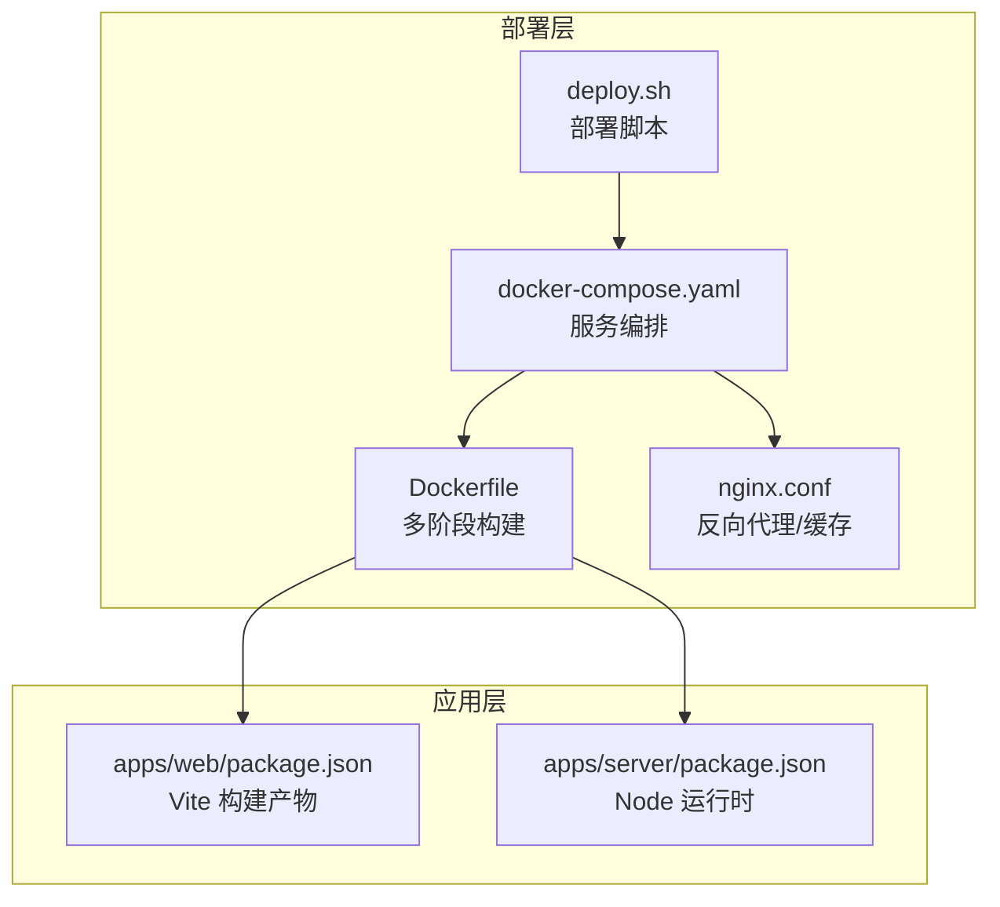
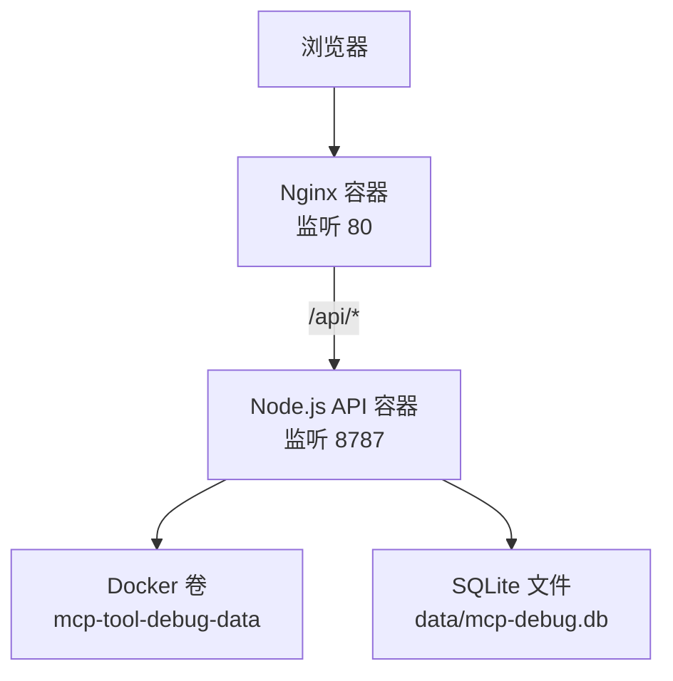
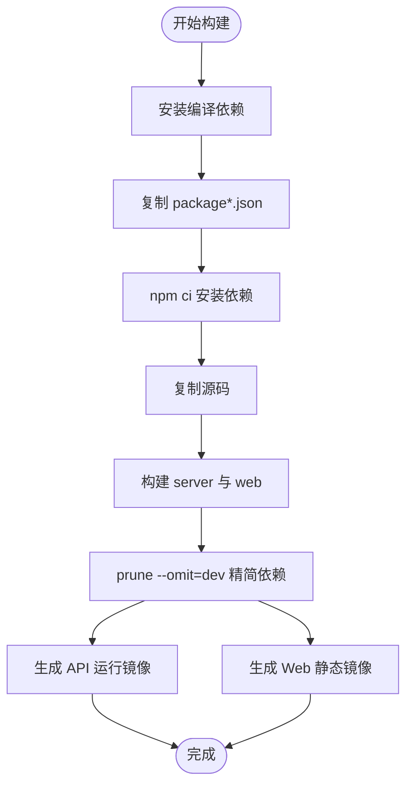
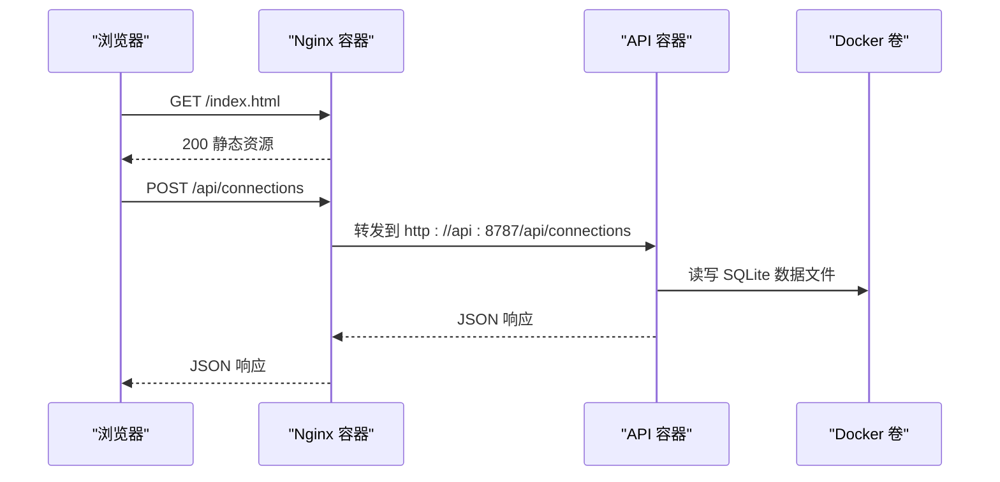
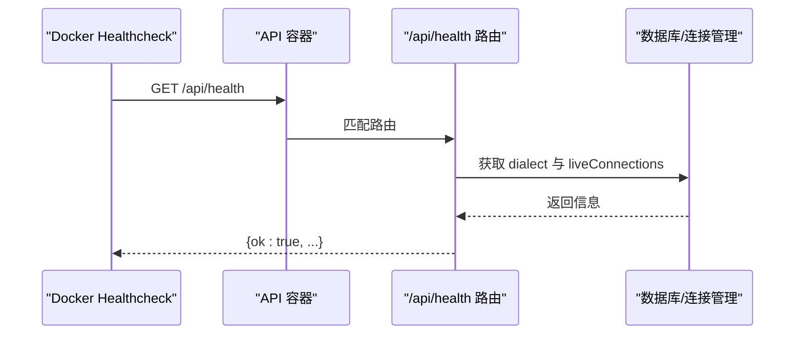
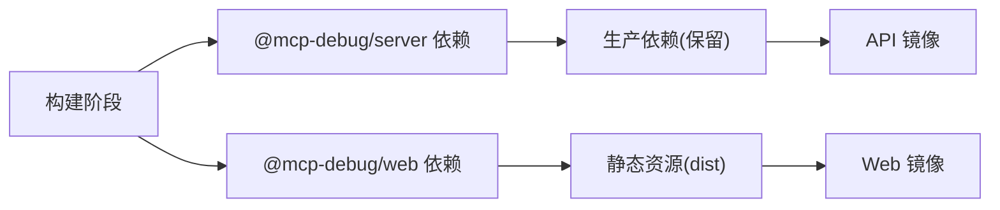

# 部署架构

<cite>
**本文引用的文件**
- [Dockerfile](file://deployment/Dockerfile)
- [docker-compose.yaml](file://deployment/docker-compose.yaml)
- [nginx.conf](file://deployment/nginx.conf)
- [deploy.sh](file://deployment/deploy.sh)
- [server/package.json](file://apps/server/package.json)
- [web/package.json](file://apps/web/package.json)
- [server/src/index.ts](file://apps/server/src/index.ts)
- [server/src/routes/api.ts](file://apps/server/src/routes/api.ts)
- [web/vite.config.ts](file://apps/web/vite.config.ts)
- [deployment/README.md](file://deployment/README.md)
</cite>

## 目录
1. [简介](#简介)
2. [项目结构](#项目结构)
3. [核心组件](#核心组件)
4. [架构总览](#架构总览)
5. [详细组件分析](#详细组件分析)
6. [依赖关系分析](#依赖关系分析)
7. [性能与体积优化](#性能与体积优化)
8. [生产环境部署脚本与健康检查](#生产环境部署脚本与健康检查)
9. [日志收集策略](#日志收集策略)
10. [扩展性与负载均衡](#扩展性与负载均衡)
11. [监控指标暴露](#监控指标暴露)
12. [故障排查指南](#故障排查指南)
13. [结论](#结论)

## 简介
本仓库采用基于 Docker 的多阶段构建容器化方案，将前后端应用分别打包为最小镜像：后端 API 使用 Node.js 运行，前端静态资源由 Nginx 提供并通过反向代理转发到 API。通过 Docker Compose 编排服务、数据卷持久化与环境变量管理，配合部署脚本实现一键启动、重启、查看日志等运维操作。Nginx 配置了静态资源缓存与长连接超时，便于后续接入 HTTPS 与外部负载均衡。

## 项目结构
部署相关的关键文件位于 deployment 目录，包含多阶段 Dockerfile、Compose 编排、Nginx 配置与部署脚本；前后端各自维护包管理与构建脚本。

图表来源
- [Dockerfile:1-64](file://deployment/Dockerfile#L1-L64)
- [docker-compose.yaml:1-39](file://deployment/docker-compose.yaml#L1-L39)
- [nginx.conf:1-25](file://deployment/nginx.conf#L1-L25)
- [deploy.sh:1-51](file://deployment/deploy.sh#L1-L51)
- [server/package.json:1-32](file://apps/server/package.json#L1-L32)
- [web/package.json:1-38](file://apps/web/package.json#L1-L38)

章节来源
- [Dockerfile:1-64](file://deployment/Dockerfile#L1-L64)
- [docker-compose.yaml:1-39](file://deployment/docker-compose.yaml#L1-L39)
- [nginx.conf:1-25](file://deployment/nginx.conf#L1-L25)
- [deploy.sh:1-51](file://deployment/deploy.sh#L1-L51)
- [server/package.json:1-32](file://apps/server/package.json#L1-L32)
- [web/package.json:1-38](file://apps/web/package.json#L1-L38)

## 核心组件
- 多阶段构建镜像
  - 构建阶段：安装编译依赖、拉取依赖、执行前后端构建并精简依赖。
  - API 运行阶段：仅拷贝生产依赖与构建产物，设置环境变量，暴露端口，定义健康检查，以非 root 用户运行。
  - Web 静态阶段：基于 Nginx 镜像，复制构建产物与反向代理配置，暴露 80 端口，定义健康检查。
- 服务编排
  - api 服务：映射端口、挂载数据卷、注入环境变量（数据库 URL、方言、CORS 等）。
  - web 服务：依赖 api 健康状态，映射对外端口。
  - 命名卷：持久化 SQLite 数据文件。
- 反向代理
  - /api/ 请求转发至 api 服务，保留客户端真实 IP 与协议头，关闭缓冲与缓存，延长读取超时。
  - 其余路径提供静态资源并回退到 index.html，支持 SPA 路由。
- 部署脚本
  - 校验 docker 与 compose v2，自动创建 .env，封装常用命令（up/down/restart/logs/status）。

章节来源
- [Dockerfile:24-52](file://deployment/Dockerfile#L24-L52)
- [Dockerfile:54-64](file://deployment/Dockerfile#L54-L64)
- [docker-compose.yaml:4-34](file://deployment/docker-compose.yaml#L4-L34)
- [docker-compose.yaml:35-39](file://deployment/docker-compose.yaml#L35-L39)
- [nginx.conf:1-25](file://deployment/nginx.conf#L1-L25)
- [deploy.sh:1-51](file://deployment/deploy.sh#L1-L51)

## 架构总览
整体架构由浏览器访问 Nginx 提供的静态页面，API 请求经 Nginx 反代到 Node.js 服务，SQLite 数据通过 Docker 卷持久化。

图表来源
- [nginx.conf:1-25](file://deployment/nginx.conf#L1-L25)
- [Dockerfile:24-52](file://deployment/Dockerfile#L24-L52)
- [Dockerfile:54-64](file://deployment/Dockerfile#L54-L64)
- [docker-compose.yaml:11-21](file://deployment/docker-compose.yaml#L11-L21)

## 详细组件分析

### 多阶段构建与镜像分层
- 构建阶段
  - 基础镜像：node:22-alpine，安装 python3、make、g++ 用于原生模块编译。
  - 依赖安装：先复制 package*.json 再 npm ci，利用缓存加速。
  - 构建产物：执行前后端构建，随后 prune 移除开发依赖，减小镜像体积。
- API 运行镜像
  - 基础镜像：node:22-alpine，安装 dumb-init 作为进程管理器。
  - 环境变量：NODE_ENV=production、PORT、DATABASE_URL、DB_DIALECT。
  - 权限与安全：创建 data 目录并以 node 用户运行，暴露 8787。
  - 健康检查：定时探测 /api/health。
- Web 静态镜像
  - 基础镜像：nginx:1.27-alpine，复制 nginx 配置与静态资源。
  - 健康检查：探测根路径返回码。

图表来源
- [Dockerfile:3-23](file://deployment/Dockerfile#L3-L23)
- [Dockerfile:24-52](file://deployment/Dockerfile#L24-L52)
- [Dockerfile:54-64](file://deployment/Dockerfile#L54-L64)

章节来源
- [Dockerfile:1-64](file://deployment/Dockerfile#L1-L64)

### 服务编排与网络通信
- 服务定义
  - api：指定构建上下文与目标 stage，映射端口，挂载数据卷，注入环境变量。
  - web：依赖 api 健康状态，映射对外端口。
- 网络通信
  - 同一 Compose 网络下，web 通过服务名 api 访问后端。
  - Nginx 反向代理将 /api/ 请求转发到 http://api:8787。
- 数据持久化
  - 命名卷 mcp-tool-debug-data 挂载到 /app/apps/server/data，默认 SQLite 文件路径指向该目录。
- 环境变量
  - DATABASE_URL、DB_DIALECT、CORS_ORIGIN、API_PORT、WEB_PORT 等通过 .env 或 Compose 覆盖。

图表来源
- [docker-compose.yaml:4-34](file://deployment/docker-compose.yaml#L4-L34)
- [nginx.conf:8-18](file://deployment/nginx.conf#L8-L18)
- [Dockerfile:28-42](file://deployment/Dockerfile#L28-L42)

章节来源
- [docker-compose.yaml:1-39](file://deployment/docker-compose.yaml#L1-L39)
- [nginx.conf:1-25](file://deployment/nginx.conf#L1-L25)

### Nginx 反向代理与静态资源
- 反向代理
  - location /api/ 转发到 api:8787，设置 Host、X-Real-IP、X-Forwarded-For、X-Forwarded-Proto。
  - 关闭缓冲与缓存，设置较长读取超时，适配长耗时调用。
- 静态资源
  - root 指向 /usr/share/nginx/html，try_files 回退到 /index.html，支持 SPA 路由。
- HTTPS 支持
  - 当前未内置证书与 TLS 配置，可在外部网关或 Ingress 中终止 TLS，或将证书与监听 443 的配置集成到 Nginx 镜像。

章节来源
- [nginx.conf:1-25](file://deployment/nginx.conf#L1-L25)

### 健康检查机制
- API 健康检查
  - 容器内定期请求 http://127.0.0.1:8787/api/health，成功返回 2xx 即视为健康。
  - 服务端 /api/health 返回 ok、数据库方言与活跃连接数。
- Web 健康检查
  - 容器内定期请求 http://127.0.0.1/，成功返回 2xx 即视为健康。
- 编排依赖
  - web 服务 depends_on api 且 condition 为 service_healthy，确保 API 就绪后再启动。

图表来源
- [Dockerfile:48-52](file://deployment/Dockerfile#L48-L52)
- [server/src/routes/api.ts:32-38](file://apps/server/src/routes/api.ts#L32-L38)

章节来源
- [Dockerfile:48-52](file://deployment/Dockerfile#L48-L52)
- [server/src/routes/api.ts:32-38](file://apps/server/src/routes/api.ts#L32-L38)

### 环境变量与 CORS
- 环境变量
  - PORT：API 监听端口。
  - DATABASE_URL：数据库连接字符串，默认指向 SQLite 文件。
  - DB_DIALECT：数据库方言，默认 sqlite。
  - CORS_ORIGIN：允许的前端源，默认本地开发地址。
- CORS 中间件
  - 在 API 入口注册全局 CORS，允许常见方法与头部。

章节来源
- [docker-compose.yaml:11-16](file://deployment/docker-compose.yaml#L11-L16)
- [Dockerfile:28-31](file://deployment/Dockerfile#L28-L31)
- [server/src/index.ts:7-21](file://apps/server/src/index.ts#L7-L21)

### 数据持久化与迁移
- 数据卷
  - 命名卷 mcp-tool-debug-data 挂载到 /app/apps/server/data。
- 数据库初始化
  - 启动时执行迁移，确保表结构就绪。
- 存储后端
  - 默认 SQLite，文件位于 data/mcp-debug.db；可通过环境变量切换为 PostgreSQL。

章节来源
- [docker-compose.yaml:19-21](file://deployment/docker-compose.yaml#L19-L21)
- [docker-compose.yaml:35-39](file://deployment/docker-compose.yaml#L35-L39)
- [Dockerfile:42-44](file://deployment/Dockerfile#L42-L44)
- [server/src/index.ts:10-12](file://apps/server/src/index.ts#L10-L12)

## 依赖关系分析
- 构建期依赖
  - server：Hono、@hono/node-server、Drizzle ORM、better-sqlite3、pg、Zod/AJV 等。
  - web：React、Ant Design、RJSF、CodeMirror、Vite 等。
- 运行期依赖
  - server：仅保留生产依赖，通过 prune 剔除 devDependencies。
  - web：仅静态资源，无运行时依赖。

图表来源
- [server/package.json:12-23](file://apps/server/package.json#L12-L23)
- [web/package.json:12-29](file://apps/web/package.json#L12-L29)
- [Dockerfile:20-22](file://deployment/Dockerfile#L20-L22)

章节来源
- [server/package.json:1-32](file://apps/server/package.json#L1-32)
- [web/package.json:1-38](file://apps/web/package.json#L1-38)
- [Dockerfile:20-22](file://deployment/Dockerfile#L20-L22)

## 性能与体积优化
- 多阶段构建
  - 构建与运行分离，运行镜像仅包含必要依赖与产物。
- 依赖裁剪
  - 构建后执行 prune --omit=dev，显著减少镜像体积。
- 缓存优化
  - 先复制 package*.json 再安装依赖，充分利用 Docker 层缓存。
- 静态资源
  - Nginx 直接提供静态文件，避免 Node 处理静态资源开销。
- 长连接与超时
  - 针对可能较长的工具调用，Nginx 设置较大读取超时，避免中断。

章节来源
- [Dockerfile:10-22](file://deployment/Dockerfile#L10-L22)
- [nginx.conf:15-18](file://deployment/nginx.conf#L15-L18)

## 生产环境部署脚本与健康检查
- 部署脚本
  - 校验 docker 与 compose v2，自动从示例生成 .env，封装 up/down/restart/logs/status 等操作。
  - 通过 --env-file 加载环境变量，统一编排参数。
- 健康检查
  - API 与 Web 均定义了 HEALTHCHECK，结合 Compose depends_on 条件启动，提升可用性。

章节来源
- [deploy.sh:1-51](file://deployment/deploy.sh#L1-L51)
- [Dockerfile:48-62](file://deployment/Dockerfile#L48-L62)
- [docker-compose.yaml:29-31](file://deployment/docker-compose.yaml#L29-L31)

## 日志收集策略
- 容器标准输出
  - API 启动时会打印监听端口信息，便于通过 docker compose logs 查看。
- 日志聚合建议
  - 在生产环境中可对接 journald、Fluent Bit、Vector 或云厂商日志服务，采集 stdout/stderr。
  - 对业务关键事件（连接建立、错误、用例执行）建议在应用层追加结构化日志字段，便于检索与分析。

章节来源
- [server/src/index.ts:30-32](file://apps/server/src/index.ts#L30-L32)
- [deploy.sh:39-41](file://deployment/deploy.sh#L39-L41)

## 扩展性与负载均衡
- 水平扩展
  - 将 API 服务复制多个副本，共享同一数据卷或使用外部数据库（PostgreSQL），通过外部负载均衡器分发流量。
- 反向代理增强
  - 可在 Nginx 上游增加多个 api 实例，启用 upstream 与 keepalive，提高并发能力。
- 会话与状态
  - 当前为无状态 API，适合横向扩展；若引入会话需改为外部存储（Redis）。
- 外部网关
  - 推荐在 Kubernetes Ingress 或云负载均衡处终止 TLS，集中管理证书与限流。

[本节为概念性说明，不直接分析具体文件]

## 监控指标暴露
- 现状
  - 当前未暴露 Prometheus 等监控指标端点。
- 建议
  - 在 API 中新增 /metrics 端点，暴露进程、HTTP 请求计数、延迟分位、数据库连接池等指标。
  - 使用轻量级库（如 prom-client）采集指标，或通过 sidecar 方式采集系统指标。
  - 在 Nginx 开启 stub_status 或导出访问日志供监控系统抓取。

[本节为概念性说明，不直接分析具体文件]

## 故障排查指南
- 常见问题定位
  - 端口冲突：修改 .env 中的 WEB_PORT 或 API_PORT，避免与宿主机端口冲突。
  - 数据卷权限：确认 data 目录归属 node 用户，避免写入失败。
  - CORS 跨域：调整 CORS_ORIGIN 与实际前端域名一致。
  - 数据库方言：切换 DB_DIALECT 与 DATABASE_URL 以适配不同后端。
- 快速验证
  - 访问 Web 首页与 API 健康检查端点，确认服务正常。
  - 使用部署脚本的 logs 命令查看最近日志。

章节来源
- [docker-compose.yaml:11-18](file://deployment/docker-compose.yaml#L11-L18)
- [Dockerfile:42-44](file://deployment/Dockerfile#L42-L44)
- [server/src/index.ts:7-8](file://apps/server/src/index.ts#L7-L8)
- [deployment/README.md:1-32](file://deployment/README.md#L1-L32)

## 结论
本项目通过多阶段构建与 Compose 编排实现了前后端应用的容器化与一体化部署，具备清晰的镜像分层、依赖精简、数据持久化与健康检查机制。Nginx 反向代理提供了稳定的静态资源服务与 API 转发能力。面向生产环境，建议补充外部负载均衡、HTTPS 终止、日志与监控体系，并根据需要扩展 API 副本以实现高可用与弹性伸缩。