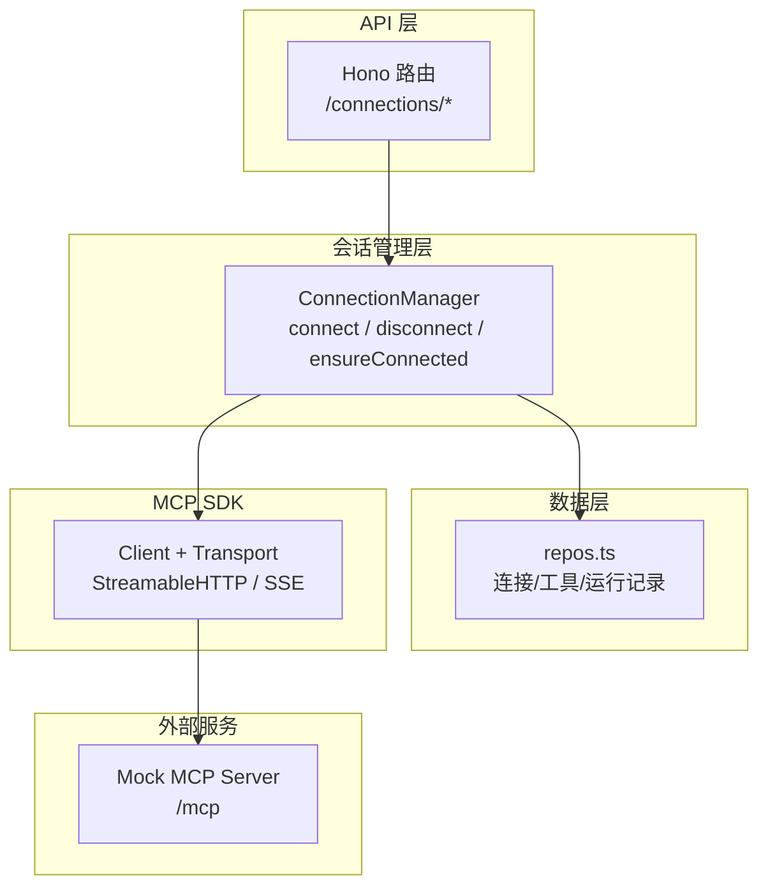
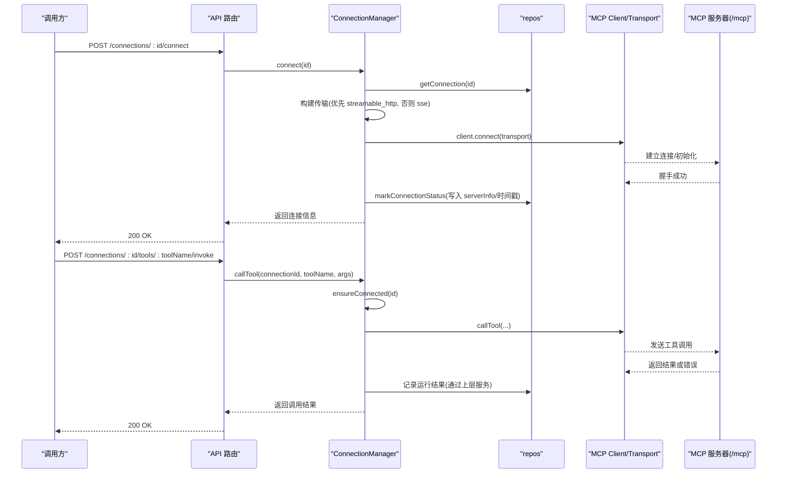
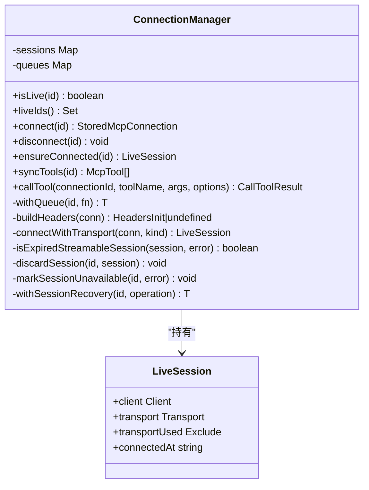
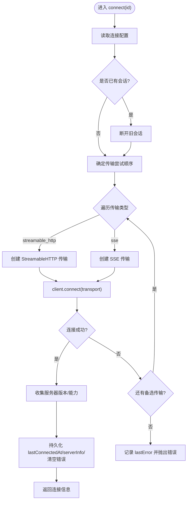
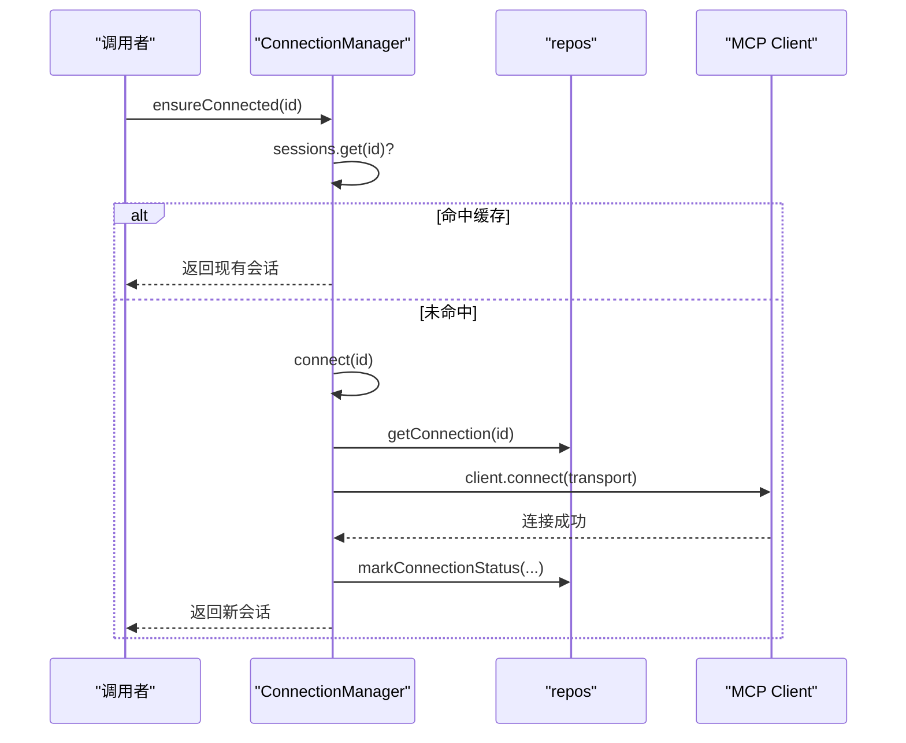
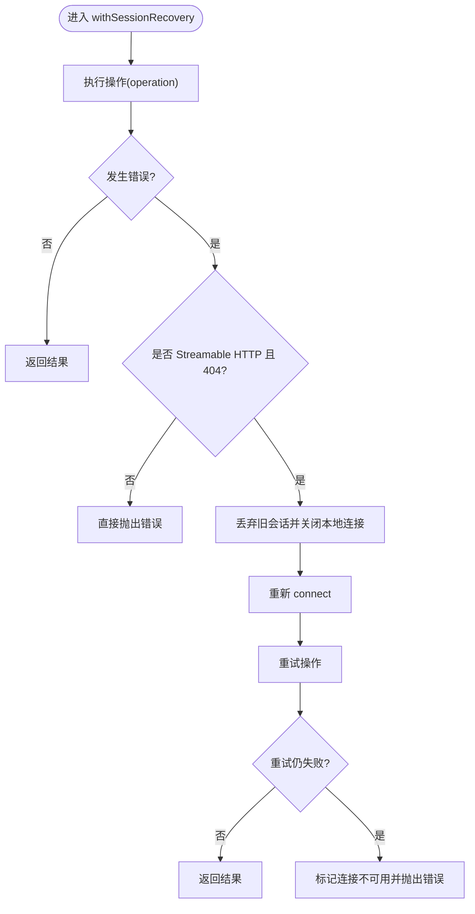
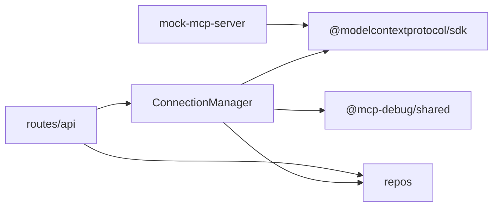

# 会话生命周期管理

<cite>
**本文引用的文件**
- [connection-manager.ts](file://apps/server/src/mcp/connection-manager.ts)
- [api.ts](file://apps/server/src/routes/api.ts)
- [repos.ts](file://apps/server/src/db/repos.ts)
- [types.ts](file://packages/shared/src/types.ts)
- [mock-mcp-server.ts](file://scripts/mock-mcp-server.ts)
- [session-recovery.test.ts](file://scripts/session-recovery.test.ts)
</cite>

## 目录
1. [简介](#简介)
2. [项目结构](#项目结构)
3. [核心组件](#核心组件)
4. [架构总览](#架构总览)
5. [详细组件分析](#详细组件分析)
6. [依赖关系分析](#依赖关系分析)
7. [性能与可靠性考虑](#性能与可靠性考虑)
8. [故障排查指南](#故障排查指南)
9. [结论](#结论)
10. [附录：使用示例路径](#附录使用示例路径)

## 简介
本文件围绕 MCP（Model Context Protocol）客户端在应用中的“会话生命周期管理”展开，重点解释以下方面：
- 会话的创建、初始化、活跃状态维护与资源清理
- connect() 方法的工作流程与传输协议选择策略（优先 Streamable HTTP，其次 SSE）
- ensureConnected() 的自动连接与会话复用逻辑
- 会话状态监控方法与调试技巧
- 结合测试与模拟服务器验证的端到端行为说明

## 项目结构
与“会话生命周期”直接相关的代码主要位于服务端模块中：
- 会话管理与连接控制：apps/server/src/mcp/connection-manager.ts
- API 路由层暴露的连接/工具调用接口：apps/server/src/routes/api.ts
- 持久化与状态记录：apps/server/src/db/repos.ts
- 共享类型定义（含传输类型、运行状态等）：packages/shared/src/types.ts
- 用于验证行为的模拟 MCP 服务器与集成测试：scripts/mock-mcp-server.ts、scripts/session-recovery.test.ts

图表来源
- [api.ts:77-102](file://apps/server/src/routes/api.ts#L77-L102)
- [connection-manager.ts:39-173](file://apps/server/src/mcp/connection-manager.ts#L39-L173)
- [repos.ts:288-312](file://apps/server/src/db/repos.ts#L288-L312)
- [mock-mcp-server.ts:213-278](file://scripts/mock-mcp-server.ts#L213-L278)

章节来源
- [api.ts:1-120](file://apps/server/src/routes/api.ts#L1-L120)
- [connection-manager.ts:1-173](file://apps/server/src/mcp/connection-manager.ts#L1-L173)
- [repos.ts:288-312](file://apps/server/src/db/repos.ts#L288-L312)
- [types.ts:1-12](file://packages/shared/src/types.ts#L1-L12)
- [mock-mcp-server.ts:213-278](file://scripts/mock-mcp-server.ts#L213-L278)

## 核心组件
- ConnectionManager：封装 MCP 客户端实例、传输对象、会话状态与恢复逻辑。提供 connect、disconnect、ensureConnected、syncTools、callTool 等方法。
- repos：负责连接配置、工具清单、运行记录的持久化与查询，并维护 lastConnectedAt、lastError、serverInfo 等状态字段。
- API 路由：将连接/工具调用等操作暴露为 REST 接口，并在响应中隐藏敏感头值。
- Mock MCP Server：支持多种会话模式（正常、一次性过期、拒绝请求、返回特定 HTTP 错误），便于验证恢复与健壮性。

章节来源
- [connection-manager.ts:39-173](file://apps/server/src/mcp/connection-manager.ts#L39-L173)
- [repos.ts:288-312](file://apps/server/src/db/repos.ts#L288-L312)
- [api.ts:77-102](file://apps/server/src/routes/api.ts#L77-L102)
- [mock-mcp-server.ts:154-171](file://scripts/mock-mcp-server.ts#L154-L171)

## 架构总览
下图展示了从 API 到 MCP 服务器的完整调用链，以及连接管理器内部的会话复用与恢复机制。

图表来源
- [api.ts:77-102](file://apps/server/src/routes/api.ts#L77-L102)
- [api.ts:117-138](file://apps/server/src/routes/api.ts#L117-L138)
- [connection-manager.ts:101-147](file://apps/server/src/mcp/connection-manager.ts#L101-L147)
- [connection-manager.ts:166-173](file://apps/server/src/mcp/connection-manager.ts#L166-L173)
- [connection-manager.ts:300-379](file://apps/server/src/mcp/connection-manager.ts#L300-L379)
- [repos.ts:288-312](file://apps/server/src/db/repos.ts#L288-L312)

## 详细组件分析

### 连接管理器类图

图表来源
- [connection-manager.ts:19-41](file://apps/server/src/mcp/connection-manager.ts#L19-L41)
- [connection-manager.ts:39-173](file://apps/server/src/mcp/connection-manager.ts#L39-L173)

章节来源
- [connection-manager.ts:19-41](file://apps/server/src/mcp/connection-manager.ts#L19-L41)
- [connection-manager.ts:39-173](file://apps/server/src/mcp/connection-manager.ts#L39-L173)

### connect() 工作流程与传输协议选择
- 读取连接配置：根据 id 获取存储的连接信息。
- 若存在旧会话，先断开再重建，避免重复占用。
- 传输选择策略：
  - 若配置 transport 为 "streamable_http"，仅尝试该协议；
  - 若为 "sse"，仅尝试 SSE；
  - 若为 "auto"，则按顺序尝试 ["streamable_http", "sse"]，即优先 Streamable HTTP，失败后回退至 SSE。
- 建立连接：构造对应 Transport 并调用 client.connect(transport)。
- 获取服务器信息：尝试读取 getServerVersion/getServerCapabilities（如可用），并持久化 lastConnectedAt、serverInfo、清空 lastError。
- 异常处理：任一协议失败时记录 lastError 并抛出错误。

图表来源
- [connection-manager.ts:101-147](file://apps/server/src/mcp/connection-manager.ts#L101-L147)
- [connection-manager.ts:75-99](file://apps/server/src/mcp/connection-manager.ts#L75-L99)
- [repos.ts:288-312](file://apps/server/src/db/repos.ts#L288-L312)

章节来源
- [connection-manager.ts:101-147](file://apps/server/src/mcp/connection-manager.ts#L101-L147)
- [connection-manager.ts:75-99](file://apps/server/src/mcp/connection-manager.ts#L75-L99)
- [repos.ts:288-312](file://apps/server/src/db/repos.ts#L288-L312)

### ensureConnected() 自动连接与会话复用
- 若内存中已存在该 id 的会话，直接复用返回。
- 否则调用 connect(id) 完成一次完整的连接流程，成功后返回新会话。
- 若连接失败，抛出错误，由上层决定重试或提示用户。

图表来源
- [connection-manager.ts:166-173](file://apps/server/src/mcp/connection-manager.ts#L166-L173)
- [connection-manager.ts:101-147](file://apps/server/src/mcp/connection-manager.ts#L101-L147)
- [repos.ts:288-312](file://apps/server/src/db/repos.ts#L288-L312)

章节来源
- [connection-manager.ts:166-173](file://apps/server/src/mcp/connection-manager.ts#L166-L173)
- [connection-manager.ts:101-147](file://apps/server/src/mcp/connection-manager.ts#L101-L147)

### 会话恢复与错误分类
- withSessionRecovery：对任意需要会话的操作进行包装，当检测到“会话已过期”的错误时，自动丢弃旧会话并重试一次。
- 过期判定：仅针对 Streamable HTTP 且错误为 404（表示远端不再持有该 sessionId）。
- 恢复流程：
  - 捕获错误 -> 判断是否为“会话过期” -> 丢弃本地会话 -> 重新 connect -> 再次执行操作。
  - 若重试仍失败（例如连续 404），标记不可用并抛出错误。
- 非恢复场景：
  - 其他 HTTP 错误（如 401、500）、工具级错误、超时等不会触发恢复。

图表来源
- [connection-manager.ts:209-268](file://apps/server/src/mcp/connection-manager.ts#L209-L268)
- [connection-manager.ts:175-207](file://apps/server/src/mcp/connection-manager.ts#L175-L207)

章节来源
- [connection-manager.ts:209-268](file://apps/server/src/mcp/connection-manager.ts#L209-L268)
- [connection-manager.ts:175-207](file://apps/server/src/mcp/connection-manager.ts#L175-L207)

### 同步工具列表与并发控制
- syncTools：通过 listTools 分页拉取工具元数据，去重替换本地缓存，并记录 syncedAt。
- withQueue：基于队列保证同一连接的操作串行化，避免并发导致的竞态问题。

章节来源
- [connection-manager.ts:270-298](file://apps/server/src/mcp/connection-manager.ts#L270-L298)
- [connection-manager.ts:51-67](file://apps/server/src/mcp/connection-manager.ts#L51-L67)
- [repos.ts:314-349](file://apps/server/src/db/repos.ts#L314-L349)

### 工具调用与超时控制
- callTool：
  - 解析超时：优先使用 options.timeoutMs，其次连接配置的 timeoutMs，默认 60s。
  - 使用 AbortController 与 Promise.race 实现超时取消。
  - 结果包含结构化内容、状态码、耗时、校验结果等。
  - 内部通过 withSessionRecovery 保障会话可用性。
- 错误分类：
  - 超时：status=timeout
  - 协议错误：status=protocol_error
  - 工具错误：status=tool_error
  - 成功：status=success

章节来源
- [connection-manager.ts:300-379](file://apps/server/src/mcp/connection-manager.ts#L300-L379)
- [types.ts:5-12](file://packages/shared/src/types.ts#L5-L12)

### 资源清理与断开
- disconnect：
  - 若传输支持 terminateSession，先终止远端会话。
  - 关闭本地客户端连接。
  - 忽略关闭过程中的异常，确保幂等。

章节来源
- [connection-manager.ts:149-164](file://apps/server/src/mcp/connection-manager.ts#L149-L164)

### API 层与状态可见性
- /health：返回当前进程内活跃连接数。
- /connections：列出所有连接，并标注 live 状态。
- 安全：对外响应中不返回 headers 值，仅返回 headerNames。

章节来源
- [api.ts:32-44](file://apps/server/src/routes/api.ts#L32-L44)
- [api.ts:24-30](file://apps/server/src/routes/api.ts#L24-L30)

## 依赖关系分析
- ConnectionManager 依赖：
  - MCP SDK：Client、StreamableHTTPClientTransport、SSEClientTransport
  - repos：读写连接、工具、运行记录
  - shared types：TransportType、RunStatus 等
- API 路由依赖：
  - connectionManager：连接/工具调用入口
  - repos：持久化与查询
- Mock 服务器：
  - 提供可配置的会话行为，用于验证恢复与健壮性

图表来源
- [connection-manager.ts:1-17](file://apps/server/src/mcp/connection-manager.ts#L1-L17)
- [api.ts:1-16](file://apps/server/src/routes/api.ts#L1-L16)
- [types.ts:1-12](file://packages/shared/src/types.ts#L1-L12)
- [mock-mcp-server.ts:1-8](file://scripts/mock-mcp-server.ts#L1-L8)

章节来源
- [connection-manager.ts:1-17](file://apps/server/src/mcp/connection-manager.ts#L1-L17)
- [api.ts:1-16](file://apps/server/src/routes/api.ts#L1-L16)
- [types.ts:1-12](file://packages/shared/src/types.ts#L1-L12)
- [mock-mcp-server.ts:1-8](file://scripts/mock-mcp-server.ts#L1-L8)

## 性能与可靠性考虑
- 传输选择：优先 Streamable HTTP，具备更好的会话复用与性能特征；SSE 作为兼容回退。
- 会话复用：ensureConnected 避免重复建立连接，降低握手开销。
- 并发控制：withQueue 保证同一连接的串行化，避免竞态与状态不一致。
- 恢复策略：仅在明确的“会话过期（404）”场景下自动重试一次，避免无界重试。
- 超时保护：统一超时控制，防止长尾请求阻塞资源。

[本节为通用指导，无需具体文件引用]

## 故障排查指南
- 查看健康与活跃连接数
  - GET /api/health：返回 liveConnections 数量，快速确认进程内活跃会话。
- 检查连接状态与错误
  - GET /api/connections/:id：查看 lastConnectedAt、lastError、serverInfo 等字段。
  - 注意：headers 值不会出现在响应中，仅显示 headerNames。
- 观察恢复日志
  - 当发生会话过期时，会输出 mcp_session_recovery_started/succeeded/failed 事件日志，便于定位恢复阶段。
- 使用模拟服务器复现问题
  - 通过环境变量切换 mock 模式（expire-once、reject-requests、http-401、http-500），验证不同错误分支。
- 工具调用诊断
  - 关注返回的 status、durationMs、protocolError、schemaValidation 等字段，区分超时、协议错误与工具错误。

章节来源
- [api.ts:32-38](file://apps/server/src/routes/api.ts#L32-L38)
- [api.ts:53-58](file://apps/server/src/routes/api.ts#L53-L58)
- [connection-manager.ts:219-266](file://apps/server/src/mcp/connection-manager.ts#L219-L266)
- [mock-mcp-server.ts:213-278](file://scripts/mock-mcp-server.ts#L213-L278)

## 结论
本方案通过 ConnectionManager 集中管理 MCP 会话的生命周期，实现了：
- 灵活的传输协议选择与回退
- 健壮的自动连接与会话复用
- 针对会话过期的有限恢复策略
- 完善的错误分类与状态持久化
- 安全的对外接口设计（不泄露敏感头值）

这些特性共同保障了在高并发与不稳定网络环境下的稳定性与可观测性。

[本节为总结，无需具体文件引用]

## 附录：使用示例路径
以下为“如何正确管理会话生命周期”的代码片段路径参考（不包含具体代码内容）：
- 创建连接并连接：
  - [POST /connections:46-51](file://apps/server/src/routes/api.ts#L46-L51)
  - [POST /connections/:id/connect:77-85](file://apps/server/src/routes/api.ts#L77-L85)
  - [connect() 实现:101-147](file://apps/server/src/mcp/connection-manager.ts#L101-L147)
- 自动连接与会话复用：
  - [ensureConnected() 实现:166-173](file://apps/server/src/mcp/connection-manager.ts#L166-L173)
- 同步工具列表：
  - [POST /connections/:id/sync-tools:94-102](file://apps/server/src/routes/api.ts#L94-L102)
  - [syncTools() 实现:270-298](file://apps/server/src/mcp/connection-manager.ts#L270-L298)
- 调用工具与超时控制：
  - [POST /connections/:id/tools/:toolName/invoke:117-138](file://apps/server/src/routes/api.ts#L117-L138)
  - [callTool() 实现:300-379](file://apps/server/src/mcp/connection-manager.ts#L300-L379)
- 断开连接与资源清理：
  - [POST /connections/:id/disconnect:87-92](file://apps/server/src/routes/api.ts#L87-L92)
  - [disconnect() 实现:149-164](file://apps/server/src/mcp/connection-manager.ts#L149-L164)
- 会话恢复与错误分类：
  - [withSessionRecovery() 实现:209-268](file://apps/server/src/mcp/connection-manager.ts#L209-L268)
  - [isExpiredStreamableSession() 实现:175-186](file://apps/server/src/mcp/connection-manager.ts#L175-L186)
- 状态监控与调试：
  - [/health 接口:32-38](file://apps/server/src/routes/api.ts#L32-L38)
  - [连接详情接口:53-58](file://apps/server/src/routes/api.ts#L53-L58)
  - [连接状态持久化:288-312](file://apps/server/src/db/repos.ts#L288-L312)
- 端到端验证（测试与模拟服务器）：
  - [集成测试用例:104-293](file://scripts/session-recovery.test.ts#L104-L293)
  - [模拟服务器实现:154-278](file://scripts/mock-mcp-server.ts#L154-278)