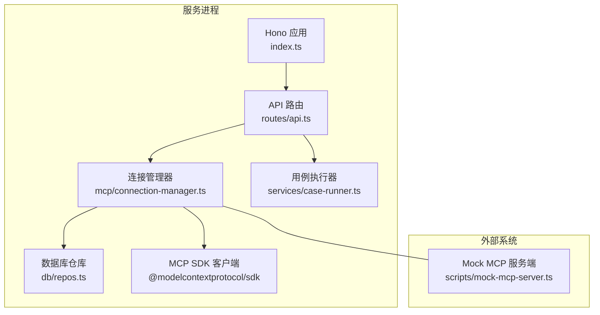
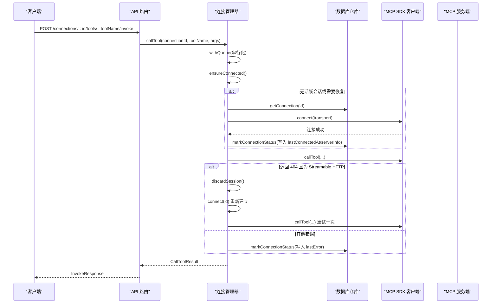
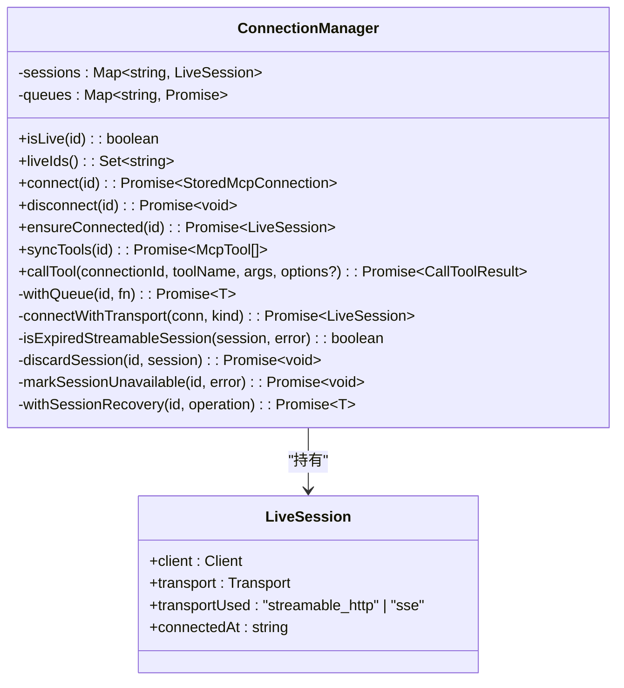
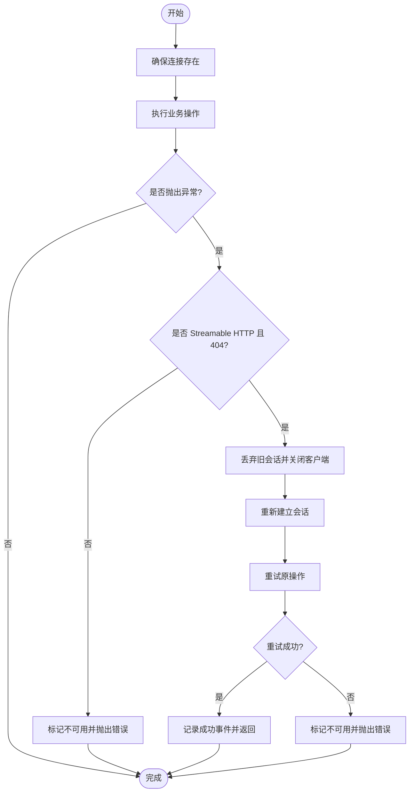
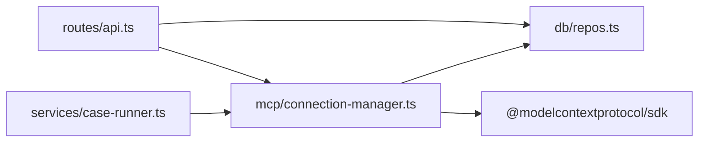

# 会话管理

<cite>
**本文引用的文件**   
- [apps/server/src/mcp/connection-manager.ts](file://apps/server/src/mcp/connection-manager.ts)
- [apps/server/src/routes/api.ts](file://apps/server/src/routes/api.ts)
- [apps/server/src/services/case-runner.ts](file://apps/server/src/services/case-runner.ts)
- [apps/server/src/db/repos.ts](file://apps/server/src/db/repos.ts)
- [packages/shared/src/types.ts](file://packages/shared/src/types.ts)
- [scripts/session-recovery.test.ts](file://scripts/session-recovery.test.ts)
- [scripts/mock-mcp-server.ts](file://scripts/mock-mcp-server.ts)
- [apps/server/src/index.ts](file://apps/server/src/index.ts)
</cite>

## 目录
1. [简介](#简介)
2. [项目结构](#项目结构)
3. [核心组件](#核心组件)
4. [架构总览](#架构总览)
5. [详细组件分析](#详细组件分析)
6. [依赖关系分析](#依赖关系分析)
7. [性能与并发特性](#性能与并发特性)
8. [故障排查指南](#故障排查指南)
9. [结论](#结论)
10. [附录：状态查询与调试方法](#附录状态查询与调试方法)

## 简介
本文件聚焦 MCP（Model Context Protocol）会话管理的实现与使用，覆盖以下关键主题：
- 会话生命周期：创建、连接、断开、自动重连与会话恢复
- 状态监控：在线状态、最后连接时间、错误信息、服务器能力
- 并发控制与队列：按连接 ID 的串行化执行策略
- 资源清理：传输层终止与客户端关闭
- 过期检测与处理：Streamable HTTP 会话 404 的错误识别与恢复流程
- 状态查询与调试：API 接口、健康检查、运行记录与断言结果

## 项目结构
与“会话管理”直接相关的代码主要分布在服务端模块中：
- 连接与会话管理器：负责 MCP 客户端实例、传输层、会话缓存、重试与恢复
- API 路由：暴露连接/工具/用例/套件等 REST 接口，并集成会话管理器
- 数据持久化：连接、工具、用例、运行记录的增删改查
- 共享类型：统一的输入输出与状态枚举定义
- 测试与模拟：会话恢复行为验证与 Mock MCP 服务端

图表来源
- [apps/server/src/index.ts:10-33](file://apps/server/src/index.ts#L10-L33)
- [apps/server/src/routes/api.ts:18-38](file://apps/server/src/routes/api.ts#L18-L38)
- [apps/server/src/mcp/connection-manager.ts:39-147](file://apps/server/src/mcp/connection-manager.ts#L39-L147)
- [apps/server/src/db/repos.ts:211-312](file://apps/server/src/db/repos.ts#L211-L312)
- [scripts/mock-mcp-server.ts:213-283](file://scripts/mock-mcp-server.ts#L213-L283)

章节来源
- [apps/server/src/index.ts:10-33](file://apps/server/src/index.ts#L10-L33)
- [apps/server/src/routes/api.ts:18-38](file://apps/server/src/routes/api.ts#L18-L38)

## 核心组件
- 连接管理器 ConnectionManager
  - 维护每个连接的 LiveSession（包含 Client、Transport、使用的传输类型、连接时间）
  - 提供 connect/disconnect/ensureConnected/syncTools/callTool 等方法
  - 内部实现会话恢复、超时控制、并发队列、状态标记
- API 路由
  - 暴露连接、工具、用例、套件运行等接口，统一封装错误码与公开字段
- 数据仓库 repos
  - 连接、工具、用例、运行记录的 CRUD 与状态更新
- 共享类型 types
  - 传输类型、运行状态、套件状态、断言配置等

章节来源
- [apps/server/src/mcp/connection-manager.ts:39-147](file://apps/server/src/mcp/connection-manager.ts#L39-L147)
- [apps/server/src/routes/api.ts:40-138](file://apps/server/src/routes/api.ts#L40-L138)
- [apps/server/src/db/repos.ts:211-312](file://apps/server/src/db/repos.ts#L211-L312)
- [packages/shared/src/types.ts:1-29](file://packages/shared/src/types.ts#L1-L29)

## 架构总览
下图展示了从 HTTP 请求到 MCP 调用、再到会话恢复与状态落库的整体流程。

图表来源
- [apps/server/src/routes/api.ts:117-138](file://apps/server/src/routes/api.ts#L117-L138)
- [apps/server/src/mcp/connection-manager.ts:300-379](file://apps/server/src/mcp/connection-manager.ts#L300-L379)
- [apps/server/src/mcp/connection-manager.ts:166-268](file://apps/server/src/mcp/connection-manager.ts#L166-L268)
- [apps/server/src/db/repos.ts:288-312](file://apps/server/src/db/repos.ts#L288-L312)

## 详细组件分析

### 连接管理器 ConnectionManager
- 会话存储
  - sessions: Map<connectionId, LiveSession>
  - queues: Map<connectionId, Promise> 用于按连接 ID 串行化操作
- 连接建立
  - connect(id): 读取配置，尝试指定或自动选择的传输（streamable_http 优先），成功后写回 lastConnectedAt、serverInfo
  - disconnect(id): 若支持 terminateSession 则先终止，再关闭客户端
  - ensureConnected(id): 若已有会话则复用，否则触发 connect
- 会话恢复
  - withSessionRecovery(id, operation): 在执行操作前确保连接；捕获异常后判断是否为“已过期”的 Streamable HTTP 会话（404），若是则丢弃旧会话并重试一次；若再次失败则标记不可用
  - isExpiredStreamableSession(session, error): 仅对 streamable_http 且错误为 StreamableHTTPError.code === 404 时判定为会话过期
- 并发控制
  - withQueue(id, fn): 基于 Promise 链保证同一连接的操作串行执行，避免竞态
- 工具同步
  - syncTools(id): 分页拉取工具列表并替换本地缓存
- 工具调用
  - callTool(connectionId, toolName, args, options?): 在队列保护下，结合超时控制（AbortController + Promise.race），包装为统一结果对象，包含耗时、状态、结构化内容、协议错误、Schema 校验结果等

图表来源
- [apps/server/src/mcp/connection-manager.ts:19-99](file://apps/server/src/mcp/connection-manager.ts#L19-L99)
- [apps/server/src/mcp/connection-manager.ts:101-173](file://apps/server/src/mcp/connection-manager.ts#L101-L173)
- [apps/server/src/mcp/connection-manager.ts:175-268](file://apps/server/src/mcp/connection-manager.ts#L175-L268)
- [apps/server/src/mcp/connection-manager.ts:270-379](file://apps/server/src/mcp/connection-manager.ts#L270-L379)

章节来源
- [apps/server/src/mcp/connection-manager.ts:39-147](file://apps/server/src/mcp/connection-manager.ts#L39-L147)
- [apps/server/src/mcp/connection-manager.ts:166-268](file://apps/server/src/mcp/connection-manager.ts#L166-L268)
- [apps/server/src/mcp/connection-manager.ts:300-379](file://apps/server/src/mcp/connection-manager.ts#L300-L379)

### 会话恢复与过期检测（重点）
- 触发条件
  - 当使用 streamable_http 传输时，若底层抛出 StreamableHTTPError 且 code 为 404，则认为当前会话已过期
- 恢复流程
  - 丢弃旧会话（关闭本地客户端，不发送 DELETE）
  - 重新建立新会话
  - 在原操作上新建会话后重试一次
  - 若重试仍失败，标记连接不可用（lastError 写入 HTTP 状态码与详情）
- 日志事件
  - mcp_session_recovery_started
  - mcp_session_recovery_failed（含阶段：initialize/retry）
  - mcp_session_recovery_succeeded

图表来源
- [apps/server/src/mcp/connection-manager.ts:175-268](file://apps/server/src/mcp/connection-manager.ts#L175-L268)

章节来源
- [apps/server/src/mcp/connection-manager.ts:175-268](file://apps/server/src/mcp/connection-manager.ts#L175-L268)

### 并发控制与队列管理
- 设计目标
  - 防止同一连接上的并发调用导致状态不一致或重复初始化
- 实现要点
  - withQueue(id, fn) 通过 Promise 链将同一 id 的任务串行化
  - 所有对外可并发触发的入口（如 syncTools、callTool）均包裹 in withQueue
- 效果
  - 同一连接的操作顺序执行，避免竞态
  - 不同连接之间互不影响

章节来源
- [apps/server/src/mcp/connection-manager.ts:51-67](file://apps/server/src/mcp/connection-manager.ts#L51-L67)
- [apps/server/src/mcp/connection-manager.ts:270-298](file://apps/server/src/mcp/connection-manager.ts#L270-L298)
- [apps/server/src/mcp/connection-manager.ts:300-379](file://apps/server/src/mcp/connection-manager.ts#L300-L379)

### 资源清理策略
- 断开连接
  - 若传输支持 terminateSession，则先终止会话
  - 随后关闭 MCP 客户端
- 会话回收
  - 在会话过期恢复路径中，仅关闭本地客户端，不发送删除请求，因为上游已拒绝该会话 ID

章节来源
- [apps/server/src/mcp/connection-manager.ts:149-164](file://apps/server/src/mcp/connection-manager.ts#L149-L164)
- [apps/server/src/mcp/connection-manager.ts:188-195](file://apps/server/src/mcp/connection-manager.ts#L188-L195)

### 超时与错误分类
- 超时
  - 基于 AbortController 与 Promise.race 实现，超时错误被归类为 timeout
- 协议错误
  - 非超时的异常被归类为 protocol_error，并保留 message/code
- 工具错误
  - 由 MCP 服务端返回 isError=true 的结果被归类为 tool_error

章节来源
- [apps/server/src/mcp/connection-manager.ts:300-379](file://apps/server/src/mcp/connection-manager.ts#L300-L379)
- [packages/shared/src/types.ts:5-12](file://packages/shared/src/types.ts#L5-L12)

### 状态监控与持久化
- 连接状态
  - lastConnectedAt：最近成功连接时间
  - lastError：最近错误消息（包含 HTTP 状态码与详情）
  - serverInfo：服务器版本与能力（可选）
- 在线状态
  - live：是否在内存中存在活跃会话
- 更新时机
  - 连接成功/失败、会话不可用时更新

章节来源
- [apps/server/src/db/repos.ts:288-312](file://apps/server/src/db/repos.ts#L288-L312)
- [apps/server/src/routes/api.ts:24-30](file://apps/server/src/routes/api.ts#L24-L30)

## 依赖关系分析
- 模块耦合
  - API 路由依赖连接管理器与仓库
  - 连接管理器依赖仓库与 MCP SDK
  - 用例执行器依赖连接管理器与仓库
- 外部依赖
  - @modelcontextprotocol/sdk：提供 SSE 与 Streamable HTTP 传输及客户端
  - Hono：HTTP 框架
  - Drizzle ORM：数据库访问

图表来源
- [apps/server/src/routes/api.ts:1-18](file://apps/server/src/routes/api.ts#L1-L18)
- [apps/server/src/services/case-runner.ts:1-10](file://apps/server/src/services/case-runner.ts#L1-L10)
- [apps/server/src/mcp/connection-manager.ts:1-17](file://apps/server/src/mcp/connection-manager.ts#L1-L17)

章节来源
- [apps/server/src/routes/api.ts:1-18](file://apps/server/src/routes/api.ts#L1-L18)
- [apps/server/src/services/case-runner.ts:1-10](file://apps/server/src/services/case-runner.ts#L1-L10)
- [apps/server/src/mcp/connection-manager.ts:1-17](file://apps/server/src/mcp/connection-manager.ts#L1-L17)

## 性能与并发特性
- 串行化执行
  - 同一连接的操作串行化，降低锁竞争与状态冲突风险
- 超时控制
  - 默认 60s，可通过连接配置或调用选项调整
- 恢复开销
  - 仅在检测到 404 时触发一次重建与重试，避免无限重试
- 建议
  - 合理设置超时，避免长尾任务阻塞队列
  - 在高并发场景下，尽量分散不同连接，减少单连接压力

[本节为通用指导，无需源码引用]

## 故障排查指南
- 常见问题定位
  - 连接失败：查看 lastError 与 serverInfo，确认 URL、传输类型与鉴权头
  - 会话 404：检查是否使用了 Streamable HTTP 且服务端主动失效了会话
  - 超时：确认工具响应时间与超时阈值
- 诊断手段
  - 健康检查：GET /api/health 返回 liveConnections 数量
  - 连接详情：GET /api/connections/:id 查看 live、lastConnectedAt、lastError、headerNames
  - 运行记录：GET /api/runs 与 GET /api/runs/:id 查看具体调用结果与协议错误
  - 套件运行：GET /api/suite-runs 与 GET /api/suite-runs/:id 查看整体结果
- 测试辅助
  - 集成测试脚本 session-recovery.test.ts 覆盖了 404 恢复、二次 404 驱逐、非 404 不重试、工具错误与超时不重试等场景
  - Mock 服务端 mock-mcp-server.ts 提供 expire-once、reject-requests、http-401、http-500 等模式以复现问题

章节来源
- [apps/server/src/routes/api.ts:32-38](file://apps/server/src/routes/api.ts#L32-L38)
- [apps/server/src/routes/api.ts:53-68](file://apps/server/src/routes/api.ts#L53-L68)
- [apps/server/src/routes/api.ts:205-225](file://apps/server/src/routes/api.ts#L205-L225)
- [scripts/session-recovery.test.ts:104-292](file://scripts/session-recovery.test.ts#L104-L292)
- [scripts/mock-mcp-server.ts:231-261](file://scripts/mock-mcp-server.ts#L231-L261)

## 结论
本项目实现了稳健的 MCP 会话管理：
- 支持多传输类型与自动选择
- 针对 Streamable HTTP 的 404 会话过期具备自动恢复与有限重试
- 通过队列机制保障同一连接的串行化执行
- 完善的状态监控与持久化，便于前端展示与后端排障
- 丰富的 API 与测试支撑，有助于快速定位与验证问题

[本节为总结性内容，无需源码引用]

## 附录：状态查询与调试方法
- 健康检查
  - GET /api/health
  - 返回 liveConnections 数量，便于监控面板显示
- 连接管理
  - GET /api/connections
  - GET /api/connections/:id
  - PATCH /api/connections/:id（更新名称、URL、传输、超时、启用状态等）
  - DELETE /api/connections/:id
  - POST /api/connections/:id/connect
  - POST /api/connections/:id/disconnect
- 工具与调用
  - GET /api/connections/:id/tools
  - GET /api/connections/:id/tools/:toolName
  - POST /api/connections/:id/tools/:toolName/invoke
- 用例与套件
  - GET /api/connections/:id/cases
  - POST /api/connections/:id/tools/:toolName/cases
  - POST /api/cases/:id/run
  - POST /api/connections/:id/suites/run
  - GET /api/suite-runs
  - GET /api/suite-runs/:id
- 运行记录
  - GET /api/runs
  - GET /api/runs/:id
  - DELETE /api/runs/:id
- 导入导出
  - GET /api/export
  - POST /api/import

章节来源
- [apps/server/src/routes/api.ts:32-38](file://apps/server/src/routes/api.ts#L32-L38)
- [apps/server/src/routes/api.ts:40-138](file://apps/server/src/routes/api.ts#L40-L138)
- [apps/server/src/routes/api.ts:140-225](file://apps/server/src/routes/api.ts#L140-L225)
- [apps/server/src/routes/api.ts:227-271](file://apps/server/src/routes/api.ts#L227-L271)