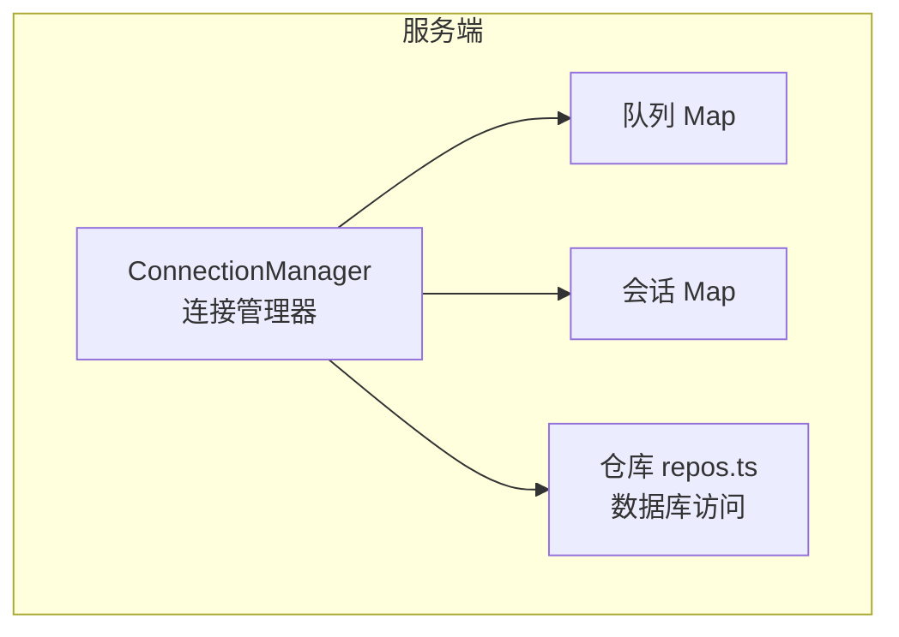
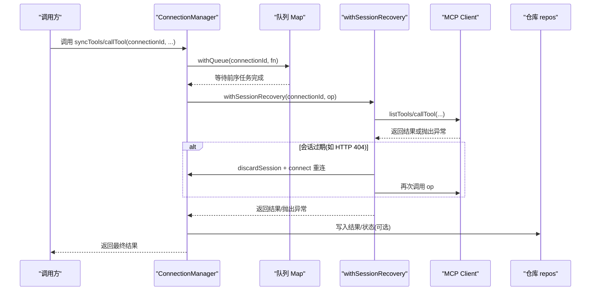
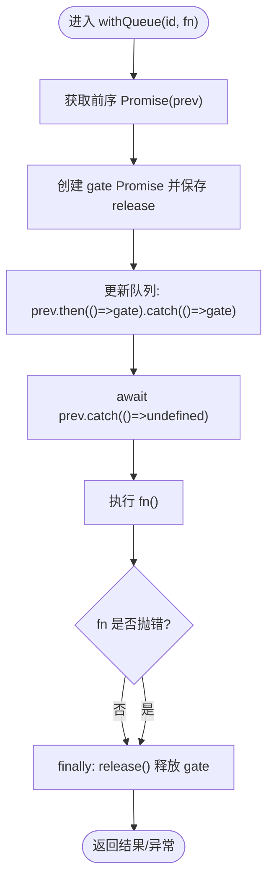
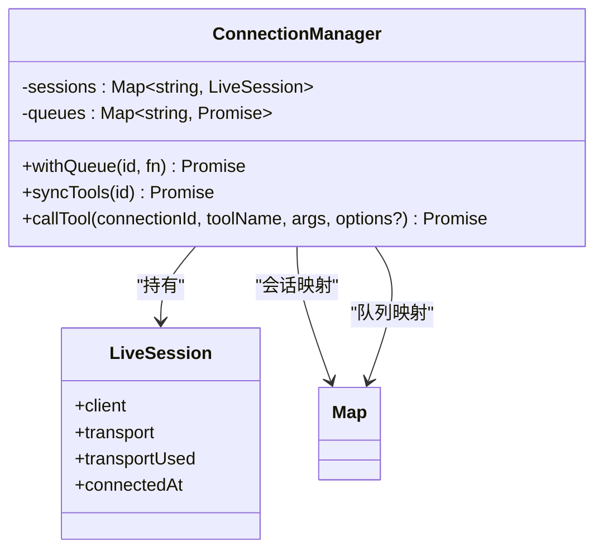
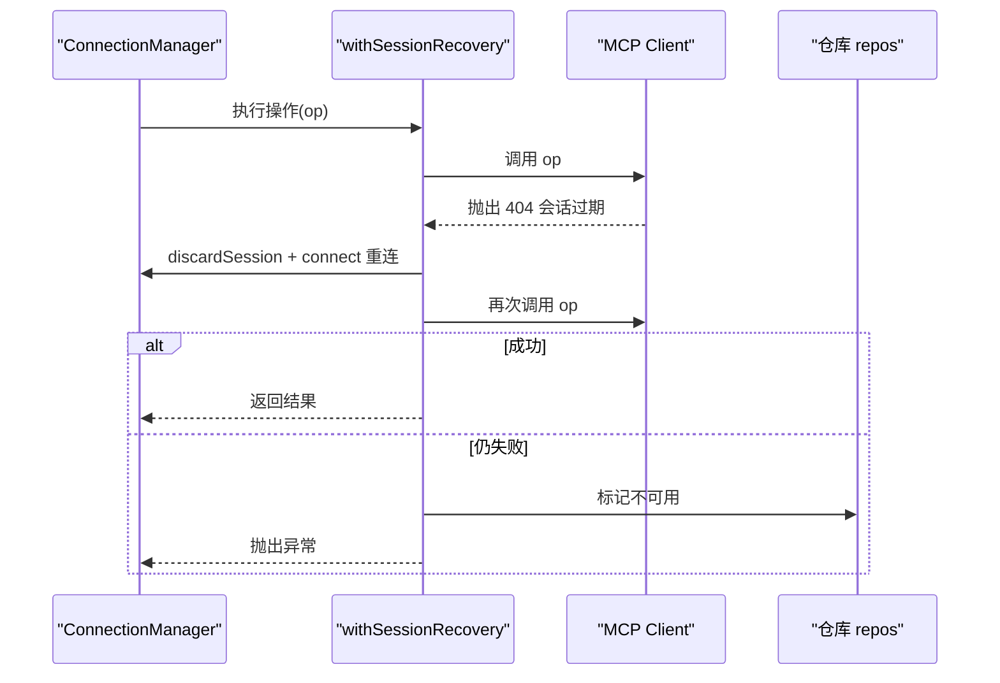
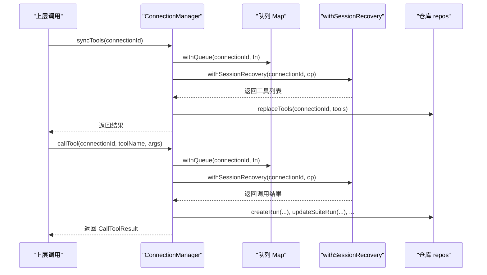
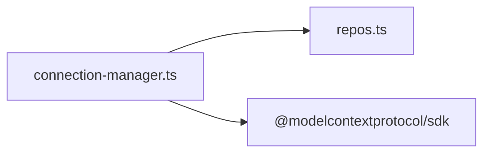

# 并发控制与队列管理

<cite>
**本文引用的文件**   
- [connection-manager.ts](file://apps/server/src/mcp/connection-manager.ts)
- [repos.ts](file://apps/server/src/db/repos.ts)
</cite>

## 目录
1. [简介](#简介)
2. [项目结构](#项目结构)
3. [核心组件](#核心组件)
4. [架构总览](#架构总览)
5. [详细组件分析](#详细组件分析)
6. [依赖关系分析](#依赖关系分析)
7. [性能考量](#性能考量)
8. [故障排查指南](#故障排查指南)
9. [结论](#结论)
10. [附录](#附录)

## 简介
本文件聚焦于服务端连接管理器中的并发控制与队列管理机制，重点解析 withQueue() 方法的实现原理，包括 Promise 链式排队、先进先出执行顺序、错误传播策略，以及 Map 数据结构在会话管理与队列管理中的应用。同时给出并发安全保证、资源竞争避免策略、典型并发场景测试思路与性能优化建议。

## 项目结构
与并发控制和队列管理直接相关的代码位于服务端的 MCP 连接管理器与数据库仓库层：
- 连接管理器负责维护每个连接的“会话”和“串行化队列”，并通过 withQueue() 对同一连接的所有操作进行串行化，避免并发访问导致的竞态与状态不一致。
- 仓库层提供数据持久化能力，被连接管理器在同步工具列表、记录调用结果等场景中调用。

图表来源
- [connection-manager.ts:39-41](file://apps/server/src/mcp/connection-manager.ts#L39-L41)
- [repos.ts:211-233](file://apps/server/src/db/repos.ts#L211-L233)

章节来源
- [connection-manager.ts:39-41](file://apps/server/src/mcp/connection-manager.ts#L39-L41)
- [repos.ts:211-233](file://apps/server/src/db/repos.ts#L211-L233)

## 核心组件
- ConnectionManager
  - sessions: Map<string, LiveSession> 用于缓存当前已建立的 MCP 客户端会话。
  - queues: Map<string, Promise<unknown>> 用于为每个连接 id 维护一个“串行化 Promise 链”，确保同一连接的操作按进入顺序依次执行。
  - withQueue(id, fn): 将 fn 包装进该连接对应的 Promise 链中，实现先进先出的串行执行。
  - withSessionRecovery(id, operation): 封装了会话失效后的自动重连与重试逻辑。
  - syncTools / callTool: 对外暴露的两种主要操作，均通过 withQueue 串行化。

章节来源
- [connection-manager.ts:39-67](file://apps/server/src/mcp/connection-manager.ts#L39-L67)
- [connection-manager.ts:209-268](file://apps/server/src/mcp/connection-manager.ts#L209-L268)
- [connection-manager.ts:270-298](file://apps/server/src/mcp/connection-manager.ts#L270-L298)
- [connection-manager.ts:300-379](file://apps/server/src/mcp/connection-manager.ts#L300-L379)

## 架构总览
下图展示了以连接维度进行串行化的整体流程：所有针对同一连接的操作都会进入其专属队列，按进入顺序依次执行；内部可能涉及会话恢复与重连，但对外仍保持单连接串行语义。

图表来源
- [connection-manager.ts:51-67](file://apps/server/src/mcp/connection-manager.ts#L51-L67)
- [connection-manager.ts:209-268](file://apps/server/src/mcp/connection-manager.ts#L209-L268)
- [connection-manager.ts:270-298](file://apps/server/src/mcp/connection-manager.ts#L270-L298)
- [connection-manager.ts:300-379](file://apps/server/src/mcp/connection-manager.ts#L300-L379)

## 详细组件分析

### withQueue() 方法详解
withQueue() 的核心思想是为每个连接 id 维护一条 Promise 链，新任务总是追加到链尾，从而天然实现先进先出（FIFO）的执行顺序。其关键步骤如下：
- 读取当前连接对应的上一个 Promise（若不存在则使用已解决的 Promise），作为“前序任务”。
- 构造一个新的 gate Promise，并在 finally 中释放它，表示当前任务结束。
- 将“前序任务.then(() => gate).catch(() => gate)”写回队列，确保无论前序成功还是失败，后续任务都能继续执行。
- 调用方 await prev.catch(() => undefined)，确保即使前序失败也不会阻塞当前任务的开始。
- 执行 fn()，并在 finally 中释放 gate，使下一个任务得以启动。

图表来源
- [connection-manager.ts:51-67](file://apps/server/src/mcp/connection-manager.ts#L51-L67)

章节来源
- [connection-manager.ts:51-67](file://apps/server/src/mcp/connection-manager.ts#L51-L67)

#### 并发安全与错误传播
- 并发安全
  - 同一连接 id 的任务严格串行，避免了共享状态（如 MCP 会话、请求上下文）的竞态条件。
  - 不同连接 id 的队列相互独立，互不影响，具备连接级别的隔离性。
- 错误传播
  - 前序任务失败不会导致后续任务被永久阻塞：catch 分支将 gate 重新挂入链中，保证后续任务可继续执行。
  - 当前任务内部的异常会正常向上传播，调用方可感知失败。
  - 由于 await prev.catch(() => undefined) 的存在，前序失败的异常不会污染当前任务的执行入口。

章节来源
- [connection-manager.ts:51-67](file://apps/server/src/mcp/connection-manager.ts#L51-L67)

### Map 数据结构的应用
- 会话管理 Map<string, LiveSession>
  - 键为连接 id，值为包含 client、transport、transportUsed、connectedAt 的会话对象。
  - 用于快速判断连接是否存活、获取当前会话、以及在需要时清理旧会话。
- 队列管理 Map<string, Promise<unknown>>
  - 键为连接 id，值为该连接对应的“Promise 链头”。
  - 每次进入 withQueue 都会基于该链头追加新的 gate，形成 FIFO 队列。

图表来源
- [connection-manager.ts:39-41](file://apps/server/src/mcp/connection-manager.ts#L39-L41)
- [connection-manager.ts:19-24](file://apps/server/src/mcp/connection-manager.ts#L19-L24)

章节来源
- [connection-manager.ts:39-41](file://apps/server/src/mcp/connection-manager.ts#L39-L41)
- [connection-manager.ts:19-24](file://apps/server/src/mcp/connection-manager.ts#L19-L24)

### 会话恢复与重连（withSessionRecovery）
- 当底层传输检测到会话过期（例如 StreamableHTTP 返回 404），会自动丢弃旧会话并重连。
- 重连成功后，会以新会话重试原操作；若重试仍失败且仍为会话过期，则标记不可用并向上抛出异常。
- 该机制与 withQueue 配合，确保在重连期间同一连接的其他任务不会被并发执行，避免重复建立会话或状态混乱。

图表来源
- [connection-manager.ts:175-195](file://apps/server/src/mcp/connection-manager.ts#L175-L195)
- [connection-manager.ts:197-207](file://apps/server/src/mcp/connection-manager.ts#L197-L207)
- [connection-manager.ts:209-268](file://apps/server/src/mcp/connection-manager.ts#L209-L268)

章节来源
- [connection-manager.ts:175-195](file://apps/server/src/mcp/connection-manager.ts#L175-L195)
- [connection-manager.ts:197-207](file://apps/server/src/mcp/connection-manager.ts#L197-L207)
- [connection-manager.ts:209-268](file://apps/server/src/mcp/connection-manager.ts#L209-L268)

### 典型调用路径：syncTools 与 callTool
- syncTools
  - 通过 withQueue 串行化，内部使用 withSessionRecovery 拉取工具列表，最后落库替换。
- callTool
  - 通过 withQueue 串行化，内部使用 withSessionRecovery 发起工具调用，结合超时控制与结果校验，落库记录运行结果。

图表来源
- [connection-manager.ts:270-298](file://apps/server/src/mcp/connection-manager.ts#L270-L298)
- [connection-manager.ts:300-379](file://apps/server/src/mcp/connection-manager.ts#L300-L379)
- [repos.ts:476-528](file://apps/server/src/db/repos.ts#L476-L528)
- [repos.ts:572-617](file://apps/server/src/db/repos.ts#L572-L617)

章节来源
- [connection-manager.ts:270-298](file://apps/server/src/mcp/connection-manager.ts#L270-L298)
- [connection-manager.ts:300-379](file://apps/server/src/mcp/connection-manager.ts#L300-L379)
- [repos.ts:476-528](file://apps/server/src/db/repos.ts#L476-L528)
- [repos.ts:572-617](file://apps/server/src/db/repos.ts#L572-L617)

## 依赖关系分析
- 模块内依赖
  - ConnectionManager 依赖仓库层 repos.ts 进行数据读写。
  - withQueue 仅依赖 JavaScript 运行时 Promise 语义，无外部库耦合。
- 外部依赖
  - MCP SDK 的 Client 与 Transport 由连接管理器创建与管理。
- 潜在循环依赖
  - 当前实现中，连接管理器单向依赖仓库层，未发现循环依赖。

图表来源
- [connection-manager.ts:1-17](file://apps/server/src/mcp/connection-manager.ts#L1-L17)
- [repos.ts:211-233](file://apps/server/src/db/repos.ts#L211-L233)

章节来源
- [connection-manager.ts:1-17](file://apps/server/src/mcp/connection-manager.ts#L1-L17)
- [repos.ts:211-233](file://apps/server/src/db/repos.ts#L211-L233)

## 性能考量
- 串行化带来的吞吐限制
  - withQueue 保证同一连接串行执行，避免并发冲突，但也限制了单连接的最大吞吐。对于高并发场景，可通过多连接并行来扩展吞吐。
- 内存占用
  - queues Map 中存储的是 Promise 引用，随着任务完成会被 GC 回收；sessions Map 同理。需关注长时间运行的任务对内存的影响。
- I/O 与网络抖动
  - 会话恢复与重连会增加额外延迟。建议在业务侧合理设置超时时间，并结合监控指标评估重连频率。
- 批处理与合并
  - 若存在大量短小任务，可在应用层考虑合并或批量提交，减少频繁的网络往返。

[本节为通用指导，不直接分析具体文件]

## 故障排查指南
- 现象：某连接的任务长期排队不动
  - 检查是否存在耗时极长的任务或死锁（例如未正确释放 gate）。
  - 确认前序任务是否因异常被 catch 后仍继续推进（当前实现已处理）。
- 现象：频繁触发会话恢复
  - 观察是否出现大量 404 错误，必要时调整连接复用策略或后端会话生命周期。
- 现象：超时频繁
  - 调整 callTool 的 timeoutMs 参数，或优化远端工具响应时间。
- 日志定位
  - 会话恢复相关事件会在控制台输出 JSON 日志，便于追踪重连阶段与失败原因。

章节来源
- [connection-manager.ts:209-268](file://apps/server/src/mcp/connection-manager.ts#L209-L268)
- [connection-manager.ts:300-379](file://apps/server/src/mcp/connection-manager.ts#L300-L379)

## 结论
- withQueue() 通过 Promise 链实现了连接维度的串行化，保证了先进先出与错误传播的正确性。
- Map 数据结构分别用于会话与队列管理，提供了 O(1) 的查找与更新能力，满足高并发下的性能需求。
- 与会话恢复机制协同工作，既保证了稳定性，又维持了单连接串行的强一致性语义。
- 在高并发场景下，应结合多连接并行、合理的超时与批处理策略，以获得更好的吞吐与用户体验。

[本节为总结性内容，不直接分析具体文件]

## 附录

### 并发场景测试建议
- 单连接多任务串行性
  - 在同一连接上并发发起多个 syncTools/callTool 调用，验证执行顺序与结果一致性。
- 错误传播与恢复
  - 模拟远端返回 404 会话过期，验证是否触发重连与重试，且后续任务不受影响。
- 超时行为
  - 设置较短的 timeoutMs，验证超时异常类型与状态码是否正确记录。
- 多连接并行
  - 对不同连接并发调用，验证它们之间互不干扰，且各自队列独立。

[本节为概念性内容，不直接分析具体文件]