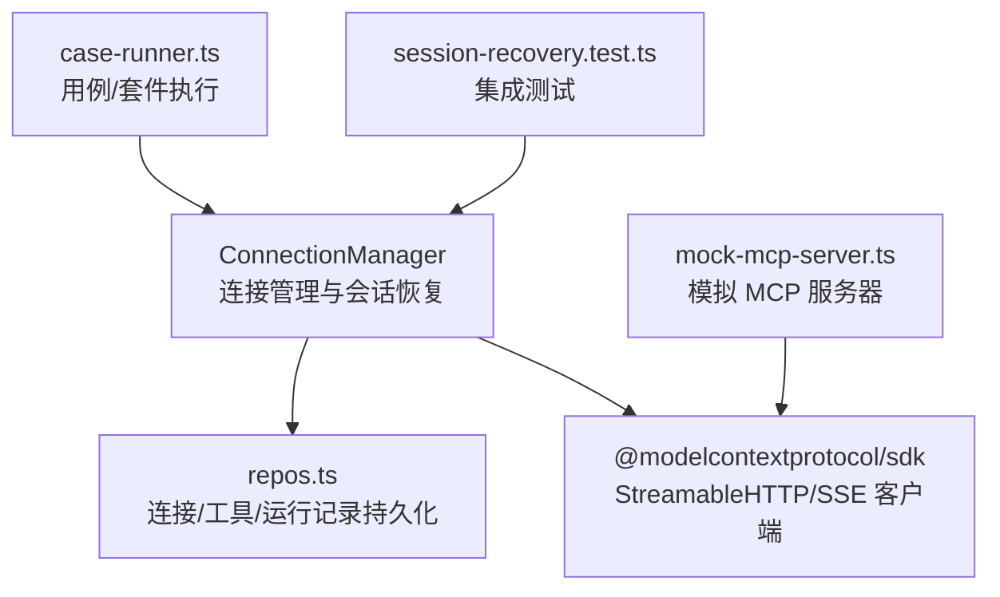
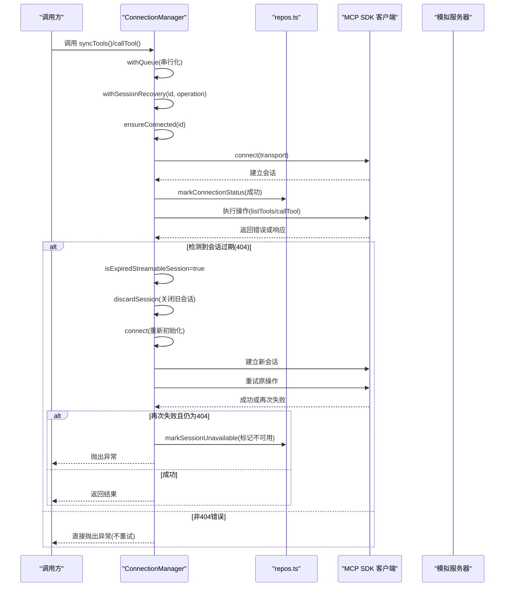
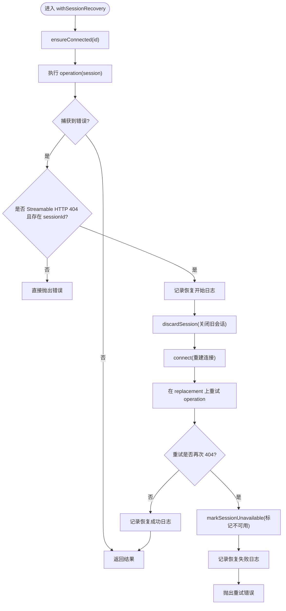
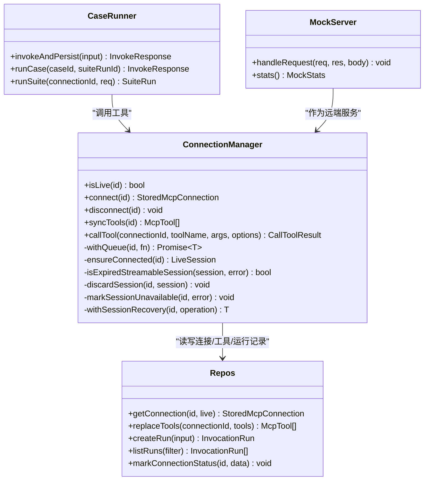

# 自动重连机制

<cite>
**本文引用的文件**   
- [connection-manager.ts](file://apps/server/src/mcp/connection-manager.ts)
- [repos.ts](file://apps/server/src/db/repos.ts)
- [session-recovery.test.ts](file://scripts/session-recovery.test.ts)
- [mock-mcp-server.ts](file://scripts/mock-mcp-server.ts)
- [case-runner.ts](file://apps/server/src/services/case-runner.ts)
</cite>

## 目录
1. [简介](#简介)
2. [项目结构](#项目结构)
3. [核心组件](#核心组件)
4. [架构总览](#架构总览)
5. [详细组件分析](#详细组件分析)
6. [依赖关系分析](#依赖关系分析)
7. [性能考量](#性能考量)
8. [故障排查指南](#故障排查指南)
9. [结论](#结论)
10. [附录](#附录)

## 简介
本文件聚焦于“自动重连机制”的实现与使用，围绕 withSessionRecovery() 方法展开，系统阐述会话过期检测、错误分类与处理策略；详细说明 Streamable HTTP 404 错误的识别逻辑与自动恢复流程；解释 discardSession() 的会话清理机制与 markSessionUnavailable() 的错误状态更新；并提供重连失败的处理策略与日志记录机制。文档同时给出具体错误场景分析与故障恢复示例，帮助读者快速定位问题并理解恢复路径。

## 项目结构
与自动重连相关的代码主要位于服务端模块：
- 连接管理与会话恢复：apps/server/src/mcp/connection-manager.ts
- 连接状态持久化与工具同步：apps/server/src/db/repos.ts
- 用例执行与套件运行（调用连接管理器）：apps/server/src/services/case-runner.ts
- 集成测试与模拟服务器：scripts/session-recovery.test.ts、scripts/mock-mcp-server.ts

图表来源
- [connection-manager.ts:1-383](file://apps/server/src/mcp/connection-manager.ts#L1-L383)
- [repos.ts:1-659](file://apps/server/src/db/repos.ts#L1-L659)
- [case-runner.ts:1-161](file://apps/server/src/services/case-runner.ts#L1-L161)
- [session-recovery.test.ts:1-293](file://scripts/session-recovery.test.ts#L1-L293)
- [mock-mcp-server.ts:1-283](file://scripts/mock-mcp-server.ts#L1-L283)

章节来源
- [connection-manager.ts:1-383](file://apps/server/src/mcp/connection-manager.ts#L1-L383)
- [repos.ts:1-659](file://apps/server/src/db/repos.ts#L1-L659)
- [case-runner.ts:1-161](file://apps/server/src/services/case-runner.ts#L1-L161)
- [session-recovery.test.ts:1-293](file://scripts/session-recovery.test.ts#L1-L293)
- [mock-mcp-server.ts:1-283](file://scripts/mock-mcp-server.ts#L1-L283)

## 核心组件
- ConnectionManager：封装 MCP 客户端连接、传输选择、会话生命周期管理、错误分类与自动重连。
- repos：负责连接信息、工具清单、用例与运行记录的持久化，提供连接状态标记接口。
- case-runner：编排用例与套件执行，调用连接管理器进行工具调用并持久化结果。
- mock-mcp-server：用于测试的模拟 MCP 服务器，支持多种会话失效与错误模式。
- session-recovery.test：覆盖会话恢复、404 识别、非重试错误、超时与工具错误等场景的集成测试。

章节来源
- [connection-manager.ts:1-383](file://apps/server/src/mcp/connection-manager.ts#L1-L383)
- [repos.ts:1-659](file://apps/server/src/db/repos.ts#L1-L659)
- [case-runner.ts:1-161](file://apps/server/src/services/case-runner.ts#L1-L161)
- [mock-mcp-server.ts:1-283](file://scripts/mock-mcp-server.ts#L1-L283)
- [session-recovery.test.ts:1-293](file://scripts/session-recovery.test.ts#L1-L293)

## 架构总览
自动重连的关键路径由 withSessionRecovery() 驱动，其内部协调 ensureConnected()、isExpiredStreamableSession()、discardSession()、connect() 与 markSessionUnavailable()，形成“检测—清理—重建—重试”的闭环。

图表来源
- [connection-manager.ts:175-268](file://apps/server/src/mcp/connection-manager.ts#L175-L268)
- [repos.ts:288-312](file://apps/server/src/db/repos.ts#L288-L312)
- [mock-mcp-server.ts:231-261](file://scripts/mock-mcp-server.ts#L231-L261)

## 详细组件分析

### withSessionRecovery() 实现要点
- 入口：withSessionRecovery(id, operation)
- 步骤：
  - 确保已连接：ensureConnected(id)
  - 执行操作：operation(session)
  - 捕获异常后判断是否为可恢复的会话过期：isExpiredStreamableSession(session, error)
  - 若可恢复：
    - 记录恢复开始日志
    - 清理旧会话：discardSession(id, session)
    - 尝试重建连接：connect(id)
    - 在新会话上重试 operation(replacement)
    - 若重试仍因 404 失败：
      - 清理替换会话
      - 标记连接不可用：markSessionUnavailable(id, retryError)
      - 记录恢复失败日志
      - 向上抛出错误
    - 若重试成功：
      - 记录恢复成功日志
      - 返回结果
  - 若非可恢复错误：直接向上抛出

图表来源
- [connection-manager.ts:209-268](file://apps/server/src/mcp/connection-manager.ts#L209-L268)

章节来源
- [connection-manager.ts:209-268](file://apps/server/src/mcp/connection-manager.ts#L209-L268)

### 会话过期检测：isExpiredStreamableSession()
- 仅对 streamable_http 传输生效
- 条件：
  - 当前会话 transportUsed 为 streamable_http
  - 错误类型为 StreamableHTTPError
  - 错误码为 404
  - 当前会话存在 sessionId（表明是已建立的会话而非首次创建）

该设计避免将首次连接阶段的 404 误判为“会话过期”，从而防止不必要的重建。

章节来源
- [connection-manager.ts:175-186](file://apps/server/src/mcp/connection-manager.ts#L175-L186)

### 错误分类与处理策略
- 可恢复错误：
  - Streamable HTTP 404 且存在 sessionId → 触发自动重连
- 不可恢复错误（不重试）：
  - 其他 HTTP 错误（如 401、500）
  - 工具级错误（tool_error）
  - 超时（timeout）
  - 网络/协议层异常（protocol_error）

上述分类在 callTool() 中体现为：
- 超时被识别为 TIMEOUT/AbortError 或消息包含 “timed out”
- 工具错误通过结构化响应的 isError 字段判定
- 其余异常统一归类为 protocol_error

章节来源
- [connection-manager.ts:300-379](file://apps/server/src/mcp/connection-manager.ts#L300-L379)
- [session-recovery.test.ts:213-245](file://scripts/session-recovery.test.ts#L213-L245)

### Streamable HTTP 404 识别与自动恢复流程
- 识别逻辑：
  - 客户端侧基于 SDK 抛出的 StreamableHTTPError.code === 404 并结合本地 sessionId 判断
- 自动恢复流程：
  - 丢弃旧会话（close 本地客户端）
  - 重新建立连接（根据配置优先 streamable_http，否则回退 sse）
  - 在新会话上重试原操作
  - 若再次 404，则标记连接不可用并抛出错误

章节来源
- [connection-manager.ts:175-268](file://apps/server/src/mcp/connection-manager.ts#L175-L268)
- [mock-mcp-server.ts:231-261](file://scripts/mock-mcp-server.ts#L231-L261)

### discardSession() 会话清理机制
- 从内存会话表中移除对应 id 的会话
- 关闭底层客户端（避免资源泄漏）
- 注意：不再发送 DELETE 请求以终止远端会话，因为远端已拒绝该 sessionId

章节来源
- [connection-manager.ts:188-195](file://apps/server/src/mcp/connection-manager.ts#L188-L195)

### markSessionUnavailable() 错误状态更新
- 将 lastConnectedAt 置空
- 将 lastError 设置为包含 HTTP 状态码与详细信息的字符串（例如 “HTTP 404: Session not found”）
- 通过 repos.markConnectionStatus() 持久化

章节来源
- [connection-manager.ts:197-207](file://apps/server/src/mcp/connection-manager.ts#L197-L207)
- [repos.ts:288-312](file://apps/server/src/db/repos.ts#L288-L312)

### 并发控制与队列
- withQueue(id, fn) 保证同一连接的操作串行执行，避免竞态导致的重复重建或状态不一致
- 适用于 syncTools() 与 callTool() 等关键路径

章节来源
- [connection-manager.ts:51-67](file://apps/server/src/mcp/connection-manager.ts#L51-L67)
- [connection-manager.ts:270-298](file://apps/server/src/mcp/connection-manager.ts#L270-L298)
- [connection-manager.ts:300-379](file://apps/server/src/mcp/connection-manager.ts#L300-L379)

### 用例与套件执行中的重连行为
- runSuite() 并行执行多个用例，每个用例通过 invokeAndPersist() 调用 connectionManager.callTool()
- 当某个用例遇到 404 时，withSessionRecovery() 会尝试一次自动重连并重试该用例
- 若再次 404，则标记连接不可用，该用例失败计入套件统计
- 最终套件状态根据断言与错误情况汇总

章节来源
- [case-runner.ts:111-161](file://apps/server/src/services/case-runner.ts#L111-L161)
- [case-runner.ts:11-77](file://apps/server/src/services/case-runner.ts#L11-L77)
- [session-recovery.test.ts:174-195](file://scripts/session-recovery.test.ts#L174-L195)

## 依赖关系分析
- ConnectionManager 依赖：
  - @modelcontextprotocol/sdk：StreamableHTTPClientTransport、SSEClientTransport、StreamableHTTPError
  - repos：连接状态、工具清单、运行记录持久化
  - schema-validate：输出结构校验
- repos 依赖：
  - drizzle-orm：数据库访问
  - util/id：JSON 序列化、时间戳、ID 生成
- case-runner 依赖：
  - connectionManager：工具调用
  - repos：用例与运行记录
- mock-mcp-server：
  - 模拟 StreamableHTTPServerTransport，支持 expire-once、reject-requests、http-401、http-500 等模式

图表来源
- [connection-manager.ts:1-383](file://apps/server/src/mcp/connection-manager.ts#L1-L383)
- [repos.ts:1-659](file://apps/server/src/db/repos.ts#L1-L659)
- [case-runner.ts:1-161](file://apps/server/src/services/case-runner.ts#L1-L161)
- [mock-mcp-server.ts:1-283](file://scripts/mock-mcp-server.ts#L1-L283)

章节来源
- [connection-manager.ts:1-383](file://apps/server/src/mcp/connection-manager.ts#L1-L383)
- [repos.ts:1-659](file://apps/server/src/db/repos.ts#L1-L659)
- [case-runner.ts:1-161](file://apps/server/src/services/case-runner.ts#L1-L161)
- [mock-mcp-server.ts:1-283](file://scripts/mock-mcp-server.ts#L1-L283)

## 性能考量
- 串行队列：withQueue 避免同一连接的并发重建，减少不必要的开销与竞争条件
- 最小化重建：仅在确认为 404 且存在 sessionId 时触发重建，避免首建阶段误判
- 单次重试：withSessionRecovery 对同一操作最多重试一次，降低雪崩风险
- 资源释放：discardSession 立即关闭本地客户端，避免资源泄漏
- 幂等性：syncTools 每次都会全量替换工具清单，适合在会话重建后安全执行

[本节为通用指导，无需特定文件引用]

## 故障排查指南
- 常见错误场景与表现
  - 首次连接即 404：不会触发自动重连，直接抛出连接错误
  - 已建立会话后出现 404：触发自动重连与一次重试；若再次 404，连接标记为不可用
  - 401/500：不触发重连，直接返回 protocol_error
  - 工具错误与超时：不触发重连，分别返回 tool_error 与 timeout
- 日志事件
  - mcp_session_recovery_started：会话恢复开始
  - mcp_session_recovery_failed：恢复失败（含 stage: initialize 或 retry）
  - mcp_session_recovery_succeeded：恢复成功
- 检查点
  - 查看连接 lastError 是否包含 “HTTP 404”
  - 确认 isLive(id) 状态
  - 核对 mock 服务器的 stats（initializedSessions、sessionNotFoundResponses）
- 复现建议
  - 使用 expire-once 模式：首次 404 后应自动恢复
  - 使用 reject-requests 模式：连续 404 导致连接不可用
  - 使用 http-401/http-500 模式：不应触发重连

章节来源
- [connection-manager.ts:209-268](file://apps/server/src/mcp/connection-manager.ts#L209-L268)
- [session-recovery.test.ts:197-228](file://scripts/session-recovery.test.ts#L197-L228)
- [mock-mcp-server.ts:231-261](file://scripts/mock-mcp-server.ts#L231-L261)

## 结论
自动重连机制通过精准的 404 会话过期检测、严格的错误分类与一次重试策略，在保证稳定性的前提下实现了高效的会话恢复。配合队列串行化与完善的日志记录，系统在复杂网络与服务端波动环境下仍能保持较好的可用性。对于持续 404 的场景，系统及时标记连接不可用，避免无效重试带来的额外负载。

[本节为总结性内容，无需特定文件引用]

## 附录

### 关键 API 与数据流参考
- withSessionRecovery(id, operation)
  - 输入：连接 id、待执行操作
  - 输出：操作结果或抛出异常
- discardSession(id, session)
  - 作用：清理本地会话并关闭客户端
- markSessionUnavailable(id, error)
  - 作用：持久化连接不可用状态与错误详情
- repos.markConnectionStatus(id, data)
  - 作用：更新 lastConnectedAt、lastError、serverInfo

章节来源
- [connection-manager.ts:188-207](file://apps/server/src/mcp/connection-manager.ts#L188-L207)
- [repos.ts:288-312](file://apps/server/src/db/repos.ts#L288-L312)