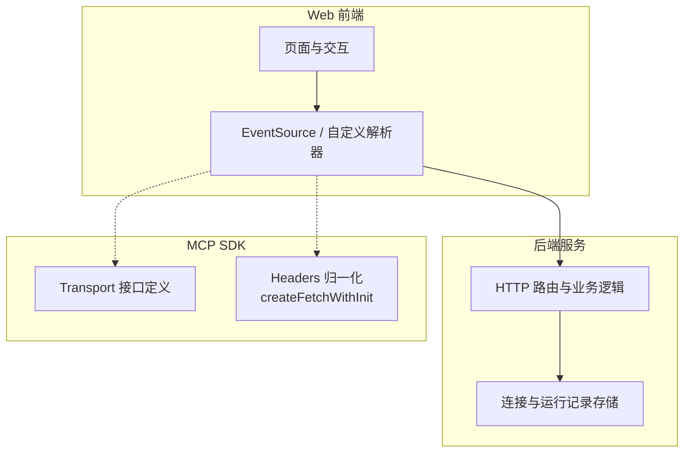
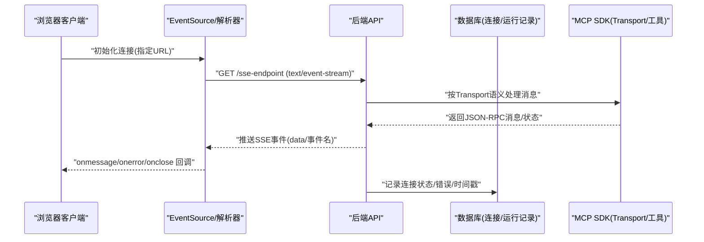
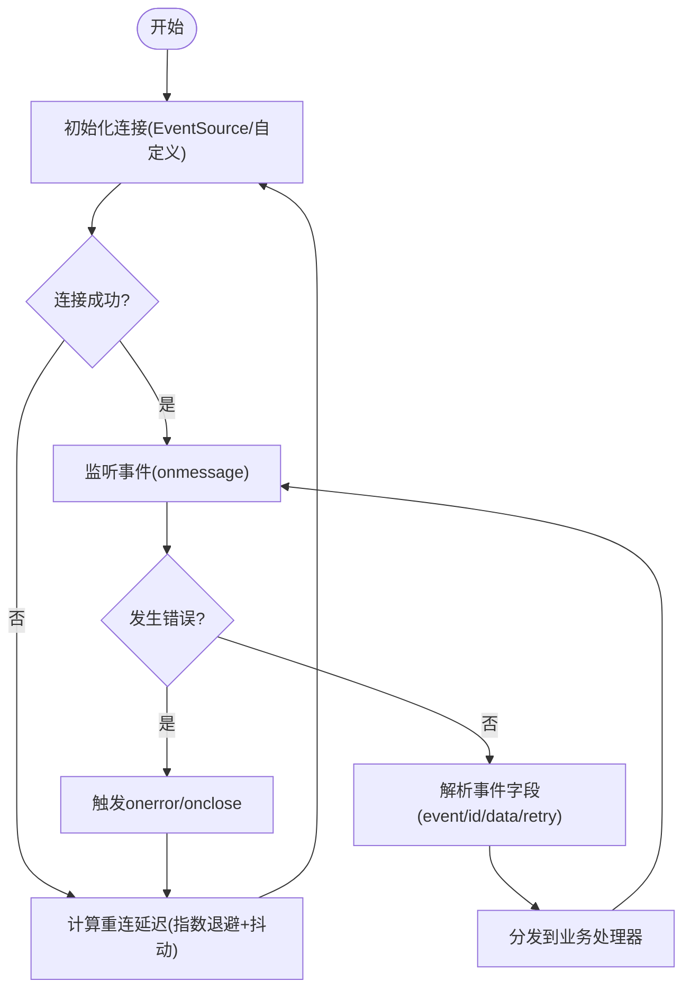
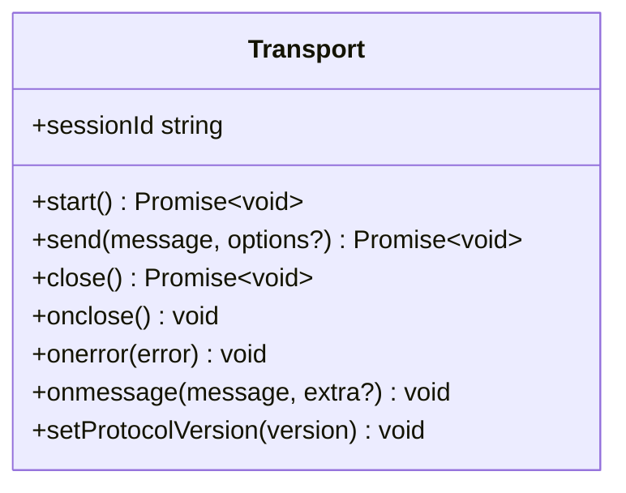
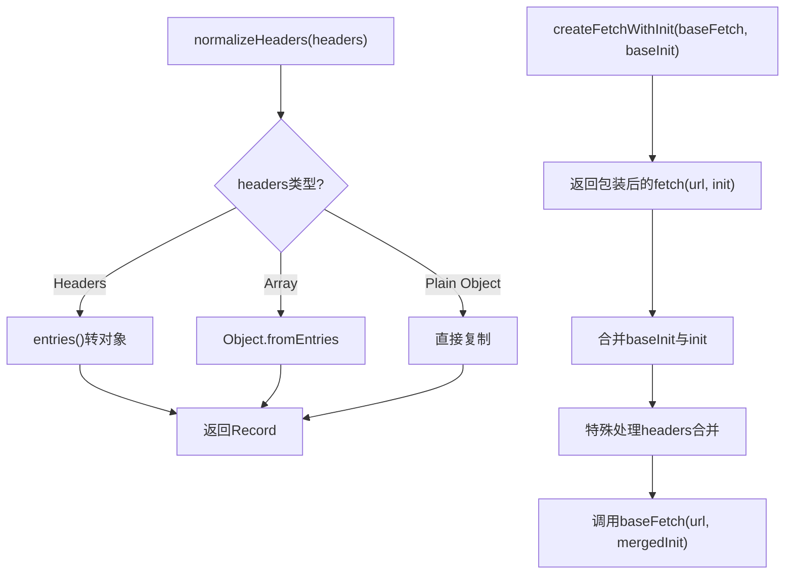
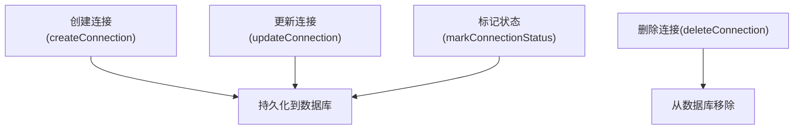
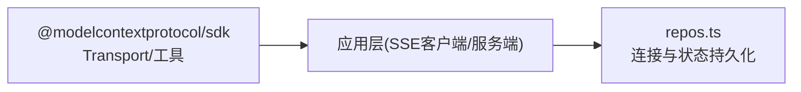

# SSE 协议

<cite>
**本文引用的文件**   
- [package.json](file://package.json)
- [transport.d.ts](file://node_modules/@modelcontextprotocol/sdk/dist/esm/shared/transport.d.ts)
- [transport.js](file://node_modules/@modelcontextprotocol/sdk/dist/esm/shared/transport.js)
- [repos.ts](file://apps/server/src/db/repos.ts)
</cite>

## 目录
1. [简介](#简介)
2. [项目结构](#项目结构)
3. [核心组件](#核心组件)
4. [架构总览](#架构总览)
5. [详细组件分析](#详细组件分析)
6. [依赖分析](#依赖分析)
7. [性能考虑](#性能考虑)
8. [故障排查指南](#故障排查指南)
9. [结论](#结论)
10. [附录](#附录)

## 简介
本文件围绕 Server-Sent Events（SSE）协议，结合仓库中 MCP SDK 的传输抽象与连接持久化能力，系统性阐述：
- SSE 事件流、连接管理与重连策略
- 基于 MCP Transport 接口的客户端传输配置与事件处理要点
- 与服务器的实时通信模式与数据推送机制
- 连接建立、事件监听与错误处理的实践建议
- 网络兼容性、浏览器支持与性能优化建议

本项目在包描述中明确支持“Streamable HTTP 和 SSE”，并通过 MCP SDK 提供统一的 Transport 接口，便于在不同传输层（包括 SSE）上实现一致的请求/响应与消息收发。

章节来源
- [package.json:1-26](file://package.json#L1-L26)

## 项目结构
从仓库结构看，SSE 相关能力主要来源于以下方面：
- 应用层：服务端数据库与连接状态管理（用于记录连接信息、超时、错误等）
- SDK 层：MCP SDK 提供的 Transport 抽象与通用工具（如 Headers 归一化、带基础配置的 fetch 包装）
- Web 前端：通过浏览器 EventSource 或自定义 fetch + text/event-stream 解析器消费 SSE 事件

图表来源
- [transport.d.ts:41-88](file://node_modules/@modelcontextprotocol/sdk/dist/esm/shared/transport.d.ts#L41-L88)
- [transport.js:5-38](file://node_modules/@modelcontextprotocol/sdk/dist/esm/shared/transport.js#L5-L38)
- [repos.ts:235-312](file://apps/server/src/db/repos.ts#L235-L312)

章节来源
- [transport.d.ts:41-88](file://node_modules/@modelcontextprotocol/sdk/dist/esm/shared/transport.d.ts#L41-L88)
- [transport.js:5-38](file://node_modules/@modelcontextprotocol/sdk/dist/esm/shared/transport.js#L5-L38)
- [repos.ts:235-312](file://apps/server/src/db/repos.ts#L235-L312)

## 核心组件
- Transport 接口：定义了 start/send/close 以及 onmessage/onerror/onclose 回调契约，是上层统一接入不同传输（含 SSE）的基础。
- 通用工具：
  - normalizeHeaders：将多种 Headers 输入格式归一化为普通对象，便于合并与覆盖。
  - createFetchWithInit：为每次请求注入基础 RequestInit，并正确合并 headers。
- 连接与状态持久化：
  - repos.ts 提供连接的创建、更新、删除与状态标记（最近连接时间、错误信息、服务器信息等），可用于记录 SSE 连接生命周期与诊断。

章节来源
- [transport.d.ts:41-88](file://node_modules/@modelcontextprotocol/sdk/dist/esm/shared/transport.d.ts#L41-L88)
- [transport.js:5-38](file://node_modules/@modelcontextprotocol/sdk/dist/esm/shared/transport.js#L5-L38)
- [repos.ts:235-312](file://apps/server/src/db/repos.ts#L235-L312)

## 架构总览
下图展示基于 SSE 的端到端数据流：浏览器侧使用 EventSource 或自定义解析器订阅服务器的事件流；服务端根据 MCP Transport 语义处理 JSON-RPC 消息，并将结果以 SSE 事件形式推送；连接状态与错误信息可落库以便追踪。

图表来源
- [transport.d.ts:41-88](file://node_modules/@modelcontextprotocol/sdk/dist/esm/shared/transport.d.ts#L41-L88)
- [transport.js:5-38](file://node_modules/@modelcontextprotocol/sdk/dist/esm/shared/transport.js#L5-L38)
- [repos.ts:235-312](file://apps/server/src/db/repos.ts#L235-L312)

## 详细组件分析

### SSE 事件流与连接管理
- 事件流模型
  - 服务器持续输出文本事件流，每条事件包含字段（如 event、id、data、retry）。
  - 客户端按行解析，遇到空行表示一条事件结束。
- 连接管理
  - 使用 EventSource 时，自动处理 keep-alive 与断线重连。
  - 若使用自定义解析器，需自行维护心跳、超时与重连逻辑。
- 重连策略
  - 当服务器返回 retry 字段时，客户端应在该毫秒数后重试。
  - 若无 retry，客户端应使用指数退避与抖动策略，避免雪崩。
  - 建议在重连前清理旧资源，避免重复处理与内存泄漏。

[本节为概念性说明，不直接分析具体文件]

### MCP Transport 接口与 SSE 适配
- Transport 接口职责
  - start：启动传输层（例如建立 SSE 连接并开始读取事件流）。
  - send：发送 JSON-RPC 消息（在 SSE 场景下通常通过独立的 HTTP 请求或复用同一连接的双向通道）。
  - close：关闭连接并释放资源。
  - onmessage/onerror/onclose：接收消息、错误与连接关闭回调。
- 与 SSE 的映射
  - onmessage 对应 SSE 的 data 事件内容（通常为 JSON-RPC 消息）。
  - onerror/onclose 对应网络异常或服务端主动关闭。
  - sessionId/setProtocolVersion 可用于会话标识与协议版本协商。

图表来源
- [transport.d.ts:41-88](file://node_modules/@modelcontextprotocol/sdk/dist/esm/shared/transport.d.ts#L41-L88)

章节来源
- [transport.d.ts:41-88](file://node_modules/@modelcontextprotocol/sdk/dist/esm/shared/transport.d.ts#L41-L88)

### 通用工具：Headers 归一化与 fetch 包装
- normalizeHeaders
  - 支持 Headers 对象、数组元组与普通对象，统一转换为 Record<string,string>，便于后续合并与覆盖。
- createFetchWithInit
  - 为每次请求注入基础 RequestInit，并在合并 headers 时采用“浅合并”策略，确保调用方传入的 headers 能覆盖默认值。

图表来源
- [transport.js:5-38](file://node_modules/@modelcontextprotocol/sdk/dist/esm/shared/transport.js#L5-L38)

章节来源
- [transport.js:5-38](file://node_modules/@modelcontextprotocol/sdk/dist/esm/shared/transport.js#L5-L38)

### 连接与状态持久化（服务端）
- 连接记录
  - 支持创建、更新、删除连接，记录 transport、url、headers、timeoutMs、enabled 等。
- 状态标记
  - markConnectionStatus 可写入 lastConnectedAt、lastError、serverInfo，便于诊断与监控。
- 与 SSE 的关系
  - 在 SSE 连接建立、断开或出错时，调用上述方法更新状态，有助于定位问题与统计可用性。

图表来源
- [repos.ts:235-312](file://apps/server/src/db/repos.ts#L235-L312)

章节来源
- [repos.ts:235-312](file://apps/server/src/db/repos.ts#L235-L312)

### 实时通信模式与数据推送机制
- 单向推送（推荐）
  - 服务器通过 SSE 推送 JSON-RPC 响应或进度事件，客户端仅订阅，无需反向写。
- 双向协作
  - 对于需要客户端发起的请求，可通过独立 HTTP 接口发送 JSON-RPC 请求，服务器在处理完成后通过 SSE 推送结果。
- 事件命名与幂等
  - 建议使用稳定的事件名（如 message、progress、done、error），并为关键事件携带 id，便于去重与恢复。

[本节为概念性说明，不直接分析具体文件]

## 依赖分析
- 外部依赖
  - @modelcontextprotocol/sdk：提供 Transport 接口与通用工具，作为传输层抽象的核心。
- 内部依赖
  - apps/server 的 repos.ts：负责连接与运行记录的持久化，支撑 SSE 连接的生命周期管理。
- 耦合与内聚
  - Transport 接口与 SSE 实现解耦，便于替换或扩展其他传输方式。
  - 工具函数（normalizeHeaders、createFetchWithInit）具备高内聚与低耦合特性，可在多处复用。

图表来源
- [transport.d.ts:41-88](file://node_modules/@modelcontextprotocol/sdk/dist/esm/shared/transport.d.ts#L41-L88)
- [transport.js:5-38](file://node_modules/@modelcontextprotocol/sdk/dist/esm/shared/transport.js#L5-L38)
- [repos.ts:235-312](file://apps/server/src/db/repos.ts#L235-L312)

章节来源
- [transport.d.ts:41-88](file://node_modules/@modelcontextprotocol/sdk/dist/esm/shared/transport.d.ts#L41-L88)
- [transport.js:5-38](file://node_modules/@modelcontextprotocol/sdk/dist/esm/shared/transport.js#L5-L38)
- [repos.ts:235-312](file://apps/server/src/db/repos.ts#L235-L312)

## 性能考虑
- 事件粒度
  - 合理拆分事件，避免单条 data 过大导致解析与渲染压力。
- 批处理与节流
  - 对高频事件进行批处理或节流，减少 UI 刷新频率。
- 连接复用
  - 尽量复用单一 SSE 连接，避免频繁建立/销毁带来的开销。
- 头部合并与缓存
  - 使用 createFetchWithInit 合并基础请求头，减少重复配置；必要时启用浏览器缓存策略（针对非实时数据）。
- 错误快速失败
  - 设置合理的超时与重试上限，避免长时间阻塞。

[本节为通用指导，不直接分析具体文件]

## 故障排查指南
- 常见问题
  - 跨域问题：确保服务端允许跨域，且 Content-Type 为 text/event-stream。
  - 认证与鉴权：通过 headers 传递 token，并使用 normalizeHeaders 与 createFetchWithInit 正确合并。
  - 重连风暴：检查是否设置了合理的 retry 与指数退避，避免大量客户端同时重连。
- 诊断手段
  - 查看连接状态：通过 repos.ts 的 markConnectionStatus 记录 lastError 与 lastConnectedAt。
  - 日志与指标：在服务端记录 SSE 连接建立、断开与错误堆栈。
- 恢复策略
  - 使用 resumptionToken（TransportSendOptions）配合服务端支持，实现长任务中断后的续传。

章节来源
- [transport.d.ts:20-37](file://node_modules/@modelcontextprotocol/sdk/dist/esm/shared/transport.d.ts#L20-L37)
- [repos.ts:288-312](file://apps/server/src/db/repos.ts#L288-L312)

## 结论
通过将 SSE 事件流与 MCP Transport 抽象相结合，可以在保持传输无关性的前提下，实现稳定、可扩展的实时通信。借助通用的 Headers 归一化与 fetch 包装工具，能够简化认证与请求配置；通过连接状态持久化，提升可观测性与排障效率。遵循本文的重连策略与性能建议，可在复杂网络环境下获得良好的用户体验。

[本节为总结性内容，不直接分析具体文件]

## 附录

### 示例参考路径（不含代码）
- 连接建立与事件监听
  - 参考：浏览器 EventSource 的使用方式与 onmessage/onerror/onclose 回调
  - 参考：Transport.start/onmessage/onerror/onclose 的调用顺序
- 错误处理与重连
  - 参考：TransportSendOptions.resumptionToken 与 onresumptiontoken 的使用
  - 参考：repos.ts 中 markConnectionStatus 的错误与时间戳记录

章节来源
- [transport.d.ts:20-37](file://node_modules/@modelcontextprotocol/sdk/dist/esm/shared/transport.d.ts#L20-L37)
- [transport.d.ts:41-88](file://node_modules/@modelcontextprotocol/sdk/dist/esm/shared/transport.d.ts#L41-L88)
- [repos.ts:288-312](file://apps/server/src/db/repos.ts#L288-L312)