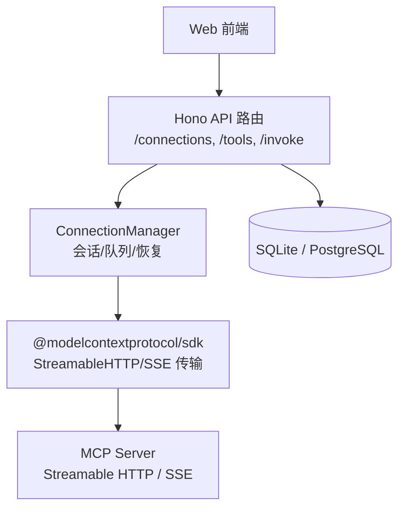
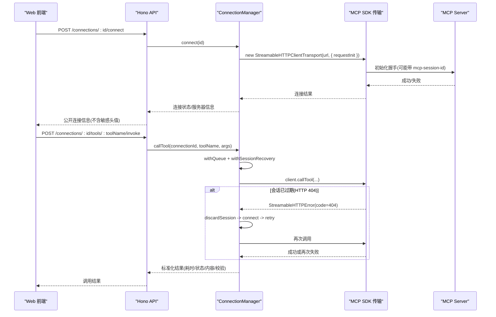
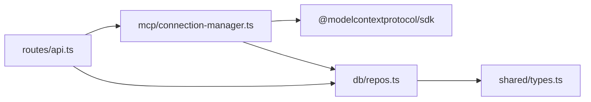

# Streamable HTTP 协议

<cite>
**本文引用的文件**   
- [README.md](file://README.md)
- [connection-manager.ts](file://apps/server/src/mcp/connection-manager.ts)
- [api.ts](file://apps/server/src/routes/api.ts)
- [repos.ts](file://apps/server/src/db/repos.ts)
- [types.ts](file://packages/shared/src/types.ts)
- [session-recovery.test.ts](file://scripts/session-recovery.test.ts)
</cite>

## 目录
1. [简介](#简介)
2. [项目结构](#项目结构)
3. [核心组件](#核心组件)
4. [架构总览](#架构总览)
5. [详细组件分析](#详细组件分析)
6. [依赖关系分析](#依赖关系分析)
7. [性能特征与优化建议](#性能特征与优化建议)
8. [故障排查指南](#故障排查指南)
9. [结论](#结论)
10. [附录：示例与最佳实践](#附录示例与最佳实践)

## 简介
本文件围绕 Streamable HTTP 传输在 MCP（Model Context Protocol）中的工作方式，结合代码库实现，系统阐述会话管理、状态保持与错误处理机制；详细说明 StreamableHTTPClientTransport 的配置选项与使用方式；解释会话 ID 管理机制与会话过期处理；并提供连接建立、工具调用与会话恢复的完整流程说明。最后给出性能特征分析、适用场景建议和最佳实践指南。

## 项目结构
本项目采用前后端分离与多包工作区组织：
- 后端 API 基于 Hono，提供连接、工具同步、调用、用例与套件执行等接口
- MCP 客户端封装于 ConnectionManager，负责创建与管理 MCP 连接、会话生命周期与重试/恢复逻辑
- 数据库层通过 Drizzle ORM 抽象 SQLite/PostgreSQL，持久化连接、工具、用例与运行记录
- 共享类型定义位于 shared 包，统一前后端契约

图表来源
- [api.ts:18-120](file://apps/server/src/routes/api.ts#L18-L120)
- [connection-manager.ts:39-173](file://apps/server/src/mcp/connection-manager.ts#L39-L173)
- [repos.ts:235-312](file://apps/server/src/db/repos.ts#L235-L312)

章节来源
- [README.md:145-156](file://README.md#L145-L156)
- [api.ts:18-120](file://apps/server/src/routes/api.ts#L18-L120)
- [connection-manager.ts:39-173](file://apps/server/src/mcp/connection-manager.ts#L39-L173)
- [repos.ts:235-312](file://apps/server/src/db/repos.ts#L235-L312)

## 核心组件
- ConnectionManager：维护进程内会话 Map、请求队列、超时控制、会话恢复与错误标记
- API 路由：暴露连接管理、工具同步、工具调用、用例与套件执行等 REST 接口
- 数据仓库 repos：连接/工具/用例/运行记录的增删改查与状态持久化
- 共享类型 types：统一传输类型、运行状态、断言配置、内容项等数据结构

章节来源
- [connection-manager.ts:39-173](file://apps/server/src/mcp/connection-manager.ts#L39-L173)
- [api.ts:40-138](file://apps/server/src/routes/api.ts#L40-L138)
- [repos.ts:235-312](file://apps/server/src/db/repos.ts#L235-L312)
- [types.ts:1-120](file://packages/shared/src/types.ts#L1-L120)

## 架构总览
Streamable HTTP 是 MCP 的一种传输模式，支持基于 HTTP 的请求/响应式交互并携带会话上下文。在本项目中：
- 客户端通过 StreamableHTTPClientTransport 发起连接与后续调用
- 服务端返回 404 表示会话失效，客户端自动重建会话并重试一次
- 所有连接状态、错误信息与服务器能力信息均持久化到数据库

图表来源
- [connection-manager.ts:75-147](file://apps/server/src/mcp/connection-manager.ts#L75-L147)
- [connection-manager.ts:175-268](file://apps/server/src/mcp/connection-manager.ts#L175-L268)
- [connection-manager.ts:300-379](file://apps/server/src/mcp/connection-manager.ts#L300-L379)
- [api.ts:77-138](file://apps/server/src/routes/api.ts#L77-L138)

## 详细组件分析

### StreamableHTTPClientTransport 配置与使用
- 构造参数
  - url：MCP 服务地址
  - requestInit：包含 headers 等请求初始化选项
- 关键行为
  - 首次连接时由 SDK 生成并维护 sessionId，并在后续请求中附加 mcp-session-id
  - 当服务端返回 404 且存在 sessionId 时，视为会话过期
  - 支持 terminateSession 用于显式终止会话（断开时尝试清理）

章节来源
- [connection-manager.ts:75-99](file://apps/server/src/mcp/connection-manager.ts#L75-L99)
- [connection-manager.ts:154-164](file://apps/server/src/mcp/connection-manager.ts#L154-L164)
- [connection-manager.ts:175-186](file://apps/server/src/mcp/connection-manager.ts#L175-L186)

### 会话管理与状态保持
- 进程内会话 Map：以连接 id 为键，保存 Client、Transport、使用的传输类型与连接时间
- 请求队列：同一连接串行化，避免并发导致的状态不一致
- 状态持久化：
  - lastConnectedAt、lastError、serverInfo 随连接/错误更新写入数据库
  - 公开接口仅返回 headerNames，不泄露实际 Header 值

章节来源
- [connection-manager.ts:39-67](file://apps/server/src/mcp/connection-manager.ts#L39-L67)
- [repos.ts:288-312](file://apps/server/src/db/repos.ts#L288-L312)
- [api.ts:24-30](file://apps/server/src/routes/api.ts#L24-L30)

### 错误处理与会话恢复
- 过期判定：仅对 streamable_http 传输生效，需满足“存在 sessionId”且“错误类型为 StreamableHTTPError 且 code=404”
- 恢复流程：
  - 丢弃旧会话并关闭本地 transport
  - 重新 connect 获取新会话
  - 最多重试一次；若再次 404，则标记不可用并抛出错误
- 非 404 错误（如 401、500）不进行会话恢复
- 工具错误与超时不会触发会话恢复

章节来源
- [connection-manager.ts:175-268](file://apps/server/src/mcp/connection-manager.ts#L175-L268)
- [connection-manager.ts:300-379](file://apps/server/src/mcp/connection-manager.ts#L300-L379)
- [session-recovery.test.ts:197-228](file://scripts/session-recovery.test.ts#L197-L228)

### 工具调用与超时控制
- 超时策略：基于 AbortController 与 setTimeout 竞争 Promise.race，默认超时来自连接配置，可被 options 覆盖
- 结果标准化：
  - 区分 success/tool_error/timeout/protocol_error
  - 记录 content、structuredContent、schemaValidation、rawResponse 与 protocolError
- 幂等性：同一连接串行执行，避免并发导致的副作用

章节来源
- [connection-manager.ts:300-379](file://apps/server/src/mcp/connection-manager.ts#L300-L379)
- [types.ts:5-12](file://packages/shared/src/types.ts#L5-L12)

### 会话 ID 管理机制
- 会话 ID 由 SDK 内部维护，并通过 mcp-session-id 头传递
- 客户端侧不直接读写 sessionId，而是通过 isExpiredStreamableSession 间接判断是否过期
- 过期后重建会话，新的 sessionId 由 SDK 在下次连接时分配

章节来源
- [connection-manager.ts:175-186](file://apps/server/src/mcp/connection-manager.ts#L175-L186)

### 安全与隐私
- 连接 API 返回的 McpConnection 不包含 headers 字段，仅提供 headerNames
- 导出/导入功能会包含完整凭据，应谨慎保管

章节来源
- [api.ts:24-30](file://apps/server/src/routes/api.ts#L24-L30)
- [types.ts:54-70](file://packages/shared/src/types.ts#L54-L70)
- [session-recovery.test.ts:247-291](file://scripts/session-recovery.test.ts#L247-L291)

## 依赖关系分析
- API 路由依赖 ConnectionManager 进行 MCP 操作
- ConnectionManager 依赖 MCP SDK 的 StreamableHTTP/SSE 传输
- 数据仓库 repos 提供连接/工具/用例/运行记录的持久化
- 共享类型 types 贯穿前后端与测试脚本

图表来源
- [api.ts:18-138](file://apps/server/src/routes/api.ts#L18-L138)
- [connection-manager.ts:1-18](file://apps/server/src/mcp/connection-manager.ts#L1-L18)
- [repos.ts:1-24](file://apps/server/src/db/repos.ts#L1-L24)
- [types.ts:1-20](file://packages/shared/src/types.ts#L1-L20)

章节来源
- [api.ts:18-138](file://apps/server/src/routes/api.ts#L18-L138)
- [connection-manager.ts:1-18](file://apps/server/src/mcp/connection-manager.ts#L1-L18)
- [repos.ts:1-24](file://apps/server/src/db/repos.ts#L1-L24)
- [types.ts:1-20](file://packages/shared/src/types.ts#L1-L20)

## 性能特征与优化建议
- 串行化执行：同一连接内的操作通过队列串行，避免并发冲突，提升一致性但降低吞吐
- 超时控制：默认 60s，可按连接或调用设置更短超时，减少长尾等待
- 会话恢复：仅在 404 时触发，最多重试一次，避免无限重试带来的雪崩风险
- 建议
  - 合理设置 timeoutMs，避免阻塞队列
  - 对高频调用场景，考虑按业务维度拆分连接，降低单连接压力
  - 监控 lastError 与 serverInfo，及时发现服务端异常

章节来源
- [connection-manager.ts:51-67](file://apps/server/src/mcp/connection-manager.ts#L51-L67)
- [connection-manager.ts:300-379](file://apps/server/src/mcp/connection-manager.ts#L300-L379)
- [connection-manager.ts:175-268](file://apps/server/src/mcp/connection-manager.ts#L175-L268)

## 故障排查指南
- 常见错误分类
  - 协议错误：网络/鉴权/服务端异常，status=protocol_error
  - 工具错误：业务层面 isError=true，status=tool_error
  - 超时：超过 timeoutMs，status=timeout
  - 会话过期：HTTP 404 且存在 sessionId，自动恢复一次
- 定位步骤
  - 查看连接 lastError 与 serverInfo
  - 检查调用结果中的 protocolError 与 rawResponse
  - 确认是否为 404 导致的会话过期，观察是否触发了恢复日志
- 参考测试
  - 会话恢复与公开连接安全性验证覆盖了 404 恢复、非 404 不恢复、工具错误与超时不恢复、以及头部泄露防护

章节来源
- [connection-manager.ts:175-268](file://apps/server/src/mcp/connection-manager.ts#L175-L268)
- [connection-manager.ts:300-379](file://apps/server/src/mcp/connection-manager.ts#L300-L379)
- [session-recovery.test.ts:197-291](file://scripts/session-recovery.test.ts#L197-L291)

## 结论
Streamable HTTP 在本项目中提供了稳定的 MCP 传输能力，配合完善的会话恢复、超时控制与错误分类，显著提升了调试与自动化测试的可靠性。通过合理的配置与监控，可在生产环境中获得良好的可用性与可观测性。

## 附录：示例与最佳实践

### 连接建立（含自定义 Headers 与超时）
- 步骤
  - 创建连接：name/url/transport="streamable_http"/headers/timeoutMs
  - 连接：POST /connections/:id/connect
  - 查询连接详情：GET /connections/:id（仅返回 headerNames，不泄露值）
- 参考路径
  - [创建连接:46-51](file://apps/server/src/routes/api.ts#L46-L51)
  - [连接/断开:77-92](file://apps/server/src/routes/api.ts#L77-L92)
  - [公开连接映射:24-30](file://apps/server/src/routes/api.ts#L24-L30)

章节来源
- [api.ts:46-92](file://apps/server/src/routes/api.ts#L46-L92)
- [api.ts:24-30](file://apps/server/src/routes/api.ts#L24-L30)

### 工具调用
- 步骤
  - 同步 Tools：POST /connections/:id/sync-tools
  - 调用 Tool：POST /connections/:id/tools/:toolName/invoke
  - 查看运行记录：GET /runs?connectionId=...&toolName=...
- 参考路径
  - [同步 Tools:94-102](file://apps/server/src/routes/api.ts#L94-L102)
  - [调用 Tool:117-138](file://apps/server/src/routes/api.ts#L117-L138)
  - [查询运行:205-214](file://apps/server/src/routes/api.ts#L205-L214)

章节来源
- [api.ts:94-138](file://apps/server/src/routes/api.ts#L94-L138)
- [api.ts:205-214](file://apps/server/src/routes/api.ts#L205-L214)

### 会话恢复
- 行为
  - 当检测到 404 且存在 sessionId 时，自动重建会话并重试一次
  - 若再次 404，则标记不可用并抛出错误
- 参考路径
  - [会话恢复逻辑:209-268](file://apps/server/src/mcp/connection-manager.ts#L209-L268)
  - [测试覆盖:136-211](file://scripts/session-recovery.test.ts#L136-L211)

章节来源
- [connection-manager.ts:209-268](file://apps/server/src/mcp/connection-manager.ts#L209-L268)
- [session-recovery.test.ts:136-211](file://scripts/session-recovery.test.ts#L136-L211)

### 最佳实践
- 明确设置 timeoutMs，避免长任务阻塞队列
- 优先使用 streamable_http，必要时回退到 SSE
- 定期查看 lastError 与 serverInfo，及时发现问题
- 谨慎处理导出文件，避免凭据泄露
- 对高并发场景，按业务维度拆分连接，降低单连接压力

章节来源
- [connection-manager.ts:51-67](file://apps/server/src/mcp/connection-manager.ts#L51-L67)
- [connection-manager.ts:108-113](file://apps/server/src/mcp/connection-manager.ts#L108-L113)
- [session-recovery.test.ts:247-291](file://scripts/session-recovery.test.ts#L247-L291)