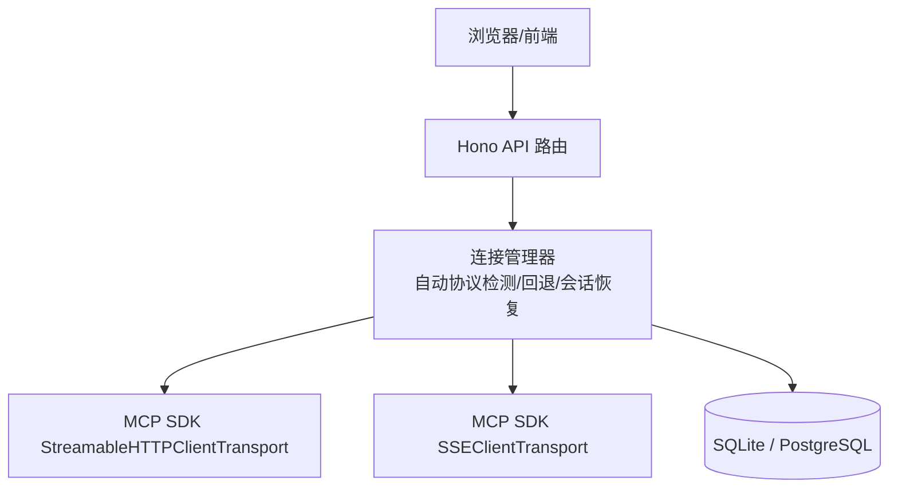
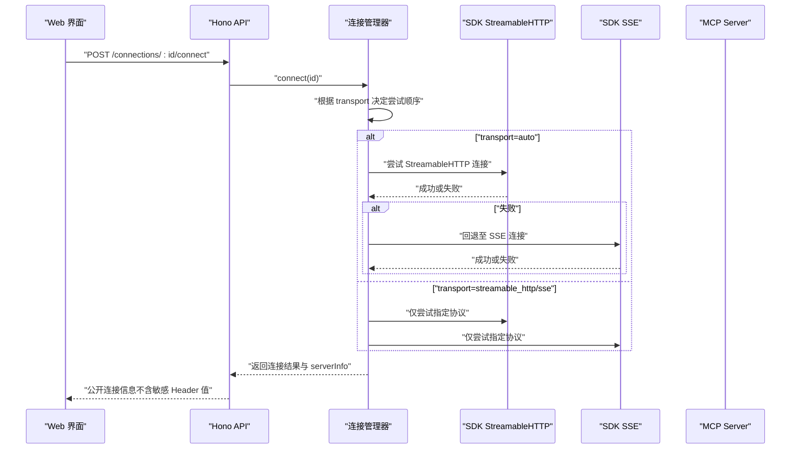
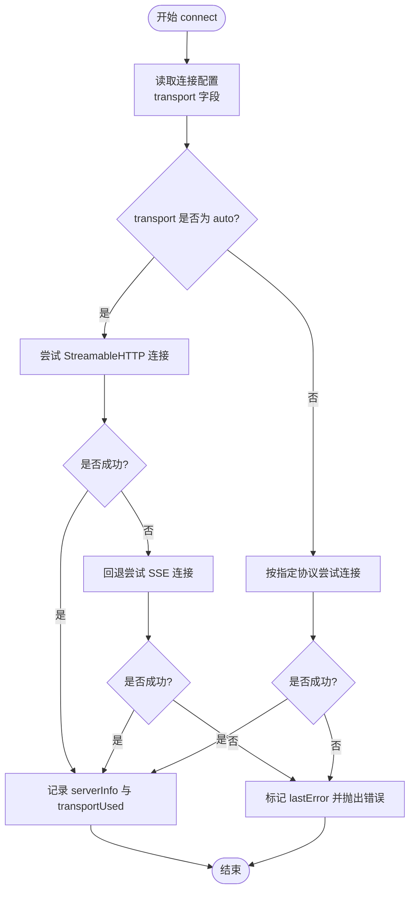
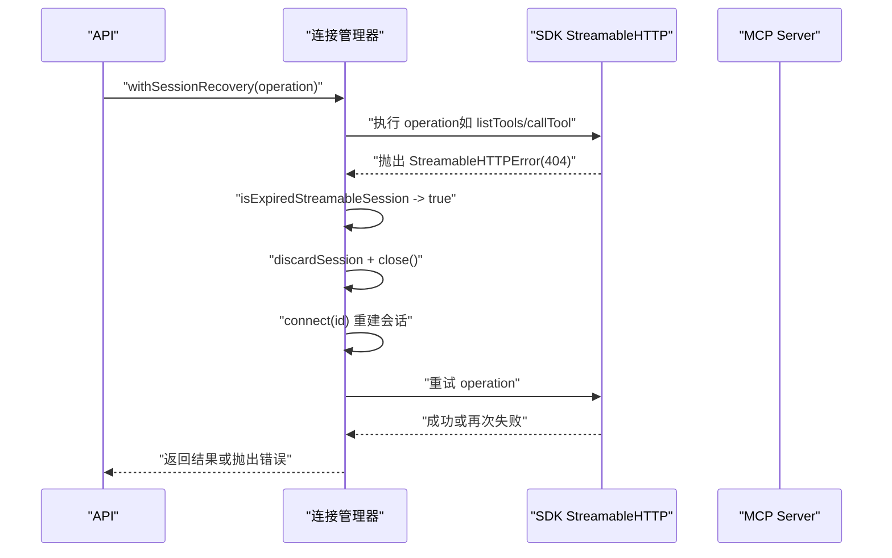
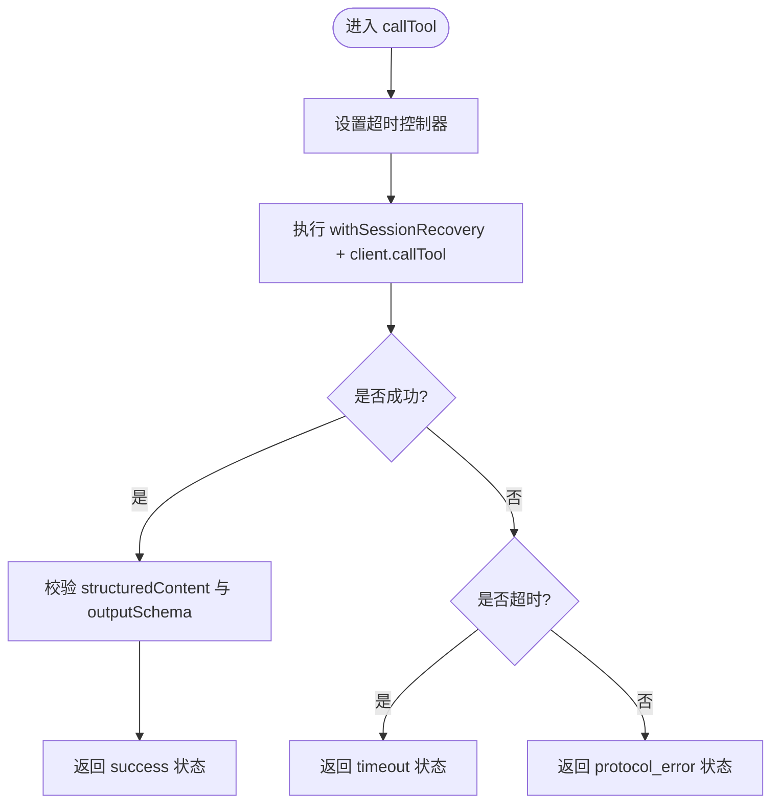
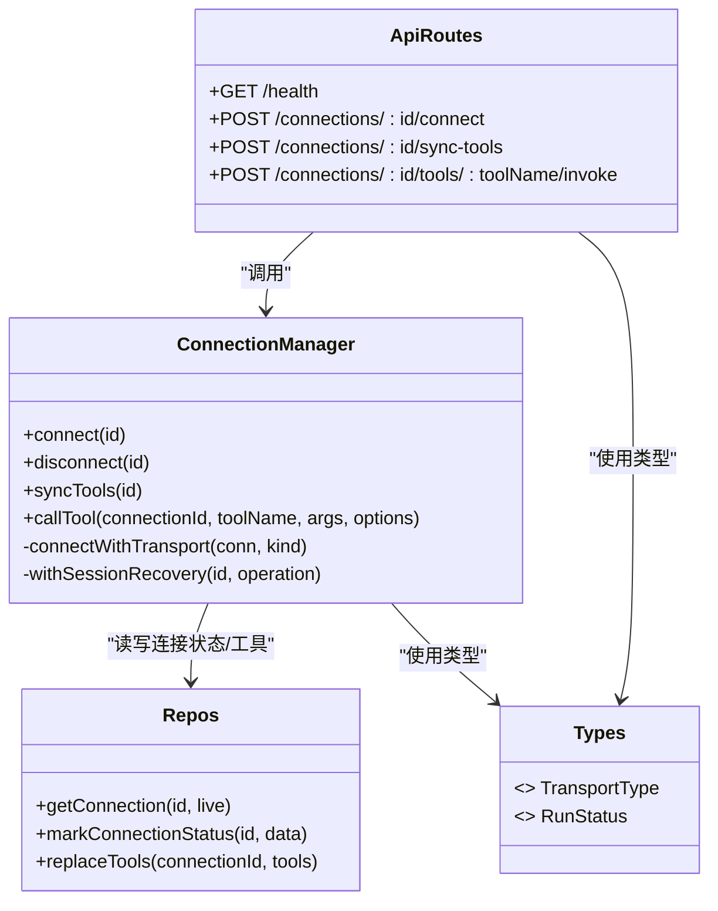

# 协议支持

<cite>
**本文引用的文件**
- [README.md](file://README.md)
- [connection-manager.ts](file://apps/server/src/mcp/connection-manager.ts)
- [api.ts](file://apps/server/src/routes/api.ts)
- [types.ts](file://packages/shared/src/types.ts)
- [repos.ts](file://apps/server/src/db/repos.ts)
- [session-recovery.test.ts](file://scripts/session-recovery.test.ts)
</cite>

## 目录
1. [简介](#简介)
2. [项目结构](#项目结构)
3. [核心组件](#核心组件)
4. [架构总览](#架构总览)
5. [详细组件分析](#详细组件分析)
6. [依赖关系分析](#依赖关系分析)
7. [性能与适用场景](#性能与适用场景)
8. [故障排除指南](#故障排除指南)
9. [结论](#结论)
10. [附录：配置项与最佳实践](#附录配置项与最佳实践)

## 简介
本章节聚焦于 MCP（Model Context Protocol）协议在本项目中的两种传输方式：Streamable HTTP 与 SSE（Server-Sent Events）。文档将解释自动协议检测与回退机制、每种协议的优缺点与适用场景、性能特征、配置选项以及常见问题的排查方法，帮助读者在不同环境下做出合适的协议选择。

## 项目结构
本项目在后端通过 Hono 提供 API，使用 MCP TypeScript SDK 建立与 MCP Server 的连接，并基于数据库持久化连接、工具元数据与测试用例。协议相关逻辑集中在连接管理器中，负责创建传输、自动检测与回退、会话恢复等。

图表来源
- [api.ts:1-277](file://apps/server/src/routes/api.ts#L1-L277)
- [connection-manager.ts:1-383](file://apps/server/src/mcp/connection-manager.ts#L1-L383)
- [repos.ts:1-312](file://apps/server/src/db/repos.ts#L1-L312)

章节来源
- [README.md:145-156](file://README.md#L145-L156)
- [api.ts:1-277](file://apps/server/src/routes/api.ts#L1-L277)
- [connection-manager.ts:1-383](file://apps/server/src/mcp/connection-manager.ts#L1-L383)
- [repos.ts:1-312](file://apps/server/src/db/repos.ts#L1-L312)

## 核心组件
- 连接管理器：封装 MCP SDK 的客户端与传输层，实现自动协议选择、连接生命周期管理、错误分类与会话恢复。
- API 路由：暴露连接、同步 Tools、调用 Tool、用例与套件运行等接口，统一返回公共字段，隐藏敏感 Header 值。
- 共享类型：定义传输类型、运行状态、断言配置等跨模块使用的数据结构。
- 仓库层：持久化连接、Tools、用例与运行记录，并在连接状态变更时更新最后连接时间与错误信息。

章节来源
- [connection-manager.ts:1-383](file://apps/server/src/mcp/connection-manager.ts#L1-L383)
- [api.ts:1-277](file://apps/server/src/routes/api.ts#L1-L277)
- [types.ts:1-229](file://packages/shared/src/types.ts#L1-L229)
- [repos.ts:1-312](file://apps/server/src/db/repos.ts#L1-L312)

## 架构总览
下图展示了从 Web UI 到 MCP Server 的端到端流程，重点标注了协议选择与回退路径。

图表来源
- [api.ts:77-85](file://apps/server/src/routes/api.ts#L77-L85)
- [connection-manager.ts:101-147](file://apps/server/src/mcp/connection-manager.ts#L101-L147)

章节来源
- [api.ts:77-85](file://apps/server/src/routes/api.ts#L77-L85)
- [connection-manager.ts:101-147](file://apps/server/src/mcp/connection-manager.ts#L101-L147)

## 详细组件分析

### 自动协议检测与回退机制
- 传输类型定义：支持 streamable_http、sse、auto 三种模式。
- 连接策略：
  - 当 transport 为 auto 时，先尝试 Streamable HTTP；若失败则回退到 SSE。
  - 当 transport 明确指定为某一种协议时，仅尝试该协议。
- 连接成功后，会记录实际使用的传输类型与服务器能力信息，并写入数据库。

图表来源
- [types.ts:1-10](file://packages/shared/src/types.ts#L1-L10)
- [connection-manager.ts:101-147](file://apps/server/src/mcp/connection-manager.ts#L101-L147)
- [repos.ts:288-312](file://apps/server/src/db/repos.ts#L288-L312)

章节来源
- [types.ts:1-10](file://packages/shared/src/types.ts#L1-L10)
- [connection-manager.ts:101-147](file://apps/server/src/mcp/connection-manager.ts#L101-L147)
- [repos.ts:288-312](file://apps/server/src/db/repos.ts#L288-L312)

### Streamable HTTP 会话恢复
- 触发条件：当使用 Streamable HTTP 且出现特定错误（例如 HTTP 404）时，判定为会话过期。
- 恢复流程：
  - 丢弃当前本地会话并关闭客户端。
  - 重新执行连接流程（可能再次走 auto 回退策略）。
  - 重试原操作一次；若仍失败，则标记不可用并抛出错误。
- 日志事件：在恢复开始、成功与失败阶段输出结构化日志，便于定位问题。

图表来源
- [connection-manager.ts:175-268](file://apps/server/src/mcp/connection-manager.ts#L175-L268)

章节来源
- [connection-manager.ts:175-268](file://apps/server/src/mcp/connection-manager.ts#L175-L268)
- [session-recovery.test.ts:103-120](file://scripts/session-recovery.test.ts#L103-L120)

### 超时与错误分类
- 超时处理：调用 Tool 时使用 AbortController 与 Promise.race 进行超时控制，超时错误被归类为 timeout。
- 协议错误：非超时的异常会被归类为 protocol_error，并附带错误消息与代码。
- 工具错误：如果 MCP 响应标识 isError=true，则归类为 tool_error。

图表来源
- [connection-manager.ts:300-379](file://apps/server/src/mcp/connection-manager.ts#L300-L379)
- [types.ts:5-10](file://packages/shared/src/types.ts#L5-L10)

章节来源
- [connection-manager.ts:300-379](file://apps/server/src/mcp/connection-manager.ts#L300-L379)
- [types.ts:5-10](file://packages/shared/src/types.ts#L5-L10)

### 安全与公开字段
- 连接 API 只返回 Header 名称列表，不返回具体值，避免凭据泄露。
- 导入导出包含完整凭据，需妥善保管。

章节来源
- [api.ts:24-30](file://apps/server/src/routes/api.ts#L24-L30)
- [README.md:157-162](file://README.md#L157-L162)

## 依赖关系分析
- 连接管理器依赖 MCP SDK 的 StreamableHTTP 与 SSE 传输实现。
- API 路由依赖连接管理器与仓库层，用于连接管理与数据持久化。
- 共享类型贯穿前后端与后端内部模块，确保数据结构一致。

图表来源
- [connection-manager.ts:1-383](file://apps/server/src/mcp/connection-manager.ts#L1-L383)
- [api.ts:1-277](file://apps/server/src/routes/api.ts#L1-L277)
- [repos.ts:1-312](file://apps/server/src/db/repos.ts#L1-L312)
- [types.ts:1-229](file://packages/shared/src/types.ts#L1-L229)

章节来源
- [connection-manager.ts:1-383](file://apps/server/src/mcp/connection-manager.ts#L1-L383)
- [api.ts:1-277](file://apps/server/src/routes/api.ts#L1-L277)
- [repos.ts:1-312](file://apps/server/src/db/repos.ts#L1-L312)
- [types.ts:1-229](file://packages/shared/src/types.ts#L1-L229)

## 性能与适用场景
- Streamable HTTP
  - 优点：适合需要长连接与状态管理的场景；具备会话 ID 与更好的幂等性语义；在网络中间件（代理、负载均衡）下通常更稳定。
  - 缺点：对服务端会话管理有要求；若会话过期需正确恢复。
  - 适用：生产环境、高并发、需要可靠会话与重连的场景。
- SSE
  - 优点：实现简单，易于调试；适合单向推送与轻量级流式通信。
  - 缺点：无内置会话状态；在某些网络环境中可能被缓存或中断。
  - 适用：开发调试、临时验证、无需复杂会话管理的场景。
- 自动回退
  - 默认优先 Streamable HTTP，失败后回退 SSE，提升兼容性。
  - 建议在生产环境显式指定协议以规避不必要的二次尝试。

章节来源
- [README.md:36-49](file://README.md#L36-L49)
- [connection-manager.ts:101-147](file://apps/server/src/mcp/connection-manager.ts#L101-L147)

## 故障排除指南
- 连接失败
  - 检查 transport 配置是否正确；若为 auto，确认 Streamable HTTP 不可用时是否能回退到 SSE。
  - 查看 lastError 与 serverInfo，定位具体错误原因。
- 会话过期（HTTP 404）
  - 系统会自动丢弃旧会话并重试一次；若仍失败，检查 MCP Server 的会话生命周期与鉴权。
  - 关注恢复阶段的日志事件，辅助定位问题。
- 超时
  - 调整 timeoutMs 或在调用时传入自定义超时；注意区分 TIMEOUT 与协议错误。
- 凭据泄露风险
  - 连接 API 仅返回 Header 名称；导出文件包含完整凭据，请妥善保存。

章节来源
- [connection-manager.ts:175-268](file://apps/server/src/mcp/connection-manager.ts#L175-L268)
- [connection-manager.ts:300-379](file://apps/server/src/mcp/connection-manager.ts#L300-L379)
- [api.ts:24-30](file://apps/server/src/routes/api.ts#L24-L30)
- [README.md:157-162](file://README.md#L157-L162)

## 结论
本项目通过连接管理器实现了 MCP 协议的 Streamable HTTP 与 SSE 双传输支持，并提供自动协议检测与回退、会话恢复与超时控制等关键能力。生产环境建议显式指定协议以提升稳定性与可观测性；开发调试可使用 auto 以获得最大兼容性。配合清晰的错误分类与安全策略，可在不同网络与服务端环境下获得良好的用户体验。

## 附录：配置项与最佳实践
- 连接配置
  - transport：可选值为 streamable_http、sse、auto。默认 auto。
  - url：MCP Server 地址。
  - headers：自定义请求头（如 Authorization），API 仅返回名称列表。
  - timeoutMs：调用超时时间，单位毫秒。
- 最佳实践
  - 生产环境显式指定协议，避免二次尝试带来的延迟。
  - 合理设置超时，结合业务 SLA 调整。
  - 定期导出备份，谨慎保管含凭据的文件。
  - 在反向代理层启用 HTTPS、身份认证与速率限制。

章节来源
- [types.ts:54-90](file://packages/shared/src/types.ts#L54-L90)
- [repos.ts:235-279](file://apps/server/src/db/repos.ts#L235-L279)
- [README.md:136-144](file://README.md#L136-L144)
- [README.md:157-162](file://README.md#L157-L162)