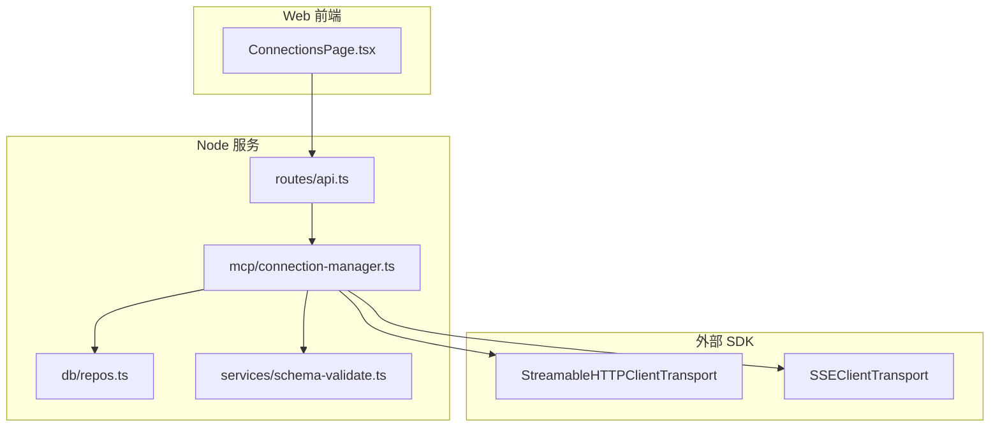
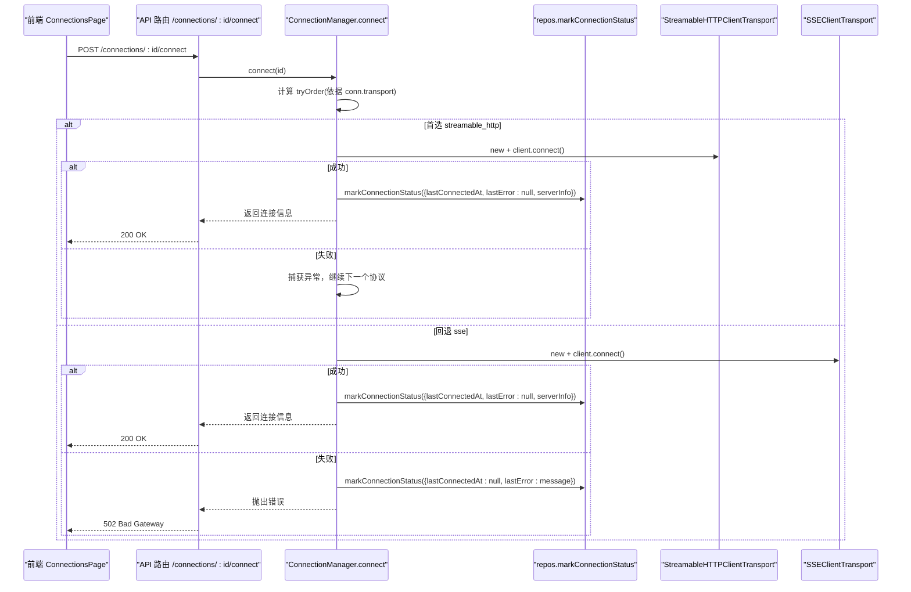
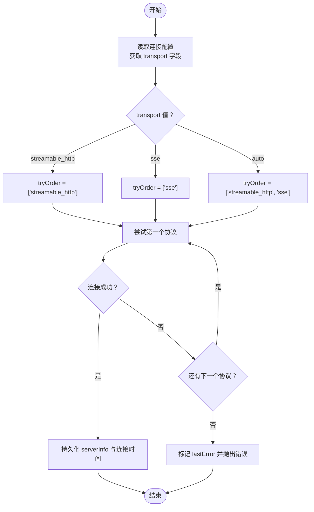
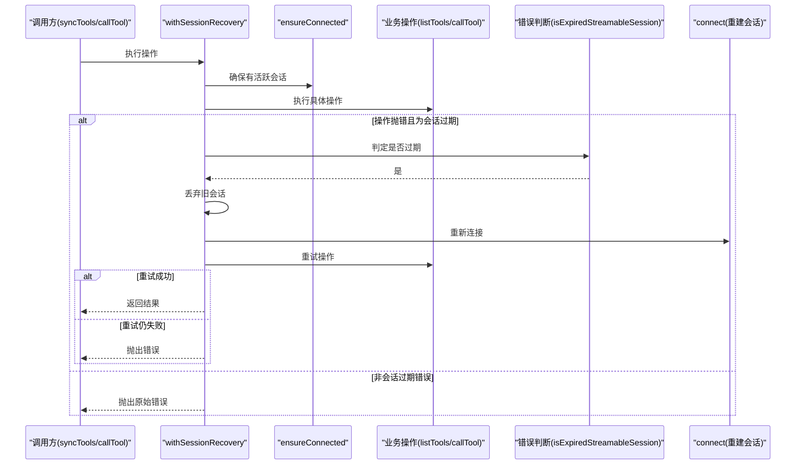
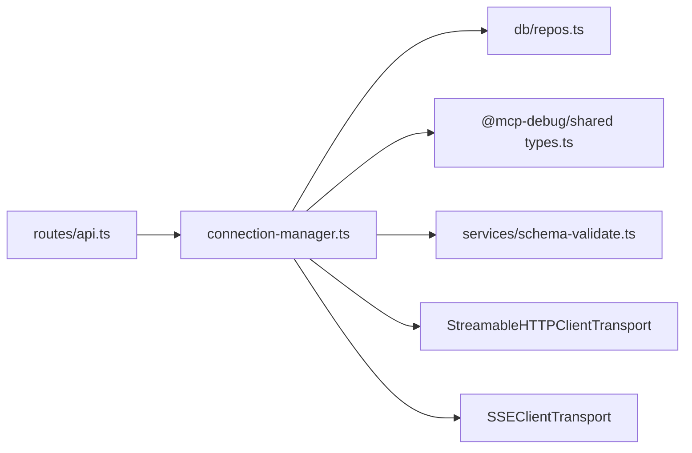

# 自动协议检测与回退

<cite>
**本文引用的文件**   
- [apps/server/src/mcp/connection-manager.ts](file://apps/server/src/mcp/connection-manager.ts)
- [apps/server/src/routes/api.ts](file://apps/server/src/routes/api.ts)
- [apps/server/src/db/repos.ts](file://apps/server/src/db/repos.ts)
- [packages/shared/src/types.ts](file://packages/shared/src/types.ts)
- [apps/web/src/pages/ConnectionsPage.tsx](file://apps/web/src/pages/ConnectionsPage.tsx)
- [apps/server/src/services/schema-validate.ts](file://apps/server/src/services/schema-validate.ts)
</cite>

## 目录
1. [简介](#简介)
2. [项目结构](#项目结构)
3. [核心组件](#核心组件)
4. [架构总览](#架构总览)
5. [详细组件分析](#详细组件分析)
6. [依赖关系分析](#依赖关系分析)
7. [性能考量](#性能考量)
8. [故障诊断指南](#故障诊断指南)
9. [结论](#结论)
10. [附录](#附录)

## 简介
本文件围绕“自动协议检测与回退机制”展开，系统性解释连接建立时的协议选择算法、优先级策略、tryOrder 逻辑、连接重试与会话恢复流程、协议兼容性检测与错误分类处理，并提供配置指导与常见问题的排查步骤。该机制的核心目标是：在不确定服务端支持哪种传输协议时，优先尝试更现代的协议（如 Streamable HTTP），失败后自动回退到兼容的旧协议（如 SSE），并在运行期对会话失效进行透明恢复，从而提升连接成功率与用户体验。

## 项目结构
与协议检测和回退直接相关的代码主要分布在以下位置：
- 服务器端连接管理与协议切换：apps/server/src/mcp/connection-manager.ts
- API 路由层调用连接管理器：apps/server/src/routes/api.ts
- 连接持久化与状态记录：apps/server/src/db/repos.ts
- 共享类型定义（含传输类型）：packages/shared/src/types.ts
- 前端连接管理界面（展示 transport 选项与状态）：apps/web/src/pages/ConnectionsPage.tsx
- 结构化输出校验（用于工具调用结果验证）：apps/server/src/services/schema-validate.ts



图表来源
- [apps/server/src/mcp/connection-manager.ts:1-120](file://apps/server/src/mcp/connection-manager.ts#L1-L120)
- [apps/server/src/routes/api.ts:77-102](file://apps/server/src/routes/api.ts#L77-L102)
- [apps/server/src/db/repos.ts:288-312](file://apps/server/src/db/repos.ts#L288-L312)
- [apps/web/src/pages/ConnectionsPage.tsx:264-272](file://apps/web/src/pages/ConnectionsPage.tsx#L264-L272)

章节来源
- [apps/server/src/mcp/connection-manager.ts:1-120](file://apps/server/src/mcp/connection-manager.ts#L1-L120)
- [apps/server/src/routes/api.ts:77-102](file://apps/server/src/routes/api.ts#L77-L102)
- [apps/server/src/db/repos.ts:288-312](file://apps/server/src/db/repos.ts#L288-L312)
- [packages/shared/src/types.ts:1-10](file://packages/shared/src/types.ts#L1-L10)
- [apps/web/src/pages/ConnectionsPage.tsx:264-272](file://apps/web/src/pages/ConnectionsPage.tsx#L264-L272)

## 核心组件
- 连接管理器 ConnectionManager
  - 负责根据配置的 transport 字段构建 tryOrder，依次尝试不同传输协议并建立连接。
  - 维护 LiveSession 缓存，提供 ensureConnected、syncTools、callTool 等能力。
  - 实现会话过期检测与自动重连恢复（针对 Streamable HTTP 的 404 场景）。
- API 路由层
  - 暴露连接创建、连接/断开、同步 Tools、调用工具等接口，内部委托给连接管理器。
- 数据持久层 repos
  - 存储连接配置、最近连接时间、错误信息、serverInfo 等；对外提供查询与更新方法。
- 共享类型 types
  - 定义 TransportType 为 "streamable_http" | "sse" | "auto"，驱动前端与后端协议选择。
- 前端页面 ConnectionsPage
  - 提供新建连接的表单，包含 transport 下拉（auto/streamable_http/sse）、超时设置、Headers JSON 等。

章节来源
- [apps/server/src/mcp/connection-manager.ts:39-147](file://apps/server/src/mcp/connection-manager.ts#L39-L147)
- [apps/server/src/routes/api.ts:77-102](file://apps/server/src/routes/api.ts#L77-L102)
- [apps/server/src/db/repos.ts:288-312](file://apps/server/src/db/repos.ts#L288-L312)
- [packages/shared/src/types.ts:1-10](file://packages/shared/src/types.ts#L1-L10)
- [apps/web/src/pages/ConnectionsPage.tsx:264-272](file://apps/web/src/pages/ConnectionsPage.tsx#L264-L272)

## 架构总览
下图展示了从前端发起连接到后端自动协议检测与回退的整体流程，包括 tryOrder 决策、连接建立、状态落库与会话恢复。



图表来源
- [apps/server/src/mcp/connection-manager.ts:101-147](file://apps/server/src/mcp/connection-manager.ts#L101-L147)
- [apps/server/src/routes/api.ts:77-85](file://apps/server/src/routes/api.ts#L77-L85)
- [apps/server/src/db/repos.ts:288-312](file://apps/server/src/db/repos.ts#L288-L312)

## 详细组件分析

### 协议选择算法与优先级策略
- 输入：连接配置中的 transport 字段（"auto" | "streamable_http" | "sse"）。
- 决策：
  - 若 transport === "streamable_http"，则 tryOrder = ["streamable_http"]，仅尝试该协议。
  - 若 transport === "sse"，则 tryOrder = ["sse"]，仅尝试该协议。
  - 若 transport === "auto"，则 tryOrder = ["streamable_http", "sse"]，先尝试现代协议，失败再回退到 SSE。
- 执行：按顺序遍历 tryOrder，逐个构造对应 Transport 并调用 client.connect()，首个成功的即作为最终使用的协议。
- 结果：将实际使用的协议写入 session 的 transportUsed，并持久化 serverInfo 与连接时间。



图表来源
- [apps/server/src/mcp/connection-manager.ts:108-147](file://apps/server/src/mcp/connection-manager.ts#L108-L147)
- [apps/server/src/db/repos.ts:288-312](file://apps/server/src/db/repos.ts#L288-L312)

章节来源
- [apps/server/src/mcp/connection-manager.ts:101-147](file://apps/server/src/mcp/connection-manager.ts#L101-L147)
- [packages/shared/src/types.ts:1-10](file://packages/shared/src/types.ts#L1-L10)

### 连接重试与会话恢复机制
- 会话生命周期：
  - ensureConnected：若当前无活跃会话则触发 connect；否则复用已有会话。
  - withQueue：保证同一连接 ID 的操作串行化，避免并发竞态。
- 会话过期检测：
  - isExpiredStreamableSession：当使用 streamable_http 且收到特定错误（例如 HTTP 404）时，判定会话已过期。
- 自动恢复流程：
  - withSessionRecovery：在执行操作（如 listTools/callTool）前确保连接可用；若检测到会话过期，丢弃旧会话并重新 connect，然后重试原操作。
  - 日志事件：记录 mcp_session_recovery_started、mcp_session_recovery_succeeded、mcp_session_recovery_failed 等关键阶段。
- 错误传播：
  - 若恢复失败或再次出现会话过期，记录不可用状态并向上抛出错误。



图表来源
- [apps/server/src/mcp/connection-manager.ts:166-268](file://apps/server/src/mcp/connection-manager.ts#L166-L268)

章节来源
- [apps/server/src/mcp/connection-manager.ts:166-268](file://apps/server/src/mcp/connection-manager.ts#L166-L268)

### 协议兼容性检测与错误分类处理
- 兼容性检测：
  - 通过 tryOrder 的顺序隐式完成兼容性探测：优先尝试更现代的协议，失败后再尝试兼容协议。
  - 对于 streamable_http，结合错误码（如 404）识别会话失效，属于运行时兼容性/生命周期问题。
- 错误分类：
  - 连接阶段：
    - 成功：记录 lastConnectedAt、serverInfo，清除 lastError。
    - 失败：记录 lastError 消息，清空 lastConnectedAt。
  - 调用阶段：
    - 超时：status 标记为 timeout，protocolError.code 可能为 TIMEOUT 或 AbortError。
    - 协议错误：status 标记为 protocol_error，携带 message 与 code。
    - 工具错误：status 标记为 tool_error，isError=true。
    - 成功：status=success，isError=false，附带 content 与 structuredContent。
- 结构化输出校验：
  - 基于 schema 对 structuredContent 进行校验，返回 SchemaValidationResult（ok/errors）。

```mermaid
classDiagram
class CallToolResult {
+string startedAt
+string endedAt
+number durationMs
+RunStatus status
+boolean isError
+ContentItem[] content
+unknown structuredContent
+SchemaValidationResult schemaValidation
+Record~string, unknown~ protocolError
+unknown rawResponse
}
class SchemaValidationResult {
+boolean ok
+{path : string; message : string}[] errors
}
CallToolResult --> SchemaValidationResult : "包含"
```

图表来源
- [apps/server/src/mcp/connection-manager.ts:26-37](file://apps/server/src/mcp/connection-manager.ts#L26-L37)
- [apps/server/src/services/schema-validate.ts:27-61](file://apps/server/src/services/schema-validate.ts#L27-L61)

章节来源
- [apps/server/src/mcp/connection-manager.ts:300-379](file://apps/server/src/mcp/connection-manager.ts#L300-L379)
- [apps/server/src/services/schema-validate.ts:27-61](file://apps/server/src/services/schema-validate.ts#L27-L61)

### 配置指导与最佳实践
- transport 选择建议：
  - 默认使用 auto，让系统自动选择最优协议并具备回退能力。
  - 已知服务端仅支持 SSE 时，可固定为 sse 以减少一次失败尝试。
  - 已知服务端支持 Streamable HTTP 且需要更高吞吐时，可固定为 streamable_http。
- 超时配置：
  - 合理设置 timeoutMs，避免长耗时任务过早中断；同时防止资源长期占用。
- Headers 配置：
  - 通过 headersText 传入 JSON 对象，支持 Authorization、Cookie、自定义鉴权头等。
- 前端交互：
  - 在连接卡片中查看 live 状态、lastConnectedAt、lastError，辅助快速定位问题。

章节来源
- [apps/web/src/pages/ConnectionsPage.tsx:256-286](file://apps/web/src/pages/ConnectionsPage.tsx#L256-L286)
- [packages/shared/src/types.ts:54-90](file://packages/shared/src/types.ts#L54-L90)

## 依赖关系分析
- 模块耦合：
  - API 路由层依赖连接管理器与持久层，职责清晰，便于扩展。
  - 连接管理器依赖 SDK 传输实现与持久层，封装了协议选择与恢复逻辑。
- 外部依赖：
  - @modelcontextprotocol/sdk/client/streamableHttp.js 与 @modelcontextprotocol/sdk/client/sse.js 提供底层传输能力。
  - ajv 用于结构化输出校验。
- 潜在循环依赖：
  - 当前未发现循环依赖；各模块单向依赖关系明确。



图表来源
- [apps/server/src/routes/api.ts:1-20](file://apps/server/src/routes/api.ts#L1-L20)
- [apps/server/src/mcp/connection-manager.ts:1-18](file://apps/server/src/mcp/connection-manager.ts#L1-L18)
- [apps/server/src/db/repos.ts:1-24](file://apps/server/src/db/repos.ts#L1-L24)
- [packages/shared/src/types.ts:1-10](file://packages/shared/src/types.ts#L1-L10)
- [apps/server/src/services/schema-validate.ts:1-20](file://apps/server/src/services/schema-validate.ts#L1-L20)

章节来源
- [apps/server/src/routes/api.ts:1-20](file://apps/server/src/routes/api.ts#L1-L20)
- [apps/server/src/mcp/connection-manager.ts:1-18](file://apps/server/src/mcp/connection-manager.ts#L1-L18)
- [apps/server/src/db/repos.ts:1-24](file://apps/server/src/db/repos.ts#L1-L24)
- [packages/shared/src/types.ts:1-10](file://packages/shared/src/types.ts#L1-L10)
- [apps/server/src/services/schema-validate.ts:1-20](file://apps/server/src/services/schema-validate.ts#L1-L20)

## 性能考量
- 串行队列：
  - withQueue 保证同一连接 ID 的请求串行执行，避免并发导致的会话竞争与重复重连。
- 最小化失败路径：
  - auto 模式下优先尝试 streamable_http，减少不必要的协议切换开销；仅在失败时才回退。
- 会话复用：
  - ensureConnected 复用现有会话，降低频繁重连带来的网络与 CPU 开销。
- 超时控制：
  - callTool 使用 Promise.race 与 AbortController 配合，避免长时间阻塞。

[本节为通用性能讨论，不直接分析具体文件]

## 故障诊断指南
- 连接失败
  - 检查 transport 配置是否正确；若不确定服务端能力，建议使用 auto。
  - 查看 lastError 与 lastConnectedAt，确认最近一次连接状态。
  - 若使用 streamable_http 且出现 404，可能是会话过期，系统将自动恢复；若反复失败，检查服务端会话生命周期与网关转发。
- 工具调用超时
  - 调整 timeoutMs；观察 protocolError.code 是否为 TIMEOUT 或 AbortError。
  - 检查服务端处理耗时与网络延迟。
- 结构化输出校验失败
  - 查看 schemaValidation.errors，定位字段缺失或类型不符的问题。
- 鉴权与 Header 问题
  - 确认 headersText 格式正确，包含必要的 Authorization/Cookie 等头。
  - 注意导出/导入会包含完整凭据，请妥善保管。

章节来源
- [apps/server/src/mcp/connection-manager.ts:175-268](file://apps/server/src/mcp/connection-manager.ts#L175-L268)
- [apps/server/src/mcp/connection-manager.ts:300-379](file://apps/server/src/mcp/connection-manager.ts#L300-L379)
- [apps/server/src/services/schema-validate.ts:27-61](file://apps/server/src/services/schema-validate.ts#L27-L61)
- [apps/web/src/pages/ConnectionsPage.tsx:170-176](file://apps/web/src/pages/ConnectionsPage.tsx#L170-L176)

## 结论
本项目的自动协议检测与回退机制以 tryOrder 为核心，结合会话恢复与错误分类，实现了高可用的 MCP 连接体验。通过合理的配置与完善的诊断信息，用户可以在复杂网络与服务端环境下获得稳定的连接与清晰的排障线索。建议在未知服务端能力时使用 auto，并结合超时与头部配置优化整体稳定性。

[本节为总结性内容，不直接分析具体文件]

## 附录
- 相关类型与字段说明
  - TransportType："streamable_http" | "sse" | "auto"
  - McpConnection：包含 name、url、transport、timeoutMs、headers、lastConnectedAt、lastError、serverInfo 等字段
  - CallToolResult：包含 status、isError、content、structuredContent、schemaValidation、protocolError 等字段

章节来源
- [packages/shared/src/types.ts:1-10](file://packages/shared/src/types.ts#L1-L10)
- [packages/shared/src/types.ts:54-90](file://packages/shared/src/types.ts#L54-L90)
- [apps/server/src/mcp/connection-manager.ts:26-37](file://apps/server/src/mcp/connection-manager.ts#L26-L37)