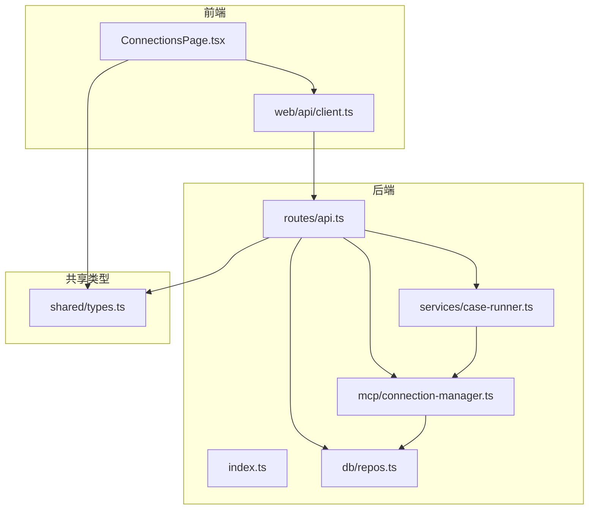
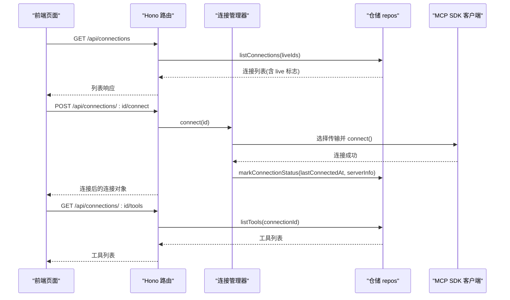
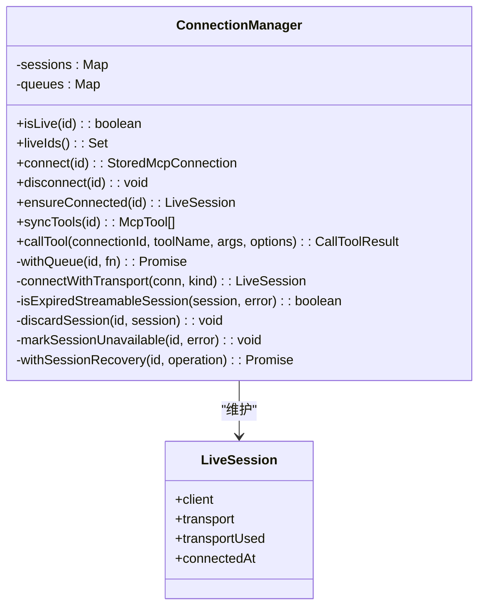
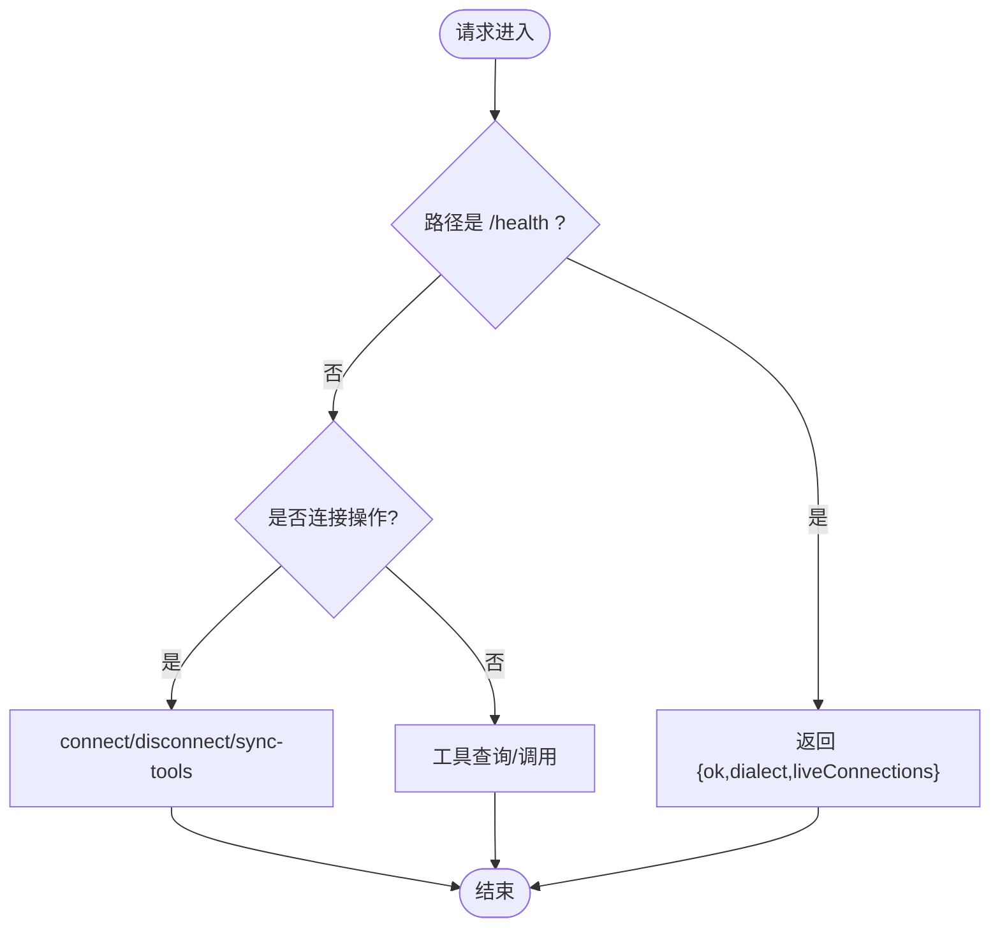
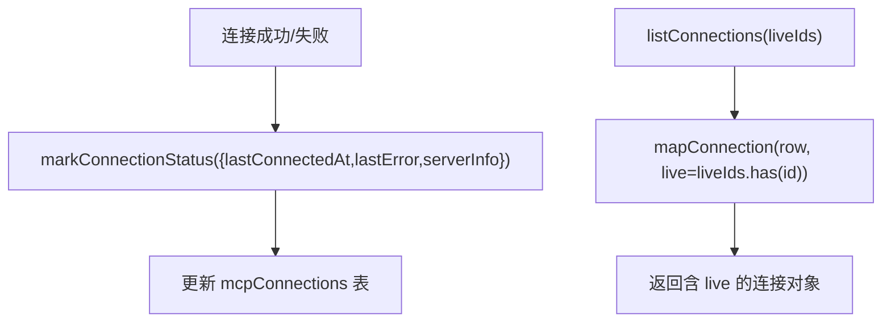
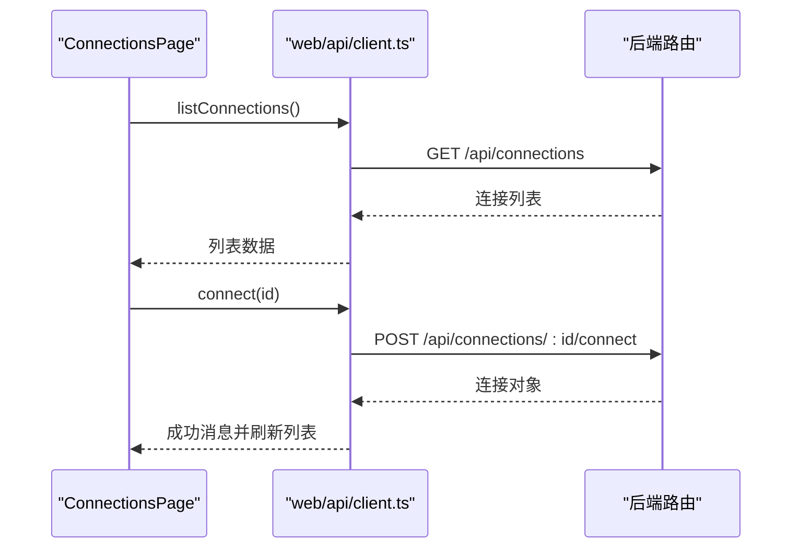
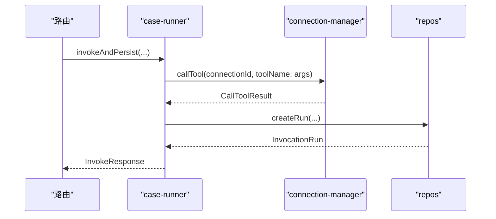
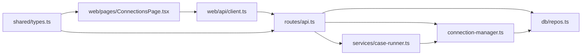
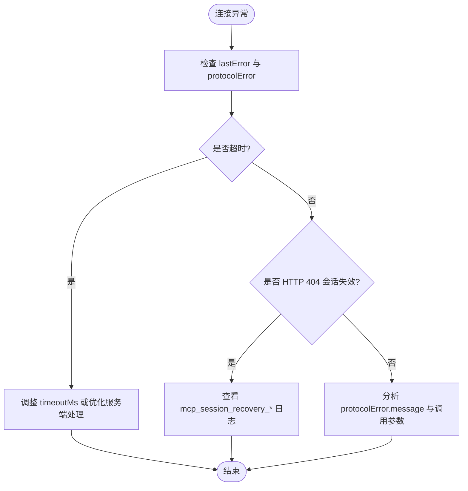

# 连接监控

<cite>
**本文引用的文件**   
- [apps/server/src/mcp/connection-manager.ts](file://apps/server/src/mcp/connection-manager.ts)
- [apps/server/src/routes/api.ts](file://apps/server/src/routes/api.ts)
- [apps/server/src/db/repos.ts](file://apps/server/src/db/repos.ts)
- [apps/web/src/pages/ConnectionsPage.tsx](file://apps/web/src/pages/ConnectionsPage.tsx)
- [apps/web/src/api/client.ts](file://apps/web/src/api/client.ts)
- [packages/shared/src/types.ts](file://packages/shared/src/types.ts)
- [apps/server/src/services/case-runner.ts](file://apps/server/src/services/case-runner.ts)
- [apps/server/src/index.ts](file://apps/server/src/index.ts)
</cite>

## 目录
1. [简介](#简介)
2. [项目结构](#项目结构)
3. [核心组件](#核心组件)
4. [架构总览](#架构总览)
5. [详细组件分析](#详细组件分析)
6. [依赖关系分析](#依赖关系分析)
7. [性能与指标](#性能与指标)
8. [故障诊断与日志分析](#故障诊断与日志分析)
9. [结论](#结论)
10. [附录：API 与数据模型](#附录api-与数据模型)

## 简介
本文件聚焦“连接监控”能力，围绕 MCP（Model Context Protocol）连接的实时状态展示、最后连接时间、错误信息、服务器能力检测、健康检查机制、状态更新频率、问题诊断方法与日志分析技巧，以及连接性能指标收集与告警配置建议进行系统化说明。文档基于仓库中实际实现进行分析，确保内容可落地、可操作。

## 项目结构
与连接监控直接相关的代码分布在服务端、前端页面与共享类型定义中：
- 服务端负责连接生命周期管理、会话恢复、工具同步、调用执行、运行记录持久化与健康接口暴露
- 前端提供连接列表、在线状态标签、错误提示、连接/断开、同步 Tools 等操作入口
- 共享类型定义了连接、工具、用例、运行记录等数据结构

图表来源
- [apps/server/src/index.ts:10-33](file://apps/server/src/index.ts#L10-L33)
- [apps/server/src/routes/api.ts:18-38](file://apps/server/src/routes/api.ts#L18-L38)
- [apps/server/src/mcp/connection-manager.ts:39-147](file://apps/server/src/mcp/connection-manager.ts#L39-L147)
- [apps/server/src/db/repos.ts:211-312](file://apps/server/src/db/repos.ts#L211-L312)
- [apps/web/src/pages/ConnectionsPage.tsx:29-148](file://apps/web/src/pages/ConnectionsPage.tsx#L29-L148)
- [apps/web/src/api/client.ts:31-53](file://apps/web/src/api/client.ts#L31-L53)
- [packages/shared/src/types.ts:54-70](file://packages/shared/src/types.ts#L54-L70)

章节来源
- [apps/server/src/index.ts:10-33](file://apps/server/src/index.ts#L10-L33)
- [apps/server/src/routes/api.ts:18-38](file://apps/server/src/routes/api.ts#L18-L38)
- [apps/web/src/pages/ConnectionsPage.tsx:29-148](file://apps/web/src/pages/ConnectionsPage.tsx#L29-L148)
- [apps/web/src/api/client.ts:31-53](file://apps/web/src/api/client.ts#L31-L53)
- [packages/shared/src/types.ts:54-70](file://packages/shared/src/types.ts#L54-L70)

## 核心组件
- 连接管理器 ConnectionManager
  - 维护内存中的活跃会话 Map，支持按连接 ID 串行化调用 withQueue
  - 支持 streamable_http 与 sse 两种传输，自动回退策略
  - 会话过期检测与自动恢复（HTTP 404 场景）
  - 连接建立时采集 serverInfo（版本/能力），并持久化 lastConnectedAt、lastError
  - 工具同步与工具调用，包含超时控制与结构化结果校验
- 路由层 API
  - 暴露 /health 健康接口，返回服务方言与当前 liveConnections 数量
  - 连接 CRUD、connect/disconnect、sync-tools、工具查询与调用
- 数据库仓储 repos
  - 连接状态字段 lastConnectedAt、lastError、serverInfoJson 的读写
  - 工具、用例、运行记录的增删改查
- 前端 ConnectionsPage
  - 展示连接列表、在线/离线标签、最近连接时间与错误信息
  - 提供连接、断开、同步 Tools、进入工作台等操作
- 共享类型 types
  - McpConnection 包含 live、lastConnectedAt、lastError、serverInfo 等监控相关字段

章节来源
- [apps/server/src/mcp/connection-manager.ts:39-147](file://apps/server/src/mcp/connection-manager.ts#L39-L147)
- [apps/server/src/routes/api.ts:32-102](file://apps/server/src/routes/api.ts#L32-L102)
- [apps/server/src/db/repos.ts:288-312](file://apps/server/src/db/repos.ts#L288-L312)
- [apps/web/src/pages/ConnectionsPage.tsx:150-242](file://apps/web/src/pages/ConnectionsPage.tsx#L150-L242)
- [packages/shared/src/types.ts:54-70](file://packages/shared/src/types.ts#L54-L70)

## 架构总览
连接监控的关键流程包括：
- 健康检查：/health 返回 liveConnections 数量，便于外部系统探测
- 连接建立：客户端触发 connect，服务端尝试指定或自动选择的传输建立会话，写入 lastConnectedAt、serverInfo
- 状态展示：前端拉取连接列表，根据 liveIds 标记在线状态，显示 lastConnectedAt 与 lastError
- 会话恢复：streamable_http 会话过期（404）时自动丢弃旧会话并重连
- 工具调用：带超时控制，记录 durationMs、status、protocolError 等指标到运行记录

图表来源
- [apps/server/src/routes/api.ts:41-44](file://apps/server/src/routes/api.ts#L41-L44)
- [apps/server/src/routes/api.ts:77-85](file://apps/server/src/routes/api.ts#L77-L85)
- [apps/server/src/mcp/connection-manager.ts:101-147](file://apps/server/src/mcp/connection-manager.ts#L101-L147)
- [apps/server/src/db/repos.ts:211-218](file://apps/server/src/db/repos.ts#L211-L218)
- [apps/server/src/db/repos.ts:351-382](file://apps/server/src/db/repos.ts#L351-L382)

## 详细组件分析

### 连接管理器（ConnectionManager）
职责与特性：
- 会话管理：以 Map 维护 LiveSession，包含 client、transport、transportUsed、connectedAt
- 队列串行：withQueue 保证同一连接的操作串行执行，避免并发冲突
- 传输选择：优先使用配置的 transport；auto 模式先尝试 streamable_http，失败回退 sse
- 能力检测：连接成功后尝试获取 serverVersion 与 capabilities，写入 serverInfo
- 状态持久化：markConnectionStatus 更新 lastConnectedAt、lastError、serverInfoJson
- 会话恢复：isExpiredStreamableSession 识别 HTTP 404 导致的会话失效，discardSession 后重连
- 工具同步：syncTools 分页拉取并替换本地工具元数据
- 工具调用：callTool 支持超时控制、结构化结果校验、异常分类（timeout/protocol_error/tool_error/success）

图表来源
- [apps/server/src/mcp/connection-manager.ts:19-41](file://apps/server/src/mcp/connection-manager.ts#L19-L41)
- [apps/server/src/mcp/connection-manager.ts:101-147](file://apps/server/src/mcp/connection-manager.ts#L101-L147)
- [apps/server/src/mcp/connection-manager.ts:175-268](file://apps/server/src/mcp/connection-manager.ts#L175-L268)
- [apps/server/src/mcp/connection-manager.ts:270-379](file://apps/server/src/mcp/connection-manager.ts#L270-L379)

章节来源
- [apps/server/src/mcp/connection-manager.ts:39-147](file://apps/server/src/mcp/connection-manager.ts#L39-L147)
- [apps/server/src/mcp/connection-manager.ts:175-268](file://apps/server/src/mcp/connection-manager.ts#L175-L268)
- [apps/server/src/mcp/connection-manager.ts:270-379](file://apps/server/src/mcp/connection-manager.ts#L270-L379)

### 路由层 API（/health 与连接相关）
- /health：返回 ok、dialect、liveConnections（当前内存中活跃连接数）
- /connections：列出所有连接，结合 liveIds 标注 live 标志
- /connections/:id/connect：触发连接，捕获错误并以 502 返回
- /connections/:id/disconnect：断开连接并返回最新连接对象
- /connections/:id/sync-tools：同步工具元数据，返回 count 与 tools
- /connections/:id/tools：查询工具列表（支持 q 过滤）
- /connections/:id/tools/:toolName/invoke：调用工具，封装为 InvokeResponse

图表来源
- [apps/server/src/routes/api.ts:32-38](file://apps/server/src/routes/api.ts#L32-L38)
- [apps/server/src/routes/api.ts:41-102](file://apps/server/src/routes/api.ts#L41-L102)
- [apps/server/src/routes/api.ts:117-138](file://apps/server/src/routes/api.ts#L117-L138)

章节来源
- [apps/server/src/routes/api.ts:32-38](file://apps/server/src/routes/api.ts#L32-L38)
- [apps/server/src/routes/api.ts:41-102](file://apps/server/src/routes/api.ts#L41-L102)
- [apps/server/src/routes/api.ts:117-138](file://apps/server/src/routes/api.ts#L117-L138)

### 仓储层（repos）与状态持久化
- 连接状态字段：
  - lastConnectedAt：最近一次成功连接时间
  - lastError：最近一次错误信息
  - serverInfoJson：服务器版本与能力信息
- markConnectionStatus：原子更新上述字段与 updatedAt
- listConnections：传入 liveIds，映射时将 live 标志注入到返回对象
- replaceTools：清空并批量插入工具元数据，记录 syncedAt

图表来源
- [apps/server/src/db/repos.ts:288-312](file://apps/server/src/db/repos.ts#L288-L312)
- [apps/server/src/db/repos.ts:211-218](file://apps/server/src/db/repos.ts#L211-L218)
- [apps/server/src/db/repos.ts:314-349](file://apps/server/src/db/repos.ts#L314-L349)

章节来源
- [apps/server/src/db/repos.ts:288-312](file://apps/server/src/db/repos.ts#L288-L312)
- [apps/server/src/db/repos.ts:211-218](file://apps/server/src/db/repos.ts#L211-L218)
- [apps/server/src/db/repos.ts:314-349](file://apps/server/src/db/repos.ts#L314-L349)

### 前端连接页面（ConnectionsPage）
- 列表加载：调用 api.listConnections，渲染每个连接的名称、URL、描述、传输类型、在线/离线标签、最近连接时间与错误信息
- 操作按钮：
  - 连接：POST /connections/:id/connect，成功后刷新列表
  - 断开：POST /connections/:id/disconnect，成功后刷新列表
  - 同步 Tools：POST /connections/:id/sync-tools，成功后刷新列表
  - 工作台：跳转到工具调试页
- 导入导出：支持导出包含凭据的 JSON 与导入配置

图表来源
- [apps/web/src/pages/ConnectionsPage.tsx:36-49](file://apps/web/src/pages/ConnectionsPage.tsx#L36-L49)
- [apps/web/src/pages/ConnectionsPage.tsx:178-218](file://apps/web/src/pages/ConnectionsPage.tsx#L178-L218)
- [apps/web/src/api/client.ts:31-53](file://apps/web/src/api/client.ts#L31-L53)
- [apps/server/src/routes/api.ts:77-102](file://apps/server/src/routes/api.ts#L77-L102)

章节来源
- [apps/web/src/pages/ConnectionsPage.tsx:150-242](file://apps/web/src/pages/ConnectionsPage.tsx#L150-L242)
- [apps/web/src/api/client.ts:31-53](file://apps/web/src/api/client.ts#L31-L53)

### 工具调用与运行记录（case-runner）
- invokeAndPersist：包装 connectionManager.callTool，可选断言评估，并将结果持久化为 InvocationRun
- runCase/runSuite：按用例/套件执行，统计通过/失败/跳过，更新 SuiteRun 状态与时长

图表来源
- [apps/server/src/services/case-runner.ts:11-77](file://apps/server/src/services/case-runner.ts#L11-L77)
- [apps/server/src/mcp/connection-manager.ts:300-379](file://apps/server/src/mcp/connection-manager.ts#L300-L379)
- [apps/server/src/db/repos.ts:476-528](file://apps/server/src/db/repos.ts#L476-L528)

章节来源
- [apps/server/src/services/case-runner.ts:11-77](file://apps/server/src/services/case-runner.ts#L11-L77)
- [apps/server/src/mcp/connection-manager.ts:300-379](file://apps/server/src/mcp/connection-manager.ts#L300-L379)
- [apps/server/src/db/repos.ts:476-528](file://apps/server/src/db/repos.ts#L476-L528)

## 依赖关系分析
- 模块耦合
  - routes/api.ts 依赖 connection-manager、repos、case-runner
  - connection-manager 依赖 repos 与 shared 类型
  - case-runner 依赖 connection-manager 与 repos
  - 前端 ConnectionsPage 依赖 web/api/client.ts 与 shared 类型
- 外部依赖
  - @modelcontextprotocol/sdk：用于创建 Client 与传输（StreamableHTTP/SSE）
  - Hono：HTTP 路由与中间件
  - Drizzle ORM：数据库访问
- 潜在循环依赖
  - 当前未发现循环依赖；调用方向清晰：前端 -> 路由 -> 连接管理器/仓储/用例运行器

图表来源
- [apps/server/src/routes/api.ts:1-16](file://apps/server/src/routes/api.ts#L1-L16)
- [apps/server/src/mcp/connection-manager.ts:1-18](file://apps/server/src/mcp/connection-manager.ts#L1-L18)
- [apps/server/src/db/repos.ts:1-24](file://apps/server/src/db/repos.ts#L1-L24)
- [apps/server/src/services/case-runner.ts:1-10](file://apps/server/src/services/case-runner.ts#L1-L10)
- [apps/web/src/pages/ConnectionsPage.tsx:1-27](file://apps/web/src/pages/ConnectionsPage.tsx#L1-L27)
- [apps/web/src/api/client.ts:1-14](file://apps/web/src/api/client.ts#L1-L14)
- [packages/shared/src/types.ts:1-11](file://packages/shared/src/types.ts#L1-L11)

章节来源
- [apps/server/src/routes/api.ts:1-16](file://apps/server/src/routes/api.ts#L1-L16)
- [apps/server/src/mcp/connection-manager.ts:1-18](file://apps/server/src/mcp/connection-manager.ts#L1-L18)
- [apps/server/src/db/repos.ts:1-24](file://apps/server/src/db/repos.ts#L1-L24)
- [apps/server/src/services/case-runner.ts:1-10](file://apps/server/src/services/case-runner.ts#L1-L10)
- [apps/web/src/pages/ConnectionsPage.tsx:1-27](file://apps/web/src/pages/ConnectionsPage.tsx#L1-L27)
- [apps/web/src/api/client.ts:1-14](file://apps/web/src/api/client.ts#L1-L14)
- [packages/shared/src/types.ts:1-11](file://packages/shared/src/types.ts#L1-L11)

## 性能与指标
- 连接状态更新频率
  - 当前无后台定时轮询；状态由用户操作触发（connect/disconnect/sync-tools）与调用时更新
  - 前端在每次操作后主动刷新列表，体现“按需更新”的模式
- 健康检查
  - /health 返回 liveConnections 数量，可用于外部监控系统周期性探测服务可用性
- 性能指标收集
  - 工具调用记录包含 startedAt、endedAt、durationMs、status、isError、protocolError 等
  - 可通过 /runs 接口筛选 connectionId、toolName、status、limit 等维度进行聚合分析
- 超时控制
  - callTool 支持 timeoutMs（默认 60000ms），超时将返回 status="timeout" 并记录 protocolError.code="TIMEOUT"

章节来源
- [apps/server/src/routes/api.ts:32-38](file://apps/server/src/routes/api.ts#L32-L38)
- [apps/server/src/mcp/connection-manager.ts:300-379](file://apps/server/src/mcp/connection-manager.ts#L300-L379)
- [apps/server/src/db/repos.ts:530-552](file://apps/server/src/db/repos.ts#L530-L552)

## 故障诊断与日志分析
- 常见问题定位
  - 连接失败：查看 lastError 字段与 /connections/:id/connect 返回的错误信息
  - 会话过期：streamable_http 出现 HTTP 404 时，连接管理器会记录事件日志并尝试重连
  - 超时：status="timeout"，protocolError.code="TIMEOUT"
  - 协议错误：status="protocol_error"，protocolError.message 包含具体错误信息
- 日志分析技巧
  - 关注以下事件日志（JSON 格式）：
    - mcp_session_recovery_started：会话恢复开始（原因 http_404）
    - mcp_session_recovery_failed：会话恢复失败（阶段 initialize/retry）
    - mcp_session_recovery_succeeded：会话恢复成功
  - 结合 /runs 接口查询最近失败的运行记录，定位具体 toolName 与参数
- 健康检查
  - 定期调用 /health，若 liveConnections 持续为 0 且服务正常，可能表示连接未建立或频繁断开

图表来源
- [apps/server/src/mcp/connection-manager.ts:218-268](file://apps/server/src/mcp/connection-manager.ts#L218-L268)
- [apps/server/src/mcp/connection-manager.ts:355-379](file://apps/server/src/mcp/connection-manager.ts#L355-L379)
- [apps/server/src/db/repos.ts:530-552](file://apps/server/src/db/repos.ts#L530-L552)

章节来源
- [apps/server/src/mcp/connection-manager.ts:218-268](file://apps/server/src/mcp/connection-manager.ts#L218-L268)
- [apps/server/src/mcp/connection-manager.ts:355-379](file://apps/server/src/mcp/connection-manager.ts#L355-L379)
- [apps/server/src/db/repos.ts:530-552](file://apps/server/src/db/repos.ts#L530-L552)

## 结论
本项目实现了面向 MCP 连接的完整监控闭环：
- 连接状态由内存会话与数据库状态共同决定，前端按需刷新展示
- 健康检查接口提供轻量级存活探测
- 会话恢复机制提升稳定性，关键事件以结构化日志输出
- 工具调用记录覆盖性能与错误指标，便于后续分析与告警

[本节不直接分析具体文件]

## 附录：API 与数据模型

### 健康检查
- GET /api/health
  - 返回：{ ok: boolean; dialect: string; liveConnections: number }

章节来源
- [apps/server/src/routes/api.ts:32-38](file://apps/server/src/routes/api.ts#L32-L38)

### 连接管理
- GET /api/connections
  - 返回：McpConnection[]
- POST /api/connections
  - 入参：CreateConnectionInput
  - 返回：McpConnection
- PATCH /api/connections/:id
  - 入参：UpdateConnectionInput
  - 返回：McpConnection
- DELETE /api/connections/:id
  - 返回：{ ok: boolean }
- POST /api/connections/:id/connect
  - 返回：McpConnection
- POST /api/connections/:id/disconnect
  - 返回：McpConnection | null

章节来源
- [apps/server/src/routes/api.ts:41-92](file://apps/server/src/routes/api.ts#L41-L92)

### 工具与调用
- POST /api/connections/:id/sync-tools
  - 返回：{ count: number; tools: McpTool[] }
- GET /api/connections/:id/tools?q=...
  - 返回：McpTool[]
- GET /api/connections/:id/tools/:toolName
  - 返回：McpTool
- POST /api/connections/:id/tools/:toolName/invoke
  - 入参：{ arguments?: Record; save?: boolean; testCaseId?: string }
  - 返回：InvokeResponse

章节来源
- [apps/server/src/routes/api.ts:94-138](file://apps/server/src/routes/api.ts#L94-L138)

### 运行记录
- GET /api/runs?connectionId=&toolName=&suiteRunId=&status=&limit=
  - 返回：InvocationRun[]
- GET /api/runs/:id
  - 返回：InvocationRun

章节来源
- [apps/server/src/routes/api.ts:205-225](file://apps/server/src/routes/api.ts#L205-L225)

### 关键数据模型（节选）
- McpConnection
  - 关键字段：id、name、url、transport、timeoutMs、enabled、lastConnectedAt、lastError、serverInfo、live、createdAt、updatedAt
- InvocationRun
  - 关键字段：connectionId、toolName、startedAt、endedAt、durationMs、status、isError、resultContent、structuredContent、schemaValidation、protocolError、rawResponse

章节来源
- [packages/shared/src/types.ts:54-70](file://packages/shared/src/types.ts#L54-L70)
- [packages/shared/src/types.ts:150-170](file://packages/shared/src/types.ts#L150-L170)