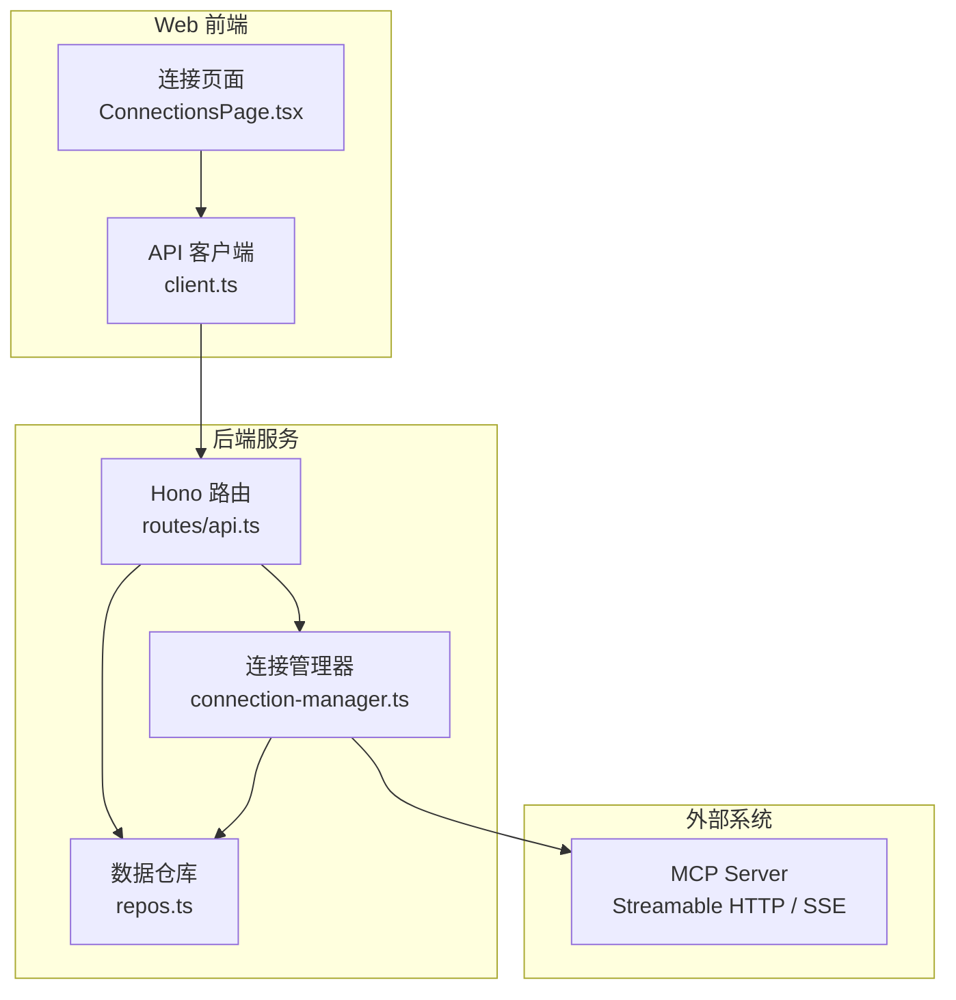
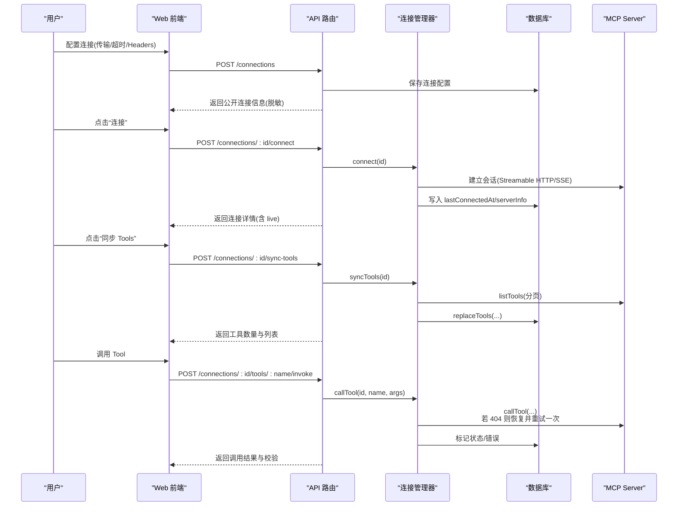
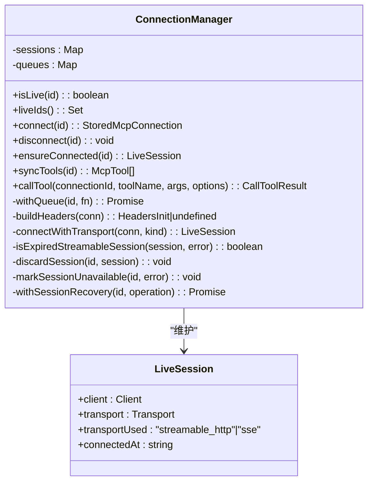
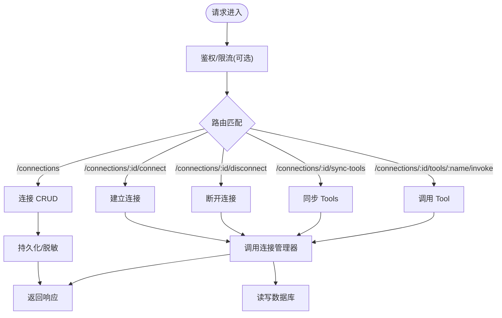
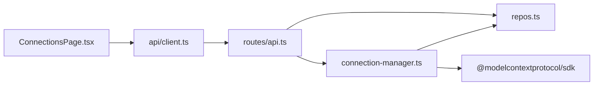

# 连接管理

<cite>
**本文引用的文件**   
- [apps/server/src/mcp/connection-manager.ts](file://apps/server/src/mcp/connection-manager.ts)
- [apps/server/src/routes/api.ts](file://apps/server/src/routes/api.ts)
- [apps/web/src/pages/ConnectionsPage.tsx](file://apps/web/src/pages/ConnectionsPage.tsx)
- [packages/shared/src/types.ts](file://packages/shared/src/types.ts)
- [apps/server/src/db/repos.ts](file://apps/server/src/db/repos.ts)
- [apps/web/src/api/client.ts](file://apps/web/src/api/client.ts)
- [scripts/session-recovery.test.ts](file://scripts/session-recovery.test.ts)
- [README.md](file://README.md)
</cite>

## 目录
1. [简介](#简介)
2. [项目结构](#项目结构)
3. [核心组件](#核心组件)
4. [架构总览](#架构总览)
5. [详细组件分析](#详细组件分析)
6. [依赖关系分析](#依赖关系分析)
7. [性能与超时配置](#性能与超时配置)
8. [故障排除指南](#故障排除指南)
9. [最佳实践与安全建议](#最佳实践与安全建议)
10. [结论](#结论)

## 简介
本文件聚焦“连接管理”能力，系统性说明如何配置与管理多个 MCP Server 连接，涵盖：
- Streamable HTTP 与 SSE 协议的选择与回退策略
- 自定义 Headers 设置与凭据安全
- 连接超时、状态监控与会话恢复
- 连接生命周期、自动重连机制与错误诊断
- 实际配置示例与排障要点

## 项目结构
连接管理涉及前后端协作：前端提供连接配置界面与操作入口；后端通过 Hono API 暴露连接管理接口，并基于 MCP SDK 建立和维护到远端 MCP Server 的会话。

图表来源
- [apps/web/src/pages/ConnectionsPage.tsx:1-291](file://apps/web/src/pages/ConnectionsPage.tsx#L1-L291)
- [apps/web/src/api/client.ts:1-122](file://apps/web/src/api/client.ts#L1-L122)
- [apps/server/src/routes/api.ts:1-277](file://apps/server/src/routes/api.ts#L1-L277)
- [apps/server/src/mcp/connection-manager.ts:1-383](file://apps/server/src/mcp/connection-manager.ts#L1-L383)
- [apps/server/src/db/repos.ts:1-660](file://apps/server/src/db/repos.ts#L1-L660)

章节来源
- [apps/web/src/pages/ConnectionsPage.tsx:1-291](file://apps/web/src/pages/ConnectionsPage.tsx#L1-L291)
- [apps/web/src/api/client.ts:1-122](file://apps/web/src/api/client.ts#L1-L122)
- [apps/server/src/routes/api.ts:1-277](file://apps/server/src/routes/api.ts#L1-L277)
- [apps/server/src/mcp/connection-manager.ts:1-383](file://apps/server/src/mcp/connection-manager.ts#L1-L383)
- [apps/server/src/db/repos.ts:1-660](file://apps/server/src/db/repos.ts#L1-L660)

## 核心组件
- 连接管理器（ConnectionManager）
  - 负责创建/维护 MCP Client 与 Transport（StreamableHTTP 或 SSE），封装连接、断开、工具同步与调用、会话恢复等逻辑。
- API 路由层（routes/api.ts）
  - 暴露连接 CRUD、连接/断开、同步 Tools、调用 Tool 等 REST 接口，并对敏感字段进行脱敏处理。
- Web 连接页面（ConnectionsPage.tsx）
  - 提供新建/编辑/删除连接、选择传输类型、设置超时、填写 Headers JSON、连接/断开、同步 Tools 等操作。
- 数据仓库（repos.ts）
  - 持久化连接配置、Tools 元信息、运行记录等，并提供连接在线状态注入。
- 共享类型（types.ts）
  - 定义连接、工具、用例、运行结果等数据结构，统一前后端契约。

章节来源
- [apps/server/src/mcp/connection-manager.ts:1-383](file://apps/server/src/mcp/connection-manager.ts#L1-L383)
- [apps/server/src/routes/api.ts:1-277](file://apps/server/src/routes/api.ts#L1-L277)
- [apps/web/src/pages/ConnectionsPage.tsx:1-291](file://apps/web/src/pages/ConnectionsPage.tsx#L1-L291)
- [apps/server/src/db/repos.ts:1-660](file://apps/server/src/db/repos.ts#L1-L660)
- [packages/shared/src/types.ts:1-229](file://packages/shared/src/types.ts#L1-L229)

## 架构总览
连接管理的端到端流程如下：
- 用户在 Web 界面配置连接（URL、传输类型、超时、Headers）。
- 前端通过 API 创建/更新连接，后端持久化配置。
- 用户点击“连接”，后端根据配置的传输类型尝试建立 MCP 会话，支持 auto 模式下的回退。
- 同步 Tools 时，后端遍历分页获取工具列表并落库。
- 调用 Tool 时，后端在必要时执行一次会话恢复重试，最终返回结构化结果与校验信息。

图表来源
- [apps/web/src/pages/ConnectionsPage.tsx:1-291](file://apps/web/src/pages/ConnectionsPage.tsx#L1-L291)
- [apps/web/src/api/client.ts:1-122](file://apps/web/src/api/client.ts#L1-L122)
- [apps/server/src/routes/api.ts:1-277](file://apps/server/src/routes/api.ts#L1-L277)
- [apps/server/src/mcp/connection-manager.ts:1-383](file://apps/server/src/mcp/connection-manager.ts#L1-L383)
- [apps/server/src/db/repos.ts:1-660](file://apps/server/src/db/repos.ts#L1-L660)

## 详细组件分析

### 连接管理器（ConnectionManager）
职责与关键点：
- 会话管理
  - 使用 Map 维护活跃会话，提供 isLive/liveIds 查询。
  - withQueue 保证同一连接的操作串行化，避免并发冲突。
- 传输与连接
  - 支持 streamable_http 与 sse 两种传输；auto 模式下按顺序尝试。
  - 构建请求头时从连接配置读取 headers，空对象不附加。
- 连接生命周期
  - connect：加载配置、尝试传输、记录 serverInfo 与时间戳、失败写 lastError。
  - disconnect：终止会话（如支持）、关闭 client。
  - ensureConnected：按需建立连接。
- 会话恢复
  - withSessionRecovery：当检测到 Streamable HTTP 会话过期（404）时，丢弃旧会话，重建并最多重试一次；其他错误直接抛出。
  - discardSession：清理本地资源。
  - markSessionUnavailable：将错误信息持久化。
- 工具同步
  - syncTools：分页拉取 tools，替换本地缓存。
- 工具调用
  - callTool：带超时控制（AbortController + Promise.race），区分超时、协议错误、工具错误；输出结构化内容并进行 Schema 校验。

图表来源
- [apps/server/src/mcp/connection-manager.ts:1-383](file://apps/server/src/mcp/connection-manager.ts#L1-L383)

章节来源
- [apps/server/src/mcp/connection-manager.ts:1-383](file://apps/server/src/mcp/connection-manager.ts#L1-L383)

### API 路由层（routes/api.ts）
职责与关键点：
- 健康检查与健康指标（包含在线连接数）。
- 连接 CRUD：创建、更新、删除、查询；对外返回公开字段（隐藏 headers 值，仅返回 headerNames）。
- 连接控制：connect/disconnect。
- 工具管理：同步、列出、查询单个工具。
- 工具调用：invoke 接口，内部委托给用例运行器持久化调用记录。
- 导入导出：导出包含完整凭据（需用户确认），导入批量创建连接与用例。

图表来源
- [apps/server/src/routes/api.ts:1-277](file://apps/server/src/routes/api.ts#L1-L277)
- [apps/server/src/mcp/connection-manager.ts:1-383](file://apps/server/src/mcp/connection-manager.ts#L1-L383)
- [apps/server/src/db/repos.ts:1-660](file://apps/server/src/db/repos.ts#L1-L660)

章节来源
- [apps/server/src/routes/api.ts:1-277](file://apps/server/src/routes/api.ts#L1-L277)

### Web 连接页面（ConnectionsPage.tsx）
职责与关键点：
- 表单字段：名称、URL、传输类型（auto/streamable_http/sse）、超时（ms）、描述、Headers JSON。
- 操作按钮：连接、断开、同步 Tools、进入工作台、删除。
- 导入/导出：导出包含完整凭据，需二次确认；导入批量恢复连接与用例。
- 状态展示：在线/离线标签、最近连接时间、错误信息。

章节来源
- [apps/web/src/pages/ConnectionsPage.tsx:1-291](file://apps/web/src/pages/ConnectionsPage.tsx#L1-L291)

### 数据仓库（repos.ts）
职责与关键点：
- 连接实体映射：存储 headersJson、serverInfoJson 等 JSON 字段，并在读取时解析。
- 连接状态标记：lastConnectedAt、lastError、serverInfo。
- Tools 同步：清空后批量插入，保留原始 raw 以便调试。
- 运行记录：持久化每次调用的参数、结果、断言、Schema 校验、原始响应等。

章节来源
- [apps/server/src/db/repos.ts:1-660](file://apps/server/src/db/repos.ts#L1-L660)

### 共享类型（types.ts）
职责与关键点：
- 传输类型：streamable_http | sse | auto。
- 连接模型：包含 headerNames（仅名称，不含值）、timeoutMs、serverInfo、live 等。
- 运行结果：区分 success/tool_error/protocol_error/timeout/cancelled。
- 导出包：ExportBundle 包含 connections 与 cases，用于迁移与备份。

章节来源
- [packages/shared/src/types.ts:1-229](file://packages/shared/src/types.ts#L1-L229)

## 依赖关系分析
- 前端依赖
  - ConnectionsPage.tsx 依赖 api/client.ts 提供的 REST 方法。
- 后端依赖
  - routes/api.ts 依赖 connection-manager.ts 与 repos.ts。
  - connection-manager.ts 依赖 MCP SDK 的 StreamableHTTP 与 SSE 客户端，以及 repos.ts 的状态持久化。
- 测试依赖
  - scripts/session-recovery.test.ts 验证会话恢复、404 场景、凭据泄露防护等。

图表来源
- [apps/web/src/pages/ConnectionsPage.tsx:1-291](file://apps/web/src/pages/ConnectionsPage.tsx#L1-L291)
- [apps/web/src/api/client.ts:1-122](file://apps/web/src/api/client.ts#L1-L122)
- [apps/server/src/routes/api.ts:1-277](file://apps/server/src/routes/api.ts#L1-L277)
- [apps/server/src/mcp/connection-manager.ts:1-383](file://apps/server/src/mcp/connection-manager.ts#L1-L383)
- [apps/server/src/db/repos.ts:1-660](file://apps/server/src/db/repos.ts#L1-L660)

章节来源
- [apps/web/src/pages/ConnectionsPage.tsx:1-291](file://apps/web/src/pages/ConnectionsPage.tsx#L1-L291)
- [apps/web/src/api/client.ts:1-122](file://apps/web/src/api/client.ts#L1-L122)
- [apps/server/src/routes/api.ts:1-277](file://apps/server/src/routes/api.ts#L1-L277)
- [apps/server/src/mcp/connection-manager.ts:1-383](file://apps/server/src/mcp/connection-manager.ts#L1-L383)
- [apps/server/src/db/repos.ts:1-660](file://apps/server/src/db/repos.ts#L1-L660)

## 性能与超时配置
- 连接超时
  - 默认超时为 60000ms，可通过连接配置的 timeoutMs 覆盖。
  - 调用 Tool 时使用 AbortController 与 Promise.race 实现超时中断，避免长时间阻塞。
- 并发与队列
  - withQueue 对同一连接的操作串行化，避免重复连接与竞态条件。
- 会话恢复
  - 仅在 Streamable HTTP 且出现 404 时触发一次恢复重试，减少不必要的重连开销。
- 工具同步
  - 分页拉取，避免一次性加载大量工具导致内存压力。

章节来源
- [apps/server/src/mcp/connection-manager.ts:1-383](file://apps/server/src/mcp/connection-manager.ts#L1-L383)
- [apps/web/src/pages/ConnectionsPage.tsx:1-291](file://apps/web/src/pages/ConnectionsPage.tsx#L1-L291)

## 故障排除指南
常见问题与定位步骤：
- 无法连接
  - 检查 URL 是否正确、传输类型是否匹配服务端能力。
  - 查看连接卡片中的 lastError 与 lastConnectedAt。
  - 确认自定义 Headers 是否为合法 JSON，且包含必要的认证头。
- 连接不稳定/频繁断开
  - 观察是否出现 404 导致的会话过期；系统会自动恢复一次，若仍失败会标记不可用。
  - 适当增大 timeoutMs，确保网络抖动下能完成调用。
- 工具调用超时
  - 调整 timeoutMs；检查服务端处理耗时；必要时优化服务端或分片调用。
- 凭据泄露风险
  - 常规连接 API 不会返回 headers 值，只返回 headerNames。
  - 导出文件包含完整凭据，请谨慎保存与分享。

参考测试用例行为：
- 会话恢复：首次 404 后重建会话并成功重试一次。
- 非 404 错误（如 401/500）不进行自动重连。
- 工具错误与超时不会被当作会话问题重试。
- 连接 API 不泄露 Header 值。

章节来源
- [scripts/session-recovery.test.ts:1-293](file://scripts/session-recovery.test.ts#L1-L293)
- [apps/server/src/mcp/connection-manager.ts:1-383](file://apps/server/src/mcp/connection-manager.ts#L1-L383)
- [apps/server/src/routes/api.ts:1-277](file://apps/server/src/routes/api.ts#L1-L277)

## 最佳实践与安全建议
- 传输类型选择
  - 优先使用 streamable_http；若服务端不支持，再选择 sse；auto 模式适合不确定环境。
- 自定义 Headers
  - 使用 JSON 文本输入，例如 Authorization、Cookie、X-API-Key 等。
  - 定期轮换凭据，避免硬编码；导出文件仅保存在可信位置。
- 超时配置
  - 根据服务端 SLA 设置合理的 timeoutMs，避免过短导致误判、过长影响用户体验。
- 状态监控
  - 关注 live 状态、lastConnectedAt、lastError；结合健康检查接口了解整体在线连接数。
- 安全加固
  - 生产部署启用 HTTPS、身份认证、访问控制与速率限制。
  - 不要将导出文件提交至版本控制系统。

章节来源
- [apps/web/src/pages/ConnectionsPage.tsx:1-291](file://apps/web/src/pages/ConnectionsPage.tsx#L1-L291)
- [apps/server/src/routes/api.ts:1-277](file://apps/server/src/routes/api.ts#L1-L277)
- [README.md:157-162](file://README.md#L157-L162)

## 结论
连接管理模块以清晰的职责划分与健壮的错误处理为核心，提供了多协议支持、灵活的配置项、完善的会话恢复与状态监控能力。通过合理配置传输类型、超时与 Headers，并结合导入导出与历史记录，可高效完成 MCP Server 的连接、调试与回归验证。在生产环境中，应重视凭据安全与网络稳定性，配合反向代理与监控手段保障系统可靠性。