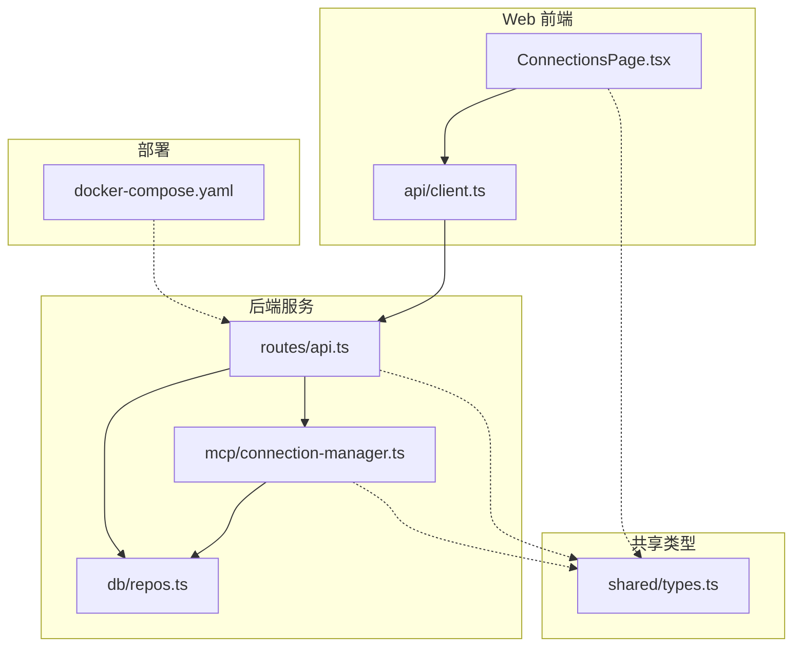
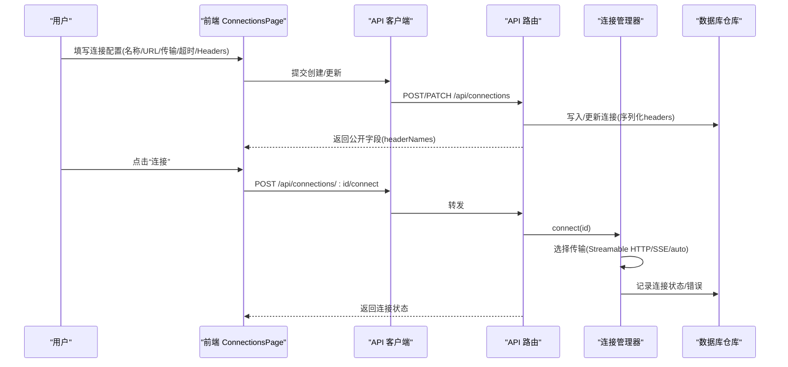
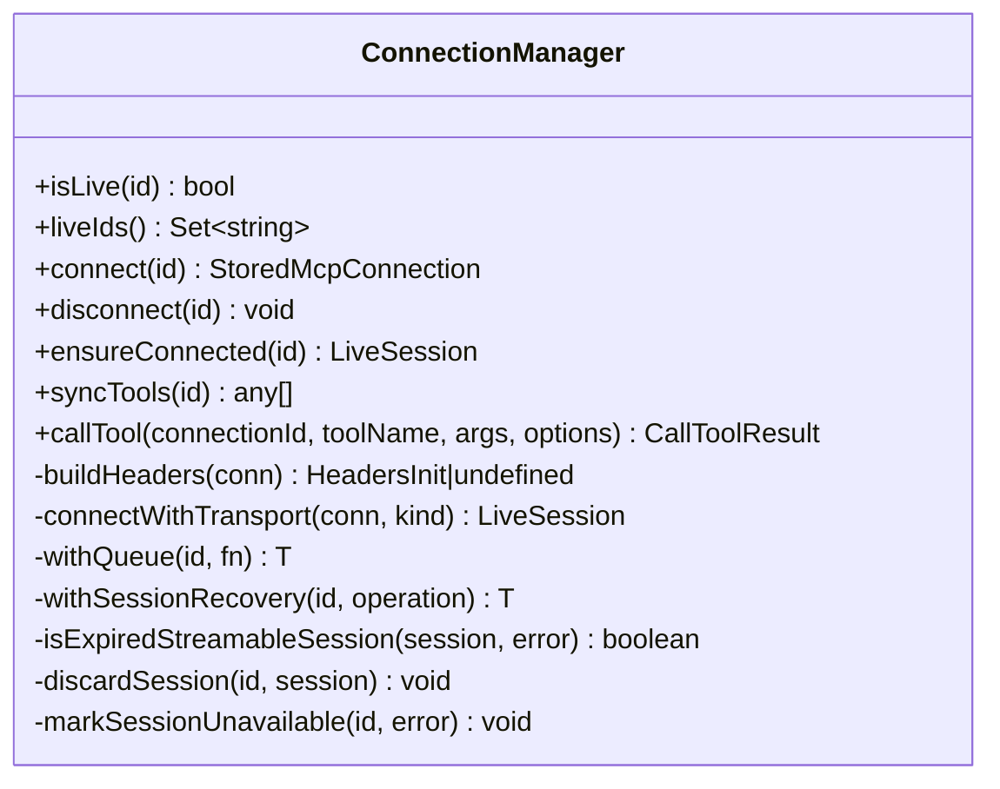
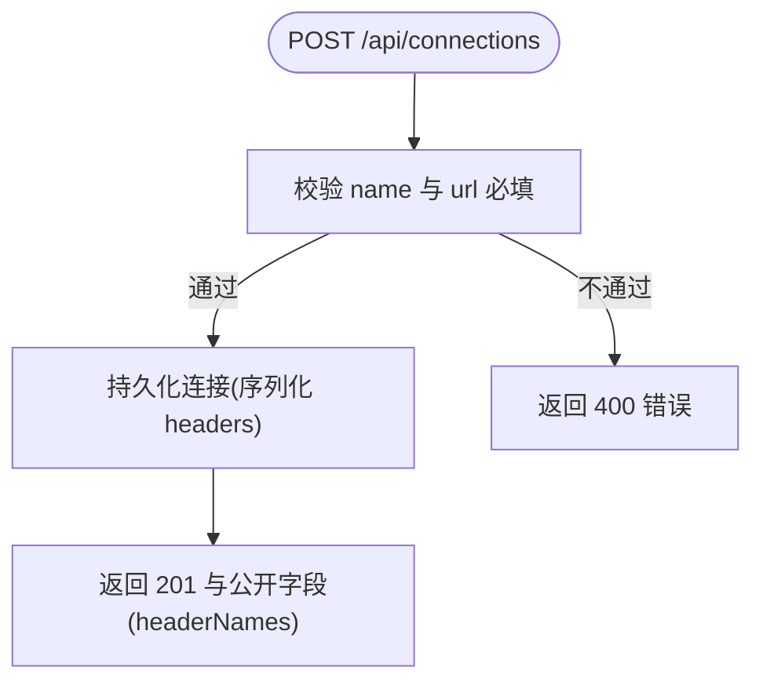
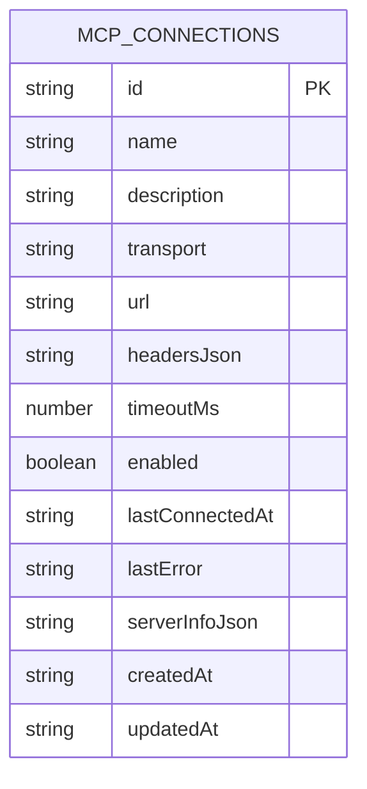
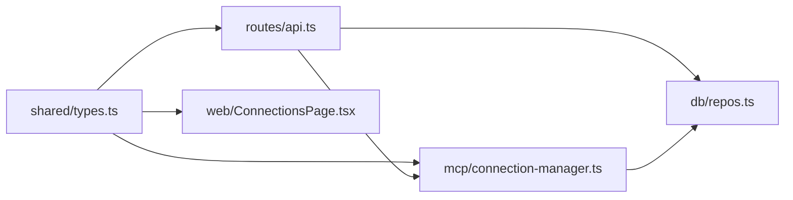

# 连接配置

<cite>
**本文引用的文件**
- [apps/server/src/mcp/connection-manager.ts](file://apps/server/src/mcp/connection-manager.ts)
- [apps/server/src/routes/api.ts](file://apps/server/src/routes/api.ts)
- [apps/server/src/db/repos.ts](file://apps/server/src/db/repos.ts)
- [packages/shared/src/types.ts](file://packages/shared/src/types.ts)
- [apps/web/src/pages/ConnectionsPage.tsx](file://apps/web/src/pages/ConnectionsPage.tsx)
- [apps/web/src/api/client.ts](file://apps/web/src/api/client.ts)
- [deployment/docker-compose.yaml](file://deployment/docker-compose.yaml)
</cite>

## 目录
1. [简介](#简介)
2. [项目结构](#项目结构)
3. [核心组件](#核心组件)
4. [架构总览](#架构总览)
5. [详细组件分析](#详细组件分析)
6. [依赖关系分析](#依赖关系分析)
7. [性能与超时](#性能与超时)
8. [故障排查指南](#故障排查指南)
9. [结论](#结论)
10. [附录：场景化配置示例](#附录场景化配置示例)

## 简介
本文件聚焦于 MCP Server 的连接配置，涵盖以下方面：
- URL 设置与传输协议选择（Streamable HTTP、SSE、Auto）
- 自定义 Headers 配置与凭据管理
- 超时时间设置
- 连接配置验证规则与错误处理机制
- 不同环境下的配置示例（本地开发、生产、需要认证）
- 安全最佳实践（敏感信息保护与环境变量使用）

## 项目结构
与连接配置相关的关键位置如下：
- 服务端连接管理与调用：apps/server/src/mcp/connection-manager.ts
- API 路由与输入校验：apps/server/src/routes/api.ts
- 数据持久化与映射：apps/server/src/db/repos.ts
- 共享类型定义：packages/shared/src/types.ts
- Web 前端连接表单与导入导出：apps/web/src/pages/ConnectionsPage.tsx, apps/web/src/api/client.ts
- 部署环境变量：deployment/docker-compose.yaml

图表来源
- [apps/web/src/pages/ConnectionsPage.tsx:1-291](file://apps/web/src/pages/ConnectionsPage.tsx#L1-L291)
- [apps/web/src/api/client.ts:1-122](file://apps/web/src/api/client.ts#L1-L122)
- [apps/server/src/routes/api.ts:1-277](file://apps/server/src/routes/api.ts#L1-L277)
- [apps/server/src/mcp/connection-manager.ts:1-383](file://apps/server/src/mcp/connection-manager.ts#L1-L383)
- [apps/server/src/db/repos.ts:1-660](file://apps/server/src/db/repos.ts#L1-L660)
- [packages/shared/src/types.ts:1-229](file://packages/shared/src/types.ts#L1-L229)
- [deployment/docker-compose.yaml:1-39](file://deployment/docker-compose.yaml#L1-L39)

章节来源
- [apps/server/src/mcp/connection-manager.ts:1-383](file://apps/server/src/mcp/connection-manager.ts#L1-L383)
- [apps/server/src/routes/api.ts:1-277](file://apps/server/src/routes/api.ts#L1-L277)
- [apps/server/src/db/repos.ts:1-660](file://apps/server/src/db/repos.ts#L1-L660)
- [packages/shared/src/types.ts:1-229](file://packages/shared/src/types.ts#L1-L229)
- [apps/web/src/pages/ConnectionsPage.tsx:1-291](file://apps/web/src/pages/ConnectionsPage.tsx#L1-L291)
- [apps/web/src/api/client.ts:1-122](file://apps/web/src/api/client.ts#L1-L122)
- [deployment/docker-compose.yaml:1-39](file://deployment/docker-compose.yaml#L1-L39)

## 核心组件
- 连接管理器（ConnectionManager）
  - 负责创建客户端实例、选择传输（Streamable HTTP / SSE）、构建请求头、连接生命周期管理、会话恢复与工具调用。
- API 路由层
  - 提供连接 CRUD、连接/断开、同步 Tools、调用工具等接口；对创建连接的 name/url 做基础校验；对外暴露的公开连接对象不包含敏感 Header 值。
- 数据仓库层（repos）
  - 负责连接配置的持久化、读取、更新与状态标记；将 headers 以 JSON 字符串存储，并在返回时仅暴露 headerNames。
- 前端页面与 API 客户端
  - 提供新建连接表单（名称、URL、传输、超时、描述、Headers JSON），并支持导入/导出包含凭据的配置包。

章节来源
- [apps/server/src/mcp/connection-manager.ts:39-147](file://apps/server/src/mcp/connection-manager.ts#L39-L147)
- [apps/server/src/routes/api.ts:46-85](file://apps/server/src/routes/api.ts#L46-L85)
- [apps/server/src/db/repos.ts:235-279](file://apps/server/src/db/repos.ts#L235-L279)
- [apps/web/src/pages/ConnectionsPage.tsx:245-286](file://apps/web/src/pages/ConnectionsPage.tsx#L245-L286)
- [apps/web/src/api/client.ts:31-53](file://apps/web/src/api/client.ts#L31-L53)

## 架构总览
连接配置从前端到后端的完整流程如下：
- 用户在“连接”页面填写配置（含 URL、传输、超时、Headers JSON）。
- 前端通过 API 客户端提交到后端。
- 后端在创建/更新连接时将 headers 序列化存储，并在查询时仅返回 headerNames。
- 连接建立时，根据 transport 决定使用 Streamable HTTP 或 SSE；若为 auto，则先尝试 Streamable HTTP，失败再回退至 SSE。
- 调用工具时，按连接配置的 timeoutMs 控制超时，并结合 AbortController 实现中断。

图表来源
- [apps/web/src/pages/ConnectionsPage.tsx:180-203](file://apps/web/src/pages/ConnectionsPage.tsx#L180-L203)
- [apps/web/src/api/client.ts:46-53](file://apps/web/src/api/client.ts#L46-L53)
- [apps/server/src/routes/api.ts:77-85](file://apps/server/src/routes/api.ts#L77-L85)
- [apps/server/src/mcp/connection-manager.ts:75-147](file://apps/server/src/mcp/connection-manager.ts#L75-L147)
- [apps/server/src/db/repos.ts:288-312](file://apps/server/src/db/repos.ts#L288-L312)

## 详细组件分析

### 连接管理器（ConnectionManager）
职责与关键点：
- 传输选择与构建
  - 当 transport 为 streamable_http 时使用 StreamableHTTPClientTransport；为 sse 时使用 SSEClientTransport；为 auto 时优先尝试 streamable_http，失败再回退 sse。
- 请求头注入
  - 从连接配置中读取 headers，构造 requestInit.headers 传入 SDK 传输层。
- 连接生命周期与会话恢复
  - 维护内存中的 LiveSession；当检测到 Streamable HTTP 会话过期（如 404）时自动丢弃旧会话并重连。
- 工具调用与超时
  - 使用 AbortController 与 Promise.race 实现超时控制；默认超时来自连接配置的 timeoutMs，可被调用选项覆盖。

图表来源
- [apps/server/src/mcp/connection-manager.ts:39-383](file://apps/server/src/mcp/connection-manager.ts#L39-L383)

章节来源
- [apps/server/src/mcp/connection-manager.ts:69-99](file://apps/server/src/mcp/connection-manager.ts#L69-L99)
- [apps/server/src/mcp/connection-manager.ts:101-147](file://apps/server/src/mcp/connection-manager.ts#L101-L147)
- [apps/server/src/mcp/connection-manager.ts:175-268](file://apps/server/src/mcp/connection-manager.ts#L175-L268)
- [apps/server/src/mcp/connection-manager.ts:300-379](file://apps/server/src/mcp/connection-manager.ts#L300-L379)

### API 路由层（连接相关）
- 创建连接
  - 校验必填项：name 与 url；其余字段可选（transport、headers、timeoutMs、enabled）。
- 更新连接
  - 允许部分字段更新，包括 headers 与 timeoutMs。
- 连接/断开
  - 调用连接管理器进行实际连接/断开，并返回公开连接对象（不含敏感 Header 值）。
- 同步 Tools
  - 触发连接管理器拉取远端工具列表并落库。

图表来源
- [apps/server/src/routes/api.ts:46-51](file://apps/server/src/routes/api.ts#L46-L51)
- [apps/server/src/routes/api.ts:60-68](file://apps/server/src/routes/api.ts#L60-L68)
- [apps/server/src/routes/api.ts:77-85](file://apps/server/src/routes/api.ts#L77-L85)
- [apps/server/src/routes/api.ts:94-102](file://apps/server/src/routes/api.ts#L94-L102)

章节来源
- [apps/server/src/routes/api.ts:46-85](file://apps/server/src/routes/api.ts#L46-L85)
- [apps/server/src/routes/api.ts:94-102](file://apps/server/src/routes/api.ts#L94-L102)

### 数据仓库层（repos）
- 连接模型
  - 内部存储类型为 StoredMcpConnection，包含 headers（Record<string,string>）；对外公开类型为 McpConnection，仅暴露 headerNames。
- 持久化细节
  - headers 以 JSON 字符串存储；查询时解析为对象；对外返回时仅列出键名，避免泄露敏感值。
- 状态标记
  - 成功连接时记录 lastConnectedAt、serverInfo；失败时记录 lastError。

图表来源
- [apps/server/src/db/repos.ts:27-69](file://apps/server/src/db/repos.ts#L27-L69)
- [apps/server/src/db/repos.ts:235-279](file://apps/server/src/db/repos.ts#L235-L279)
- [apps/server/src/db/repos.ts:288-312](file://apps/server/src/db/repos.ts#L288-L312)

章节来源
- [apps/server/src/db/repos.ts:27-69](file://apps/server/src/db/repos.ts#L27-L69)
- [apps/server/src/db/repos.ts:235-279](file://apps/server/src/db/repos.ts#L235-L279)
- [apps/server/src/db/repos.ts:288-312](file://apps/server/src/db/repos.ts#L288-L312)

### 前端连接表单与导入导出
- 表单字段
  - 名称、URL、传输（auto/streamable_http/sse）、超时(ms)、描述、Headers JSON。
- 导入导出
  - 导出会包含完整的 headers（含凭据），需保存到可信位置；导入会将 connections 与 cases 一并恢复。

章节来源
- [apps/web/src/pages/ConnectionsPage.tsx:245-286](file://apps/web/src/pages/ConnectionsPage.tsx#L245-L286)
- [apps/web/src/pages/ConnectionsPage.tsx:92-143](file://apps/web/src/pages/ConnectionsPage.tsx#L92-L143)
- [apps/web/src/api/client.ts:115-121](file://apps/web/src/api/client.ts#L115-L121)

## 依赖关系分析
- 类型依赖
  - TransportType、CreateConnectionInput、UpdateConnectionInput、McpConnection 等类型由 shared/types.ts 统一定义，前后端共用。
- 运行时依赖
  - 连接管理器依赖 @modelcontextprotocol/sdk 提供的 StreamableHTTPClientTransport 与 SSEClientTransport。
- 外部集成
  - 通过 API 路由与前端交互；通过 repos 与数据库交互；通过 docker-compose 暴露端口与环境变量。

图表来源
- [packages/shared/src/types.ts:1-90](file://packages/shared/src/types.ts#L1-L90)
- [apps/server/src/routes/api.ts:1-20](file://apps/server/src/routes/api.ts#L1-L20)
- [apps/server/src/mcp/connection-manager.ts:1-18](file://apps/server/src/mcp/connection-manager.ts#L1-L18)
- [apps/web/src/pages/ConnectionsPage.tsx:1-30](file://apps/web/src/pages/ConnectionsPage.tsx#L1-L30)

章节来源
- [packages/shared/src/types.ts:1-90](file://packages/shared/src/types.ts#L1-L90)
- [apps/server/src/mcp/connection-manager.ts:1-18](file://apps/server/src/mcp/connection-manager.ts#L1-L18)
- [apps/server/src/routes/api.ts:1-20](file://apps/server/src/routes/api.ts#L1-L20)
- [apps/web/src/pages/ConnectionsPage.tsx:1-30](file://apps/web/src/pages/ConnectionsPage.tsx#L1-L30)

## 性能与超时
- 超时策略
  - 工具调用默认超时取自连接配置的 timeoutMs；可通过调用参数覆盖。
  - 使用 AbortController 与 Promise.race 实现精确超时控制，避免资源泄漏。
- 连接重试与恢复
  - Auto 模式下优先 Streamable HTTP，失败自动回退 SSE，提升可用性。
  - 针对 Streamable HTTP 会话过期（404）自动清理旧会话并重连，减少人工干预。

章节来源
- [apps/server/src/mcp/connection-manager.ts:300-379](file://apps/server/src/mcp/connection-manager.ts#L300-L379)
- [apps/server/src/mcp/connection-manager.ts:101-147](file://apps/server/src/mcp/connection-manager.ts#L101-L147)
- [apps/server/src/mcp/connection-manager.ts:175-268](file://apps/server/src/mcp/connection-manager.ts#L175-L268)

## 故障排查指南
- 常见错误与定位
  - 连接失败：查看连接卡片上的 lastError 与最近连接时间；确认 URL、传输类型与网络可达性。
  - 认证失败：检查 Headers JSON 是否合法且包含必要凭据（如 Authorization、Cookie、API Key）。
  - 超时：增大 timeoutMs 或优化远端服务响应。
- 错误传播路径
  - 连接/断开、同步 Tools 等接口在异常时返回 502/500 及错误消息；前端统一提示。
- 会话恢复日志
  - 当发生 Streamable HTTP 会话过期时，系统会输出事件日志用于诊断。

章节来源
- [apps/server/src/routes/api.ts:77-85](file://apps/server/src/routes/api.ts#L77-L85)
- [apps/server/src/routes/api.ts:94-102](file://apps/server/src/routes/api.ts#L94-L102)
- [apps/server/src/mcp/connection-manager.ts:209-268](file://apps/server/src/mcp/connection-manager.ts#L209-L268)
- [apps/web/src/pages/ConnectionsPage.tsx:170-176](file://apps/web/src/pages/ConnectionsPage.tsx#L170-L176)

## 结论
- 连接配置围绕 URL、传输协议、Headers、超时四个维度展开，具备完善的验证、持久化与错误处理机制。
- Auto 模式与自动会话恢复提升了稳定性；对外接口严格屏蔽敏感 Header 值，保障安全性。
- 建议在生产环境中结合环境变量与最小权限原则管理凭据，并通过导入导出进行备份与迁移。

## 附录：场景化配置示例

说明
- 以下为配置要点与步骤指引，具体字段取值请结合实际环境替换。

- 本地开发环境（无需认证）
  - URL：指向本地 MCP 服务地址
  - 传输：auto（便于快速适配）
  - 超时：默认即可（例如 60000ms）
  - Headers：留空或仅添加调试用非敏感头
  - 操作：在“连接”页面新建连接，保存后点击“连接”，随后“同步 Tools”

- 生产环境（稳定可靠）
  - URL：使用域名或内网服务地址
  - 传输：streamable_http（若远端支持）或 sse（兼容）
  - 超时：根据业务 SLA 调整（例如 30000-120000ms）
  - Headers：按需配置鉴权头（如 Authorization、X-API-Key）
  - 操作：创建连接后连接并同步 Tools；定期导出备份

- 需要认证的连接（Bearer Token）
  - URL：远端 MCP 服务地址
  - 传输：auto 或指定 streamable_http/sse
  - 超时：合理设置
  - Headers：包含鉴权头（例如 Authorization: Bearer <token>）
  - 注意：导出文件包含完整凭据，请妥善保存；导入时谨慎分享

- 环境变量与部署
  - 通过 docker-compose 的环境变量配置服务端口、数据库与 CORS 等；连接凭据建议在应用侧通过环境变量注入，避免硬编码。

章节来源
- [apps/web/src/pages/ConnectionsPage.tsx:245-286](file://apps/web/src/pages/ConnectionsPage.tsx#L245-L286)
- [apps/server/src/routes/api.ts:46-51](file://apps/server/src/routes/api.ts#L46-L51)
- [deployment/docker-compose.yaml:11-16](file://deployment/docker-compose.yaml#L11-L16)