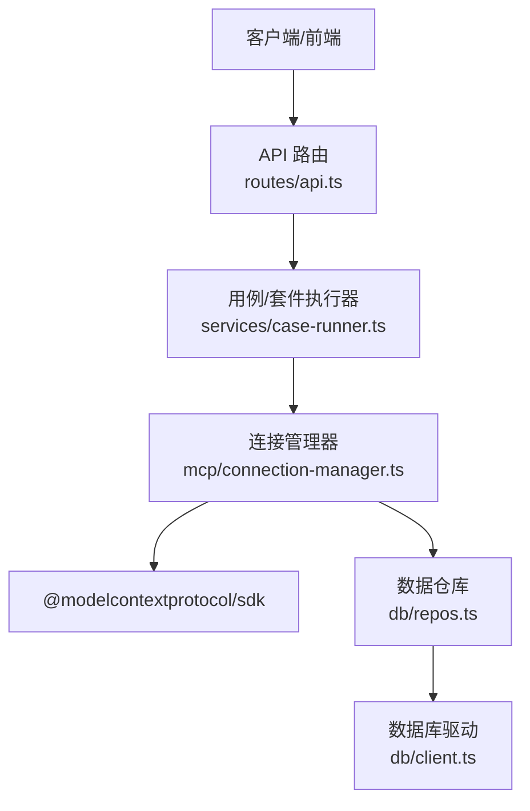
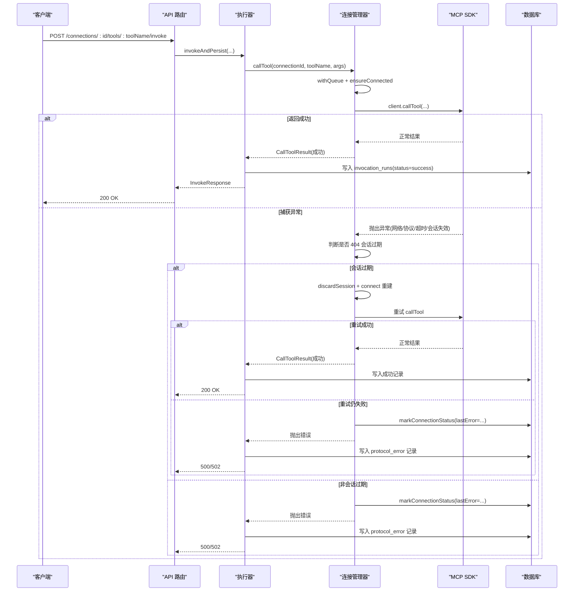
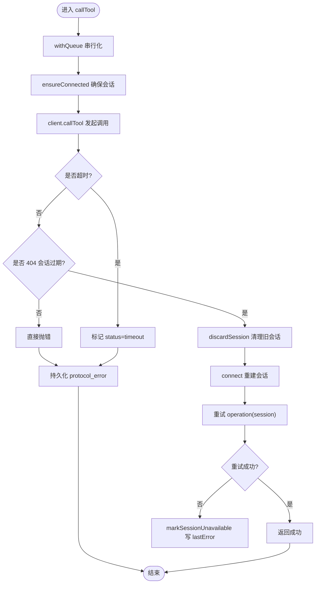
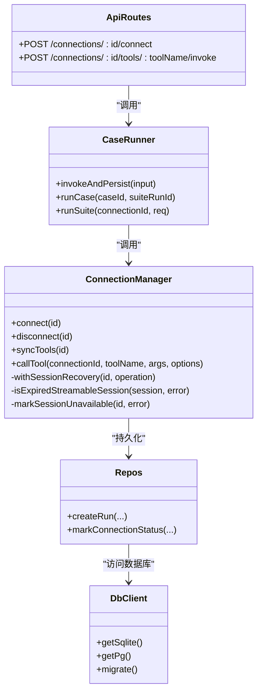

# 错误处理

<cite>
**本文引用的文件**   
- [apps/server/src/mcp/connection-manager.ts](file://apps/server/src/mcp/connection-manager.ts)
- [apps/server/src/routes/api.ts](file://apps/server/src/routes/api.ts)
- [apps/server/src/services/case-runner.ts](file://apps/server/src/services/case-runner.ts)
- [apps/server/src/db/client.ts](file://apps/server/src/db/client.ts)
- [apps/server/src/db/repos.ts](file://apps/server/src/db/repos.ts)
- [packages/shared/src/types.ts](file://packages/shared/src/types.ts)
- [scripts/session-recovery.test.ts](file://scripts/session-recovery.test.ts)
- [apps/server/src/index.ts](file://apps/server/src/index.ts)
</cite>

## 目录
1. [简介](#简介)
2. [项目结构](#项目结构)
3. [核心组件](#核心组件)
4. [架构总览](#架构总览)
5. [详细组件分析](#详细组件分析)
6. [依赖关系分析](#依赖关系分析)
7. [性能与可靠性考量](#性能与可靠性考量)
8. [故障排查指南](#故障排查指南)
9. [结论](#结论)
10. [附录：错误码与消息规范](#附录错误码与消息规范)

## 简介
本文件系统性梳理连接过程中的错误类型、错误码定义、错误消息格式与恢复机制，覆盖网络错误、协议错误、超时错误与会话失效错误。文档同时给出常见错误的排查步骤、解决方案以及错误日志记录与调试信息收集方法，帮助读者快速定位并解决问题。

## 项目结构
围绕错误处理的关键代码分布在以下模块：
- 连接管理与会话恢复：connection-manager.ts
- API 层错误映射：routes/api.ts
- 调用执行与持久化：services/case-runner.ts
- 数据库模式与状态字段：db/client.ts, db/repos.ts
- 共享类型（运行状态、断言等）：packages/shared/src/types.ts
- 会话恢复集成测试：scripts/session-recovery.test.ts
- 应用启动入口：apps/server/src/index.ts

图表来源
- [apps/server/src/routes/api.ts:1-277](file://apps/server/src/routes/api.ts#L1-L277)
- [apps/server/src/services/case-runner.ts:1-161](file://apps/server/src/services/case-runner.ts#L1-L161)
- [apps/server/src/mcp/connection-manager.ts:1-383](file://apps/server/src/mcp/connection-manager.ts#L1-L383)
- [apps/server/src/db/repos.ts:1-660](file://apps/server/src/db/repos.ts#L1-L660)
- [apps/server/src/db/client.ts:1-267](file://apps/server/src/db/client.ts#L1-L267)

章节来源
- [apps/server/src/routes/api.ts:1-277](file://apps/server/src/routes/api.ts#L1-L277)
- [apps/server/src/services/case-runner.ts:1-161](file://apps/server/src/services/case-runner.ts#L1-L161)
- [apps/server/src/mcp/connection-manager.ts:1-383](file://apps/server/src/mcp/connection-manager.ts#L1-L383)
- [apps/server/src/db/client.ts:1-267](file://apps/server/src/db/client.ts#L1-L267)
- [apps/server/src/db/repos.ts:1-660](file://apps/server/src/db/repos.ts#L1-L660)
- [packages/shared/src/types.ts:1-229](file://packages/shared/src/types.ts#L1-L229)
- [scripts/session-recovery.test.ts:1-293](file://scripts/session-recovery.test.ts#L1-L293)
- [apps/server/src/index.ts:1-39](file://apps/server/src/index.ts#L1-L39)

## 核心组件
- 连接管理器 ConnectionManager
  - 负责建立/断开 MCP 连接、工具同步、工具调用、会话恢复与错误标记。
  - 关键能力：队列串行化、传输选择（streamable_http/sse）、HTTP 404 会话过期自动重连、超时控制、错误持久化。
- API 路由
  - 将业务异常转换为 HTTP 响应，统一错误消息格式。
- 执行器
  - 封装一次工具调用的完整生命周期，包含断言评估与结果持久化。
- 数据仓库与数据库
  - 维护连接状态（lastError、serverInfo）、调用记录（status、protocolError、schemaValidation）。

章节来源
- [apps/server/src/mcp/connection-manager.ts:1-383](file://apps/server/src/mcp/connection-manager.ts#L1-L383)
- [apps/server/src/routes/api.ts:1-277](file://apps/server/src/routes/api.ts#L1-L277)
- [apps/server/src/services/case-runner.ts:1-161](file://apps/server/src/services/case-runner.ts#L1-L161)
- [apps/server/src/db/repos.ts:1-660](file://apps/server/src/db/repos.ts#L1-L660)
- [apps/server/src/db/client.ts:1-267](file://apps/server/src/db/client.ts#L1-L267)

## 架构总览
下图展示从请求到错误落库的端到端流程，包括会话失效时的自动恢复路径。

图表来源
- [apps/server/src/routes/api.ts:117-138](file://apps/server/src/routes/api.ts#L117-L138)
- [apps/server/src/services/case-runner.ts:11-77](file://apps/server/src/services/case-runner.ts#L11-L77)
- [apps/server/src/mcp/connection-manager.ts:300-379](file://apps/server/src/mcp/connection-manager.ts#L300-L379)
- [apps/server/src/db/repos.ts:476-528](file://apps/server/src/db/repos.ts#L476-L528)

## 详细组件分析

### 连接管理器：错误分类与恢复策略
- 错误分类
  - 网络错误：底层网络不可达、DNS 解析失败、TLS 握手失败等。
  - 协议错误：SDK 抛出的 StreamableHTTPError 或其他协议层异常；HTTP 非 404 的状态码（如 401、500）不触发自动重连。
  - 超时错误：通过 AbortController 与 Promise.race 实现，错误 code 为 TIMEOUT。
  - 会话失效错误：仅当使用 streamable_http 且收到 HTTP 404 时判定为会话过期，触发自动重连。
- 恢复策略
  - 自动重连：在 withSessionRecovery 中检测 404 会话过期，丢弃旧会话后重新 connect，并重试一次操作。
  - 幂等性保障：同一连接的操作通过 withQueue 串行化，避免并发导致的竞态。
  - 状态持久化：markSessionUnavailable 或连接失败时将 lastError 写入连接表，便于前端展示与监控。
- 日志与可观测性
  - 使用 console.warn/info 输出结构化事件，便于外部采集：
    - mcp_session_recovery_started
    - mcp_session_recovery_failed
    - mcp_session_recovery_succeeded

图表来源
- [apps/server/src/mcp/connection-manager.ts:300-379](file://apps/server/src/mcp/connection-manager.ts#L300-L379)
- [apps/server/src/mcp/connection-manager.ts:175-268](file://apps/server/src/mcp/connection-manager.ts#L175-L268)

章节来源
- [apps/server/src/mcp/connection-manager.ts:1-383](file://apps/server/src/mcp/connection-manager.ts#L1-L383)

### API 层：错误映射与响应格式
- 统一错误响应
  - bad(c, message, status) 返回 { error: message }，用于参数校验失败、资源不存在、上游连接失败等场景。
- 典型状态码
  - 400：参数缺失或不合法（例如 name/url 必填）。
  - 404：连接/用例/套件/记录不存在。
  - 500/502：调用失败、连接失败、上游协议错误。
- 安全注意
  - 对外暴露的连接对象不包含 headers 值，仅列出 headerNames，防止密钥泄露。

章节来源
- [apps/server/src/routes/api.ts:1-277](file://apps/server/src/routes/api.ts#L1-L277)

### 执行器：断言与持久化
- 断言评估
  - evaluateAssert 根据配置对 isError、structuredContent、文本内容、时长等进行校验，生成 checks 列表与总体 passed 标志。
- 持久化
  - createRun 将调用结果、断言结果、schema 校验结果、原始响应等写入 invocation_runs 表，便于后续审计与回放。

章节来源
- [apps/server/src/services/assert.ts:1-166](file://apps/server/src/services/assert.ts#L1-L166)
- [apps/server/src/services/case-runner.ts:1-161](file://apps/server/src/services/case-runner.ts#L1-L161)
- [apps/server/src/db/repos.ts:476-528](file://apps/server/src/db/repos.ts#L476-L528)

### 数据库：错误状态与运行记录
- 连接状态字段
  - lastConnectedAt、lastError、serverInfoJson 用于记录最近连接时间与错误摘要。
- 运行记录字段
  - status、isError、resultContent、resultStructured、protocolError、assertResult、schemaValidation、rawResponse 等。
- 迁移与初始化
  - migrate 创建必要表结构与索引，确保错误相关字段可用。

章节来源
- [apps/server/src/db/client.ts:69-245](file://apps/server/src/db/client.ts#L69-L245)
- [apps/server/src/db/repos.ts:288-312](file://apps/server/src/db/repos.ts#L288-L312)
- [apps/server/src/db/repos.ts:476-528](file://apps/server/src/db/repos.ts#L476-L528)

### 共享类型：运行状态与错误模型
- RunStatus
  - success、tool_error、protocol_error、timeout、cancelled。
- InvokeResponse
  - 包含 status、isError、content、structuredContent、schemaValidation、assertResult、protocolError 等。
- SchemaValidationResult
  - ok 与 errors 数组，描述 JSON Schema 校验失败详情。

章节来源
- [packages/shared/src/types.ts:1-229](file://packages/shared/src/types.ts#L1-L229)

### 会话恢复测试：行为验证
- 覆盖场景
  - 首次 404 后自动重连并继续分页/调用。
  - 二次 404 不再重试，直接标记不可用。
  - 非 404 的 HTTP 错误（如 401、500）不进行自动重连。
  - 工具错误与超时不进行自动重连。
  - 对外接口不泄露 headers 值。

章节来源
- [scripts/session-recovery.test.ts:1-293](file://scripts/session-recovery.test.ts#L1-L293)

## 依赖关系分析
- connection-manager 依赖 @modelcontextprotocol/sdk 进行连接与调用，依赖 repos 进行状态持久化。
- api 路由依赖 case-runner 和 repos，case-runner 依赖 connection-manager。
- repos 依赖 db/client 提供的 drizzle 实例与 schema。

图表来源
- [apps/server/src/mcp/connection-manager.ts:1-383](file://apps/server/src/mcp/connection-manager.ts#L1-L383)
- [apps/server/src/routes/api.ts:1-277](file://apps/server/src/routes/api.ts#L1-L277)
- [apps/server/src/services/case-runner.ts:1-161](file://apps/server/src/services/case-runner.ts#L1-L161)
- [apps/server/src/db/repos.ts:1-660](file://apps/server/src/db/repos.ts#L1-L660)
- [apps/server/src/db/client.ts:1-267](file://apps/server/src/db/client.ts#L1-L267)

## 性能与可靠性考量
- 超时控制
  - 默认超时 60s，可通过连接配置 timeoutMs 调整；超时以 TIMEOUT 错误码标识，避免长时间阻塞。
- 会话恢复
  - 仅在 streamable_http 且 404 时触发一次自动重连，减少无效重试带来的抖动。
- 并发控制
  - withQueue 保证同一连接的操作串行执行，避免重复连接与竞争条件。
- 错误落库
  - 所有关键错误均持久化，便于离线分析与告警。

[本节为通用指导，无需具体文件引用]

## 故障排查指南

### 常见错误与解决思路
- 连接不存在
  - 现象：GET /connections/:id 返回 404。
  - 排查：确认 id 是否存在于数据库；检查删除逻辑是否误删。
  - 参考：[apps/server/src/routes/api.ts:53-58](file://apps/server/src/routes/api.ts#L53-L58)
- 连接失败（上游不可达/认证失败/协议错误）
  - 现象：POST /connections/:id/connect 返回 502，连接 lastError 被更新。
  - 排查：核对 URL、headers、transport 类型；查看 lastError 摘要；必要时切换 transport。
  - 参考：[apps/server/src/routes/api.ts:77-85](file://apps/server/src/routes/api.ts#L77-L85)、[apps/server/src/mcp/connection-manager.ts:101-147](file://apps/server/src/mcp/connection-manager.ts#L101-L147)
- 会话失效（HTTP 404）
  - 现象：第一次 404 自动重连成功；第二次 404 不再重试，连接标记不可用。
  - 排查：观察控制台事件 mcp_session_recovery_*；检查上游服务会话管理策略。
  - 参考：[apps/server/src/mcp/connection-manager.ts:175-268](file://apps/server/src/mcp/connection-manager.ts#L175-L268)、[scripts/session-recovery.test.ts:197-211](file://scripts/session-recovery.test.ts#L197-L211)
- 工具错误
  - 现象：status=tool_error，isError=true，content 可能包含错误信息。
  - 排查：检查工具输入参数、服务端业务逻辑；查看断言结果与 schema 校验结果。
  - 参考：[apps/server/src/mcp/connection-manager.ts:334-354](file://apps/server/src/mcp/connection-manager.ts#L334-L354)
- 超时错误
  - 现象：status=timeout，code=TIMEOUT。
  - 排查：增大 timeoutMs；优化上游处理耗时；检查慢查询或锁等待。
  - 参考：[apps/server/src/mcp/connection-manager.ts:314-332](file://apps/server/src/mcp/connection-manager.ts#L314-L332)
- 非 404 的 HTTP 错误（如 401、500）
  - 现象：status=protocol_error，不进行自动重连。
  - 排查：修复认证或上游服务问题；关注 lastError 中的 HTTP 状态码。
  - 参考：[scripts/session-recovery.test.ts:213-228](file://scripts/session-recovery.test.ts#L213-L228)

### 错误日志与调试信息收集
- 控制台事件
  - mcp_session_recovery_started：开始会话恢复。
  - mcp_session_recovery_failed：恢复失败（含阶段：initialize/retry）。
  - mcp_session_recovery_succeeded：恢复成功。
- 连接状态
  - 查看 lastError 与 serverInfo，了解最近一次连接结果与服务端能力。
- 运行记录
  - 通过 runs 接口获取 invocation_runs，重点关注 status、protocolError、schemaValidation、assertResult。
- 健康检查
  - GET /api/health 返回当前 dialect 与活跃连接数，辅助定位服务状态。

章节来源
- [apps/server/src/mcp/connection-manager.ts:218-266](file://apps/server/src/mcp/connection-manager.ts#L218-L266)
- [apps/server/src/routes/api.ts:32-38](file://apps/server/src/routes/api.ts#L32-L38)
- [apps/server/src/db/repos.ts:476-528](file://apps/server/src/db/repos.ts#L476-L528)

## 结论
本系统通过“连接管理器 + 执行器 + 数据仓库”的分层设计，实现了完善的错误分类、自动恢复与持久化能力。针对会话失效采用精准的 404 判定与单次重试策略，兼顾稳定性与性能。结合统一的错误响应格式与丰富的运行记录，便于快速定位问题与持续改进。

[本节为总结，无需具体文件引用]

## 附录：错误码与消息规范

### 运行状态（RunStatus）
- success：调用成功
- tool_error：工具返回业务错误
- protocol_error：协议或网络层错误
- timeout：调用超时
- cancelled：取消

章节来源
- [packages/shared/src/types.ts:5-10](file://packages/shared/src/types.ts#L5-L10)

### 协议错误结构（protocolError）
- message：错误消息字符串
- code：可选的错误码（如 TIMEOUT）

章节来源
- [apps/server/src/mcp/connection-manager.ts:368-371](file://apps/server/src/mcp/connection-manager.ts#L368-L371)

### API 错误响应
- 格式：{ error: string }
- 常用状态码：400、404、500、502

章节来源
- [apps/server/src/routes/api.ts:20-22](file://apps/server/src/routes/api.ts#L20-L22)

### 连接状态字段
- lastConnectedAt：最近成功连接时间
- lastError：最近错误摘要（可能包含 HTTP 状态码前缀）
- serverInfo：服务端能力信息

章节来源
- [apps/server/src/db/repos.ts:288-312](file://apps/server/src/db/repos.ts#L288-L312)