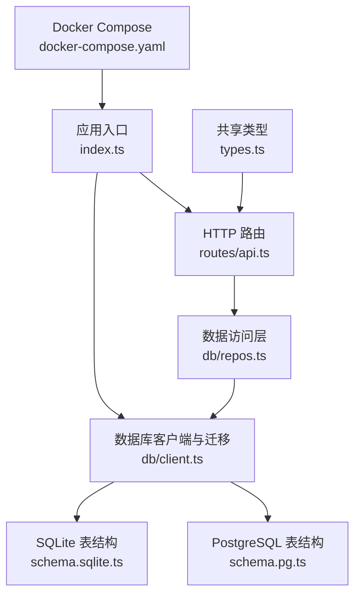
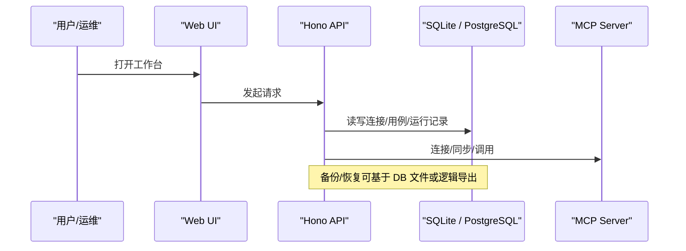
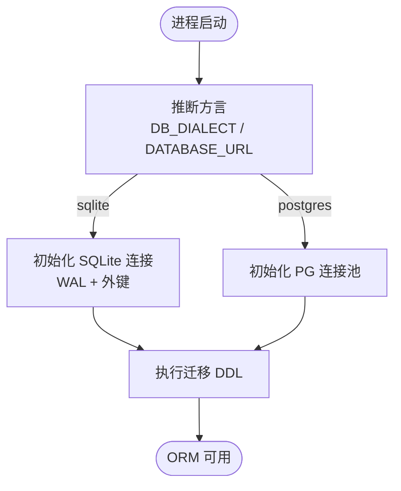
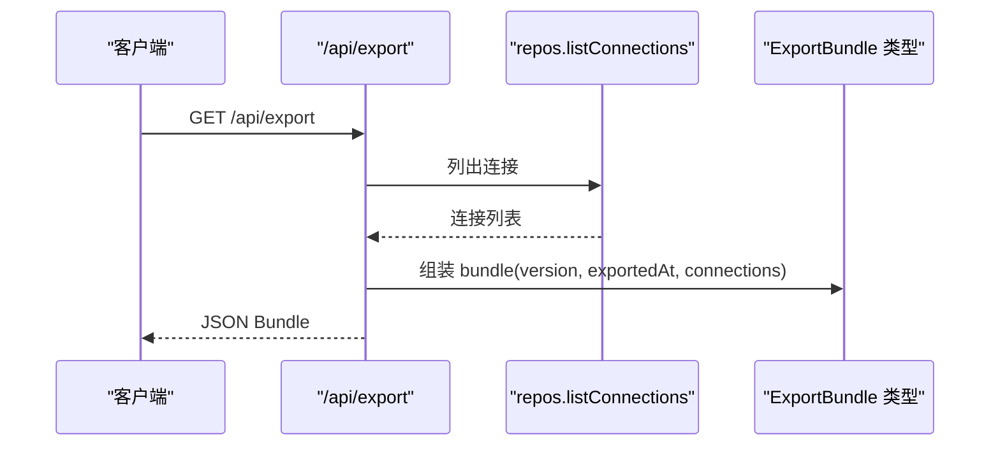
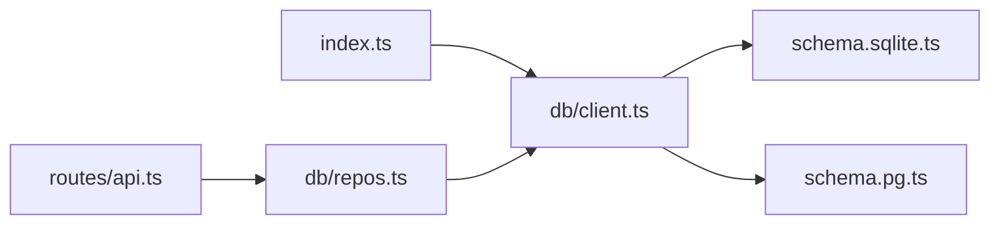

# 备份与恢复

<cite>
**本文引用的文件列表**
- [apps/server/src/index.ts](file://apps/server/src/index.ts)
- [apps/server/src/db/client.ts](file://apps/server/src/db/client.ts)
- [apps/server/src/db/schema.sqlite.ts](file://apps/server/src/db/schema.sqlite.ts)
- [apps/server/src/db/schema.pg.ts](file://apps/server/src/db/schema.pg.ts)
- [apps/server/src/db/repos.ts](file://apps/server/src/db/repos.ts)
- [apps/server/src/routes/api.ts](file://apps/server/src/routes/api.ts)
- [packages/shared/src/types.ts](file://packages/shared/src/types.ts)
- [deployment/docker-compose.yaml](file://deployment/docker-compose.yaml)
- [README.md](file://README.md)
</cite>

## 目录
1. [简介](#简介)
2. [项目结构](#项目结构)
3. [核心组件](#核心组件)
4. [架构总览](#架构总览)
5. [详细组件分析](#详细组件分析)
6. [依赖关系分析](#依赖关系分析)
7. [性能考虑](#性能考虑)
8. [故障排查指南](#故障排查指南)
9. [结论](#结论)
10. [附录](#附录)

## 简介
本指南围绕数据备份与恢复，结合代码库中数据库配置、迁移机制与应用内导出/导入能力，给出面向 SQLite 与 PostgreSQL 的完整策略与实践建议。内容涵盖：
- 数据库备份策略（SQLite 文件级备份、PostgreSQL 逻辑备份）
- 自动化备份脚本编写（定时任务、增量备份思路、备份验证）
- 数据恢复流程（灾难恢复、版本回滚、数据迁移）
- 应用内数据导入导出（JSON 格式规范、批量操作、冲突处理）
- 备份存储策略（本地、云存储、异地备份）
- 安全加固（加密、完整性校验、访问控制）

说明：本项目未内置专用“备份/恢复”API，但提供了数据库迁移与 JSON 导出/导入接口，可作为备份与恢复的基础构件。

## 项目结构
与备份与恢复直接相关的核心位置：
- 数据库客户端与迁移：apps/server/src/db/client.ts
- 表结构与索引定义：apps/server/src/db/schema.sqlite.ts、apps/server/src/db/schema.pg.ts
- 数据访问层（CRUD）：apps/server/src/db/repos.ts
- 应用启动与迁移触发：apps/server/src/index.ts
- 应用内导出/导入 API：apps/server/src/routes/api.ts
- 共享类型定义（含 ExportBundle）：packages/shared/src/types.ts
- 容器编排与持久卷：deployment/docker-compose.yaml
- 环境变量与部署说明：README.md

图表来源
- [apps/server/src/index.ts:1-39](file://apps/server/src/index.ts#L1-L39)
- [apps/server/src/db/client.ts:1-67](file://apps/server/src/db/client.ts#L1-L67)
- [apps/server/src/db/schema.sqlite.ts:1-120](file://apps/server/src/db/schema.sqlite.ts#L1-L120)
- [apps/server/src/db/schema.pg.ts:1-127](file://apps/server/src/db/schema.pg.ts#L1-L127)
- [apps/server/src/routes/api.ts:1-277](file://apps/server/src/routes/api.ts#L1-L277)
- [packages/shared/src/types.ts:216-229](file://packages/shared/src/types.ts#L216-L229)
- [deployment/docker-compose.yaml:1-39](file://deployment/docker-compose.yaml#L1-L39)

章节来源
- [apps/server/src/index.ts:1-39](file://apps/server/src/index.ts#L1-L39)
- [apps/server/src/db/client.ts:1-67](file://apps/server/src/db/client.ts#L1-L67)
- [apps/server/src/db/schema.sqlite.ts:1-120](file://apps/server/src/db/schema.sqlite.ts#L1-L120)
- [apps/server/src/db/schema.pg.ts:1-127](file://apps/server/src/db/schema.pg.ts#L1-L127)
- [apps/server/src/routes/api.ts:1-277](file://apps/server/src/routes/api.ts#L1-L277)
- [packages/shared/src/types.ts:216-229](file://packages/shared/src/types.ts#L216-L229)
- [deployment/docker-compose.yaml:1-39](file://deployment/docker-compose.yaml#L1-L39)
- [README.md:96-110](file://README.md#L96-L110)

## 核心组件
- 数据库方言选择与连接
  - 根据环境变量 DATABASE_URL 与 DB_DIALECT 自动推断或强制指定方言；默认使用 SQLite 文件路径，支持 PostgreSQL URL。
  - SQLite 启用 WAL 模式与外键约束；PostgreSQL 通过连接池初始化。
- 迁移执行
  - 启动时调用迁移函数，按方言执行建表语句，确保首次运行或升级后表结构就绪。
- 数据访问层
  - 提供连接、工具、用例、套件与运行记录的增删改查，所有 JSON 字段统一序列化/反序列化。
- 应用内导出/导入
  - 导出：返回包含连接与用例的 JSON Bundle（不含敏感头值，仅保留名称）。
  - 导入：按连接与用例顺序写入，不处理重复键冲突，适合一次性覆盖或全新环境初始化。

章节来源
- [apps/server/src/db/client.ts:17-67](file://apps/server/src/db/client.ts#L17-L67)
- [apps/server/src/db/client.ts:247-267](file://apps/server/src/db/client.ts#L247-L267)
- [apps/server/src/db/repos.ts:211-312](file://apps/server/src/db/repos.ts#L211-L312)
- [apps/server/src/routes/api.ts:227-271](file://apps/server/src/routes/api.ts#L227-L271)
- [packages/shared/src/types.ts:216-229](file://packages/shared/src/types.ts#L216-L229)

## 架构总览
下图展示从 Web 到 API、再到数据库与 MCP Server 的整体交互，以及备份与恢复在其中的落点。

图表来源
- [apps/server/src/index.ts:10-32](file://apps/server/src/index.ts#L10-L32)
- [apps/server/src/routes/api.ts:1-38](file://apps/server/src/routes/api.ts#L1-L38)
- [apps/server/src/db/client.ts:17-67](file://apps/server/src/db/client.ts#L17-L67)

## 详细组件分析

### 数据库客户端与迁移（SQLite 与 PostgreSQL）
- 方言推断与解析
  - 优先读取 DB_DIALECT；否则根据 DATABASE_URL 前缀判断是否为 PostgreSQL，否则为 SQLite。
  - SQLite 路径支持 file: 协议与相对路径解析，自动创建目录。
- 连接初始化
  - SQLite：设置 WAL 与外键开启，便于并发读与一致性。
  - PostgreSQL：使用连接池初始化 Drizzle ORM。
- 迁移
  - 启动阶段执行 SQL DDL，分别针对 SQLite 与 PostgreSQL 建表与索引。
  - 迁移完成后保证 ORM 单例可用。

图表来源
- [apps/server/src/db/client.ts:17-67](file://apps/server/src/db/client.ts#L17-L67)
- [apps/server/src/db/client.ts:247-267](file://apps/server/src/db/client.ts#L247-L267)

章节来源
- [apps/server/src/db/client.ts:17-67](file://apps/server/src/db/client.ts#L17-L67)
- [apps/server/src/db/client.ts:247-267](file://apps/server/src/db/client.ts#L247-L267)
- [apps/server/src/index.ts:10-12](file://apps/server/src/index.ts#L10-L12)

### 表结构与索引（跨方言一致）
- 主要实体
  - mcp_connections：连接元信息、状态与时间戳
  - mcp_tools：工具清单与 Schema
  - test_cases：测试用例与断言
  - suite_runs：套件执行批次
  - invocation_runs：单次调用结果与诊断
- 关键索引
  - 连接+工具唯一索引、连接维度查询索引、时间维度索引等，保障查询性能。

章节来源
- [apps/server/src/db/schema.sqlite.ts:1-120](file://apps/server/src/db/schema.sqlite.ts#L1-L120)
- [apps/server/src/db/schema.pg.ts:1-127](file://apps/server/src/db/schema.pg.ts#L1-L127)

### 数据访问层（repos）
- 统一封装对五张核心表的 CRUD，JSON 字段以字符串形式存取，并在内存中做结构化转换。
- 对外暴露 listConnections、createConnection、updateConnection、deleteConnection、listTools、getTool、listCases、createCase、updateCase、deleteCase、createRun、listRuns、getRun、deleteRun、suite 相关方法。

章节来源
- [apps/server/src/db/repos.ts:211-312](file://apps/server/src/db/repos.ts#L211-L312)
- [apps/server/src/db/repos.ts:314-349](file://apps/server/src/db/repos.ts#L314-L349)
- [apps/server/src/db/repos.ts:351-398](file://apps/server/src/db/repos.ts#L351-L398)
- [apps/server/src/db/repos.ts:400-474](file://apps/server/src/db/repos.ts#L400-L474)
- [apps/server/src/db/repos.ts:476-570](file://apps/server/src/db/repos.ts#L476-L570)
- [apps/server/src/db/repos.ts:572-638](file://apps/server/src/db/repos.ts#L572-L638)

### 应用内导出/导入（JSON 格式）
- 导出
  - 获取全部连接与用例，组装为 ExportBundle（version=1），包含 exportedAt 时间戳。
  - 连接对象不包含 headerNames/live/lastConnectedAt/lastError/serverInfo，但包含 headers 明文（注意敏感信息）。
- 导入
  - 校验 connections 字段存在后，逐条创建连接与用例，返回计数。
  - 未实现幂等与冲突处理，重复导入会新增记录。

图表来源
- [apps/server/src/routes/api.ts:227-240](file://apps/server/src/routes/api.ts#L227-L240)
- [packages/shared/src/types.ts:216-229](file://packages/shared/src/types.ts#L216-L229)

章节来源
- [apps/server/src/routes/api.ts:227-271](file://apps/server/src/routes/api.ts#L227-L271)
- [packages/shared/src/types.ts:216-229](file://packages/shared/src/types.ts#L216-L229)

## 依赖关系分析
- 模块耦合
  - index.ts 依赖 db/client.ts 的 migrate 与 dialect 常量。
  - routes/api.ts 依赖 repos.ts 的数据访问方法与 client.ts 的 dialect。
  - repos.ts 依赖 client.ts 的 getDb、pgSchema/sqliteSchema 与 id 工具。
- 外部依赖
  - better-sqlite3、drizzle-orm/better-sqlite3、drizzle-orm/node-postgres、pg。
- 潜在循环
  - 当前未见循环依赖；client.ts 被 index.ts 与 repos.ts 共同引用。

图表来源
- [apps/server/src/index.ts:1-12](file://apps/server/src/index.ts#L1-L12)
- [apps/server/src/routes/api.ts:1-18](file://apps/server/src/routes/api.ts#L1-L18)
- [apps/server/src/db/repos.ts:1-24](file://apps/server/src/db/repos.ts#L1-L24)
- [apps/server/src/db/client.ts:1-11](file://apps/server/src/db/client.ts#L1-L11)

章节来源
- [apps/server/src/index.ts:1-12](file://apps/server/src/index.ts#L1-L12)
- [apps/server/src/routes/api.ts:1-18](file://apps/server/src/routes/api.ts#L1-L18)
- [apps/server/src/db/repos.ts:1-24](file://apps/server/src/db/repos.ts#L1-L24)
- [apps/server/src/db/client.ts:1-11](file://apps/server/src/db/client.ts#L1-L11)

## 性能考虑
- SQLite
  - 已启用 WAL 模式，提升并发读性能；建议配合定期 VACUUM 与检查点优化。
  - 大体积 JSON 字段会增加 I/O，必要时归档历史运行记录。
- PostgreSQL
  - 连接池复用减少握手开销；合理设置 max_connections 与超时。
  - 利用已有索引进行过滤与排序，避免全表扫描。
- 导出/导入
  - 导出为全量 JSON，数据量大时建议分页或分表导出；导入为顺序写入，无事务包裹，建议在低峰期执行。

[本节为通用指导，无需具体文件分析]

## 故障排查指南
- 启动失败/无法连接数据库
  - 检查 DATABASE_URL 与 DB_DIALECT 是否正确；PostgreSQL 需提前创建数据库并允许容器访问。
  - Docker 环境下确认 volumes 挂载路径与权限。
- 迁移失败
  - 查看服务日志；确认方言与 DDL 是否匹配目标数据库。
- 导入失败
  - 检查导入 JSON 是否符合 ExportBundle 结构；connections 字段必须存在。
  - 若出现重复连接名或用例名，导入会新增记录而非报错，需在业务侧去重。

章节来源
- [README.md:96-110](file://README.md#L96-L110)
- [deployment/docker-compose.yaml:14-21](file://deployment/docker-compose.yaml#L14-L21)
- [apps/server/src/routes/api.ts:242-271](file://apps/server/src/routes/api.ts#L242-L271)

## 结论
- 本项目通过“迁移 + 应用内导出/导入”为备份与恢复提供了基础能力。
- 生产环境建议结合文件系统快照（SQLite）与逻辑备份（PostgreSQL），并叠加定时任务、完整性校验与异地容灾策略。
- 导入/导出适用于轻量迁移与快速复制，复杂场景建议扩展幂等与冲突处理。

[本节为总结性内容，无需具体文件分析]

## 附录

### 一、数据库备份策略

#### 1. SQLite 文件级备份
- 适用场景
  - 单机或小规模团队环境，数据量适中。
- 备份要点
  - 使用 WAL 模式时，建议先执行检查点再拷贝文件，或使用 sqlite3 提供的在线备份 API。
  - 同时备份 .db 与可能的 .db-wal/.db-shm 文件，确保一致性。
- 参考定位
  - 数据库文件路径由 DATABASE_URL 决定，默认位于 data/mcp-debug.db。
  - Docker 下通过命名卷持久化。

章节来源
- [apps/server/src/db/client.ts:35-53](file://apps/server/src/db/client.ts#L35-L53)
- [deployment/docker-compose.yaml:19-21](file://deployment/docker-compose.yaml#L19-L21)

#### 2. PostgreSQL 逻辑备份
- 适用场景
  - 多实例、跨主机、需要细粒度恢复或迁移。
- 备份要点
  - 使用 pg_dump 生成逻辑备份；可按 schema 或表级别导出。
  - 建议压缩与校验（如 sha256sum），并保留元数据（角色、权限等）。
- 参考定位
  - 方言与连接参数由环境变量控制。

章节来源
- [README.md:96-110](file://README.md#L96-L110)
- [apps/server/src/db/client.ts:55-61](file://apps/server/src/db/client.ts#L55-L61)

### 二、自动化备份脚本与定时任务

- 定时任务
  - Linux：使用 cron 或 systemd timer 周期性执行备份脚本。
  - Windows：使用任务计划程序。
  - Kubernetes：使用 CronJob。
- 增量备份思路
  - SQLite：基于 WAL 的增量恢复较复杂，推荐每日全量 + 每小时归档 WAL 文件；或使用 LSN/时间点恢复方案（PG）。
  - PostgreSQL：可使用物理流复制 + PITR（连续归档 WAL）实现增量与时间点恢复。
- 备份验证
  - 校验文件大小与哈希；尝试在隔离环境中还原并执行健康检查（如 /api/health）。
  - 对 JSON 导出文件进行结构校验（是否存在 version、exportedAt、connections）。

[本节为通用指导，无需具体文件分析]

### 三、数据恢复流程

#### 1. 灾难恢复
- SQLite
  - 停止服务，替换 .db 文件（含 WAL/SHM），重启服务。
- PostgreSQL
  - 使用 pg_restore 或 psql 恢复逻辑备份；或基于 WAL 归档进行时间点恢复。

章节来源
- [apps/server/src/db/client.ts:35-53](file://apps/server/src/db/client.ts#L35-L53)
- [README.md:96-110](file://README.md#L96-L110)

#### 2. 版本回滚
- 数据库结构
  - 当前迁移为单向 DDL，不支持反向迁移。回滚需准备对应版本的备份。
- 应用数据
  - 使用应用内导出/导入在不同版本间迁移数据（注意字段兼容性与幂等）。

章节来源
- [apps/server/src/db/client.ts:247-267](file://apps/server/src/db/client.ts#L247-L267)
- [apps/server/src/routes/api.ts:227-271](file://apps/server/src/routes/api.ts#L227-L271)

#### 3. 数据迁移
- 跨方言迁移（SQLite ↔ PostgreSQL）
  - 推荐路径：导出 JSON → 在新环境导入。
  - 注意：连接凭据（headers）随导出文件携带，需谨慎保管。

章节来源
- [packages/shared/src/types.ts:216-229](file://packages/shared/src/types.ts#L216-L229)
- [apps/server/src/routes/api.ts:227-271](file://apps/server/src/routes/api.ts#L227-L271)

### 四、数据导入导出使用指南

- JSON 格式规范
  - 根对象包含 version、exportedAt、connections。
  - connections 数组每项包含连接基本信息与 cases 数组。
  - 连接对象包含 headers 明文，请妥善保管。
- 批量操作
  - 导出为全量；导入为顺序写入，适合一次性覆盖或新环境初始化。
- 冲突处理
  - 当前导入不检测重复，会新增记录。建议在导入前清理目标环境或自行去重。

章节来源
- [packages/shared/src/types.ts:216-229](file://packages/shared/src/types.ts#L216-L229)
- [apps/server/src/routes/api.ts:227-271](file://apps/server/src/routes/api.ts#L227-L271)

### 五、备份存储策略

- 本地存储
  - SQLite：将 .db 文件复制到受保护的本地目录。
  - PostgreSQL：将 pg_dump 输出保存到本地磁盘。
- 云存储
  - 将备份上传至对象存储（如 S3、OSS、COS），并开启版本控制与生命周期管理。
- 异地备份
  - 跨地域复制备份文件，满足 RPO/RTO 要求。
- Docker 环境
  - 通过命名卷持久化 SQLite 数据目录；备份时可挂载卷进行拷贝。

章节来源
- [deployment/docker-compose.yaml:19-21](file://deployment/docker-compose.yaml#L19-L21)

### 六、安全措施

- 备份加密
  - 对备份文件进行对称加密（如 AES-GCM），密钥与证书集中管理。
- 完整性校验
  - 计算并保存 SHA-256 摘要，恢复前校验一致性。
- 访问控制
  - 限制备份目录/桶的访问权限；最小权限原则。
  - 导出文件包含敏感头值，仅限可信通道传输与存储。

[本节为通用指导，无需具体文件分析]