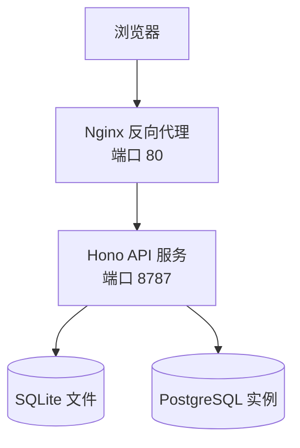
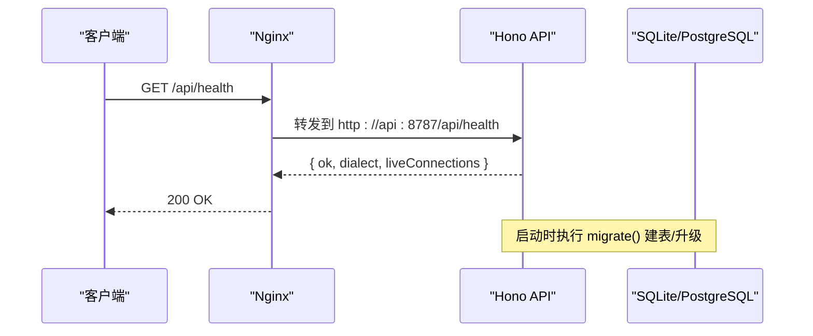
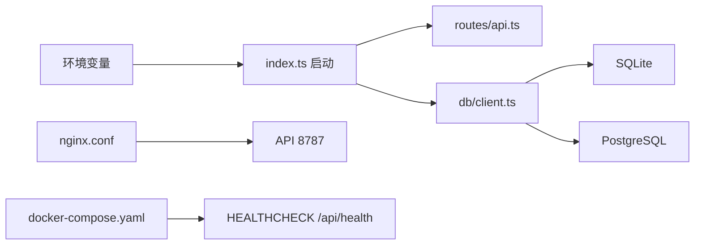

# 环境配置

<cite>
**本文引用的文件**   
- [README.md](file://README.md)
- [apps/server/src/index.ts](file://apps/server/src/index.ts)
- [apps/server/src/db/client.ts](file://apps/server/src/db/client.ts)
- [apps/server/src/routes/api.ts](file://apps/server/src/routes/api.ts)
- [deployment/Dockerfile](file://deployment/Dockerfile)
- [deployment/docker-compose.yaml](file://deployment/docker-compose.yaml)
- [deployment/nginx.conf](file://deployment/nginx.conf)
- [deployment/.env.example](file://deployment/.env.example)
</cite>

## 目录
1. [简介](#简介)
2. [项目结构](#项目结构)
3. [核心组件](#核心组件)
4. [架构总览](#架构总览)
5. [详细组件分析](#详细组件分析)
6. [依赖关系分析](#依赖关系分析)
7. [性能与容量规划](#性能与容量规划)
8. [故障排查指南](#故障排查指南)
9. [结论](#结论)
10. [附录：环境变量清单](#附录环境变量清单)

## 简介
本指南聚焦于生产与开发环境的差异，围绕环境变量、数据库连接（SQLite/PostgreSQL）、日志级别、反向代理（Nginx）、HTTPS/SSL、负载均衡与会话保持、健康检查、监控指标暴露、日志收集格式与告警规则等主题，提供可操作的配置建议。内容基于仓库现有实现与部署模板进行说明，并在需要处给出扩展建议。

## 项目结构
本项目采用前后端分离与多服务编排的部署方式：
- Web 前端由 Nginx 提供静态资源
- API 后端基于 Hono + Node.js
- 数据层支持 SQLite 或 PostgreSQL
- 通过 Docker Compose 编排容器化运行

图表来源
- [deployment/nginx.conf:1-25](file://deployment/nginx.conf#L1-L25)
- [apps/server/src/index.ts:1-39](file://apps/server/src/index.ts#L1-L39)
- [apps/server/src/db/client.ts:1-67](file://apps/server/src/db/client.ts#L1-L67)

章节来源
- [README.md:145-156](file://README.md#L145-L156)
- [deployment/Dockerfile:24-52](file://deployment/Dockerfile#L24-L52)
- [deployment/docker-compose.yaml:1-39](file://deployment/docker-compose.yaml#L1-L39)

## 核心组件
- 启动入口与环境变量读取：应用启动时从环境变量加载端口、CORS 源，并执行数据库迁移。
- 数据库客户端：根据环境变量或 URL 推断方言，初始化 SQLite 或 PostgreSQL 连接；PostgreSQL 使用连接池。
- API 路由：提供健康检查、连接管理、工具同步、用例执行、套件运行、导入导出等接口。
- 反向代理：Nginx 转发 /api 到后端，其余路径回退到 SPA 路由。

章节来源
- [apps/server/src/index.ts:1-39](file://apps/server/src/index.ts#L1-L39)
- [apps/server/src/db/client.ts:1-67](file://apps/server/src/db/client.ts#L1-L67)
- [apps/server/src/routes/api.ts:1-38](file://apps/server/src/routes/api.ts#L1-L38)
- [deployment/nginx.conf:1-25](file://deployment/nginx.conf#L1-L25)

## 架构总览
下图展示了请求在 Nginx 与 API 之间的流转，以及健康检查与健康探针的位置。

图表来源
- [apps/server/src/routes/api.ts:32-38](file://apps/server/src/routes/api.ts#L32-L38)
- [apps/server/src/index.ts:10-12](file://apps/server/src/index.ts#L10-L12)
- [apps/server/src/db/client.ts:247-266](file://apps/server/src/db/client.ts#L247-L266)

## 详细组件分析

### 环境变量与运行时配置
- 关键环境变量
  - PORT：后端监听端口，默认 8787
  - DATABASE_URL：SQLite 文件或 PostgreSQL 连接串
  - DB_DIALECT：sqlite 或 postgres，未设置时按 URL 前缀自动推断
  - CORS_ORIGIN：允许跨域的 Origin，默认 http://localhost:5173
- 行为说明
  - 启动时读取 PORT 和 CORS_ORIGIN，并注册 CORS 中间件
  - 启动时调用迁移函数，确保表结构存在
  - 数据库方言优先受 DB_DIALECT 控制，否则根据 DATABASE_URL 前缀判断

章节来源
- [apps/server/src/index.ts:7-21](file://apps/server/src/index.ts#L7-L21)
- [apps/server/src/db/client.ts:17-37](file://apps/server/src/db/client.ts#L17-L37)
- [deployment/.env.example:1-26](file://deployment/.env.example#L1-L26)
- [README.md:136-144](file://README.md#L136-L144)

### 数据库连接与参数调优

#### SQLite 配置要点
- 存储位置：默认 file:./data/mcp-debug.db，绝对路径或相对 serverRoot 解析
- 并发与一致性：启用 WAL 模式与外键约束
- 迁移策略：首次启动创建表结构与索引，后续仅保证存在性
- 适用场景：单机、轻量级、团队共享卷挂载

章节来源
- [apps/server/src/db/client.ts:27-53](file://apps/server/src/db/client.ts#L27-L53)
- [apps/server/src/db/client.ts:247-258](file://apps/server/src/db/client.ts#L247-L258)

#### PostgreSQL 配置要点
- 连接方式：通过连接字符串初始化连接池
- 连接池大小与超时：当前代码未显式传入 pool 选项，将使用 pg 驱动默认值
- 迁移策略：以连接池执行 DDL，若外部已存在池则复用
- 适用场景：生产、高并发、多进程/多副本部署

章节来源
- [apps/server/src/db/client.ts:55-61](file://apps/server/src/db/client.ts#L55-L61)
- [apps/server/src/db/client.ts:260-266](file://apps/server/src/db/client.ts#L260-L266)

#### 连接池与性能参数建议
- 连接池大小
  - 建议依据并发度与数据库最大连接数设定，通常取 CPU 核数的 2~4 倍作为起点
  - 若使用单副本 Node 进程，建议初始池大小 5~10，并根据压测逐步上调
- 超时设置
  - 建议为查询与连接建立设置合理超时，避免长事务阻塞连接
  - 结合业务 SLA 调整，典型值：连接超时 5s，查询超时 30s
- 其他优化
  - 开启连接复用与空闲回收
  - 针对高频读操作启用只读副本（如具备）
  - 对大结果集分页与限制返回字段

注意：上述为通用实践建议，具体数值需结合实际负载与数据库能力评估。

### 日志级别与输出
- 现状
  - 启动阶段打印监听地址与错误堆栈
  - 未内置结构化日志框架或分级开关
- 建议
  - 引入结构化日志库（如 pino），按环境区分级别：开发 debug，生产 info/warn/error
  - 统一 JSON 行格式，便于采集与检索
  - 通过环境变量控制日志级别与输出目标（stdout/stderr 或文件）

章节来源
- [apps/server/src/index.ts:30-38](file://apps/server/src/index.ts#L30-L38)

### 反向代理（Nginx）
- 基本转发
  - /api/* 转发至后端 API 服务
  - 其余路径回退到 SPA 入口 index.html
- 请求头转发
  - Host、X-Real-IP、X-Forwarded-For、X-Forwarded-Proto 均已设置
- 缓存与缓冲
  - 关闭代理缓存与缓冲，适合实时调试与长连接场景
- 超时
  - 读取超时设置为较长值，适配 MCP 长耗时调用

章节来源
- [deployment/nginx.conf:1-25](file://deployment/nginx.conf#L1-L25)

### HTTPS、SSL/TLS 证书与安全头
- 证书与域名绑定
  - 建议在 Nginx 层终止 TLS，配置证书与私钥，绑定域名
  - 强制 HTTP -> HTTPS 跳转，并设置 HSTS
- 安全响应头
  - 建议添加 X-Frame-Options、X-Content-Type-Options、Referrer-Policy、Permissions-Policy 等
- 访问控制
  - 建议增加基础认证或网关鉴权，限制公网直接访问

说明：以下为通用安全加固建议，仓库未内嵌相关配置。

### 负载均衡与会话保持
- 无状态设计
  - API 服务本身无状态，会话与持久化数据位于数据库
- 负载均衡
  - 可在 Nginx 或上游 LB 层做轮询/加权轮询
- 会话保持
  - 由于无状态，无需粘性会话；如需本地缓存，应使用外部缓存（Redis）

说明：此为架构层面的通用建议，仓库未包含具体负载均衡配置。

### 健康检查端点
- 健康检查接口
  - GET /api/health 返回 ok、dialect、liveConnections
- 容器健康探针
  - Dockerfile 中定义了 HEALTHCHECK，定期探测 /api/health
- 编排依赖
  - docker-compose 中 web 服务依赖 api 健康状态

章节来源
- [apps/server/src/routes/api.ts:32-38](file://apps/server/src/routes/api.ts#L32-L38)
- [deployment/Dockerfile:48-49](file://deployment/Dockerfile#L48-L49)
- [deployment/docker-compose.yaml:29-31](file://deployment/docker-compose.yaml#L29-L31)

### 监控指标暴露
- 现状
  - 未暴露 Prometheus 指标端点
- 建议
  - 新增 /metrics 端点，暴露进程、HTTP、数据库连接池、MCP 调用统计等指标
  - 指标命名遵循 OpenMetrics 规范，标签包含服务名、版本、区域等

说明：此为扩展建议，仓库未包含实现。

### 日志收集格式与告警规则
- 日志格式
  - 建议统一 JSON 行格式，包含时间戳、级别、服务名、traceId、消息体
- 采集与存储
  - 推荐 stdout/stderr 输出，由 sidecar 或宿主采集器（Fluent Bit/Filebeat）收集
- 告警规则
  - 基于错误率、P95/P99 延迟、数据库连接池耗尽、MCP 调用失败率等阈值触发
  - 结合健康检查失败次数与重启次数进行可用性告警

说明：此为通用运维建议，仓库未包含具体实现。

## 依赖关系分析
- 环境变量到模块的依赖
  - PORT/CORS_ORIGIN -> 应用启动与中间件
  - DATABASE_URL/DB_DIALECT -> 数据库客户端选择与迁移
- 服务间依赖
  - Nginx -> API（/api 转发）
  - API -> 数据库（SQLite/PostgreSQL）
  - docker-compose -> 健康检查与卷挂载

图表来源
- [apps/server/src/index.ts:7-21](file://apps/server/src/index.ts#L7-L21)
- [apps/server/src/db/client.ts:17-37](file://apps/server/src/db/client.ts#L17-L37)
- [deployment/nginx.conf:8-18](file://deployment/nginx.conf#L8-L18)
- [deployment/docker-compose.yaml:11-20](file://deployment/docker-compose.yaml#L11-L20)

章节来源
- [apps/server/src/index.ts:1-39](file://apps/server/src/index.ts#L1-L39)
- [apps/server/src/db/client.ts:1-67](file://apps/server/src/db/client.ts#L1-L67)
- [deployment/nginx.conf:1-25](file://deployment/nginx.conf#L1-L25)
- [deployment/docker-compose.yaml:1-39](file://deployment/docker-compose.yaml#L1-L39)

## 性能与容量规划
- 数据库选型
  - 开发/小规模：SQLite（WAL 模式）即可满足
  - 生产/高并发：PostgreSQL，配合连接池与索引优化
- 连接池规模
  - 参考 CPU 核数与并发量，初始 5~10，压测后调优
- 超时与重试
  - 合理设置网络与查询超时，避免雪崩
- 缓存与幂等
  - 对频繁读取的工具元数据可考虑短期缓存
  - 幂等写入与去重避免重复记录膨胀

说明：本节为通用性能建议，不直接对应特定源码实现。

## 故障排查指南
- 常见问题定位
  - 端口冲突：检查 PORT 与宿主机映射
  - CORS 报错：核对 CORS_ORIGIN 与浏览器来源
  - 数据库不可用：校验 DATABASE_URL 与 DB_DIALECT，确认网络可达与凭据正确
  - 健康检查失败：查看 /api/health 返回值与容器日志
- 快速验证步骤
  - 直接访问 /api/health 确认 API 可用
  - 切换数据库方言并观察迁移是否成功
  - 在 Nginx 层检查转发头是否正确传递

章节来源
- [apps/server/src/routes/api.ts:32-38](file://apps/server/src/routes/api.ts#L32-L38)
- [apps/server/src/index.ts:7-21](file://apps/server/src/index.ts#L7-L21)
- [apps/server/src/db/client.ts:17-37](file://apps/server/src/db/client.ts#L17-L37)
- [deployment/Dockerfile:48-49](file://deployment/Dockerfile#L48-L49)

## 结论
- 开发环境建议使用 SQLite，简化部署；生产环境推荐 PostgreSQL 以获得更好的并发与可靠性。
- 通过环境变量集中管理配置，结合 Nginx 的反向代理与健康检查，可实现稳定可靠的交付。
- 建议在生产环境补充 HTTPS、安全头、结构化日志、指标暴露与告警体系，提升可观测性与安全性。

## 附录：环境变量清单
- PORT：后端 API 端口，默认 8787
- DATABASE_URL：SQLite 文件或 PostgreSQL 连接串
- DB_DIALECT：sqlite 或 postgres，未设置时按 URL 前缀推断
- CORS_ORIGIN：允许跨域的 Origin，默认 http://localhost:5173

章节来源
- [README.md:136-144](file://README.md#L136-L144)
- [deployment/.env.example:1-26](file://deployment/.env.example#L1-L26)