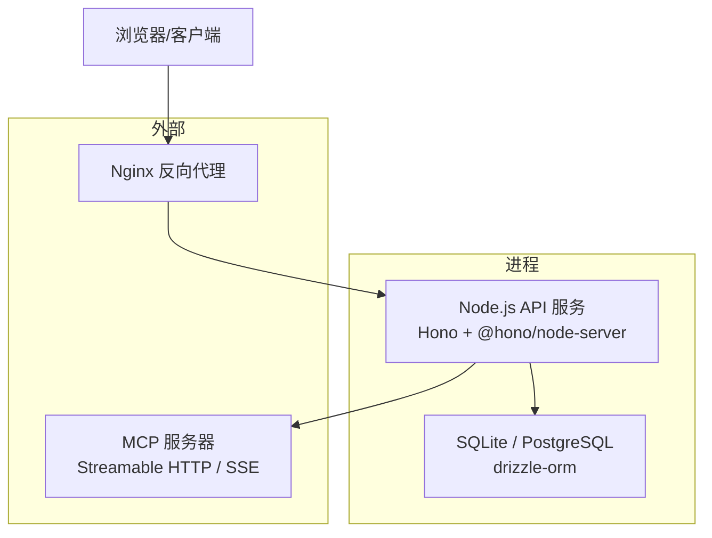
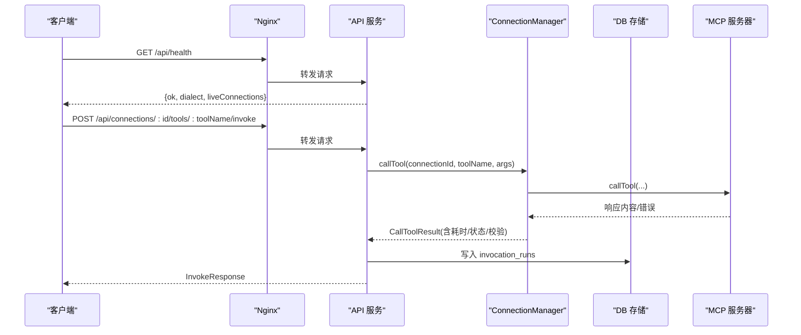
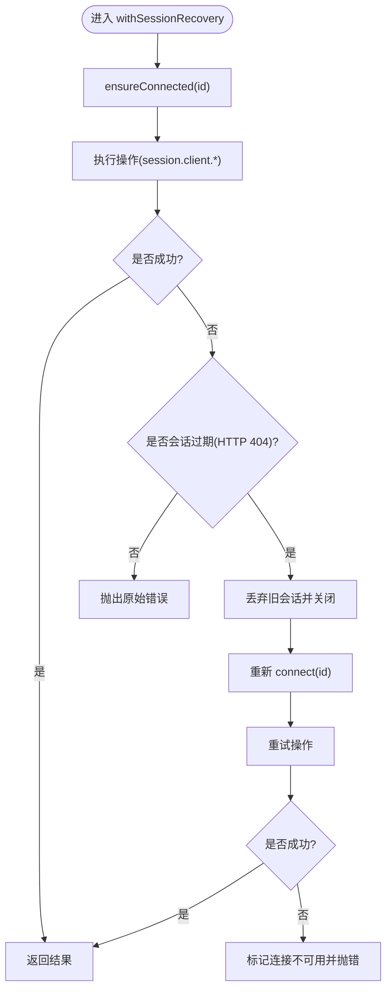
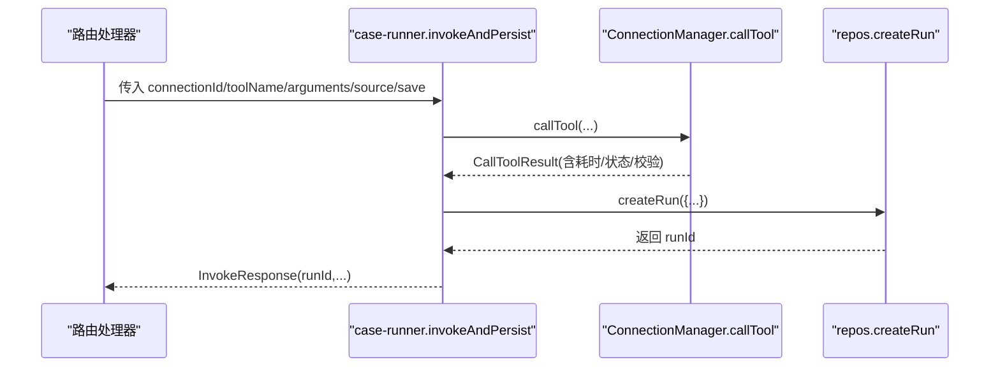
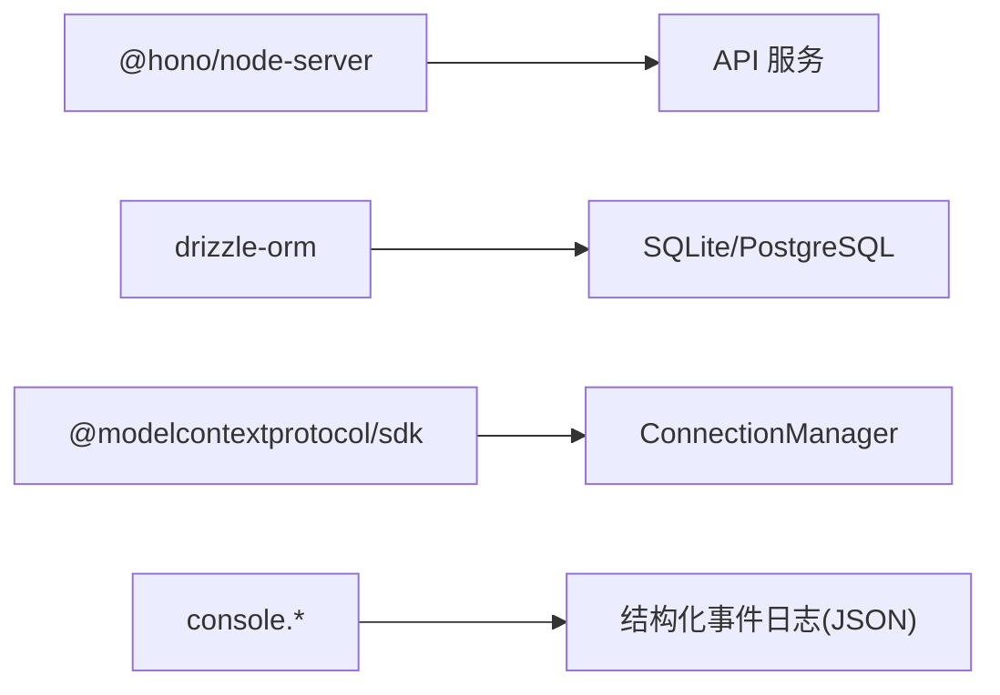

# 监控与日志

<cite>
**本文引用的文件**   
- [apps/server/src/index.ts](file://apps/server/src/index.ts)
- [apps/server/src/routes/api.ts](file://apps/server/src/routes/api.ts)
- [apps/server/src/mcp/connection-manager.ts](file://apps/server/src/mcp/connection-manager.ts)
- [apps/server/src/services/case-runner.ts](file://apps/server/src/services/case-runner.ts)
- [apps/server/src/db/client.ts](file://apps/server/src/db/client.ts)
- [apps/server/src/db/repos.ts](file://apps/server/src/db/repos.ts)
- [deployment/nginx.conf](file://deployment/nginx.conf)
- [deployment/docker-compose.yaml](file://deployment/docker-compose.yaml)
- [apps/server/package.json](file://apps/server/package.json)
</cite>

## 目录
1. [简介](#简介)
2. [项目结构](#项目结构)
3. [核心组件](#核心组件)
4. [架构总览](#架构总览)
5. [详细组件分析](#详细组件分析)
6. [依赖分析](#依赖分析)
7. [性能考量](#性能考量)
8. [故障排查指南](#故障排查指南)
9. [结论](#结论)
10. [附录](#附录)

## 简介
本指南围绕 MCP Tool Debug 应用的“监控与日志”能力，结合现有代码与部署配置，给出：
- 应用层监控指标设计（连接状态、Tool 调用统计、错误率、性能）
- 结构化日志格式建议（请求追踪 ID、上下文信息、日志级别）
- Nginx 访问/错误日志配置要点（含轮转、压缩、远程收集思路）
- 健康检查端点实现现状与增强建议（数据库连通性、MCP 服务器连通性、资源使用）
- Prometheus 指标导出、Grafana 仪表板与告警规则落地方案
- 日志聚合方案（ELK Stack 或 Loki）集成建议

说明：当前仓库未内置 Prometheus/Grafana/ELK/Loki 客户端或中间件，但已具备丰富的运行态数据与可观测性基础。本文在尊重现有实现的基础上，提供可直接落地的扩展设计与配置建议。

## 项目结构
本项目采用多包工作区，后端服务位于 apps/server，前端位于 apps/web，部署相关配置位于 deployment。关键的可观测性相关位置如下：
- HTTP 入口与健康检查：apps/server/src/index.ts、apps/server/src/routes/api.ts
- MCP 连接与会话管理：apps/server/src/mcp/connection-manager.ts
- 用例执行与持久化：apps/server/src/services/case-runner.ts
- 数据库方言选择与迁移：apps/server/src/db/client.ts
- 数据访问层（包含运行记录表结构）：apps/server/src/db/repos.ts
- Nginx 反向代理与静态站点：deployment/nginx.conf
- Docker Compose 编排：deployment/docker-compose.yaml

图表来源
- [apps/server/src/index.ts:10-33](file://apps/server/src/index.ts#L10-L33)
- [apps/server/src/routes/api.ts:32-38](file://apps/server/src/routes/api.ts#L32-L38)
- [apps/server/src/mcp/connection-manager.ts:75-147](file://apps/server/src/mcp/connection-manager.ts#L75-L147)
- [apps/server/src/db/client.ts:17-65](file://apps/server/src/db/client.ts#L17-L65)
- [deployment/nginx.conf:1-25](file://deployment/nginx.conf#L1-L25)

章节来源
- [apps/server/src/index.ts:1-39](file://apps/server/src/index.ts#L1-L39)
- [apps/server/src/routes/api.ts:1-277](file://apps/server/src/routes/api.ts#L1-L277)
- [apps/server/src/mcp/connection-manager.ts:1-383](file://apps/server/src/mcp/connection-manager.ts#L1-L383)
- [apps/server/src/services/case-runner.ts:1-161](file://apps/server/src/services/case-runner.ts#L1-L161)
- [apps/server/src/db/client.ts:1-267](file://apps/server/src/db/client.ts#L1-L267)
- [apps/server/src/db/repos.ts:1-570](file://apps/server/src/db/repos.ts#L1-L570)
- [deployment/nginx.conf:1-25](file://deployment/nginx.conf#L1-L25)
- [deployment/docker-compose.yaml:1-39](file://deployment/docker-compose.yaml#L1-L39)

## 核心组件
- 健康检查端点：GET /api/health，返回 ok、dialect、liveConnections 等基础信息，便于容器编排与负载均衡探针使用。
- MCP 连接管理：维护活跃会话、自动重连、超时控制、工具同步与调用，并输出结构化事件日志用于诊断。
- 用例执行与持久化：封装一次 Tool 调用的完整生命周期，记录耗时、状态、断言结果、Schema 校验结果等，供后续分析与可视化。
- 数据库层：支持 SQLite/PostgreSQL 双方言，提供连接池与迁移；运行记录表包含丰富的字段，天然适合构建监控指标。
- Nginx 反向代理：将 /api 转发至 Node 服务，设置必要的代理头与超时，便于采集访问日志。

章节来源
- [apps/server/src/routes/api.ts:32-38](file://apps/server/src/routes/api.ts#L32-L38)
- [apps/server/src/mcp/connection-manager.ts:101-147](file://apps/server/src/mcp/connection-manager.ts#L101-L147)
- [apps/server/src/services/case-runner.ts:11-77](file://apps/server/src/services/case-runner.ts#L11-L77)
- [apps/server/src/db/client.ts:17-65](file://apps/server/src/db/client.ts#L17-L65)
- [deployment/nginx.conf:8-18](file://deployment/nginx.conf#L8-L18)

## 架构总览
下图展示了从客户端到 MCP 服务器的请求链路，以及健康检查与运行记录的落库路径。

图表来源
- [apps/server/src/routes/api.ts:117-138](file://apps/server/src/routes/api.ts#L117-L138)
- [apps/server/src/mcp/connection-manager.ts:300-379](file://apps/server/src/mcp/connection-manager.ts#L300-L379)
- [apps/server/src/services/case-runner.ts:11-77](file://apps/server/src/services/case-runner.ts#L11-L77)
- [apps/server/src/db/repos.ts:516-527](file://apps/server/src/db/repos.ts#L516-L527)
- [deployment/nginx.conf:8-18](file://deployment/nginx.conf#L8-L18)

## 详细组件分析

### 健康检查端点
- 现有实现：GET /api/health 返回 ok、dialect、liveConnections。可用于 Kubernetes liveness/readiness 或 Nginx upstream 健康探测。
- 建议增强：
  - 增加数据库连通性检查（根据 dialect 分别尝试查询），失败时返回非 200。
  - 增加 MCP 服务器连通性探测（可选，避免频繁连接开销）。
  - 增加资源使用指标（如内存占用、句柄数、事件循环延迟）作为可选字段。
  - 为每个健康项添加时间戳与版本信息，便于审计。

章节来源
- [apps/server/src/routes/api.ts:32-38](file://apps/server/src/routes/api.ts#L32-L38)
- [apps/server/src/db/client.ts:17-65](file://apps/server/src/db/client.ts#L17-L65)

### MCP 连接与会话管理
- 连接建立：按配置的传输类型优先顺序尝试 Streamable HTTP 或 SSE，成功后持久化 lastConnectedAt、serverInfo 等。
- 会话恢复：当检测到过期会话（HTTP 404）时，自动丢弃旧会话并重连，同时输出结构化事件日志。
- 工具调用：带超时控制、错误分类（超时/协议错误）、Schema 校验结果，并返回 durationMs 等性能指标。
- 并发控制：基于队列保证同一连接串行化操作，避免竞态。

图表来源
- [apps/server/src/mcp/connection-manager.ts:209-268](file://apps/server/src/mcp/connection-manager.ts#L209-L268)
- [apps/server/src/mcp/connection-manager.ts:101-147](file://apps/server/src/mcp/connection-manager.ts#L101-L147)
- [apps/server/src/mcp/connection-manager.ts:300-379](file://apps/server/src/mcp/connection-manager.ts#L300-L379)

章节来源
- [apps/server/src/mcp/connection-manager.ts:1-383](file://apps/server/src/mcp/connection-manager.ts#L1-L383)

### 用例执行与运行记录
- invokeAndPersist 统一封装一次 Tool 调用，计算耗时、状态、断言结果、Schema 校验结果，并将运行记录持久化到 invocation_runs。
- runCase/runSuite 负责批量执行与统计，最终更新套件运行结果。

图表来源
- [apps/server/src/services/case-runner.ts:11-77](file://apps/server/src/services/case-runner.ts#L11-L77)
- [apps/server/src/mcp/connection-manager.ts:300-379](file://apps/server/src/mcp/connection-manager.ts#L300-L379)
- [apps/server/src/db/repos.ts:516-527](file://apps/server/src/db/repos.ts#L516-L527)

章节来源
- [apps/server/src/services/case-runner.ts:1-161](file://apps/server/src/services/case-runner.ts#L1-161)
- [apps/server/src/db/repos.ts:516-570](file://apps/server/src/db/repos.ts#L516-L570)

### 数据库与运行记录模型
- 运行记录表 invocation_runs 包含：connectionId、toolName、source、startedAt、endedAt、durationMs、status、isError、resultContent、resultStructured、protocolError、assertResult、schemaValidation、rawResponse 等字段，非常适合构建监控指标。
- 连接表 mcp_connections 包含 lastConnectedAt、lastError、serverInfo 等，可用于连接健康与错误统计。

章节来源
- [apps/server/src/db/client.ts:132-156](file://apps/server/src/db/client.ts#L132-L156)
- [apps/server/src/db/client.ts:221-245](file://apps/server/src/db/client.ts#L221-L245)
- [apps/server/src/db/repos.ts:127-177](file://apps/server/src/db/repos.ts#L127-L177)

### Nginx 访问与错误日志
- 当前 nginx.conf 仅配置了反向代理与静态站点，未显式定义 access_log/error_log。默认会输出到容器标准输出或默认路径。
- 建议：
  - 启用结构化访问日志（JSON），包含 $remote_addr、$request_uri、$status、$request_time、$upstream_response_time、$http_x_forwarded_for 等。
  - 配置错误日志级别与输出路径，便于集中收集。
  - 通过 logrotate 或容器侧卷挂载配合外部日志收集器进行轮转与归档。
  - 如需远程收集，可将日志输出到 stdout/stderr，由 sidecar 或 DaemonSet 采集。

章节来源
- [deployment/nginx.conf:1-25](file://deployment/nginx.conf#L1-L25)

## 依赖分析
- 运行时依赖不包含任何监控/日志 SDK（如 prom-client、pino、winston、opentelemetry 等），因此需要引入相应库以完善可观测性。
- 当前日志主要使用 console.log/warn/info/error 输出，且部分关键事件已输出 JSON 字符串，便于外部解析。

图表来源
- [apps/server/package.json:12-22](file://apps/server/package.json#L12-L22)
- [apps/server/src/mcp/connection-manager.ts:218-266](file://apps/server/src/mcp/connection-manager.ts#L218-L266)

章节来源
- [apps/server/package.json:1-32](file://apps/server/package.json#L1-32)
- [apps/server/src/mcp/connection-manager.ts:218-266](file://apps/server/src/mcp/connection-manager.ts#L218-L266)

## 性能考量
- 连接与会话：
  - 使用队列串行化同一连接的调用，避免并发导致的会话冲突。
  - 对 Streamable HTTP 的过期会话进行自动恢复，减少人工干预。
- 超时控制：
  - Tool 调用支持超时，避免长时间阻塞。
- 数据库：
  - SQLite 开启 WAL 模式提升并发读性能。
  - 运行记录表建立索引（connection_id+tool_name、started_at、suite_run_id），利于查询与分析。
- 网络：
  - Nginx 设置较长的 proxy_read_timeout，适配长耗时任务。

章节来源
- [apps/server/src/mcp/connection-manager.ts:51-67](file://apps/server/src/mcp/connection-manager.ts#L51-L67)
- [apps/server/src/mcp/connection-manager.ts:300-379](file://apps/server/src/mcp/connection-manager.ts#L300-L379)
- [apps/server/src/db/client.ts:44-53](file://apps/server/src/db/client.ts#L44-L53)
- [apps/server/src/db/client.ts:152-156](file://apps/server/src/db/client.ts#L152-L156)
- [deployment/nginx.conf:17](file://deployment/nginx.conf#L17)

## 故障排查指南
- 连接问题：
  - 查看 /api/health 中的 liveConnections 与 lastError。
  - 关注 ConnectionManager 输出的结构化事件日志（mcp_session_recovery_*），定位重连阶段与原因。
- 调用失败：
  - 通过 /api/runs 或 /api/suite-runs 查询 invocation_runs，筛选 status=timeout 或 protocol_error 的记录，结合 request_arguments 与 result_content 定位问题。
- 数据库异常：
  - 检查 dialect 与 DATABASE_URL 配置，确认迁移是否成功。
- Nginx 问题：
  - 检查访问日志与错误日志，关注上游响应时间与状态码分布。

章节来源
- [apps/server/src/routes/api.ts:32-38](file://apps/server/src/routes/api.ts#L32-L38)
- [apps/server/src/mcp/connection-manager.ts:218-266](file://apps/server/src/mcp/connection-manager.ts#L218-L266)
- [apps/server/src/db/client.ts:17-65](file://apps/server/src/db/client.ts#L17-L65)
- [deployment/nginx.conf:1-25](file://deployment/nginx.conf#L1-L25)

## 结论
当前系统已具备完善的运行态数据基础：健康检查、连接与会话管理、结构化事件日志、完整的运行记录表结构。在此基础上，建议引入标准化监控与日志体系（Prometheus + Grafana + ELK/Loki），以实现统一的指标采集、可视化与告警，进一步提升系统的可观测性与稳定性。

## 附录

### 应用层监控指标设计（建议）
- 连接状态
  - 活跃连接数：来自 liveIds() 计数
  - 连接成功率/失败率：基于 connect 成功/失败次数
  - 最近连接时间：lastConnectedAt
  - 最近错误：lastError
- Tool 调用统计
  - 调用总量、成功量、失败量、超时量
  - 平均/分位耗时：durationMs 的 p50/p95/p99
  - 按 connectionId、toolName、source 维度聚合
- 错误率
  - 整体错误率：errorCount / totalCalls
  - 按错误类型（timeout、protocol_error、tool_error）细分
- 性能指标
  - 接口耗时：Nginx upstream_response_time
  - 数据库查询耗时：可在 repos 层埋点（可选）
  - 事件循环延迟：process.hrtime 采样（可选）

### 结构化日志格式设计（建议）
- 通用字段
  - timestamp、level、service、version、trace_id、span_id
  - connection_id、tool_name、source、test_case_id、suite_run_id
- 事件类型
  - mcp_connect_success、mcp_connect_failed
  - mcp_session_recovery_started、mcp_session_recovery_succeeded、mcp_session_recovery_failed
  - tool_invoke_start、tool_invoke_end、tool_invoke_error
- 级别分类
  - info：正常流程（连接成功、调用完成）
  - warn：可恢复异常（会话过期、重连中）
  - error：不可恢复异常（连接失败、协议错误）
  - debug：调试细节（参数、响应摘要）

### Nginx 访问/错误日志配置（建议）
- 访问日志
  - 启用 JSON 格式，包含 $remote_addr、$request_uri、$status、$request_time、$upstream_response_time、$http_x_forwarded_for、$http_user_agent
  - 输出到 /var/log/nginx/access.json
- 错误日志
  - 级别 warn 或 error，输出到 /var/log/nginx/error.log
- 轮转与压缩
  - 使用 logrotate 配置每日轮转与 gzip 压缩
- 远程收集
  - 将日志输出到 stdout/stderr，由 Fluent Bit/Filebeat/Vector 采集并转发到 ES/Loki

### 健康检查端点增强（建议）
- 数据库连通性检查
  - 根据 dialect 执行简单查询（SELECT 1 或等效语句）
- MCP 服务器连通性测试
  - 轻量探测（如 listTools 或 ping），注意限频与缓存
- 资源使用监控
  - 暴露 process.memoryUsage()、event loop lag 等指标

### Prometheus 指标导出（建议）
- 引入 prom-client，注册自定义指标：
  - 计数器：mcp_connect_total、mcp_connect_failed_total、tool_invoke_total、tool_invoke_error_total
  - 直方图：tool_invoke_duration_seconds
  -  Gauge：mcp_live_connections、db_query_duration_seconds
- 暴露 /metrics 端点，供 Prometheus scrape
- 指标标签：connection_id、tool_name、source、status、error_code

### Grafana 仪表板与告警（建议）
- 仪表板
  - 概览：QPS、错误率、P95/P99 耗时、活跃连接数
  - 连接健康：连接成功率、最近错误
  - 调用明细：按 tool_name 维度统计
- 告警规则
  - 错误率超过阈值（如 5%）持续 5 分钟
  - P99 耗时超过阈值（如 2s）
  - 活跃连接数为 0 且存在最近错误
  - 数据库连通性失败

### 日志聚合方案（ELK 或 Loki）
- ELK Stack
  - Filebeat/Fluentd 采集 Nginx 与应用日志
  - Logstash 解析 JSON 并写入 Elasticsearch
  - Kibana 检索与可视化
- Loki
  - Promtail 采集日志，按 label（service、connection_id、tool_name）组织
  - Grafana 直接查询 Loki，降低存储成本
- 统一 trace_id
  - 在请求入口处生成 trace_id，贯穿 Nginx、API、MCP 调用链，便于跨系统关联