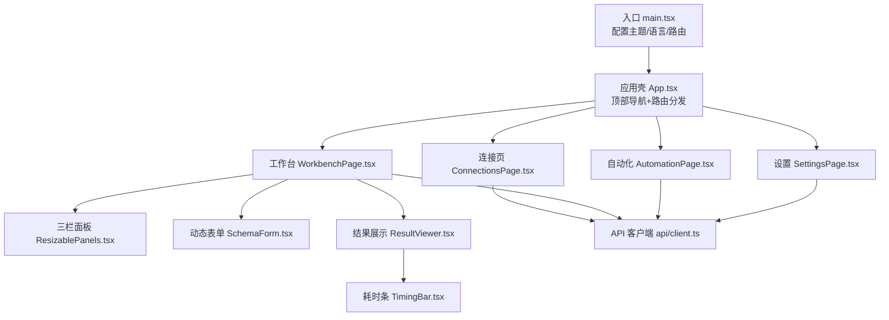
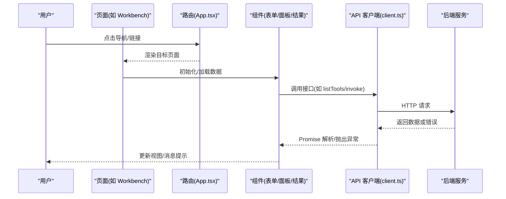
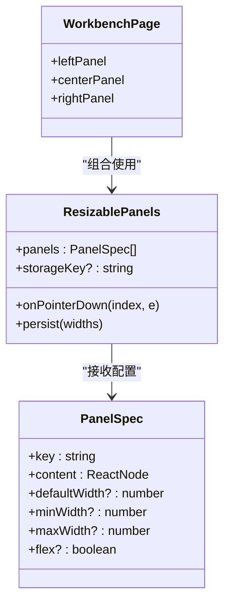
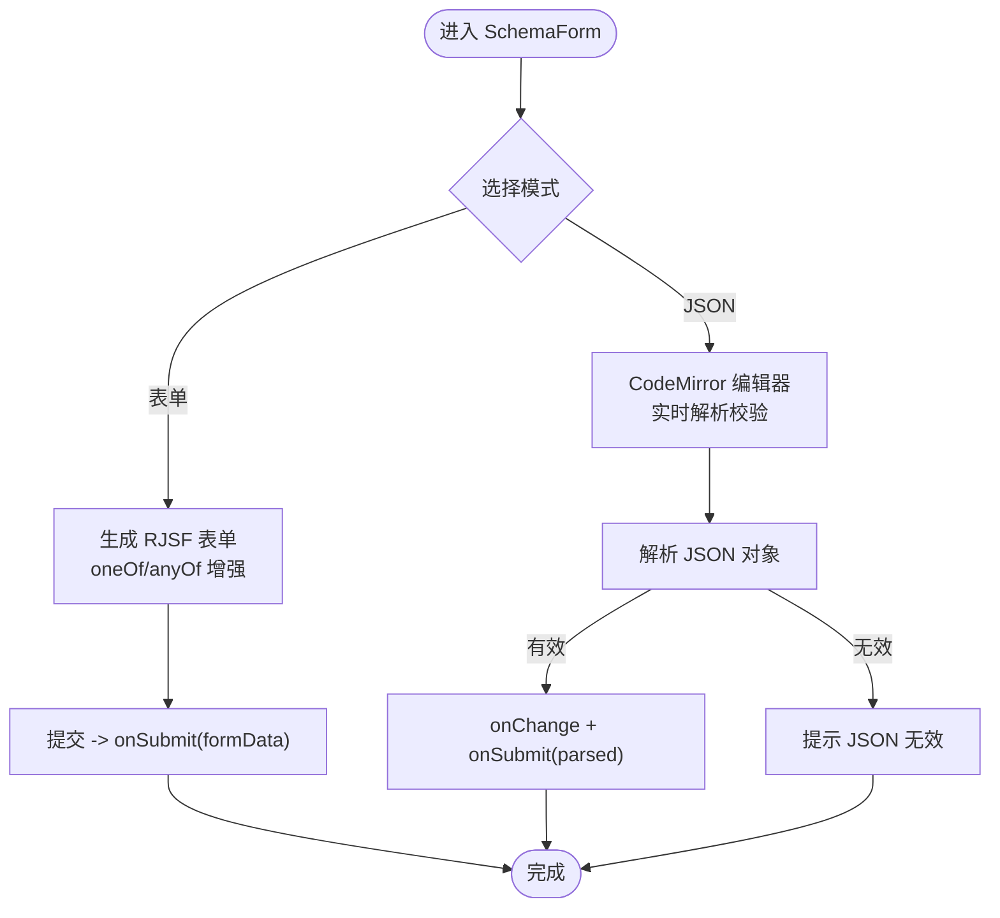
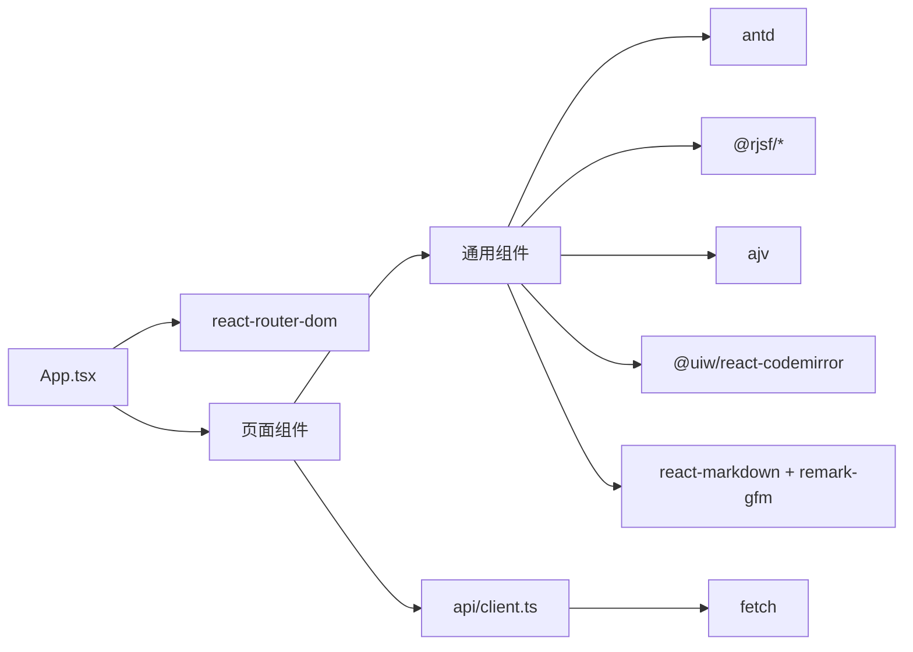

# UI设计规范

<cite>
**本文引用的文件**
- [apps/web/src/main.tsx](file://apps/web/src/main.tsx)
- [apps/web/src/App.tsx](file://apps/web/src/App.tsx)
- [apps/web/src/styles.css](file://apps/web/src/styles.css)
- [apps/web/src/pages/ConnectionsPage.tsx](file://apps/web/src/pages/ConnectionsPage.tsx)
- [apps/web/src/pages/WorkbenchPage.tsx](file://apps/web/src/pages/WorkbenchPage.tsx)
- [apps/web/src/pages/AutomationPage.tsx](file://apps/web/src/pages/AutomationPage.tsx)
- [apps/web/src/pages/SettingsPage.tsx](file://apps/web/src/pages/SettingsPage.tsx)
- [apps/web/src/components/ResizablePanels.tsx](file://apps/web/src/components/ResizablePanels.tsx)
- [apps/web/src/components/SchemaForm.tsx](file://apps/web/src/components/SchemaForm.tsx)
- [apps/web/src/components/ResultViewer.tsx](file://apps/web/src/components/ResultViewer.tsx)
- [apps/web/src/components/TimingBar.tsx](file://apps/web/src/components/TimingBar.tsx)
- [apps/web/src/api/client.ts](file://apps/web/src/api/client.ts)
</cite>

## 目录
1. [引言](#引言)
2. [项目结构](#项目结构)
3. [核心组件](#核心组件)
4. [架构总览](#架构总览)
5. [详细组件分析](#详细组件分析)
6. [依赖关系分析](#依赖关系分析)
7. [性能与可访问性](#性能与可访问性)
8. [故障排查指南](#故障排查指南)
9. [结论](#结论)

## 引言
本规范面向 MCP Tool 调试台的前端界面，统一视觉、交互与布局约定，确保连接管理、工具调试、自动化测试等页面在风格、信息密度与可用性上保持一致。规范覆盖主题与色彩、排版与间距、布局与栅格、表单与校验、结果展示、响应式适配、错误提示与反馈等维度，并给出关键实现位置以便快速定位与落地。

## 项目结构
前端采用 React + Ant Design 5 的轻量工程化方案，路由由 react-router-dom 驱动，全局主题通过 antd ConfigProvider 注入；样式集中在单一 CSS 文件中，按模块划分类名；页面与通用组件分层清晰。

图示来源
- [apps/web/src/main.tsx:1-26](file://apps/web/src/main.tsx#L1-L26)
- [apps/web/src/App.tsx:1-66](file://apps/web/src/App.tsx#L1-L66)
- [apps/web/src/pages/ConnectionsPage.tsx:1-291](file://apps/web/src/pages/ConnectionsPage.tsx#L1-L291)
- [apps/web/src/pages/WorkbenchPage.tsx:1-541](file://apps/web/src/pages/WorkbenchPage.tsx#L1-L541)
- [apps/web/src/pages/AutomationPage.tsx:1-207](file://apps/web/src/pages/AutomationPage.tsx#L1-L207)
- [apps/web/src/pages/SettingsPage.tsx:1-39](file://apps/web/src/pages/SettingsPage.tsx#L1-L39)
- [apps/web/src/components/ResizablePanels.tsx:1-153](file://apps/web/src/components/ResizablePanels.tsx#L1-L153)
- [apps/web/src/components/SchemaForm.tsx:1-421](file://apps/web/src/components/SchemaForm.tsx#L1-L421)
- [apps/web/src/components/ResultViewer.tsx:1-390](file://apps/web/src/components/ResultViewer.tsx#L1-L390)
- [apps/web/src/components/TimingBar.tsx:1-52](file://apps/web/src/components/TimingBar.tsx#L1-L52)
- [apps/web/src/api/client.ts:1-122](file://apps/web/src/api/client.ts#L1-L122)

章节来源
- [apps/web/src/main.tsx:1-26](file://apps/web/src/main.tsx#L1-L26)
- [apps/web/src/App.tsx:1-66](file://apps/web/src/App.tsx#L1-L66)
- [apps/web/src/styles.css:1-562](file://apps/web/src/styles.css#L1-L562)

## 核心组件
- 全局主题与国际化：主入口通过 ConfigProvider 设置中文语言包与品牌色、圆角等 token，所有 Antd 组件继承该主题。
- 应用壳与导航：顶部 Header 包含品牌标识与水平菜单，根据当前路径高亮选中项；内容区使用 Routes 进行页面级路由。
- 三栏可调面板：左侧工具列表、中间参数表单、右侧结果查看器，支持拖拽调整宽度并持久化到 localStorage。
- 动态表单：基于 JSON Schema 自动生成表单，支持“表单/JSON”双模式切换，内置 Ajv2020 校验与友好中文错误提示。
- 结果展示：结构化输出、非结构化 content（Markdown/图片/音频/资源）、断言结果、Schema 校验详情与原始摘要多标签页呈现。
- 耗时条：统一显示发起/结束时间、耗时与状态标签，颜色映射一致。

章节来源
- [apps/web/src/main.tsx:11-23](file://apps/web/src/main.tsx#L11-L23)
- [apps/web/src/App.tsx:15-65](file://apps/web/src/App.tsx#L15-L65)
- [apps/web/src/components/ResizablePanels.tsx:37-152](file://apps/web/src/components/ResizablePanels.tsx#L37-L152)
- [apps/web/src/components/SchemaForm.tsx:283-420](file://apps/web/src/components/SchemaForm.tsx#L283-L420)
- [apps/web/src/components/ResultViewer.tsx:228-389](file://apps/web/src/components/ResultViewer.tsx#L228-L389)
- [apps/web/src/components/TimingBar.tsx:18-51](file://apps/web/src/components/TimingBar.tsx#L18-L51)

## 架构总览
UI 层以页面为边界，复用通用组件完成复杂交互；数据获取统一经 API 客户端封装，错误处理与用户反馈集中使用 Antd 的消息与弹窗。

图示来源
- [apps/web/src/App.tsx:23-63](file://apps/web/src/App.tsx#L23-L63)
- [apps/web/src/pages/WorkbenchPage.tsx:61-122](file://apps/web/src/pages/WorkbenchPage.tsx#L61-L122)
- [apps/web/src/api/client.ts:16-29](file://apps/web/src/api/client.ts#L16-L29)

## 详细组件分析

### 全局主题与排版
- 主题色与圆角：主入口设置 primary 色与 borderRadius，保证按钮、输入框、卡片等一致性。
- 字体与背景：根变量定义系统字体栈与浅色背景，body 使用径向渐变营造层次。
- 卡片与容器：page-card 提供统一的白底、边框、阴影与圆角，作为页面区块容器。
- 文本可读性：长文本强制换行，避免溢出；代码块使用深色背景与等宽字体。

章节来源
- [apps/web/src/main.tsx:11-23](file://apps/web/src/main.tsx#L11-L23)
- [apps/web/src/styles.css:1-25](file://apps/web/src/styles.css#L1-L25)
- [apps/web/src/styles.css:65-70](file://apps/web/src/styles.css#L65-L70)
- [apps/web/src/styles.css:278-424](file://apps/web/src/styles.css#L278-L424)

### 导航与应用壳
- 顶部导航：品牌徽标与名称并列，右侧水平菜单项对应三个功能域。
- 选中态逻辑：根据当前路径前缀计算选中 key，保持导航与路由同步。
- 路由兜底：未匹配路径重定向至连接页，提升容错体验。

章节来源
- [apps/web/src/App.tsx:15-65](file://apps/web/src/App.tsx#L15-L65)

### 连接管理页
- 列表卡片：展示连接名称、在线状态、传输类型、URL、最近连接时间与错误提示。
- 操作集：连接/断开、同步 Tools、进入工作台、删除，均带成功/失败消息反馈。
- 新建连接：Modal 内嵌表单，支持传输方式选择、超时、描述与 Headers JSON 校验。
- 导入导出：导出包含凭据的 JSON 文件，导入时统计导入数量并刷新列表。

章节来源
- [apps/web/src/pages/ConnectionsPage.tsx:29-291](file://apps/web/src/pages/ConnectionsPage.tsx#L29-L291)

### 工作台（三栏可调）
- 左栏：搜索过滤工具列表，点击选中后触发中间表单与右侧结果重置。
- 中栏：Tabs 切换“调用/用例/历史/Schema”，调用页集成 SchemaForm，用例页支持增删改查与运行。
- 右栏：ResultViewer 展示结构化与非结构化输出、断言与校验详情。
- 面板尺寸：默认宽度、最小/最大宽度限制，拖拽实时调整，localStorage 持久化。

图示来源
- [apps/web/src/components/ResizablePanels.tsx:3-19](file://apps/web/src/components/ResizablePanels.tsx#L3-L19)
- [apps/web/src/components/ResizablePanels.tsx:37-152](file://apps/web/src/components/ResizablePanels.tsx#L37-L152)
- [apps/web/src/pages/WorkbenchPage.tsx:502-526](file://apps/web/src/pages/WorkbenchPage.tsx#L502-L526)

章节来源
- [apps/web/src/pages/WorkbenchPage.tsx:39-541](file://apps/web/src/pages/WorkbenchPage.tsx#L39-L541)
- [apps/web/src/components/ResizablePanels.tsx:1-153](file://apps/web/src/components/ResizablePanels.tsx#L1-L153)

### 动态表单（SchemaForm）
- 模式切换：表单模式与 JSON 模式一键切换，JSON 模式提供 CodeMirror 编辑与实时语法检查。
- 校验引擎：基于 Ajv2020 的 RJSF 校验，错误信息翻译为简洁中文，聚合 oneOf/anyOf 分支错误。
- 分支增强：对 oneOf/anyOf 场景自动复制父级字段到分支，使分支选择器真正控制可见字段。
- 提交行为：表单模式下由 RJSF 提交，JSON 模式下手动触发调用，统一回调 onChange/onSubmit。

图示来源
- [apps/web/src/components/SchemaForm.tsx:283-420](file://apps/web/src/components/SchemaForm.tsx#L283-L420)
- [apps/web/src/components/SchemaForm.tsx:57-153](file://apps/web/src/components/SchemaForm.tsx#L57-L153)
- [apps/web/src/components/SchemaForm.tsx:232-281](file://apps/web/src/components/SchemaForm.tsx#L232-L281)

章节来源
- [apps/web/src/components/SchemaForm.tsx:1-421](file://apps/web/src/components/SchemaForm.tsx#L1-L421)

### 结果展示（ResultViewer）
- 状态与告警：协议/连接错误、工具执行错误、outputSchema 校验失败分别以不同 Alert 提示。
- 标签页组织：结构化输出、非结构化 content、断言、Schema 校验、原始摘要。
- Markdown 渲染：react-markdown + remark-gfm，自定义 a/pre/code/table 节点样式，表格可横向滚动。
- 媒体与资源：图片/音频直接预览，resource_link/resource 按 MIME 智能选择渲染方式。

章节来源
- [apps/web/src/components/ResultViewer.tsx:1-390](file://apps/web/src/components/ResultViewer.tsx#L1-L390)
- [apps/web/src/components/TimingBar.tsx:1-52](file://apps/web/src/components/TimingBar.tsx#L1-L52)

### 自动化测试页
- 套件执行：选择连接、可选用例集合、Tags 过滤、并发度，提交后显示通过/失败与耗时。
- 运行记录：最近套件运行列表，支持查看明细弹窗，展示各用例状态与断言结果。

章节来源
- [apps/web/src/pages/AutomationPage.tsx:1-207](file://apps/web/src/pages/AutomationPage.tsx#L1-L207)

### 设置/状态页
- 健康检查：调用 /api/health 展示数据库方言等信息，便于运维与排障。

章节来源
- [apps/web/src/pages/SettingsPage.tsx:1-39](file://apps/web/src/pages/SettingsPage.tsx#L1-L39)

## 依赖关系分析
- 组件耦合：页面负责编排与状态，通用组件专注展示与交互；API 客户端集中封装网络请求与错误转换。
- 外部依赖：Ant Design 5 提供基础 UI 能力；@rjsf/* 与 ajv 提供 JSON Schema 驱动的表单与校验；@uiw/react-codemirror 提供 JSON 编辑器；react-markdown 与 remark-gfm 渲染文档。
- 路由与状态：react-router-dom 管理页面跳转；页面内部使用 useState/useEffect 管理本地状态与副作用。

图示来源
- [apps/web/src/App.tsx:1-12](file://apps/web/src/App.tsx#L1-L12)
- [apps/web/src/components/SchemaForm.tsx:1-11](file://apps/web/src/components/SchemaForm.tsx#L1-L11)
- [apps/web/src/components/ResultViewer.tsx:1-7](file://apps/web/src/components/ResultViewer.tsx#L1-L7)
- [apps/web/src/api/client.ts:16-29](file://apps/web/src/api/client.ts#L16-L29)

章节来源
- [apps/web/src/App.tsx:1-12](file://apps/web/src/App.tsx#L1-L12)
- [apps/web/src/api/client.ts:1-122](file://apps/web/src/api/client.ts#L1-L122)

## 性能与可访问性
- 渲染优化：大列表与结果区域启用滚动容器，避免整页滚动；按需渲染 Tabs 内容。
- 交互流畅：拖拽面板使用 Pointer Events，减少重排；localStorage 持久化仅保存必要数组。
- 可访问性：表单必填项与错误提示清晰；长文本强制换行，防止溢出；链接在新窗口打开时添加 rel="noreferrer"。
- 主题对比：主色与中性色对比度满足可读性要求；代码块使用深色背景提高可读性。

[本节为通用指导，不直接分析具体文件]

## 故障排查指南
- 网络请求失败：API 客户端在非 ok 响应时抛出错误，页面统一捕获并以 message.error 提示。
- JSON 解析错误：SchemaForm 的 JSON 模式会即时报错并阻止提交；连接创建时的 Headers JSON 也做解析校验。
- 表单校验失败：RJSF 的错误已翻译为中文，并在顶部汇总显示，便于快速定位问题字段。
- 结果错误分类：协议/连接错误、工具执行错误、outputSchema 校验失败分别用不同 Alert 区分，辅助定位。

章节来源
- [apps/web/src/api/client.ts:16-29](file://apps/web/src/api/client.ts#L16-L29)
- [apps/web/src/components/SchemaForm.tsx:305-339](file://apps/web/src/components/SchemaForm.tsx#L305-L339)
- [apps/web/src/components/ResultViewer.tsx:240-326](file://apps/web/src/components/ResultViewer.tsx#L240-L326)

## 结论
本规范围绕“一致的视觉、清晰的交互、稳健的校验与友好的反馈”构建 MCP Tool 调试台的 UI 体系。通过全局主题、统一卡片与排版、三栏可调工作区、JSON Schema 驱动的动态表单以及多维度的结果展示，既满足专业用户的效率需求，又兼顾新手用户的易用性。建议后续在暗色主题、键盘快捷键与无障碍增强方面持续演进。