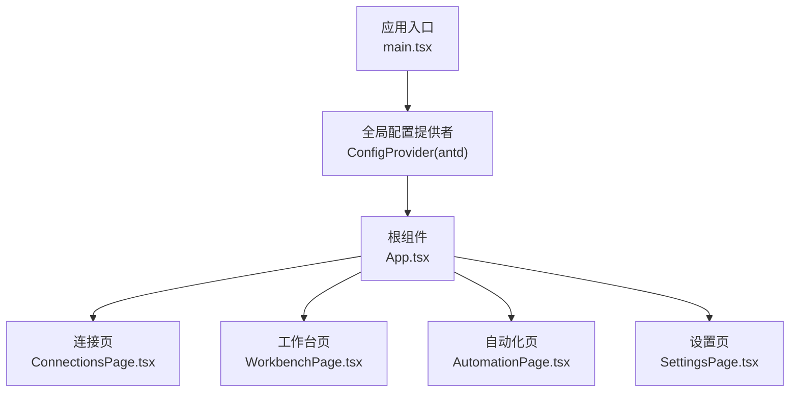
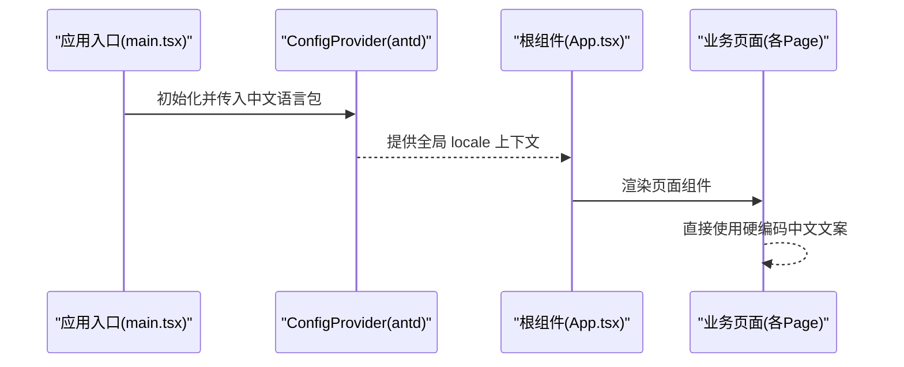
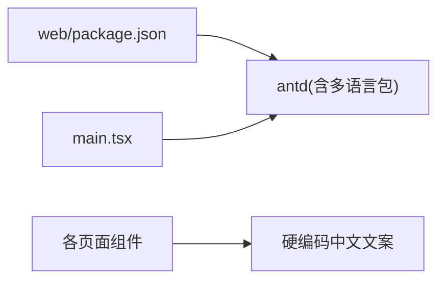

# 多语言支持

<cite>
**本文引用的文件**   
- [README.md](file://README.md)
- [package.json](file://package.json)
- [apps/web/src/main.tsx](file://apps/web/src/main.tsx)
- [apps/web/src/App.tsx](file://apps/web/src/App.tsx)
- [apps/web/package.json](file://apps/web/package.json)
- [apps/web/src/pages/ConnectionsPage.tsx](file://apps/web/src/pages/ConnectionsPage.tsx)
- [apps/web/src/pages/WorkbenchPage.tsx](file://apps/web/src/pages/WorkbenchPage.tsx)
- [apps/web/src/pages/AutomationPage.tsx](file://apps/web/src/pages/AutomationPage.tsx)
- [apps/web/src/pages/SettingsPage.tsx](file://apps/web/src/pages/SettingsPage.tsx)
</cite>

## 目录
1. [简介](#简介)
2. [项目结构](#项目结构)
3. [核心组件](#核心组件)
4. [架构总览](#架构总览)
5. [详细组件分析](#详细组件分析)
6. [依赖分析](#依赖分析)
7. [性能考虑](#性能考虑)
8. [故障排查指南](#故障排查指南)
9. [结论](#结论)
10. [附录](#附录)

## 简介
本仓库为 MCP Tool Debug 的调试与自动化测试工作台。当前在多语言（国际化）方面，前端已基于 Ant Design 的 ConfigProvider 配置了中文本地化资源，但尚未实现运行时语言切换或自定义文案管理。页面中的用户可见文本均为硬编码中文，未接入通用的 i18n 方案。

## 项目结构
从多语言视角看，关键位置如下：
- 应用入口通过 Ant Design 的 ConfigProvider 注入中文语言包，使内置组件默认显示中文。
- 路由与页面组件中大量使用中文文案，目前未抽取到统一文案库。
- 第三方 UI 库（Ant Design）提供多语言包，但未在项目中启用动态切换逻辑。

图表来源
- [apps/web/src/main.tsx:1-26](file://apps/web/src/main.tsx#L1-L26)
- [apps/web/src/App.tsx:1-66](file://apps/web/src/App.tsx#L1-L66)
- [apps/web/src/pages/ConnectionsPage.tsx:1-291](file://apps/web/src/pages/ConnectionsPage.tsx#L1-L291)
- [apps/web/src/pages/WorkbenchPage.tsx:1-200](file://apps/web/src/pages/WorkbenchPage.tsx#L1-L200)
- [apps/web/src/pages/AutomationPage.tsx:1-200](file://apps/web/src/pages/AutomationPage.tsx#L1-L200)
- [apps/web/src/pages/SettingsPage.tsx:1-39](file://apps/web/src/pages/SettingsPage.tsx#L1-L39)

章节来源
- [apps/web/src/main.tsx:1-26](file://apps/web/src/main.tsx#L1-L26)
- [apps/web/src/App.tsx:1-66](file://apps/web/src/App.tsx#L1-L66)

## 核心组件
- 全局语言配置
  - 在应用入口通过 Ant Design 的 ConfigProvider 设置 locale 为中文，从而让 Antd 内置组件（如日期、分页、消息提示等）默认中文显示。
- 页面文案现状
  - 各页面（连接、工作台、自动化、设置）中的标题、按钮、提示等文案均为硬编码中文，未抽象到独立文案文件。
- 第三方依赖
  - 前端依赖 antd 及其图标库，具备多语言扩展能力；当前仅使用了中文语言包。

章节来源
- [apps/web/src/main.tsx:1-26](file://apps/web/src/main.tsx#L1-L26)
- [apps/web/src/pages/ConnectionsPage.tsx:1-291](file://apps/web/src/pages/ConnectionsPage.tsx#L1-L291)
- [apps/web/src/pages/WorkbenchPage.tsx:1-200](file://apps/web/src/pages/WorkbenchPage.tsx#L1-L200)
- [apps/web/src/pages/AutomationPage.tsx:1-200](file://apps/web/src/pages/AutomationPage.tsx#L1-L200)
- [apps/web/src/pages/SettingsPage.tsx:1-39](file://apps/web/src/pages/SettingsPage.tsx#L1-L39)

## 架构总览
下图展示了当前多语言支持的落地方式：通过全局 ConfigProvider 注入中文语言包，影响 Antd 组件的默认文案；业务文案仍散落在页面组件中。

图表来源
- [apps/web/src/main.tsx:1-26](file://apps/web/src/main.tsx#L1-L26)
- [apps/web/src/App.tsx:1-66](file://apps/web/src/App.tsx#L1-L66)

## 详细组件分析

### 全局语言配置（ConfigProvider）
- 作用范围：覆盖整个 React 树，影响 Antd 组件的默认文案。
- 当前状态：固定为中文，无运行时切换逻辑。
- 可扩展点：可在 ConfigProvider 外层增加语言选择器，将 locale 作为可配置项。

章节来源
- [apps/web/src/main.tsx:1-26](file://apps/web/src/main.tsx#L1-L26)

### 根组件与路由（App.tsx）
- 导航菜单与页面路由均使用中文文案。
- 若未来引入 i18n，需在此处对菜单项进行文案映射。

章节来源
- [apps/web/src/App.tsx:1-66](file://apps/web/src/App.tsx#L1-L66)

### 连接页（ConnectionsPage.tsx）
- 包含大量中文文案：标题、操作按钮、提示信息、表单标签等。
- 建议：将“新建连接”“导出”“导入”“连接”“断开”“同步 Tools”“工作台”“删除”等文案抽离至统一字典。

章节来源
- [apps/web/src/pages/ConnectionsPage.tsx:1-291](file://apps/web/src/pages/ConnectionsPage.tsx#L1-L291)

### 工作台页（WorkbenchPage.tsx）
- 包含搜索框占位符、空状态提示、成功/失败/超时等消息提示文案。
- 建议：将“搜索 Tools”“暂无 Tools”“请选择左侧 Tool”“用例已创建/更新”等文案集中管理。

章节来源
- [apps/web/src/pages/WorkbenchPage.tsx:1-200](file://apps/web/src/pages/WorkbenchPage.tsx#L1-L200)

### 自动化页（AutomationPage.tsx）
- 包含套件运行结果展示、表格列名、执行按钮等中文文案。
- 建议：将“自动化测试”“开始执行”“明细”“通过/总数”等文案纳入字典。

章节来源
- [apps/web/src/pages/AutomationPage.tsx:1-200](file://apps/web/src/pages/AutomationPage.tsx#L1-L200)

### 设置页（SettingsPage.tsx）
- 展示系统信息与说明性文案，均为中文。
- 建议：将“设置 / 状态”“数据库方言”“环境变量”等文案纳入字典。

章节来源
- [apps/web/src/pages/SettingsPage.tsx:1-39](file://apps/web/src/pages/SettingsPage.tsx#L1-L39)

## 依赖分析
- 前端依赖
  - antd：提供多语言包与主题配置能力，当前仅加载中文包。
  - react-router-dom：用于页面路由，不涉及多语言。
  - dayjs：时间格式化，未涉及多语言。
- 后端
  - 服务端代码未发现面向用户的中文文案输出，主要返回结构化数据。

图表来源
- [apps/web/package.json:1-38](file://apps/web/package.json#L1-L38)
- [apps/web/src/main.tsx:1-26](file://apps/web/src/main.tsx#L1-L26)

章节来源
- [apps/web/package.json:1-38](file://apps/web/package.json#L1-L38)

## 性能考虑
- 当前仅加载中文语言包，体积较小，对首屏影响有限。
- 若后续引入多语言切换，建议按需加载语言包，避免一次性打包所有语言资源。

## 故障排查指南
- 现象：部分 Antd 组件未显示中文
  - 检查是否在应用最外层正确设置了 ConfigProvider 的 locale。
- 现象：新增页面出现英文提示
  - 确认是否遗漏了对该页面的中文文案处理，或是否引入了新的第三方组件未配置对应语言包。

## 结论
当前项目实现了基础的中文本地化（通过 Antd 的中文语言包），但业务文案仍以硬编码形式分布在页面组件中，未建立统一的 i18n 体系。建议在后续迭代中引入轻量级 i18n 方案，将业务文案与第三方组件文案统一管理，并支持运行时语言切换。

## 附录
- 相关文档与部署说明中包含中英文版本链接，便于用户阅读不同语言的说明文档。

章节来源
- [README.md:1-201](file://README.md#L1-L201)