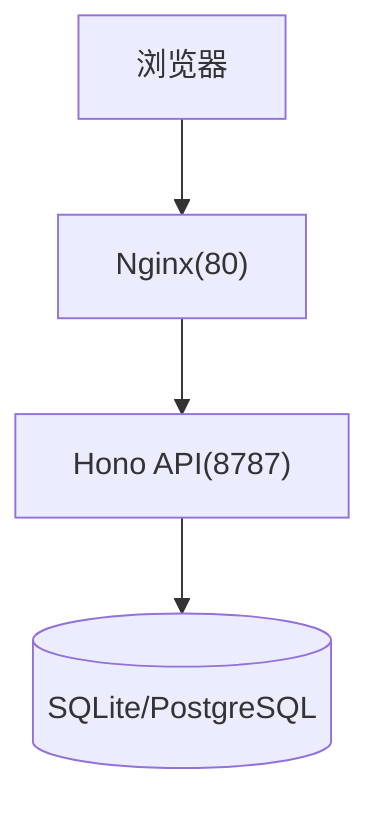

# 快速开始

<cite>
**本文引用的文件**
- [README.md](file://README.md)
- [package.json](file://package.json)
- [apps/server/package.json](file://apps/server/package.json)
- [apps/web/package.json](file://apps/web/package.json)
- [deployment/Dockerfile](file://deployment/Dockerfile)
- [deployment/docker-compose.yaml](file://deployment/docker-compose.yaml)
- [deployment/.env.example](file://deployment/.env.example)
- [deployment/deploy.sh](file://deployment/deploy.sh)
- [apps/server/src/index.ts](file://apps/server/src/index.ts)
- [apps/web/vite.config.ts](file://apps/web/vite.config.ts)
</cite>

## 目录
1. [简介](#简介)
2. [环境准备](#环境准备)
3. [本地开发环境搭建](#本地开发环境搭建)
4. [启动方式](#启动方式)
5. [Docker 部署](#docker-部署)
6. [访问地址与基本使用流程](#访问地址与基本使用流程)
7. [常见问题排查](#常见问题排查)
8. [结论](#结论)

## 简介
MCP Tool Debug 是一个可自托管的 Web 调试台，用于连接、检查、调用和自动化测试 Model Context Protocol（MCP）Tools。它把 MCP Inspector、JSON Schema 2020-12 动态表单、结果诊断、测试用例和回归执行集中到同一个界面中，适合 MCP Server 开发、Client/Agent 集成、QA 回归测试以及团队共享测试环境。

## 环境准备
- Node.js 版本要求：Node.js 20+，推荐使用 Node.js 22。
- 包管理器：npm（项目根 package.json 指定 engines.node >= 20）。
- Docker 与 Docker Compose v2（仅在使用 Docker 部署时需要）。

章节来源
- [README.md:51-53](file://README.md#L51-L53)
- [package.json:41-43](file://package.json#L41-L43)

## 本地开发环境搭建
- 克隆仓库并进入项目目录。
- 安装依赖。
- 启动开发服务器。

说明
- 项目为 monorepo，根 scripts 提供统一脚本，自动构建 shared 并并行启动前后端。
- 前端 Vite 默认监听 5173 端口，并通过代理将 /api 转发至后端 8787 端口。
- 后端 Hono 服务默认监听 8787 端口，并在启动时执行数据库迁移。

章节来源
- [README.md:55-72](file://README.md#L55-L72)
- [package.json:31-39](file://package.json#L31-L39)
- [apps/web/vite.config.ts:6-14](file://apps/web/vite.config.ts#L6-L14)
- [apps/server/src/index.ts:7-8](file://apps/server/src/index.ts#L7-L8)
- [apps/server/src/index.ts:10-11](file://apps/server/src/index.ts#L10-L11)

## 启动方式
### 统一启动命令
- 在根目录运行统一开发命令，会同时启动后端 API 与前端 Web 服务。
- 启动后访问：
  - Web UI：<http://localhost:5173>
  - API 健康检查：<http://localhost:8787/api/health>

章节来源
- [README.md:55-66](file://README.md#L55-L66)
- [apps/server/src/index.ts:30-32](file://apps/server/src/index.ts#L30-L32)

### 分别启动前后端服务
- 先启动后端：
  - 命令：npm run dev:server
- 再启动前端：
  - 命令：npm run dev:web
- 注意：前端通过 Vite 代理将 /api 请求转发到 http://localhost:8787。

章节来源
- [README.md:67-72](file://README.md#L67-L72)
- [apps/web/vite.config.ts:8-12](file://apps/web/vite.config.ts#L8-L12)

## Docker 部署
### 前置条件
- 已安装 Docker 与 Docker Compose v2。
- 如需 PostgreSQL，请提前创建数据库并确保 api 容器可通过网络访问。

### 环境变量配置
- 复制示例环境变量文件：
  - cp deployment/.env.example deployment/.env
- 常用变量说明：
  - WEB_PORT：浏览器入口对外端口（默认 5173）
  - API_PORT：后端 API 对外端口（默认 8787）
  - CORS_ORIGIN：允许访问 API 的 Web Origin（默认 http://localhost:5173）
  - DATABASE_URL：SQLite 文件或 PostgreSQL URL
  - DB_DIALECT：sqlite 或 postgres（未设置时根据 URL 推断）
- PostgreSQL 注意事项：
  - 当前 docker-compose.yaml 不会创建 PostgreSQL，需外部提供。
  - 用户名或密码中的特殊字符需要进行 URL 百分号编码。

章节来源
- [README.md:74-94](file://README.md#L74-L94)
- [README.md:96-110](file://README.md#L96-L110)
- [deployment/.env.example:1-26](file://deployment/.env.example#L1-L26)

### 容器启动与管理
- 一键启动（首次会自动构建镜像）：
  - cd deployment && chmod +x deploy.sh && ./deploy.sh up
- 管理命令：
  - 查看状态：./deploy.sh status
  - 查看日志：./deploy.sh logs
  - 重启服务：./deploy.sh restart
  - 停止服务：./deploy.sh down

章节来源
- [README.md:78-94](file://README.md#L78-L94)
- [deployment/deploy.sh:27-49](file://deployment/deploy.sh#L27-L49)

### 架构与端口映射
- 容器内：
  - API 服务暴露 8787 端口，提供 /api/health 健康检查。
  - Web 静态资源由 Nginx 提供，暴露 80 端口。
- 宿主机映射：
  - WEB_PORT -> 80（Nginx）
  - API_PORT -> 8787（API）

图表来源
- [deployment/Dockerfile:24-52](file://deployment/Dockerfile#L24-L52)
- [deployment/Dockerfile:54-63](file://deployment/Dockerfile#L54-L63)
- [deployment/docker-compose.yaml:11-33](file://deployment/docker-compose.yaml#L11-L33)

## 访问地址与基本使用流程
- 访问地址：
  - 本地开发：Web UI <http://localhost:5173>；API 健康检查 <http://localhost:8787/api/health>
  - Docker 部署：根据 .env 中的 WEB_PORT 与 API_PORT 访问对应地址。
- 基本使用流程：
  1. 在“连接”页面新增 Streamable HTTP 或 SSE MCP 地址。
  2. 点击“连接”和“同步 Tools”。
  3. 进入工作台，选择 Tool，通过表单或 JSON 填写参数。
  4. 调用 Tool，检查协议状态、耗时、content、structuredContent 和 Schema 校验。
  5. 将有效参数另存为用例，并配置断言。
  6. 在“自动化”页面按连接、Tool、标签或用例批量执行回归测试。

章节来源
- [README.md:55-66](file://README.md#L55-L66)
- [README.md:112-119](file://README.md#L112-L119)

## 常见问题排查
- 无法访问 Web UI
  - 确认前端是否启动成功且监听 5173 端口。
  - 若使用 Docker，检查 WEB_PORT 映射是否正确。
- 前端无法调用后端接口
  - 本地开发：确认 Vite 代理目标为 http://localhost:8787。
  - Docker 部署：确认 CORS_ORIGIN 与实际浏览器访问地址一致。
- 后端启动失败
  - 检查 PORT 与 CORS_ORIGIN 环境变量。
  - 查看数据库迁移是否成功（启动时会执行迁移）。
- 数据库连接问题（PostgreSQL）
  - 确认 DATABASE_URL 格式正确，特殊字符已进行百分号编码。
  - 确保数据库已存在且 api 容器可访问。

章节来源
- [apps/web/vite.config.ts:8-12](file://apps/web/vite.config.ts#L8-L12)
- [apps/server/src/index.ts:7-8](file://apps/server/src/index.ts#L7-L8)
- [apps/server/src/index.ts:10-11](file://apps/server/src/index.ts#L10-L11)
- [deployment/.env.example:14-26](file://deployment/.env.example#L14-L26)

## 结论
按照上述步骤，你可以在最短时间内完成本地开发与 Docker 部署，并顺利完成连接配置、Tool 同步、参数填写、调用测试与用例保存等基础操作。如遇问题，可参考常见问题排查部分定位原因。