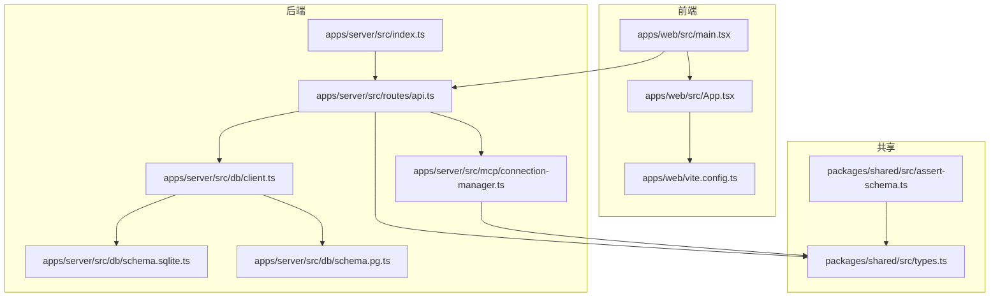
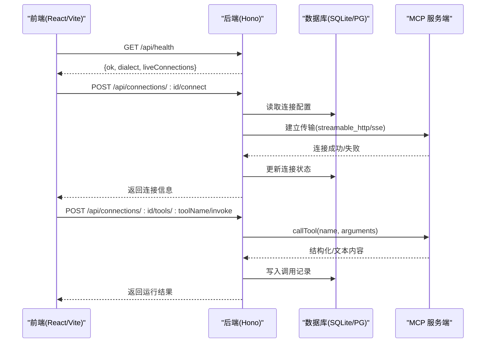
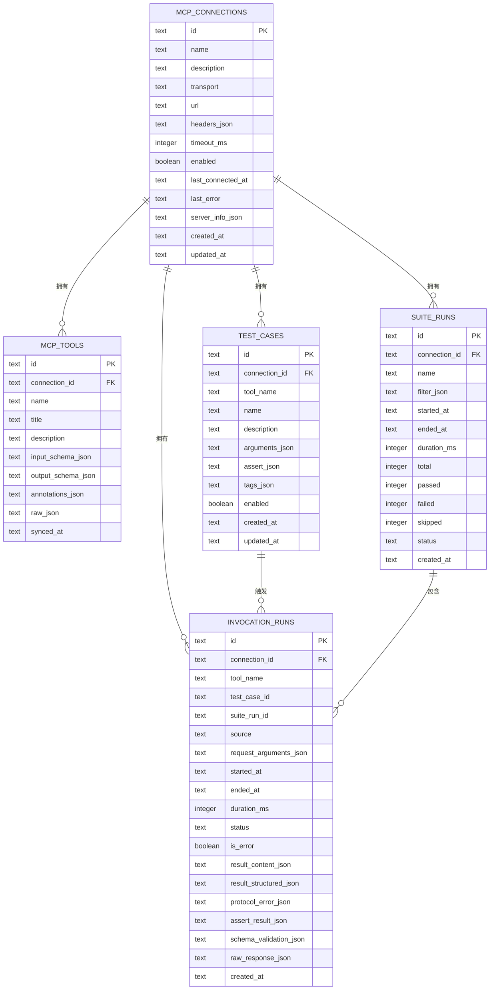
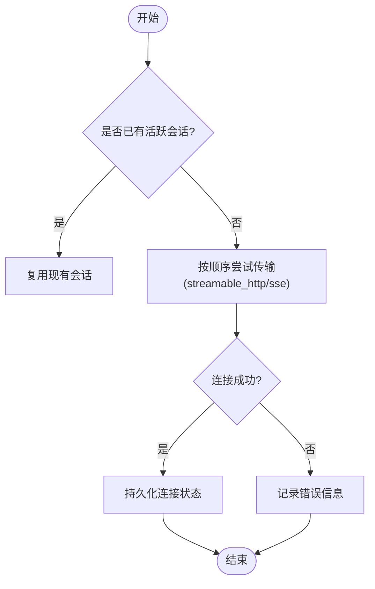
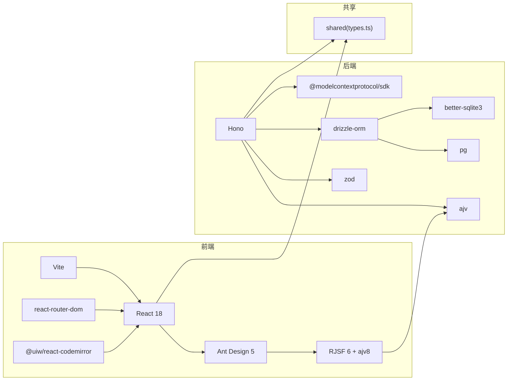

# 技术栈概览

<cite>
**本文引用的文件**
- [package.json](file://package.json)
- [apps/web/package.json](file://apps/web/package.json)
- [apps/server/package.json](file://apps/server/package.json)
- [packages/shared/package.json](file://packages/shared/package.json)
- [apps/server/src/index.ts](file://apps/server/src/index.ts)
- [apps/web/src/main.tsx](file://apps/web/src/main.tsx)
- [apps/web/src/App.tsx](file://apps/web/src/App.tsx)
- [apps/web/vite.config.ts](file://apps/web/vite.config.ts)
- [apps/server/src/routes/api.ts](file://apps/server/src/routes/api.ts)
- [apps/server/src/mcp/connection-manager.ts](file://apps/server/src/mcp/connection-manager.ts)
- [apps/server/src/db/client.ts](file://apps/server/src/db/client.ts)
- [apps/server/src/db/schema.sqlite.ts](file://apps/server/src/db/schema.sqlite.ts)
- [apps/server/src/db/schema.pg.ts](file://apps/server/src/db/schema.pg.ts)
- [packages/shared/src/types.ts](file://packages/shared/src/types.ts)
- [packages/shared/src/assert-schema.ts](file://packages/shared/src/assert-schema.ts)
</cite>

## 目录
1. [简介](#简介)
2. [项目结构](#项目结构)
3. [核心组件](#核心组件)
4. [架构总览](#架构总览)
5. [详细组件分析](#详细组件分析)
6. [依赖关系分析](#依赖关系分析)
7. [性能与可扩展性](#性能与可扩展性)
8. [故障排查指南](#故障排查指南)
9. [结论](#结论)
10. [附录：版本兼容性与选型背景](#附录版本兼容性与选型背景)

## 简介
MCP Tool Debug 是一个面向 Model Context Protocol（MCP）的开源调试与自动化测试工作台，支持 Streamable HTTP 与 SSE 两种传输方式。前端提供 JSON Schema 表单、代码编辑器与结果可视化；后端基于 Hono 暴露 REST API，使用 Drizzle ORM 与 better-sqlite3/pg 进行数据持久化，并通过 @modelcontextprotocol/sdk 与 MCP 服务端交互。

## 项目结构
仓库采用 monorepo 组织，包含共享类型包、Web 前端应用与 Node.js 后端服务：
- packages/shared：前后端共享的类型与工具
- apps/web：React + Ant Design + RJSF + CodeMirror + Vite 构建的前端
- apps/server：Hono + Drizzle ORM + SQLite/PostgreSQL 的后端
- deployment：Docker 与 Nginx 部署配置

图表来源
- [apps/web/src/main.tsx:1-26](file://apps/web/src/main.tsx#L1-L26)
- [apps/web/src/App.tsx:1-66](file://apps/web/src/App.tsx#L1-L66)
- [apps/web/vite.config.ts:1-16](file://apps/web/vite.config.ts#L1-L16)
- [apps/server/src/index.ts:1-39](file://apps/server/src/index.ts#L1-L39)
- [apps/server/src/routes/api.ts:1-277](file://apps/server/src/routes/api.ts#L1-L277)
- [apps/server/src/mcp/connection-manager.ts:1-383](file://apps/server/src/mcp/connection-manager.ts#L1-L383)
- [apps/server/src/db/client.ts:1-267](file://apps/server/src/db/client.ts#L1-L267)
- [apps/server/src/db/schema.sqlite.ts:1-120](file://apps/server/src/db/schema.sqlite.ts#L1-L120)
- [apps/server/src/db/schema.pg.ts:1-127](file://apps/server/src/db/schema.pg.ts#L1-L127)
- [packages/shared/src/types.ts:1-229](file://packages/shared/src/types.ts#L1-L229)
- [packages/shared/src/assert-schema.ts:1-32](file://packages/shared/src/assert-schema.ts#L1-L32)

章节来源
- [package.json:1-48](file://package.json#L1-L48)
- [apps/web/package.json:1-38](file://apps/web/package.json#L1-L38)
- [apps/server/package.json:1-32](file://apps/server/package.json#L1-L32)
- [packages/shared/package.json:1-22](file://packages/shared/package.json#L1-L22)

## 核心组件
- 前端入口与路由
  - React 18 作为 UI 框架，Ant Design 5 提供主题与国际化，Vite 提供开发服务器与代理到后端。
  - 路由由 react-router-dom 管理，页面包括连接、工作区、自动化与设置。
- 后端服务
  - Hono 作为轻量 Web 框架，挂载 CORS 与 /api 路由，启动时执行数据库迁移。
  - 通过 @modelcontextprotocol/sdk 建立与 MCP 服务器的连接，支持 streamable_http 与 sse 两种传输。
- 数据层
  - Drizzle ORM 抽象 SQL，同时支持 better-sqlite3 与 pg（node-postgres）。
  - 根据环境变量或 DATABASE_URL 自动推断方言并初始化对应驱动。
- 共享类型
  - 统一前后端契约，如连接、工具、用例、运行记录等类型定义。

章节来源
- [apps/web/src/main.tsx:1-26](file://apps/web/src/main.tsx#L1-L26)
- [apps/web/src/App.tsx:1-66](file://apps/web/src/App.tsx#L1-L66)
- [apps/web/vite.config.ts:1-16](file://apps/web/vite.config.ts#L1-L16)
- [apps/server/src/index.ts:1-39](file://apps/server/src/index.ts#L1-L39)
- [apps/server/src/mcp/connection-manager.ts:1-383](file://apps/server/src/mcp/connection-manager.ts#L1-L383)
- [apps/server/src/db/client.ts:1-267](file://apps/server/src/db/client.ts#L1-L267)
- [packages/shared/src/types.ts:1-229](file://packages/shared/src/types.ts#L1-L229)

## 架构总览
系统采用前后端分离架构：
- 前端通过 Vite 本地开发服务器代理 /api 请求至后端 8787 端口。
- 后端以 Hono 提供服务，CORS 允许前端跨域访问。
- 数据层按环境选择 SQLite 或 PostgreSQL，Drizzle 负责类型安全查询与迁移。
- MCP 客户端在 ConnectionManager 中维护会话，具备自动重连与超时控制。

图表来源
- [apps/web/vite.config.ts:1-16](file://apps/web/vite.config.ts#L1-L16)
- [apps/server/src/index.ts:1-39](file://apps/server/src/index.ts#L1-L39)
- [apps/server/src/routes/api.ts:1-277](file://apps/server/src/routes/api.ts#L1-L277)
- [apps/server/src/mcp/connection-manager.ts:1-383](file://apps/server/src/mcp/connection-manager.ts#L1-L383)
- [apps/server/src/db/client.ts:1-267](file://apps/server/src/db/client.ts#L1-L267)

## 详细组件分析

### 前端技术栈与作用
- React 18：组件化 UI 与 Hooks 生态，配合 StrictMode 提升开发体验。
- Ant Design 5：企业级 UI 组件库，提供主题定制与中文本地化。
- RJSF 6 + validator-ajv8：基于 JSON Schema 的动态表单渲染与校验，适配 JSON Schema 2020-12。
- CodeMirror（@uiw/react-codemirror）：JSON 编辑与高亮，便于手工构造参数。
- Vite：快速热重载与生产构建，内置代理转发 /api 到后端。
- react-router-dom：前端路由与页面导航。

章节来源
- [apps/web/package.json:1-38](file://apps/web/package.json#L1-L38)
- [apps/web/src/main.tsx:1-26](file://apps/web/src/main.tsx#L1-L26)
- [apps/web/src/App.tsx:1-66](file://apps/web/src/App.tsx#L1-L66)
- [apps/web/vite.config.ts:1-16](file://apps/web/vite.config.ts#L1-L16)

### 后端技术栈与作用
- Hono：轻量、高性能的 Web 框架，易于组合中间件（如 CORS），API 路由清晰。
- @modelcontextprotocol/sdk：官方 SDK，封装 MCP 协议客户端，支持 streamable_http 与 sse。
- Drizzle ORM：类型安全的 SQL 抽象，统一 SQLite 与 PostgreSQL 操作。
- better-sqlite3：嵌入式同步数据库，适合单机开发与演示。
- pg（node-postgres）：PostgreSQL 驱动，用于生产级多进程并发场景。
- Zod：运行时类型校验，辅助输入验证与错误提示。

章节来源
- [apps/server/package.json:1-32](file://apps/server/package.json#L1-L32)
- [apps/server/src/index.ts:1-39](file://apps/server/src/index.ts#L1-L39)
- [apps/server/src/routes/api.ts:1-277](file://apps/server/src/routes/api.ts#L1-L277)
- [apps/server/src/mcp/connection-manager.ts:1-383](file://apps/server/src/mcp/connection-manager.ts#L1-L383)
- [apps/server/src/db/client.ts:1-267](file://apps/server/src/db/client.ts#L1-L267)

### 数据模型与迁移
- 表集合：mcp_connections、mcp_tools、test_cases、suite_runs、invocation_runs。
- 双方言实现：sqlite 与 pg 两套 schema 定义，字段一致但类型适配各自方言。
- 迁移策略：启动时根据方言执行 DDL，确保表结构与索引存在。

图表来源
- [apps/server/src/db/schema.sqlite.ts:1-120](file://apps/server/src/db/schema.sqlite.ts#L1-L120)
- [apps/server/src/db/schema.pg.ts:1-127](file://apps/server/src/db/schema.pg.ts#L1-L127)
- [apps/server/src/db/client.ts:69-245](file://apps/server/src/db/client.ts#L69-L245)

章节来源
- [apps/server/src/db/client.ts:1-267](file://apps/server/src/db/client.ts#L1-L267)
- [apps/server/src/db/schema.sqlite.ts:1-120](file://apps/server/src/db/schema.sqlite.ts#L1-L120)
- [apps/server/src/db/schema.pg.ts:1-127](file://apps/server/src/db/schema.pg.ts#L1-L127)

### MCP 连接与会话管理
- 连接建立：优先按配置的传输类型尝试，否则依次尝试 streamable_http 与 sse。
- 会话恢复：当检测到流式会话过期（HTTP 404）时，自动丢弃旧会话并重连。
- 超时控制：为每次 callTool 调用设置超时，避免长时间阻塞。
- 状态持久化：连接成功/失败、最后错误信息、服务器能力等信息落库。

图表来源
- [apps/server/src/mcp/connection-manager.ts:101-147](file://apps/server/src/mcp/connection-manager.ts#L101-L147)
- [apps/server/src/mcp/connection-manager.ts:175-268](file://apps/server/src/mcp/connection-manager.ts#L175-L268)
- [apps/server/src/db/client.ts:247-266](file://apps/server/src/db/client.ts#L247-L266)

章节来源
- [apps/server/src/mcp/connection-manager.ts:1-383](file://apps/server/src/mcp/connection-manager.ts#L1-L383)

### API 设计要点
- 健康检查：/api/health 返回当前方言与在线连接数。
- 连接管理：创建、查询、更新、删除、连接/断开、同步工具列表。
- 工具调用：/invoke 接口支持保存运行记录与关联用例。
- 用例与套件：CRUD、单条运行、套件批量运行、运行历史分页查询。
- 导入导出：将连接与用例打包导出，或从 bundle 导入。

章节来源
- [apps/server/src/routes/api.ts:1-277](file://apps/server/src/routes/api.ts#L1-L277)

### 共享类型与断言
- 类型集中：连接、工具、用例、运行记录、断言配置等统一在 shared 包中定义。
- 断言归一化：normalizeAssert 对断言配置做默认值填充与规范化，保证一致性。

章节来源
- [packages/shared/src/types.ts:1-229](file://packages/shared/src/types.ts#L1-L229)
- [packages/shared/src/assert-schema.ts:1-32](file://packages/shared/src/assert-schema.ts#L1-L32)

## 依赖关系分析
- 前端依赖
  - React 18、Ant Design 5、RJSF 6、validator-ajv8、CodeMirror、react-router-dom、Vite。
- 后端依赖
  - Hono、@modelcontextprotocol/sdk、Drizzle ORM、better-sqlite3、pg、Zod、Ajv。
- 共享包
  - 仅 TypeScript 编译产物，无运行时依赖。

图表来源
- [apps/web/package.json:1-38](file://apps/web/package.json#L1-L38)
- [apps/server/package.json:1-32](file://apps/server/package.json#L1-L32)
- [packages/shared/package.json:1-22](file://packages/shared/package.json#L1-L22)

章节来源
- [apps/web/package.json:1-38](file://apps/web/package.json#L1-L38)
- [apps/server/package.json:1-32](file://apps/server/package.json#L1-L32)
- [packages/shared/package.json:1-22](file://packages/shared/package.json#L1-L22)

## 性能与可扩展性
- 并发与队列
  - ConnectionManager 对每个连接维护串行队列，避免同一连接的并发冲突。
- 会话恢复
  - 针对流式会话过期（HTTP 404）自动重连，降低人工干预成本。
- 超时控制
  - 调用层设置超时，防止长尾请求拖垮服务。
- 数据库
  - SQLite 开启 WAL 模式提升并发读性能；PostgreSQL 使用连接池应对高并发。
- 前端
  - Vite 代理减少跨域问题；RJSF 动态表单按需渲染，避免全量解析开销。

[本节为通用指导，不直接分析具体文件]

## 故障排查指南
- 连接失败
  - 检查环境变量 PORT/CORS_ORIGIN/DATABASE_URL/DB_DIALECT。
  - 查看 /api/health 返回的 dialect 与 liveConnections 数量。
- 会话异常
  - 关注日志中的 mcp_session_recovery_* 事件，确认是否因 404 导致会话失效。
- 超时问题
  - 调整连接级别 timeoutMs 或调用层传入的超时参数。
- 导入导出
  - 确认 ExportBundle 结构完整，connections 数组非空且包含必要字段。

章节来源
- [apps/server/src/index.ts:1-39](file://apps/server/src/index.ts#L1-L39)
- [apps/server/src/routes/api.ts:32-38](file://apps/server/src/routes/api.ts#L32-L38)
- [apps/server/src/mcp/connection-manager.ts:209-268](file://apps/server/src/mcp/connection-manager.ts#L209-L268)

## 结论
本项目以“前后端分离 + 共享类型”的方式，结合 Hono 与 Drizzle ORM 实现了灵活的数据层与清晰的 API 边界。通过 @modelcontextprotocol/sdk 对接 MCP 服务端，并提供丰富的调试与自动化能力。SQLite 与 PostgreSQL 的双方言支持兼顾了易用性与扩展性，适合从本地开发到生产部署的平滑演进。

[本节为总结，不直接分析具体文件]

## 附录：版本兼容性与选型背景
- 版本兼容性
  - Node.js >= 20（根 package.json engines 指定）。
  - 前端：React 18.3.x、Ant Design 5.29.x、RJSF 6.7.x、@rjsf/validator-ajv8 6.7.x、ajv 8.17.x、@uiw/react-codemirror 4.23.x、Vite 6.2.x、react-router-dom 7.5.x。
  - 后端：Hono 4.7.x、@modelcontextprotocol/sdk 1.29.x、drizzle-orm 0.43.x、better-sqlite3 11.9.x、pg 8.14.x、zod 3.25.x、ajv 8.17.x。
- 选型背景与优势
  - 前后端分离：便于独立迭代与部署，Vite 代理简化本地联调。
  - TypeScript：贯穿前后端与共享包，保障契约一致与重构安全。
  - 多数据库支持：SQLite 零配置开箱即用，PostgreSQL 满足生产并发与生态需求；Drizzle 统一抽象降低切换成本。
  - RJSF + Ajv：原生支持 JSON Schema 2020-12，表单与校验同源，减少重复逻辑。
  - Hono：轻量高效，中间件生态完善，适合微服务与边缘场景。
  - @modelcontextprotocol/sdk：官方实现，稳定对接 MCP 协议，覆盖多种传输。

章节来源
- [package.json:41-47](file://package.json#L41-L47)
- [apps/web/package.json:12-36](file://apps/web/package.json#L12-L36)
- [apps/server/package.json:12-30](file://apps/server/package.json#L12-L30)