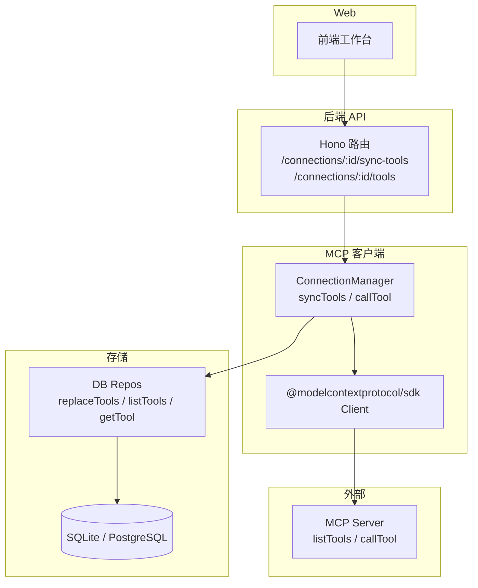
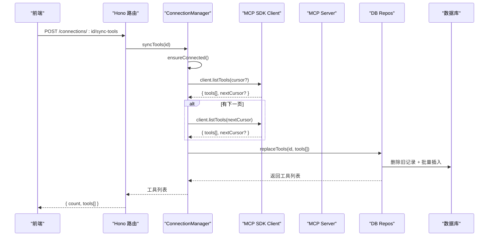
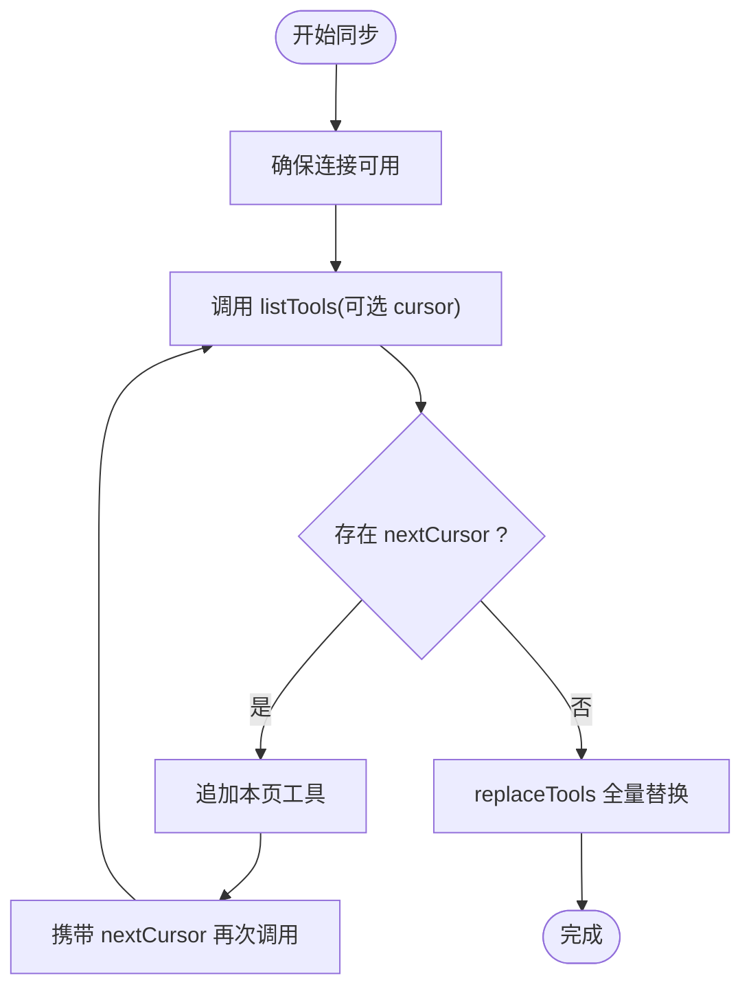
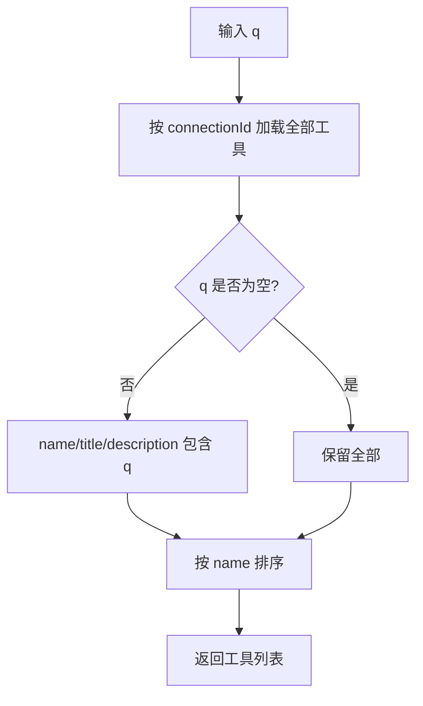
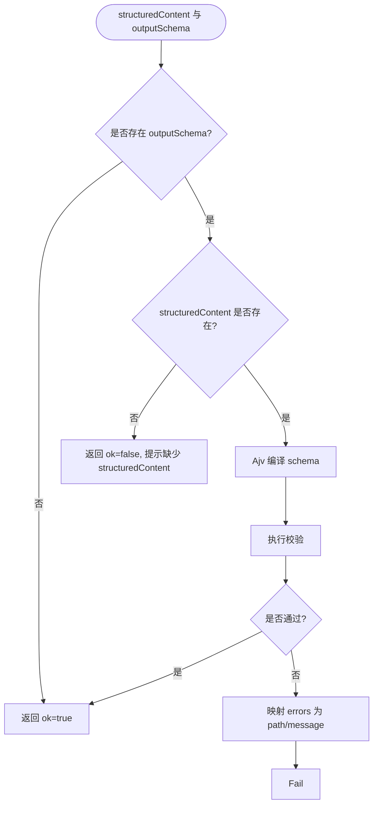
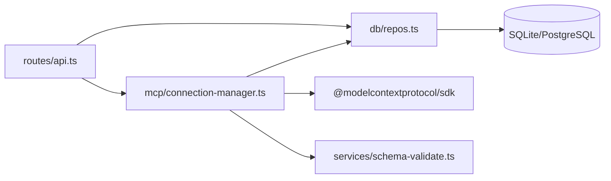

# Tool 同步与发现

<cite>
**本文引用的文件**
- [README.md](file://README.md)
- [connection-manager.ts](file://apps/server/src/mcp/connection-manager.ts)
- [api.ts](file://apps/server/src/routes/api.ts)
- [repos.ts](file://apps/server/src/db/repos.ts)
- [schema.sqlite.ts](file://apps/server/src/db/schema.sqlite.ts)
- [schema-validate.ts](file://apps/server/src/services/schema-validate.ts)
- [types.ts](file://packages/shared/src/types.ts)
- [mock-mcp-server.ts](file://scripts/mock-mcp-server.ts)
</cite>

## 目录
1. [简介](#简介)
2. [项目结构](#项目结构)
3. [核心组件](#核心组件)
4. [架构总览](#架构总览)
5. [详细组件分析](#详细组件分析)
6. [依赖关系分析](#依赖关系分析)
7. [性能考虑](#性能考虑)
8. [故障排查指南](#故障排查指南)
9. [结论](#结论)
10. [附录](#附录)

## 简介
本文件聚焦于 MCP Tool Debug 的“Tool 同步与发现”能力，覆盖从 MCP Server 拉取工具列表、获取工具元数据与 JSON Schema 定义、搜索与过滤机制、Schema 解析与校验、配置选项、缓存策略、增量更新思路、元数据结构与兼容性检查，以及大型工具集的性能优化与分页加载策略。

## 项目结构
与 Tool 同步与发现直接相关的代码主要分布在以下模块：
- API 路由层：提供连接管理、工具同步、工具查询等 HTTP 接口
- MCP 客户端与连接管理：负责建立连接、会话恢复、调用 listTools 并持久化
- 数据库仓储层：负责工具的增删改查、JSON 字段序列化/反序列化
- Schema 校验服务：基于 Ajv 2020 对结构化输出进行验证
- 共享类型：统一前后端的数据模型与断言配置
- Mock 服务端：用于演示 listTools 返回结构与行为

图表来源
- [api.ts:94-115](file://apps/server/src/routes/api.ts#L94-L115)
- [connection-manager.ts:270-298](file://apps/server/src/mcp/connection-manager.ts#L270-L298)
- [repos.ts:314-382](file://apps/server/src/db/repos.ts#L314-L382)
- [schema.sqlite.ts:19-39](file://apps/server/src/db/schema.sqlite.ts#L19-L39)

章节来源
- [README.md:145-155](file://README.md#L145-L155)
- [api.ts:94-115](file://apps/server/src/routes/api.ts#L94-L115)
- [connection-manager.ts:270-298](file://apps/server/src/mcp/connection-manager.ts#L270-L298)
- [repos.ts:314-382](file://apps/server/src/db/repos.ts#L314-L382)
- [schema.sqlite.ts:19-39](file://apps/server/src/db/schema.sqlite.ts#L19-L39)

## 核心组件
- API 路由层
  - POST /connections/:id/sync-tools：触发一次完整同步，返回已持久化的工具清单
  - GET /connections/:id/tools?q=...：按名称/标题/描述模糊搜索本地已同步的工具
  - GET /connections/:id/tools/:toolName：获取单个工具的元数据与 Schema
- MCP 连接管理器
  - syncTools：通过 MCP SDK 的 listTools 分页拉取，合并后替换本地存储
  - ensureConnected / withSessionRecovery：自动处理 Streamable HTTP 会话过期（404）的重连
- 数据库仓储层
  - replaceTools：删除旧记录并批量插入新工具，写入 syncedAt
  - listTools/getTool：支持按连接 ID 查询与模糊搜索
- Schema 校验服务
  - validateAgainstSchema：使用 Ajv 2020 校验 structuredContent 是否符合 outputSchema
- 共享类型
  - McpTool、AssertConfig、SchemaValidationResult 等

章节来源
- [api.ts:94-115](file://apps/server/src/routes/api.ts#L94-L115)
- [connection-manager.ts:270-298](file://apps/server/src/mcp/connection-manager.ts#L270-298)
- [repos.ts:314-382](file://apps/server/src/db/repos.ts#L314-L382)
- [schema-validate.ts:27-61](file://apps/server/src/services/schema-validate.ts#L27-L61)
- [types.ts:92-103](file://packages/shared/src/types.ts#L92-L103)

## 架构总览
Tool 同步与发现的关键流程如下：
- 用户在前端点击“同步 Tools”，调用后端同步接口
- 后端 ConnectionManager 确保连接有效，必要时重建会话
- 通过 MCP SDK 的 listTools 分页拉取全部工具（支持 nextCursor）
- 将工具元数据与 Schema 持久化到数据库
- 前端可搜索、查看单个工具的 inputSchema/outputSchema

图表来源
- [api.ts:94-102](file://apps/server/src/routes/api.ts#L94-L102)
- [connection-manager.ts:270-298](file://apps/server/src/mcp/connection-manager.ts#L270-298)
- [repos.ts:314-349](file://apps/server/src/db/repos.ts#L314-L349)

## 详细组件分析

### 同步流程与分页
- 分页拉取
  - 使用 MCP SDK 的 listTools 方法，循环读取 nextCursor，直到无下一页
  - 将所有 pages 的 tools 合并为一份完整列表
- 幂等替换
  - 先删除该连接下的所有历史工具记录，再批量插入本次结果，保证最终一致性
  - 写入 syncedAt 时间戳，便于后续审计或展示
- 错误与恢复
  - 若底层为 Streamable HTTP 且出现 404 会话失效，自动丢弃旧会话并重连一次
  - 重连失败则向上抛出错误，由路由层返回 502

图表来源
- [connection-manager.ts:270-298](file://apps/server/src/mcp/connection-manager.ts#L270-298)
- [repos.ts:314-349](file://apps/server/src/db/repos.ts#L314-L349)

章节来源
- [connection-manager.ts:270-298](file://apps/server/src/mcp/connection-manager.ts#L270-298)
- [repos.ts:314-349](file://apps/server/src/db/repos.ts#L314-L349)

### 工具搜索与过滤
- 当前实现
  - 支持按 name/title/description 进行大小写不敏感的包含匹配
  - 在内存中对查询结果进行过滤，排序依据 name
- 扩展点
  - 可在仓储层增加更多过滤维度（如 annotations、tags），或引入全文索引以支持大规模检索

图表来源
- [repos.ts:351-382](file://apps/server/src/db/repos.ts#L351-L382)

章节来源
- [repos.ts:351-382](file://apps/server/src/db/repos.ts#L351-L382)

### 工具元数据结构与 Schema 规范
- 工具元数据
  - 包含 id、connectionId、name、title、description、inputSchema、outputSchema、annotations、raw、syncedAt
  - 其中 inputSchema 默认回退为最小对象 schema；outputSchema/annotations/raw 可为空
- JSON Schema 版本
  - 系统采用 JSON Schema 2020-12，校验器为 Ajv 2020
- 兼容性检查
  - 当 outputSchema 缺失时，视为无需校验
  - 当 structuredContent 缺失但存在 outputSchema 时，标记为校验失败并给出明确错误信息

章节来源
- [types.ts:92-103](file://packages/shared/src/types.ts#L92-L103)
- [repos.ts:71-97](file://apps/server/src/db/repos.ts#L71-L97)
- [schema-validate.ts:27-61](file://apps/server/src/services/schema-validate.ts#L27-L61)

### Schema 解析与字段验证
- 校验入口
  - 在调用 Tool 后，根据 tool.outputSchema 对 structuredContent 执行校验
- 校验规则
  - 使用 Ajv 2020 编译 schema，收集 allErrors
  - 将错误映射为 path/message 数组，供前端展示
- 异常处理
  - 若 schema 编译失败，返回统一的编译错误信息

图表来源
- [schema-validate.ts:27-61](file://apps/server/src/services/schema-validate.ts#L27-L61)

章节来源
- [schema-validate.ts:27-61](file://apps/server/src/services/schema-validate.ts#L27-L61)

### 工具调用与输出校验集成
- 调用链路
  - 路由层接收 invoke 请求，委托给用例运行器或直接调用 ConnectionManager.callTool
  - callTool 内部使用 withSessionRecovery 保障会话健壮性
- 输出校验
  - 成功响应中，若存在 outputSchema，则调用 validateAgainstSchema 生成 schemaValidation
- 超时与协议错误
  - 区分 TIMEOUT、AbortError 与协议错误，封装为 protocolError 与 status

章节来源
- [api.ts:117-138](file://apps/server/src/routes/api.ts#L117-L138)
- [connection-manager.ts:300-379](file://apps/server/src/mcp/connection-manager.ts#L300-L379)

### 数据存储与索引
- 表结构
  - mcp_tools 表保存每个连接的 tool 元数据与 JSON 字段
  - 唯一约束：同一连接下 tool.name 唯一
  - 索引：按 connectionId 加速查询
- 字段说明
  - inputSchemaJson/outputSchemaJson/annotationsJson/rawJson 均以 JSON 文本存储
  - syncedAt 记录最近一次同步时间

章节来源
- [schema.sqlite.ts:19-39](file://apps/server/src/db/schema.sqlite.ts#L19-L39)
- [repos.ts:314-349](file://apps/server/src/db/repos.ts#L314-L349)

### 配置项与环境变量
- 连接级配置
  - transport：streamable_http | sse | auto
  - url：MCP 服务端地址
  - headers：HTTP 头（安全起见，API 仅返回键名）
  - timeoutMs：调用超时毫秒数
- 环境变量
  - PORT、DATABASE_URL、DB_DIALECT、CORS_ORIGIN 等

章节来源
- [types.ts:54-90](file://packages/shared/src/types.ts#L54-L90)
- [README.md:136-144](file://README.md#L136-L144)

### 缓存策略与增量更新
- 当前策略
  - 同步为“全量替换”：每次同步前清空该连接的工具记录，再批量插入
  - 未实现增量差异对比或变更通知监听
- 建议的增量方案（概念性）
  - 比较 syncedAt 与上次同步时间，仅拉取新增/变更工具
  - 结合 MCP Server 的 listChanged 能力（若支持）减少无效同步
  - 对大工具集可采用分页+并发合并策略，降低单次负载

章节来源
- [repos.ts:314-349](file://apps/server/src/db/repos.ts#L314-L349)

### 兼容性与错误语义
- 兼容 MCP 协议
  - 支持 Streamable HTTP 与 SSE 两种传输模式
  - 自动识别并处理 404 会话失效场景，进行一次安全重试
- 错误分类
  - 协议错误：网络/会话/JSON-RPC 层面错误
  - 工具错误：isError 标志位
  - 超时错误：TIMEOUT/AbortError
  - Schema 校验错误：structuredContent 不符合 outputSchema

章节来源
- [connection-manager.ts:175-268](file://apps/server/src/mcp/connection-manager.ts#L175-L268)
- [connection-manager.ts:300-379](file://apps/server/src/mcp/connection-manager.ts#L300-L379)

## 依赖关系分析
- 模块耦合
  - API 路由依赖 ConnectionManager 与 Repos
  - ConnectionManager 依赖 MCP SDK 与 Repos
  - Repos 依赖 Drizzle ORM 与具体数据库方言
  - Schema 校验服务独立，被调用链复用
- 外部依赖
  - @modelcontextprotocol/sdk：MCP 客户端与服务端通信
  - ajv/ajv-formats：JSON Schema 2020-12 校验
  - drizzle-orm：跨 SQLite/PostgreSQL 的 ORM 抽象

图表来源
- [api.ts:1-20](file://apps/server/src/routes/api.ts#L1-L20)
- [connection-manager.ts:1-18](file://apps/server/src/mcp/connection-manager.ts#L1-L18)
- [repos.ts:1-24](file://apps/server/src/db/repos.ts#L1-L24)
- [schema-validate.ts:1-16](file://apps/server/src/services/schema-validate.ts#L1-L16)

章节来源
- [api.ts:1-20](file://apps/server/src/routes/api.ts#L1-L20)
- [connection-manager.ts:1-18](file://apps/server/src/mcp/connection-manager.ts#L1-L18)
- [repos.ts:1-24](file://apps/server/src/db/repos.ts#L1-L24)
- [schema-validate.ts:1-16](file://apps/server/src/services/schema-validate.ts#L1-L16)

## 性能考虑
- 分页拉取
  - 通过 nextCursor 避免一次性拉取超大工具集，降低内存与网络压力
- 全量替换
  - 先删后插保证一致性，但在工具数量极大时可能产生较大 IO 开销
- 搜索性能
  - 当前搜索在内存中进行，适合中小规模；若工具数量增长，建议引入数据库全文索引或分片
- 并发控制
  - 连接级队列避免同一连接并发冲突，防止重复创建会话或竞态写入
- 超时与重试
  - 合理设置 timeoutMs，避免长尾阻塞；对 404 会话失效自动重连一次，提升稳定性

章节来源
- [connection-manager.ts:51-67](file://apps/server/src/mcp/connection-manager.ts#L51-L67)
- [connection-manager.ts:270-298](file://apps/server/src/mcp/connection-manager.ts#L270-298)
- [repos.ts:314-349](file://apps/server/src/db/repos.ts#L314-L349)

## 故障排查指南
- 连接失败
  - 检查 transport/url/headers 是否正确；查看 lastError 与 serverInfo
- 会话失效（Streamable HTTP 404）
  - 观察日志事件 mcp_session_recovery_started/failed/succeeded，确认是否自动重连成功
- 工具不存在
  - 确认是否已执行同步；GET /connections/:id/tools/:toolName 返回 404 表示未找到
- 超时
  - 调整 timeoutMs；检查远端服务性能与网络状况
- Schema 校验失败
  - 查看 schemaValidation.errors，定位 structuredContent 的具体路径与错误消息

章节来源
- [api.ts:77-102](file://apps/server/src/routes/api.ts#L77-L102)
- [connection-manager.ts:175-268](file://apps/server/src/mcp/connection-manager.ts#L175-L268)
- [schema-validate.ts:27-61](file://apps/server/src/services/schema-validate.ts#L27-L61)

## 结论
MCP Tool Debug 的 Tool 同步与发现功能围绕“可靠连接—分页拉取—全量替换—本地搜索—Schema 校验”的主线展开。当前实现简洁稳健，适合中小型工具集与日常调试。面向大规模工具集，可在搜索索引、增量同步与并发拉取方面进一步优化。

## 附录

### API 参考（与 Tool 同步相关）
- POST /connections/:id/sync-tools
  - 作用：触发一次完整同步，返回已持久化工具列表
  - 成功：返回 { count, tools[] }
  - 失败：返回 { error }，状态码 502
- GET /connections/:id/tools
  - 作用：列出某连接下的工具，支持 q 参数模糊搜索
  - 返回：工具列表
- GET /connections/:id/tools/:toolName
  - 作用：获取指定工具的元数据与 Schema
  - 失败：404 表示工具不存在

章节来源
- [api.ts:94-115](file://apps/server/src/routes/api.ts#L94-L115)

### 示例 MCP 服务端（Mock）
- 提供 listTools 与 callTool 两个处理器，用于演示工具元数据与结构化输出
- 支持多种会话模式（正常、一次性过期、拒绝请求、HTTP 错误）

章节来源
- [mock-mcp-server.ts:33-100](file://scripts/mock-mcp-server.ts#L33-L100)
- [mock-mcp-server.ts:102-149](file://scripts/mock-mcp-server.ts#L102-L149)