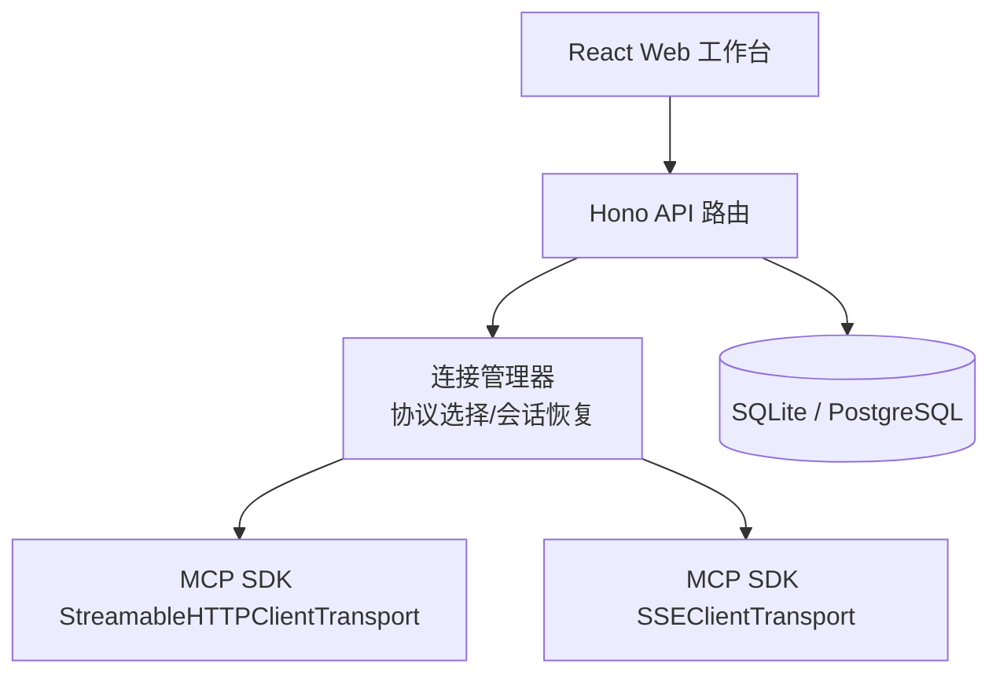
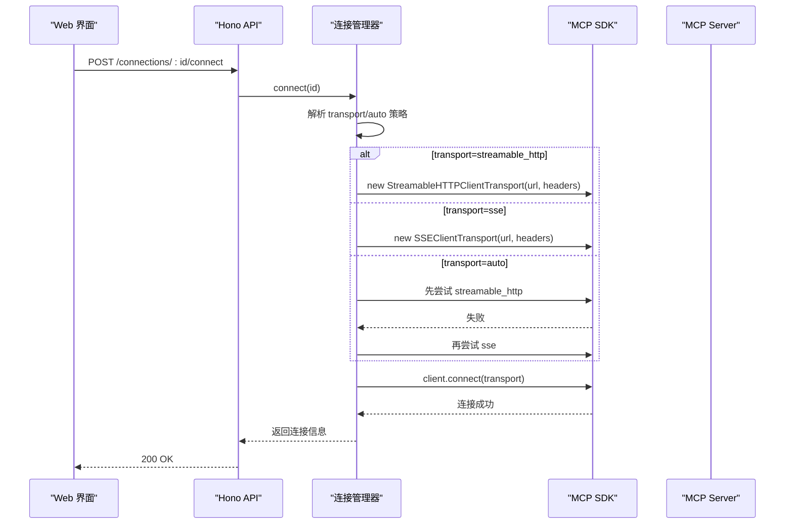
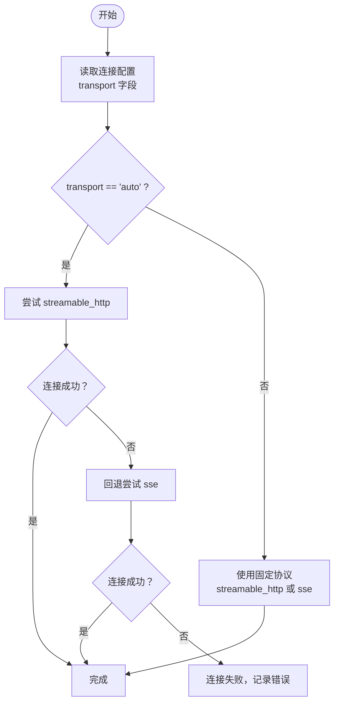
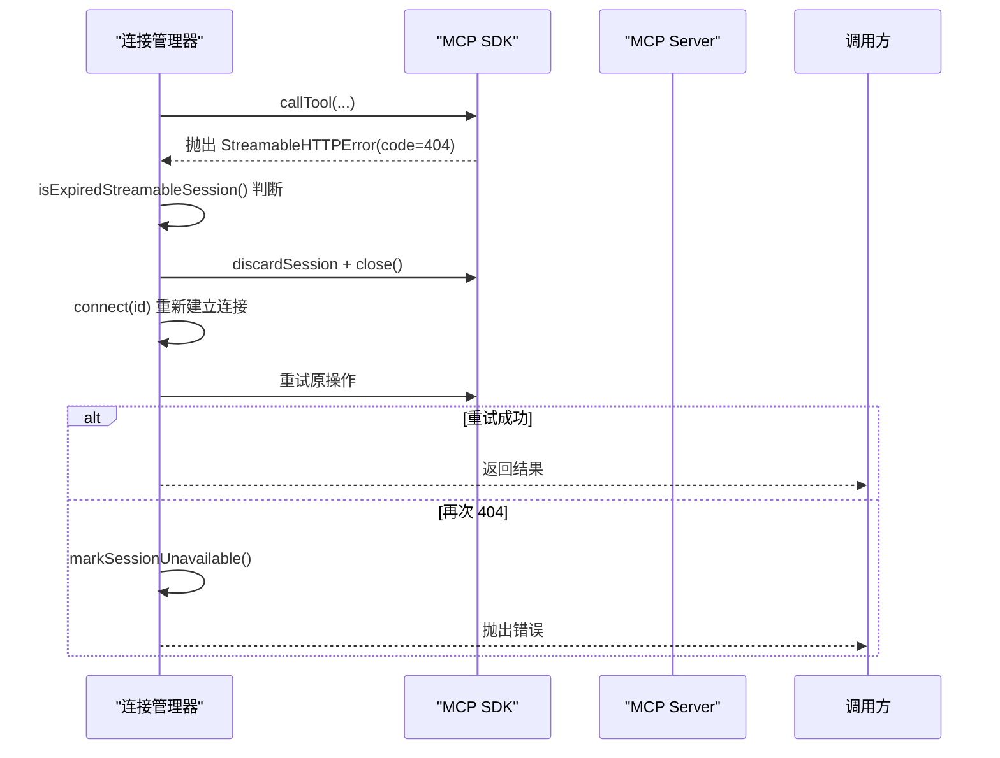
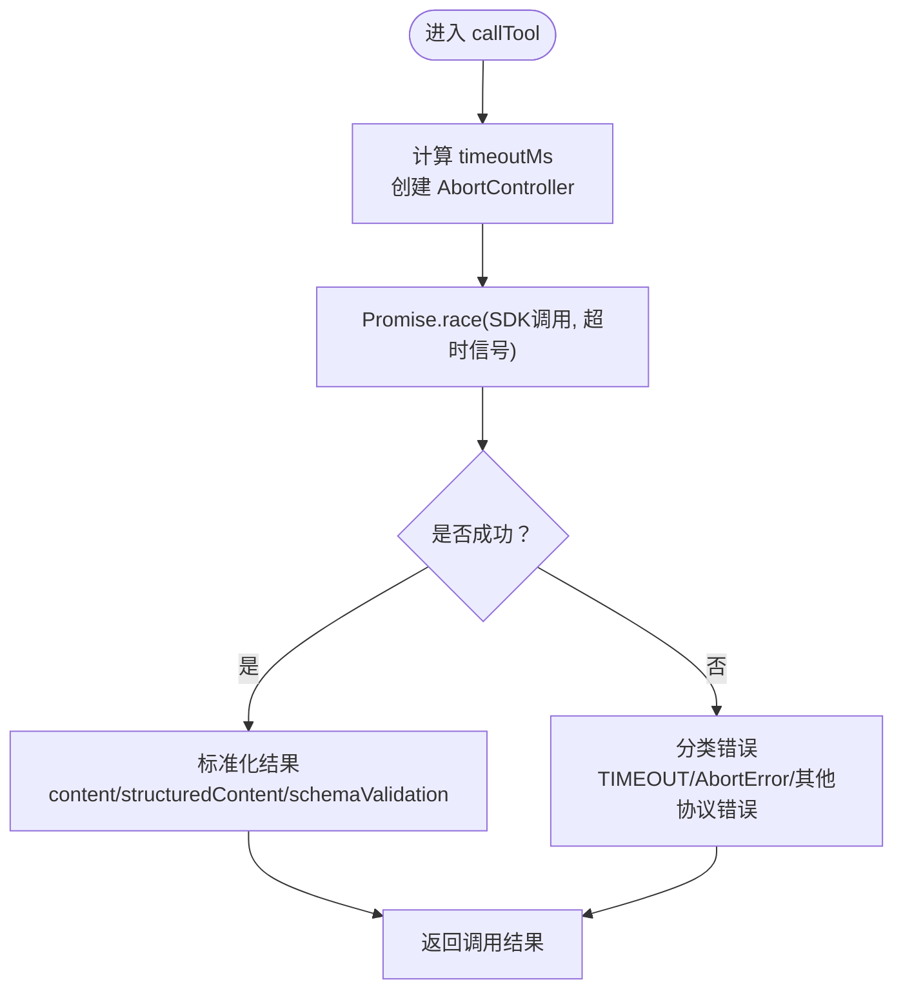
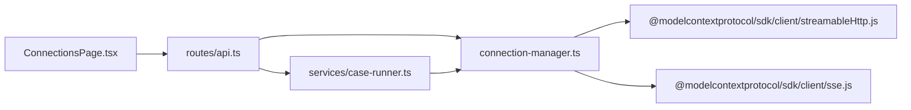

# 传输协议支持

<cite>
**本文引用的文件**   
- [README.md](file://README.md)
- [apps/server/src/index.ts](file://apps/server/src/index.ts)
- [apps/server/src/routes/api.ts](file://apps/server/src/routes/api.ts)
- [apps/server/src/mcp/connection-manager.ts](file://apps/server/src/mcp/connection-manager.ts)
- [packages/shared/src/types.ts](file://packages/shared/src/types.ts)
- [apps/web/src/pages/ConnectionsPage.tsx](file://apps/web/src/pages/ConnectionsPage.tsx)
- [apps/server/src/services/case-runner.ts](file://apps/server/src/services/case-runner.ts)
</cite>

## 目录
1. [简介](#简介)
2. [项目结构](#项目结构)
3. [核心组件](#核心组件)
4. [架构总览](#架构总览)
5. [详细组件分析](#详细组件分析)
6. [依赖关系分析](#依赖关系分析)
7. [性能与适用环境](#性能与适用环境)
8. [配置示例](#配置示例)
9. [调试技巧](#调试技巧)
10. [故障排除指南](#故障排除指南)
11. [结论](#结论)
12. [附录：扩展新协议的方法](#附录扩展新协议的方法)

## 简介
本文件聚焦 MCP Tool Debug 的传输协议支持能力，系统梳理并解释三种传输模式：Streamable HTTP、SSE（Server-Sent Events）以及 auto 自动回退模式。文档涵盖协议选择逻辑、自动检测机制、回退策略、错误处理、超时控制、连接管理、与 MCP SDK 的集成细节，并提供配置示例、调试技巧与故障排除方法，帮助读者在不同环境下选择合适的协议并稳定运行。

## 项目结构
MCP Tool Debug 采用前后端分离架构：前端 React Web 通过 Hono API 与后端交互，后端使用 MCP TypeScript SDK 与远端 MCP Server 通信，并通过 SQLite/PostgreSQL 持久化连接、用例与执行记录。

图表来源
- [apps/server/src/index.ts:10-33](file://apps/server/src/index.ts#L10-L33)
- [apps/server/src/routes/api.ts:18-38](file://apps/server/src/routes/api.ts#L18-L38)
- [apps/server/src/mcp/connection-manager.ts:75-99](file://apps/server/src/mcp/connection-manager.ts#L75-L99)

章节来源
- [README.md:145-156](file://README.md#L145-L156)
- [apps/server/src/index.ts:10-33](file://apps/server/src/index.ts#L10-L33)

## 核心组件
- 连接管理器（ConnectionManager）：负责创建 MCP Client、根据配置的 transport 或 auto 策略选择具体传输实现、维护会话生命周期、处理会话过期与自动重连、调用工具并封装结果。
- API 路由层：暴露连接、同步 Tools、调用工具等 REST 接口，将请求委派给连接管理器与用例执行器。
- 共享类型定义：统一 TransportType、RunStatus、McpConnection 等跨模块使用的数据结构。
- 前端连接页面：提供新建/编辑连接的表单，包含传输模式选择、超时设置与 Headers JSON 输入。

章节来源
- [apps/server/src/mcp/connection-manager.ts:39-147](file://apps/server/src/mcp/connection-manager.ts#L39-L147)
- [apps/server/src/routes/api.ts:40-138](file://apps/server/src/routes/api.ts#L40-L138)
- [packages/shared/src/types.ts:1-20](file://packages/shared/src/types.ts#L1-L20)
- [apps/web/src/pages/ConnectionsPage.tsx:253-286](file://apps/web/src/pages/ConnectionsPage.tsx#L253-L286)

## 架构总览
下图展示了从 Web 到 MCP Server 的端到端流程，包括协议选择与会话恢复的关键路径。

图表来源
- [apps/server/src/routes/api.ts:77-85](file://apps/server/src/routes/api.ts#L77-L85)
- [apps/server/src/mcp/connection-manager.ts:101-147](file://apps/server/src/mcp/connection-manager.ts#L101-L147)
- [apps/server/src/mcp/connection-manager.ts:75-99](file://apps/server/src/mcp/connection-manager.ts#L75-L99)

## 详细组件分析

### 协议选择与自动回退逻辑
- 支持的传输类型：
  - streamable_http：基于 MCP SDK 的 StreamableHTTPClientTransport。
  - sse：基于 MCP SDK 的 SSEClientTransport。
  - auto：优先尝试 streamable_http；若失败则回退至 sse。
- 选择依据：
  - 当连接记录的 transport 为 streamable_http 时，仅尝试该协议。
  - 当为 sse 时，仅尝试 sse。
  - 当为 auto 时，按顺序尝试 streamable_http → sse。
- 自动回退触发条件：
  - 在连接阶段，前一种协议初始化失败即尝试下一个候选。
  - 在调用阶段，若当前会话为 streamable_http 且收到特定 404 错误（表示会话已过期），则丢弃旧会话并重新建立连接（可能切换到不同协议）。

图表来源
- [apps/server/src/mcp/connection-manager.ts:108-147](file://apps/server/src/mcp/connection-manager.ts#L108-L147)

章节来源
- [apps/server/src/mcp/connection-manager.ts:101-147](file://apps/server/src/mcp/connection-manager.ts#L101-L147)
- [packages/shared/src/types.ts:1-1](file://packages/shared/src/types.ts#L1-L1)

### 会话管理与自动恢复
- 会话状态：
  - 每个连接维护一个 LiveSession，包含 client、transport、实际使用的传输类型与连接时间。
- 会话过期检测：
  - 针对 streamable_http，当出现特定 404 错误且存在 sessionId 时，判定为会话过期。
- 恢复流程：
  - 丢弃旧会话并关闭本地客户端。
  - 重新执行连接流程（可能再次选择不同协议）。
  - 重试原操作，若再次失败则标记不可用并抛出异常。

图表来源
- [apps/server/src/mcp/connection-manager.ts:175-268](file://apps/server/src/mcp/connection-manager.ts#L175-L268)

章节来源
- [apps/server/src/mcp/connection-manager.ts:175-268](file://apps/server/src/mcp/connection-manager.ts#L175-L268)

### 超时控制与错误分类
- 超时控制：
  - 每次调用工具前创建 AbortController，并在指定 timeoutMs 后触发 abort。
  - 使用 Promise.race 竞争 SDK 调用与超时信号，确保及时中断。
- 错误分类：
  - 成功：status=success，isError=false。
  - 工具错误：status=tool_error，isError=true。
  - 协议错误：status=protocol_error，isError=true，携带 protocolError 详情。
  - 超时：status=timeout，isError=true，携带 code="TIMEOUT" 或 AbortError。

图表来源
- [apps/server/src/mcp/connection-manager.ts:300-379](file://apps/server/src/mcp/connection-manager.ts#L300-L379)

章节来源
- [apps/server/src/mcp/connection-manager.ts:300-379](file://apps/server/src/mcp/connection-manager.ts#L300-L379)

### 数据模型与类型契约
- TransportType：限定为 "streamable_http" | "sse" | "auto"。
- McpConnection：包含名称、描述、transport、url、headers、timeoutMs、启用状态、最近连接时间与错误信息、服务器信息等。
- RunStatus：区分 success、tool_error、protocol_error、timeout、cancelled。
- InvokeResponse：封装单次调用的结果，包括耗时、状态、内容、结构化输出、Schema 校验与断言结果。

章节来源
- [packages/shared/src/types.ts:1-20](file://packages/shared/src/types.ts#L1-L20)
- [packages/shared/src/types.ts:54-70](file://packages/shared/src/types.ts#L54-L70)
- [packages/shared/src/types.ts:194-206](file://packages/shared/src/types.ts#L194-L206)

## 依赖关系分析
- 前端 ConnectionsPage 通过 API 客户端创建/更新连接，提交 transport 与超时等配置。
- API 路由接收请求，调用连接管理器进行连接与会话管理。
- 连接管理器依赖 MCP SDK 的两种传输实现，并根据配置与运行时错误进行协议选择与回退。
- 用例执行器（case-runner）封装调用与断言评估，并将结果持久化。

图表来源
- [apps/web/src/pages/ConnectionsPage.tsx:253-286](file://apps/web/src/pages/ConnectionsPage.tsx#L253-L286)
- [apps/server/src/routes/api.ts:77-138](file://apps/server/src/routes/api.ts#L77-L138)
- [apps/server/src/mcp/connection-manager.ts:75-99](file://apps/server/src/mcp/connection-manager.ts#L75-L99)
- [apps/server/src/services/case-runner.ts:11-77](file://apps/server/src/services/case-runner.ts#L11-L77)

章节来源
- [apps/web/src/pages/ConnectionsPage.tsx:253-286](file://apps/web/src/pages/ConnectionsPage.tsx#L253-L286)
- [apps/server/src/routes/api.ts:77-138](file://apps/server/src/routes/api.ts#L77-L138)
- [apps/server/src/mcp/connection-manager.ts:75-99](file://apps/server/src/mcp/connection-manager.ts#L75-L99)
- [apps/server/src/services/case-runner.ts:11-77](file://apps/server/src/services/case-runner.ts#L11-L77)

## 性能与适用环境
- Streamable HTTP：
  - 优点：适合长连接与有状态会话场景，具备更好的复用性与低开销。
  - 缺点：需要服务端正确维护会话 ID，网络中间件需透传相关头与状态。
  - 适用：生产环境、高并发、需要会话保持的场景。
- SSE：
  - 优点：实现简单，兼容性好，易于穿透代理与防火墙。
  - 缺点：无状态，无法复用会话，频繁重连开销较大。
  - 适用：开发调试、受限网络环境、对状态不敏感的场景。
- Auto 模式：
  - 优点：自动适配，提升兼容性，降低运维复杂度。
  - 缺点：首次连接可能多一次失败尝试，增加少量延迟。
  - 适用：不确定服务端能力或混合环境的通用场景。

[本节为通用指导，无需源码引用]

## 配置示例
以下示例展示如何在 Web 界面中配置连接与传输模式（以“新建连接”表单为例）：
- 名称：任意标识名。
- URL：MCP Server 地址。
- 传输：
  - auto（HTTP 失败回退 SSE）
  - streamable_http
  - sse
- 超时（ms）：建议 10000~120000，视服务端响应特性调整。
- Headers JSON：例如 {"Authorization":"Bearer xxx"}。

章节来源
- [apps/web/src/pages/ConnectionsPage.tsx:253-286](file://apps/web/src/pages/ConnectionsPage.tsx#L253-L286)

## 调试技巧
- 查看连接状态：
  - 在连接卡片中观察“在线/离线”标签与最近连接时间、错误信息。
- 检查协议选择：
  - 连接成功后，serverInfo 中包含 transportUsed 字段，可确认实际使用的传输类型。
- 捕获会话恢复事件：
  - 控制台会输出 mcp_session_recovery_started、mcp_session_recovery_succeeded、mcp_session_recovery_failed 等日志，便于定位 404 会话过期问题。
- 验证超时行为：
  - 适当降低超时值，观察是否返回 status=timeout 与 code=TIMEOUT。
- 导出/导入配置：
  - 使用导出功能备份连接与用例，导入用于迁移或复现问题。

章节来源
- [apps/server/src/mcp/connection-manager.ts:209-268](file://apps/server/src/mcp/connection-manager.ts#L209-L268)
- [apps/web/src/pages/ConnectionsPage.tsx:100-140](file://apps/web/src/pages/ConnectionsPage.tsx#L100-L140)

## 故障排除指南
- 连接失败：
  - 检查 URL 可达性与 CORS 配置。
  - 确认 Headers JSON 格式正确，必要时减少凭据逐步排查。
  - 切换传输模式（如从 auto 改为 sse）验证兼容性。
- 会话 404 错误：
  - 属于流式 HTTP 会话过期，系统将自动重建连接并重试。
  - 若反复失败，检查服务端会话清理策略与中间件转发规则。
- 超时频繁：
  - 增大 timeoutMs，或优化服务端处理逻辑。
  - 关注网络抖动与代理超时限制。
- 协议错误：
  - 查看 protocolError.message 与 code，结合服务端日志定位。
  - 对于非超时错误，检查 MCP 协议版本与服务端实现差异。

章节来源
- [apps/server/src/mcp/connection-manager.ts:300-379](file://apps/server/src/mcp/connection-manager.ts#L300-L379)
- [apps/server/src/mcp/connection-manager.ts:175-268](file://apps/server/src/mcp/connection-manager.ts#L175-L268)

## 结论
MCP Tool Debug 通过灵活的传输协议支持与自动回退机制，显著提升了与不同 MCP Server 的兼容性与稳定性。Streamable HTTP 适合有状态与高性能场景，SSE 适用于简化部署与弱网环境，auto 模式则在不确定性环境中提供最佳平衡。配合完善的超时控制、会话恢复与错误分类，开发者可在复杂网络与多服务组合下获得一致的调试体验。

[本节为总结性内容，无需源码引用]

## 附录：扩展新协议的方法
若需新增自定义传输协议（例如 WebSocket 或其他 MCP 传输实现），可按以下步骤扩展：
- 定义新的传输类型：
  - 在共享类型中扩展 TransportType，加入新协议标识。
- 实现传输适配器：
  - 在连接管理器中新增构建传输实例的逻辑，参考现有 StreamableHTTPClientTransport 与 SSEClientTransport 的使用方式。
- 更新协议选择与回退策略：
  - 在 connect 方法的 tryOrder 中加入新协议的优先级。
  - 如需特殊回退逻辑（如特定错误码），在 withSessionRecovery 中添加相应判断。
- 前端表单支持：
  - 在 ConnectionsPage 的 Select 选项中添加新协议选项。
- 测试与验证：
  - 编写连接与调用用例，覆盖正常、失败与回退路径。
  - 验证超时、错误分类与会话恢复行为是否符合预期。

章节来源
- [packages/shared/src/types.ts:1-1](file://packages/shared/src/types.ts#L1-L1)
- [apps/server/src/mcp/connection-manager.ts:75-99](file://apps/server/src/mcp/connection-manager.ts#L75-L99)
- [apps/server/src/mcp/connection-manager.ts:108-147](file://apps/server/src/mcp/connection-manager.ts#L108-L147)
- [apps/web/src/pages/ConnectionsPage.tsx:264-272](file://apps/web/src/pages/ConnectionsPage.tsx#L264-L272)