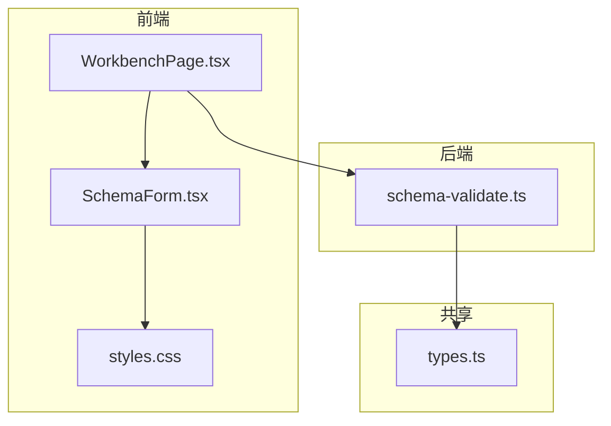
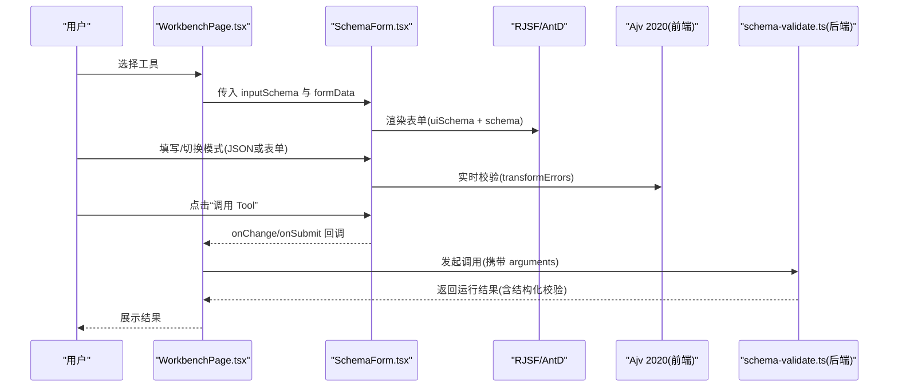
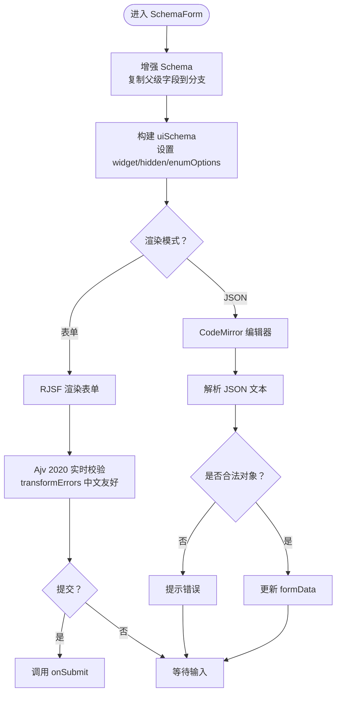
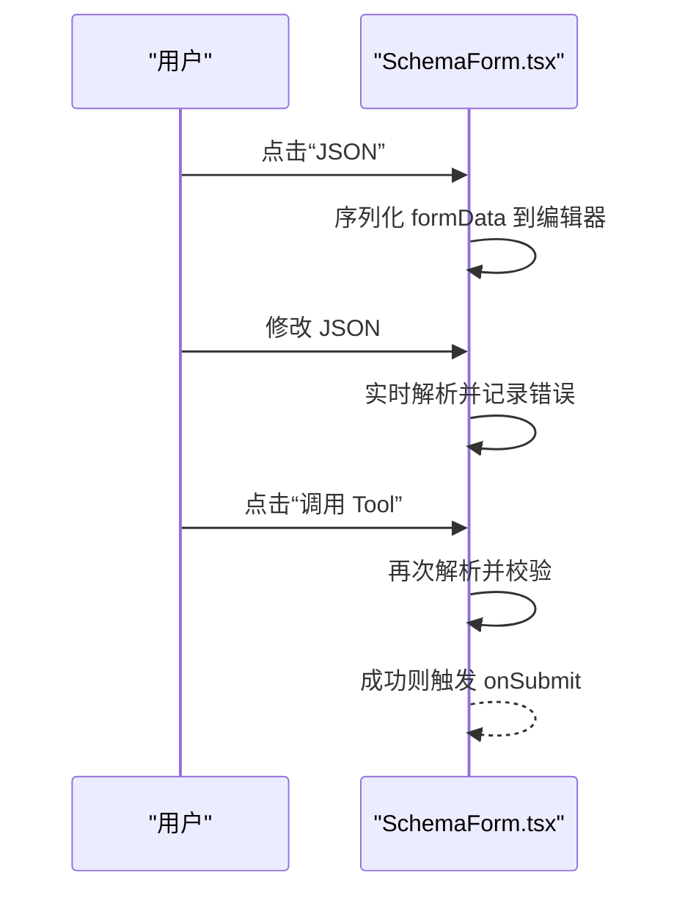
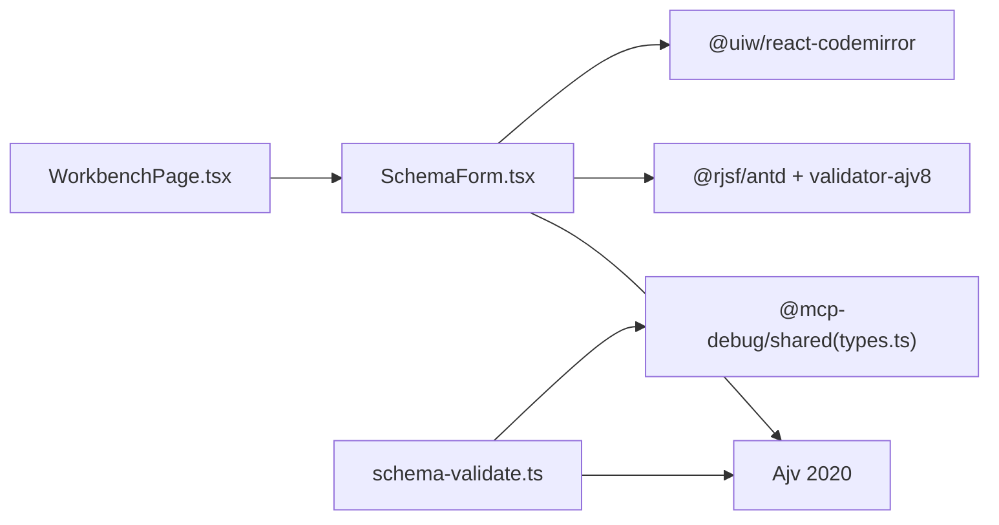

# 动态表单系统

<cite>
**本文引用的文件**   
- [SchemaForm.tsx](file://apps/web/src/components/SchemaForm.tsx)
- [WorkbenchPage.tsx](file://apps/web/src/pages/WorkbenchPage.tsx)
- [schema-validate.ts](file://apps/server/src/services/schema-validate.ts)
- [types.ts](file://packages/shared/src/types.ts)
- [styles.css](file://apps/web/src/styles.css)
</cite>

## 目录
1. [简介](#简介)
2. [项目结构](#项目结构)
3. [核心组件](#核心组件)
4. [架构总览](#架构总览)
5. [详细组件分析](#详细组件分析)
6. [依赖关系分析](#依赖关系分析)
7. [性能与体验优化](#性能与体验优化)
8. [故障排查指南](#故障排查指南)
9. [结论](#结论)
10. [附录：配置与扩展](#附录配置与扩展)

## 简介
本文件面向 MCP Tool Debug 的动态表单子系统，系统化阐述基于 RJSF 6 + Ajv 2020 的 JSON Schema 2020-12 表单生成机制。内容覆盖以下要点：
- 支持的 Schema 特性：oneOf、anyOf、嵌套对象、数组、必填字段验证、默认值处理、自定义校验器
- 表单渲染引擎、字段组件映射与交互行为
- 表单配置选项、样式定制与扩展方法
- 双模式编辑（可视化表单与 JSON 编辑器）的实现原理与切换逻辑
- 表单数据绑定、实时验证反馈与错误提示机制
- 复杂 Schema 的性能优化与用户体验改进建议

## 项目结构
动态表单相关代码主要位于前端应用层与服务端校验服务中：
- 前端
  - 表单组件：apps/web/src/components/SchemaForm.tsx
  - 工作区页面集成：apps/web/src/pages/WorkbenchPage.tsx
  - 样式：apps/web/src/styles.css
- 服务端
  - 结构化输出校验：apps/server/src/services/schema-validate.ts
- 共享类型定义：packages/shared/src/types.ts

图表来源
- [SchemaForm.tsx:1-421](file://apps/web/src/components/SchemaForm.tsx#L1-L421)
- [WorkbenchPage.tsx:1-541](file://apps/web/src/pages/WorkbenchPage.tsx#L1-L541)
- [schema-validate.ts:1-61](file://apps/server/src/services/schema-validate.ts#L1-L61)
- [types.ts:1-229](file://packages/shared/src/types.ts#L1-L229)
- [styles.css:1-562](file://apps/web/src/styles.css#L1-L562)

章节来源
- [SchemaForm.tsx:1-421](file://apps/web/src/components/SchemaForm.tsx#L1-L421)
- [WorkbenchPage.tsx:1-541](file://apps/web/src/pages/WorkbenchPage.tsx#L1-L541)
- [schema-validate.ts:1-61](file://apps/server/src/services/schema-validate.ts#L1-L61)
- [types.ts:1-229](file://packages/shared/src/types.ts#L1-L229)
- [styles.css:1-562](file://apps/web/src/styles.css#L1-L562)

## 核心组件
- SchemaForm 组件
  - 负责将工具输入 Schema 转换为 RJSF 可渲染的 schema 与 uiSchema
  - 提供“表单”和“JSON”两种编辑模式
  - 使用 Ajv 2020 作为校验器，并支持中文友好的错误消息转换
  - 通过 RJSF 的 experimental_defaultFormStateBehavior 控制默认值填充策略
- WorkbenchPage 页面
  - 加载工具元信息（含 inputSchema/outputSchema）
  - 将 inputSchema 传入 SchemaForm 进行渲染
  - 收集用户输入并调用后端执行工具
- 服务端 schema-validate
  - 使用 Ajv 2020 对结构化结果进行二次校验，返回统一的结构化校验结果

章节来源
- [SchemaForm.tsx:1-421](file://apps/web/src/components/SchemaForm.tsx#L1-L421)
- [WorkbenchPage.tsx:1-541](file://apps/web/src/pages/WorkbenchPage.tsx#L1-L541)
- [schema-validate.ts:1-61](file://apps/server/src/services/schema-validate.ts#L1-L61)

## 架构总览
下图展示了从页面到表单再到服务端校验的整体流程。

图表来源
- [WorkbenchPage.tsx:101-122](file://apps/web/src/pages/WorkbenchPage.tsx#L101-L122)
- [SchemaForm.tsx:283-421](file://apps/web/src/components/SchemaForm.tsx#L283-L421)
- [schema-validate.ts:27-61](file://apps/server/src/services/schema-validate.ts#L27-L61)

## 详细组件分析

### SchemaForm 组件
- 职责
  - 将原始 Schema 增强为适合 RJSF 渲染的形态
  - 构建 uiSchema 以控制字段显示、隐藏与枚举选择
  - 实现 oneOf/anyOf 分支标题推导与受控字段提升
  - 提供 JSON 编辑器模式，用于复杂分支场景的精确编辑
  - 使用 Ajv 2020 进行前端校验，并将错误消息本地化为中文
- 关键能力
  - 分支选择器：自动识别 oneOf/anyOf，计算“分支受控字段”，将其在父级以隐藏字段形式参与数据绑定
  - 标题推导：优先使用 title/description，其次根据 required 字段组合，最后回退到 const 或序号
  - 默认值策略：启用 allOf/arrayMinItems/constAsDefaults/emptyObjectFields 等实验性默认值填充
  - 错误聚合：过滤冗余的分支内部 required 错误，仅保留最终 anyOf/oneOf 聚合提示
  - 双模式：表单模式与 JSON 模式无缝切换，并在切回时做基础合法性校验

图表来源
- [SchemaForm.tsx:57-153](file://apps/web/src/components/SchemaForm.tsx#L57-L153)
- [SchemaForm.tsx:184-230](file://apps/web/src/components/SchemaForm.tsx#L184-L230)
- [SchemaForm.tsx:232-281](file://apps/web/src/components/SchemaForm.tsx#L232-L281)
- [SchemaForm.tsx:283-421](file://apps/web/src/components/SchemaForm.tsx#L283-L421)

章节来源
- [SchemaForm.tsx:1-421](file://apps/web/src/components/SchemaForm.tsx#L1-L421)

#### 支持的 Schema 特性与行为
- oneOf / anyOf
  - 自动识别并生成下拉选择器；当某字段仅在部分分支 required 且父级已定义时，该字段被提升到父级并以隐藏字段参与数据绑定，确保分支切换后字段可见性与数据一致性
  - 分支标题推导：title > description > required 字段集合 > const 值 > 序号
- 嵌套对象
  - 递归增强 properties/$defs/items，保证深层分支同样具备受控字段提升与标题推导
- 数组
  - items 递归增强；默认值策略支持 arrayMinItems 全量填充
- 必填字段验证
  - 前端由 Ajv 2020 驱动；错误消息经 transformErrors 转为中文，并过滤分支内部 required 冗余错误
- 默认值处理
  - 通过 experimental_defaultFormStateBehavior 开启 allOf/arrayMinItems/constAsDefaults/emptyObjectFields 等策略，减少空表单调感
- 自定义验证器
  - 通过 customizeValidator 注入 Ajv2020 类，保持与后端一致的 2020-12 语义

章节来源
- [SchemaForm.tsx:57-153](file://apps/web/src/components/SchemaForm.tsx#L57-L153)
- [SchemaForm.tsx:184-230](file://apps/web/src/components/SchemaForm.tsx#L184-L230)
- [SchemaForm.tsx:232-281](file://apps/web/src/components/SchemaForm.tsx#L232-L281)
- [SchemaForm.tsx:376-381](file://apps/web/src/components/SchemaForm.tsx#L376-L381)

#### 字段组件映射与交互
- 字符串枚举 -> select
- const 字段 -> hidden（避免重复填写）
- oneOf/anyOf -> 顶部单选框 + 对应分支表单
- 复杂分支 -> 建议切换到 JSON 模式精确编辑

章节来源
- [SchemaForm.tsx:184-230](file://apps/web/src/components/SchemaForm.tsx#L184-L230)
- [SchemaForm.tsx:365-421](file://apps/web/src/components/SchemaForm.tsx#L365-L421)

#### 双模式编辑（可视化表单与 JSON 编辑器）
- 切换逻辑
  - 切到 JSON：将当前 formData 序列化为格式化 JSON 文本
  - 切回表单：尝试解析 JSON，若为对象则更新 formData 并清除错误；否则提示错误
- 调用入口
  - 表单模式：使用 RJSF 原生 submit
  - JSON 模式：直接解析并调用 onSubmit

图表来源
- [SchemaForm.tsx:298-339](file://apps/web/src/components/SchemaForm.tsx#L298-L339)

章节来源
- [SchemaForm.tsx:283-421](file://apps/web/src/components/SchemaForm.tsx#L283-L421)

#### 表单数据绑定与实时验证
- 数据绑定
  - onChange 同步更新父级状态，供用例保存与历史重用
  - onSubmit 在表单模式下由 RJSF 触发，JSON 模式下由按钮直接触发
- 实时验证
  - 使用 Ajv 2020 校验器，配合 transformErrors 将错误消息本地化
  - 过滤分支内部 required 错误，仅保留聚合后的 oneOf/anyOf 提示，降低噪音

章节来源
- [SchemaForm.tsx:232-281](file://apps/web/src/components/SchemaForm.tsx#L232-L281)
- [SchemaForm.tsx:365-421](file://apps/web/src/components/SchemaForm.tsx#L365-L421)

### WorkbenchPage 页面集成
- 加载工具列表与元信息（包含 inputSchema/outputSchema）
- 将 inputSchema 传递给 SchemaForm 渲染
- 收集参数并调用后端，展示结果与历史记录

章节来源
- [WorkbenchPage.tsx:101-122](file://apps/web/src/pages/WorkbenchPage.tsx#L101-L122)
- [WorkbenchPage.tsx:227-233](file://apps/web/src/pages/WorkbenchPage.tsx#L227-L233)

### 服务端结构化输出校验
- 使用 Ajv 2020 编译 outputSchema 并对结构化结果进行校验
- 返回统一的 SchemaValidationResult，便于前端展示与断言

章节来源
- [schema-validate.ts:1-61](file://apps/server/src/services/schema-validate.ts#L1-L61)
- [types.ts:43-46](file://packages/shared/src/types.ts#L43-L46)

## 依赖关系分析
- 前端
  - SchemaForm 依赖 @rjsf/antd、@rjsf/validator-ajv8、ajv/dist/2020、@uiw/react-codemirror、antd
  - WorkbenchPage 依赖 api 客户端与 SchemaForm
- 后端
  - schema-validate 依赖 ajv/dist/2020 与 ajv-formats
- 共享
  - types.ts 定义了校验结果、用例、连接、工具等类型

图表来源
- [SchemaForm.tsx:1-11](file://apps/web/src/components/SchemaForm.tsx#L1-L11)
- [schema-validate.ts:1-19](file://apps/server/src/services/schema-validate.ts#L1-L19)
- [types.ts:1-229](file://packages/shared/src/types.ts#L1-L229)

章节来源
- [SchemaForm.tsx:1-11](file://apps/web/src/components/SchemaForm.tsx#L1-L11)
- [schema-validate.ts:1-19](file://apps/server/src/services/schema-validate.ts#L1-L19)
- [types.ts:1-229](file://packages/shared/src/types.ts#L1-L229)

## 性能与体验优化
- 复杂 oneOf/anyOf 的渲染优化
  - 通过“分支受控字段提升”减少不必要的空 ObjectField 渲染，使分支选择器真正控制字段显隐
  - 对于无公共 properties 的对象 choice，移除父级 type，交由 MultiSchemaField 独立渲染，避免多余容器
- 默认值填充策略
  - 启用 allOf/arrayMinItems/constAsDefaults/emptyObjectFields 等策略，减少空白表单带来的认知负担
- 错误消息降噪
  - 过滤分支内部 required 错误，仅保留聚合后的 oneOf/anyOf 提示，降低长错误列表造成的干扰
- JSON 模式辅助
  - 对复杂分支或深层嵌套，提供 JSON 编辑器模式，便于精确编辑与快速定位问题
- 样式与可读性
  - 通过 CSS 限定表单区域宽度、错误面板换行与颜色，提升可读性与布局稳定性

[本节为通用指导，不直接分析具体文件]

## 故障排查指南
- 表单无法提交
  - 检查 JSON 模式是否为合法对象；切回表单时会进行基础校验并提示错误
  - 查看 transformErrors 输出的中文提示，确认缺失必填字段或类型不符
- 分支字段未显示
  - 确认字段是否在父级 properties 中定义，且确实在部分分支 required；只有满足条件才会被提升到父级
- 常量字段重复出现
  - const 字段会被设置为 hidden，避免用户重复填写；如需展示，请调整 Schema 设计
- 后端结构化输出校验失败
  - 检查 outputSchema 是否正确；服务端会返回 SchemaValidationResult，包含 path 与 message

章节来源
- [SchemaForm.tsx:232-281](file://apps/web/src/components/SchemaForm.tsx#L232-L281)
- [SchemaForm.tsx:298-339](file://apps/web/src/components/SchemaForm.tsx#L298-L339)
- [schema-validate.ts:27-61](file://apps/server/src/services/schema-validate.ts#L27-L61)

## 结论
本动态表单系统以 RJSF 6 + Ajv 2020 为核心，结合对 JSON Schema 2020-12 的深度适配，实现了针对 MCP Tools 的输入参数可视化编辑与 JSON 直编双模式。通过“分支受控字段提升”、“智能标题推导”、“默认值策略”与“错误消息本地化”，在保证强大灵活性的同时显著提升了易用性与可维护性。后端采用同一校验引擎保障前后端一致性，形成端到端的可靠闭环。

[本节为总结，不直接分析具体文件]

## 附录：配置与扩展

### 表单配置选项（来自 RJSF 属性）
- schema：JSON Schema 2020-12 描述
- uiSchema：字段显示与交互控制
- formData：初始数据
- onChange/onSubmit：数据绑定与提交回调
- validator：自定义校验器（此处注入 Ajv 2020）
- transformErrors：错误消息转换
- showErrorList/noHtml5Validate：错误展示与浏览器原生校验开关
- experimental_defaultFormStateBehavior：默认值填充策略

章节来源
- [SchemaForm.tsx:365-386](file://apps/web/src/components/SchemaForm.tsx#L365-L386)

### 样式定制
- 表单容器与字段组、图例、错误面板、输入控件均提供 CSS 类名，便于主题化与响应式适配
- 推荐通过覆盖 .schema-form-wrap 及其子元素样式实现品牌化

章节来源
- [styles.css:470-518](file://apps/web/src/styles.css#L470-L518)

### 扩展方法
- 自定义字段组件：通过 RJSF 的 widgets/fields 注册机制扩展
- 自定义校验器：通过 customizeValidator 注入更多 Ajv 插件或自定义关键字
- 自定义 UI 行为：通过 uiSchema 的 ui:* 属性控制显示、占位符、标签等

[本节为通用指导，不直接分析具体文件]