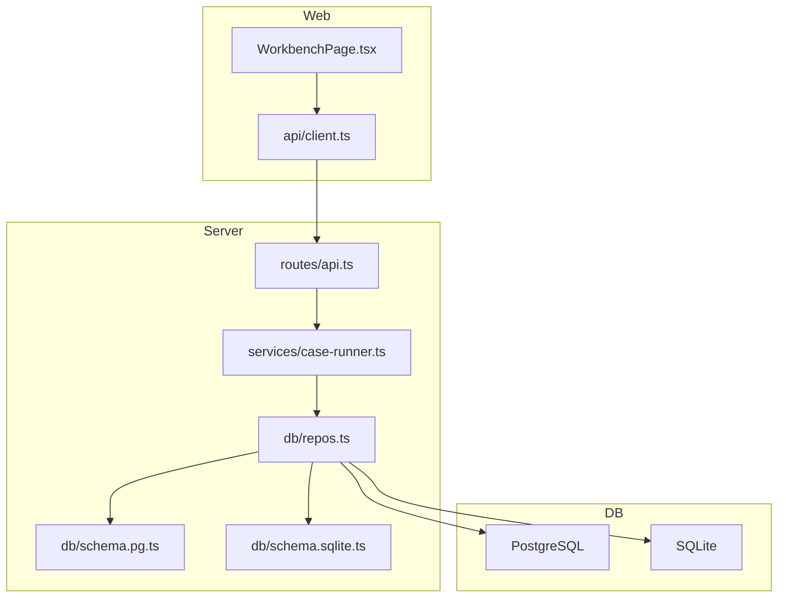
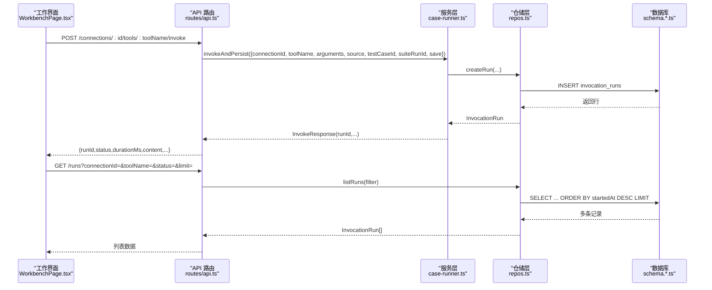
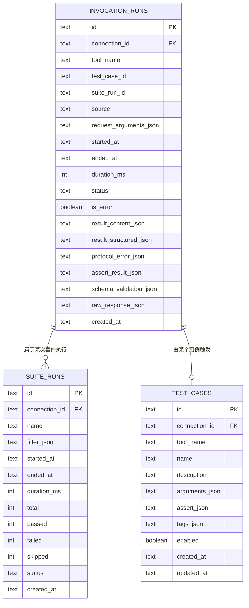
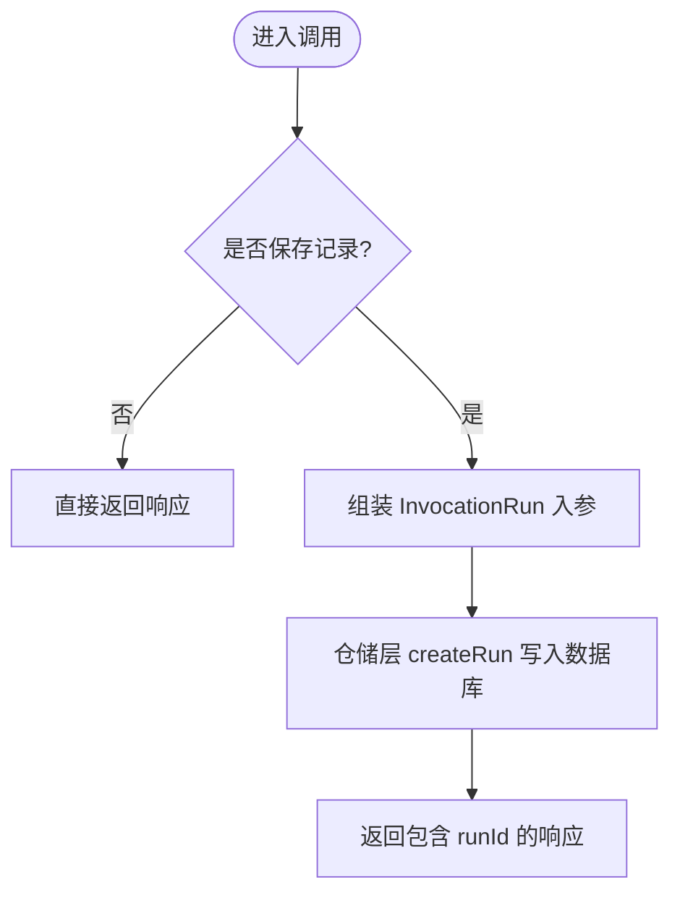
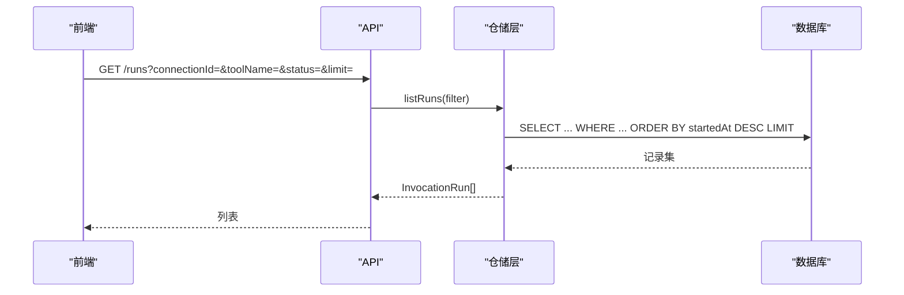
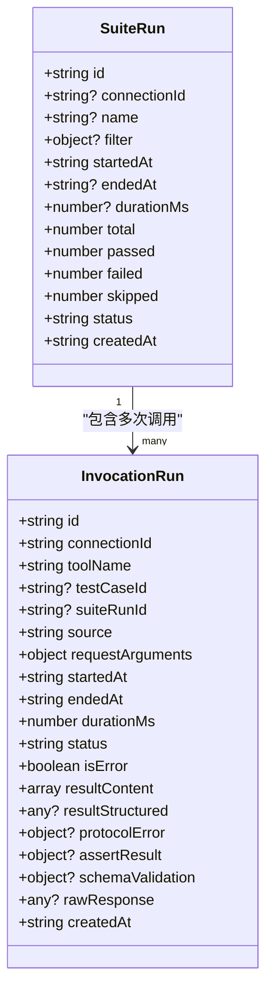
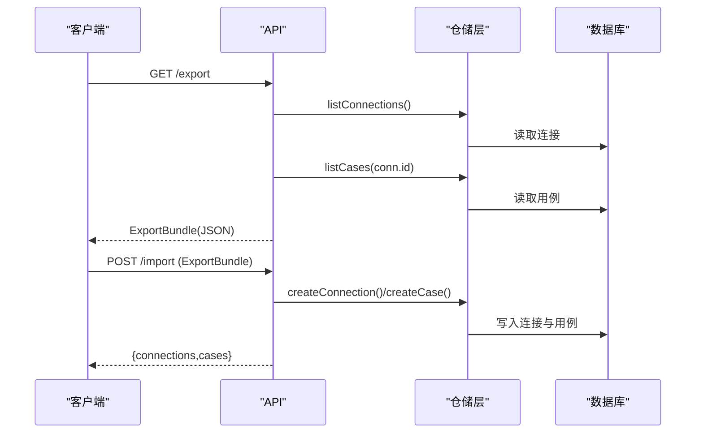
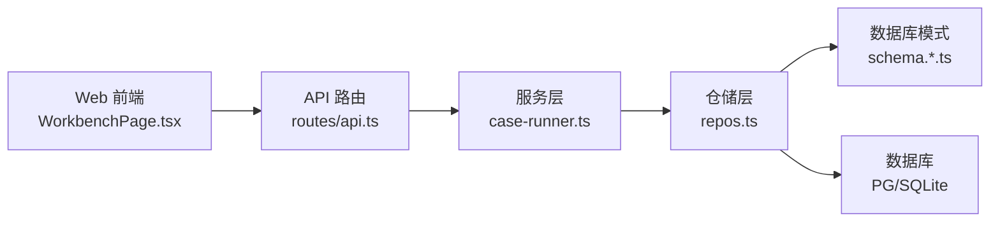

# 历史记录追踪

<cite>
**本文引用的文件**   
- [apps/server/src/db/schema.pg.ts](file://apps/server/src/db/schema.pg.ts)
- [apps/server/src/db/schema.sqlite.ts](file://apps/server/src/db/schema.sqlite.ts)
- [apps/server/src/db/repos.ts](file://apps/server/src/db/repos.ts)
- [apps/server/src/routes/api.ts](file://apps/server/src/routes/api.ts)
- [apps/server/src/services/case-runner.ts](file://apps/server/src/services/case-runner.ts)
- [packages/shared/src/types.ts](file://packages/shared/src/types.ts)
- [apps/web/src/pages/WorkbenchPage.tsx](file://apps/web/src/pages/WorkbenchPage.tsx)
- [apps/web/src/api/client.ts](file://apps/web/src/api/client.ts)
- [deployment/README.md](file://deployment/README.md)
</cite>

## 目录
1. [简介](#简介)
2. [项目结构](#项目结构)
3. [核心组件](#核心组件)
4. [架构总览](#架构总览)
5. [详细组件分析](#详细组件分析)
6. [依赖关系分析](#依赖关系分析)
7. [性能与存储特性](#性能与存储特性)
8. [故障排查指南](#故障排查指南)
9. [结论](#结论)
10. [附录](#附录)

## 简介
本文件围绕 MCP Tool Debug 的“历史记录追踪”能力，系统化说明：
- 调用历史的自动记录机制（单次调用、用例执行、套件执行）
- 数据存储结构与查询接口
- 历史数据的筛选、搜索与排序
- 导出、分享与归档方法
- 数据保留策略、清理机制与存储空间管理
- 关联分析、趋势统计与性能监控思路
- 扩展数据模型与查询功能的方法
- 备份恢复与迁移策略

## 项目结构
与历史记录相关的代码主要分布在以下模块：
- 数据库模式定义：PostgreSQL 与 SQLite 两套 schema
- 仓储层 repos：统一的读写封装、映射与过滤
- 服务层 case-runner：调用持久化、用例与套件执行编排
- API 路由：对外暴露的历史查询、导出导入等接口
- Web 前端：工作台页面中的历史列表展示与操作
- 共享类型：统一的数据模型与请求响应结构
- 部署文档：SQLite 数据卷位置说明

图表来源
- [apps/web/src/pages/WorkbenchPage.tsx:1-541](file://apps/web/src/pages/WorkbenchPage.tsx#L1-L541)
- [apps/web/src/api/client.ts:1-122](file://apps/web/src/api/client.ts#L1-L122)
- [apps/server/src/routes/api.ts:1-277](file://apps/server/src/routes/api.ts#L1-L277)
- [apps/server/src/services/case-runner.ts:1-161](file://apps/server/src/services/case-runner.ts#L1-L161)
- [apps/server/src/db/repos.ts:1-659](file://apps/server/src/db/repos.ts#L1-L659)
- [apps/server/src/db/schema.pg.ts:1-127](file://apps/server/src/db/schema.pg.ts#L1-L127)
- [apps/server/src/db/schema.sqlite.ts:1-120](file://apps/server/src/db/schema.sqlite.ts#L1-L120)

章节来源
- [apps/server/src/db/schema.pg.ts:1-127](file://apps/server/src/db/schema.pg.ts#L1-L127)
- [apps/server/src/db/schema.sqlite.ts:1-120](file://apps/server/src/db/schema.sqlite.ts#L1-L120)
- [apps/server/src/db/repos.ts:1-659](file://apps/server/src/db/repos.ts#L1-L659)
- [apps/server/src/routes/api.ts:1-277](file://apps/server/src/routes/api.ts#L1-L277)
- [apps/server/src/services/case-runner.ts:1-161](file://apps/server/src/services/case-runner.ts#L1-L161)
- [packages/shared/src/types.ts:1-229](file://packages/shared/src/types.ts#L1-L229)
- [apps/web/src/pages/WorkbenchPage.tsx:1-541](file://apps/web/src/pages/WorkbenchPage.tsx#L1-L541)
- [apps/web/src/api/client.ts:1-122](file://apps/web/src/api/client.ts#L1-L122)
- [deployment/README.md:1-32](file://deployment/README.md#L1-L32)

## 核心组件
- 数据模型
  - InvocationRun：单次工具调用的完整记录，包含连接、工具名、用例/套件关联、时间戳、耗时、状态、结果内容、断言与校验结果等。
  - SuiteRun：测试套件执行批次记录，包含过滤条件、总数、通过/失败/跳过计数、状态与时间信息。
  - TestCase：用例定义，用于驱动批量或单条自动化执行。
- 仓储层
  - createRun/listRuns/getRun/deleteRun：对 invocation_runs 表的增删改查。
  - createSuiteRun/updateSuiteRun/getSuiteRun/listSuiteRuns：对 suite_runs 表的管理。
  - listCasesByFilter：按工具名、用例 ID、标签筛选用例集合。
- 服务层
  - invokeAndPersist：调用工具后根据 save 标志写入历史记录。
  - runCase/runSuite：用例与套件执行流程，自动创建并更新套件记录。
- API 层
  - /runs、/suite-runs、/export、/import 等接口提供查询、导出与导入能力。
- 前端
  - WorkbenchPage 中“历史”页签展示最近 N 条记录，支持查看、重用参数、删除等操作。

章节来源
- [packages/shared/src/types.ts:150-186](file://packages/shared/src/types.ts#L150-L186)
- [apps/server/src/db/repos.ts:476-570](file://apps/server/src/db/repos.ts#L476-L570)
- [apps/server/src/db/repos.ts:572-638](file://apps/server/src/db/repos.ts#L572-L638)
- [apps/server/src/services/case-runner.ts:11-77](file://apps/server/src/services/case-runner.ts#L11-L77)
- [apps/server/src/services/case-runner.ts:111-161](file://apps/server/src/services/case-runner.ts#L111-L161)
- [apps/server/src/routes/api.ts:205-240](file://apps/server/src/routes/api.ts#L205-L240)
- [apps/web/src/pages/WorkbenchPage.tsx:329-406](file://apps/web/src/pages/WorkbenchPage.tsx#L329-L406)

## 架构总览
历史记录从“调用入口”到“持久化”再到“查询展示”的端到端流程如下：

图表来源
- [apps/server/src/routes/api.ts:117-138](file://apps/server/src/routes/api.ts#L117-L138)
- [apps/server/src/routes/api.ts:205-214](file://apps/server/src/routes/api.ts#L205-L214)
- [apps/server/src/services/case-runner.ts:11-77](file://apps/server/src/services/case-runner.ts#L11-L77)
- [apps/server/src/db/repos.ts:476-570](file://apps/server/src/db/repos.ts#L476-L570)
- [apps/server/src/db/schema.pg.ts:88-118](file://apps/server/src/db/schema.pg.ts#L88-L118)
- [apps/server/src/db/schema.sqlite.ts:81-111](file://apps/server/src/db/schema.sqlite.ts#L81-L111)

## 详细组件分析

### 数据模型与存储结构
- 单次调用记录（invocation_runs）
  - 关键字段：连接标识、工具名、用例/套件关联、来源（manual/case/suite）、请求参数、开始/结束时间、耗时、状态、错误标记、结果内容、结构化结果、协议错误、断言结果、Schema 校验结果、原始响应、创建时间。
  - 索引：连接+工具名、startedAt、suiteRunId，便于按连接/工具/时间/套件维度检索。
- 套件执行记录（suite_runs）
  - 关键字段：可选的连接标识、名称、过滤条件 JSON、开始/结束时间、耗时、总数、通过/失败/跳过计数、状态、创建时间。
- 用例（test_cases）
  - 关键字段：连接标识、工具名、名称、描述、参数 JSON、断言配置 JSON、标签数组 JSON、启用标志、时间戳。

图表来源
- [apps/server/src/db/schema.pg.ts:70-118](file://apps/server/src/db/schema.pg.ts#L70-L118)
- [apps/server/src/db/schema.sqlite.ts:63-111](file://apps/server/src/db/schema.sqlite.ts#L63-L111)

章节来源
- [packages/shared/src/types.ts:150-186](file://packages/shared/src/types.ts#L150-L186)
- [apps/server/src/db/schema.pg.ts:70-118](file://apps/server/src/db/schema.pg.ts#L70-L118)
- [apps/server/src/db/schema.sqlite.ts:63-111](file://apps/server/src/db/schema.sqlite.ts#L63-L111)

### 自动记录机制
- 触发点
  - 手动调用：通过 /connections/:id/tools/:toolName/invoke 接口，默认 save=true，自动落库。
  - 用例执行：runCase 固定 save=true，source="case"。
  - 套件执行：runSuite 内部并行执行用例，每个用例均保存为一条 invocation_runs，同时维护 suite_runs 汇总。
- 字段填充
  - 时间戳与耗时：由调用方计算并传入。
  - 状态与错误：根据实际调用结果设置。
  - 断言与校验：若存在断言配置，则评估并写入 assertResult；输出 Schema 校验结果写入 schemaValidation。
- 关联关系
  - testCaseId：来自用例执行。
  - suiteRunId：来自套件执行上下文。
  - source：区分 manual/case/suite。

图表来源
- [apps/server/src/services/case-runner.ts:11-77](file://apps/server/src/services/case-runner.ts#L11-L77)
- [apps/server/src/db/repos.ts:476-528](file://apps/server/src/db/repos.ts#L476-L528)

章节来源
- [apps/server/src/services/case-runner.ts:11-77](file://apps/server/src/services/case-runner.ts#L11-L77)
- [apps/server/src/db/repos.ts:476-528](file://apps/server/src/db/repos.ts#L476-L528)

### 查询接口与筛选/搜索/排序
- 查询接口
  - GET /runs：支持 connectionId、toolName、suiteRunId、status、limit 过滤，默认按 startedAt 降序，limit 默认 100。
  - GET /suite-runs：支持 connectionId 过滤，默认按 createdAt 降序，limit 50。
  - GET /suite-runs/:id：返回套件详情及其下最近若干条运行记录。
- 筛选与排序
  - 后端使用 where 条件组合与 desc 排序，索引覆盖 connectionId+toolName、startedAt、suiteRunId。
- 前端展示
  - 工作台“历史”页签默认加载当前连接与工具的最近 50 条记录，支持分页、查看、重用参数、删除。

图表来源
- [apps/server/src/routes/api.ts:205-214](file://apps/server/src/routes/api.ts#L205-L214)
- [apps/server/src/db/repos.ts:530-552](file://apps/server/src/db/repos.ts#L530-L552)
- [apps/web/src/pages/WorkbenchPage.tsx:77-80](file://apps/web/src/pages/WorkbenchPage.tsx#L77-L80)

章节来源
- [apps/server/src/routes/api.ts:193-225](file://apps/server/src/routes/api.ts#L193-L225)
- [apps/server/src/db/repos.ts:530-570](file://apps/server/src/db/repos.ts#L530-L570)
- [apps/web/src/pages/WorkbenchPage.tsx:329-406](file://apps/web/src/pages/WorkbenchPage.tsx#L329-L406)

### 单次调用记录 vs 测试套件执行记录
- 单次调用记录（InvocationRun）
  - 粒度：一次工具调用。
  - 用途：问题定位、结果复现、断言与校验详情。
- 套件执行记录（SuiteRun）
  - 粒度：一批用例的执行批次。
  - 用途：回归质量概览、通过率统计、批次对比。
- 关联方式
  - 每条 InvocationRun 可通过 suiteRunId 归属到某次套件执行。
  - 套件记录聚合 total/passed/failed/skipped 与状态。

图表来源
- [packages/shared/src/types.ts:150-186](file://packages/shared/src/types.ts#L150-L186)
- [apps/server/src/db/schema.pg.ts:70-118](file://apps/server/src/db/schema.pg.ts#L70-L118)
- [apps/server/src/db/schema.sqlite.ts:63-111](file://apps/server/src/db/schema.sqlite.ts#L63-L111)

章节来源
- [packages/shared/src/types.ts:150-186](file://packages/shared/src/types.ts#L150-L186)
- [apps/server/src/db/repos.ts:572-638](file://apps/server/src/db/repos.ts#L572-L638)

### 导出、分享与归档
- 导出
  - GET /export：导出连接与用例元数据（不包含敏感头值与运行时状态），形成 ExportBundle。
- 导入
  - POST /import：接收 ExportBundle，重建连接与用例。
- 分享
  - 将导出的 JSON 文件在团队内共享，或在不同环境间迁移。
- 归档
  - 结合外部对象存储或版本控制系统进行长期归档。

图表来源
- [apps/server/src/routes/api.ts:227-271](file://apps/server/src/routes/api.ts#L227-L271)
- [apps/server/src/db/repos.ts:211-218](file://apps/server/src/db/repos.ts#L211-L218)
- [apps/server/src/db/repos.ts:400-415](file://apps/server/src/db/repos.ts#L400-L415)

章节来源
- [apps/server/src/routes/api.ts:227-271](file://apps/server/src/routes/api.ts#L227-L271)
- [packages/shared/src/types.ts:216-229](file://packages/shared/src/types.ts#L216-L229)

### 数据保留策略、清理机制与存储空间管理
- 现状
  - 未内置基于时间的自动清理策略。
  - 提供 DELETE /runs/:id 接口用于逐条删除。
- 建议策略
  - 按时间窗口裁剪：例如仅保留最近 N 天或 M 万条记录。
  - 按来源分级：手动调用可更短保留期，关键用例与套件记录更长保留期。
  - 定期任务：后台定时任务扫描并删除过期记录。
- 存储空间管理
  - SQLite：数据保存在 Docker volume mcp-tool-debug-data 中，需关注磁盘容量。
  - PostgreSQL：可结合数据库层面的分区表与归档策略。

章节来源
- [apps/server/src/routes/api.ts:222-225](file://apps/server/src/routes/api.ts#L222-L225)
- [deployment/README.md:31-32](file://deployment/README.md#L31-L32)

### 关联分析、趋势统计与性能监控
- 关联分析
  - 通过 suiteRunId 将单次记录与套件批次关联，分析失败集中点。
  - 通过 testCaseId 关联用例，分析特定用例稳定性。
- 趋势统计
  - 按日/周统计成功率、平均耗时、P95/P99 耗时。
  - 按工具维度统计失败率与回归情况。
- 性能监控
  - 利用 durationMs、status、isError 构建看板。
  - 结合告警阈值（如超时、错误率飙升）。

[本节为概念性说明，不直接分析具体文件]

### 扩展数据模型与查询功能
- 扩展方向
  - 新增字段：traceId、env、region、user、priority 等以增强可观测性与治理。
  - 新增索引：按 env、user、priority 等高频过滤维度建立索引。
  - 新增聚合接口：/runs/stats 返回按日/工具/状态的统计摘要。
- 实现要点
  - 在 schema 中增加列，并在 repos 中适配 map 与查询。
  - 在 API 层新增聚合接口，复用现有仓储函数。
  - 在前端增加筛选器与统计面板。

[本节为概念性说明，不直接分析具体文件]

## 依赖关系分析
- 模块耦合
  - API 路由依赖仓储层与服务层；服务层依赖仓储层；仓储层依赖数据库模式。
  - 前端通过 api/client.ts 调用 API。
- 外部依赖
  - Drizzle ORM 用于跨数据库抽象（PostgreSQL/SQLite）。
  - Hono 作为 HTTP 框架。
  - Zod 用于请求校验（在路由中引入但未强制使用）。

图表来源
- [apps/web/src/pages/WorkbenchPage.tsx:1-541](file://apps/web/src/pages/WorkbenchPage.tsx#L1-L541)
- [apps/web/src/api/client.ts:1-122](file://apps/web/src/api/client.ts#L1-L122)
- [apps/server/src/routes/api.ts:1-277](file://apps/server/src/routes/api.ts#L1-L277)
- [apps/server/src/services/case-runner.ts:1-161](file://apps/server/src/services/case-runner.ts#L1-L161)
- [apps/server/src/db/repos.ts:1-659](file://apps/server/src/db/repos.ts#L1-L659)
- [apps/server/src/db/schema.pg.ts:1-127](file://apps/server/src/db/schema.pg.ts#L1-L127)
- [apps/server/src/db/schema.sqlite.ts:1-120](file://apps/server/src/db/schema.sqlite.ts#L1-L120)

章节来源
- [apps/server/src/routes/api.ts:1-277](file://apps/server/src/routes/api.ts#L1-L277)
- [apps/server/src/services/case-runner.ts:1-161](file://apps/server/src/services/case-runner.ts#L1-L161)
- [apps/server/src/db/repos.ts:1-659](file://apps/server/src/db/repos.ts#L1-L659)

## 性能与存储特性
- 查询性能
  - 列表查询默认限制 limit，避免全表扫描。
  - 常用过滤字段已建索引：connectionId+toolName、startedAt、suiteRunId。
- 写入性能
  - 每次调用插入一行，JSON 字段较大时注意体积控制。
- 存储介质
  - SQLite：适合单机与轻量场景，数据位于 Docker volume。
  - PostgreSQL：适合多实例与高并发场景，可配合分区与归档。

章节来源
- [apps/server/src/db/repos.ts:530-552](file://apps/server/src/db/repos.ts#L530-L552)
- [apps/server/src/db/schema.pg.ts:113-118](file://apps/server/src/db/schema.pg.ts#L113-L118)
- [apps/server/src/db/schema.sqlite.ts:106-111](file://apps/server/src/db/schema.sqlite.ts#L106-L111)
- [deployment/README.md:31-32](file://deployment/README.md#L31-L32)

## 故障排查指南
- 常见问题
  - 记录缺失：检查 save 是否为 false；确认 invoke 接口是否成功返回。
  - 查询为空：确认 connectionId/toolName/status 过滤是否正确；检查 limit 是否过小。
  - 套件无记录：确认 runSuite 是否成功创建 suite_runs；检查用例筛选条件。
- 定位手段
  - 使用 /runs/:id 获取单条记录详情。
  - 使用 /suite-runs/:id 查看套件及下属记录。
  - 使用 /export 导出当前配置与用例，验证数据一致性。

章节来源
- [apps/server/src/routes/api.ts:216-225](file://apps/server/src/routes/api.ts#L216-L225)
- [apps/server/src/routes/api.ts:193-203](file://apps/server/src/routes/api.ts#L193-L203)
- [apps/server/src/routes/api.ts:227-240](file://apps/server/src/routes/api.ts#L227-L240)

## 结论
MCP Tool Debug 的历史记录追踪具备完善的自动记录、结构化存储与查询能力，能够支撑单次调用与套件执行的差异化管理。通过导出/导入实现分享与归档，结合索引与限流保障查询性能。未来可在保留策略、聚合统计与可观测性方面进一步增强，以满足更大规模与更高合规要求的使用场景。

## 附录

### API 参考（与历史记录相关）
- 调用与保存
  - POST /connections/:id/tools/:toolName/invoke
- 查询
  - GET /runs
  - GET /runs/:id
  - GET /suite-runs
  - GET /suite-runs/:id
- 管理
  - DELETE /runs/:id
- 导出/导入
  - GET /export
  - POST /import

章节来源
- [apps/server/src/routes/api.ts:117-138](file://apps/server/src/routes/api.ts#L117-L138)
- [apps/server/src/routes/api.ts:205-240](file://apps/server/src/routes/api.ts#L205-L240)
- [apps/server/src/routes/api.ts:222-271](file://apps/server/src/routes/api.ts#L222-L271)