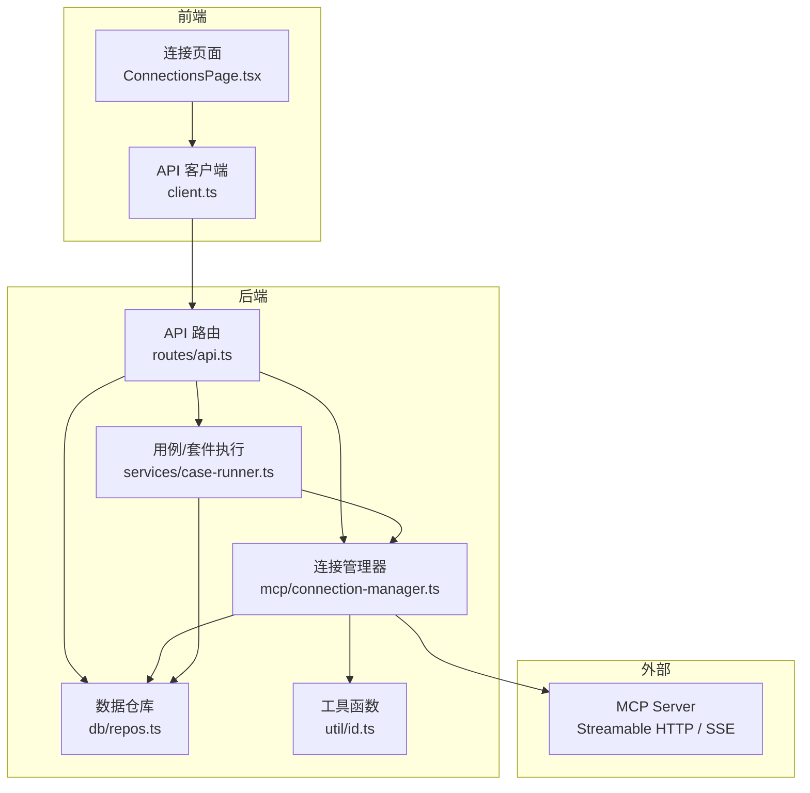
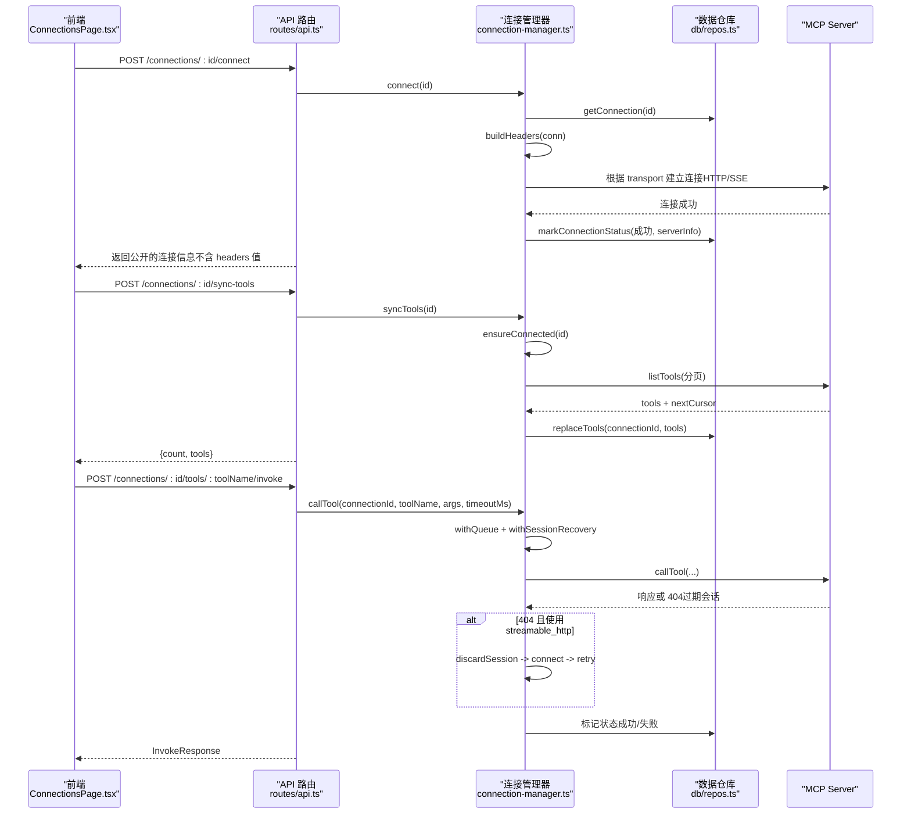
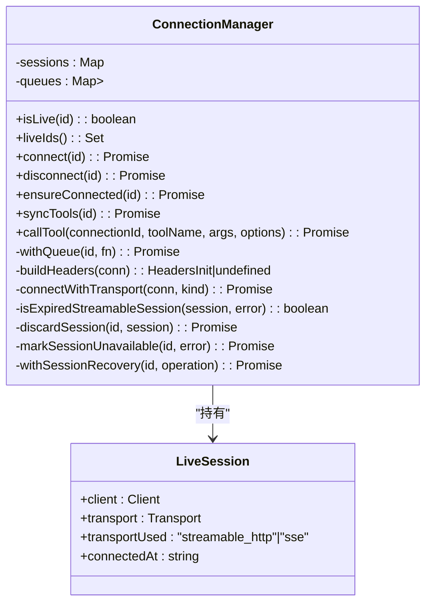
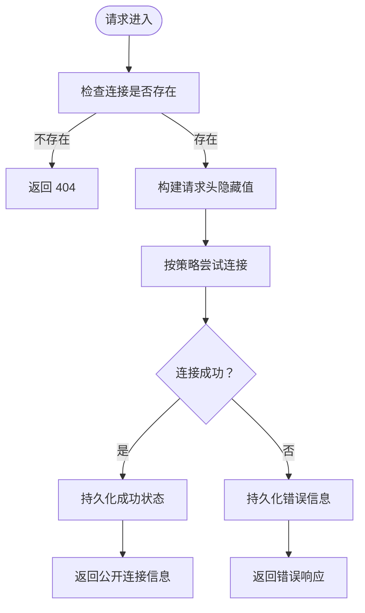
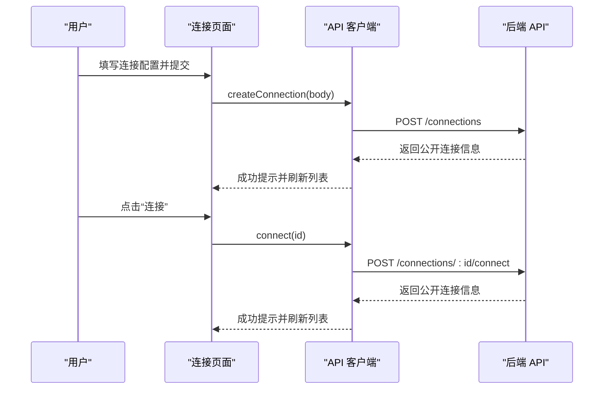
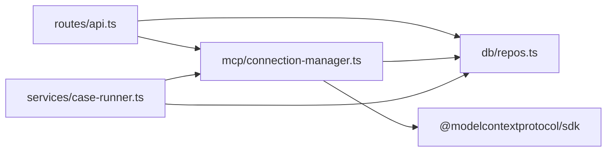

# 多连接管理

<cite>
**本文引用的文件**   
- [connection-manager.ts](file://apps/server/src/mcp/connection-manager.ts)
- [api.ts](file://apps/server/src/routes/api.ts)
- [repos.ts](file://apps/server/src/db/repos.ts)
- [types.ts](file://packages/shared/src/types.ts)
- [client.ts](file://apps/web/src/api/client.ts)
- [ConnectionsPage.tsx](file://apps/web/src/pages/ConnectionsPage.tsx)
- [case-runner.ts](file://apps/server/src/services/case-runner.ts)
- [id.ts](file://apps/server/src/util/id.ts)
- [session-recovery.test.ts](file://scripts/session-recovery.test.ts)
</cite>

## 目录
1. [简介](#简介)
2. [项目结构](#项目结构)
3. [核心组件](#核心组件)
4. [架构总览](#架构总览)
5. [详细组件分析](#详细组件分析)
6. [依赖关系分析](#依赖关系分析)
7. [性能与并发](#性能与并发)
8. [故障排查指南](#故障排查指南)
9. [结论](#结论)
10. [附录：配置示例与安全建议](#附录配置示例与安全建议)

## 简介
本文件聚焦 MCP Tool Debug 的多连接管理能力，覆盖以下主题：
- 多 MCP Server 连接的生命周期管理（创建、连接、断开、状态同步）
- Streamable HTTP 与 SSE 协议的连接建立与自动回退策略
- 自定义请求头配置（Authorization、Cookie、API Key 等）
- 连接超时设置与工具调用超时控制
- 在线状态监控与前端实时状态展示
- 会话恢复机制（Session 404 时重新初始化并安全重试）
- 连接池管理与并发控制
- 错误处理策略与安全注意事项
- 连接状态同步机制与前端实时状态更新实现

## 项目结构
围绕“多连接管理”的关键代码分布在服务端与前端两部分：
- 服务端
  - 连接管理器：封装 MCP SDK 客户端、传输层选择、会话生命周期、超时与恢复
  - API 路由：对外暴露连接、工具同步、工具调用等接口
  - 数据仓库：持久化连接、工具、用例、运行记录等
  - 服务编排：用例执行、套件执行、断言评估
  - 工具函数：ID 生成、时间戳、JSON 序列化
- 前端
  - API 客户端：统一请求封装
  - 连接页面：连接 CRUD、连接/断开、同步 Tools、导出导入、在线状态展示

图表来源
- [api.ts:1-120](file://apps/server/src/routes/api.ts#L1-L120)
- [connection-manager.ts:1-120](file://apps/server/src/mcp/connection-manager.ts#L1-L120)
- [repos.ts:1-120](file://apps/server/src/db/repos.ts#L1-L120)
- [case-runner.ts:1-80](file://apps/server/src/services/case-runner.ts#L1-L80)
- [id.ts:1-23](file://apps/server/src/util/id.ts#L1-L23)
- [client.ts:1-60](file://apps/web/src/api/client.ts#L1-L60)
- [ConnectionsPage.tsx:1-120](file://apps/web/src/pages/ConnectionsPage.tsx#L1-L120)

章节来源
- [api.ts:1-120](file://apps/server/src/routes/api.ts#L1-L120)
- [connection-manager.ts:1-120](file://apps/server/src/mcp/connection-manager.ts#L1-L120)
- [repos.ts:1-120](file://apps/server/src/db/repos.ts#L1-L120)
- [client.ts:1-60](file://apps/web/src/api/client.ts#L1-L60)
- [ConnectionsPage.tsx:1-120](file://apps/web/src/pages/ConnectionsPage.tsx#L1-L120)

## 核心组件
- 连接管理器（ConnectionManager）
  - 维护每个连接的 LiveSession（包含 Client、Transport、协议类型、连接时间）
  - 提供 connect/disconnect/ensureConnected/syncTools/callTool 等方法
  - 内置队列 withQueue 保证同一连接串行化操作
  - 支持 Streamable HTTP 与 SSE 两种传输，按配置或 auto 策略尝试
  - 会话恢复：当检测到 Session 404 时，丢弃旧会话、重建连接并重试一次
  - 超时控制：为 callTool 提供可配置的超时，默认值来自连接配置
  - 状态持久化：连接成功/失败后更新 lastConnectedAt、lastError、serverInfo
- API 路由（Hono）
  - 提供连接 CRUD、连接/断开、同步 Tools、工具调用、导出导入等接口
  - 对外返回的 McpConnection 不包含敏感 headers 值，仅返回 headerNames
- 数据仓库（repos）
  - 负责连接、工具、用例、运行记录的增删改查与映射
  - 将 JSON 字段安全解析/序列化
- 前端连接页面
  - 提供新建连接表单（名称、URL、传输类型、超时、描述、Headers JSON）
  - 支持连接/断开、同步 Tools、进入工作台、删除、导入/导出
  - 显示在线状态、最近连接时间、错误信息
- API 客户端
  - 统一 fetch 封装，错误时抛出带 message 的 Error
- 用例/套件执行
  - 通过 invokeAndPersist 调用连接管理器，并持久化运行结果与断言结果
  - 套件执行支持并行度控制

章节来源
- [connection-manager.ts:1-383](file://apps/server/src/mcp/connection-manager.ts#L1-L383)
- [api.ts:1-277](file://apps/server/src/routes/api.ts#L1-L277)
- [repos.ts:1-660](file://apps/server/src/db/repos.ts#L1-L660)
- [ConnectionsPage.tsx:1-291](file://apps/web/src/pages/ConnectionsPage.tsx#L1-L291)
- [client.ts:1-122](file://apps/web/src/api/client.ts#L1-L122)
- [case-runner.ts:1-161](file://apps/server/src/services/case-runner.ts#L1-L161)

## 架构总览
下图展示了从前端到 MCP Server 的完整链路，包括连接建立、工具同步与调用、状态持久化与会话恢复。

图表来源
- [api.ts:70-138](file://apps/server/src/routes/api.ts#L70-L138)
- [connection-manager.ts:75-268](file://apps/server/src/mcp/connection-manager.ts#L75-L268)
- [repos.ts:288-349](file://apps/server/src/db/repos.ts#L288-L349)

## 详细组件分析

### 连接管理器（ConnectionManager）
- 连接建立与传输选择
  - 根据配置的 transport 决定优先顺序：指定则固定；auto 先尝试 streamable_http，失败再回退 sse
  - 构建 Headers：从连接配置读取 headers，空对象时不附加
  - 使用 MCP SDK 的 StreamableHTTPClientTransport 或 SSEClientTransport 建立连接
- 会话恢复（Session 404）
  - 检测条件：仅对 streamable_http 且错误为 StreamableHTTPError 且 code=404
  - 动作：丢弃旧会话、关闭本地 client、重新 connect、重试原操作一次
  - 若重试仍 404：标记不可用并抛出错误
- 并发与队列
  - withQueue：基于 Promise 链的简单队列，确保同一连接的操作串行执行
- 超时控制
  - callTool 支持 options.timeoutMs，未提供则取连接配置中的 timeoutMs，默认 60000ms
  - 使用 AbortController 与 Promise.race 实现超时中断
- 状态持久化
  - 连接成功：写入 lastConnectedAt、lastError=null、serverInfo
  - 连接失败：写入 lastError 与 lastConnectedAt=null
  - 会话不可用：写入 lastError（含 HTTP 码）
- 工具同步
  - 分页拉取 listTools，合并结果后替换本地存储
- 工具调用
  - 包装 withSessionRecovery，统一处理 404 恢复
  - 计算 durationMs、status、isError、schemaValidation、protocolError 等

图表来源
- [connection-manager.ts:19-383](file://apps/server/src/mcp/connection-manager.ts#L19-L383)

章节来源
- [connection-manager.ts:1-383](file://apps/server/src/mcp/connection-manager.ts#L1-L383)

### API 路由（连接与工具）
- 连接相关
  - GET /connections：列出所有连接，注入 live 标志
  - POST /connections：创建连接（保存 headers 为 JSON）
  - GET /connections/:id：获取单个连接（隐藏 headers 值，仅返回 headerNames）
  - PATCH /connections/:id：更新连接（headers 可部分覆盖）
  - DELETE /connections/:id：删除连接并断开
  - POST /connections/:id/connect：建立连接并返回公开信息
  - POST /connections/:id/disconnect：断开连接
- 工具相关
  - POST /connections/:id/sync-tools：同步工具列表
  - GET /connections/:id/tools：查询工具（支持 q 搜索）
  - GET /connections/:id/tools/:toolName：获取工具详情
  - POST /connections/:id/tools/:toolName/invoke：调用工具并持久化运行记录
- 导出导入
  - GET /export：导出连接与用例（包含 headers）
  - POST /import：批量导入连接与用例

图表来源
- [api.ts:40-138](file://apps/server/src/routes/api.ts#L40-L138)
- [repos.ts:235-312](file://apps/server/src/db/repos.ts#L235-L312)

章节来源
- [api.ts:1-277](file://apps/server/src/routes/api.ts#L1-L277)
- [repos.ts:235-312](file://apps/server/src/db/repos.ts#L235-L312)

### 前端连接页面与 API 客户端
- 连接页面
  - 表单字段：名称、URL、传输类型（auto/streamable_http/sse）、超时(ms)、描述、Headers JSON
  - 操作：连接、断开、同步 Tools、进入工作台、删除、导入/导出
  - 状态展示：在线标签、最近连接时间、错误信息
- API 客户端
  - 统一 request 封装，Content-Type 设置为 application/json
  - 非 2xx 响应抛出 Error，message 取自响应体或 statusText

图表来源
- [ConnectionsPage.tsx:51-147](file://apps/web/src/pages/ConnectionsPage.tsx#L51-L147)
- [client.ts:31-60](file://apps/web/src/api/client.ts#L31-L60)
- [api.ts:46-85](file://apps/server/src/routes/api.ts#L46-L85)

章节来源
- [ConnectionsPage.tsx:1-291](file://apps/web/src/pages/ConnectionsPage.tsx#L1-L291)
- [client.ts:1-122](file://apps/web/src/api/client.ts#L1-L122)

### 用例/套件执行与持久化
- invokeAndPersist
  - 调用 connectionManager.callTool 获取结果
  - 可选断言评估，持久化运行记录（包含内容、结构化结果、断言、校验、原始响应）
- runSuite
  - 根据过滤条件选取用例，创建套件运行记录
  - 使用 mapPool 控制并行度执行用例，统计通过/失败数量

章节来源
- [case-runner.ts:1-161](file://apps/server/src/services/case-runner.ts#L1-L161)

## 依赖关系分析
- 模块耦合
  - API 路由依赖连接管理器与数据仓库
  - 连接管理器依赖数据仓库与 MCP SDK 传输层
  - 用例执行依赖连接管理器与数据仓库
- 外部依赖
  - MCP SDK：@modelcontextprotocol/sdk（Client、StreamableHTTPClientTransport、SSEClientTransport）
  - Hono：HTTP 框架
  - Drizzle ORM：数据库访问
- 潜在循环依赖
  - 当前未发现直接循环依赖；连接管理器与仓库单向依赖

图表来源
- [api.ts:1-120](file://apps/server/src/routes/api.ts#L1-L120)
- [connection-manager.ts:1-60](file://apps/server/src/mcp/connection-manager.ts#L1-L60)
- [repos.ts:1-60](file://apps/server/src/db/repos.ts#L1-L60)
- [case-runner.ts:1-40](file://apps/server/src/services/case-runner.ts#L1-L40)

章节来源
- [api.ts:1-120](file://apps/server/src/routes/api.ts#L1-L120)
- [connection-manager.ts:1-60](file://apps/server/src/mcp/connection-manager.ts#L1-L60)
- [repos.ts:1-60](file://apps/server/src/db/repos.ts#L1-L60)
- [case-runner.ts:1-40](file://apps/server/src/services/case-runner.ts#L1-L40)

## 性能与并发
- 连接级串行化
  - withQueue 保证同一连接的操作串行执行，避免竞态与重复重连
- 套件并行度
  - runSuite 支持 parallel 参数，内部使用 mapPool 控制并发 worker 数
- 超时控制
  - callTool 支持超时中断，避免长时间阻塞
- 工具同步分页
  - 使用 nextCursor 分页拉取，减少单次负载
- 资源释放
  - disconnect 会尝试终止会话并关闭 client，降低资源占用

[本节为通用性能讨论，无需特定文件引用]

## 故障排查指南
- 连接失败
  - 检查 URL、传输类型、Headers 是否正确
  - 查看 lastError 与 lastConnectedAt 判断最近错误
- 会话 404 恢复
  - 系统会自动丢弃旧会话并重建连接重试一次
  - 若再次 404，将标记不可用并返回 protocol_error
- 超时问题
  - 调整连接配置中的 timeoutMs 或调用时的 options.timeoutMs
- 头部泄露防护
  - 公开接口不会返回 headers 值，仅返回 headerNames
  - 导出文件包含完整 headers，请妥善保管

章节来源
- [connection-manager.ts:175-268](file://apps/server/src/mcp/connection-manager.ts#L175-L268)
- [api.ts:24-30](file://apps/server/src/routes/api.ts#L24-L30)
- [session-recovery.test.ts:247-292](file://scripts/session-recovery.test.ts#L247-L292)

## 结论
MCP Tool Debug 的多连接管理以连接管理器为核心，结合 API 路由与数据仓库，实现了：
- 灵活的传输协议支持与自动回退
- 安全的头部配置与公开接口脱敏
- 健壮的会话恢复与错误处理
- 可控的并发与超时策略
- 完善的前端交互与状态展示

该设计在保证可用性的同时兼顾了安全性与可维护性，适合在生产环境中管理多个 MCP Server 连接并进行调试与自动化测试。

[本节为总结性内容，无需特定文件引用]

## 附录：配置示例与安全建议

- 连接配置要点
  - 名称与 URL：必填
  - 传输类型：auto（优先 HTTP，失败回退 SSE）、streamable_http、sse
  - 超时毫秒：默认 60000，可按需调整
  - Headers JSON：支持 Authorization、Cookie、X-API-Key 等
- 安全注意事项
  - 公开接口不返回 headers 值，仅返回 headerNames
  - 导出文件包含完整 headers，应保存到可信位置
  - 建议在网关层进行鉴权与限流
- 典型场景
  - 需要 Bearer Token：在 Headers JSON 中设置 Authorization
  - 需要 Cookie：在 Headers JSON 中设置 Cookie
  - 需要 API Key：在 Headers JSON 中设置 X-API-Key 或其他自定义键

章节来源
- [ConnectionsPage.tsx:253-286](file://apps/web/src/pages/ConnectionsPage.tsx#L253-L286)
- [api.ts:24-30](file://apps/server/src/routes/api.ts#L24-L30)
- [session-recovery.test.ts:247-292](file://scripts/session-recovery.test.ts#L247-L292)