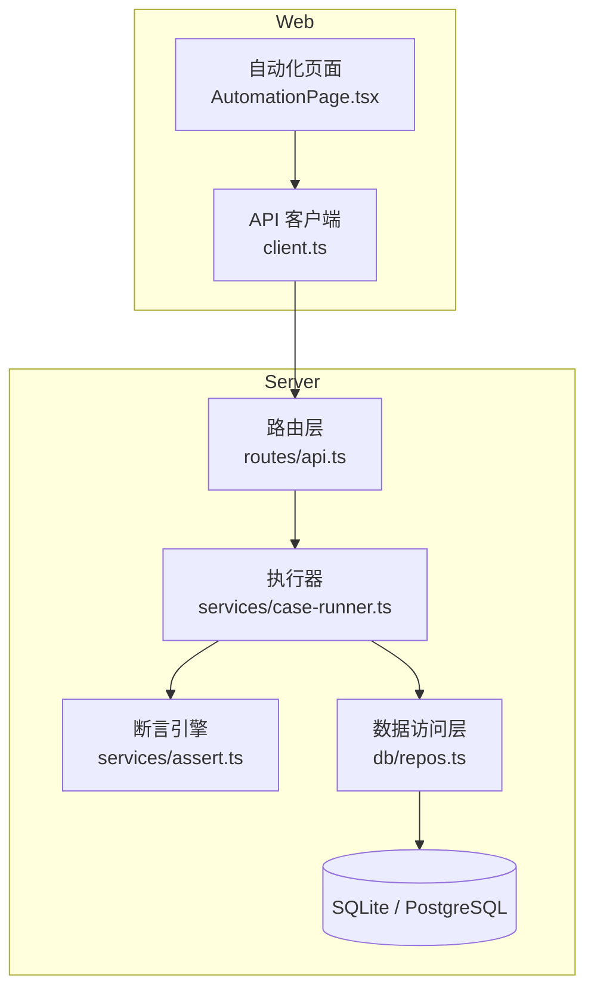
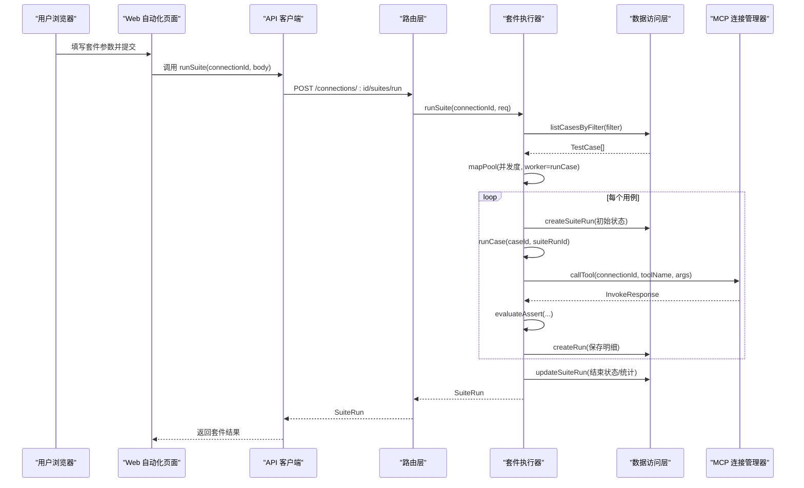
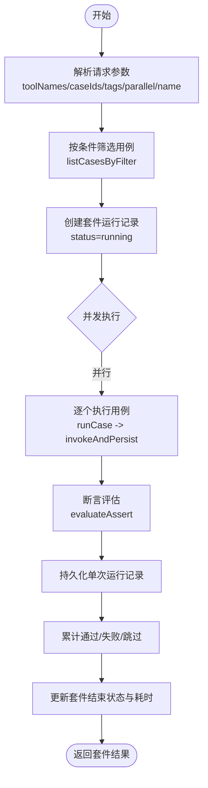
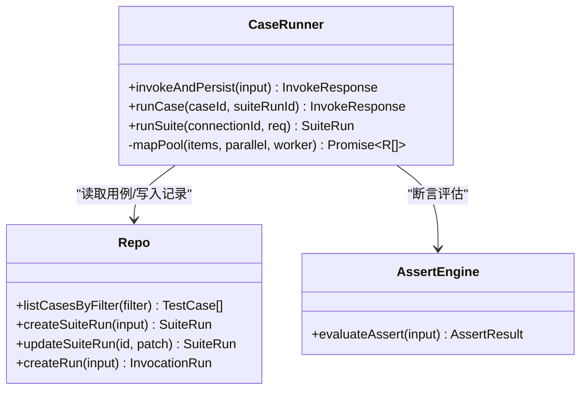
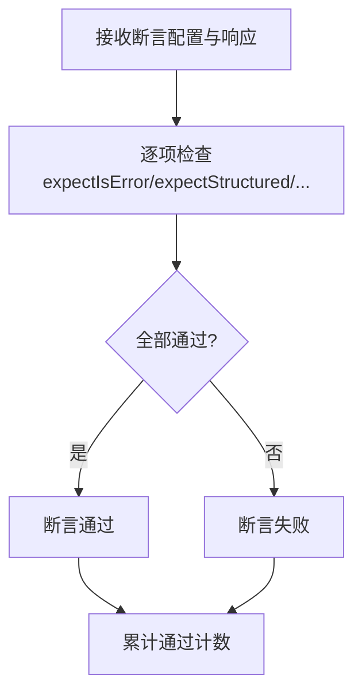
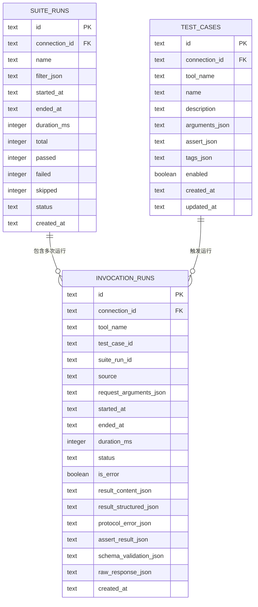
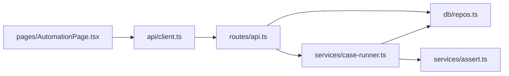

# 批量执行与套件运行

<cite>
**本文引用的文件**   
- [README.md](file://README.md)
- [index.ts](file://apps/server/src/index.ts)
- [api.ts](file://apps/server/src/routes/api.ts)
- [case-runner.ts](file://apps/server/src/services/case-runner.ts)
- [repos.ts](file://apps/server/src/db/repos.ts)
- [types.ts](file://packages/shared/src/types.ts)
- [assert.ts](file://apps/server/src/services/assert.ts)
- [AutomationPage.tsx](file://apps/web/src/pages/AutomationPage.tsx)
- [client.ts](file://apps/web/src/api/client.ts)
- [schema.pg.ts](file://apps/server/src/db/schema.pg.ts)
- [docker-compose.yaml](file://deployment/docker-compose.yaml)
</cite>

## 目录
1. [简介](#简介)
2. [项目结构](#项目结构)
3. [核心组件](#核心组件)
4. [架构总览](#架构总览)
5. [详细组件分析](#详细组件分析)
6. [依赖关系分析](#依赖关系分析)
7. [性能与并发控制](#性能与并发控制)
8. [故障排查指南](#故障排查指南)
9. [结论](#结论)
10. [附录：CI/CD 集成示例](#附录cicd-集成示例)

## 简介
本文件聚焦 MCP Tool Debug 的“批量执行与套件运行”能力，围绕测试套件的创建、配置、执行管理、并行策略、任务调度、资源控制、进度监控、结果聚合与报告、历史追踪、失败重试与异常恢复、性能调优、以及 CI/CD 集成进行系统化说明。读者可据此快速理解并高效使用自动化测试功能，并在生产环境中稳定落地。

## 项目结构
后端采用 Hono 提供 REST API，服务层封装用例与套件执行逻辑，数据访问层基于 Drizzle ORM 抽象 SQLite/PostgreSQL；前端通过 React + Ant Design 提供自动化页面，调用后端 API 完成套件选择、参数配置与结果展示。



图表来源
- [AutomationPage.tsx:1-207](file://apps/web/src/pages/AutomationPage.tsx#L1-L207)
- [client.ts:1-122](file://apps/web/src/api/client.ts#L1-L122)
- [api.ts:1-277](file://apps/server/src/routes/api.ts#L1-L277)
- [case-runner.ts:1-161](file://apps/server/src/services/case-runner.ts#L1-L161)
- [assert.ts:1-166](file://apps/server/src/services/assert.ts#L1-L166)
- [repos.ts:1-660](file://apps/server/src/db/repos.ts#L1-L660)
- [schema.pg.ts:1-127](file://apps/server/src/db/schema.pg.ts#L1-L127)

章节来源
- [README.md:145-156](file://README.md#L145-L156)
- [index.ts:1-39](file://apps/server/src/index.ts#L1-L39)

## 核心组件
- 路由层（REST）：暴露连接、工具、用例、套件运行、历史记录等接口，统一错误处理与鉴权扩展点。
- 执行器（Suite Runner）：按过滤条件选取用例，支持并发度控制，统计通过/失败/跳过，持久化套件与明细记录。
- 断言引擎：对结构化输出、文本内容、耗时、JSONPath 等进行校验，生成断言明细。
- 数据访问层：基于 Drizzle ORM 抽象数据库操作，提供用例筛选、套件与运行记录 CRUD。
- Web 自动化页面：提供套件名、用例多选、标签过滤、并发数输入，展示最近套件运行与明细弹窗。

章节来源
- [api.ts:183-203](file://apps/server/src/routes/api.ts#L183-L203)
- [case-runner.ts:111-161](file://apps/server/src/services/case-runner.ts#L111-L161)
- [assert.ts:58-166](file://apps/server/src/services/assert.ts#L58-L166)
- [repos.ts:640-660](file://apps/server/src/db/repos.ts#L640-L660)
- [AutomationPage.tsx:64-126](file://apps/web/src/pages/AutomationPage.tsx#L64-L126)

## 架构总览
套件执行从 Web 发起请求，经路由转发至执行器，执行器根据过滤条件拉取用例，按并发度调度执行，逐条调用 MCP Tool 并评估断言，最终汇总结果并持久化。



图表来源
- [api.ts:183-191](file://apps/server/src/routes/api.ts#L183-L191)
- [case-runner.ts:111-161](file://apps/server/src/services/case-runner.ts#L111-L161)
- [repos.ts:572-617](file://apps/server/src/db/repos.ts#L572-L617)
- [repos.ts:640-660](file://apps/server/src/db/repos.ts#L640-L660)
- [assert.ts:58-166](file://apps/server/src/services/assert.ts#L58-L166)

## 详细组件分析

### 套件执行流程（API 到执行器）
- 入口：POST /connections/:id/suites/run
- 参数：SuiteRunRequest（包含 toolNames、caseIds、tags、parallel、name）
- 行为：
  - 根据过滤条件获取用例集合
  - 创建套件运行记录（running）
  - 按 parallel 并发执行用例
  - 统计 passed/failed/skipped 并更新套件状态
- 返回：SuiteRun（含 total/passed/failed/skipped/status/durationMs）



图表来源
- [api.ts:183-191](file://apps/server/src/routes/api.ts#L183-L191)
- [case-runner.ts:111-161](file://apps/server/src/services/case-runner.ts#L111-L161)
- [repos.ts:572-617](file://apps/server/src/db/repos.ts#L572-L617)
- [repos.ts:640-660](file://apps/server/src/db/repos.ts#L640-L660)

章节来源
- [api.ts:183-203](file://apps/server/src/routes/api.ts#L183-L203)
- [case-runner.ts:111-161](file://apps/server/src/services/case-runner.ts#L111-L161)

### 并发执行与任务调度
- 并发模型：内部实现固定数量 worker 的 mapPool，按顺序分配任务给空闲 worker，保证并发度可控且结果有序。
- 调度算法：索引递增分配，Promise.all 等待所有 worker 完成。
- 资源控制：parallel 参数限制最大并发；未设置时默认 1。
- 容错：单个用例异常被捕获计入失败，不影响其他用例继续执行。



图表来源
- [case-runner.ts:94-161](file://apps/server/src/services/case-runner.ts#L94-L161)
- [repos.ts:572-617](file://apps/server/src/db/repos.ts#L572-L617)
- [repos.ts:640-660](file://apps/server/src/db/repos.ts#L640-L660)
- [assert.ts:58-166](file://apps/server/src/services/assert.ts#L58-L166)

章节来源
- [case-runner.ts:94-161](file://apps/server/src/services/case-runner.ts#L94-L161)

### 断言与结果判定
- 断言类型：
  - expectIsError：期望是否为错误
  - expectStructured：是否期望存在结构化输出
  - structuredEquals：部分匹配结构化输出
  - structuredSchemaValid：输出 Schema 校验通过
  - contentTextContains/NotContains：文本包含/不包含
  - maxDurationMs：最大耗时阈值
  - jsonPathEquals：JSONPath 值相等
- 判定规则：所有检查项均通过则断言通过；否则失败。
- 结果聚合：套件级别以断言通过或成功状态作为通过标准，统计通过/失败/跳过。



图表来源
- [assert.ts:58-166](file://apps/server/src/services/assert.ts#L58-L166)
- [case-runner.ts:134-146](file://apps/server/src/services/case-runner.ts#L134-L146)

章节来源
- [assert.ts:58-166](file://apps/server/src/services/assert.ts#L58-L166)
- [case-runner.ts:134-146](file://apps/server/src/services/case-runner.ts#L134-L146)

### 数据模型与持久化
- 套件运行记录：suite_runs（名称、过滤条件、开始/结束时间、耗时、总数/通过/失败/跳过、状态）
- 单次运行记录：invocation_runs（连接/工具/用例/套件关联、请求参数、起止时间、耗时、状态、错误信息、断言结果、Schema 校验、原始响应）
- 用例筛选：按 connectionId、toolNames、caseIds、tags 过滤，仅启用用例参与执行



图表来源
- [schema.pg.ts:70-118](file://apps/server/src/db/schema.pg.ts#L70-L118)
- [repos.ts:572-617](file://apps/server/src/db/repos.ts#L572-L617)
- [repos.ts:476-570](file://apps/server/src/db/repos.ts#L476-L570)
- [repos.ts:400-474](file://apps/server/src/db/repos.ts#L400-L474)

章节来源
- [schema.pg.ts:70-118](file://apps/server/src/db/schema.pg.ts#L70-L118)
- [repos.ts:572-617](file://apps/server/src/db/repos.ts#L572-L617)
- [repos.ts:476-570](file://apps/server/src/db/repos.ts#L476-L570)
- [repos.ts:400-474](file://apps/server/src/db/repos.ts#L400-L474)

### Web 自动化页面交互
- 表单字段：连接、套件名、用例多选、Tags、并发数
- 执行按钮：提交后调用 runSuite，成功后刷新套件列表
- 结果查看：点击“明细”弹出 Modal，展示套件状态、通过/失败统计与每次运行的 Tool/状态/耗时/断言结果

章节来源
- [AutomationPage.tsx:64-126](file://apps/web/src/pages/AutomationPage.tsx#L64-L126)
- [AutomationPage.tsx:175-207](file://apps/web/src/pages/AutomationPage.tsx#L175-L207)
- [client.ts:88-98](file://apps/web/src/api/client.ts#L88-L98)

## 依赖关系分析
- 路由层依赖：
  - 数据访问层 repos.ts（CRUD、筛选）
  - 执行器 case-runner.ts（runSuite/runCase/invokeAndPersist）
  - MCP 连接管理器（通过 case-runner 间接调用）
- 执行器依赖：
  - repos.ts（用例筛选、套件与运行记录）
  - assert.ts（断言评估）
- Web 依赖：
  - client.ts（HTTP 封装）
  - AutomationPage.tsx（UI 交互）



图表来源
- [api.ts:1-277](file://apps/server/src/routes/api.ts#L1-L277)
- [case-runner.ts:1-161](file://apps/server/src/services/case-runner.ts#L1-L161)
- [repos.ts:1-660](file://apps/server/src/db/repos.ts#L1-L660)
- [assert.ts:1-166](file://apps/server/src/services/assert.ts#L1-L166)
- [AutomationPage.tsx:1-207](file://apps/web/src/pages/AutomationPage.tsx#L1-L207)
- [client.ts:1-122](file://apps/web/src/api/client.ts#L1-L122)

章节来源
- [api.ts:1-277](file://apps/server/src/routes/api.ts#L1-L277)
- [case-runner.ts:1-161](file://apps/server/src/services/case-runner.ts#L1-L161)
- [repos.ts:1-660](file://apps/server/src/db/repos.ts#L1-L660)
- [assert.ts:1-166](file://apps/server/src/services/assert.ts#L1-L166)
- [AutomationPage.tsx:1-207](file://apps/web/src/pages/AutomationPage.tsx#L1-L207)
- [client.ts:1-122](file://apps/web/src/api/client.ts#L1-L122)

## 性能与并发控制
- 并发度控制：
  - parallel 参数决定并发 worker 数量，默认 1
  - mapPool 使用固定线程池式调度，避免无界并发导致资源耗尽
- 任务粒度：
  - 每个用例为独立任务，失败不中断整体套件
- 数据库优化：
  - 针对常用查询建立索引（如 invocation_runs.startedAt、suiteRunId、connectionId/toolName）
- 内存与序列化：
  - 大量 JSON 序列化/反序列化在 repos.ts 中进行，建议关注大对象体积与超时配置
- 超时与重试：
  - 当前套件执行未内置全局超时与自动重试，可在外部编排层（如 CI）增加超时与重试策略

章节来源
- [case-runner.ts:94-109](file://apps/server/src/services/case-runner.ts#L94-L109)
- [schema.pg.ts:113-118](file://apps/server/src/db/schema.pg.ts#L113-L118)
- [repos.ts:530-552](file://apps/server/src/db/repos.ts#L530-L552)

## 故障排查指南
- 常见问题定位：
  - 套件未找到：检查 connectionId 与用例筛选条件
  - 用例不存在：确认用例已启用且未被删除
  - 断言失败：查看断言明细（checks），定位具体检查项
  - 网络/协议错误：查看 invocation_runs.protocolError 与 status
- 日志与记录：
  - 使用 GET /suite-runs 与 GET /suite-runs/:id 获取套件与明细
  - 使用 GET /runs 按连接/工具/套件/状态筛选历史
- 错误处理：
  - 路由层统一 bad() 返回错误消息
  - 执行器捕获异常计入失败，不中断其余用例

章节来源
- [api.ts:20-22](file://apps/server/src/routes/api.ts#L20-L22)
- [api.ts:193-225](file://apps/server/src/routes/api.ts#L193-L225)
- [case-runner.ts:134-146](file://apps/server/src/services/case-runner.ts#L134-L146)

## 结论
MCP Tool Debug 的套件运行提供了开箱即用的批量执行能力，具备明确的并发控制、断言体系与完整的历史记录。通过合理的并发度与筛选条件，可以在本地与团队环境中稳定回归验证 MCP Tools 的行为与兼容性。结合 Docker Compose 部署与后续 CI/CD 集成，可实现持续的质量保障。

## 附录：CI/CD 集成示例
以下示例展示如何在 GitHub Actions 中安装依赖、启动服务、执行一次套件并收集结果。可根据实际环境调整端口与环境变量。

```yaml
name: MCP 套件回归
on:
  push:
    branches: [main]
  pull_request:
    branches: [main]

jobs:
  regression:
    runs-on: ubuntu-latest
    steps:
      - uses: actions/checkout@v4

      - name: 安装依赖
        run: npm install

      - name: 构建与启动
        run: |
          npm run build:server
          npm run build:web
          # 后台启动 API（默认端口 8787）
          node apps/server/dist/index.js &
          sleep 5

      - name: 执行套件
        run: |
          curl -s -X POST http://localhost:8787/api/connections/${{ secrets.CONNECTION_ID }}/suites/run \
            -H 'Content-Type: application/json' \
            -d '{
              "name": "ci-run-${{ github.run_number }}",
              "tags": ["regression"],
              "parallel": 2
            }' > suite-result.json

      - name: 上传结果
        uses: actions/upload-artifact@v4
        with:
          name: suite-result
          path: suite-result.json
```

说明
- 需要预先在仓库 Secrets 中配置 CONNECTION_ID
- 可通过 GET /suite-runs 与 GET /suite-runs/:id 进一步采集详情
- 建议在反向代理层开启 HTTPS、认证与限流

章节来源
- [docker-compose.yaml:1-39](file://deployment/docker-compose.yaml#L1-L39)
- [api.ts:183-203](file://apps/server/src/routes/api.ts#L183-L203)