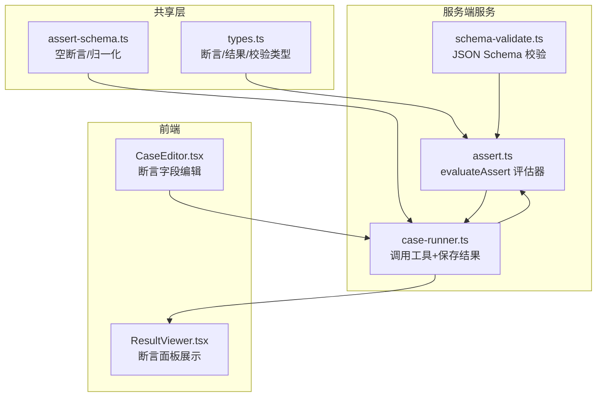
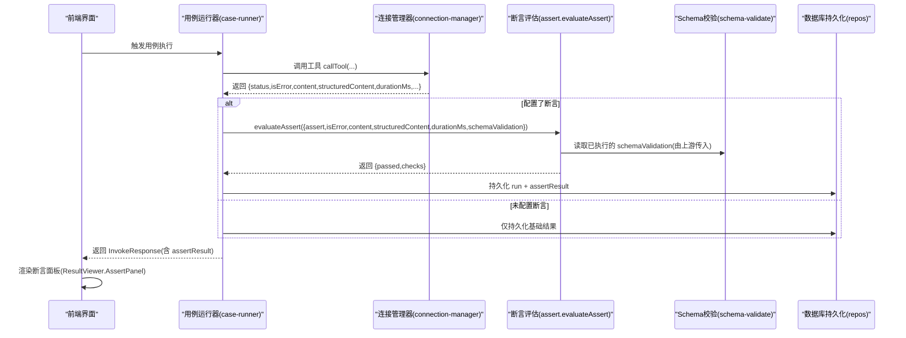
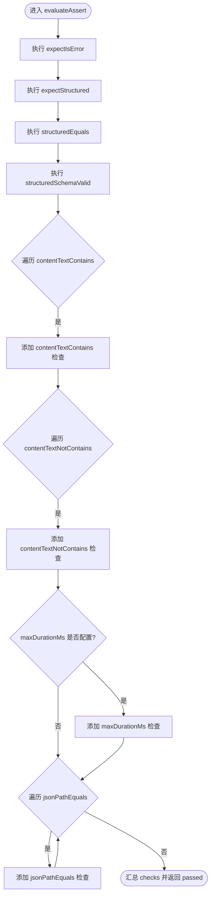

# 断言引擎

<cite>
**本文引用的文件**   
- [apps/server/src/services/assert.ts](file://apps/server/src/services/assert.ts)
- [packages/shared/src/types.ts](file://packages/shared/src/types.ts)
- [packages/shared/src/assert-schema.ts](file://packages/shared/src/assert-schema.ts)
- [apps/server/src/services/case-runner.ts](file://apps/server/src/services/case-runner.ts)
- [apps/server/src/services/schema-validate.ts](file://apps/server/src/services/schema-validate.ts)
- [apps/web/src/components/ResultViewer.tsx](file://apps/web/src/components/ResultViewer.tsx)
- [apps/web/src/components/CaseEditor.tsx](file://apps/web/src/components/CaseEditor.tsx)
</cite>

## 目录
1. [简介](#简介)
2. [项目结构](#项目结构)
3. [核心组件](#核心组件)
4. [架构总览](#架构总览)
5. [详细组件分析](#详细组件分析)
6. [依赖关系分析](#依赖关系分析)
7. [性能与批量执行](#性能与批量执行)
8. [故障排查指南](#故障排查指南)
9. [结论](#结论)
10. [附录：配置语法与表达式规范](#附录配置语法与表达式规范)

## 简介
本文件面向 MCP Tool Debug 的“断言引擎”，系统性说明其支持的断言类型、评估逻辑、优先级与短路机制、配置语法、表达式编写方式，以及组合使用、条件断言策略和失败诊断信息。同时给出性能优化建议与批量执行策略，帮助读者快速掌握并高效使用断言能力。

## 项目结构
断言引擎由共享类型定义、断言归一化、断言评估器、Schema 校验器、用例运行器与前端展示组件共同组成。整体职责划分如下：
- 共享类型与工具：定义断言配置、结果、Schema 校验结果等数据结构，并提供断言配置的默认值与规范化方法。
- 断言评估器：根据输入（错误状态、结构化输出、非结构化内容、耗时、Schema 校验结果）逐项执行断言，产出检查清单与总体通过状态。
- Schema 校验器：基于 JSON Schema 对 structuredContent 进行验证，返回详细的错误路径与消息。
- 用例运行器：调用工具后，将断言评估结果持久化，并在套件执行中统计通过/失败。
- 前端展示：在结果查看器中呈现断言明细；在编辑器中提供断言字段编辑入口。



图表来源
- [packages/shared/src/types.ts:1-229](file://packages/shared/src/types.ts#L1-L229)
- [packages/shared/src/assert-schema.ts:1-32](file://packages/shared/src/assert-schema.ts#L1-L32)
- [apps/server/src/services/schema-validate.ts:1-61](file://apps/server/src/services/schema-validate.ts#L1-L61)
- [apps/server/src/services/case-runner.ts:1-161](file://apps/server/src/services/case-runner.ts#L1-L161)
- [apps/server/src/services/assert.ts:1-166](file://apps/server/src/services/assert.ts#L1-L166)
- [apps/web/src/components/ResultViewer.tsx:1-390](file://apps/web/src/components/ResultViewer.tsx#L1-L390)
- [apps/web/src/components/CaseEditor.tsx:1-168](file://apps/web/src/components/CaseEditor.tsx#L1-L168)

章节来源
- [packages/shared/src/types.ts:1-229](file://packages/shared/src/types.ts#L1-L229)
- [packages/shared/src/assert-schema.ts:1-32](file://packages/shared/src/assert-schema.ts#L1-L32)
- [apps/server/src/services/assert.ts:1-166](file://apps/server/src/services/assert.ts#L1-L166)
- [apps/server/src/services/schema-validate.ts:1-61](file://apps/server/src/services/schema-validate.ts#L1-L61)
- [apps/server/src/services/case-runner.ts:1-161](file://apps/server/src/services/case-runner.ts#L1-L161)
- [apps/web/src/components/ResultViewer.tsx:1-390](file://apps/web/src/components/ResultViewer.tsx#L1-L390)
- [apps/web/src/components/CaseEditor.tsx:1-168](file://apps/web/src/components/CaseEditor.tsx#L1-L168)

## 核心组件
- 断言配置类型 AssertConfig：声明所有支持的断言项，包括错误状态、结构化存在性、部分匹配、Schema 校验、文本包含/排除、耗时上限、JSONPath 精确匹配等。
- 断言结果类型 AssertResult：包含总体通过标志 checks 列表，每个 check 包含名称、是否通过、期望值、实际值与可选消息。
- 断言评估函数 evaluateAssert：按顺序执行各项断言，收集检查结果，最终汇总为 passed 与 checks。
- Schema 校验 validateAgainstSchema：基于 JSON Schema 校验 structuredContent，返回 ok 与 errors。
- 断言归一化 normalizeAssert：为缺失字段提供默认值，确保断言配置稳定可用。
- 用例运行 invokeAndPersist：调用工具后，若配置了断言则执行评估，并将断言结果持久化。
- 前端 ResultViewer.AssertPanel：以标签形式展示每条断言的名称与通过/失败状态及消息。
- 前端 CaseEditor：提供断言字段的可视化编辑入口。

章节来源
- [packages/shared/src/types.ts:14-46](file://packages/shared/src/types.ts#L14-L46)
- [packages/shared/src/assert-schema.ts:11-31](file://packages/shared/src/assert-schema.ts#L11-L31)
- [apps/server/src/services/assert.ts:58-165](file://apps/server/src/services/assert.ts#L58-L165)
- [apps/server/src/services/schema-validate.ts:27-60](file://apps/server/src/services/schema-validate.ts#L27-L60)
- [apps/server/src/services/case-runner.ts:11-77](file://apps/server/src/services/case-runner.ts#L11-L77)
- [apps/web/src/components/ResultViewer.tsx:196-213](file://apps/web/src/components/ResultViewer.tsx#L196-L213)
- [apps/web/src/components/CaseEditor.tsx:79-164](file://apps/web/src/components/CaseEditor.tsx#L79-L164)

## 架构总览
断言引擎的执行流程从用例运行开始，到断言评估结束，最后在前端展示。



图表来源
- [apps/server/src/services/case-runner.ts:11-77](file://apps/server/src/services/case-runner.ts#L11-L77)
- [apps/server/src/services/assert.ts:58-165](file://apps/server/src/services/assert.ts#L58-L165)
- [apps/server/src/services/schema-validate.ts:27-60](file://apps/server/src/services/schema-validate.ts#L27-L60)
- [apps/web/src/components/ResultViewer.tsx:196-213](file://apps/web/src/components/ResultViewer.tsx#L196-L213)

## 详细组件分析

### 断言类型与语义
- expectIsError（错误状态断言）
  - 语义：断言 isError 是否与期望一致。
  - 行为：当配置 expectIsError 时，比较 input.isError 与期望布尔值，生成一条名为 expectIsError 的检查。
  - 适用场景：期望工具抛出错误或正常返回。
- expectStructured（结构化输出断言）
  - 语义：断言是否存在非空 structuredContent。
  - 行为：判断 structuredContent 是否为 undefined/null，与期望布尔值对比，生成名为 expectStructured 的检查。
  - 适用场景：要求工具返回结构化数据。
- structuredEquals（精确匹配断言）
  - 语义：断言 structuredContent 是否“部分匹配”期望对象。
  - 行为：实现类 isMatch 的部分深比较，仅要求 source 中的键值在 object 中存在且递归匹配；数组元素按索引对应匹配。
  - 注意：并非全量相等，而是“包含式”匹配。
- structuredSchemaValid（Schema 验证断言）
  - 语义：断言 structuredContent 是否符合工具声明的 outputSchema。
  - 行为：读取上游传入的 schemaValidation.ok，生成名为 structuredSchemaValid 的检查。
  - 前置：需在上游执行 JSON Schema 校验并传入结果。
- contentTextContains / contentTextNotContains（文本包含/排除断言）
  - 语义：断言拼接后的 text 内容是否包含/不包含指定子串。
  - 行为：过滤 type="text" 的 ContentItem，拼接为字符串后进行 includes 判断；失败消息会截断前 500 字符便于定位。
- maxDurationMs（耗时限制断言）
  - 语义：断言 durationMs 不超过阈值。
  - 行为：当配置为数字时，比较 input.durationMs 与阈值，生成名为 maxDurationMs 的检查。
- jsonPathEquals（JSONPath 表达式断言）
  - 语义：断言 structuredContent 中某路径的值与期望值相等。
  - 行为：解析 path（支持 $.a.b、$a.b、a.b 等），提取对应值，使用 JSON.stringify 做严格相等比较。

章节来源
- [apps/server/src/services/assert.ts:69-159](file://apps/server/src/services/assert.ts#L69-L159)
- [packages/shared/src/types.ts:14-28](file://packages/shared/src/types.ts#L14-L28)

### 断言评估逻辑与短路机制
- 评估顺序
  - 依次执行：expectIsError → expectStructured → structuredEquals → structuredSchemaValid → contentTextContains → contentTextNotContains → maxDurationMs → jsonPathEquals。
- 短路机制
  - 当前实现不采用短路：即使前面检查失败，仍会继续执行后续检查，以便一次性收集全部失败原因。
  - 最终 passed 为 checks.every(c => c.passed)，即只要有一条失败即为失败。
- 诊断信息
  - 每条检查均包含 name、passed、expected、actual、message。
  - 前端以标签与列表形式展示，便于快速定位失败点。



图表来源
- [apps/server/src/services/assert.ts:69-159](file://apps/server/src/services/assert.ts#L69-L159)

章节来源
- [apps/server/src/services/assert.ts:65-165](file://apps/server/src/services/assert.ts#L65-L165)

### 断言配置语法与归一化
- 配置来源
  - 用例配置中的 assert 字段类型为 AssertConfig。
  - 创建/更新用例时，断言会被 normalizeAssert 归一化后再持久化。
- 归一化规则
  - 缺失字段将被填充默认值：如 contentTextContains/contentTextNotContains/jsonPathEquals 默认为空数组；maxDurationMs 若非数字则忽略；expectIsError/expectStructured/structuredSchemaValid 保持原值或 undefined。
  - 空输入或非对象输入将返回一个“最小断言”基线配置。
- 前端编辑
  - CaseEditor 提供各断言字段的可视化编辑入口，包括开关、数值输入、逗号分隔文本与 JSON 编辑器。

章节来源
- [packages/shared/src/assert-schema.ts:11-31](file://packages/shared/src/assert-schema.ts#L11-L31)
- [apps/web/src/components/CaseEditor.tsx:79-164](file://apps/web/src/components/CaseEditor.tsx#L79-L164)

### 表达式编写与路径解析
- JSONPath 表达式
  - 支持形如 $.a.b、$a.b、a.b 的路径写法。
  - 支持数组索引访问，例如 a[0]、b[1].c。
  - 内部解析步骤：
    - 去除前导 $ 或 $.
    - 按 . 分割段，每段再解析 key 与可选的 [index]。
    - 逐级取值，遇到非对象/非数组或越界则返回 undefined。
- 匹配策略
  - jsonPathEquals 使用 JSON.stringify 进行严格相等比较，适合精确值断言。
  - structuredEquals 使用 isMatch 进行“部分深匹配”，适合只关心关键结构的场景。

章节来源
- [apps/server/src/services/assert.ts:33-56](file://apps/server/src/services/assert.ts#L33-L56)
- [apps/server/src/services/assert.ts:92-101](file://apps/server/src/services/assert.ts#L92-L101)
- [apps/server/src/services/assert.ts:149-159](file://apps/server/src/services/assert.ts#L149-L159)

### 断言组合使用与条件断言
- 组合使用
  - 可同时启用多项断言，例如既要求结构化输出又要求文本包含关键字，还限制最大耗时。
  - 失败时，前端会列出所有失败的检查项及其消息，便于综合定位问题。
- 条件断言
  - 当前实现不支持运行时条件分支（如“仅在 isError=true 时执行某些断言”）。
  - 可通过多套用例拆分不同条件分支，或在业务侧预处理结构化数据后再断言。

章节来源
- [apps/web/src/components/ResultViewer.tsx:196-213](file://apps/web/src/components/ResultViewer.tsx#L196-L213)
- [apps/server/src/services/assert.ts:65-165](file://apps/server/src/services/assert.ts#L65-L165)

### 断言失败时的诊断信息
- 断言检查项
  - 每条检查包含 name、passed、expected、actual、message。
  - 前端以 Tag 显示通过/失败，并附带 message 或默认提示。
- Schema 校验失败
  - 当 structuredSchemaValid 为 true 时，会依据 schemaValidation.ok 判定。
  - 失败时，errors 中包含 path 与 message，用于定位具体字段与错误原因。
- 文本断言失败
  - contentTextContains/NotContains 失败时会提示缺失或不应包含的子串，并附带前 500 字符的实际文本片段。

章节来源
- [apps/web/src/components/ResultViewer.tsx:196-213](file://apps/web/src/components/ResultViewer.tsx#L196-L213)
- [apps/server/src/services/assert.ts:114-134](file://apps/server/src/services/assert.ts#L114-L134)
- [apps/server/src/services/schema-validate.ts:27-60](file://apps/server/src/services/schema-validate.ts#L27-L60)

### 自定义断言器开发
- 扩展思路
  - 在 evaluateAssert 中新增断言分支，遵循现有模式：构造检查项并 push 到 checks 数组。
  - 在 AssertConfig 中添加新字段，并在 normalizeAssert 中补充默认值处理。
  - 在前端 CaseEditor 中增加对应控件，并在 ResultViewer.AssertPanel 中自动展示。
- 注意事项
  - 保持检查项结构一致（name、passed、expected、actual、message）。
  - 避免阻塞主流程的昂贵计算，必要时可异步预计算或缓存。
  - 对于复杂表达式，建议引入独立的解析/求值模块，保持 evaluateAssert 简洁。

章节来源
- [packages/shared/src/types.ts:19-28](file://packages/shared/src/types.ts#L19-L28)
- [packages/shared/src/assert-schema.ts:11-31](file://packages/shared/src/assert-schema.ts#L11-L31)
- [apps/server/src/services/assert.ts:58-165](file://apps/server/src/services/assert.ts#L58-L165)
- [apps/web/src/components/CaseEditor.tsx:79-164](file://apps/web/src/components/CaseEditor.tsx#L79-L164)
- [apps/web/src/components/ResultViewer.tsx:196-213](file://apps/web/src/components/ResultViewer.tsx#L196-L213)

## 依赖关系分析
- 类型与工具
  - types.ts 定义了断言配置、结果、Schema 校验结果等核心类型。
  - assert-schema.ts 提供 emptyAssert 与 normalizeAssert，保证断言配置一致性。
- 服务层
  - schema-validate.ts 封装 AJV 2020 校验，统一错误格式。
  - case-runner.ts 负责调用工具、执行断言、持久化结果与套件统计。
  - assert.ts 实现 evaluateAssert 与各断言逻辑。
- 前端
  - ResultViewer.tsx 展示断言面板与 Schema 校验结果。
  - CaseEditor.tsx 提供断言字段编辑。

```mermaid
classDiagram
class AssertConfig {
+boolean? expectIsError
+boolean? expectStructured
+Record~string,unknown~? structuredEquals
+boolean? structuredSchemaValid
+string[]? contentTextContains
+string[]? contentTextNotContains
+number? maxDurationMs
+JsonPathEquals[]? jsonPathEquals
}
class AssertResult {
+boolean passed
+AssertCheck[] checks
}
class AssertCheck {
+string name
+boolean passed
+string? message
+any? expected
+any? actual
}
class JsonPathEquals {
+string path
+any value
}
class SchemaValidationResult {
+boolean ok
+{path : string;message : string}[] errors
}
AssertResult --> AssertCheck : "包含"
AssertConfig --> JsonPathEquals : "引用"
```

图表来源
- [packages/shared/src/types.ts:14-46](file://packages/shared/src/types.ts#L14-L46)

章节来源
- [packages/shared/src/types.ts:14-46](file://packages/shared/src/types.ts#L14-L46)
- [packages/shared/src/assert-schema.ts:11-31](file://packages/shared/src/assert-schema.ts#L11-L31)
- [apps/server/src/services/assert.ts:58-165](file://apps/server/src/services/assert.ts#L58-L165)
- [apps/server/src/services/schema-validate.ts:27-60](file://apps/server/src/services/schema-validate.ts#L27-L60)
- [apps/server/src/services/case-runner.ts:11-77](file://apps/server/src/services/case-runner.ts#L11-L77)
- [apps/web/src/components/ResultViewer.tsx:196-213](file://apps/web/src/components/ResultViewer.tsx#L196-L213)
- [apps/web/src/components/CaseEditor.tsx:79-164](file://apps/web/src/components/CaseEditor.tsx#L79-L164)

## 性能与批量执行
- 断言评估复杂度
  - structuredEquals 使用 isMatch 进行部分深比较，时间复杂度与目标对象规模相关，建议在期望结构中尽量精简以减少比较开销。
  - jsonPathEquals 使用 JSON.stringify 做严格比较，对大型对象可能带来额外序列化成本，建议仅对必要路径断言。
  - contentTextContains/NotContains 会对文本进行 includes 操作，失败消息截取前 500 字符，避免过长文本影响性能。
- 批量执行策略
  - 套件执行使用 mapPool 并行调度，parallel 参数控制并发度。
  - 断言评估本身为同步过程，不会成为主要瓶颈；真正的 I/O 瓶颈通常在工具调用与数据库写入。
- 优化建议
  - 合理设置 parallel，结合系统资源与下游服务限流策略。
  - 对频繁使用的结构化断言，考虑缓存结构化结果或减少不必要的深度比较。
  - 对长文本断言，优先使用更具体的关键词，减少扫描范围。

章节来源
- [apps/server/src/services/assert.ts:92-101](file://apps/server/src/services/assert.ts#L92-L101)
- [apps/server/src/services/assert.ts:149-159](file://apps/server/src/services/assert.ts#L149-L159)
- [apps/server/src/services/assert.ts:114-134](file://apps/server/src/services/assert.ts#L114-L134)
- [apps/server/src/services/case-runner.ts:94-109](file://apps/server/src/services/case-runner.ts#L94-L109)
- [apps/server/src/services/case-runner.ts:111-160](file://apps/server/src/services/case-runner.ts#L111-L160)

## 故障排查指南
- 断言面板无结果
  - 确认用例是否配置了 assert；未配置时不会生成断言结果。
- 断言失败但无明确消息
  - 检查对应断言的 expected/actual 字段，定位差异点。
  - 文本断言失败可查看 message 与实际文本片段。
- Schema 校验失败
  - 查看 schemaValidation.errors 中的 path 与 message，修正 structuredContent 或 outputSchema。
- 套件执行结果异常
  - 检查 suiteRun 的 passed/failed 计数与 filter 条件是否正确。
  - 关注并发数 parallel 是否过高导致下游限流或超时。

章节来源
- [apps/web/src/components/ResultViewer.tsx:196-213](file://apps/web/src/components/ResultViewer.tsx#L196-L213)
- [apps/server/src/services/schema-validate.ts:27-60](file://apps/server/src/services/schema-validate.ts#L27-L60)
- [apps/server/src/services/case-runner.ts:111-160](file://apps/server/src/services/case-runner.ts#L111-L160)

## 结论
MCP Tool Debug 的断言引擎提供了覆盖错误状态、结构化输出、文本内容、耗时与 JSONPath 的多维度断言能力。其设计强调可观测性与可扩展性：统一的检查项结构、清晰的失败消息、完善的类型与归一化保障，以及前端友好的展示与编辑体验。通过合理的断言组合与批量执行策略，可在保证测试质量的同时获得良好的性能表现。

## 附录：配置语法与表达式规范
- 断言配置字段
  - expectIsError: boolean | undefined
  - expectStructured: boolean | undefined
  - structuredEquals: Record<string, unknown> | unknown | undefined
  - structuredSchemaValid: boolean | undefined
  - contentTextContains: string[] | undefined
  - contentTextNotContains: string[] | undefined
  - maxDurationMs: number | undefined
  - jsonPathEquals: JsonPathEquals[] | undefined
- JSONPath 表达式
  - 支持 $.a.b、$a.b、a.b 三种前缀风格。
  - 支持数组索引 a[0]、b[1].c。
  - 解析失败或越界时返回 undefined，jsonPathEquals 会比较为不相等。
- 文本断言
  - contentTextContains/NotContains 针对所有 type="text" 的内容拼接后的字符串进行包含/排除判断。
- 结构化匹配
  - structuredEquals 使用 isMatch 进行部分深匹配，适合关注关键结构的场景。
  - jsonPathEquals 使用 JSON.stringify 严格相等，适合精确值断言。

章节来源
- [packages/shared/src/types.ts:14-28](file://packages/shared/src/types.ts#L14-L28)
- [apps/server/src/services/assert.ts:33-56](file://apps/server/src/services/assert.ts#L33-L56)
- [apps/server/src/services/assert.ts:92-101](file://apps/server/src/services/assert.ts#L92-L101)
- [apps/server/src/services/assert.ts:114-134](file://apps/server/src/services/assert.ts#L114-L134)
- [apps/server/src/services/assert.ts:149-159](file://apps/server/src/services/assert.ts#L149-L159)