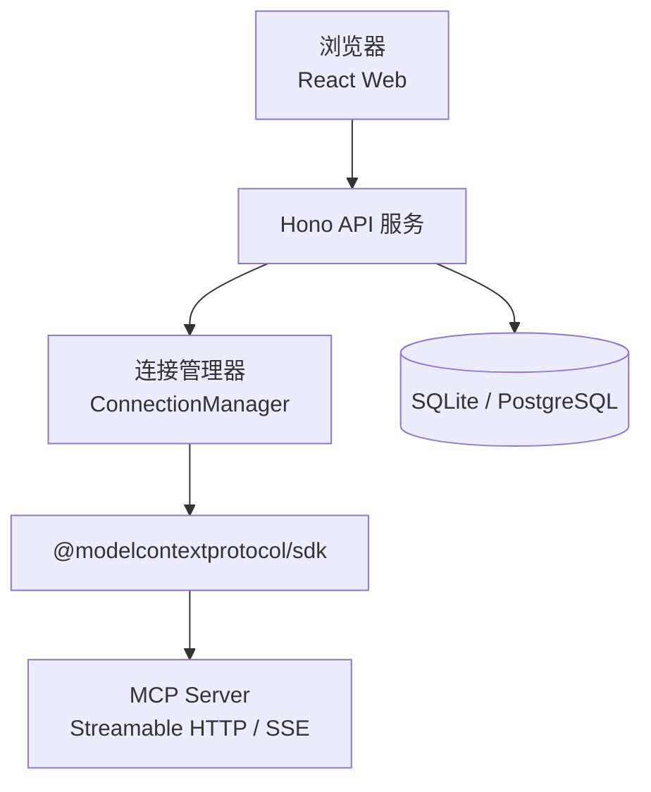
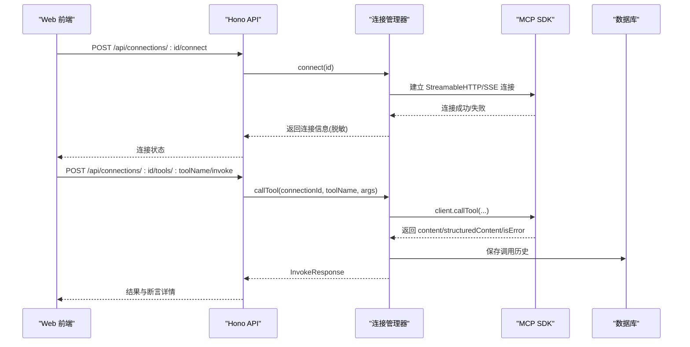
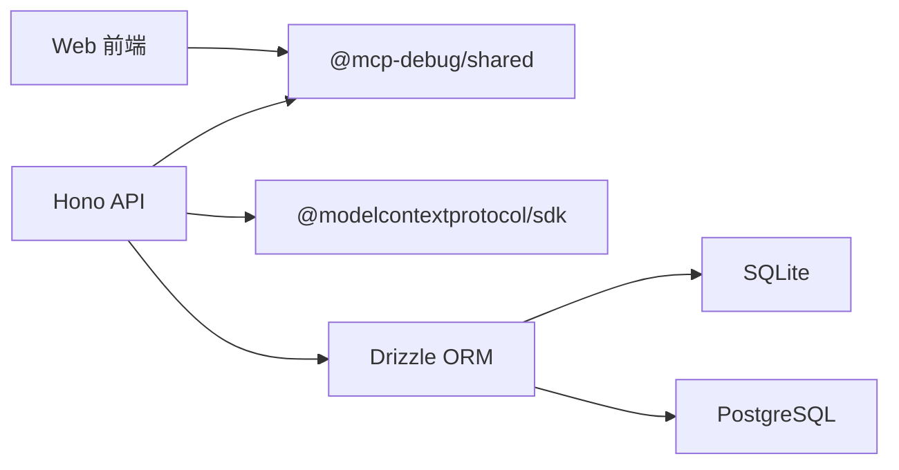

# 核心功能特性

<cite>
**本文引用的文件**
- [README.md](file://README.md)
- [apps/server/src/index.ts](file://apps/server/src/index.ts)
- [apps/server/src/routes/api.ts](file://apps/server/src/routes/api.ts)
- [apps/server/src/mcp/connection-manager.ts](file://apps/server/src/mcp/connection-manager.ts)
- [apps/server/src/services/assert.ts](file://apps/server/src/services/assert.ts)
- [apps/server/src/services/case-runner.ts](file://apps/server/src/services/case-runner.ts)
- [apps/server/src/services/schema-validate.ts](file://apps/server/src/services/schema-validate.ts)
- [apps/server/src/db/client.ts](file://apps/server/src/db/client.ts)
- [apps/server/src/db/repos.ts](file://apps/server/src/db/repos.ts)
- [packages/shared/src/types.ts](file://packages/shared/src/types.ts)
- [packages/shared/src/index.ts](file://packages/shared/src/index.ts)
- [apps/web/src/pages/ConnectionsPage.tsx](file://apps/web/src/pages/ConnectionsPage.tsx)
- [apps/web/src/pages/WorkbenchPage.tsx](file://apps/web/src/pages/WorkbenchPage.tsx)
- [apps/web/src/components/SchemaForm.tsx](file://apps/web/src/components/SchemaForm.tsx)
- [apps/web/src/pages/AutomationPage.tsx](file://apps/web/src/pages/AutomationPage.tsx)
</cite>

## 目录
1. [简介](#简介)
2. [项目结构](#项目结构)
3. [核心组件](#核心组件)
4. [架构总览](#架构总览)
5. [详细组件分析](#详细组件分析)
6. [依赖分析](#依赖分析)
7. [性能考虑](#性能考虑)
8. [故障排查指南](#故障排查指南)
9. [结论](#结论)
10. [附录](#附录)

## 简介
MCP Tool Debug 是一个可自托管的 Web 调试台，用于连接、检查、调用和自动化测试 Model Context Protocol（MCP）Tools。它把 MCP Inspector、JSON Schema 2020-12 动态表单、结果诊断、测试用例和回归执行集中到同一个界面中，支持多 MCP 连接管理、Streamable HTTP/SSE 自动回退、Tool 同步与搜索、RJSF 6 + Ajv 2020 驱动的动态表单、清晰的错误分类显示、结构化内容展示、测试用例管理与批量运行、丰富的断言类型、历史记录追踪以及 SQLite/PostgreSQL 双数据库支持。

## 项目结构
- 后端服务：基于 Hono 的 API 服务，负责 MCP 连接管理、工具调用、测试套件执行、数据持久化等。
- 前端应用：React + Ant Design 工作台，提供连接管理、工具调试、用例编辑与自动化执行界面。
- 共享类型：前后端共享的类型定义与断言模式。
- 部署：Docker Compose 一键部署，默认 SQLite，生产环境可切换 PostgreSQL。

图表来源
- [apps/server/src/index.ts:10-33](file://apps/server/src/index.ts#L10-L33)
- [apps/server/src/routes/api.ts:18-38](file://apps/server/src/routes/api.ts#L18-L38)
- [apps/server/src/mcp/connection-manager.ts:39-99](file://apps/server/src/mcp/connection-manager.ts#L39-L99)
- [apps/server/src/db/client.ts:35-65](file://apps/server/src/db/client.ts#L35-L65)

章节来源
- [README.md:11-50](file://README.md#L11-L50)
- [apps/server/src/index.ts:10-33](file://apps/server/src/index.ts#L10-L33)

## 核心组件
- 连接管理器：封装 MCP Client 生命周期、传输层选择（streamable_http/sse/auto）、会话恢复、超时控制、并发队列与在线状态维护。
- API 路由：暴露连接、工具、用例、套件运行、导入导出等 REST 接口，统一错误处理与安全脱敏。
- 断言引擎：实现多种断言类型（内容包含/排除、JSONPath、耗时、结构化输出验证、Schema 有效性）。
- 用例与套件执行器：单用例执行与并行套件执行，记录每次调用的完整上下文与断言结果。
- Schema 校验：基于 Ajv 2020 对 structuredContent 进行 outputSchema 校验。
- 数据访问层：Drizzle ORM + 双数据库适配（SQLite/PostgreSQL），提供连接、工具、用例、历史记录的 CRUD 与筛选。
- 前端页面：连接管理、工作台（表单/JSON 双模）、自动化测试、结果查看与历史追踪。

章节来源
- [apps/server/src/mcp/connection-manager.ts:39-383](file://apps/server/src/mcp/connection-manager.ts#L39-L383)
- [apps/server/src/routes/api.ts:18-277](file://apps/server/src/routes/api.ts#L18-L277)
- [apps/server/src/services/assert.ts:1-166](file://apps/server/src/services/assert.ts#L1-L166)
- [apps/server/src/services/case-runner.ts:1-161](file://apps/server/src/services/case-runner.ts#L1-L161)
- [apps/server/src/services/schema-validate.ts:1-61](file://apps/server/src/services/schema-validate.ts#L1-L61)
- [apps/server/src/db/repos.ts:1-660](file://apps/server/src/db/repos.ts#L1-L660)
- [apps/web/src/pages/ConnectionsPage.tsx:1-291](file://apps/web/src/pages/ConnectionsPage.tsx#L1-L291)
- [apps/web/src/pages/WorkbenchPage.tsx:1-541](file://apps/web/src/pages/WorkbenchPage.tsx#L1-L541)
- [apps/web/src/components/SchemaForm.tsx:1-421](file://apps/web/src/components/SchemaForm.tsx#L1-L421)
- [apps/web/src/pages/AutomationPage.tsx:1-207](file://apps/web/src/pages/AutomationPage.tsx#L1-L207)

## 架构总览
系统采用前后端分离架构，API 层通过 MCP TypeScript SDK 与远端 MCP Server 通信；所有连接与会话状态由连接管理器维护；测试结果与配置持久化至 SQLite 或 PostgreSQL；前端提供可视化工作流。

图表来源
- [apps/server/src/routes/api.ts:77-138](file://apps/server/src/routes/api.ts#L77-L138)
- [apps/server/src/mcp/connection-manager.ts:101-147](file://apps/server/src/mcp/connection-manager.ts#L101-L147)
- [apps/server/src/mcp/connection-manager.ts:300-379](file://apps/server/src/mcp/connection-manager.ts#L300-L379)
- [apps/server/src/db/repos.ts:476-528](file://apps/server/src/db/repos.ts#L476-L528)

## 详细组件分析

### 多 MCP 连接管理（自定义 Headers、超时、在线状态）
- 支持创建、更新、删除连接，设置名称、URL、传输类型（auto/streamable_http/sse）、超时毫秒数、描述与 Headers JSON。
- 连接时按优先级尝试 streamable_http 与 sse；auto 模式下先 HTTP 后 SSE 回退。
- 连接成功后记录 lastConnectedAt、serverInfo，并标记 live 状态；失败则记录 lastError。
- 断开连接会终止会话并关闭客户端。
- 安全策略：对外 API 仅返回 Header 名称列表，不返回值，避免凭据泄露。

使用示例
- 新建连接：在“连接”页面填写名称、URL、传输类型、超时、Headers JSON，点击创建。
- 连接/断开：点击“连接”按钮，成功后卡片显示“在线”，否则显示最近错误。
- 同步 Tools：点击“同步 Tools”，将远程工具元数据拉取并存储。

配置选项
- transport：auto | streamable_http | sse
- timeoutMs：请求超时毫秒数（默认 60000）
- headers：{"Authorization":"Bearer xxx"} 等

章节来源
- [apps/web/src/pages/ConnectionsPage.tsx:51-78](file://apps/web/src/pages/ConnectionsPage.tsx#L51-L78)
- [apps/web/src/pages/ConnectionsPage.tsx:177-239](file://apps/web/src/pages/ConnectionsPage.tsx#L177-L239)
- [apps/server/src/routes/api.ts:40-92](file://apps/server/src/routes/api.ts#L40-L92)
- [apps/server/src/mcp/connection-manager.ts:69-147](file://apps/server/src/mcp/connection-manager.ts#L69-L147)
- [packages/shared/src/types.ts:54-90](file://packages/shared/src/types.ts#L54-L90)

### Streamable HTTP/SSE 自动回退与会话恢复
- 自动回退：当指定 auto 或未显式指定时，优先尝试 streamable_http，失败再尝试 sse。
- 会话恢复：若检测到 StreamableHTTP 会话过期（HTTP 404），自动丢弃旧会话并重连一次，重试失败则标记不可用。
- 日志事件：mcp_session_recovery_started/failed/succeeded 便于定位问题。

使用示例
- 在连接配置中选择 transport=auto，遇到服务端会话过期会自动重建。

章节来源
- [apps/server/src/mcp/connection-manager.ts:108-147](file://apps/server/src/mcp/connection-manager.ts#L108-L147)
- [apps/server/src/mcp/connection-manager.ts:175-268](file://apps/server/src/mcp/connection-manager.ts#L175-L268)

### Tool 同步与搜索
- 同步：调用 listTools 分页拉取，合并写入本地 mcp_tools 表，保留 inputSchema/outputSchema/raw 等元数据。
- 搜索：支持按 name/title/description 模糊查询，前端提供搜索框即时过滤。

使用示例
- 在工作台页面点击“同步 Tools”，随后在左侧列表输入关键词快速定位目标 Tool。

章节来源
- [apps/server/src/mcp/connection-manager.ts:270-298](file://apps/server/src/mcp/connection-manager.ts#L270-L298)
- [apps/server/src/routes/api.ts:94-115](file://apps/server/src/routes/api.ts#L94-L115)
- [apps/server/src/db/repos.ts:314-382](file://apps/server/src/db/repos.ts#L314-L382)
- [apps/web/src/pages/WorkbenchPage.tsx:165-192](file://apps/web/src/pages/WorkbenchPage.tsx#L165-L192)

### RJSF 6 + Ajv 2020 动态表单系统
- 基于 RJSF 6 与 @rjsf/validator-ajv8，AjvClass 使用 Ajv 2020，支持 JSON Schema 2020-12 特性。
- 增强 oneOf/anyOf 分支渲染：提升父级字段到分支以正确控制显示；为 const 字段隐藏输入；生成友好标题。
- 表单/JSON 双模：复杂场景可直接编辑 JSON，实时校验并提示错误。
- 错误消息本地化：将常见 Ajv 错误转换为简洁中文提示。

使用示例
- 在工作台“调用”标签页，根据 inputSchema 自动生成表单；切换到 JSON 模式精确编辑。

章节来源
- [apps/web/src/components/SchemaForm.tsx:1-421](file://apps/web/src/components/SchemaForm.tsx#L1-L421)
- [apps/web/src/pages/WorkbenchPage.tsx:227-236](file://apps/web/src/pages/WorkbenchPage.tsx#L227-L236)

### 清晰的错误分类显示（协议错误、Tool 执行错误、超时、断言失败）
- 状态枚举：success、tool_error、protocol_error、timeout、cancelled。
- 超时检测：AbortController 与 Promise.race 结合，识别 TIMEOUT/AbortError/timed out。
- 协议错误：捕获异常并包装 message/code，供前端展示。
- 断言失败：断言引擎返回 checks 明细，包括期望与实际值。

使用示例
- 调用失败时，右侧结果面板显示 status、isError、durationMs、protocolError 与断言检查结果。

章节来源
- [apps/server/src/mcp/connection-manager.ts:300-379](file://apps/server/src/mcp/connection-manager.ts#L300-L379)
- [packages/shared/src/types.ts:5-12](file://packages/shared/src/types.ts#L5-L12)
- [apps/server/src/services/assert.ts:58-166](file://apps/server/src/services/assert.ts#L58-L166)

### 结构化内容展示（content、structuredContent、原始响应）
- 结果包含 content 数组、可选 structuredContent、schemaValidation 与 rawResponse。
- 前端 ResultViewer 统一展示文本、图片、音频、结构化 JSON 与原始响应。

使用示例
- 在结果面板查看 structuredContent 是否符合 outputSchema，必要时查看 rawResponse 排查差异。

章节来源
- [apps/server/src/mcp/connection-manager.ts:334-354](file://apps/server/src/mcp/connection-manager.ts#L334-L354)
- [apps/server/src/services/schema-validate.ts:27-61](file://apps/server/src/services/schema-validate.ts#L27-L61)
- [apps/web/src/pages/WorkbenchPage.tsx:443-447](file://apps/web/src/pages/WorkbenchPage.tsx#L443-L447)

### 测试用例管理（保存、编辑、启停、批量运行）
- 保存：从当前表单参数另存为用例，支持描述、断言、标签与启用开关。
- 编辑：修改名称、参数、断言、标签与启用状态。
- 运行：单用例运行，返回断言结果与调用详情。
- 批量：在工作台“跑当前 Tool 全部用例”或自动化页面按连接/标签/用例集合执行套件。

使用示例
- 在工作台“用例”标签页新建用例，配置断言后点击“运行”；或在自动化页面选择连接与用例集执行套件。

章节来源
- [apps/web/src/pages/WorkbenchPage.tsx:124-163](file://apps/web/src/pages/WorkbenchPage.tsx#L124-L163)
- [apps/web/src/pages/WorkbenchPage.tsx:477-498](file://apps/web/src/pages/WorkbenchPage.tsx#L477-L498)
- [apps/web/src/pages/AutomationPage.tsx:64-89](file://apps/web/src/pages/AutomationPage.tsx#L64-L89)
- [apps/server/src/routes/api.ts:140-191](file://apps/server/src/routes/api.ts#L140-L191)
- [apps/server/src/services/case-runner.ts:79-161](file://apps/server/src/services/case-runner.ts#L79-L161)

### 丰富的断言类型（内容包含/排除、JSONPath、耗时、结构化输出验证）
- expectIsError：期望 isError 布尔值。
- expectStructured：期望是否存在 structuredContent。
- structuredEquals：部分深匹配 structuredContent。
- structuredSchemaValid：依据 outputSchema 校验 structuredContent。
- contentTextContains/NotContains：文本包含/不包含。
- maxDurationMs：最大耗时阈值。
- jsonPathEquals：路径取值等于期望值。

使用示例
- 断言配置示例（参考 README）：
  - expectIsError=false
  - expectStructured=true
  - structuredEquals={"ok":true}
  - structuredSchemaValid=true
  - contentTextContains=["success"]
  - contentTextNotContains=["error"]
  - maxDurationMs=3000
  - jsonPathEquals=[{"path":"$.code","value":0}]

章节来源
- [apps/server/src/services/assert.ts:58-166](file://apps/server/src/services/assert.ts#L58-L166)
- [packages/shared/src/types.ts:14-46](file://packages/shared/src/types.ts#L14-L46)
- [README.md:121-134](file://README.md#L121-L134)

### 历史记录追踪
- 每次调用均持久化为 invocation_runs，包含请求参数、起止时间、耗时、状态、结果内容、结构化输出、协议错误、断言结果、Schema 校验与原始响应。
- 支持按连接、工具、套件运行、状态筛选与分页。

使用示例
- 在工作台“历史”标签页查看最近 50 条记录，点击“查看”加载结果，“重用参数”回填表单。

章节来源
- [apps/server/src/db/repos.ts:476-570](file://apps/server/src/db/repos.ts#L476-L570)
- [apps/server/src/routes/api.ts:205-225](file://apps/server/src/routes/api.ts#L205-L225)
- [apps/web/src/pages/WorkbenchPage.tsx:328-406](file://apps/web/src/pages/WorkbenchPage.tsx#L328-L406)

### 双数据库支持（SQLite/PostgreSQL）
- 默认 SQLite，生产可通过环境变量切换 PostgreSQL。
- 启动时自动迁移建表，WAL 模式与外键约束开启。
- Drizzle ORM 抽象不同方言，统一数据访问。

使用示例
- 在 deployment/.env 中设置 DATABASE_URL 与 DB_DIALECT=postgres，重启服务即可。

章节来源
- [apps/server/src/db/client.ts:35-65](file://apps/server/src/db/client.ts#L35-L65)
- [apps/server/src/db/client.ts:247-266](file://apps/server/src/db/client.ts#L247-L266)
- [README.md:96-110](file://README.md#L96-L110)

### 导入导出与团队共享
- 导出：包含连接与用例的完整包（含 Headers 值），适合备份与分享。
- 导入：批量恢复连接与用例，便于团队协作与环境初始化。

使用示例
- 在“连接”页面点击“导出”，下载 JSON 文件；在另一环境“导入”该文件完成配置迁移。

章节来源
- [apps/web/src/pages/ConnectionsPage.tsx:92-143](file://apps/web/src/pages/ConnectionsPage.tsx#L92-L143)
- [apps/server/src/routes/api.ts:227-271](file://apps/server/src/routes/api.ts#L227-L271)

## 依赖分析
- 前端依赖：React、Ant Design、RJSF 6、@rjsf/validator-ajv8、Ajv 2020、CodeMirror。
- 后端依赖：Hono、@modelcontextprotocol/sdk、Drizzle ORM、better-sqlite3、pg。
- 共享模块：types 与 assert-schema 被前后端共同引用。

图表来源
- [apps/web/src/components/SchemaForm.tsx:1-12](file://apps/web/src/components/SchemaForm.tsx#L1-L12)
- [apps/server/src/index.ts:1-6](file://apps/server/src/index.ts#L1-L6)
- [apps/server/src/mcp/connection-manager.ts:1-17](file://apps/server/src/mcp/connection-manager.ts#L1-L17)
- [apps/server/src/db/client.ts:1-11](file://apps/server/src/db/client.ts#L1-L11)
- [packages/shared/src/index.ts:1-3](file://packages/shared/src/index.ts#L1-L3)

章节来源
- [packages/shared/src/types.ts:1-229](file://packages/shared/src/types.ts#L1-L229)
- [apps/server/src/db/client.ts:1-65](file://apps/server/src/db/client.ts#L1-L65)

## 性能考虑
- 并发控制：连接管理器内部使用队列保证同一连接串行操作，避免竞态与资源争用。
- 超时控制：调用层使用 AbortController 与 Promise.race 防止长尾请求阻塞。
- 并行套件：runSuite 支持 parallel 参数，通过 mapPool 控制并发度，提高批量执行吞吐。
- 数据库索引：针对常用查询字段建立索引（如 connection_id、tool_name、started_at、suite_run_id）。
- 表单优化：RJSF 实验性默认行为减少空对象渲染开销，oneOf/anyOf 增强减少不必要交互。

章节来源
- [apps/server/src/mcp/connection-manager.ts:51-67](file://apps/server/src/mcp/connection-manager.ts#L51-L67)
- [apps/server/src/mcp/connection-manager.ts:314-332](file://apps/server/src/mcp/connection-manager.ts#L314-L332)
- [apps/server/src/services/case-runner.ts:94-109](file://apps/server/src/services/case-runner.ts#L94-L109)
- [apps/server/src/db/client.ts:153-155](file://apps/server/src/db/client.ts#L153-L155)
- [apps/web/src/components/SchemaForm.tsx:376-381](file://apps/web/src/components/SchemaForm.tsx#L376-L381)

## 故障排查指南
- 连接失败：检查 URL、transport 与 Headers；查看 lastError 与 serverInfo；确认 CORS_ORIGIN 允许前端访问。
- 会话过期：观察 mcp_session_recovery_* 日志，确认是否触发重连与重试。
- 超时问题：调整 timeoutMs；检查网络延迟与服务端处理能力。
- 断言失败：查看断言 checks 明细，对比 expected/actual；必要时查看 rawResponse 定位差异。
- 数据库问题：确认 DATABASE_URL 与 DB_DIALECT；检查迁移是否成功；PostgreSQL 需提前创建数据库。

章节来源
- [apps/server/src/mcp/connection-manager.ts:197-268](file://apps/server/src/mcp/connection-manager.ts#L197-L268)
- [apps/server/src/routes/api.ts:20-22](file://apps/server/src/routes/api.ts#L20-L22)
- [apps/server/src/db/client.ts:247-266](file://apps/server/src/db/client.ts#L247-L266)
- [apps/web/src/pages/ConnectionsPage.tsx:170-176](file://apps/web/src/pages/ConnectionsPage.tsx#L170-L176)

## 结论
MCP Tool Debug 提供了从连接管理、工具调试到自动化测试的一体化能力，具备健壮的错误分类、强大的断言体系与灵活的表单系统，同时支持双数据库与 Docker 部署，适合个人开发者与团队协作使用。建议在生产环境启用 HTTPS、身份认证与访问控制，合理配置超时与并发，充分利用导入导出与历史记录进行回归与审计。

## 附录

### 环境变量与配置
- PORT：后端 API 端口（默认 8787）
- DATABASE_URL：SQLite 文件或 PostgreSQL URL
- DB_DIALECT：sqlite/postgres，未设置时根据 URL 推断
- CORS_ORIGIN：允许访问 API 的 Web Origin（默认 http://localhost:5173）

章节来源
- [README.md:136-144](file://README.md#L136-L144)
- [apps/server/src/index.ts:7-8](file://apps/server/src/index.ts#L7-L8)

### API 健康检查
- GET /api/health：返回 ok、dialect 与 liveConnections 数量

章节来源
- [apps/server/src/routes/api.ts:32-38](file://apps/server/src/routes/api.ts#L32-L38)