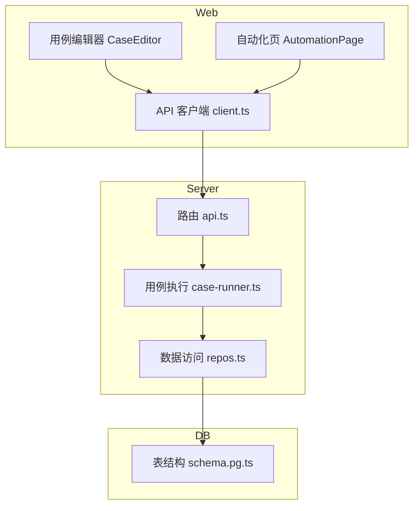
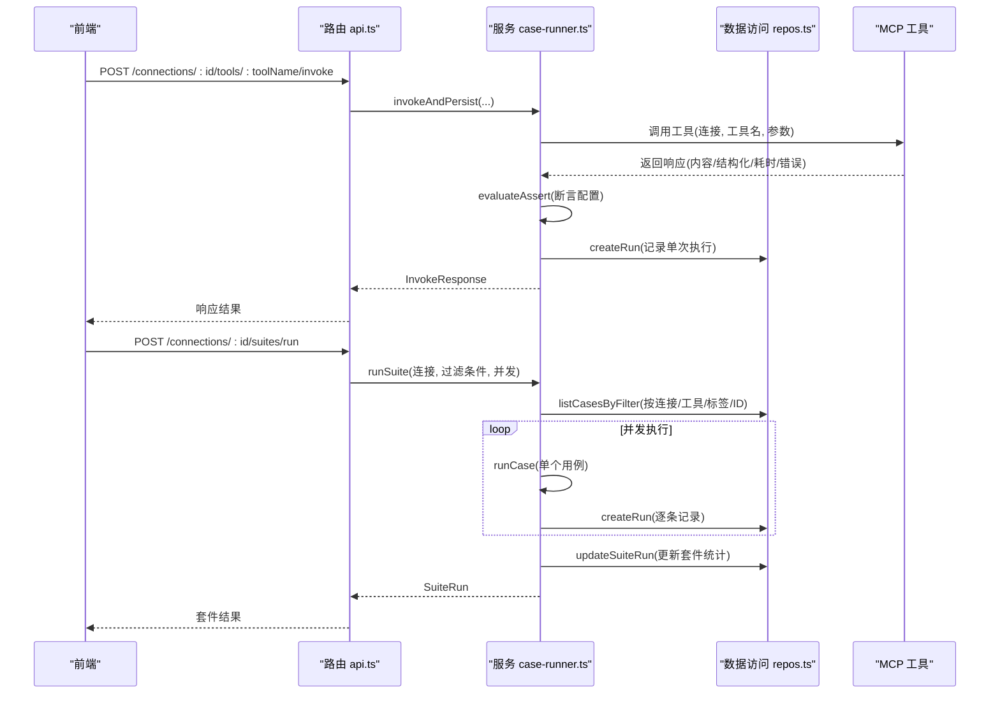
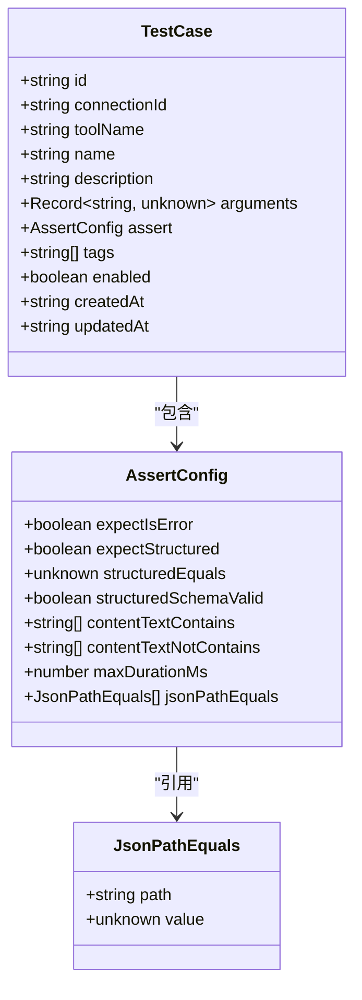
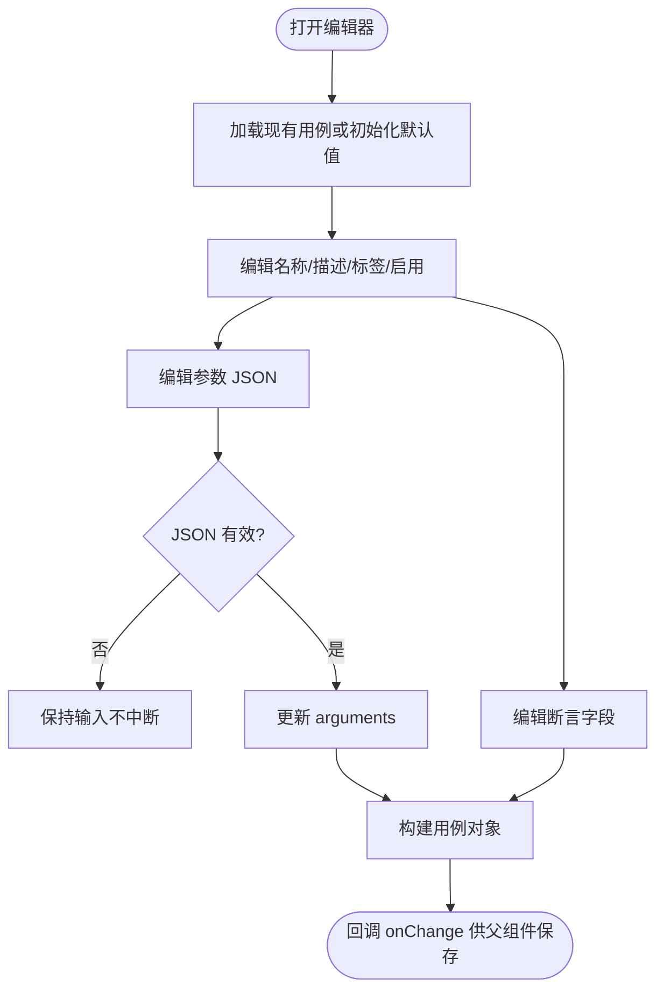
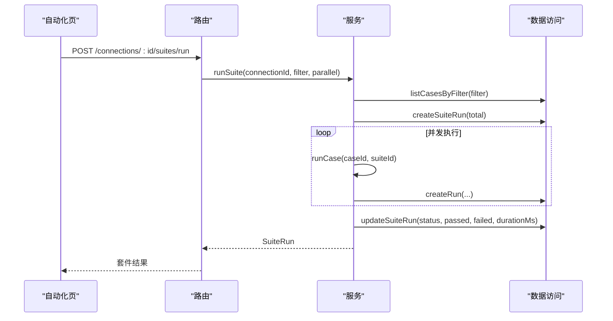
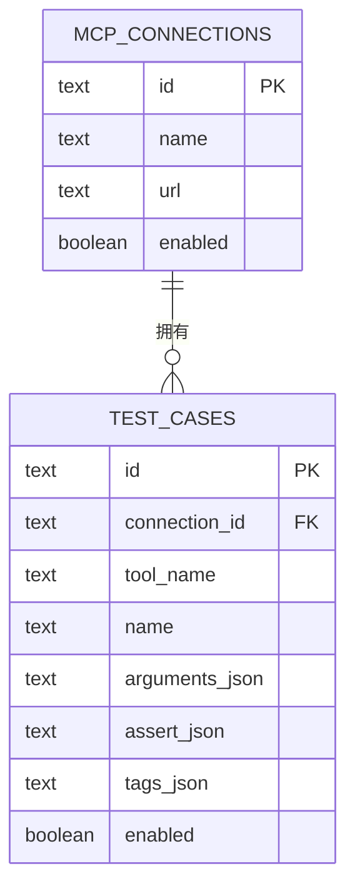
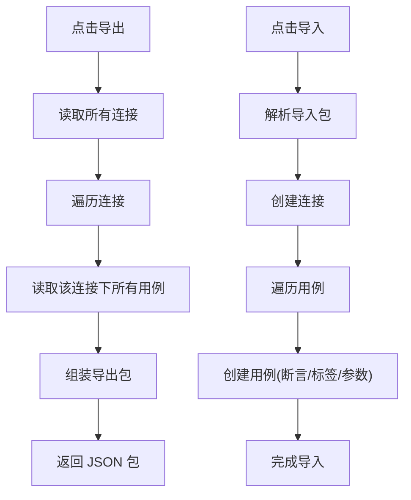
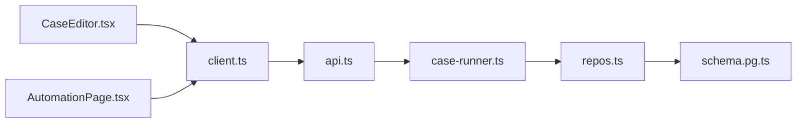

# 测试用例管理

<cite>
**本文引用的文件**
- [README.md](file://README.md)
- [types.ts](file://packages/shared/src/types.ts)
- [assert-schema.ts](file://packages/shared/src/assert-schema.ts)
- [CaseEditor.tsx](file://apps/web/src/components/CaseEditor.tsx)
- [AutomationPage.tsx](file://apps/web/src/pages/AutomationPage.tsx)
- [client.ts](file://apps/web/src/api/client.ts)
- [api.ts](file://apps/server/src/routes/api.ts)
- [case-runner.ts](file://apps/server/src/services/case-runner.ts)
- [repos.ts](file://apps/server/src/db/repos.ts)
- [schema.pg.ts](file://apps/server/src/db/schema.pg.ts)
</cite>

## 目录
1. [简介](#简介)
2. [项目结构](#项目结构)
3. [核心组件](#核心组件)
4. [架构总览](#架构总览)
5. [详细组件分析](#详细组件分析)
6. [依赖关系分析](#依赖关系分析)
7. [性能与并发](#性能与并发)
8. [故障排查指南](#故障排查指南)
9. [结论](#结论)
10. [附录：API 定义与数据模型](#附录api-定义与数据模型)

## 简介
本文件聚焦 MCP Tool Debug 的“测试用例管理”能力，覆盖用例的创建、编辑、保存、组织与管理；用例结构定义、断言配置与校验；批量执行与套件运行；导入导出与复用；用例与连接的关联、环境隔离与共享；以及权限控制、协作开发与冲突解决的策略建议。同时说明用例执行的触发条件、定时任务与自动化集成方式。

## 项目结构
围绕测试用例管理的代码分布在 Web 前端、后端 API、服务层与数据库层：
- 前端
  - 用例编辑器：提供名称、描述、标签、启用开关、参数 JSON 与断言配置的表单化编辑
  - 自动化页面：按连接选择、按用例或标签筛选、设置并发度并执行套件
  - API 客户端：封装所有与用例、套件、运行记录相关的 HTTP 调用
- 后端
  - 路由层：暴露用例 CRUD、单用例执行、套件执行、导入导出等接口
  - 服务层：封装用例执行流程、断言评估、持久化与套件并行调度
  - 数据访问层：基于 Drizzle ORM 的表映射与查询封装
  - 数据库模式：PostgreSQL 表结构（SQLite 模式类似）

图表来源
- [CaseEditor.tsx:1-168](file://apps/web/src/components/CaseEditor.tsx#L1-L168)
- [AutomationPage.tsx:1-207](file://apps/web/src/pages/AutomationPage.tsx#L1-L207)
- [client.ts:1-122](file://apps/web/src/api/client.ts#L1-L122)
- [api.ts:1-277](file://apps/server/src/routes/api.ts#L1-L277)
- [case-runner.ts:1-161](file://apps/server/src/services/case-runner.ts#L1-L161)
- [repos.ts:1-660](file://apps/server/src/db/repos.ts#L1-L660)
- [schema.pg.ts:1-127](file://apps/server/src/db/schema.pg.ts#L1-L127)

章节来源
- [README.md:1-193](file://README.md#L1-L193)

## 核心组件
- 用例数据结构与断言规范
  - 用例包含连接、工具、名称、描述、参数、断言、标签、启用状态与时间戳
  - 断言支持错误期望、结构化输出匹配、Schema 有效性、文本包含/排除、耗时上限、JSONPath 相等性检查
- 前端用例编辑器
  - 提供字段级编辑与 JSON 编辑器，统一将输入转换为标准用例对象
- 自动化套件执行
  - 支持按连接、用例集合、标签过滤，指定并发度批量执行，统计通过/失败/总数
- 服务端执行器
  - 调用 MCP 工具、评估断言、持久化单次运行记录、维护套件运行结果
- 数据访问与存储
  - 统一的 CRUD 与过滤方法，按连接维度隔离用例，支持按工具名、标签、ID 筛选
- 导入导出
  - 以包格式导出连接与用例，支持反向导入到本地实例

章节来源
- [types.ts:105-136](file://packages/shared/src/types.ts#L105-L136)
- [types.ts:19-28](file://packages/shared/src/types.ts#L19-L28)
- [assert-schema.ts:1-32](file://packages/shared/src/assert-schema.ts#L1-L32)
- [CaseEditor.tsx:1-168](file://apps/web/src/components/CaseEditor.tsx#L1-L168)
- [AutomationPage.tsx:1-207](file://apps/web/src/pages/AutomationPage.tsx#L1-L207)
- [case-runner.ts:1-161](file://apps/server/src/services/case-runner.ts#L1-L161)
- [repos.ts:400-474](file://apps/server/src/db/repos.ts#L400-L474)
- [repos.ts:640-659](file://apps/server/src/db/repos.ts#L640-L659)
- [api.ts:227-271](file://apps/server/src/routes/api.ts#L227-L271)

## 架构总览
测试用例管理的关键交互路径如下：
- 前端通过 API 客户端发起请求
- 路由层进行参数校验与转发
- 服务层负责调用 MCP 工具、断言评估与持久化
- 数据访问层读写数据库
- 数据库使用 PostgreSQL 或 SQLite，表结构由 Drizzle 定义

图表来源
- [api.ts:117-138](file://apps/server/src/routes/api.ts#L117-L138)
- [api.ts:183-191](file://apps/server/src/routes/api.ts#L183-L191)
- [case-runner.ts:11-77](file://apps/server/src/services/case-runner.ts#L11-L77)
- [case-runner.ts:111-160](file://apps/server/src/services/case-runner.ts#L111-L160)
- [repos.ts:476-528](file://apps/server/src/db/repos.ts#L476-L528)
- [repos.ts:640-659](file://apps/server/src/db/repos.ts#L640-L659)

## 详细组件分析

### 用例数据模型与断言规范
- 用例字段
  - 标识与归属：id、connectionId、toolName
  - 元信息：name、description、tags、enabled
  - 运行时：arguments、assert、createdAt、updatedAt
- 断言配置
  - expectIsError：是否期望工具返回错误
  - expectStructured：是否期望结构化输出
  - structuredEquals：部分匹配的结构化内容
  - structuredSchemaValid：是否校验结构化输出符合 Schema
  - contentTextContains/contentTextNotContains：文本包含/不包含
  - maxDurationMs：最大耗时阈值
  - jsonPathEquals：JSONPath 值相等性检查
- 断言规范化
  - 统一空值与类型归一，确保断言对象稳定可序列化

图表来源
- [types.ts:105-136](file://packages/shared/src/types.ts#L105-L136)
- [types.ts:19-28](file://packages/shared/src/types.ts#L19-L28)
- [types.ts:14-17](file://packages/shared/src/types.ts#L14-L17)
- [assert-schema.ts:11-31](file://packages/shared/src/assert-schema.ts#L11-L31)

章节来源
- [types.ts:105-136](file://packages/shared/src/types.ts#L105-L136)
- [types.ts:19-28](file://packages/shared/src/types.ts#L19-L28)
- [assert-schema.ts:1-32](file://packages/shared/src/assert-schema.ts#L1-L32)

### 前端用例编辑器
- 功能要点
  - 名称、描述、标签、启用开关
  - 参数 arguments 使用 JSON 编辑器，实时解析并回写
  - 断言字段：expectIsError、expectStructured、structuredSchemaValid、maxDurationMs、contentTextContains、structuredEquals
- 数据转换
  - 将 UI 值映射为标准用例对象，便于提交与复用

图表来源
- [CaseEditor.tsx:15-24](file://apps/web/src/components/CaseEditor.tsx#L15-L24)
- [CaseEditor.tsx:31-167](file://apps/web/src/components/CaseEditor.tsx#L31-L167)

章节来源
- [CaseEditor.tsx:1-168](file://apps/web/src/components/CaseEditor.tsx#L1-L168)

### 自动化套件执行
- 触发条件
  - 用户在前端选择连接、可选的用例集合或标签、并发度后提交
- 执行流程
  - 根据过滤条件获取用例列表
  - 创建套件运行记录
  - 并发执行每个用例，统计通过/失败
  - 更新套件结束时间与状态
- 界面展示
  - 最近套件运行列表、明细弹窗显示每条运行状态与断言结果

图表来源
- [AutomationPage.tsx:64-89](file://apps/web/src/pages/AutomationPage.tsx#L64-L89)
- [api.ts:183-191](file://apps/server/src/routes/api.ts#L183-L191)
- [case-runner.ts:111-160](file://apps/server/src/services/case-runner.ts#L111-L160)
- [repos.ts:640-659](file://apps/server/src/db/repos.ts#L640-L659)
- [repos.ts:572-617](file://apps/server/src/db/repos.ts#L572-L617)

章节来源
- [AutomationPage.tsx:1-207](file://apps/web/src/pages/AutomationPage.tsx#L1-L207)
- [api.ts:183-191](file://apps/server/src/routes/api.ts#L183-L191)
- [case-runner.ts:111-160](file://apps/server/src/services/case-runner.ts#L111-L160)
- [repos.ts:572-617](file://apps/server/src/db/repos.ts#L572-L617)

### 用例与连接的关联与环境隔离
- 关联关系
  - 用例通过 connectionId 绑定到具体连接，确保不同环境的凭据与地址隔离
- 工具与用例
  - 用例还绑定 toolName，便于按工具维度组织与筛选
- 数据库约束
  - 外键关系与索引优化查询性能

图表来源
- [schema.pg.ts:48-68](file://apps/server/src/db/schema.pg.ts#L48-L68)
- [schema.pg.ts:10-24](file://apps/server/src/db/schema.pg.ts#L10-L24)

章节来源
- [schema.pg.ts:48-68](file://apps/server/src/db/schema.pg.ts#L48-L68)
- [repos.ts:400-474](file://apps/server/src/db/repos.ts#L400-L474)

### 用例版本控制、标签分类与搜索过滤
- 版本控制
  - 当前未实现显式版本字段，但可通过导入导出与外部版本系统（如 Git）管理变更历史
  - 每次运行会生成 InvocationRun 记录，可用于回溯与回归对比
- 标签分类
  - 用例支持多标签，用于套件筛选与分组
- 搜索过滤
  - 支持按连接、工具名、用例 ID、标签组合过滤
  - 前端自动化页支持按标签字符串拆分过滤

章节来源
- [types.ts:105-136](file://packages/shared/src/types.ts#L105-L136)
- [repos.ts:640-659](file://apps/server/src/db/repos.ts#L640-L659)
- [AutomationPage.tsx:68-78](file://apps/web/src/pages/AutomationPage.tsx#L68-L78)

### 用例导入导出与模板复用
- 导出
  - 导出包包含连接信息与对应用例集合，便于迁移与备份
- 导入
  - 导入时创建连接与用例，保留断言与标签
- 模板复用
  - 可将常用用例作为模板导出并在其他环境导入复用

图表来源
- [api.ts:227-271](file://apps/server/src/routes/api.ts#L227-L271)
- [types.ts:216-228](file://packages/shared/src/types.ts#L216-L228)

章节来源
- [api.ts:227-271](file://apps/server/src/routes/api.ts#L227-L271)
- [types.ts:216-228](file://packages/shared/src/types.ts#L216-L228)

### 用例执行触发条件、定时任务与自动化集成
- 触发条件
  - 手动触发：在工作台调用工具时可选择保存为用例并立即执行
  - 批量触发：在自动化页按连接/用例/标签执行套件
- 定时任务与 CI 集成
  - 当前未内置定时任务，可通过外部调度（如 cron、CI 流水线）调用套件执行接口
  - 建议在 CI 中调用 /api/connections/:id/suites/run，并解析返回的套件状态与运行明细

章节来源
- [api.ts:117-138](file://apps/server/src/routes/api.ts#L117-L138)
- [api.ts:183-191](file://apps/server/src/routes/api.ts#L183-L191)
- [README.md:164-174](file://README.md#L164-L174)

### 权限控制、协作开发与冲突解决策略
- 权限控制
  - 当前未实现细粒度权限控制，生产部署建议在前置网关层增加身份认证与访问控制
- 协作开发
  - 通过导入导出共享用例集；结合 Git 管理导入包的变更历史
- 冲突解决
  - 多人编辑同一用例可能产生覆盖冲突，建议采用分支化导入包合并策略或在应用层引入乐观锁/版本号字段（需扩展数据模型）

章节来源
- [README.md:157-162](file://README.md#L157-L162)
- [types.ts:105-136](file://packages/shared/src/types.ts#L105-L136)

## 依赖关系分析
- 前端依赖
  - CaseEditor 与 AutomationPage 均依赖 API 客户端
  - API 客户端集中封装所有用例与套件相关接口
- 后端依赖
  - 路由依赖服务层与数据访问层
  - 服务层依赖连接管理器与断言评估逻辑
  - 数据访问层依赖数据库模式与通用工具函数
- 外部依赖
  - MCP TypeScript SDK 用于工具调用
  - Drizzle ORM 用于数据库操作

图表来源
- [CaseEditor.tsx:1-168](file://apps/web/src/components/CaseEditor.tsx#L1-L168)
- [AutomationPage.tsx:1-207](file://apps/web/src/pages/AutomationPage.tsx#L1-L207)
- [client.ts:1-122](file://apps/web/src/api/client.ts#L1-L122)
- [api.ts:1-277](file://apps/server/src/routes/api.ts#L1-L277)
- [case-runner.ts:1-161](file://apps/server/src/services/case-runner.ts#L1-L161)
- [repos.ts:1-660](file://apps/server/src/db/repos.ts#L1-L660)
- [schema.pg.ts:1-127](file://apps/server/src/db/schema.pg.ts#L1-L127)

章节来源
- [client.ts:1-122](file://apps/web/src/api/client.ts#L1-L122)
- [api.ts:1-277](file://apps/server/src/routes/api.ts#L1-L277)
- [case-runner.ts:1-161](file://apps/server/src/services/case-runner.ts#L1-L161)
- [repos.ts:1-660](file://apps/server/src/db/repos.ts#L1-L660)
- [schema.pg.ts:1-127](file://apps/server/src/db/schema.pg.ts#L1-L127)

## 性能与并发
- 套件并发
  - 支持配置并发度，内部使用线程池式并发执行，提升批量执行效率
- 数据库索引
  - 针对连接+工具、开始时间、套件 ID 建立索引，加速查询
- 断言评估
  - 断言评估在服务端同步执行，避免网络往返开销

章节来源
- [case-runner.ts:94-109](file://apps/server/src/services/case-runner.ts#L94-L109)
- [schema.pg.ts:113-118](file://apps/server/src/db/schema.pg.ts#L113-L118)

## 故障排查指南
- 常见错误
  - 连接不存在：GET/DELETE 连接时返回 404
  - 工具不存在：获取工具详情时返回 404
  - 用例不存在：更新/删除/运行用例时返回 404
  - 无效导入数据：导入接口校验失败
- 定位步骤
  - 查看套件运行明细中的单次运行记录，确认断言结果与协议错误
  - 检查连接状态与超时配置
  - 核对断言配置与结构化输出是否符合预期

章节来源
- [api.ts:53-58](file://apps/server/src/routes/api.ts#L53-L58)
- [api.ts:111-115](file://apps/server/src/routes/api.ts#L111-L115)
- [api.ts:162-172](file://apps/server/src/routes/api.ts#L162-L172)
- [api.ts:242-245](file://apps/server/src/routes/api.ts#L242-L245)
- [case-runner.ts:79-92](file://apps/server/src/services/case-runner.ts#L79-L92)

## 结论
MCP Tool Debug 的测试用例管理提供了从编辑、保存到批量执行与导入导出的完整闭环。通过连接维度的隔离与标签分类，团队可在多环境下高效复用与维护用例。尽管当前未内置权限与版本控制，但借助前置网关与外部版本系统可实现企业级协作与合规要求。未来可考虑引入显式版本字段、更细粒度的权限控制与内置定时任务以进一步增强自动化能力。

## 附录：API 定义与数据模型

### 关键 API 概览
- 健康检查
  - GET /api/health
- 连接管理
  - GET /api/connections
  - POST /api/connections
  - GET /api/connections/:id
  - PATCH /api/connections/:id
  - DELETE /api/connections/:id
  - POST /api/connections/:id/connect
  - POST /api/connections/:id/disconnect
  - POST /api/connections/:id/sync-tools
  - GET /api/connections/:id/tools
  - GET /api/connections/:id/tools/:toolName
  - POST /api/connections/:id/tools/:toolName/invoke
- 用例管理
  - GET /api/connections/:id/tools/:toolName/cases
  - POST /api/connections/:id/tools/:toolName/cases
  - GET /api/connections/:id/cases
  - PATCH /api/cases/:id
  - DELETE /api/cases/:id
  - POST /api/cases/:id/run
- 套件与运行
  - POST /api/connections/:id/suites/run
  - GET /api/suite-runs
  - GET /api/suite-runs/:id
  - GET /api/runs
  - GET /api/runs/:id
  - DELETE /api/runs/:id
- 导入导出
  - GET /api/export
  - POST /api/import

章节来源
- [api.ts:32-38](file://apps/server/src/routes/api.ts#L32-L38)
- [api.ts:40-115](file://apps/server/src/routes/api.ts#L40-L115)
- [api.ts:140-191](file://apps/server/src/routes/api.ts#L140-L191)
- [api.ts:193-225](file://apps/server/src/routes/api.ts#L193-L225)
- [api.ts:227-271](file://apps/server/src/routes/api.ts#L227-L271)

### 数据模型摘要
- 连接
  - 字段：id、name、transport、url、headers、timeoutMs、enabled、lastConnectedAt、lastError、serverInfo、live、时间戳
- 用例
  - 字段：id、connectionId、toolName、name、description、arguments、assert、tags、enabled、时间戳
- 套件运行
  - 字段：id、connectionId、name、filter、startedAt、endedAt、durationMs、total、passed、failed、skipped、status、时间戳
- 单次运行
  - 字段：id、connectionId、toolName、testCaseId、suiteRunId、source、requestArguments、startedAt、endedAt、durationMs、status、isError、resultContent、resultStructured、protocolError、assertResult、schemaValidation、rawResponse、时间戳

章节来源
- [types.ts:54-70](file://packages/shared/src/types.ts#L54-L70)
- [types.ts:105-136](file://packages/shared/src/types.ts#L105-L136)
- [types.ts:172-186](file://packages/shared/src/types.ts#L172-L186)
- [types.ts:150-170](file://packages/shared/src/types.ts#L150-L170)
- [schema.pg.ts:10-24](file://apps/server/src/db/schema.pg.ts#L10-L24)
- [schema.pg.ts:48-68](file://apps/server/src/db/schema.pg.ts#L48-L68)
- [schema.pg.ts:70-86](file://apps/server/src/db/schema.pg.ts#L70-L86)
- [schema.pg.ts:88-118](file://apps/server/src/db/schema.pg.ts#L88-L118)