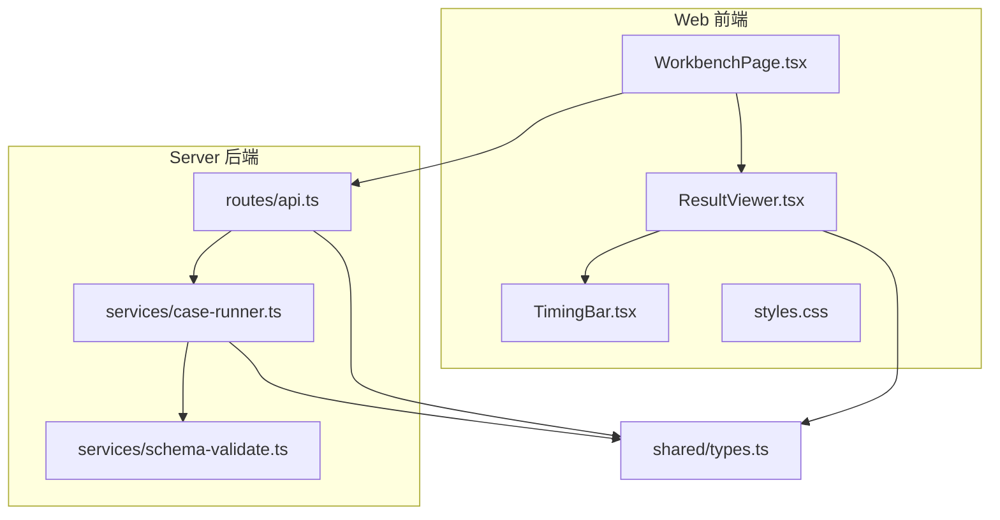
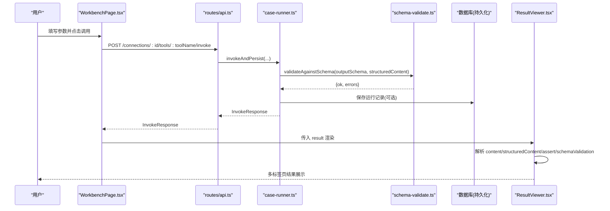
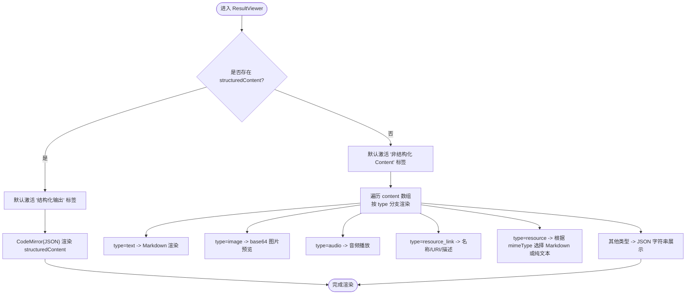
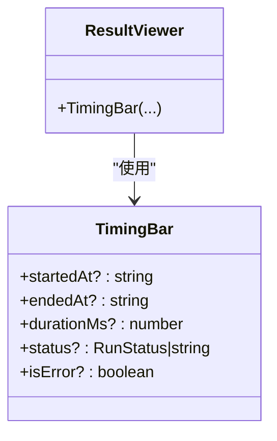
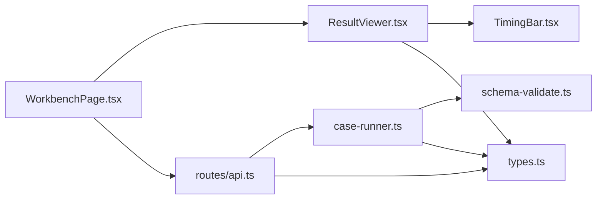

# 结果展示与分析

<cite>
**本文引用的文件**   
- [apps/web/src/components/ResultViewer.tsx](file://apps/web/src/components/ResultViewer.tsx)
- [apps/web/src/components/TimingBar.tsx](file://apps/web/src/components/TimingBar.tsx)
- [packages/shared/src/types.ts](file://packages/shared/src/types.ts)
- [apps/server/src/services/schema-validate.ts](file://apps/server/src/services/schema-validate.ts)
- [apps/server/src/services/case-runner.ts](file://apps/server/src/services/case-runner.ts)
- [apps/web/src/pages/WorkbenchPage.tsx](file://apps/web/src/pages/WorkbenchPage.tsx)
- [apps/web/src/api/client.ts](file://apps/web/src/api/client.ts)
- [apps/server/src/routes/api.ts](file://apps/server/src/routes/api.ts)
- [apps/web/src/styles.css](file://apps/web/src/styles.css)
</cite>

## 目录
1. [简介](#简介)
2. [项目结构](#项目结构)
3. [核心组件](#核心组件)
4. [架构总览](#架构总览)
5. [详细组件分析](#详细组件分析)
6. [依赖关系分析](#依赖关系分析)
7. [性能考虑](#性能考虑)
8. [故障排查指南](#故障排查指南)
9. [结论](#结论)
10. [附录](#附录)

## 简介
本章节聚焦 MCP Tool Debug 的“结果展示与分析”能力，围绕以下目标展开：
- 结构化内容展示：content（Markdown、文本、图片、音频）、structuredContent（JSON 对象）、原始响应数据的呈现方式。
- 输出 Schema 验证结果的可视化展示与错误定位。
- 耗时统计和时间轴分析。
- 结果数据的格式化选项、语法高亮和折叠展开能力。
- 结果对比、差异分析和趋势查看方法。
- 结果缓存策略、历史记录关联与导出功能。
- 性能优化技巧与大结果集的展示方案。
- 自定义结果渲染器与扩展显示格式的方法。

## 项目结构
与“结果展示与分析”直接相关的代码主要分布在 Web 前端展示层与服务端数据处理层：
- 前端展示层
  - ResultViewer：统一的结果视图容器，负责多标签页展示结构化与非结构化数据、断言与校验信息、原始摘要等。
  - TimingBar：时间轴与状态条，展示发起/结束时间与耗时。
  - WorkbenchPage：工作台页面，组织调用表单、用例管理、历史列表与右侧结果面板。
  - styles.css：样式定义，包含 Markdown 渲染、JSON 编辑器、长文本换行等视觉规范。
- 服务端处理层
  - schema-validate：基于 AJV 的 JSON Schema 校验服务，返回结构化校验结果。
  - case-runner：工具调用、断言评估、持久化运行记录与套件执行。
  - api：HTTP 路由，暴露运行查询、导出导入等接口。
- 共享类型
  - types：InvokeResponse、InvocationRun、SchemaValidationResult、AssertResult 等关键数据结构。



图表来源
- [apps/web/src/pages/WorkbenchPage.tsx:443-447](file://apps/web/src/pages/WorkbenchPage.tsx#L443-L447)
- [apps/web/src/components/ResultViewer.tsx:228-389](file://apps/web/src/components/ResultViewer.tsx#L228-L389)
- [apps/web/src/components/TimingBar.tsx:18-51](file://apps/web/src/components/TimingBar.tsx#L18-L51)
- [apps/server/src/routes/api.ts:117-138](file://apps/server/src/routes/api.ts#L117-L138)
- [apps/server/src/services/case-runner.ts:11-77](file://apps/server/src/services/case-runner.ts#L11-L77)
- [apps/server/src/services/schema-validate.ts:27-60](file://apps/server/src/services/schema-validate.ts#L27-L60)
- [packages/shared/src/types.ts:194-206](file://packages/shared/src/types.ts#L194-L206)

章节来源
- [apps/web/src/pages/WorkbenchPage.tsx:39-122](file://apps/web/src/pages/WorkbenchPage.tsx#L39-L122)
- [apps/web/src/components/ResultViewer.tsx:1-390](file://apps/web/src/components/ResultViewer.tsx#L1-L390)
- [apps/web/src/components/TimingBar.tsx:1-52](file://apps/web/src/components/TimingBar.tsx#L1-L52)
- [apps/server/src/services/schema-validate.ts:1-61](file://apps/server/src/services/schema-validate.ts#L1-L61)
- [apps/server/src/services/case-runner.ts:1-161](file://apps/server/src/services/case-runner.ts#L1-L161)
- [apps/server/src/routes/api.ts:1-277](file://apps/server/src/routes/api.ts#L1-L277)
- [packages/shared/src/types.ts:1-229](file://packages/shared/src/types.ts#L1-L229)
- [apps/web/src/styles.css:278-458](file://apps/web/src/styles.css#L278-L458)

## 核心组件
- ResultViewer
  - 提供多标签页：结构化输出、非结构化 Content、断言、Schema 校验、原始摘要。
  - 自动提取并展示协议错误或工具错误消息。
  - 使用 CodeMirror 进行 JSON 语法高亮，使用 react-markdown 渲染 Markdown。
  - 通过 TimingBar 展示时间轴与状态。
- TimingBar
  - 展示发起时间、结束时间、耗时与状态标签。
- schema-validate
  - 使用 AJV 对 structuredContent 进行 JSON Schema 校验，返回 ok 与 errors 列表。
- case-runner
  - 封装工具调用、断言评估、结果持久化，并将 InvokeResponse 返回给前端。
- WorkbenchPage
  - 组合左侧工具列表、中间表单与右侧结果面板；提供历史列表与用例管理。
- shared/types
  - 定义 InvokeResponse、InvocationRun、SchemaValidationResult、AssertResult 等类型，贯穿前后端。

章节来源
- [apps/web/src/components/ResultViewer.tsx:228-389](file://apps/web/src/components/ResultViewer.tsx#L228-L389)
- [apps/web/src/components/TimingBar.tsx:18-51](file://apps/web/src/components/TimingBar.tsx#L18-L51)
- [apps/server/src/services/schema-validate.ts:27-60](file://apps/server/src/services/schema-validate.ts#L27-L60)
- [apps/server/src/services/case-runner.ts:11-77](file://apps/server/src/services/case-runner.ts#L11-L77)
- [apps/web/src/pages/WorkbenchPage.tsx:443-447](file://apps/web/src/pages/WorkbenchPage.tsx#L443-L447)
- [packages/shared/src/types.ts:194-206](file://packages/shared/src/types.ts#L194-L206)

## 架构总览
下图展示了从工作表调用到结果展示的端到端流程，包括服务端校验与前端渲染的关键节点。



图表来源
- [apps/web/src/pages/WorkbenchPage.tsx:101-122](file://apps/web/src/pages/WorkbenchPage.tsx#L101-L122)
- [apps/server/src/routes/api.ts:117-138](file://apps/server/src/routes/api.ts#L117-L138)
- [apps/server/src/services/case-runner.ts:11-77](file://apps/server/src/services/case-runner.ts#L11-L77)
- [apps/server/src/services/schema-validate.ts:27-60](file://apps/server/src/services/schema-validate.ts#L27-L60)
- [apps/web/src/components/ResultViewer.tsx:228-389](file://apps/web/src/components/ResultViewer.tsx#L228-L389)

## 详细组件分析

### 结构化内容展示能力
- content（非结构化）
  - 支持 text（Markdown 渲染）、image（base64 预览）、audio（播放器）、resource_link（名称/URI/描述）、resource（text/blob/mimeType 智能选择 Markdown 或纯文本）。
  - 未知类型以 JSON 字符串形式展示。
- structuredContent（结构化）
  - 以 JSON 编辑器展示，具备语法高亮与可复制性。
- 原始响应数据
  - “原始摘要”标签页聚合 status、isError、durationMs、protocolError、content、structuredContent、schemaValidation 等关键字段，便于快速核对。



图表来源
- [apps/web/src/components/ResultViewer.tsx:83-185](file://apps/web/src/components/ResultViewer.tsx#L83-L185)
- [apps/web/src/components/ResultViewer.tsx:328-386](file://apps/web/src/components/ResultViewer.tsx#L328-L386)

章节来源
- [apps/web/src/components/ResultViewer.tsx:83-185](file://apps/web/src/components/ResultViewer.tsx#L83-L185)
- [apps/web/src/components/ResultViewer.tsx:328-386](file://apps/web/src/components/ResultViewer.tsx#L328-L386)

### 输出 Schema 验证结果的可视化展示
- 服务端校验
  - 使用 AJV 编译 outputSchema，返回 ok 与 errors 列表（含 path 与 message）。
- 前端展示
  - 顶部 Tag 显示“outputSchema 校验通过/失败”。
  - 若失败，弹出 Alert 列出前若干条错误路径与消息。
  - “Schema 校验”标签页以 JSON 编辑器展示完整校验结果。

```mermaid
classDiagram
class SchemaValidationResult {
+boolean ok
+{path,message}[] errors
}
class ValidateService {
+validateAgainstSchema(schema, data) SchemaValidationResult
}
class ResultViewer {
+SchemaBadge(validation)
+Alert(errors)
+JsonPane(value)
}
ValidateService --> SchemaValidationResult : "返回"
ResultViewer --> SchemaValidationResult : "消费"
```

图表来源
- [apps/server/src/services/schema-validate.ts:27-60](file://apps/server/src/services/schema-validate.ts#L27-L60)
- [packages/shared/src/types.ts:43-46](file://packages/shared/src/types.ts#L43-L46)
- [apps/web/src/components/ResultViewer.tsx:187-194](file://apps/web/src/components/ResultViewer.tsx#L187-L194)
- [apps/web/src/components/ResultViewer.tsx:305-326](file://apps/web/src/components/ResultViewer.tsx#L305-L326)
- [apps/web/src/components/ResultViewer.tsx:359-366](file://apps/web/src/components/ResultViewer.tsx#L359-L366)

章节来源
- [apps/server/src/services/schema-validate.ts:27-60](file://apps/server/src/services/schema-validate.ts#L27-L60)
- [packages/shared/src/types.ts:43-46](file://packages/shared/src/types.ts#L43-L46)
- [apps/web/src/components/ResultViewer.tsx:187-194](file://apps/web/src/components/ResultViewer.tsx#L187-L194)
- [apps/web/src/components/ResultViewer.tsx:305-326](file://apps/web/src/components/ResultViewer.tsx#L305-L326)
- [apps/web/src/components/ResultViewer.tsx:359-366](file://apps/web/src/components/ResultViewer.tsx#L359-L366)

### 耗时统计和时间轴分析
- TimingBar 展示发起时间、结束时间、耗时（毫秒）与状态标签（success/tool_error/protocol_error/timeout/cancelled），并根据 isError 追加标识。
- 在 ResultViewer 中作为首屏信息展示，便于快速定位问题。



图表来源
- [apps/web/src/components/TimingBar.tsx:18-51](file://apps/web/src/components/TimingBar.tsx#L18-L51)
- [apps/web/src/components/ResultViewer.tsx:249-255](file://apps/web/src/components/ResultViewer.tsx#L249-L255)

章节来源
- [apps/web/src/components/TimingBar.tsx:18-51](file://apps/web/src/components/TimingBar.tsx#L18-L51)
- [apps/web/src/components/ResultViewer.tsx:249-255](file://apps/web/src/components/ResultViewer.tsx#L249-L255)

### 结果数据的格式化选项、语法高亮与折叠展开
- 格式化与语法高亮
  - structuredContent 与 Schema 校验结果均通过 CodeMirror 以 JSON 模式展示，具备语法高亮与只读编辑体验。
- 折叠与展开
  - 当前实现未内置折叠/展开逻辑；如需支持，可在 ContentBlocks 或 JsonPane 外层包裹可折叠容器，或在 JSON 编辑器中启用折叠插件。
- 文本与 Markdown
  - Markdown 使用 react-markdown + remark-gfm 渲染，支持表格、链接、代码块等；样式由 styles.css 控制。

章节来源
- [apps/web/src/components/ResultViewer.tsx:215-226](file://apps/web/src/components/ResultViewer.tsx#L215-L226)
- [apps/web/src/components/ResultViewer.tsx:39-81](file://apps/web/src/components/ResultViewer.tsx#L39-L81)
- [apps/web/src/styles.css:278-458](file://apps/web/src/styles.css#L278-L458)

### 结果对比、差异分析与趋势查看
- 对比与差异
  - 当前未提供直接的“两次结果对比/差异高亮”功能。建议：
    - 在前端增加“对比模式”，将两条 InvokeResponse 的 structuredContent 与 content 分别放入两个 JSON 编辑器，并引入 diff 库进行字段级差异标注。
    - 针对 content 中的 text 片段，提供段落级 diff 视图。
- 趋势查看
  - 可通过历史列表（runs）结合外部图表库绘制耗时分布、成功率趋势等。
  - 也可在服务端新增聚合接口，返回按天/周的统计指标。

[本节为概念性建议，不直接分析具体文件]

### 结果缓存策略、历史记录关联与导出功能
- 历史记录关联
  - 服务端 case-runner 在 save=true 时写入 InvocationRun，包含请求参数、时间戳、耗时、状态、content、structuredContent、schemaValidation、assertResult、protocolError 等。
  - 前端 WorkbenchPage 的“历史”标签页加载最近 50 条记录，支持“查看”将历史结果注入 ResultViewer，“重用参数”回填表单。
- 导出与导入
  - 提供 /api/export 与 /api/import 接口，导出连接与用例配置（不含敏感头值），支持批量导入。
- 缓存策略
  - 当前未实现客户端侧结果缓存；建议在浏览器 LocalStorage 或 IndexedDB 中缓存最近 N 次结果，并提供“清空缓存”入口。

章节来源
- [apps/server/src/services/case-runner.ts:39-77](file://apps/server/src/services/case-runner.ts#L39-L77)
- [apps/web/src/pages/WorkbenchPage.tsx:329-406](file://apps/web/src/pages/WorkbenchPage.tsx#L329-L406)
- [apps/server/src/routes/api.ts:227-271](file://apps/server/src/routes/api.ts#L227-L271)
- [apps/web/src/api/client.ts:115-121](file://apps/web/src/api/client.ts#L115-L121)

### 性能优化技巧与大结果集展示方案
- 大 JSON 展示
  - 使用 CodeMirror 的只读模式与分页/虚拟滚动插件，避免一次性渲染超大 DOM。
  - 对 structuredContent 提供“摘要视图”（仅顶层键与长度提示），点击再加载详情。
- Markdown 渲染
  - 对超长 Markdown 采用懒加载与分片渲染，限制最大渲染高度，超出后提供“展开更多”。
- 媒体资源
  - 图片/音频建议使用懒加载与缩略图，避免阻塞主线程。
- 网络与存储
  - 历史列表分页加载，避免一次拉取过多记录。
  - 本地缓存最近结果，减少重复请求。

[本节为通用优化建议，不直接分析具体文件]

### 自定义结果渲染器与扩展显示格式
- 扩展思路
  - 在 ResultViewer 中新增“自定义”标签页，读取 result.customExtensions 或约定字段，交由可插拔渲染器处理。
  - 为每种新类型注册渲染器（如 PDF、CSV、GeoJSON），并在 ContentBlocks 中按 type 分发。
- 实现要点
  - 保持与 ContentItem 类型的兼容，允许扩展字段。
  - 提供安全沙箱机制，防止任意脚本执行。
  - 复用现有 JSON 编辑器与 Markdown 渲染能力，降低重复开发成本。

[本节为扩展设计建议，不直接分析具体文件]

## 依赖关系分析
- 前端依赖
  - ResultViewer 依赖 TimingBar、Ant Design、CodeMirror、react-markdown。
  - WorkbenchPage 组合 ResultViewer 与历史/用例模块。
- 后端依赖
  - routes/api 依赖 case-runner 与 repo。
  - case-runner 依赖 connection-manager、repo、assert 与 schema-validate。
  - schema-validate 依赖 AJV 与 ajv-formats。
- 类型契约
  - shared/types 定义前后端共享的数据模型，确保一致性与可维护性。



图表来源
- [apps/web/src/components/ResultViewer.tsx:1-14](file://apps/web/src/components/ResultViewer.tsx#L1-L14)
- [apps/web/src/pages/WorkbenchPage.tsx:39-122](file://apps/web/src/pages/WorkbenchPage.tsx#L39-L122)
- [apps/server/src/routes/api.ts:117-138](file://apps/server/src/routes/api.ts#L117-L138)
- [apps/server/src/services/case-runner.ts:11-77](file://apps/server/src/services/case-runner.ts#L11-L77)
- [apps/server/src/services/schema-validate.ts:27-60](file://apps/server/src/services/schema-validate.ts#L27-L60)
- [packages/shared/src/types.ts:194-206](file://packages/shared/src/types.ts#L194-L206)

章节来源
- [apps/web/src/components/ResultViewer.tsx:1-14](file://apps/web/src/components/ResultViewer.tsx#L1-L14)
- [apps/web/src/pages/WorkbenchPage.tsx:39-122](file://apps/web/src/pages/WorkbenchPage.tsx#L39-L122)
- [apps/server/src/routes/api.ts:117-138](file://apps/server/src/routes/api.ts#L117-L138)
- [apps/server/src/services/case-runner.ts:11-77](file://apps/server/src/services/case-runner.ts#L11-L77)
- [apps/server/src/services/schema-validate.ts:27-60](file://apps/server/src/services/schema-validate.ts#L27-L60)
- [packages/shared/src/types.ts:194-206](file://packages/shared/src/types.ts#L194-L206)

## 性能考虑
- 渲染性能
  - 大 JSON 使用只读编辑器与按需加载；Markdown 分片渲染与懒加载。
- 内存占用
  - 避免在内存中保留过大的二进制数据（图片/音频），必要时转为 URL 引用。
- 网络开销
  - 历史列表分页与过滤；导出接口按需生成。
- 计算复杂度
  - Schema 校验仅在服务端执行，避免前端重复编译与校验。

[本节为通用指导，不直接分析具体文件]

## 故障排查指南
- 协议/连接错误
  - 当 status 为 protocol_error 或 timeout，或存在 protocolError 时，ResultViewer 会弹出错误提示并展示原始错误对象。
- 工具执行错误
  - 当 isError 为 true 或 status 为 tool_error 时，ResultViewer 提取结构化或文本错误消息并展示。
- Schema 校验失败
  - 检查 outputSchema 是否与 structuredContent 匹配，参考“Schema 校验”标签页的错误列表。
- 历史与导出
  - 若历史为空，确认调用时 save 是否开启；导出/导入请检查 ExportBundle 结构与必填字段。

章节来源
- [apps/web/src/components/ResultViewer.tsx:240-326](file://apps/web/src/components/ResultViewer.tsx#L240-L326)
- [apps/server/src/services/schema-validate.ts:27-60](file://apps/server/src/services/schema-validate.ts#L27-L60)
- [apps/server/src/routes/api.ts:227-271](file://apps/server/src/routes/api.ts#L227-L271)

## 结论
MCP Tool Debug 的结果展示与分析功能以 ResultViewer 为核心，结合 TimingBar、Schema 校验与历史记录，提供了从结构化/非结构化内容到错误诊断的一体化体验。通过合理优化渲染与存储策略，可进一步提升大结果集下的交互流畅度。未来可在对比分析、趋势可视化与自定义渲染器方面持续扩展。

[本节为总结性内容，不直接分析具体文件]

## 附录
- 相关类型与接口
  - InvokeResponse、InvocationRun、SchemaValidationResult、AssertResult 等详见 shared/types。
- 样式规范
  - Markdown 渲染、JSON 编辑器、长文本换行等样式见 styles.css。

章节来源
- [packages/shared/src/types.ts:194-206](file://packages/shared/src/types.ts#L194-L206)
- [apps/web/src/styles.css:278-458](file://apps/web/src/styles.css#L278-L458)