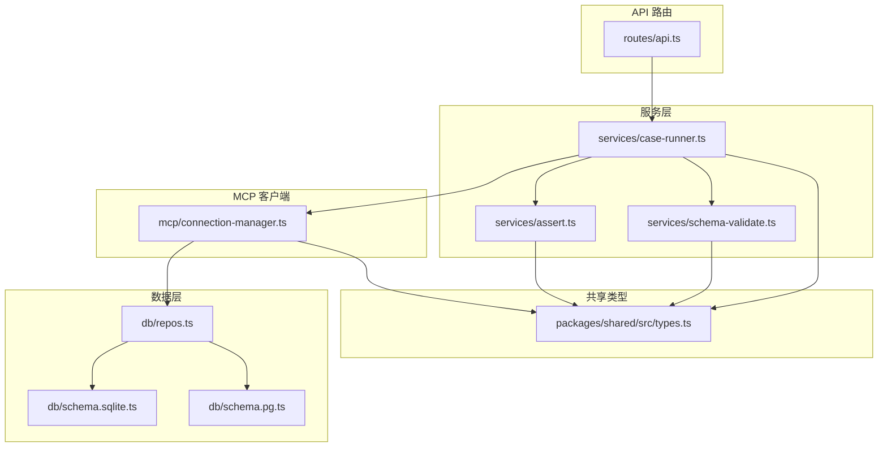
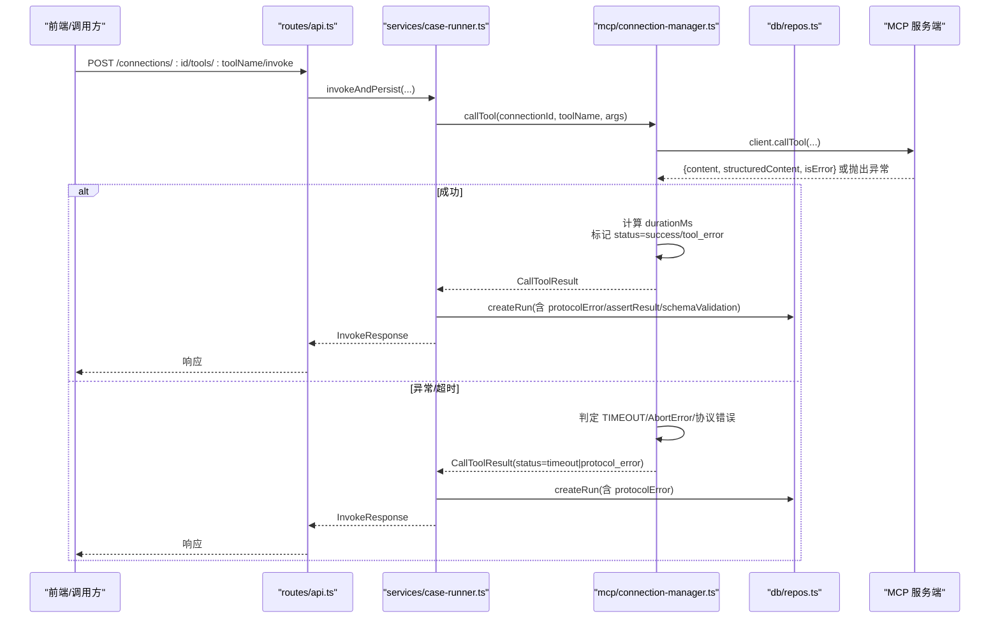
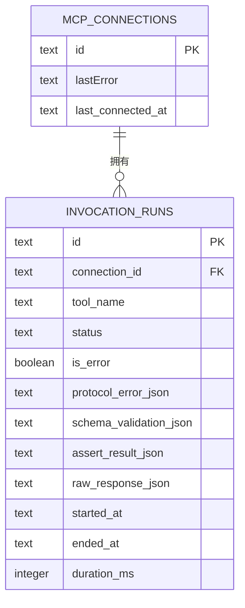
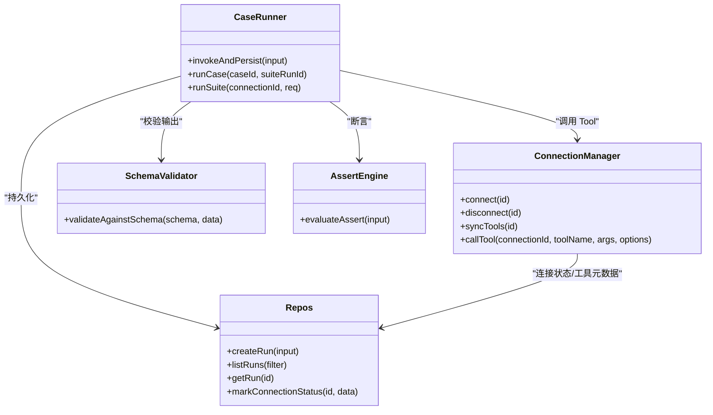
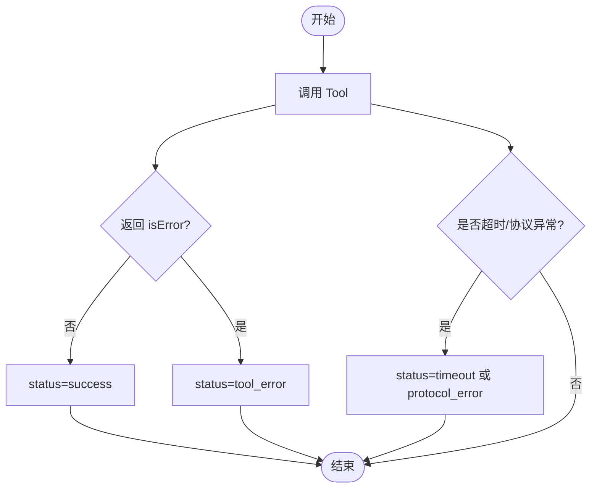

# 错误诊断与分类

<cite>
**本文引用的文件**   
- [connection-manager.ts](file://apps/server/src/mcp/connection-manager.ts)
- [case-runner.ts](file://apps/server/src/services/case-runner.ts)
- [schema-validate.ts](file://apps/server/src/services/schema-validate.ts)
- [assert.ts](file://apps/server/src/services/assert.ts)
- [types.ts](file://packages/shared/src/types.ts)
- [repos.ts](file://apps/server/src/db/repos.ts)
- [api.ts](file://apps/server/src/routes/api.ts)
- [schema.sqlite.ts](file://apps/server/src/db/schema.sqlite.ts)
- [schema.pg.ts](file://apps/server/src/db/schema.pg.ts)
</cite>

## 目录
1. [简介](#简介)
2. [项目结构](#项目结构)
3. [核心组件](#核心组件)
4. [架构总览](#架构总览)
5. [详细组件分析](#详细组件分析)
6. [依赖关系分析](#依赖关系分析)
7. [性能考量](#性能考量)
8. [故障排查指南](#故障排查指南)
9. [结论](#结论)
10. [附录](#附录)

## 简介
本文件聚焦 MCP Tool Debug 的错误诊断与分类能力，系统化阐述以下方面：
- 错误分类体系：协议错误、连接错误、Tool 执行错误、超时错误、Schema 校验错误、断言失败
- 识别规则、错误码定义与诊断信息收集
- 错误消息格式化、堆栈跟踪与上下文展示
- 错误日志记录、调试输出与故障排查流程
- 常见错误场景的分析方法与解决方案
- 错误状态的持久化存储与历史查询
- 如何扩展新的错误类型与处理逻辑

## 项目结构
围绕错误诊断与分类的关键代码分布在服务层、MCP 客户端封装、共享类型与数据库持久化层：
- 服务层：用例运行编排、断言评估、Schema 校验
- MCP 客户端封装：连接管理、会话恢复、调用与错误分类
- 共享类型：统一的状态枚举、结果结构与校验结果
- 数据层：运行记录、连接状态、工具元数据的持久化与查询

图表来源
- [api.ts:117-138](file://apps/server/src/routes/api.ts#L117-L138)
- [case-runner.ts:11-77](file://apps/server/src/services/case-runner.ts#L11-L77)
- [connection-manager.ts:300-379](file://apps/server/src/mcp/connection-manager.ts#L300-L379)
- [assert.ts:58-165](file://apps/server/src/services/assert.ts#L58-L165)
- [schema-validate.ts:27-60](file://apps/server/src/services/schema-validate.ts#L27-L60)
- [repos.ts:476-527](file://apps/server/src/db/repos.ts#L476-L527)
- [schema.sqlite.ts:81-111](file://apps/server/src/db/schema.sqlite.ts#L81-L111)
- [schema.pg.ts:88-118](file://apps/server/src/db/schema.pg.ts#L88-L118)
- [types.ts:5-10](file://packages/shared/src/types.ts#L5-L10)

章节来源
- [api.ts:117-138](file://apps/server/src/routes/api.ts#L117-L138)
- [case-runner.ts:11-77](file://apps/server/src/services/case-runner.ts#L11-L77)
- [connection-manager.ts:300-379](file://apps/server/src/mcp/connection-manager.ts#L300-L379)
- [assert.ts:58-165](file://apps/server/src/services/assert.ts#L58-L165)
- [schema-validate.ts:27-60](file://apps/server/src/services/schema-validate.ts#L27-L60)
- [repos.ts:476-527](file://apps/server/src/db/repos.ts#L476-L527)
- [schema.sqlite.ts:81-111](file://apps/server/src/db/schema.sqlite.ts#L81-L111)
- [schema.pg.ts:88-118](file://apps/server/src/db/schema.pg.ts#L88-L118)
- [types.ts:5-10](file://packages/shared/src/types.ts#L5-L10)

## 核心组件
- 连接管理器（ConnectionManager）
  - 负责建立/维护 MCP 会话、自动重试与恢复、调用 Tool 并统一产出结构化结果与错误分类
  - 关键方法：connect、ensureConnected、callTool、withSessionRecovery
- 用例运行器（case-runner）
  - 编排一次调用：发起调用、可选断言、Schema 校验、持久化运行记录
- Schema 校验器（schema-validate）
  - 基于 AJV 对 structuredContent 进行 JSON Schema 校验，返回标准化错误列表
- 断言引擎（assert）
  - 根据 AssertConfig 逐项检查，生成断言检查结果集
- 数据仓库（repos）
  - 持久化连接状态、工具元数据、测试用例、套件运行与单次调用记录
- 共享类型（types）
  - 统一定义 RunStatus、AssertResult、SchemaValidationResult 等

章节来源
- [connection-manager.ts:39-383](file://apps/server/src/mcp/connection-manager.ts#L39-L383)
- [case-runner.ts:11-77](file://apps/server/src/services/case-runner.ts#L11-L77)
- [schema-validate.ts:27-60](file://apps/server/src/services/schema-validate.ts#L27-L60)
- [assert.ts:58-165](file://apps/server/src/services/assert.ts#L58-L165)
- [repos.ts:476-527](file://apps/server/src/db/repos.ts#L476-L527)
- [types.ts:5-10](file://packages/shared/src/types.ts#L5-L10)

## 架构总览
下图展示了从 API 到 MCP 服务端的一次调用全流程，以及错误在各个环节的捕获与分类。

图表来源
- [api.ts:117-138](file://apps/server/src/routes/api.ts#L117-L138)
- [case-runner.ts:11-77](file://apps/server/src/services/case-runner.ts#L11-L77)
- [connection-manager.ts:300-379](file://apps/server/src/mcp/connection-manager.ts#L300-L379)
- [repos.ts:476-527](file://apps/server/src/db/repos.ts#L476-L527)

## 详细组件分析

### 错误分类体系与识别规则
系统通过统一的 RunStatus 与结构化字段对错误进行分类与诊断：
- 运行状态（RunStatus）
  - success：正常完成
  - tool_error：服务端返回 isError=true 的业务错误
  - protocol_error：底层通信/协议异常
  - timeout：调用超时
  - cancelled：取消（当前实现未显式设置，保留扩展）
- 结构化字段
  - isError：布尔标志，便于快速判断是否异常
  - protocolError：协议错误详情（message、code）
  - schemaValidation：Schema 校验结果（ok、errors）
  - assertResult：断言结果（passed、checks[]）
  - rawResponse：原始响应（便于回溯）

识别规则要点：
- 超时错误：当触发 AbortController 或出现 AbortError/包含“timed out”的消息时，标记为 timeout
- 协议错误：除超时外的任何异常均归类为 protocol_error，并附带 message/code
- Tool 执行错误：SDK 返回 isError=true 时，status=tool_error
- Schema 校验错误：由 schema-validate 返回 errors 列表，供断言与 UI 展示
- 断言失败：evaluateAssert 产出的 checks 中任一失败即整体失败

章节来源
- [types.ts:5-10](file://packages/shared/src/types.ts#L5-L10)
- [connection-manager.ts:300-379](file://apps/server/src/mcp/connection-manager.ts#L300-L379)
- [schema-validate.ts:27-60](file://apps/server/src/services/schema-validate.ts#L27-L60)
- [assert.ts:58-165](file://apps/server/src/services/assert.ts#L58-L165)

### 错误码定义与诊断信息
- 超时错误码：TIMEOUT（自定义），同时兼容 AbortError
- 协议错误码：来自底层 SDK 的 HTTP 状态码（如 404 表示会话过期），或在 markSessionUnavailable 中拼接为 “HTTP <code>: <detail>”
- 诊断信息：
  - protocolError.message：人类可读的错误描述
  - protocolError.code：结构化错误码（TIMEOUT、HTTP 状态码等）
  - schemaValidation.errors：数组，每项包含 path 与 message
  - assertResult.checks：逐项断言结果，包含 name、expected、actual、message

章节来源
- [connection-manager.ts:300-379](file://apps/server/src/mcp/connection-manager.ts#L300-L379)
- [connection-manager.ts:197-207](file://apps/server/src/mcp/connection-manager.ts#L197-L207)
- [schema-validate.ts:27-60](file://apps/server/src/services/schema-validate.ts#L27-L60)
- [assert.ts:58-165](file://apps/server/src/services/assert.ts#L58-L165)

### 错误消息格式化、堆栈跟踪与上下文展示
- 消息格式化
  - 连接错误：markConnectionStatus 将 lastError 写入连接记录；UI 可通过连接对象查看最近错误
  - 协议错误：统一包装为 {message, code}，便于前端渲染
  - Schema 校验错误：规范化为 {path, message} 列表，支持路径定位
  - 断言失败：每个 check 提供 expected/actual/message，便于对比
- 堆栈跟踪
  - 当前实现未捕获并持久化堆栈；建议在 catch 块中附加 err.stack 到 protocolError.stack 以便排查
- 上下文信息
  - InvocationRun 已保存 requestArguments、resultContent、structuredContent、rawResponse、durationMs、startedAt/endedAt，可作为强上下文

章节来源
- [repos.ts:288-312](file://apps/server/src/db/repos.ts#L288-L312)
- [repos.ts:476-527](file://apps/server/src/db/repos.ts#L476-L527)
- [connection-manager.ts:300-379](file://apps/server/src/mcp/connection-manager.ts#L300-L379)

### 错误日志记录与调试输出
- 控制台日志
  - 会话恢复事件：mcp_session_recovery_started/succeeded/failed（JSON 格式）
- 建议增强
  - 增加结构化日志（包含 connectionId、toolName、runId、status、error.code）
  - 将堆栈信息附加到 protocolError.stack 并持久化

章节来源
- [connection-manager.ts:209-268](file://apps/server/src/mcp/connection-manager.ts#L209-L268)

### 错误状态的持久化存储与历史查询
- 连接级错误
  - mcp_connections.lastError：最近一次连接错误摘要
- 调用级错误
  - invocation_runs.status：success/tool_error/protocol_error/timeout
  - invocation_runs.isError：布尔标志
  - invocation_runs.protocolErrorJson：协议错误详情
  - invocation_runs.schemaValidationJson：Schema 校验结果
  - invocation_runs.assertResultJson：断言结果
  - invocation_runs.rawResponseJson：原始响应
- 查询接口
  - GET /runs：支持按 connectionId、toolName、suiteRunId、status 过滤
  - GET /runs/:id：获取单条运行详情
  - GET /suite-runs/:id：获取套件运行及其子运行列表

图表来源
- [schema.sqlite.ts:3-17](file://apps/server/src/db/schema.sqlite.ts#L3-L17)
- [schema.sqlite.ts:81-111](file://apps/server/src/db/schema.sqlite.ts#L81-L111)
- [schema.pg.ts:10-24](file://apps/server/src/db/schema.pg.ts#L10-L24)
- [schema.pg.ts:88-118](file://apps/server/src/db/schema.pg.ts#L88-L118)
- [repos.ts:530-552](file://apps/server/src/db/repos.ts#L530-L552)
- [api.ts:205-225](file://apps/server/src/routes/api.ts#L205-L225)

章节来源
- [repos.ts:288-312](file://apps/server/src/db/repos.ts#L288-L312)
- [repos.ts:476-527](file://apps/server/src/db/repos.ts#L476-L527)
- [repos.ts:530-552](file://apps/server/src/db/repos.ts#L530-L552)
- [api.ts:205-225](file://apps/server/src/routes/api.ts#L205-L225)

### 常见错误场景分析与解决方案
- 连接错误
  - 现象：lastError 非空，无法列出工具或调用失败
  - 排查：确认 URL、传输类型（streamable_http/sse）、认证头；查看 markConnectionStatus 记录的 lastError
  - 解决：修正连接配置或网络策略
- 协议错误（HTTP 404 会话过期）
  - 现象：调用抛 StreamableHTTPError(code=404)
  - 机制：withSessionRecovery 自动丢弃旧会话并重连，若仍失败则标记不可用
  - 解决：检查服务端会话生命周期与鉴权刷新策略
- 超时错误
  - 现象：status=timeout，protocolError.code=TIMEOUT
  - 排查：增大 timeoutMs 或优化服务端处理；关注 durationMs
  - 解决：调整连接配置的 timeoutMs 或服务端性能
- Tool 执行错误
  - 现象：status=tool_error，isError=true
  - 排查：查看 resultContent/rawResponse 与服务端业务日志
  - 解决：修正输入参数或服务端逻辑
- Schema 校验错误
  - 现象：schemaValidation.ok=false，errors 列表包含 path/message
  - 排查：对照 outputSchema 与返回的 structuredContent
  - 解决：修复服务端输出结构或更新 Schema
- 断言失败
  - 现象：assertResult.passed=false，checks 中有失败项
  - 排查：逐项检查 expected/actual/message
  - 解决：修正断言条件或目标行为

章节来源
- [connection-manager.ts:175-207](file://apps/server/src/mcp/connection-manager.ts#L175-L207)
- [connection-manager.ts:300-379](file://apps/server/src/mcp/connection-manager.ts#L300-L379)
- [schema-validate.ts:27-60](file://apps/server/src/services/schema-validate.ts#L27-L60)
- [assert.ts:58-165](file://apps/server/src/services/assert.ts#L58-L165)

### 扩展新错误类型与处理逻辑
- 新增错误码
  - 在 connection-manager 的 catch 分支中识别新错误特征（例如特定 message 模式或 error.code），并映射到合适的 RunStatus
- 扩展诊断字段
  - 在 CallToolResult 与 InvocationRun 中追加字段（如 stack、traceId），并在 repos.createRun 中持久化
- 增强断言
  - 在 evaluateAssert 中新增检查项（如 contentTextRegex、jsonPathExists），并在 AssertConfig 中声明
- 增强 Schema 校验
  - 在 validateAgainstSchema 中扩展错误聚合或添加自定义格式化
- 日志与可观测性
  - 在关键路径输出结构化日志（包含 connectionId、toolName、runId、status、error.code）

章节来源
- [connection-manager.ts:300-379](file://apps/server/src/mcp/connection-manager.ts#L300-L379)
- [repos.ts:476-527](file://apps/server/src/db/repos.ts#L476-L527)
- [assert.ts:58-165](file://apps/server/src/services/assert.ts#L58-L165)
- [schema-validate.ts:27-60](file://apps/server/src/services/schema-validate.ts#L27-L60)

## 依赖关系分析
- 低耦合高内聚
  - case-runner 仅依赖 connection-manager 的调用结果，不关心具体错误来源
  - schema-validate 与 assert 是纯函数，易于单元测试
- 外部依赖
  - @modelcontextprotocol/sdk：用于 MCP 客户端与传输层错误
  - ajv：JSON Schema 校验
- 潜在循环依赖
  - 当前无循环依赖；各模块职责清晰

图表来源
- [connection-manager.ts:39-383](file://apps/server/src/mcp/connection-manager.ts#L39-L383)
- [case-runner.ts:11-77](file://apps/server/src/services/case-runner.ts#L11-L77)
- [schema-validate.ts:27-60](file://apps/server/src/services/schema-validate.ts#L27-L60)
- [assert.ts:58-165](file://apps/server/src/services/assert.ts#L58-L165)
- [repos.ts:476-527](file://apps/server/src/db/repos.ts#L476-L527)

章节来源
- [connection-manager.ts:39-383](file://apps/server/src/mcp/connection-manager.ts#L39-L383)
- [case-runner.ts:11-77](file://apps/server/src/services/case-runner.ts#L11-L77)
- [schema-validate.ts:27-60](file://apps/server/src/services/schema-validate.ts#L27-L60)
- [assert.ts:58-165](file://apps/server/src/services/assert.ts#L58-L165)
- [repos.ts:476-527](file://apps/server/src/db/repos.ts#L476-L527)

## 性能考量
- 并发控制
  - withQueue 保证同一连接串行调用，避免竞态与资源争用
- 超时控制
  - 使用 AbortController 与 Promise.race 实现超时，避免长时间阻塞
- 会话恢复
  - 针对 HTTP 404 的会话过期自动重连，减少人工干预
- 批量运行
  - runSuite 使用 mapPool 并行执行用例，提升吞吐

章节来源
- [connection-manager.ts:51-67](file://apps/server/src/mcp/connection-manager.ts#L51-L67)
- [connection-manager.ts:300-379](file://apps/server/src/mcp/connection-manager.ts#L300-L379)
- [case-runner.ts:94-109](file://apps/server/src/services/case-runner.ts#L94-L109)

## 故障排查指南
- 快速定位
  - 查看连接 lastError 与最近运行 status/isError
  - 打开对应 run 的 protocolError、schemaValidation、assertResult
- 典型步骤
  - 连接问题：核对 URL、transport、headers；尝试手动 connect 并观察 lastError
  - 协议错误：检查服务端日志与 HTTP 状态码；必要时重启服务或刷新鉴权
  - 超时：增大 timeoutMs，检查服务端耗时与负载
  - Schema 校验：比对 outputSchema 与实际返回；必要时修正服务端输出
  - 断言失败：逐项检查 checks 的 expected/actual/message
- 日志采集
  - 收集控制台中的 mcp_session_recovery_* 事件
  - 建议增加结构化日志与堆栈持久化

章节来源
- [repos.ts:288-312](file://apps/server/src/db/repos.ts#L288-L312)
- [repos.ts:530-552](file://apps/server/src/db/repos.ts#L530-L552)
- [connection-manager.ts:209-268](file://apps/server/src/mcp/connection-manager.ts#L209-L268)

## 结论
本系统通过统一的错误分类、结构化诊断信息与完善的持久化机制，提供了端到端的错误诊断能力。未来可在堆栈追踪、结构化日志与断言能力上进一步增强，以提升复杂问题的定位效率。

## 附录

### 错误分类流程图（概念）

[此图为概念流程，不直接映射具体源码]