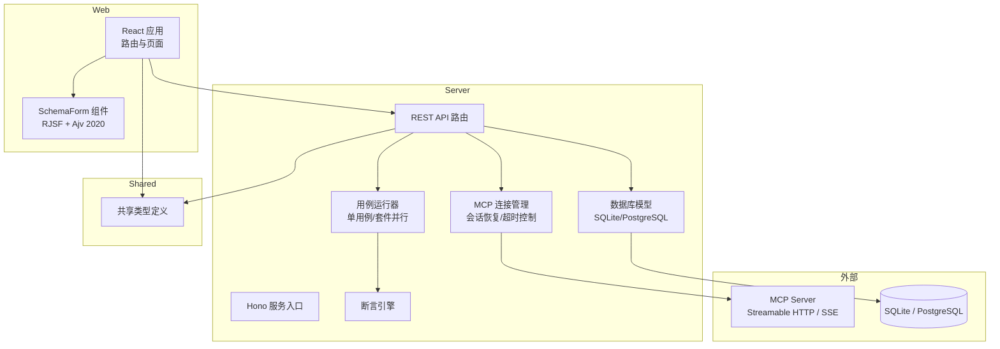
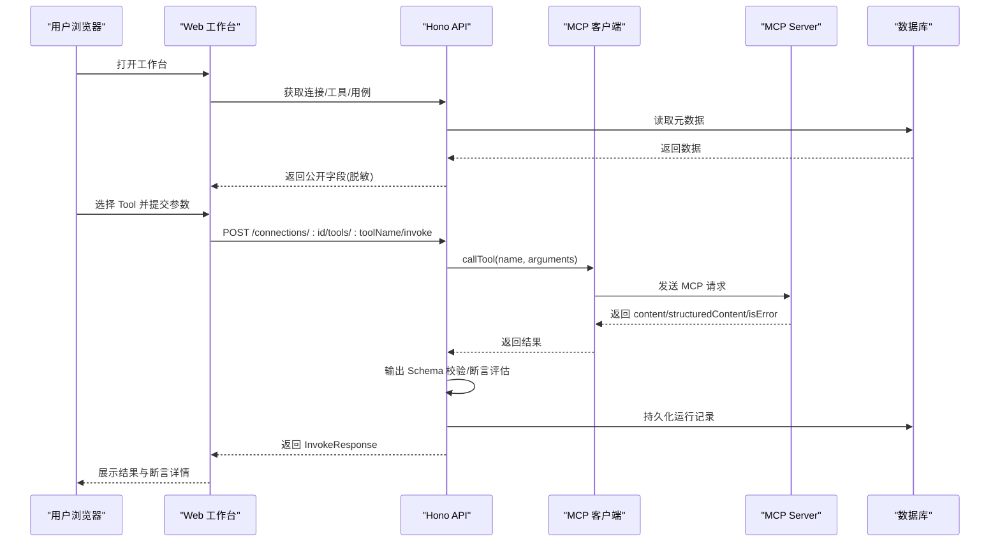
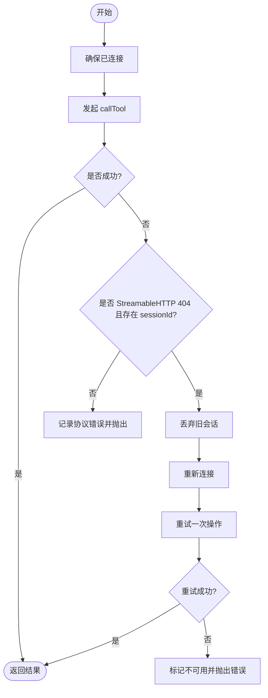
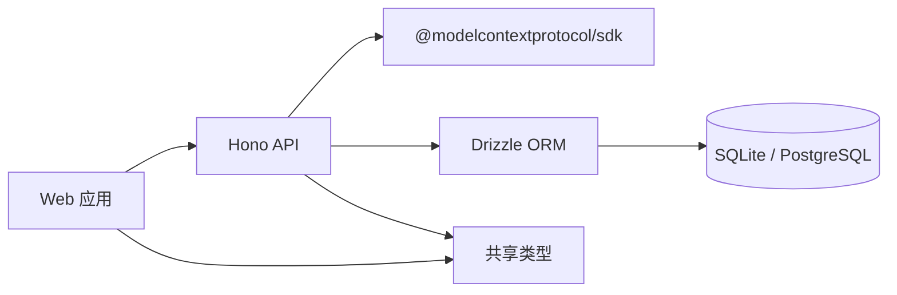

# 项目介绍

<cite>
**本文引用的文件列表**
- [README.md](file://README.md)
- [package.json](file://package.json)
- [apps/server/src/index.ts](file://apps/server/src/index.ts)
- [apps/server/src/routes/api.ts](file://apps/server/src/routes/api.ts)
- [apps/server/src/mcp/connection-manager.ts](file://apps/server/src/mcp/connection-manager.ts)
- [apps/server/src/services/case-runner.ts](file://apps/server/src/services/case-runner.ts)
- [apps/server/src/services/assert.ts](file://apps/server/src/services/assert.ts)
- [apps/server/src/db/schema.sqlite.ts](file://apps/server/src/db/schema.sqlite.ts)
- [packages/shared/src/types.ts](file://packages/shared/src/types.ts)
- [apps/web/src/App.tsx](file://apps/web/src/App.tsx)
- [apps/web/src/pages/WorkbenchPage.tsx](file://apps/web/src/pages/WorkbenchPage.tsx)
- [apps/web/src/components/SchemaForm.tsx](file://apps/web/src/components/SchemaForm.tsx)
- [deployment/README.md](file://deployment/README.md)
</cite>

## 目录
1. [简介](#简介)
2. [项目结构](#项目结构)
3. [核心组件](#核心组件)
4. [架构总览](#架构总览)
5. [详细组件分析](#详细组件分析)
6. [依赖关系分析](#依赖关系分析)
7. [性能与可用性考量](#性能与可用性考量)
8. [故障排查指南](#故障排查指南)
9. [结论](#结论)
10. [附录](#附录)

## 简介
MCP Tool Debug 是一个可自托管的 Web 调试台，用于连接、检查、调用和自动化测试 Model Context Protocol（MCP）Tools。它将 MCP Inspector、JSON Schema 2020-12 动态表单、结果诊断、测试用例与回归执行整合到统一界面中，帮助开发者快速定位问题并稳定复现。

为什么需要专门的 MCP 调试工具？
- 复杂 inputSchema 的手写 JSON 容易出错：本项目基于 JSON Schema 2020-12 自动生成表单，支持 oneOf/anyOf、嵌套对象与数组，并提供 JSON 编辑模式作为补充。
- 协议错误与 Tool 错误难以区分：系统明确区分协议/连接错误、Tool 执行错误、超时与 Schema 校验错误，便于快速定位。
- 结构化内容展示困难：同时展示 content、structuredContent、原始响应与输出 Schema 校验结果，提升可读性与可诊断性。
- 调通一次后无法稳定复现：将参数保存为测试用例，配置断言，批量执行回归测试，沉淀团队资产。
- 远程 Streamable HTTP Session 会过期：遵循 MCP 会话规范，在 Session 404 时自动重新初始化并安全重试一次。
- 团队共享环境需求：支持连接/用例导入导出，默认 SQLite，也可切换 PostgreSQL。

适用场景
- MCP Server 开发：提交前快速验证 Tool Schema、参数、返回内容与错误语义。
- MCP Client / Agent 集成：排查 Streamable HTTP、SSE、Headers、超时与会话生命周期问题。
- QA 与回归测试：把手动调试参数沉淀为断言用例，批量验证多个 Tools。
- 团队共享测试环境：通过 Docker 与 PostgreSQL 部署统一的 MCP 调试入口。
- Schema 兼容性验证：检查 JSON Schema 2020-12、oneOf/anyOf、required 与 outputSchema。

章节来源
- [README.md:1-193](file://README.md#L1-L193)

## 项目结构
仓库采用 monorepo 组织方式，包含后端 API、前端 Web UI、共享类型包以及部署脚本。

图表来源
- [apps/server/src/index.ts:1-39](file://apps/server/src/index.ts#L1-L39)
- [apps/server/src/routes/api.ts:1-277](file://apps/server/src/routes/api.ts#L1-L277)
- [apps/server/src/mcp/connection-manager.ts:1-383](file://apps/server/src/mcp/connection-manager.ts#L1-L383)
- [apps/server/src/services/case-runner.ts:1-161](file://apps/server/src/services/case-runner.ts#L1-L161)
- [apps/server/src/services/assert.ts:1-166](file://apps/server/src/services/assert.ts#L1-L166)
- [apps/server/src/db/schema.sqlite.ts:1-120](file://apps/server/src/db/schema.sqlite.ts#L1-L120)
- [packages/shared/src/types.ts:1-229](file://packages/shared/src/types.ts#L1-L229)
- [apps/web/src/App.tsx:1-66](file://apps/web/src/App.tsx#L1-L66)
- [apps/web/src/components/SchemaForm.tsx:1-421](file://apps/web/src/components/SchemaForm.tsx#L1-L421)

章节来源
- [package.json:1-48](file://package.json#L1-L48)
- [apps/server/src/index.ts:1-39](file://apps/server/src/index.ts#L1-L39)
- [apps/web/src/App.tsx:1-66](file://apps/web/src/App.tsx#L1-L66)

## 核心组件
- 连接管理（ConnectionManager）
  - 负责建立与维护 MCP 客户端会话，支持 Streamable HTTP 与 SSE，具备自动回退与 404 会话恢复能力。
  - 提供工具同步与调用封装，统一处理超时、协议错误与结构化输出校验。
- REST API（routes/api.ts）
  - 暴露连接、工具、用例、运行记录与导入导出的接口；对敏感 Header 值进行脱敏处理。
- 用例运行器（case-runner.ts）
  - 封装单次调用与持久化、单用例执行、套件并行执行与统计。
- 断言引擎（assert.ts）
  - 实现结构化匹配、文本包含/排除、最大耗时、JSONPath 相等与 Schema 有效性等断言。
- 动态表单（SchemaForm.tsx）
  - 基于 RJSF 6 与 Ajv 2020，增强 oneOf/anyOf 渲染体验，支持表单与 JSON 双模式。
- 数据模型（schema.sqlite.ts）
  - 使用 Drizzle ORM 定义连接、工具、用例、套件与运行记录的表结构。
- 共享类型（types.ts）
  - 统一定义前后端交互的数据结构与状态枚举。

章节来源
- [apps/server/src/mcp/connection-manager.ts:1-383](file://apps/server/src/mcp/connection-manager.ts#L1-L383)
- [apps/server/src/routes/api.ts:1-277](file://apps/server/src/routes/api.ts#L1-L277)
- [apps/server/src/services/case-runner.ts:1-161](file://apps/server/src/services/case-runner.ts#L1-L161)
- [apps/server/src/services/assert.ts:1-166](file://apps/server/src/services/assert.ts#L1-L166)
- [apps/web/src/components/SchemaForm.tsx:1-421](file://apps/web/src/components/SchemaForm.tsx#L1-L421)
- [apps/server/src/db/schema.sqlite.ts:1-120](file://apps/server/src/db/schema.sqlite.ts#L1-L120)
- [packages/shared/src/types.ts:1-229](file://packages/shared/src/types.ts#L1-L229)

## 架构总览
整体架构由 React Web 工作台、Hono API 服务、MCP TypeScript SDK 客户端与 SQLite/PostgreSQL 组成。Web 通过 REST API 与后端交互，后端通过 MCP SDK 与目标 MCP Server 通信，并将运行结果与元数据持久化。

图表来源
- [apps/web/src/pages/WorkbenchPage.tsx:101-122](file://apps/web/src/pages/WorkbenchPage.tsx#L101-L122)
- [apps/server/src/routes/api.ts:117-138](file://apps/server/src/routes/api.ts#L117-L138)
- [apps/server/src/mcp/connection-manager.ts:300-379](file://apps/server/src/mcp/connection-manager.ts#L300-L379)
- [apps/server/src/services/case-runner.ts:11-77](file://apps/server/src/services/case-runner.ts#L11-L77)

## 详细组件分析

### 连接管理与会话恢复
- 连接建立
  - 根据配置的传输类型尝试 Streamable HTTP 或 SSE，失败则按顺序回退。
  - 记录连接时间、服务器信息与最后错误。
- 会话恢复
  - 当检测到 Streamable HTTP 404 且存在 sessionId 时，判定为会话过期。
  - 丢弃旧会话，重新初始化并仅重试一次，避免无限重试。
- 超时控制
  - 使用 AbortController 与 Promise.race 实现调用级超时，区分 TIMEOUT 与协议错误。
- 并发与队列
  - 每个连接维护一个串行队列，避免同一连接的并发冲突。

图表来源
- [apps/server/src/mcp/connection-manager.ts:175-268](file://apps/server/src/mcp/connection-manager.ts#L175-L268)
- [apps/server/src/mcp/connection-manager.ts:300-379](file://apps/server/src/mcp/connection-manager.ts#L300-L379)

章节来源
- [apps/server/src/mcp/connection-manager.ts:1-383](file://apps/server/src/mcp/connection-manager.ts#L1-L383)

### REST API 与数据脱敏
- 健康检查
  - 返回当前方言、在线连接数等基础信息。
- 连接管理
  - 增删改查连接，连接/断开与同步 Tools。
  - 对外只返回 headerNames，不返回实际值，降低凭据泄露风险。
- 工具与调用
  - 列出与查询 Tools，调用 Tool 并持久化运行记录。
- 用例与套件
  - 创建/更新/删除用例，运行单个用例或按条件并行运行套件。
- 历史记录
  - 查询与删除运行记录，支持按连接、工具、套件过滤。
- 导入导出
  - 导出连接与用例（含完整凭据），导入重建环境。

章节来源
- [apps/server/src/routes/api.ts:1-277](file://apps/server/src/routes/api.ts#L1-L277)

### 断言引擎与结果诊断
- 断言项
  - expectIsError：期望是否为错误。
  - expectStructured：期望是否存在结构化内容。
  - structuredEquals：部分深比较匹配。
  - structuredSchemaValid：输出 Schema 校验是否通过。
  - contentTextContains/NotContains：文本包含/不包含。
  - maxDurationMs：最大耗时阈值。
  - jsonPathEquals：JSONPath 路径值相等。
- 结果诊断
  - 将断言逐项评估，生成通过/失败明细与消息，便于定位问题。

章节来源
- [apps/server/src/services/assert.ts:1-166](file://apps/server/src/services/assert.ts#L1-L166)
- [packages/shared/src/types.ts:19-46](file://packages/shared/src/types.ts#L19-L46)

### 动态表单与 Schema 增强
- 表单驱动
  - 基于 RJSF 6 与 Ajv 2020，支持 JSON Schema 2020-12 特性。
- oneOf/anyOf 增强
  - 将父级公共字段复制到分支以正确显示受控字段。
  - 隐藏 const 判别字段，自动生成选项标题与描述。
- 双模式编辑
  - 表单与 JSON 模式可切换，JSON 模式提供实时解析与错误提示。

章节来源
- [apps/web/src/components/SchemaForm.tsx:1-421](file://apps/web/src/components/SchemaForm.tsx#L1-L421)

### 数据模型与持久化
- 表结构
  - mcp_connections：连接元数据与状态。
  - mcp_tools：工具清单与 Schema。
  - test_cases：测试用例与断言配置。
  - suite_runs：套件运行概览。
  - invocation_runs：单次调用历史与结果。
- 索引与约束
  - 针对连接+工具名唯一、常用查询列建立索引，优化检索性能。

章节来源
- [apps/server/src/db/schema.sqlite.ts:1-120](file://apps/server/src/db/schema.sqlite.ts#L1-L120)

### 前端工作流
- 路由与页面
  - 连接、工作台、自动化、设置四大模块。
- 工作台流程
  - 选择 Tool → 填写参数（表单/JSON）→ 调用 → 查看结果与断言 → 保存用例 → 运行套件。
- 结果展示
  - 展示 content、structuredContent、原始响应、耗时与 Schema 校验结果。

章节来源
- [apps/web/src/App.tsx:1-66](file://apps/web/src/App.tsx#L1-L66)
- [apps/web/src/pages/WorkbenchPage.tsx:1-541](file://apps/web/src/pages/WorkbenchPage.tsx#L1-541)

## 依赖关系分析
- 技术栈
  - 前端：React 18、Ant Design 5、RJSF 6、Ajv 8、CodeMirror。
  - 后端：Hono、@modelcontextprotocol/sdk、Drizzle ORM、SQLite/PostgreSQL。
  - 部署：Node.js 22 Alpine、Nginx、Docker Compose。
- 关键依赖关系
  - Web 通过 REST API 与后端交互，后端通过 MCP SDK 与目标 MCP Server 通信。
  - 共享类型包被前后端共同引用，保证契约一致性。
  - 数据库层通过 Drizzle ORM 抽象不同方言。

图表来源
- [package.json:1-48](file://package.json#L1-L48)
- [apps/server/src/index.ts:1-39](file://apps/server/src/index.ts#L1-L39)
- [apps/server/src/routes/api.ts:1-277](file://apps/server/src/routes/api.ts#L1-L277)
- [apps/server/src/mcp/connection-manager.ts:1-383](file://apps/server/src/mcp/connection-manager.ts#L1-L383)
- [apps/server/src/db/schema.sqlite.ts:1-120](file://apps/server/src/db/schema.sqlite.ts#L1-L120)
- [packages/shared/src/types.ts:1-229](file://packages/shared/src/types.ts#L1-L229)

章节来源
- [package.json:1-48](file://package.json#L1-L48)
- [apps/server/src/index.ts:1-39](file://apps/server/src/index.ts#L1-L39)

## 性能与可用性考量
- 连接与调用
  - 每连接串行队列避免竞争；调用级超时防止长时间阻塞。
  - 会话 404 自动恢复，减少人工干预。
- 表单与校验
  - 表单与 JSON 双模式兼顾易用性与精确性；Ajv 2020 提供严格校验。
- 并行执行
  - 套件运行支持并行度控制，平衡吞吐与稳定性。
- 存储与索引
  - 针对常用查询建立索引，提高检索效率；SQLite 适合单机与轻量团队，生产可切换 PostgreSQL。

[本节为通用指导，无需具体文件分析]

## 故障排查指南
- 连接失败
  - 检查 URL、Headers、超时配置；查看“连接”页面的 lastError 与 live 状态。
  - 若为 Streamable HTTP，确认服务端是否返回 404 导致会话过期。
- 调用超时
  - 调整 timeoutMs；观察运行记录中的 durationMs 与 status=timeout。
- 协议错误 vs Tool 错误
  - protocol_error 表示底层通信异常；isError=true 且 status=tool_error 表示业务层错误。
- Schema 校验失败
  - 查看 schemaValidation.errors，修正 input/output Schema 或参数。
- 断言失败
  - 查看断言明细 checks，定位具体失败项（如文本缺失、路径不匹配、耗时超限）。
- 导入导出
  - 导出文件包含完整凭据，请妥善保管；导入前确认目标环境可用。

章节来源
- [apps/server/src/routes/api.ts:24-30](file://apps/server/src/routes/api.ts#L24-L30)
- [apps/server/src/mcp/connection-manager.ts:175-268](file://apps/server/src/mcp/connection-manager.ts#L175-L268)
- [apps/server/src/services/assert.ts:58-166](file://apps/server/src/services/assert.ts#L58-L166)
- [apps/web/src/pages/WorkbenchPage.tsx:101-122](file://apps/web/src/pages/WorkbenchPage.tsx#L101-L122)

## 结论
MCP Tool Debug 围绕 MCP 生态的实际痛点，提供了从连接管理、Schema 驱动的表单、结果诊断、用例与回归测试到团队共享的一体化解决方案。其清晰的错误分类、会话恢复机制与强大的断言能力，显著降低了 MCP Server 开发与集成的复杂度，提升了团队协作效率与质量保障水平。

[本节为总结性内容，无需具体文件分析]

## 附录
- 快速开始
  - 本地开发：安装依赖后启动 server 与 web，访问 Web UI 与 API 健康检查。
  - Docker 部署：复制环境变量模板，使用部署脚本一键拉起服务。
- 环境变量
  - PORT、DATABASE_URL、DB_DIALECT、CORS_ORIGIN 等。
- 支持的断言
  - expectIsError、expectStructured、structuredEquals、structuredSchemaValid、contentTextContains/NotContains、maxDurationMs、jsonPathEquals。

章节来源
- [README.md:51-144](file://README.md#L51-L144)
- [deployment/README.md:1-32](file://deployment/README.md#L1-L32)